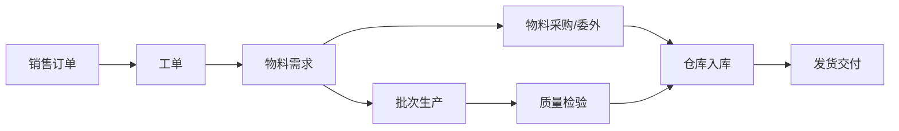

# MES系统设计总纲领

**版本：V4.2**
**最后更新：2026-08-24**
**适用范围：不锈钢无缝钢管MES系统**

---

## 一、项目概述

### 1.1 项目背景

本项目为不锈钢无缝钢管制造企业定制开发MES系统，覆盖订单管理、工单管理、批次追溯、质量检验、设备数据采集、库存管理、报表分析等核心业务模块。

### 1.2 业务目标

- 实现生产全流程数字化管理
- 建立完整的批次追溯体系
- 实现热处理等关键设备的实时数据采集
- 提升质量管理水平（SPC、质保书）
- 为管理层提供实时生产看板和报表

### 1.3 系统边界

| 包含 | 不包含 |
|------|--------|
| 订单→工单→物料需求→批次→质量→入库全流程 | 财务核算（由ERP负责） |
| 设备数据采集（PLC） | 客户关系管理（CRM） |
| 扫码执行（PDA/手机） | 人力资源管理（HR） |
| 质量检验与SPC | 设备底层自动化控制 |
| 生产报表与质保书 | 高级排程（APS） |
| 仓库管理 | |
| 设备管理 | |
| 物料采购/委外 | |

### 1.4 核心业务流程



---

## 二、技术选型

### 2.1 当前已采用技术

| 层级 | 技术 | 版本 | 说明 |
|------|------|------|------|
| 前端 | Blazor WebAssembly | .NET 8 | SPA框架 |
| UI组件 | MudBlazor | 6.19.1 | Material Design |
| 后端 | ASP.NET Core | 8 | Web API |
| ORM | EF Core | 8 | 数据访问 |
| 数据库 | SQL Server | 2022 | 主数据库 |
| 日志 | Serilog.AspNetCore | 8.0.0 | 结构化日志（包已安装，待配置） |
| 认证 | JWT + Identity | 8 | 认证授权 |
| 打印 | QuestPDF | 2026.2.4 | PDF 生成（工艺卡/标签/质保书），社区版许可 |
| 工具 | DataExchangeService | — | 数据导入导出（Web端，EPPlus + EnumHelper） |

### 2.2 规划中技术（后续版本）

| 技术 | 用途 | 规划版本 |
|------|------|----------|
| ECharts | 实时曲线、SPC控制图 | V1.5 |
| SignalR | 看板实时推送 | V2.0 |
| Snap7 | 西门子PLC数据采集 | V2.0 |
| QRCoder | 二维码生成 | V2.0 |

---

## 三、架构原则

### 3.1 整体架构

```yaml
架构模式: 三层架构（Controller-Service-Data）
部署模式: 腾讯云单机部署
前端: Blazor WASM（独立部署）
后端: ASP.NET Core Web API
通信: HTTP
```

### 3.2 分层职责

| 层级 | 职责 | 说明 |
|------|------|------|
| Controller | 接收请求、参数验证、调用Service、返回响应 | 轻薄层，不写业务逻辑 |
| Service | 核心业务逻辑、事务管理 | 厚重层，所有业务逻辑在此 |
| Repository | 直接使用EF Core DbContext | 不额外封装泛型Repository |

### 3.3 分层约束

- 禁止跨层调用（Controller不能直接调用Repository）
- 禁止在Controller中编写业务逻辑
- 禁止在实体中编写业务方法（贫血模型）

---

## 四、限界上下文划分

### 4.1 限界上下文清单

| 类型 | 上下文 | 说明 |
|------|--------|------|
| 核心上下文 | 订单上下文 | 销售合同、订单管理 |
| 核心上下文 | 工单上下文 | 生产工单、主号/次号工单号规则、定尺工单（FixedLengthWorkOrder）联通视图、7类用料计划、工单执行状况读模型 | ✅ 已实现 |
| 核心上下文 | 仓库上下文 | 库存管理、出入库、批次管理、库存批次主号（ProductionMainNo，替代项次）、定尺切割长度匹配（CutLengthMatchType） | ✅ 已实现 |
| 核心上下文 | 物料上下文 | 物料采购、委外、供应商档案（物料档案主档已删除，2026-08-18） | ✅ 已实现 |
| 核心上下文 | 批次上下文 | 生产批次、流转卡、合并投料关联（ProductionBatchInventory）、批次成切跟踪（CutRequirement/CutExecution/CutQuantity/CutDoubt/InspectionStage） | ✅ 已实现 |
| 核心上下文 | 生产标准上下文 | 标准号、牌号对照、标准牌号化学成分、工厂牌号化学成分、工厂牌号化分验证规则、牌号物理性能、子标准速览、标准号检验项要求 | ✅ V1.2 已完成 |
| 核心上下文 | 质量上下文 | 过程检验、炉号登记、成检到料、**成品检验**、**NCR不合格品**、**理化检测（9模块）**、SPC | ✅ 已完成（过程检验 + 炉号登记 + 成检到料 + **成品检验** + **NCR不合格品闭环** + **理化检测9模块**） |
| 核心上下文 | 设备上下文 | 设备台账、点检记录、保养工单、维修工单、**扫码报修** | ✅ 已实现（含扫码报修、扫码维修两步流程） |
| 核心上下文 | 计划排程上下文 | 订单总况、原锁计划、工单排程、批次计划、冷轧计划、冷轧排程、**成检计划**（工单需求调整页面已迁移至工单上下文；工段待产量/工段流转分析/段落流转分析三个查询页面已从菜单栏移除）；读模型「主号关注」（ScheduleStage 五档全主号级）、「主号计划性」（UrgencyLevel） | **✅ V4.1 已完成** |
| **支撑上下文** | **配置上下文** | **13 个参数表：工段工量天数、交货状态附加天数、系统参数、规格日产预估、重点工段日产、流转类别日产配置（SectionFlowCategorySettings）、段落日产配置（SectionParagraphConfig）、组合段落归类（CombinationGroup）、工位管理、员工管理、枚举显示配置（EnumDisplayDefinition）、字典显示配置（DictValueDefinition）、工序组定义（ProcessDefinition，含默认工段 DefaultSections）** | **✅ V3.4 已完成** |
| 支撑上下文 | 权限管理 | 角色管理（基于Identity） | |
| 支撑上下文 | 用户管理 | 用户账户、登录认证 | |
| 支撑上下文 | 审计日志 | 操作记录 | 📋 规划中 V2.0 |
| 通用上下文 | 文件存储 | 质保书、图纸 | 📋 规划中 V2.0 |
| 通用上下文 | 消息通知 | 邮件、短信 | 📋 规划中 V2.0 |
| 基础设施 | 认证授权 | 登录/登出/令牌刷新/JWT认证 | |
| 基础设施 | 数据交换 | Excel导入导出、数据修复 | ✅ 已实现 |
| 基础设施 | 扫码执行 | 扫码报工/过程检验/成品检验（跨批次/质量/仓库） | ✅ 已实现（V3.0） |

### 4.2 上下文依赖关系

```yaml
依赖方向（被依赖 → 依赖者）:
支撑上下文 ← 所有上下文

具体依赖:
  - 工单 → 订单（字符串，无物理FK）
  - 批次 → 工单
  - 质量 → 批次
  - 仓库 → 批次
  - 物料 → 工单
  - 计划排程 → 工单（基于 WorkOrderExecutionSummary 读模型）
  - 批次 → 配置（引用 StandardWorkDays + StandardWorkDayDeliveryStates + ConfigParameters）
  - 用料计划 → 配置（引用 StandardWorkDays + StandardWorkDayDeliveryStates + ConfigParameters）
  - 工单/批次/仓库/物料/质量/订单 → 配置（引用 ConfigParameters 业务参数）
  - 所有上下文 → 配置（引用枚举显示/字典显示配置/工序组定义，显示层参数化）
```

---

## 五、设计原则

### 5.1 SOLID原则

- 单一职责：每个类只负责一个功能
- 开闭原则：对扩展开放，对修改关闭
- 里氏替换：子类可替换父类
- 接口隔离：接口要小而专
- 依赖倒置：依赖抽象，不依赖具体

### 5.2 其他原则

| 原则 | 说明 |
|------|------|
| DRY | 不重复自己，公共逻辑抽取到公用方法 |
| 高内聚低耦合 | 模块内部紧密，模块之间松散 |
| 契约优先 | 先定义接口，再实现 |

---

## 六、数据设计原则

### 6.1 表命名规范

| 类型 | 命名规则 | 示例 |
|------|----------|------|
| 实体表 | 单数形式，PascalCase | SalesOrder, WorkOrder |
| 关联表 | 两个表名组合 | UserRole |

### 6.2 字段规范

| 字段类型 | 命名规则 | 说明 |
|----------|----------|------|
| 主键 | Id | 自增INT |
| 外键 | 主表名+Id | WorkOrderId |
| 时间字段 | 以Time结尾 | CreatedTime, UpdatedTime |
| 状态字段 | Status | 使用枚举 |
| 删除标记 | IsDeleted | BIT类型，默认0（代码层面已移除该属性，数据库列保留） |

### 6.3 必备审计字段

```sql
-- 每张表必须包含以下字段（DateTimeOffset 映射为 SQL Server datetimeoffset）
CreatedTime DATETIMEOFFSET DEFAULT SYSDATETIMEOFFSET(),
CreatedBy NVARCHAR(50),
UpdatedTime DATETIMEOFFSET,
UpdatedBy NVARCHAR(50),
IsDeleted BIT DEFAULT 0
```

### 6.4 索引规范

- 主键自动创建聚集索引
- 外键列必须创建非聚集索引
- 常用查询条件列创建索引

### 6.5 主键设计

- 统一使用自增INT作为代理主键
- 不使用业务字段作为主键
- 业务唯一标识（如订单号）使用唯一索引

### 6.6 数据类型映射

| C# 类型 | SQL Server 类型 | 说明 |
|---------|-----------------|------|
| int | int | 整数（主键、数量） |
| long | bigint | 长整数 |
| string | nvarchar(长度) | 变长字符串 |
| decimal | decimal(18,4) | 金额、密度 |
| decimal | decimal(18,3) | 外径、壁厚、重量 |
| decimal | decimal(18,2) | 长度、米数 |
| bool | bit | 布尔值 |
| DateTime | datetime | 业务日期 |
| DateTimeOffset | datetimeoffset | 审计字段（BaseEntity 时间戳） |
| byte[] | timestamp | 乐观并发控制 |
| enum | int/nvarchar | 枚举默认通过 `HasConversion<string>()` 存储为字符串；例外：WorkOrder.MaterialPlanStatus 存储为 int |

### 6.7 通用枚举定义

| 枚举 | 说明 |
|------|------|
| SalesOrderStatus | 订单状态：Pending, Confirmed, Cancelled |
| WorkOrderStatus | 工单状态：NotGenerated, Confirmed, Pending, Cancelled |
| SectionOutsourceStatus | 工段委外状态（PendingRecovery/Recovered） |
| CustomerStatus | 客户状态：Active, Inactive |
| LengthStatus | 长度状态：Fixed, Range, NonFixed |
| SettlementMethod | 结算方式：Weighing, WeighingNegative, Theoretical |
| DeliveryState | 交货状态：固溶酸洗、光亮、硬态等 |
| RequirementType | 产品要求类型：Normal, Special |
| ~~NotificationChangeType~~ | ~~订单变更通知类型~~（已废弃删除，新通知统一使用 NotificationType 字符串） |
| MaterialPlanStatus | 用料计划状态：NotPlanned/Partial/Satisfied/Excess |
| InventoryPlanStatus | 库存计划状态：Planned/Confirmed/Cancelled |
| ReworkType | 库料改制类型：EmptyDrawing/FewerPass/ManualSelect |
| MaterialType | 物料类型（15种）：Finished（备料成品）、OrderFinished（订单成品）、CriticalFinished（临界成品）、Surplus（余库料）、SemiFinished（半成品）、DefectSemi（次品半成品）、DefectFinished（次品成品）、RoughTube（荒管）、RoundBar（圆棒）、DefectRoundBar（次品圆棒）、DefectRoughTube（次品荒管）、Scrap（报废品）、SpecialDeliveryStatus（订成-非交付态）、WorkInProgress（在制品）、DefectWIP（次品在制） |
| FinishedProductType | 成品类型：Critical/Order |
| OutboundType | 出库类型（5种）：ProductionPick/SalesOut/ReturnOut/SubcontractOut/OtherOut（生产领用/销售出库/退货出库/委外出库/其它出库） |
| PurchaseOrderStatus | 采购单状态：Open, Partial, Completed, Cancelled |
| SubcontractOrderStatus | 委外单状态：Sent, PartialReturned, Completed, Cancelled |
| NotificationType | 通知类型（字符串存储，9 个值：NewMaterial/DeleteBlocked/OutboundAlert/WorkOrderDeleted（已废弃，仅兼容存量数据）/OrderDeleted/OrderChanged/WorkOrderChanged/BatchPlanAutoCompleted（批次变更致用料计划自动完成）/InboundMismatchAlert（入库状态不一致）） |
| BatchStatus | 批次状态：None, InProgress, Completed, Suspended, Cancelled |
| ProductionType | 生产类型 |
| NcrStatus | NCR状态：Pending（待处理）, Processing（处理中）, Closed（已关闭） |
| DisposalMethod | 不合格品处置方式：Rework（返整）, WarehouseEntry（入库）, Scrap（报废） |
| SeverityLevel | 事故严重程度：Critical（严重）, General（一般） |
| VerifyResult | 验证结论：Passed（通过）, NeedsRectification（需整改）, NotApplicable（不适用） |
| ~~ResponsibilityCategory~~ | ~~固定枚举~~ → 已并入字典 DictValueDefinitions（DictKey=NcrResponsibilityKey，可加值；内置 5 项：ProductionInternal（生产-厂内）, ProductionOutsource（生产-外协）, MaterialTubeBlank（原料-荒管）, MaterialPurchased（原料-外购成品）, MaterialSurplus（原料-余库料）） |
| InspectionItem | 检验项：ChemicalComposition（化学成分）, PhysicalProperties（物理性能）, Dimensions（尺寸）, Appearance（外观）, NDT（无损检测） |
| ShiftType | 班次：Morning（早班）, Afternoon（中班）, Night（晚班） |
| PicklingStatus | 酸洗状态：PendingPickling（待酸洗）, Pickling（酸洗中）, Completed（已完成） |
| CutDoubtType | 成切存疑类型：QuantityMismatch（疑问-数量）, MissingRecords（疑问-缺少）, Normal（正常） |
| CutLengthMatchType | 定尺切割长度匹配：FullMatch（完全匹配）, MainNoMatch（主号匹配），null=不适用 |

> 注：以上枚举的详细值定义参见各模块接口设计文档（`docs/接口设计/工单上下文接口设计.md` 等）。
>
> **枚举/字典显示参数化**：所有枚举类字段与 string 字典字段的中文显示统一走配置表（EnumDisplayDefinition 41 枚举 / DictValueDefinition 8 字典）优先、静态 Helper 兜底；int 档位字段统一走 `IntStatusDisplayHelper`（存储值→中文单一出口）；前端下拉走 `GetEnumOptions`/`GetEnumFilterOptions`，禁止散落 switch。

### 6.8 BaseEntity 定义

```csharp
namespace MES.Data.Entities;

/// <summary>
/// 实体基类（贫血模型）
/// </summary>
public abstract class BaseEntity
{
    public int Id { get; set; }
    public DateTimeOffset CreatedTime { get; set; }
    public string CreatedBy { get; set; } = string.Empty;
    public DateTimeOffset UpdatedTime { get; set; }
    public string UpdatedBy { get; set; } = string.Empty;
}
```

> **bigint 主键实体**：使用 `bigint` 主键的实体（如 OutboundRecord）可不继承 `BaseEntity`，但需实现 `IAuditableEntity` 接口（含相同的 CreatedTime/CreatedBy/UpdatedTime/UpdatedBy 审计字段），`SaveChangesAsync` 中同时对 `IAuditableEntity` 接口进行审计字段自动赋值。

### 6.9 删除方式说明

- 所有实体统一使用**物理删除**（`_context.Remove()`），不再使用软删除
- `IsDeleted` 字段作为遗留列仍存在于数据库表中（默认值 0）
- **BaseEntity 代码层面已移除 IsDeleted 属性**，仅靠数据库列保留
- `SaveChangesAsync` 不再拦截 `EntityState.Deleted`，EF Core 直接执行物理删除
- 不再使用全局查询过滤器（`HasQueryFilter`），不再有 `HasFilter("[IsDeleted] = 0")` 的索引过滤

### 6.10 审计字段自动赋值

- CreatedTime / CreatedBy：仅在新增时赋值
- UpdatedTime / UpdatedBy：新增和修改时都赋值
- currentUser：通过 `ICurrentUser` 抽象层获取（`MES.Core.Interfaces.Infrastructure`），
  Api 层的 `CurrentUserService` 从 JWT Token 中提取用户名，
  Data/Services 层不直接依赖 `IHttpContextAccessor`

### 6.11 并发控制

- 使用 RowVersion 字段（SQL Server timestamp 类型）实现乐观并发控制
- 每次更新时，RowVersion 自动更新
- EF Core 在更新时检查 RowVersion 是否变化
- 如果变化，抛出 DbUpdateConcurrencyException

---

## 七、接口设计通用规范

### 7.1 通用响应格式

```json
{
    "success": true,
    "code": 200,
    "message": "操作成功",
    "data": { ... }
}
```

| 字段 | 类型 | 说明 |
|------|------|------|
| success | bool | 是否成功 |
| code | int | 状态码 |
| message | string | 提示消息 |
| data | object | 返回数据 |

### 7.2 通用状态码

| 状态码 | 说明 |
|--------|------|
| 200 | 成功 |
| 400 | 业务错误 |
| 401 | 未认证 |
| 403 | 无权限 |
| 404 | 资源不存在 |
| 409 | 并发冲突 |
| 500 | 系统错误 |

### 7.3 通用分页参数

| 参数 | 类型 | 默认值 | 说明 |
|------|------|--------|------|
| PageIndex | int | 1 | 页码（从1开始） |
| PageSize | int | 20 | 每页条数 |
| Keyword | string | - | 搜索关键字 |
| SortBy | string | CreatedTime | 排序字段 |
| IsDescending | bool | true | 是否降序 |

### 7.4 通用分页结果

| 字段 | 类型 | 说明 |
|------|------|------|
| Items | List\<T\> | 数据列表 |
| TotalCount | int | 总记录数 |
| PageIndex | int | 当前页码 |
| PageSize | int | 每页条数 |
| TotalPages | int | 总页数 |
| HasPreviousPage | bool | 是否有上一页 |
| HasNextPage | bool | 是否有下一页 |

---

## 八、模块划分原则

### 8.1 限界上下文驱动

- 每个模块对应一个限界上下文
- 模块间通过接口或消息通信
- 避免跨模块直接访问数据库

### 8.2 高内聚低耦合

- 模块内部实体紧密关联
- 模块之间依赖最小化

### 8.3 业务边界清晰

- 每个模块有明确的业务职责
- 模块边界与业务部门职责对齐

### 8.4 通用业务流程模板

**主数据模块流程：**


**核心业务模块流程：**


---

## 九、文档规范

### 9.1 文档组织

```text
docs/
├── 01_设计总纲领.md          # 战略层：技术、架构、规范
├── 02_架构设计.md            # 战略层：部署架构、依赖关系
├── 03_安全设计.md            # 战略层：认证、授权、角色
├── 04_开发规范.md            # 战略层：命名、风格、Git
├── 05_部署与运维.md          # 战略层：部署、备份、工具
├── 06_读模型架构.md          # 读模型架构说明
├── 08_扫码执行设计.md        # 扫码执行（已实现 V3.0）
├── 09_数据采集设计.md        # 数据采集（规划中）
├── 10_数据导入导出规范.md    # 执行层：DataExchange 导入导出规范
├── 11_打印设计.md            # 打印模块设计
├── 12_商业MES差距分析.md     # 商业MES 差距分析
├── 13_上下文映射.md          # 上下文映射
├── frontend_pages.md         # 前端页面文档
│
├── 数据库设计/               # 执行层：已实现模块
│   ├── 配置上下文数据库设计.md         ← 新增
│   ├── 订单上下文数据库设计.md
│   ├── 工单上下文数据库设计.md
│   ├── 仓库上下文数据库设计.md
│   ├── 物料上下文数据库设计.md
│   ├── 批次上下文数据库设计.md
│   ├── 质量管理上下文数据库设计.md   ← 新增
│   ├── 设备上下文数据库设计.md       ← 新增
│   ├── 计划排程上下文数据库设计.md  ← 新增
│   └── 生产标准上下文数据库设计.md  ← 新增 V1.0
│
├── 接口设计/                 # 执行层：已实现模块
│   ├── 配置上下文接口设计.md          ← 新增
│   ├── 订单上下文接口设计.md
│   ├── 工单上下文接口设计.md
│   ├── 仓库上下文接口设计.md
│   ├── 物料上下文接口设计.md
│   ├── 批次上下文接口设计.md
│   ├── 数据工具接口设计.md
│   ├── 质量管理上下文接口设计.md    ← 新增
│   ├── 设备上下文接口设计.md        ← 新增
│   ├── 计划排程上下文接口设计.md   ← 新增
│   └── 生产标准上下文接口设计.md   ← 新增 V1.0
│
└── 模块设计/                 # 执行层：已实现模块
    ├── 配置上下文详细设计.md          ← 新增
    ├── 订单模块详细设计.md
    ├── 工单模块详细设计.md
    ├── 仓库模块详细设计.md
    ├── 物料模块详细设计.md
    ├── 批次模块详细设计.md
    ├── 质量管理模块详细设计.md       ← 新增
    ├── 设备上下文详细设计.md         ← 新增
    ├── 计划排程上下文详细设计.md    ← 新增
    ├── 生产标准上下文详细设计.md    ← 新增 V1.0
    └── 跨上下文联动分析.md
```

### 9.1.1 项目结构

```text
MES/
├── MES.Api/                 # API控制器
├── MES.Services/            # 业务逻辑服务
├── MES.Data/                # 数据访问、实体、迁移
├── MES.Core/                # 领域模型、接口、DTOs、枚举
├── MES.Auth/                # 身份认证、权限管理服务
├── MES.Shared/              # 常量、扩展方法
│   ├── Constants/
│   └── Settings/
├── MES.Tests/               # 单元测试和组件测试
│   ├── Controllers/
│   ├── Services/
│   └── Components/
└── MES.Blazor/              # Blazor前端页面、组件、服务
    ├── Pages/
    │   ├── Scheduling/              # 计划排程
    │   ├── StandardRegister/         # 标准号
    │   └── ...
    └── Services/
```

### 9.2 版本管理

- 所有文档纳入Git版本控制
- 重大变更需更新版本号
- 文档与代码同步更新（执行层）
- 战略层按版本迭代更新

---

## 十、版本历史

| 版本 | 日期 | 说明 |
|------|------|------|
| **V4.2** | **2026-08-24** | **NCR 责任类别枚举→可加值字典**：删除固定枚举 ResponsibilityCategory，并入字典 DictValueDefinitions（DictKey=NcrResponsibilityKey，内置 5 项：生产-厂内/生产-外协/原料-荒管/原料-外购成品/原料-余库料，可加值）；不合格报告编辑页改「下拉+旁侧输入框+添加按钮」（新值 Key 生成规则 NcrRC_{n}）；列表筛选/打印/DataExchange 同步走字典；存量 NCR 数据零迁移（枚举名即字典 Value） |
| **V4.1** | **2026-08-15** | **文档失效内容清理**：§4.1 计划排程上下文移除已从菜单栏下线的查询页面（生产工段待产量现况、生产段流转量分析）；配置上下文参数表 11→13（新增生产-段落日产配置、生产-组合归类表）；用料计划 6类→7类（新增在产主工单/在产工单分配）；InboundMismatchAlert 中文名更正为「入库状态不一致」 |
| **V4.0** | **2026-08-09** | **主号化 + 定尺长度匹配 + 关注主号级等同步**：仓库「项次→主号」（InventoryBatch.ProductionMainNo，查询/显示用订单号+主号，待发货查询改用主号）；定尺切割长度匹配 CutLengthMatchType（生产记录/成品检验/成品入库三模块，FullMatch/MainNoMatch/null，长度集合 FixedLengthWorkOrder 按工单号/订单+主号）；读模型「关注状态→主号关注」「工单计划性→主号计划性」（ScheduleStage 五档全主号级）；入库状态四档（WoWarehousingStatus 0无入库/1部分/2完结/3超额，WarehouseThreshold 配置驱动）；枚举/字典显示参数化（EnumDisplayDefinition 41 枚举 / DictValueDefinition 8 字典，IntStatusDisplayHelper 统一出口）；工序/工段英文 Key 化（ProcessKeys/SectionKeys，后端禁止中文判断）；工段展示层动态化（StandardWorkDays 参数表驱动）+ 工段 26 预置超集（新增 7 列、喷砂丸→喷砂/打焊头→焊头）；默认工段配置化（ProcessDefinition.DefaultSections）；工单号规则（主号=管型前缀 H焊管/X无缝管+2位序号，次号2位全模式非空：定尺01~99/非定尺F0，ValidateSubNo 双校验） |
| V1.0 | 2026-04-21 | 初始版本 |
| V1.1 | 2026-04-23 | 更新 WorkOrderStatus 枚举为4态（NotGenerated/Confirmed/Pending/Cancelled） |
| V1.2 | 2026-04-28 | 修正枚举表重复条目和存储长度说明 |
| V1.3 | 2026-05-01 | 补充 DateTimeOffset 数据类型映射；更新文档目录结构（含仓库上下文文档） |
| V1.4 | 2026-05-06 | BaseEntity 移除 IsDeleted 属性（数据库列保留）；同步删除方式说明 |
| V1.5 | 2026-05-06 | 补充 PurchaseOrderStatus/SubcontractOrderStatus 枚举定义 |
| V1.6 | 2026-05-07 | NotificationChangeType 枚举废弃，替换为 NotificationType 字符串；新增 IsForceCompleted(bool) 替代 ManualStatus(string) |
| V1.7 | 2026-05-10 | 补充 BatchStatus/ProductionType 枚举定义；新增 IAuditableEntity 说明；文档目录补充批次上下文设计文档；枚举表补全 |
| **V1.8** | **2026-05-14** | **质量上下文部分实现**：限界上下文清单质量上下文更新为"部分实现"；BatchStatus 补充 Suspended/Cancelled；文档目录新增质量管理模块3个文档；过程检验进入质量上下文 |
| **V1.9** | **2026-05-15** | **成品检验完成**：质量上下文标记为"已完成"；限界上下文清单补充成品检验；质量上下文实现状态从"部分实现"改为"已完成" |
| **V2.0** | **2026-05-16** | **设备上下文实现**：设备台账(Equipment)、点检记录(InspectionRecord)、保养工单(MaintenanceOrder)、维修工单(RepairOrder) 完整 CRUD+列表+内联编辑+打印+数据工具模板修正；限界上下文清单设备上下文从"规划中"改为"已实现"；新增设备上下文3份设计文档（数据库设计/接口设计/模块设计） |
| **V2.1** | **2026-05-19** | **工单上下文扩展读模型**：工单执行状况（WorkOrderExecution）物化读模型规划，跨上下文聚合查询（基于WorkOrder+InventoryBatch+MaterialPlan）
| **V2.2** | **2026-05-29** | **移除现况查询上下文**：读模型归入工单上下文，限界上下文清单移除读模型上下文/现况查询上下文行
| **V2.3** | **2026-06-02** | **新增计划排程上下文**：限界上下文清单新增计划排程上下文；§4.2 移除已废弃的"读模型上下文"依赖；文档目录补充计划排程上下文的 3 份设计文档；项目结构补充 Scheduling 页面目录
| **V2.5** | **2026-06-02** | **新增业务参数配置**：ConfigParameters 通用数值常量配置表，替代约 50+ 处硬编码业务数值常量；14 个 Service 注入 IConfigParameterService；新增 API 端点 4 个、Blazor 页面 1 个 |
| **V2.6** | **2026-06-06** | **计划排程上下文扩展**：限界上下文清单计划排程上下文更新为 7 个调度模块（订单总况、原锁计划、工单排程、生产工段待产量现况、生产段流转量分析、批次计划、冷轧计划），订单需求调整已迁移至订单上下文
| **V2.7** | **2026-06-16** | **NCR不合格品 + 酸洗模块 + 员工管理 + 首页看板重设计**：质量上下文补充 NCR 不合格品闭环；批次上下文补充去油/酸洗入出缸记录；配置上下文补充员工管理；首页 Index.razor 清空待重新设计为 2×2 看板布局 *（V2.8 已实现）*；扫码报工新增酸洗入出缸/委外回收/成检到料 4 种类型 |
| **V2.8** | **2026-06-18** | **首页看板实现 + 读模型服务移除 + 计划排程扩展**：首页 Index.razor 已实现为 4 卡片看板（工单执行/批次生产/质量检验/设备维修）；移除 3 个读模型刷新 Service（OrderListSummaryService/WorkOrderListSummaryService/WorkOrderStatusSummaryService），实体表保留但 API 启动不再执行 RefreshAllAsync；计划排程从 7 个扩展为 9 个调度页面（新增成检计划）；段落流转类别从 12 个(A-M)扩展为 14 个(A-N）
| **V2.9** | **2026-06-21** | **新增生产标准上下文**：限界上下文清单新增生产标准上下文（标准号+牌号对照+标准牌号化学成分+牌号物理性能），文档目录补充生产标准上下文3份设计文档；V2.8 版本历史条目从 V2.7 之前后移至此处，修正非递增顺序 |
| **V3.0** | **2026-06-22** | **理化检测 9 模块 + 子标准速览**：限界上下文清单质量上下文补充理化检测已实现；生产标准上下文补充子标准速览（4→5子模块，V1.0→V1.1） |
| **V3.1** | **2026-07-07** | **生产标准上下文 V1.2**：新增标准号检验项要求（StandardInspectionRequirement），子模块扩展为6个；限界上下文清单同步更新 |
| **V3.2** | **2026-07-08** | **成检到料(MaterialReceiveCheck)上下文对齐 + 牌号化学更名**：Controller 从 Batch 迁移至 Quality（MaterialReceiveCheckController），前端权限从 BatchRead 切换为 QualityRead；Quality 上下文"牌号化学"更名为"工厂牌号化学成分"，ProductionStandard 上下文"牌号化学成分"更名为"标准牌号化学成分" |
| **V3.3** | **2026-07-08** | **配置上下文描述同步（3项→8项）**：§4.1 配置上下文描述从"系统参数配置表（标准工量天数、交货状态附加天数、业务参数配置）"扩展为"8 个参数表：标准工量天数、交货状态附加天数、业务参数配置、日产能预估、重点工段日产、日流转量配置、工位管理、员工管理"，与当前代码实现保持一致 |
| **V3.4** | **2026-07-10** | **订单需求调整迁移至工单上下文**：限界上下文清单中订单需求调整的上下文归属从订单上下文更新为工单上下文 |
| **V3.5** | **2026-07-23** | **枚举表清理 + NCR枚举补充**：删除重复的 NotificationType 条目；补充 NcrStatus/DisposalMethod/SeverityLevel/VerifyResult/ResponsibilityCategory 5 个 NCR 枚举定义 |
| **V3.6** | **2026-07-25** | **枚举表同步**：移除已删除的 MaterialName 枚举；补充 InspectionItem/ShiftType/PicklingStatus 3 个枚举定义；文档目录对齐 |
| **V3.7** | **2026-07-26** | **文档同步更新**：Version bump；§4.1 批次上下文补充已包含 ProductionBatchInventory 的说明；文档版本号与代码实现状态保持一致 |
| **V3.9** | **2026-08-02** | **批次成切存疑枚举化**：§4.1 批次上下文成切存疑字段从 bool? 改为 CutDoubtType? 枚举（QuantityMismatch/疑问-数量、MissingRecords/疑问-缺少、Normal/正常，null=略），新增"疑问-缺少"判定 |
| **V3.8** | **2026-08-01** | **批次/成检/工单同步更新**：§4.1 批次上下文补充批次成切跟踪四字段（CutRequirement/CutExecution/CutQuantity/CutDoubt）说明，工序组制成倍数（ManufacturingMultiple）已删除、可改制换算改用批次级 ProductionRatio；质量上下文补充成检字段扩展（InspectionType/重量/定尺非定尺范围）；工单上下文补充定尺工单（FixedLengthWorkOrder）联通视图；版本历史顺序修正（V3.5/V3.6/V3.7 按日期重排） |

---

## 十一、总结

```yaml
核心原则:
  1. 三层架构，职责清晰
  2. 贫血实体，Service承载逻辑
  3. 契约优先，接口先行
  4. 安全第一，认证授权全覆盖
  5. 文档与代码同步

一句话:
  本总纲领是所有设计的“宪法”，
  任何详细设计不得违反本纲领的原则。
```