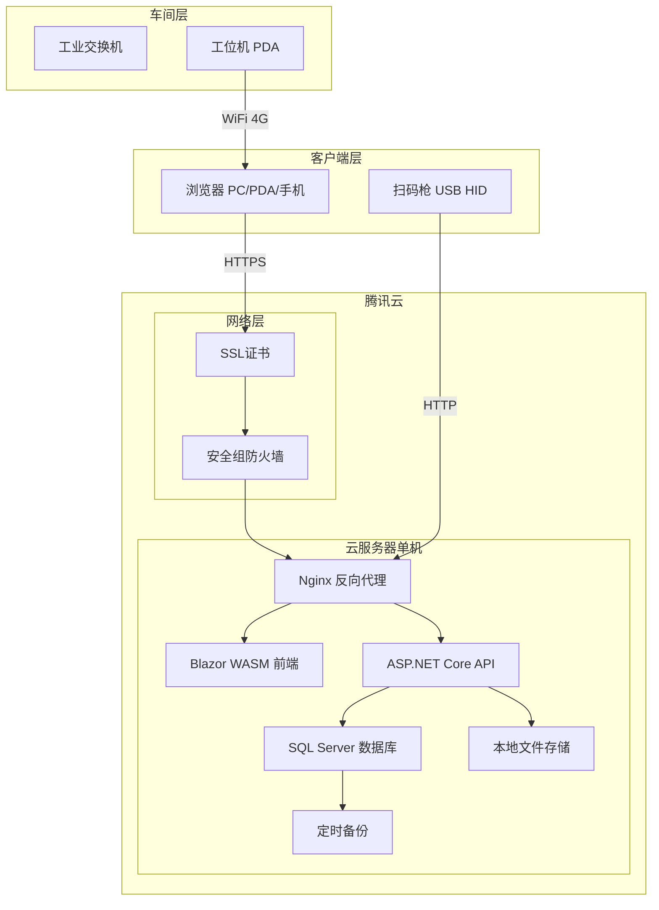
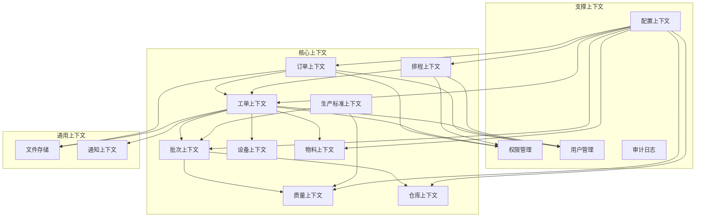
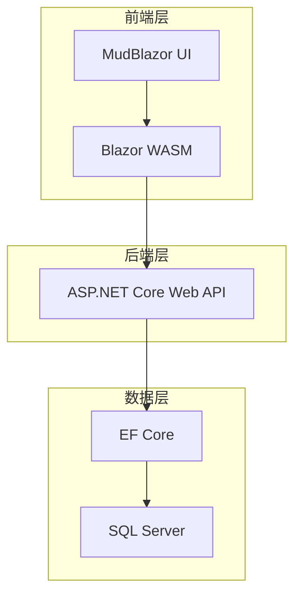

# 架构设计

**版本：V4.18**
**最后更新：2026-09-04**

---

## 一、系统部署架构图



---

## 二、模块依赖关系图



### 2.1 耦合原则

系统采用**三分法耦合模型**，不同上下文间根据业务关系选择不同耦合强度：

| 耦合层级 | 实现方式 | 适用场景 |
|---------|---------|---------|
| **强耦合（物理FK）** | 数据库级外键约束 | 仅限同一上下文内部实体 |
| **弱耦合（字符串引用）** | 存对方业务编号（nvarchar），无FK约束 | 大多数跨上下文关联，包括订单→工单 |
| **无耦合（API/事件）** | Service调用 / 事件发布 | 支撑性上下文（认证/通知/文件等） |

### 2.2 上下文依赖关系

| 源上下文 | 目标上下文 | 耦合类型 | 联通货 | 说明 |
|----------|------------|---------|--------|------|
| 订单上下文 | 工单上下文 | 弱（字符串） | SalesOrderNo | 工单通过订单号关联销售订单 |
| 工单上下文 | 批次上下文 | 弱（字符串） | WorkOrderNo | 批次通过工单号追溯来源 |
| 工单上下文 | 仓库上下文 | 弱（字符串） | WorkOrderNo / InventoryBatchNo | 用料计划通过批次号引用库存 |
| 工单上下文 | 物料上下文 | 弱（字符串） | WorkOrderNo | 采购计划通过工单号追溯 |
| 物料上下文 | 仓库上下文 | 弱（字符串） | SourceOrderNo | 入库记录来源单号（CG=采购/WW=委外） |
| 批次上下文 | 质量上下文 | 弱（字符串） | BatchNo | 质检记录批次号（含成检到料 MaterialReceiveCheck） |
| 批次上下文 | 仓库上下文 | 弱（字符串） | BatchNo | 生产入库批次号 |
| 排程上下文 | 工单上下文 | 弱（字符串） | WorkOrderNo | 计划排程基于 WorkOrderExecutionSummary 读模型决策 |
| 生产标准上下文 | 质量上下文 | 弱（字符串） | StandardNo | 质量检验引用标准号 |
| 生产标准上下文 | 批次上下文 | 弱（字符串） | StandardNo | 批次引用生产标准 |
| 配置上下文 | 所有核心上下文 | 弱（字符串） | ConfigKey/参数名 | 所有上下文引用系统参数/工段工量天数/交货状态附加天数 |
| 所有上下文 | 支撑上下文 | 无（API调用） | - | 权限、用户、审计 |
| 核心上下文 | 通用上下文 | 无（API调用） | - | 文件存储、通知 |

### 2.3 设计约束

| 规则 | 说明 |
|------|------|
| 同一上下文内 | 使用物理FK，保证数据完整性 |
| 跨上下文引用 | 全部使用字符串字段（nvarchar），**不加 FK 约束** |
| 业务完整性 | 由 Service 层代码保证，不是数据库 |
| 字段命名 | 跨上下文字段统一命名：`SourceXxxNo`（如 SourceWorkOrderNo） |
| 字段可为空 | 所有跨上下文字段均为 nullable，企业用不到就不填 |

---

## 三、技术架构图



> **注**：已集成 **Hangfire** 用于后台作业调度（清理过期通知 / 质量过程跟踪每小时兜底刷新 / 全项目数据更新每日两次全量兜底）。图表组件（ECharts）、实时通信（SignalR）、设备采集（Snap7）等功能将在后续版本中规划。

---

## 四、核心数据流图（已实现部分）

```mermaid
flowchart LR
    subgraph 订单上下文
        SO[SalesOrder]
        OI[OrderItem]
        PR[ProductRequirement]
    end

    subgraph 工单上下文
        WO[WorkOrder]
        NTF[Notification]
        RBP[RoundBarPiercingPlan]
        IRP[InProcessReworkPlan]
    end

    subgraph 批次上下文
        PB[ProductionBatch]
        PG[ProcessGroup]
        PREC[ProductionRecord]
        SOUT[SectionOutsource]
        REC[OutsourceRecovery]
    end

    subgraph 质量上下文
        PIN[ProcessInspection]
        FR[FurnaceRegistration]
        FIN[FinalInspection]
        MRC[MaterialReceiveCheck]
        NCR[Ncr]
        CA[ChemicalAnalysis]
        QPT[QualityProcessTracking]
        CERT[Certificate]
        TT[TensileTest]
        HT[HardnessTest]
        GST[GrainSizeTest]
        PCT[PittingCorrosionTest]
        ICT[IntergranularCorrosionTest]
        MT[MetallographicTest]
        FT[FlatteningTest]
        FLT[FlaringTest]
    end

    subgraph 仓库上下文
        IB[InventoryBatch]
        OR[OutboundRecord]
    end

    subgraph 物料上下文
        SUPPL[SupplierProfile]
        PO[PurchaseOrder]
        SCO[SubcontractOrder]
    end

    subgraph 设备上下文
        EQ[Equipment]
        RO[RepairOrder]
        MO[MaintenanceOrder]
    end

    subgraph 排程上下文
        BP[BatchPlan]
        CP[ColdRollPlan]
        WOS[WorkOrderSchedule]
        SPS[SectionProductionStatus]
        CSS[ColdRollSpecSchedule]
        FIP[FinalInspectionPlan]
        RLPRE[RawMaterialLockPreExecution]
        WOP[WorkOrderPlan]
        CRC[ColdRollCapacity]
        CRMC[ColdRollMachineConfig]
        CRMG[ColdRollMachineGroupConfig]
    end

    subgraph 生产标准上下文
        SR[StandardRegister]
        GM[GradeMapping]
        CC[ChemicalComposition]
        CVR[ChemicalValidationRule]
        GCC[GradeChemicalComposition]
        GPP[GradePhysicalProperty]
        SIR[StandardInspectionRequirement]
        SQV[SubStandardQuickView]
    end

    subgraph 配置上下文
        SWD[StandardWorkDay]
        SWDD[StandardWorkDayDeliveryState]
        CPG[ConfigParameter]
        DOE[DailyOutputEstimate]
        DPC[DailyProductionCapacity]
        SPC[SectionParagraphConfig]
        WS[Workstation]
        EMP[Employee]
        EDD[EnumDisplayDefinition]
        DVD[DictValueDefinition]
        PFD[ProcessDefinition]
    end

    subgraph 支撑上下文
        AUTH[权限管理/用户管理]
    end

    subgraph 通用工具
        DE[数据工具 导入导出]
    end

    SO --> OI
    OI --> PR
    SO --> WO
    WO --> NTF
    WO -.-> RBP
    WO -.-> IRP
    WO -.-> IB
    PO -.-> IB
    SCO -.-> IB
    WO -.-> PB
    PB --> PG
    PG -.-> PREC
    PG -.-> SOUT
    SOUT --> REC
    PB -.-> MRC
    PB -.-> PIN
    PB -.-> FIN
    PB -.-> NCR
    PB -.-> CA
    SO --> AUTH

    DE -.-> SO
    DE -.-> WO
    DE -.-> RBP
    DE -.-> IRP
    DE -.-> IB
    DE -.-> PB
    DE -.-> PG
    DE -.-> PREC
    DE -.-> SOUT
    DE -.-> REC
    DE -.-> MRC
    DE -.-> PIN
    DE -.-> FR
    DE -.-> FIN
    DE -.-> NCR
    DE -.-> CA
    DE -.-> EQ
    DE -.-> RO
    DE -.-> MO
    DE -.-> SR
    DE -.-> GM
    DE -.-> CC
    DE -.-> CVR
    DE -.-> GCC
    DE -.-> GPP
    DE -.-> SIR
    DE -.-> SQV
    DE -.-> QPT
    DE -.-> CERT
    DE -.-> TT
    DE -.-> HT
    DE -.-> GST
    DE -.-> PCT
    DE -.-> ICT
    DE -.-> MT
    DE -.-> FT
    DE -.-> FLT
    DE -.-> BPT
    DE -.-> RLPRE
    DE -.-> WOP
    DE -.-> SWDD
    DE -.-> SPC
    DE -.-> SWD
    DE -.-> CPG
    DE -.-> DOE
    DE -.-> DPC
    DE -.-> WS
    DE -.-> EMP
    DE -.-> EDD
    DE -.-> DVD
    DE -.-> PFD

    classDef warehouse fill:#e1f5fe
    classDef material fill:#f3e5f5
    classDef batch fill:#fff3e0
    classDef quality fill:#e8f5e9
    classDef equipment fill:#fce4ec
    classDef scheduling fill:#fff8e1
    classDef standard fill:#e0f2f1
    classDef config fill:#f3e5f5
    class IB,OR warehouse
    class SUPPL,PO,SCO material
    class PB,PG,PREC,SOUT,REC batch
    class PIN,FR,FIN,MRC,NCR,CA,QPT,CERT,TT,HT,GST,PCT,ICT,MT,FT,FLT quality
    class EQ,RO,MO equipment
    class BP,CP,WOS,RL,SPS,CSS,FIP,BPT,RLPRE,WOP,CRC,CRMC scheduling
    class SR,GM,CC,CVR,GCC,GPP,SIR,SQV standard
    class SWD,SWDD,CPG,DOE,DPC,SPC,WS,EMP,EDD,DVD,PFD config
```



> **虚线** (`-.->`) 表示跨上下文字符串弱耦合引用（非物理FK）。
>
> OR[OutboundRecord] ← 与 InventoryBatch 有外键关联（FK_OutboundRecord_InventoryBatch）

---

## 五、部署架构说明

### 5.1 服务器配置

| 配置项 | 规格 | 说明 |
|--------|------|------|
| 实例类型 | 标准型S5 | 腾讯云 |
| CPU | 4核 | 推荐 |
| 内存 | 8GB | 推荐 |
| 系统盘 | 100GB SSD | 操作系统 |
| 数据盘 | 200GB SSD | 数据库+文件 |

### 5.2 端口开放

| 端口 | 用途 | 来源 |
|------|------|------|
| 80/443 | Web访问 | 公网 |
| 5000 (HTTP) / 5001 (HTTPS) | Blazor WASM | 公网 |
| 7001 | API（内网） | 本机 |
| 1433 | SQL Server（内网） | 本机 |

### 5.3 安全配置

| 配置项 | 说明 |
|--------|------|
| 安全组 | 只开放80/443端口 |
| HTTPS | Let's Encrypt证书 |
| CORS | 仅允许 `https://localhost:5001` 和 `http://localhost:5000`（Blazor 来源） |
| 数据库 | 只允许本地连接 |
| 备份 | 每日自动备份到云盘 |

> **端口说明**：API（7001）和 Blazor（5001）端口通过 `launchSettings.json` 或命令行参数 `--urls` 指定，`Program.cs` 中不固定绑定端口。

---

## 六、已实现模块清单

| 模块 | 状态 | 说明 |
|------|------|------|
| 订单上下文 | ✅ 已完成 | 销售订单、项次、产品要求、客户档案 |
| 工单上下文 | ✅ 已完成 | 工单生成、工单状态管理、工单主号追溯、订单变更检测、7类用料计划（含库料改制、在产改制、在产主工单）、**定尺工单（FixedLengthWorkOrder）联通视图**、**主号/次号工单号规则**（主号=管型前缀+2位序号，次号2位全模式非空） |
| 通知上下文 | ✅ 已完成 | 订单删除通知、项次变更通知、通知列表及已读标记 |
| 仓库上下文 | ✅ 已完成 | 库存管理、出入库、批次管理、**库存批次主号（ProductionMainNo，替代项次）**、**定尺切割长度匹配（CutLengthMatchType，成品入库）** |
| 批次上下文 | ✅ 已完成 | 生产批次、工序组（含 9 个工序：荒管处理/在制修检/60冷轧/50冷轧/30冷轧/20冷轧/三辊冷轧/冷拔/附加成检）、生产记录、工段委外、委外回收、工艺卡打印、**去油/酸洗入缸记录**、**去油/酸洗完工记录**、**批次成切跟踪（CutRequirement/CutExecution/CutQuantity/CutDoubt/InspectionStage）**、**生产记录定尺切割长度匹配（CutLengthMatchType）** |
| 质量上下文 | ✅ 已完成 | 过程检验（完整CRUD+列表+打印+跟踪联动）、成检到料（MaterialReceiveCheck 独立 Service + 列表+批量创建+打印）、炉号登记（FurnaceRegistration）完整CRUD+批量创建、**成品检验（FinalInspection）完整CRUD+批量创建+列表+打印+定尺切割长度匹配（CutLengthMatchType）**、**NCR不合格品（完整CRUD+列表+分页汇总+创建）**、**理化检测（化学分析/硬度/晶粒度/点腐蚀/晶间腐蚀/拉伸/金相/压扁/扩口 9 个模块完整CRUD+列表）**；质量证明书已实现（详见规划中模块清单） |
| 权限管理 | ✅ 已完成 | 46 角色（Admin + 15 主菜单 × Viewer/Editor/Full 三档，纯一级），基于 JWT 认证 |
| 用户管理 | ✅ 已完成 | 基于 Identity 的用户管理（基础） |
| 物料上下文 | ✅ 已完成 | 采购订单、委外加工、供应商档案（物料档案主档已删除） |
| 数据工具 | ✅ 已完成 | 数据导入导出（Excel），覆盖80个实体的导入/导出/模板/预览，跨上下文通用工具 |
| **设备上下文** | **✅ 已完成** | **设备台账(Equipment)、点检记录(InspectionRecord)、保养工单(MaintenanceOrder)、维修工单(RepairOrder) 完整 CRUD+列表+内联编辑+打印+数据工具，**扫码报修**(EquipmentRepair 移动端扫码报修)，**扫码维修**(RepairExecute 两步流程开始/完成)** |
| **计划排程上下文** | **✅ V4.1 已完成** | **调度管理层——6 个页面：工单总览(PlanOverview)宏观产能负荷、原锁计划(RawMaterialLockPlanAndExecution)原料锁定阶段调度、工单排程(WorkOrderSchedule)生产执行阶段排程、批次计划(BatchPlan)在产明细计划、冷轧计划(ColdRollPlan)冷轧时间桶分布、成检计划(FinalInspectionPlan)待检验/检验中（工段待产量查询页面已从菜单栏移除；工段流转分析组件全套删除（页面/后端接口/批次计划页内嵌折叠卡片）；段落流转分析查询页面已从菜单栏移除，数据经批次计划页折叠与报表总览消费）。工单需求调整(OrderDemandAdjustment) UI/API 已迁移至工单上下文，数据库实体保留在本上下文供 LEFT JOIN 引用。读模型字段「关注状态→主号关注(ScheduleStage)」「工单计划性→主号计划性(UrgencyLevel)」，ScheduleStage 五档全主号级。**冷轧排程建议（半自动）**：`GET /api/cold-roll-plan/suggestion` 三步决策（特急锁定→流转保底→产能平衡）+「一键采用」走 save-all；**冷轧产能档案(ColdRollCapacity)**与**冷轧机台数配置(ColdRollMachineConfig)**两配置表（排程建议产能平衡输入，排程保存反哺产能档案）；**冷轧机台组配置(ColdRollMachineGroupConfig)**归组配置表驱动（组角色字段已移除，供需链由 SupplyTargetGroupKey 显式表达——供给方=配了目标、需求方=被指向，链合法性校验：目标存在+无环；排机估算/排程建议机台类型组输入，工序多选/机型下拉/工段 Tab 联动配置化）** |
| **生产标准上下文** | **✅ V1.2 已完成** | **标准号(StandardRegister)完整CRUD+详情页+子项目、牌号对照(StandardGradeMapping)内联编辑列表+批量创建、牌号化学成分(GradeChemicalComposition)内联编辑列表+批量创建、工厂牌号化学成分(ChemicalComposition)列表+工厂牌号化分验证(ChemicalValidationRule)列表+创建、牌号物理性能(GradePhysicalProperty)内联编辑列表+批量创建、子标准速览(SubStandardQuickView)内联编辑列表、标准号检验项要求(StandardInspectionRequirement)内联编辑列表，全部支持DataExchange导入导出** |
| **配置上下文** | **✅ V3.4 已完成** | **11 个系统参数表：工段工量天数(StandardWorkDays)、交货状态附加天数(StandardWorkDayDeliveryStates)、系统参数(ConfigParameters)、规格日产预估(DailyOutputEstimates)、重点工段日产(DailyProductionCapacities)、段落日产配置(SectionParagraphConfigs，3 类配置驱动自动生成：冷轧拔/普通工段/检验，段落仅参数可编辑)、工位管理(Workstations)、员工管理(Employees)、枚举显示配置(EnumDisplayDefinitions，41 枚举)、字典显示配置(DictValueDefinitions，8 字典)、工序组定义(ProcessDefinitions，含默认工段 DefaultSections)；位于 MES.Data.Entities.Configuration 目录，管理员专有页面（AdminOnly），所有业务模块引用其参数参与工量/业务计算及显示层参数化（工段展示层由 StandardWorkDays 参数表驱动，工段 26 预置超集）；11 表全部已纳入数据工具导入导出（2026-09-03 补齐工序组定义/枚举显示/字典显示 3 表注册）** |
| **工资结算上下文** | **✅ 已完成** | **独立主菜单「工资结算」：员工薪酬配置固定化（岗位类别/岗位字典化）、考勤表月视图网格、生产计件类别与成检计件类别标准（独立两表模型）与结算采集、每日工资、集体月结、靠工月结、杂辅工记录、津贴与处罚、月工资汇总；DataTool 8 表归「工资」上下文** |

## 七、规划中模块

| 模块 | 计划版本 | 说明 |
|------|----------|------|
| 质量上下文 | V2.0 | 过程检验已实现（CRUD+列表+打印+跟踪联动）；炉号登记（FurnaceRegistration）已实现（CRUD+批量创建+化学成分验证）；**成品检验（FinalInspection）已实现（CRUD+批量创建+列表+打印+批次自动填充）**；**理化检测（9个模块）已实现**；**质量证明书（Certificate）已实现**（CRUD+检验数据填充+关联订单成品(实时库存)查询，原「待发货」，2026-08-26 迁入订单上下文）；工厂牌号化学成分（ChemicalComposition）和工厂牌号化分验证规则（ChemicalValidationRule）已迁移至生产标准上下文 |
| 审计日志 | V2.0 | 操作日志记录与查询（批次操作日志已实现，通用审计日志待实现） |
| 文件存储 | V2.0 | 质保书、图纸上传下载 |

---

## 九、总结

```yaml
已包含内容:
  - 系统部署架构图 ✅
  - 模块依赖关系图（含通知上下文）✅
  - 技术架构图 ✅
  - 核心数据流图（含工单和通知）✅
  - 部署架构说明 ✅
  - 已实现模块清单 ✅
  - 规划中模块清单 ✅

已实现模块:
  - 订单上下文 ✅
  - 工单上下文 ✅
  - 仓库上下文 ✅
  - 批次上下文 ✅
  - 质量上下文 ✅（过程检验+炉号登记+成品检验+理化检测9模块；质量证明书已实现）
  - 通知上下文 ✅
  - 权限管理 ✅
  - 用户管理 ✅
  - 物料上下文 ✅
  - 数据工具（导入导出）✅
  - 设备上下文 ✅（设备台账+点检记录+保养工单+维修工单）
  - **计划排程上下文 ✅（Scheduling Context——工单总览+原锁计划+工单排程+批次计划+冷轧计划+成检计划；工段待产量查询页面已从菜单栏移除；工段流转分析组件全套删除；段落流转分析查询页面已从菜单栏移除）**
  - **生产标准上下文 ✅（标准号+牌号对照+标准牌号化学成分+工厂牌号化学成分+工厂牌号化分验证规则+牌号物理性能+子标准速览+标准号检验项要求）**
  - **配置上下文 ✅（工段工量天数/交货状态附加天数/系统参数/规格日产/重点工段日产/段落日产配置/工位/员工/枚举显示/字典显示/工序组定义 11 参数表）**
  - **工资结算上下文 ✅（员工薪酬配置固定化、考勤表、生产/成检计件类别与结算采集、每日/集体/靠工/杂辅/津贴月结、月工资汇总）**

规划中模块:
  - 审计日志（通用）、文件存储
  - 质量上下文（质量证明书已实现）

一句话:
  - 本文档定义系统的架构蓝图，
  - 包含已实现和规划中的全部模块，
  - 与当前代码实现保持一致。
```