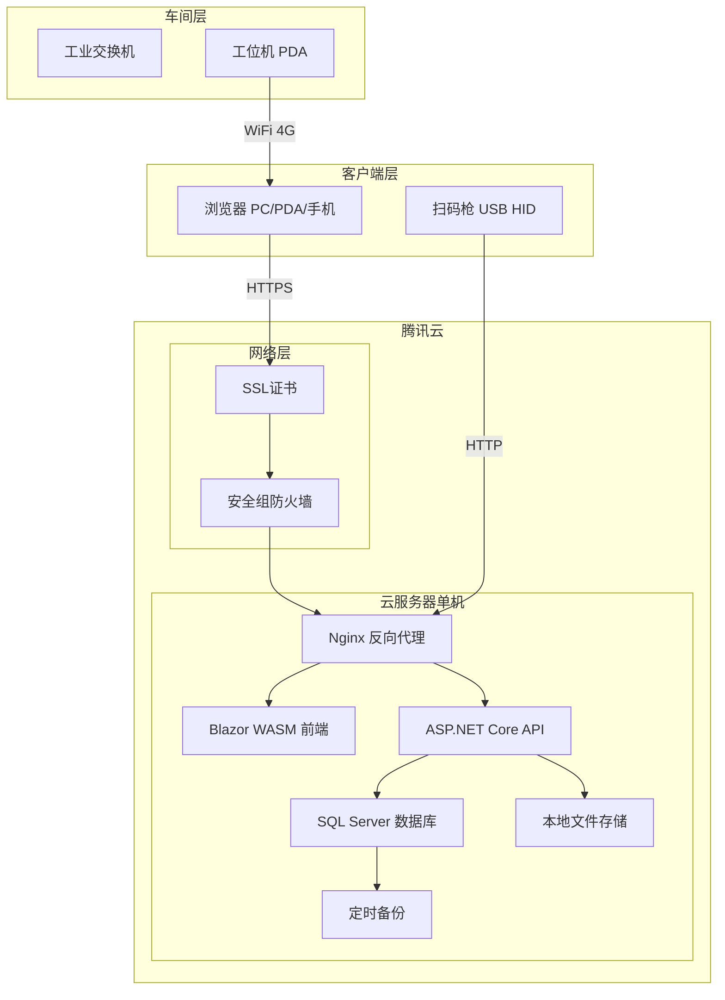
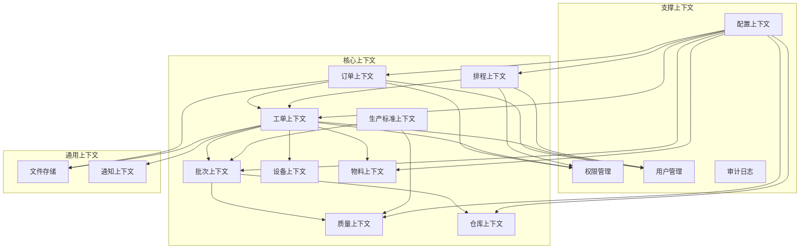
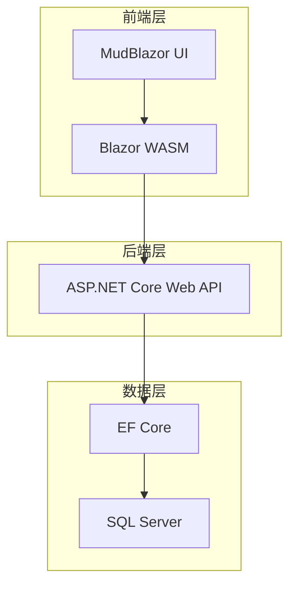

# 架构设计

**版本：V4.12**
**最后更新：2026-07-26**

---

## 一、系统部署架构图



---

## 二、模块依赖关系图



### 2.1 耦合原则

系统采用**三分法耦合模型**，不同上下文间根据业务关系选择不同耦合强度：

| 耦合层级 | 实现方式 | 适用场景 |
|---------|---------|---------|
| **强耦合（物理FK）** | 数据库级外键约束 | 仅限同一上下文内部实体 |
| **弱耦合（字符串引用）** | 存对方业务编号（nvarchar），无FK约束 | 大多数跨上下文关联，包括订单→工单 |
| **无耦合（API/事件）** | Service调用 / 事件发布 | 支撑性上下文（认证/通知/文件等） |

### 2.2 上下文依赖关系

| 源上下文 | 目标上下文 | 耦合类型 | 联通货 | 说明 |
|----------|------------|---------|--------|------|
| 订单上下文 | 工单上下文 | 弱（字符串） | SalesOrderNo | 工单通过订单号关联销售订单 |
| 工单上下文 | 批次上下文 | 弱（字符串） | WorkOrderNo | 批次通过工单号追溯来源 |
| 工单上下文 | 仓库上下文 | 弱（字符串） | WorkOrderNo / InventoryBatchNo | 用料计划通过批次号引用库存 |
| 工单上下文 | 物料上下文 | 弱（字符串） | WorkOrderNo | 采购计划通过工单号追溯 |
| 物料上下文 | 仓库上下文 | 弱（字符串） | SourceOrderNo | 入库记录来源单号（CG=采购/WW=委外） |
| 批次上下文 | 质量上下文 | 弱（字符串） | BatchNo | 质检记录批次号（含成检到料 MaterialReceiveCheck） |
| 批次上下文 | 仓库上下文 | 弱（字符串） | BatchNo | 生产入库批次号 |
| 排程上下文 | 工单上下文 | 弱（字符串） | WorkOrderNo | 计划排程基于 WorkOrderExecutionSummary 读模型决策 |
| 生产标准上下文 | 质量上下文 | 弱（字符串） | StandardNo | 质量检验引用标准号 |
| 生产标准上下文 | 批次上下文 | 弱（字符串） | StandardNo | 批次引用生产标准 |
| 配置上下文 | 所有核心上下文 | 弱（字符串） | ConfigKey/参数名 | 所有上下文引用系统参数/标准工量天数/交货状态附加天数 |
| 所有上下文 | 支撑上下文 | 无（API调用） | - | 权限、用户、审计 |
| 核心上下文 | 通用上下文 | 无（API调用） | - | 文件存储、通知 |

### 2.3 设计约束

| 规则 | 说明 |
|------|------|
| 同一上下文内 | 使用物理FK，保证数据完整性 |
| 跨上下文引用 | 全部使用字符串字段（nvarchar），**不加 FK 约束** |
| 业务完整性 | 由 Service 层代码保证，不是数据库 |
| 字段命名 | 跨上下文字段统一命名：`SourceXxxNo`（如 SourceWorkOrderNo） |
| 字段可为空 | 所有跨上下文字段均为 nullable，企业用不到就不填 |

---

## 三、技术架构图



> **注**：已集成 **Hangfire** 用于后台作业调度（通知清理）。图表组件（ECharts）、实时通信（SignalR）、设备采集（Snap7）等功能将在后续版本中规划。

---

## 四、核心数据流图（已实现部分）

```mermaid
flowchart LR
    subgraph 订单上下文
        SO[SalesOrder]
        OI[OrderItem]
        PR[ProductRequirement]
    end

    subgraph 工单上下文
        WO[WorkOrder]
        NTF[Notification]
        RBP[RoundBarPiercingPlan]
        IRP[InProcessReworkPlan]
    end

    subgraph 批次上下文
        PB[ProductionBatch]
        PG[ProcessGroup]
        PREC[ProductionRecord]
        SOUT[SectionOutsource]
        REC[OutsourceRecovery]
    end

    subgraph 质量上下文
        PIN[ProcessInspection]
        FR[FurnaceRegistration]
        FIN[FinalInspection]
        MRC[MaterialReceiveCheck]
        NCR[Ncr]
        CA[ChemicalAnalysis]
        QPT[QualityProcessTracking]
        CERT[Certificate]
        TT[TensileTest]
        HT[HardnessTest]
        GST[GrainSizeTest]
        PCT[PittingCorrosionTest]
        ICT[IntergranularCorrosionTest]
        MT[MetallographicTest]
        FT[FlatteningTest]
        FLT[FlaringTest]
    end

    subgraph 仓库上下文
        IB[InventoryBatch]
        OR[OutboundRecord]
    end

    subgraph 物料上下文
        MAT[Material]
        SUPPL[SupplierProfile]
        PO[PurchaseOrder]
        SCO[SubcontractOrder]
    end

    subgraph 设备上下文
        EQ[Equipment]
        RO[RepairOrder]
        MO[MaintenanceOrder]
    end

    subgraph 排程上下文
        BP[BatchPlan]
        CP[ColdRollPlan]
        WOS[WorkOrderSchedule]
        RL[RawMaterialLockPlanAndExecution]
        SPS[SectionProductionStatus]
        SFA[SectionFlowAnalysis]
        CSS[ColdRollSpecSchedule]
        FIP[FinalInspectionPlan]
        BPT[BatchPlanTarget]
        RLPRE[RawMaterialLockPreExecution]
        WOP[WorkOrderPlan]
    end

    subgraph 生产标准上下文
        SR[StandardRegister]
        GM[GradeMapping]
        CC[ChemicalComposition]
        CVR[ChemicalValidationRule]
        GCC[GradeChemicalComposition]
        GPP[GradePhysicalProperty]
        SIR[StandardInspectionRequirement]
        SQV[SubStandardQuickView]
    end

    subgraph 配置上下文
        SWD[StandardWorkDay]
        SWDD[StandardWorkDayDeliveryState]
        CPG[ConfigParameter]
        DOE[DailyOutputEstimate]
        DPC[DailyProductionCapacity]
        SFC[SectionFlowCategorySetting]
        SFCI[SectionFlowCategoryItem]
        WS[Workstation]
        EMP[Employee]
    end

    subgraph 支撑上下文
        AUTH[权限管理/用户管理]
    end

    subgraph 通用工具
        DE[数据工具 导入导出]
    end

    SO --> OI
    OI --> PR
    SO --> WO
    WO --> NTF
    WO -.-> RBP
    WO -.-> IRP
    WO -.-> IB
    PO -.-> IB
    SCO -.-> IB
    WO -.-> PB
    PB --> PG
    PG -.-> PREC
    PG -.-> SOUT
    SOUT --> REC
    PB -.-> MRC
    PB -.-> PIN
    PB -.-> FIN
    PB -.-> NCR
    PB -.-> CA
    SO --> AUTH

    DE -.-> SO
    DE -.-> WO
    DE -.-> RBP
    DE -.-> IRP
    DE -.-> IB
    DE -.-> MAT
    DE -.-> PB
    DE -.-> PG
    DE -.-> PREC
    DE -.-> SOUT
    DE -.-> REC
    DE -.-> MRC
    DE -.-> PIN
    DE -.-> FR
    DE -.-> FIN
    DE -.-> NCR
    DE -.-> CA
    DE -.-> EQ
    DE -.-> RO
    DE -.-> MO
    DE -.-> SR
    DE -.-> GM
    DE -.-> CC
    DE -.-> CVR
    DE -.-> GCC
    DE -.-> GPP
    DE -.-> SIR
    DE -.-> SQV
    DE -.-> QPT
    DE -.-> CERT
    DE -.-> TT
    DE -.-> HT
    DE -.-> GST
    DE -.-> PCT
    DE -.-> ICT
    DE -.-> MT
    DE -.-> FT
    DE -.-> FLT
    DE -.-> BPT
    DE -.-> RLPRE
    DE -.-> WOP
    DE -.-> SWDD
    DE -.-> SFCI
    DE -.-> SWD
    DE -.-> CPG
    DE -.-> DOE
    DE -.-> DPC
    DE -.-> SFC
    DE -.-> WS
    DE -.-> EMP

    classDef warehouse fill:#e1f5fe
    classDef material fill:#f3e5f5
    classDef batch fill:#fff3e0
    classDef quality fill:#e8f5e9
    classDef equipment fill:#fce4ec
    classDef scheduling fill:#fff8e1
    classDef standard fill:#e0f2f1
    classDef config fill:#f3e5f5
    class IB,OR warehouse
    class MAT,SUPPL,PO,SCO material
    class PB,PG,PREC,SOUT,REC batch
    class PIN,FR,FIN,MRC,NCR,CA,QPT,CERT,TT,HT,GST,PCT,ICT,MT,FT,FLT quality
    class EQ,RO,MO equipment
    class BP,CP,WOS,RL,SPS,SFA,CSS,FIP,BPT,RLPRE,WOP scheduling
    class SR,GM,CC,CVR,GCC,GPP,SIR,SQV standard
    class SWD,SWDD,CPG,DOE,DPC,SFC,SFCI,WS,EMP config
```



> **虚线** (`-.->`) 表示跨上下文字符串弱耦合引用（非物理FK）。
>
> OR[OutboundRecord] ← 与 InventoryBatch 有外键关联（FK_OutboundRecord_InventoryBatch）

---

## 五、部署架构说明

### 5.1 服务器配置

| 配置项 | 规格 | 说明 |
|--------|------|------|
| 实例类型 | 标准型S5 | 腾讯云 |
| CPU | 4核 | 推荐 |
| 内存 | 8GB | 推荐 |
| 系统盘 | 100GB SSD | 操作系统 |
| 数据盘 | 200GB SSD | 数据库+文件 |

### 5.2 端口开放

| 端口 | 用途 | 来源 |
|------|------|------|
| 80/443 | Web访问 | 公网 |
| 5000 (HTTP) / 5001 (HTTPS) | Blazor WASM | 公网 |
| 7001 | API（内网） | 本机 |
| 1433 | SQL Server（内网） | 本机 |

### 5.3 安全配置

| 配置项 | 说明 |
|--------|------|
| 安全组 | 只开放80/443端口 |
| HTTPS | Let's Encrypt证书 |
| CORS | 仅允许 `https://localhost:5001` 和 `http://localhost:5000`（Blazor 来源） |
| 数据库 | 只允许本地连接 |
| 备份 | 每日自动备份到云盘 |

> **端口说明**：API（7001）和 Blazor（5001）端口通过 `launchSettings.json` 或命令行参数 `--urls` 指定，`Program.cs` 中不固定绑定端口。

---

## 六、已实现模块清单

| 模块 | 状态 | 说明 |
|------|------|------|
| 订单上下文 | ✅ 已完成 | 销售订单、项次、产品要求、客户档案 |
| 工单上下文 | ✅ 已完成 | 工单生成、工单状态管理、工单项次追溯、订单变更检测、6类用料计划（含库料改制、在产改制） |
| 通知上下文 | ✅ 已完成 | 订单删除通知、项次变更通知、通知列表及已读标记 |
| 仓库上下文 | ✅ 已完成 | 库存管理、出入库、批次管理 |
| 批次上下文 | ✅ 已完成 | 生产批次、工序组（含 9 个工序：荒管处理/在制修检/60冷轧/50冷轧/30冷轧/20冷轧/三辊冷轧/冷拔/附加成检）、生产记录、工段委外、委外回收、工艺卡打印、**去油/酸洗入缸记录**、**去油/酸洗完工记录** |
| 质量上下文 | ✅ 已完成 | 过程检验（完整CRUD+列表+打印+跟踪联动）、成检到料（MaterialReceiveCheck 独立 Service + 列表+批量创建+打印）、炉号登记（FurnaceRegistration）完整CRUD+批量创建、**成品检验（FinalInspection）完整CRUD+批量创建+列表+打印**、**NCR不合格品（完整CRUD+列表+分页汇总+创建）**、**理化检测（化学分析/硬度/晶粒度/点腐蚀/晶间腐蚀/拉伸/金相/压扁/扩口 9 个模块完整CRUD+列表）**；质量证明书已实现（详见规划中模块清单） |
| 权限管理 | ✅ 已完成 | 17个角色，基于 JWT 认证 |
| 用户管理 | ✅ 已完成 | 基于 Identity 的用户管理（基础） |
| 物料上下文 | ✅ 已完成 | 物料档案、采购订单、委外加工、供应商档案 |
| 数据工具 | ✅ 已完成 | 数据导入导出（Excel），覆盖68个实体的导入/导出/模板/预览，跨上下文通用工具 |
| **设备上下文** | **✅ 已完成** | **设备台账(Equipment)、点检记录(InspectionRecord)、保养工单(MaintenanceOrder)、维修工单(RepairOrder) 完整 CRUD+列表+内联编辑+打印+数据工具，**扫码报修**(EquipmentRepair 移动端扫码报修)，**扫码维修**(RepairExecute 两步流程开始/完成)** |
| **计划排程上下文** | **✅ V4.1 已完成** | **调度管理层——8 个页面：工单总览(ProductionOverview)宏观产能负荷、原锁计划(RawMaterialLockPlanAndExecution)原料锁定阶段调度、工单排程(WorkOrderSchedule)生产执行阶段排程、生产工段待产量现况(SectionProductionStatus)、生产段流转量分析(SectionFlowAnalysis)、批次计划(BatchPlan)在产明细计划、冷轧计划(ColdRollPlan)冷轧时间桶分布、成检计划(FinalInspectionPlan)待检验/检验中。工单需求调整(OrderDemandAdjustment) UI/API 已迁移至工单上下文，数据库实体保留在本上下文供 LEFT JOIN 引用** |
| **生产标准上下文** | **✅ V1.2 已完成** | **标准号(StandardRegister)完整CRUD+详情页+子项目、牌号对照(StandardGradeMapping)内联编辑列表+批量创建、牌号化学成分(GradeChemicalComposition)内联编辑列表+批量创建、工厂牌号化学成分(ChemicalComposition)列表+工厂牌号化分验证(ChemicalValidationRule)列表+创建、牌号物理性能(GradePhysicalProperty)内联编辑列表+批量创建、子标准速览(SubStandardQuickView)内联编辑列表、标准号检验项要求(StandardInspectionRequirement)内联编辑列表，全部支持DataExchange导入导出** |
| **配置上下文** | **✅ V3.4 已完成** | **8 个系统参数配置表：标准工量天数(StandardWorkDays)、交货状态附加天数(StandardWorkDayDeliveryStates)、业务参数配置(ConfigParameters)、日产能预估(DailyOutputEstimates)、重点工段日产(DailyProductionCapacities)、日流转量配置(SectionFlowCategorySettings)、工位管理(Workstations)、员工管理(Employees)；位于 MES.Data.Entities.Configuration 目录，管理员专有页面（AdminOnly），所有业务模块引用其参数参与工量/业务计算** |

## 七、规划中模块

| 模块 | 计划版本 | 说明 |
|------|----------|------|
| 质量上下文 | V2.0 | 过程检验已实现（CRUD+列表+打印+跟踪联动）；炉号登记（FurnaceRegistration）已实现（CRUD+批量创建+化学成分验证）；**成品检验（FinalInspection）已实现（CRUD+批量创建+列表+打印+批次自动填充）**；**理化检测（9个模块）已实现**；**质量证明书（Certificate）已实现**（CRUD+检验数据填充+待发货关联）；工厂牌号化学成分（ChemicalComposition）和工厂牌号化分验证规则（ChemicalValidationRule）已迁移至生产标准上下文 |
| 审计日志 | V2.0 | 操作日志记录与查询（批次操作日志已实现，通用审计日志待实现） |
| 文件存储 | V2.0 | 质保书、图纸上传下载 |

---

## 八、版本历史

| 版本 | 日期 | 说明 |
|------|------|------|
| V1.0 | 2026-04-21 | 初始版本，包含部署架构、模块依赖、技术架构 |
| V1.1 | 2026-04-24 | 增加通知上下文；更新模块依赖关系图和数据流图；调整规划中模块列表 |
| V1.2 | 2026-04-28 | 补充 CORS 配置说明；端口说明从固定IP改为 launchSettings/命令行配置 |
| V1.3 | 2026-05-01 | 更新已实现模块清单：仓库上下文标记为已完成，工单上下文补充用料计划；规划中模块移除仓库/物料上下文 |
| V1.4 | 2026-05-01 | 修正总结中"规划中模块"包含仓库的矛盾 |
| **V2.0** | **2026-05-01** | **架构原则重构：新增三分法耦合模型（强/弱/无），替换原"全外键"依赖描述。所有跨上下文引用均为字符串弱引用，无物理FK。** |
| **V2.1** | **2026-05-02** | **新增数据工具（DataExchange）**：跨上下文通用 Excel 导入导出工具，覆盖20个实体；已实现模块清单补充物料上下文和数据工具；数据流图补充数据工具节点 |
| **V2.2** | **2026-05-09** | **批次上下文标记为已实现**：补充 Hangfire 后台作业技术组件；已实现模块清单新增批次上下文；规划中模块移除批次上下文 |
| **V2.3** | **2026-05-10** | **补充批次子模块实体**：数据流图新增 ProductionRecord/SectionOutsource/OutsourceRecovery/MaterialReceiveCheck 节点及关系；已实现模块清单补充生产记录/工段委外/委外回收/检验到料/工艺卡打印 |
| **V2.4** | **2026-05-14** | **质量上下文部分实现**：已实现模块清单新增质量上下文（部分实现）；数据流图新增 ProcessInspection 节点及质量上下文子图；规划中模块质量上下文更新为部分实现 |
| **V2.5** | **2026-05-14** | **质量上下文扩展**：数据流图补充 FurnaceRegistration/ChemicalComposition/ChemicalValidationRule 节点；已实现模块清单补充炉号登记/工厂牌号化学成分/工厂牌号化分验证；数据工具覆盖实体数 24→27；规划中模块移除已实现的炉号登记 |
| **V2.6** | **2026-05-15** | **成品检验完成**：数据流图质量上下文子图补充 FinalInspection 节点；已实现模块清单成品检验标记为已完成；数据工具覆盖实体数 27→30；规划中模块成品检验标记为已实现 |
| **V2.7** | **2026-05-15** | **新增圆棒穿孔计划(RoundBarPiercingPlan)**：数据流图工单上下文子图补充 RoundBarPiercingPlan 节点；数据工具覆盖实体数 30→31 |
| **V2.8** | **2026-05-16** | **设备上下文实现**：设备台账(Equipment)、点检记录(InspectionRecord)、保养工单(MaintenanceOrder)、维修工单(RepairOrder) 完整 CRUD+列表+内联编辑+打印+数据工具；已实现模块清单新增设备上下文；规划中模块移除设备上下文 |
| **V2.9** | **2026-05-19** | **工单上下文扩展读模型**：工单执行状况（WorkOrderExecution）物化读模型规划，跨上下文聚合查询（基于WorkOrder+InventoryBatch+MaterialPlan）；数据流图补充读模型节点 |
| **V3.0** | **2026-05-26** | **工单执行状况上线**：包含94列宽表+全字段排序/筛选+日期范围+G7批次状态+G12进度阶段+G8G9G10缺陷字段+G11入库字段+G5采购字段等扩展 |
| **V3.1** | **2026-05-29** | **新增计划排程上下文（Scheduling Context）**：原锁计划(RawMaterialLockPlanAndExecution)模块，基于WorkOrderExecutionSummary做调度决策；对应三份设计文档已创建。销售催单(SalesUrging)后续在 V3.6 迁移至订单上下文 |
| **V3.5** | **2026-06-04** | **原锁计划重构为 LEFT JOIN 实时查询**：删除 RawMaterialLockPlanAndExecution 物化表，G15 移至 RawMaterialLockPreExecution 独立表，G1~G13 通过 LEFT JOIN WorkOrderExecutionSummary + SalesUrging 实时读取（SalesUrging 数据库实体保留在原上下文）|
| **V3.2** | **2026-05-29** | **移除现况查询上下文**：WorkOrderExecution 归回工单上下文（页面+服务+菜单均移至WorkOrders）；现况查询菜单更名为计划排程；架构文档移除读模型上下文节点及跨上下文依赖表行
| **V3.3** | **2026-06-01** | **新增工单总览模块**：计划排程上下文扩展纯查询聚合视图（ProductionOverview），汇总WorkOrderExecutionSummary和ProductionBatch数据，7时间桶分布各工段产能负荷
| **V3.4** | **2026-06-02** | **新增配置上下文**：已实现模块清单新增配置上下文；StandardWorkDays（标准工量天数）替代 SectionDefs.GetStandardDays() 硬编码；StandardWorkDayDeliveryStates（交货状态附加天数）替代 +4 天硬编码；用料计划 MaterialPlanService 同步切换为 DB 参数读取
| **V3.6** | **2026-06-05** | **销售催单迁移至订单上下文**：销售催单（SalesUrging）页面和 API 从计划排程上下文迁移至订单上下文，页面更名为"订单需求调整"，路由改为 `/order-demand-adjustment`；SalesUrging 数据库实体保留在计划排程上下文中供 LEFT JOIN 引用；已实现模块清单同步更新
| **V4.12** | **2026-07-26** | **文档同步更新**：数据工具覆盖实体数 67→68（新增 ProductionBatchInventory）；版本号更新 |
| **V4.11** | **2026-07-25** | **数据流图同步**：质量上下文子图补充 11 个实体（QPT/CERT/TT/HT/GST/PCT/ICT/MT/FT/FLT），排程上下文补充 3 个实体（BPT/RLPRE/WOP），配置上下文补充 2 个实体（SWDD/SFCI）；DE 连接线、class 定义同步更新；批次上下文补充"附加成检"工序说明；质量证明书标记为已实现 |
| **V4.10** | **2026-07-10** | **数据一致性增强**：WorkOrderExecutionSummary 刷新全面 await 化（7 Service），新增 BatchService/ProductionRecordService/InventoryService/FinalInspectionService 为触发源；BatchStatus 状态机验证；OrderService/WorkOrderService 删除时 InProcessReworkPlan 级联清理；3 Service 的 `_configMaps` 实例字典改为 IMemoryCache + 5 分钟 TTL |
| **V4.9** | **2026-07-09** | **成检到料上下文归属修正**：MaterialReceiveCheck 从批次上下文迁移至质量上下文（独立 Service + 独立 Controller）；批次上下文已实现模块清单移除"成检到料"；质量上下文已实现清单补充为独立模块；上下文依赖关系表补充说明
| **V4.8** | **2026-07-08** | **配置上下文描述同步（8 项完整列全）**：§六 配置上下文描述从"3 个系统参数配置表"扩展为"8 个系统参数配置表"，完整列出 StandardWorkDays/StandardWorkDayDeliveryStates/ConfigParameters/DailyOutputEstimates/DailyProductionCapacities/SectionFlowCategorySettings/Workstations/Employees，与当前代码实现保持一致 |
| **V4.7** | **2026-07-07** | **模块依赖关系图+数据流图补充缺失上下文**：§二 模块依赖关系图补充排程上下文(Scheduling)、生产标准上下文(StandardRegister)、配置上下文(Configuration)；§2.2 上下文依赖关系表补充排程/生产标准/配置三组跨上下文依赖行；§四 核心数据流图补充设备上下文(Equipment)、排程上下文(Scheduling)、生产标准上下文(StandardRegister)、配置上下文(Configuration) 四个上下文子图；InProcessReworkPlan 实体同步加入工单上下文子图 |
| **V4.6** | **2026-07-07** | **新增在产改制计划(InProcessReworkPlan)**：工单上下文扩展为6类用料计划（含库料改制、在产改制）；删除 Hangfire CheckOrderChangeJob/MaterialSyncJob（数据一致性仅靠写路径增量更新）；技术架构图 Hangfire 说明同步修正；数据工具覆盖实体数 58→59 |
| **V4.5** | **2026-06-23** | **新增标准号检验项要求(StandardInspectionRequirement)**：生产标准上下文新增第6个子模块；数据工具覆盖实体数 57→58 |
| **V4.4** | **2026-07-10** | **订单需求调整迁移至工单上下文**：页面更名为"工单需求调整"，Controller/Blazor 移至工单上下文，权限改为 WorkOrderRead/WorkOrderWrite；数据库实体 OrderDemandAdjustment 保留在计划排程上下文 |
| **V4.3** | **2026-06-21** | **新增生产标准上下文**：标准号+牌号对照+标准牌号化学成分+牌号物理性能 4 个子模块；订单上下文移除已删除的产品标准和已移出的牌号对照；数据工具覆盖实体数 35→48；本文档版本号同步更新 V3.5→V4.3 |
| **V4.2** | **2026-06-16** | **NCR不合格品+看板重设计**：质量上下文新增NCR不合格品模块；首页Index.razor清空待重新设计；设备上下文新增扫码报修+扫码维修两步流程 |
| **V4.1** | **2026-06-14** | **批次上下文扩展-酸洗模块**：新增去油/酸洗入缸记录(PicklingInRecord)和去油/酸洗完工记录(PicklingOutRecord，含计件工资结算冗余字段)；工位管理字段重设计(新增ReportType/IsActive)；新增员工管理(Employee)
| **V4.0** | **2026-06-06** | **Scheduling 上下文大幅扩展**：新增工单排程(WorkOrderSchedule)、生产工段待产量现况(SectionProductionStatus)、生产段流转量分析(SectionFlowAnalysis)、批次计划(BatchPlan)、冷轧计划(ColdRollPlan) 5 个模块；已实现模块清单同步更新为 8 个页面

## 九、总结

```yaml
已包含内容:
  - 系统部署架构图 ✅
  - 模块依赖关系图（含通知上下文）✅
  - 技术架构图 ✅
  - 核心数据流图（含工单和通知）✅
  - 部署架构说明 ✅
  - 已实现模块清单 ✅
  - 规划中模块清单 ✅

已实现模块:
  - 订单上下文 ✅
  - 工单上下文 ✅
  - 仓库上下文 ✅
  - 批次上下文 ✅
  - 质量上下文 ✅（过程检验+炉号登记+成品检验+理化检测9模块；质量证明书已实现）
  - 通知上下文 ✅
  - 权限管理 ✅
  - 用户管理 ✅
  - 物料上下文 ✅
  - 数据工具（导入导出）✅
  - 设备上下文 ✅（设备台账+点检记录+保养工单+维修工单）
  - **计划排程上下文 ✅（Scheduling Context——工单总览+原锁计划+工单排程+工段待产量+段流转量分析+批次计划+冷轧计划）**
  - **生产标准上下文 ✅（标准号+牌号对照+标准牌号化学成分+工厂牌号化学成分+工厂牌号化分验证规则+牌号物理性能+子标准速览+标准号检验项要求）**

规划中模块:
  - 审计日志（通用）、文件存储
  - 质量上下文（质量证明书已实现）

一句话:
  - 本文档定义系统的架构蓝图，
  - 包含已实现和规划中的全部模块，
  - 与当前代码实现保持一致。
```