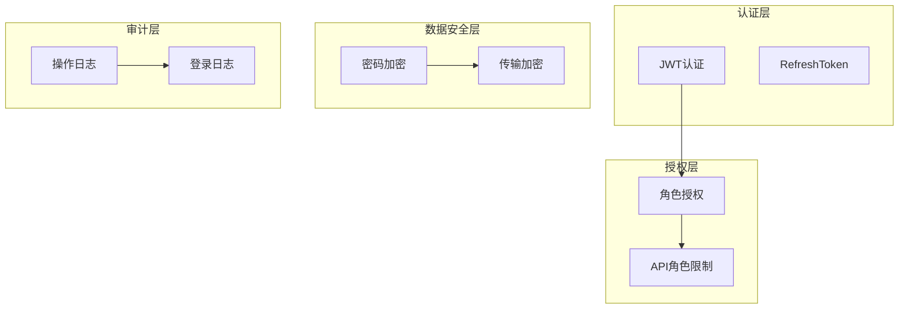
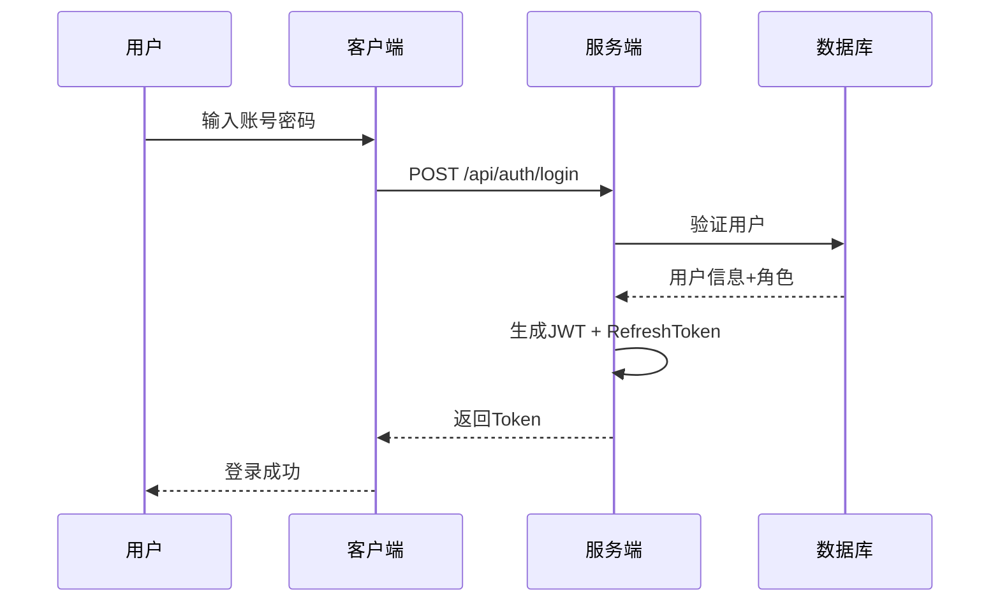

# 安全设计（V2.12）

**版本**：V2.12
**最后更新**：2026-08-15

---

## 一、安全架构概览



---

## 二、认证设计

### 2.1 JWT配置

| 配置项 | 值 | 说明 |
|--------|-----|------|
| 认证方式 | JWT Bearer Token | |
| Token有效期 | 8小时 | |
| RefreshToken有效期 | 7天 | 持久化到数据库 |
| 算法 | HS256 | |

### 2.2 JWT Payload

```json
{
    "sub": "userId",
    "email": "user@example.com",
    "name": "userName",
    "jti": "tokenId",
    "fullName": "用户全名",
    "http://schemas.microsoft.com/ws/2008/06/identity/claims/role": "Admin",
    "exp": 1744567890,
    "iss": "MES_Issuer",
    "aud": "MES_Audience"
}
```

> **说明**：角色声明使用 ASP.NET Core Identity 默认的 Claims 类型（`http://schemas.microsoft.com/ws/2008/06/identity/claims/role`），多个角色时该声明会出现多次。

### 2.3 登录流程



---

## 三、授权设计

### 3.1 角色定义

系统共定义 17 个角色：

| 层级 | 角色 |
|------|------|
| 系统级 | Admin |
| 主任级 | OrderDirector, WorkOrderDirector, BatchDirector, QualityDirector, EquipmentDirector, WarehouseDirector, MaterialDirector, StandardDirector |
| 员工级 | OrderStaff, WorkOrderStaff, BatchStaff, QualityStaff, EquipmentStaff, WarehouseStaff, MaterialStaff, StandardStaff |

**角色说明：**

| 角色 | 权限范围 |
|------|----------|
| Admin | 系统管理员，所有权限 |
| OrderDirector | 订单读写 |
| OrderStaff | 订单只读 |
| WorkOrderDirector | 工单读写 |
| WorkOrderStaff | 工单只读 |
| BatchDirector | 批次读写 | ✅ 已实现 |
| BatchStaff | 批次只读 | ✅ 已实现 |
| QualityDirector | 质量读写 | ✅ 已实现 |
| QualityStaff | 质量只读 | ✅ 已实现 |
| EquipmentDirector | 设备读写 | ✅ 已实现 |
| EquipmentStaff | 设备只读 | ✅ 已实现 |
| WarehouseDirector | 仓库读写 | ✅ 已实现 |
| WarehouseStaff | 仓库只读 | ✅ 已实现 |
| MaterialDirector | 物料读写 | ✅ 已实现 |
| MaterialStaff | 物料只读 | ✅ 已实现 |
| StandardDirector | 标准号管理 | 管理标准号及子项目，配置牌号化学成分/物理性能/检验要求等 |
| StandardStaff | 标准号查看 | 查看标准号及子项目、牌号对照信息 |

> **计划排程权限说明**：Scheduling 上下文复用 WorkOrder 角色（WorkOrderDirector/WorkOrderStaff）进行 API 授权，未单独定义 Scheduling 专用角色。

### 3.2 角色权限矩阵

**订单模块：**

| 权限 | Admin | OrderDirector | OrderStaff |
|------|-------|---------------|------------|
| 订单读 | ✅ | ✅ | ✅ |
| 订单写 | ✅ | ✅ | ❌ |
| 客户读 | ✅ | ✅ | ✅ |
| 客户写 | ✅ | ✅ | ❌ |
| 产品标准读 | ✅ | ✅ | ✅ |
| 产品标准写 | ✅ | ✅ | ❌ |

**生产标准模块：**

| 权限 | Admin | StandardDirector | StandardStaff |
|------|-------|-------------------|---------------|
| 牌号对照读 | ✅ | ✅ | ✅ |
| 牌号对照写 | ✅ | ✅ | ❌ |
| 标准号读 | ✅ | ✅ | ✅ |
| 标准号写 | ✅ | ✅ | ❌ |

**工单模块：**

| 权限 | Admin | WorkOrderDirector | WorkOrderStaff |
|------|-------|-------------------|----------------|
| 工单读 | ✅ | ✅ | ✅ |
| 工单写 | ✅ | ✅ | ❌ |
| 生成工单 | ✅ | ✅ | ✅ |
| 生成工单项次 | ✅ | ✅ | ✅ |
| 删除工单 | ✅ | ❌ | ❌ |
| 查看通知 | ✅ | ✅ | ✅ |
| 标记通知已读 | ✅ | ✅ | ✅ |

**用户管理：**

| 权限 | Admin | 其他角色 |
|------|-------|----------|
| 用户管理 | ✅ | ❌ |

### 3.3 用户角色分配

一个用户可以拥有多个角色：

```sql
-- 示例1：张三（订单员工）
INSERT INTO AspNetUserRoles (UserId, RoleId) VALUES 
('zhangsan', (SELECT Id FROM AspNetRoles WHERE Name = 'OrderStaff'));

-- 示例2：李四（订单主任 + 系统管理员）
INSERT INTO AspNetUserRoles (UserId, RoleId) VALUES 
('lisi', (SELECT Id FROM AspNetRoles WHERE Name = 'OrderDirector')),
('lisi', (SELECT Id FROM AspNetRoles WHERE Name = 'Admin'));
```

### 3.4 API 权限验证（Roles 常量类）

> **实践规范**：项目使用 `MES.Shared.Constants.Roles` 静态类管理角色常量（`Roles.cs`）,
> 禁止硬编码角色字符串，统一使用 `$"{Roles.Staffs.Xxx},{Roles.Directors.Xxx},{Roles.Admin}"` 格式。
> Controller 方法返回类型统一使用 `ActionResult<ApiResponse<T>>`，POST/PUT 方法必须包含 `ModelState.IsValid` 检查。

```csharp
using MES.Shared.Constants;

[ApiController]
[Route("api/[controller]")]
[Authorize]
public class OrderController : ControllerBase
{
    // 查询：订单员工及以上可以读取
    [HttpGet("list")]
    [Authorize(Roles = $"{Roles.Staffs.Order},{Roles.Directors.Order},{Roles.Admin}")]
    public async Task<ActionResult<ApiResponse<PagedResult<SalesOrderListDto>>>> GetPaged(
        [FromQuery] QueryParams query)
    {
        var result = await _orderService.GetPagedAsync(query);
        return Ok(ApiResponse<PagedResult<SalesOrderListDto>>.Ok(result, "查询成功"));
    }

    // 创建：只有主任及以上可以写，POST 方法必须校验 ModelState
    [HttpPost]
    [Authorize(Roles = $"{Roles.Directors.Order},{Roles.Admin}")]
    public async Task<ActionResult<ApiResponse<SalesOrderListDto>>> Create(
        [FromBody] CreateSalesOrderRequest request)
    {
        if (!ModelState.IsValid)
            return BadRequest(ApiResponse<SalesOrderListDto>.Fail("请求参数无效"));
        var result = await _orderService.CreateAsync(request);
        return Ok(ApiResponse<SalesOrderListDto>.Ok(result, "创建成功"));
    }

    // 删除：仅 Admin
    [HttpDelete("{id}")]
    [Authorize(Roles = Roles.Admin)]
    public async Task<ActionResult<ApiResponse>> Delete(int id)
    {
        await _orderService.DeleteAsync(id);
        return Ok(ApiResponse.Ok("删除成功"));
    }
}
```

### 3.5 API 权限验证（工单模块示例）

```csharp
using MES.Shared.Constants;

[ApiController]
[Route("api/workorder")]
[Authorize]
public class WorkOrderController : ControllerBase
{
    // 查询：工单员工及以上可以读取
    [HttpGet("list")]
    [Authorize(Roles = $"{Roles.Staffs.WorkOrder},{Roles.Directors.WorkOrder},{Roles.Admin}")]
    public async Task<ActionResult<ApiResponse<PagedResult<WorkOrderDto>>>> GetPaged(
        [FromQuery] QueryParams query) { ... }

    // 生成工单：工单员工及以上可以操作
    [HttpPost("generate")]
    [Authorize(Roles = $"{Roles.Staffs.WorkOrder},{Roles.Directors.WorkOrder},{Roles.Admin}")]
    public async Task<ActionResult<ApiResponse<List<GeneratedWorkOrderDto>>>> Generate(
        [FromBody] CreateWorkOrderRequest request)
    {
        if (!ModelState.IsValid)
            return BadRequest(ApiResponse<List<GeneratedWorkOrderDto>>.Fail("请求参数无效"));
        // ...
    }

    // 删除工单：只有主任及以上可以操作
    [HttpDelete("{id}")]
    [Authorize(Roles = $"{Roles.Directors.WorkOrder},{Roles.Admin}")]
    public async Task<ActionResult<ApiResponse>> Delete(int id) { ... }

    // 通知：工单员工及以上可以查看
    [HttpGet("notification/unread-count")]
    [Authorize(Roles = $"{Roles.Staffs.WorkOrder},{Roles.Directors.WorkOrder},{Roles.Admin}")]
    public async Task<ActionResult<ApiResponse<int>>> GetUnreadCount() { ... }
}
```

### 3.6 前端菜单过滤

当前实现使用 `<AuthorizeView Roles="...">` 在 Razor 中直接进行声明式授权（`MainLayout.razor`），而非代码后台的 `MenuService` 类。示例：

```razor
<AuthorizeView Roles="Admin,OrderDirector,OrderStaff">
    <MudNavLink Href="/orders" Icon="@Icons.Material.Filled.Description">订单管理</MudNavLink>
</AuthorizeView>
<AuthorizeView Roles="Admin,WorkOrderDirector,WorkOrderStaff">
    <MudNavLink Href="/workorders" Icon="@Icons.Material.Filled.Engineering">工单管理</MudNavLink>
</AuthorizeView>
```

---

## 四、数据安全

### 4.1 密码策略

| 策略项 | 要求 |
|--------|------|
| 最小长度 | 6位（ASP.NET Core Identity 默认） |
| 复杂度 | 包含大写字母、小写字母、数字、特殊字符 |
| 加密算法 | PBKDF2（ASP.NET Core Identity 默认） |
| 密码有效期 | 90天 ⚠️ 规划中，尚未实现 |

### 4.2 传输加密

| 配置项 | 说明 |
|--------|------|
| 传输协议 | HTTPS |
| TLS版本 | 1.2+ |
| 证书 | Let's Encrypt |

---

## 五、防攻击措施

| 攻击类型 | 防护措施 | 配置 |
|----------|----------|------|
| SQL注入 | EF Core参数化查询 | 默认 |
| XSS | Blazor默认编码 | 默认 |
| CSRF | JWT Bearer Token 天然免疫（不依赖 Cookie，无 CSRF 风险） | 无需额外配置 |
| 暴力破解 | 登录失败限制 | 连续5次失败后锁定账户30分钟 |
| 中间人攻击 | HTTPS + HSTS | 强制 |

---

## 六、安全配置清单

### 6.1 开发环境

| 配置项 | 值 |
|--------|-----|
| 用户机密 | dotnet user-secrets |
| 开发证书 | dotnet dev-certs |

### 6.2 生产环境

| 配置项 | 值 |
|--------|-----|
| 数据库连接 | 环境变量 |
| JWT密钥 | 环境变量 |
| 证书 | Let's Encrypt |
| 安全组 | 只开放80/443 |

---

## 七、版本历史

| 版本 | 日期 | 说明 |
|------|------|------|
| **V2.12** | **2026-08-15** | **文档失效内容清理**：计划排程上下文/配置上下文相关 API 保护清单核对无失效项（工段待产量/工段流转分析/段落流转分析查询页面已从菜单栏移除，但对应 Controller 仍存在受保护，清单保留）；仅 Version bump |
| **V2.11** | **2026-08-09** | **配置上下文 API 保护补充**：§八 总结配置上下文列表补充 EnumDisplayDefinitionController（枚举显示配置）、DictValueDefinitionController（字典显示配置，enabled-values 下拉端点）、ProcessDefinitionController（工序组定义，含默认工段配置化）；权限模型保持 17 角色不变 |
| V1.0 | 2026-04-21 | 初始版本，包含JWT认证、15个角色定义 |
| V1.1 | 2026-04-24 | **新增工单模块权限矩阵**；补充工单模块API权限示例；更新前端菜单过滤示例 |
| V1.2 | 2026-04-28 | 更新JWT Payload示例（增加fullName/jti/iss/aud等实际声明）；修正密码加密算法为PBKDF2 |
| V1.3 | 2026-04-28 | 修正工单生成权限（Staff 可访问）；修正密码最小长度说明（8→6，匹配 Identity 默认） |
| V1.4 | 2026-05-01 | 仓库角色（WarehouseDirector/WarehouseStaff）状态由"规划中"改为"已实现" |
| V1.5 | 2026-05-02 | 物料角色（MaterialDirector/MaterialStaff）标记为"已实现" |
| V1.6 | 2026-05-10 | 批次角色（BatchDirector/BatchStaff）标记为"已实现"；API保护列表补充批次上下文（BatchController/ProductionRecordController） |
| V1.7 | 2026-05-12 | API保护列表补充 SectionOutsourceController（工段委外管理，BatchDirector/BatchStaff/Admin） |
| **V1.8** | **2026-05-15** | **质量角色标记为已实现**：QualityDirector/QualityStaff 从"规划中"改为"✅ 已实现"；API保护列表补充质量上下文（ProcessInspectionController, FinalInspectionsController, FurnaceRegistrationController, ChemicalCompositionController, ChemicalValidationRuleController） |
| **V1.9** | **2026-05-16** | **设备角色标记为已实现**：EquipmentDirector/EquipmentStaff 从"规划中"改为"✅ 已实现"；API保护列表补充设备上下文（EquipmentController/InspectionRecordController/MaintenanceOrderController/RepairOrderController）；规划中模块移除设备上下文 |
| **V2.0** | **2026-05-18** | **API权限示例更新**：3.4/3.5 代码示例从硬编码角色字符串改为 `Roles` 常量引用（`$"{Roles.Staffs.Xxx},{Roles.Directors.Xxx},{Roles.Admin}"`）；返回类型从 `IActionResult` 改为 `ActionResult<ApiResponse<T>>`；POST 方法补充 `ModelState.IsValid` 检查示例 |
| **V2.1** | **2026-05-26** | **API保护列表补充工单上下文**：已实现API保护列表新增 WorkOrderExecutionController；暴力破解描述从"5次/分钟"修正为"连续5次失败后锁定账户30分钟" |
| **V2.2** | **2026-05-29** | **移除现况查询上下文分类**：WorkOrderExecutionController 归回工单上下文
| **V2.3** | **2026-06-02** | **新增计划排程上下文**：已实现 API 保护列表补充 RawMaterialLockPlanAndExecutionController、ProductionOverviewController；SalesUrgingController 迁移至订单上下文；总结补充计划排程模块
| **V2.4** | **2026-06-05** | **销售催单迁移至订单上下文**：OrderDemandAdjustmentController 取代 SalesUrgingController，路由改为 `api/order-demand-adjustment`，继承 OrderRead/OrderWrite 角色权限
| **V2.5** | **2026-06-10** | **订单需求调整迁移至工单上下文**：OrderDemandAdjustmentController 移至 `MES.Api.Controllers.WorkOrder`，继承 WorkOrderRead/WorkOrderWrite 角色权限；页面更名为"工单需求调整"
| **V2.6** | **2026-06-21** | **新增生产标准上下文 API 保护**：§八 总结补充生产标准上下文 API 保护列表（StandardRegisterController, GradeMappingController, GradeChemicalCompositionController, GradePhysicalPropertyController）
| **V2.7** | **2026-07-07** | **权限矩阵修正**：牌号对照从订单模块迁移至生产标准模块权限矩阵（GradeMappingController 已迁移至 StandardRegister 上下文，使用 Standard 角色） |
| **V2.8** | **2026-07-15** | **质量上下文扩展**：补充 12 个理化检测和质量追踪控制器；ChemicalComposition/ChemicalValidationRule 迁移至生产标准上下文；§八 质量上下文已实现列表更新
| **V2.9** | **2026-07-25** | **配置上下文更新**：§八 配置上下文补充 DailyProductionCapacityController、SectionFlowCategorySettingsController；WorkstationController 从基础设施迁移至配置上下文 |
| **V2.10** | **2026-08-01** | **文档同步更新**：Version bump，与代码实现状态保持一致 |

---

## 八、总结

```yaml
认证方式:
  - JWT Bearer Token + RefreshToken

授权模型:
  - 基于角色的访问控制（RBAC）
  - 17 个预定义角色
  - 用户可拥有多个角色
  - 使用 ASP.NET Core Identity 自带的 3 张表

已实现 API 保护:
  - 订单上下文 ✅（OrderController, CustomerController, ProductRequirementController）
  - 工单上下文 ✅（WorkOrderController, NotificationController, WorkOrderExecutionController）
  - 仓库上下文 ✅（WarehouseController, InventoryController）
  - 物料上下文 ✅（SupplierController, PurchaseOrderController, SubcontractOrderController；MaterialController 已随物料档案主档删除）
  - 批次上下文 ✅（BatchController, ProductionRecordController, SectionOutsourceController, **PicklingController**）
  - 质量上下文 ✅（ProcessInspectionController, FinalInspectionsController, FurnaceRegistrationController, NcrController, ChemicalAnalysisController, TensileTestController, FlatteningTestController, FlaringTestController, HardnessTestController, GrainSizeTestController, MetallographicTestController, IntergranularCorrosionTestController, PittingCorrosionTestController, MaterialReceiveCheckController, QualityProcessTrackingController, **CertificateController**）
  - 设备上下文 ✅（EquipmentController, InspectionRecordController, MaintenanceOrderController, RepairOrderController）
  - 计划排程上下文 ✅（RawMaterialLockPlanAndExecutionController, ProductionOverviewController, **SectionProductionStatusController, SectionFlowAnalysisController, WorkOrderScheduleController, BatchPlanController, BatchPlanScheduleController, ColdRollPlanController, ColdRollSpecScheduleController, FinalInspectionPlanController**）
  - 生产标准上下文 ✅（StandardRegisterController, GradeMappingController, GradeChemicalCompositionController, GradePhysicalPropertyController, ChemicalCompositionController, ChemicalValidationRuleController, StandardInspectionRequirementController, SubStandardQuickViewController）
  - 配置上下文 ✅（StandardWorkDayController, StandardWorkDayDeliveryStateController, ConfigParameterController, DailyOutputEstimateController, DailyProductionCapacityController, SectionFlowCategorySettingsController, **EmployeeController**, **WorkstationController**, **EnumDisplayDefinitionController**（枚举显示配置，display-map/options-map）, **DictValueDefinitionController**（字典显示配置，display-map/enabled-values）, **ProcessDefinitionController**（工序组定义，含默认工段 DefaultSections））
  - 基础设施 ✅（AuthController, ScanController, DataExchangeController）
  - 认证授权 ✅（AuthController）

规划中模块:
  - 审计日志（规划中）

一句话:
  - 安全设计采用 JWT 认证 + 17个角色授权，
  - 订单模块、工单模块、仓库模块、物料模块、批次模块、质量模块、设备模块、计划排程模块、生产标准模块、配置模块权限已完整实现。
```