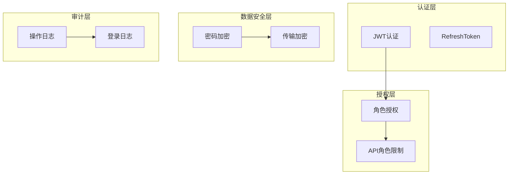
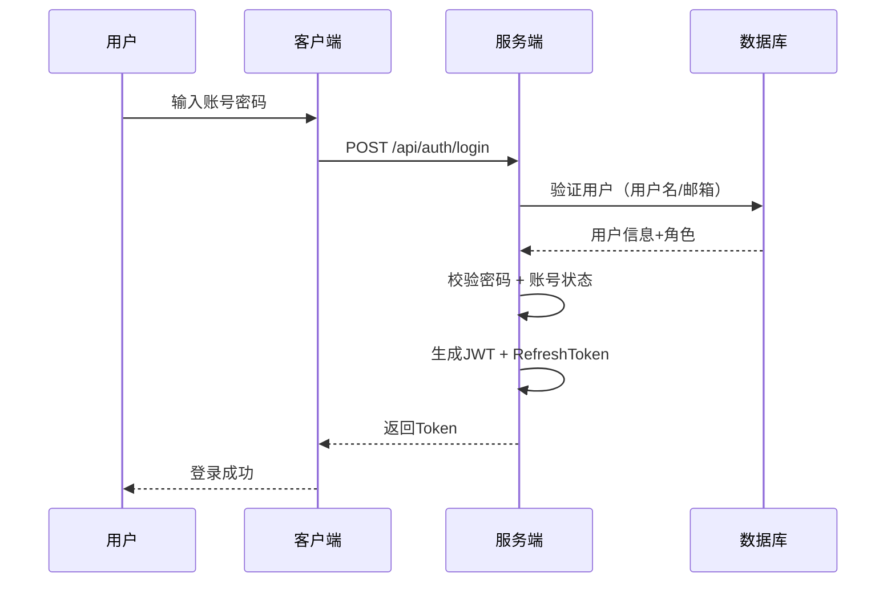

# 安全设计（V3.0）

**版本**：V3.0
**最后更新**：2026-08-26

---

## 一、安全架构概览



---

## 二、认证设计

### 2.1 JWT配置

| 配置项 | 值 | 说明 |
|--------|-----|------|
| 认证方式 | JWT Bearer Token | |
| Token有效期 | 8小时（`JwtSettings.ExpireMinutes = 480`） | |
| RefreshToken有效期 | 7天 | 持久化到数据库 |
| 算法 | HS256 | |

### 2.2 JWT Payload

```json
{
    "sub": "userId",
    "email": "user@example.com",
    "name": "userName",
    "jti": "tokenId",
    "fullName": "用户全名",
    "http://schemas.microsoft.com/ws/2008/06/identity/claims/role": "OrderViewer",
    "exp": 1744567890,
    "iss": "MES_Issuer",
    "aud": "MES_Audience"
}
```

> **说明**：
> 1. 角色声明使用 `new Claim(ClaimTypes.Role, role)` 生成，序列化后 key 为完整 URI `http://schemas.microsoft.com/ws/2008/06/identity/claims/role`（**不是**短名 `role`）。
> 2. 多角色用户该声明值为数组（每个角色一条）。
> 3. 前端 `CustomAuthStateProvider.ParseClaimsFromJwt` 同时识别短名 `role`/`roles` 与完整 URI 三种 key，数组值 `SelectMany` 展开为多条 Role claim，`IsInRole` 才能精确匹配菜单门控。
> 4. 角色模型变更后，存量用户必须重新登录获取新 JWT（旧 token 中的旧角色名匹配不上任何策略）。

### 2.3 登录流程



> **登录细节**：`AuthService.LoginAsync` 先按用户名、再按邮箱查找用户（`LoginRequest.Email` 字段语义=用户名/邮箱）；密码校验用 `CheckPasswordSignInAsync(user, password, lockoutOnFailure: false)`；账号被停用（`IsActive=false`）时拒绝登录。

---

## 三、授权设计

### 3.1 角色模型（纯一级，43 角色）

2026-08-26 用户决策：**取消全部二级菜单权限，回到纯一级模型**。角色 = `{菜单前缀}{档位}`，共 43 个：

| 主菜单 | Viewer（查） | Editor（查增改） | Full（查增改删） |
|--------|-------------|-----------------|-----------------|
| 订单管理 | OrderViewer | OrderEditor | OrderFull |
| 工单管理 | WorkOrderViewer | WorkOrderEditor | WorkOrderFull |
| 计划排程 | SchedulingViewer | SchedulingEditor | SchedulingFull |
| 批次管理 | BatchViewer | BatchEditor | BatchFull |
| 质量管理 | QualityViewer | QualityEditor | QualityFull |
| 物料管理 | MaterialViewer | MaterialEditor | MaterialFull |
| 仓库管理 | WarehouseViewer | WarehouseEditor | WarehouseFull |
| 设备管理 | EquipmentViewer | EquipmentEditor | EquipmentFull |
| 生产标准 | StandardViewer | StandardEditor | StandardFull |
| 报表系统 | ReportViewer | ReportEditor | ReportFull |
| 数据工具 | DataToolViewer | DataToolEditor | DataToolFull |
| 扫码管理 | ScanViewer | ScanEditor | ScanFull |
| 参数表 | ConfigurationViewer | ConfigurationEditor | ConfigurationFull |
| 用户管理 | UserViewer | UserEditor | UserFull |

**Admin（系统级）**：隐式全权——所有策略尾部固定 `",Admin"`，因此 Admin 自动拥有全部 14 主菜单的三档权限。

**档位语义：**
| 档位 | 权限 |
|------|------|
| Viewer | 只读（查询/查看/导出） |
| Editor | 查增改（查看 + 新增 + 修改 + 审批/刷新，不含删除） |
| Full | 查增改删（全量 CRUD，含删除） |

**角色常量**：定义于 `MES.Shared/Constants/Roles.cs`：
- `Roles.Menus.{Module}{Tier}`：14 菜单 × 3 档角色名常量（`Roles.Menus.OrderViewer` 等）。
- `Roles.Policies.{Module}{Action}`：授权策略字符串，统一管理 `[Authorize(Roles = "...")]` 中的组合，尾部恒含 `,Admin`。
- `Roles.GetAllRoles()`：全部 43 角色数组（用于初始化/校验）。

**报表数据域说明**：订单/工单/批次/质量/物料/仓库/计划排程 7 个数据域的**端点读**策略同时含 Report 三档角色（`XxxView = "...,ReportViewer,ReportEditor,ReportFull,Admin"`），使报表用户能读数据；**菜单门控用 XxxMenu 策略**（不含 Report 角色），避免报表用户看到数据域菜单。其余数据域（设备/生产标准/参数表等）端点读不含 Report 角色。

### 3.2 授权策略矩阵

以 `Roles.Policies` 定义为准，三档 × 四动作：

| 动作 | 策略 | 允许角色 |
|------|------|----------|
| 查看（读） | `XxxView` | 该菜单 Viewer/Editor/Full + （报表数据域再加 Report 三档）+ Admin |
| 编辑（写） | `XxxEdit` | 该菜单 Editor/Full + Admin |
| 删除 | `XxxDelete` | 该菜单 Full + Admin |
| 菜单门控 | `XxxMenu` | 该菜单 Viewer/Editor/Full + Admin（不含 Report） |

**跨域组合策略**（报表页等跨菜单场景）：
- `PendingDeliveryView`：订单 + 质量数据源并集（2026-08-26 待发货项自仓库迁入订单上下文后调整）。
- `BatchPlanSummaryView`：批次 + 计划排程 + 报表。

**扫码链例外**：扫码相关提交/读端点仅 `[Authorize]`（登录即可），**不**按 Scan 档位门控。

### 3.3 用户角色分配

一个用户可以拥有多个角色（用户管理页按「菜单 × 档位」勾选）：

```sql
-- 示例：张三（订单 Viewer + 质量 Editor）
INSERT INTO AspNetUserRoles (UserId, RoleId) VALUES
('zhangsan', (SELECT Id FROM AspNetRoles WHERE Name = 'OrderViewer')),
('zhangsan', (SELECT Id FROM AspNetRoles WHERE Name = 'QualityEditor'));

-- 示例：管理员
INSERT INTO AspNetUserRoles (UserId, RoleId) VALUES
('lisi', (SELECT Id FROM AspNetRoles WHERE Name = 'Admin'));
```

> 新建用户默认档位：9 个业务域菜单（订单/工单/计划排程/批次/质量/物料/设备/生产标准/仓库）= Viewer，其余系统菜单（报表/数据工具/扫码/参数表/用户管理）= None。新建密码明文默认 `123456`。

### 3.4 API 权限验证（Roles 常量类）

> **实践规范**：项目使用 `MES.Shared.Constants.Roles` 静态类管理角色策略（`Roles.cs`），禁止硬编码角色字符串。统一用 `[Authorize(Roles = Roles.Policies.XxxView/Edit/Delete)]`。Controller 方法返回类型统一使用 `ActionResult<ApiResponse<T>>`，POST/PUT 方法必须包含 `ModelState.IsValid` 检查。

```csharp
using MES.Shared.Constants;

[ApiController]
[Route("api/[controller]")]
[Authorize]
public class OrderController : ControllerBase
{
    // 查询：Order 三档 + Report 三档 + Admin 可读
    [HttpGet("list")]
    [Authorize(Roles = Roles.Policies.OrderView)]
    public async Task<ActionResult<ApiResponse<PagedResult<SalesOrderListDto>>>> GetPaged(
        [FromQuery] QueryParams query)
    {
        var result = await _orderService.GetPagedAsync(query);
        return Ok(ApiResponse<PagedResult<SalesOrderListDto>>.Ok(result, "查询成功"));
    }

    // 创建：OrderEditor/OrderFull + Admin，POST 方法必须校验 ModelState
    [HttpPost]
    [Authorize(Roles = Roles.Policies.OrderEdit)]
    public async Task<ActionResult<ApiResponse<SalesOrderListDto>>> Create(
        [FromBody] CreateSalesOrderRequest request)
    {
        if (!ModelState.IsValid)
            return BadRequest(ApiResponse<SalesOrderListDto>.Fail("请求参数无效"));
        var result = await _orderService.CreateAsync(request);
        return Ok(ApiResponse<SalesOrderListDto>.Ok(result, "创建成功"));
    }

    // 删除：仅 OrderFull + Admin
    [HttpDelete("{id}")]
    [Authorize(Roles = Roles.Policies.OrderDelete)]
    public async Task<ActionResult<ApiResponse>> Delete(int id)
    {
        await _orderService.DeleteAsync(id);
        return Ok(ApiResponse.Ok("删除成功"));
    }
}
```

### 3.5 前端菜单过滤

`MainLayout.razor` / `MobileLayout.razor` 使用 `<AuthorizeView Roles="@Roles.Policies.XxxMenu">` 声明式授权控制菜单显示：

```razor
@using MES.Shared.Constants

<AuthorizeView Roles="@Roles.Policies.OrderMenu">
    <MudNavLink Href="/orders" Icon="@Icons.Material.Filled.Description">订单管理</MudNavLink>
</AuthorizeView>
<AuthorizeView Roles="@Roles.Policies.WorkOrderMenu">
    <MudNavLink Href="/workorders" Icon="@Icons.Material.Filled.Engineering">工单管理</MudNavLink>
</AuthorizeView>
<AuthorizeView Roles="@Roles.Policies.QualityView">
    <MudNavLink Href="/quality" Icon="@Icons.Material.Filled.QualityControl">质量管理</MudNavLink>
</AuthorizeView>
```

> 注意：设备/生产标准/数据工具/扫码/报表/参数表/用户管理无独立 `XxxMenu` 策略，菜单门控直接复用 `XxxView`（含 Admin）。

---

## 四、数据安全

### 4.1 密码策略

| 策略项 | 要求 |
|--------|------|
| 最小长度 | 6 位（`Program.cs` 显式 `RequiredLength = 6`，其余复杂度开关全部关闭） |
| 复杂度 | 无强制（不要求大写/小写/数字/特殊字符，现场录入员使用简单密码） |
| 加密算法 | PBKDF2（ASP.NET Core Identity 默认） |
| 密码有效期 | 90天 ⚠️ 规划中，尚未实现 |

### 4.2 传输加密

| 配置项 | 说明 |
|--------|------|
| 传输协议 | HTTPS |
| TLS版本 | 1.2+ |
| 证书 | Let's Encrypt |

---

## 五、防攻击措施

| 攻击类型 | 防护措施 | 配置 |
|----------|----------|------|
| SQL注入 | EF Core参数化查询 | 默认 |
| XSS | Blazor默认编码 | 默认 |
| CSRF | JWT Bearer Token 天然免疫（不依赖 Cookie，无 CSRF 风险） | 无需额外配置 |
| 中间人攻击 | HTTPS + HSTS | 强制 |

> **说明**：当前登录不启用账户锁定（`CheckPasswordSignInAsync` 传 `lockoutOnFailure: false`），无"连续失败锁定"机制；如需暴力破解防护需后续接入。

---

## 六、安全配置清单

### 6.1 开发环境

| 配置项 | 值 |
|--------|-----|
| 用户机密 | dotnet user-secrets |
| 开发证书 | dotnet dev-certs |

### 6.2 生产环境

| 配置项 | 值 |
|--------|-----|
| 数据库连接 | 环境变量 |
| JWT密钥 | 环境变量 |
| 证书 | Let's Encrypt |
| 安全组 | 只开放80/443 |

---

## 七、版本历史

| 版本 | 日期 | 说明 |
|------|------|------|
| **V3.0** | **2026-08-26** | **整体重写为 43 角色纯一级模型**：废弃 17 角色（Admin + 8 主任 + 8 员工）两级模型；授权改为 `Roles.Menus.*` 三档 + `Roles.Policies.*` 策略（View/Edit/Delete/Menu，尾部恒含 Admin）；补 JWT 完整 URI 角色 claim 说明、前端 `ParseClaimsFromJwt` 解析、扫码链仅登录 `[Authorize]`、新建用户默认档位、密码策略放宽 6 位、无账户锁定说明 |
| V2.12 | 2026-08-15 | 文档失效内容清理：计划排程/配置上下文相关 API 保护清单核对 |
| V2.11 | 2026-08-09 | 配置上下文 API 保护补充 |
| V2.10 | 2026-08-01 | 文档同步更新 |

---

## 八、总结

```yaml
认证方式:
  - JWT Bearer Token + RefreshToken

授权模型:
  - 基于角色的访问控制（RBAC），纯一级
  - 43 个角色 = Admin + 14 主菜单 × 3 档（Viewer/Editor/Full）
  - Admin 隐式全权（策略尾部恒含 Admin）
  - 用户可拥有多个角色
  - 使用 ASP.NET Core Identity 自带的 3 张表

授权策略:
  - 后端: [Authorize(Roles = Roles.Policies.XxxView/Edit/Delete)]
  - 前端: <AuthorizeView Roles="@Roles.Policies.XxxMenu">
  - 扫码链: 仅 [Authorize]（登录即可）

已实现 API 保护:
  - 订单上下文 ✅（OrderController, CustomerController, ProductRequirementController, PendingDeliveryController）
  - 工单上下文 ✅（WorkOrderController, NotificationController, WorkOrderExecutionController, OrderDemandAdjustmentController, MaterialPlanController, MaterialPlanProcessGroupController, FixedLengthWorkOrderController）
  - 仓库上下文 ✅（WarehouseController, InventoryController）
  - 物料上下文 ✅（SupplierController, PurchaseOrderController, SubcontractOrderController）
  - 批次上下文 ✅（BatchController, ProductionRecordController, SectionOutsourceController, PicklingController）
  - 质量上下文 ✅（ProcessInspectionController, FinalInspectionsController, FurnaceRegistrationController, NcrController, ChemicalAnalysisController, TensileTestController, FlatteningTestController, FlaringTestController, HardnessTestController, GrainSizeTestController, MetallographicTestController, IntergranularCorrosionTestController, PittingCorrosionTestController, MaterialReceiveCheckController, QualityProcessTrackingController, CertificateController）
  - 设备上下文 ✅（EquipmentController, InspectionRecordController, MaintenanceOrderController, RepairOrderController）
  - 计划排程上下文 ✅（ProductionOverviewController, RawMaterialLockPlanAndExecutionController, SectionProductionStatusController, SectionParagraphFlowAnalysisController, WorkOrderScheduleController, BatchPlanController, BatchPlanScheduleController, ColdRollPlanController, ColdRollCapacityController, ColdRollMachineConfigController, ColdRollMachineGroupConfigController, ColdRollSpecScheduleController, FinalInspectionPlanController）
  - 生产标准上下文 ✅（StandardRegisterController, GradeMappingController, GradeChemicalCompositionController, GradePhysicalPropertyController, ChemicalCompositionController, ChemicalValidationRuleController, StandardInspectionRequirementController, FactoryInspectionRequirementController, SubStandardQuickViewController）
  - 配置上下文 ✅（StandardWorkDayController, StandardWorkDayDeliveryStateController, ConfigParameterController, DailyOutputEstimateController, DailyProductionCapacityController, SectionParagraphConfigSettingsController, EmployeeController, WorkstationController, ProcessDefinitionController, EnumDisplayDefinitionController, DictValueDefinitionController, CertificatePrintSettingController, CertificatePrintColumnDefinitionController, ProcessCardStyleDefinitionController, ProcessCardColumnDefinitionController）
  - 数据工具 ✅（DataExchangeController）
  - 基础设施 ✅（AuthController, ScanController）

规划中模块:
  - 审计日志（规划中）

一句话:
  - 安全设计采用 JWT 认证 + 43 角色（14 主菜单 × 三档）纯一级授权，
  - 订单、工单、仓库、物料、批次、质量、设备、计划排程、生产标准、配置、数据工具模块权限已完整实现。
```
