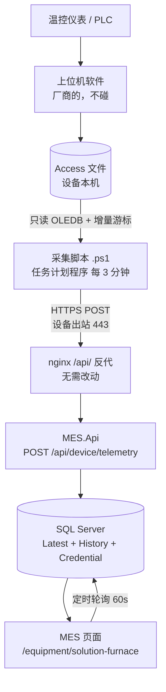

# 固溶炉数据采集与在线展示设计

> 版本：V1.0（2026-09-15）
> 状态：**设计阶段，未实施**。前置验证项（设备侧网络连通性、Access 表结构）尚未完成，见 §2.3。
> 归属上下文：设备上下文（Equipment）。角色策略复用 `Roles.Policies.EquipmentView`。
> 关联文档：《设备上下文详细设计》《设备上下文接口设计》

---

## 一、概述

### 1.1 背景

固溶炉是热处理关键设备，其**各区温度**直接决定固溶效果，是产品质量追溯链上的关键一环（批次在固溶工段的温度曲线是否符合工艺要求）。

当前该炉的数据只落在**设备本机的 Access 文件**中，设备**未接入网络**，只能靠 U 盘人工拷贝到其它电脑查看。MES 端看不到任何该炉的运行信息，也无法与批次/工艺要求做关联。

### 1.2 目标

- 在 MES 页面中以**温度曲线 + 数值卡**方式展示固溶炉各区温度
- 允许延迟 ≤ 5 分钟（**非硬实时**，这是本方案的省钱前提）
- **不改动设备侧上位机软件**、不要求厂商配合、不采集 PLC

### 1.3 非目标（明确不做）

| 不做 | 原因 |
|------|------|
| 秒级/毫秒级实时推送 | 允许 5 分钟延迟 → **SignalR / WebSocket / MQTT 一概不需要** |
| 设备反向控制 | 只读采集，不写回设备 |
| 在设备电脑上部署 MES | 见 §3.1，形态错误 |
| 采集 PLC 寄存器 | 数据已在 Access 中，绕开协议适配 |

### 1.4 关键约束

| 约束 | 值 | 对设计的影响 |
|------|-----|--------------|
| 允许延迟 | ≤ 5 分钟 | 页面用**定时轮询**即可，砍掉实时推送层 |
| 设备网络 | 目前无网络 | 需先解决出网（§10 风险） |
| 设备软件 | 上位机，不可改、不可求配合 | 只能从 Access 文件侧切入 |
| 设备电脑 | 普通 Windows PC | 能跑 PowerShell、能装驱动 |
| 数据源 | 单个 Access 文件，可直接复制后打开 | 无需走软件导出，可自动化 |
| 数据规模 | 约几百 MB / 3 年 | 禁止整文件复制（§4.3） |

---

## 二、现状与前置确认

### 2.1 数据源现状

```
[温控仪表/PLC] → [上位机软件（不可改）] → [Access 文件（设备本机）]
                                                    ↑
                                        本次方案的唯一入口
```

上位机软件的角色：读 PLC → 画画面 → 顺手把数据写进 Access。**本方案完全不接触该软件**，只读它吐出来的 Access 文件。

### 2.2 已确认事实

| 项 | 结论 |
|----|------|
| 设备电脑 | 普通 Windows PC |
| 网络 | 未上网；历史上靠 U 盘拷贝数据 |
| 数据源 | 单个 Access 文件（`.mdb` / `.accdb`） |
| 可否直接复制 | ✅ 可以，无需通过上位机软件的导出功能 |
| 表的数量 | 1 张 |
| 表性质 | 历史数据表（多行持续追加） |
| 数据内容 | **各区真实温度** |
| 数据规模 | 约几百 MB / 3 年 |

**由规模反推（待现场核对）**：

```
3 年 ≈ 158 万分钟
几百 MB ÷ 158 万行 ≈ 每行 200 字节
→ 约每分钟写入 1 行，3 年累计约 158 万行
```

该推算若成立，说明是"分钟级连续采样"，**足以画固溶曲线**（保温段平稳、升温段稍陡）。

同时可推论：若"每个炉区一行"，5 个区将使数据量翻 5 倍、文件应上 GB。因此**大概率是"一行含多列"**（`时间, 一区温度, 二区温度, ...`）。此项由现场字段名确认，**直接决定 MES 端表结构**。

### 2.3 待确认项（阻塞项）

> ⚠️ 以下任一项不成立，方案需重新评估。**必须在实施前完成**。

| # | 待确认 | 为什么阻塞 | 验证方式 |
|---|--------|-----------|----------|
| 1 | 设备电脑能否出外网 443 | 无它则一切免谈 | 见附录 A 步骤 1 |
| 2 | Access 表名 / 字段名 / 各炉区对应关系 | 决定 MES 表结构与点表常量 | 见附录 A 步骤 2 |
| 3 | 主键是否为自增（AutoNumber） | **决定增量游标方案**（§4.2） | 设计视图看主键类型 |
| 4 | 时间字段是否有索引 | 决定读取性能 | 索引视图 |
| 5 | 访问 .accdb 的 ACE 驱动是否已装 | 决定能否读取 | 见附录 A 步骤 3 |
| 6 | 炉区数量与命名 | 决定 `FurnacePointKeys` 常量 | 看字段名 |

---

## 三、总体方案

### 3.1 设计取舍：为什么不在设备上装 MES

原始设想是"在设备电脑上安装我们的 MES，把 Access 数据转到 SQL Server"。**该形态不成立**：

| | 设备端装什么 | 云端负责 |
|---|--------------|----------|
| ❌ 在设备上装 MES | .NET 8 运行时 + API + SQL Server | 只做展示 |
| ✅ **推荐：设备端仅采集脚本** | **单个 `.ps1`（KB 级）** | 接收 + 存 SQL Server + 画页面 |

理由：

1. **MES 永远只应有云端那一份**。设备端那个东西算不上"程序"，是个搬运工。
2. 设备电脑还跑着上位机，配置有限，装重型运行时风险大。
3. SQL Server 在云端本来就是现成的，放在设备旁边再让云端去读，方向反了。
4. 设备端脚本越薄越可靠，也越容易重装恢复。

### 3.2 链路总览



**关键点**：设备方无公网 IP、在 NAT 后 → 必须**设备主动出站**，MES 不能主动去连设备。这也意味着 MES 只能看到"设备愿意推过来的数据"。

### 3.3 职责划分

| 环节 | 负责方 | 做什么 |
|------|--------|--------|
| 读 Access | 设备脚本 | 增量取数、序列化、POST |
| 游标管理 | 设备脚本（本地文件） | 记录已同步到的位置，天然幂等 |
| 鉴权 | 云端 | 校验设备密钥，只允许写自己的编号 |
| 落库 | 云端 | 写历史点 + 更新最新快照 |
| 在线判定 | 云端 | Hangfire 定期扫描"多久没上报" |
| 展示 | 云端 | 曲线、数值卡、陈旧态提示 |

---

## 四、设备侧（固溶炉电脑）

### 4.1 读取方式

- 技术：**OLE DB**（`System.Data.OleDb`，PowerShell 自带，无需安装运行时）
- 模式：**只读打开**（`Mode=Read`），**不复制文件**

> ⚠️ **禁止"复制副本再读"**（此前的备选建议在确认文件规模后作废）：
> 几百 MB × 每 3 分钟一次 × 480 次/天 ≈ **每天 144GB 磁盘写入**，会拖垮设备电脑并可能影响上位机。
> 仅在直读确实撞锁时才退回复制，且必须**降低频率**（如每 30 分钟复制一次、一次取回 30 分钟数据）。

### 4.2 增量游标与幂等键

**首选：以 Access 表的自增主键 `ID` 作为游标**

```sql
SELECT * FROM <温度表> WHERE ID > @上次最大ID ORDER BY ID
```

优点：

- 主键天然带索引 → **毫秒级**，不依赖时间字段有没有索引
- 免疫时钟回拨、时间精度、重复时间戳三类问题
- 该 ID **同时充当幂等键**：同一条 Access 记录永远只对应云端一行

**兜底（无自增主键时）**：

1. 用时间字段（需确认有索引）
2. 再不济用 `SELECT TOP 200 * FROM <表> ORDER BY 时间 DESC` 倒序取尾部（不依赖索引，但需自行去重）

**幂等**：云端对 `(EquipmentCode, DeviceRecordKey, PointKey)` 建唯一索引，重复上传静默忽略 → 断网重传无副作用。

### 4.3 采集脚本设计

- 语言：**PowerShell 5.1**（Windows 自带，设备端零安装）
- 触发：**任务计划程序**，每 3 分钟一次
- 单次流程：

```
1. 读本地游标文件（上次同步到的最大 ID），无则取 0
2. 只读打开 Access，取 ID > 游标的行
3. 无新行 → 直接退出（最常见的情况，开销极小）
4. 序列化为 UTF-8 JSON
5. POST /api/device/telemetry（带 X-Device-Key 请求头，超时 30s）
6. 成功 → 写回游标文件；失败 → 保留游标，下次重取（靠幂等兜底）
```

**编码纪律（本仓已踩过的坑，务必遵守）**：

| 坑 | 后果 | 做法 |
|----|------|------|
| `.ps1` 含中文且无 BOM | PS 5.1 按 ANSI 读 → 中文注释吞掉下一行代码，**静默跳过** | **脚本纯 ASCII** |
| `Invoke-RestMethod` 传 string body | 按 GBK 发送 → 中文乱码 | 必须转 `UTF8.GetBytes()` 字节数组 |
| 中文路径内联 | 被 shell 破坏 | 脚本内用变量拼接，不写死在内联命令里 |

### 4.4 部署方式

- 用**任务计划程序**（`schtasks` / GUI），**不要做成 Windows 服务**
  - 本方案只读数据库，服务方式技术上可行；但**若将来追加截屏功能，服务一定失败**——服务运行在 Session 0，与用户桌面隔离，截出来全黑。统一用任务计划程序可避免后期返工。
- 触发器：每 3 分钟，重复间隔无限期
- 勾选：开机后自动可用、"不管用户是否登录都要运行"（若后续加截屏则改为"用户登录时运行"）
- 日志：脚本写本地滚动日志（保留 7 天），便于断采排查

### 4.5 运行环境要求

| 项 | 要求 |
|----|------|
| `.accdb` 驱动 | `Microsoft.ACE.OLEDB.12.0` |
| `.mdb` 驱动 | `Microsoft.Jet.OLEDB.4.0`（老）或 ACE |
| 位数匹配 | 驱动位数必须与调用它的 PowerShell 一致；32 位请用 `C:\Windows\SysWOW64\WindowsPowerShell\v1.0\powershell.exe` |
| 离线安装 | 设备无网络 → **安装包须提前在联网电脑下载后用 U 盘带过去** |

**核实命令**：

```powershell
(New-Object System.Data.OleDb.OleDbEnumerator).GetElements() | Select-Object SOURCES_NAME
```

### 4.6 二次确认与配置

以下值在脚本以**配置块**形式集中在文件头部，现场一次性填好后不再改动：

```
AccessFilePath   访问文件的完整路径
TableName        温度表名
IdColumn         自增主键列名
TimeColumn       时间列名
PointColumnMap   列名 → 点 Key 的映射（如 "Zone1" → "Zone1Temp"）
ApiBaseUrl       https://zhz.js.cn
DeviceKey        设备密钥（明文仅存于设备本机）
```

---

## 五、云端接收

### 5.1 端点设计

路径统一置于 `/api/` 前缀下 → **复用 nginx 既有反向代理，无需改动 nginx 配置、无需 reload**。

| 方法 | 路径 | 用途 | 鉴权 |
|------|------|------|------|
| POST | `/api/device/telemetry` | 设备上传增量数据 | **设备密钥**（非 JWT） |
| GET | `/api/device/telemetry/{equipmentCode}/latest` | 最新快照（页面首屏） | `Policies.EquipmentView` |
| GET | `/api/device/telemetry/{equipmentCode}/series` | 曲线数据（`from` / `to` / `pointKeys`） | `Policies.EquipmentView` |
| GET | `/api/device/telemetry/{equipmentCode}/status` | 在线状态与陈旧时长 | `Policies.EquipmentView` |

### 5.2 设备鉴权

设备**没有用户账号**，不能走现有 JWT 体系（设备端无 token 刷新能力）。因此：

- 新增 `DeviceCredential` 表：`EquipmentCode` + `ApiKeyHash` + `IsEnabled`
- 请求头携带 `X-Device-Key`，云端**比对哈希**（**不存明文**）
- 校验通过后，**只允许写该密钥对应的 `EquipmentCode`**（防止一台设备伪造别台数据）
- 上传端点**不挂 `Roles` 策略**（设备无法登录），密钥校验在服务层完成
  - ⚠️ 该端点是全项目唯一"无角色策略的业务写端点"，实施时须加**专门的单测**锁住这一点，防止后续被误加 `[Authorize]` 导致设备静默断采

### 5.3 幂等与限流

- **幂等**：唯一索引兜底，重复记录静默忽略（不报错、不重复入库）
- **限流**：单设备每分钟最多 N 次上传（建议 N=10），超限返回 429，防设备异常刷爆
- **体积上限**：单次请求体上限（建议 5MB），超限拒绝并记录

---

## 六、数据模型

> 实体均继承 `BaseEntity`，命名与约束遵循《04_开发规范》。

### 6.1 实体

**① `DeviceTelemetryPoint`（历史点）**

| 字段 | 类型 | 说明 |
|------|------|------|
| EquipmentCode | string | 设备编号（关联 `Equipment.EquipmentCode`） |
| PointKey | string | 测点 Key（英文），如各区温度 |
| NumericValue | decimal | 数值 |
| CollectedTime | DateTime | **设备侧数据时间**（来自 Access） |
| DeviceRecordKey | string | 幂等键 = 设备侧记录的唯一标识 |

**② `DeviceTelemetryLatest`（最新快照，一台设备一行）**

| 字段 | 类型 | 说明 |
|------|------|------|
| EquipmentCode | string | 设备编号（唯一） |
| CollectedTime | DateTime | 最后一条数据的数据时间 |
| ReceivedTime | DateTimeOffset | **服务端接收时间**（在线判定以此为准） |
| Payload | string | JSON 快照（各区温度，页面首屏直接读，免聚合） |

**③ `DeviceCredential`（设备密钥）**

| 字段 | 类型 | 说明 |
|------|------|------|
| EquipmentCode | string | 设备编号（唯一） |
| ApiKeyHash | string | 密钥哈希 |
| IsEnabled | bool | 是否启用 |
| LastSeenTime | DateTimeOffset? | 最近一次上报时间（诊断用） |

> **游标不落库**：增量游标保存在设备本机文件，云端不参与，避免两端状态不一致。

### 6.2 索引

| 表 | 索引 | 用途 |
|----|------|------|
| DeviceTelemetryPoint | 唯一 `(EquipmentCode, DeviceRecordKey, PointKey)` | 幂等 |
| DeviceTelemetryPoint | 普通 `(EquipmentCode, PointKey, CollectedTime)` | 曲线查询 |
| DeviceTelemetryLatest | 唯一 `(EquipmentCode)` | 首屏快照 |
| DeviceCredential | 唯一 `(EquipmentCode)` | 鉴权 |

### 6.3 数据保留策略

测算（按 6 区、每分钟 1 次）：

```
6 区 × 1440 分钟 = 8,640 行/天/台
→ 约 315 万行/年/台
```

- 建议：**保留 1 年**，由 Hangfire 每日低峰期清理超期点
- 首期设备少、数据量小，可先不清理，观察磁盘后再启用

### 6.4 常量定义

- 新增常量类 `FurnacePointKeys`（沿用 `SectionDefs` / `ProcessKeys` 范式）
- **英文 Key 存储、中文显示**：显示名与单位经显示助手输出，**禁止中文判断、禁止魔法字符串**
- 炉区数量确认后一次性定义完整，后续增区只需加常量 + 迁移补数据

---

## 七、前端展示

### 7.1 页面

- 路由：`/equipment/solution-furnace`（固溶炉监控）
- 容器：`MudContainer MaxWidth="MaxWidth.False"` 全宽
- 区域构成：

| 区域 | 内容 |
|------|------|
| 顶部状态条 | 设备名 + **「X 分钟前」** + 在线/陈旧标记 + 手动刷新按钮 |
| 数值卡区 | 各区当前温度（大字号）+ 设定值 + 偏差 |
| 曲线区 | 各区温度-时间曲线（多序列），可切时间范围（最近 1h / 8h / 24h / 自定义） |
| 明细表 | 最近若干条采样记录（服务端分页 + 列显隐 + 排序，遵循列表页标配） |

### 7.2 图表方案

> ⚠️ **现状：全仓目前没有任何图表库**（`MES.Blazor.csproj` 仅 MudBlazor；现有 "Chart" 匹配全是 `Icons.Material.Filled.TableChart` 图标，非图表组件）。**这是本次必须新增的能力，且需先行技术验证。**

| 方案 | 依赖 | 评价 |
|------|------|------|
| ① MudBlazor 内置 `MudChart`（Line / TimeSeriesLine） | 零新增依赖 | 优先验证：能力基础，需确认多序列与时间轴表现是否满足 |
| ② ApexCharts.Blazor / Blazor-ApexCharts | 需加包 | 功能完整、交互好，为备选 |
| ③ ECharts + JS interop | 需加 JS 库 | 最灵活、工作量最大，非必要不上 |

**建议**：先做**最小验证页**（假数据 + 多序列 + 时间轴）确认方案 ①，不满足再上 ②。**在验证通过前，不要动图表相关的页面结构。**

### 7.3 数据陈旧态（必须有）

- **强制显示「X 分钟前」**，且以**服务端接收时间**计算，不用设备时间（设备常年不校时）
- 超过阈值（建议 15 分钟）→ 标记「数据陈旧」并变色
- 超过更长阈值（建议 2 小时）→ 标记「设备离线」
- ⚠️ **禁止把旧数据当实时展示**——运维会误判炉子状态，这是本方案最危险的使用误区

### 7.4 刷新方式

- **定时轮询**（60 秒），组件 `IDisposable` 中释放 Timer
- 不做 SignalR/WebSocket（允许 5 分钟延迟，没有必要）

### 7.5 菜单与权限

- 菜单位置：`AppMenu.cs` **设备管理** 组下新增「固溶炉监控」→ `/equipment/solution-furnace`
- 组级 `Policy` 已是 `Roles.Policies.EquipmentView`，新叶子沿用
- ⚠️ 改动 `AppMenu` **必须同步补 `AppMenuTests` 断言**（本仓既有纪律，防菜单漂移）

---

## 八、与 MES 的联动（本方案的核心价值）

固溶在现有系统中**已是一等公民**：

| 现有对象 | 说明 | 位置 |
|----------|------|------|
| `SectionDefs.Solution` = `"固溶"` | 固溶工段 | `MES.Core/Constants/SectionDefs.cs:16` |
| `ProductionBatch.SolutionParams` | 固溶**参数要求**（如 "1080℃ ±15℃"），人工填 | `MES.Data/Entities/Batch/ProductionBatch.cs:57` |
| `ProductionRecord.SolutionTemperature` | 固溶**实际温度**（℃），人工填 | `MES.Data/Entities/Batch/ProductionRecord.cs:77` |

### 8.1 现状与机会

`ProductionRecord.SolutionTemperature` 目前由**操作工手工录入**。固溶炉数据一旦自动采集，即可：

1. **自动带入**：按批次在固溶工段的作业时间段，取该时段炉温（如保温段均值/峰值）回填
2. **交叉校验**：自动值与人工值比对，偏差过大则提示
3. **曲线留档**：把批次对应的温度曲线作为质量证据留存

### 8.2 工艺符合性判定（进阶）

以 `SolutionParams`（如 "1080℃ ±15℃"）为基准，对自动采集的曲线做判定：

| 判定项 | 规则示例 |
|--------|----------|
| 保温温度 | 各区实际值是否落在设定值 ± 公差内 |
| 保温时长 | 温度进入公差带后的持续时长是否达标 |
| 升温速率 | 是否超过工艺允许速率 |

判定结果可作为质量追溯与质量证明书的数据来源之一。

> ⚠️ 该阶段需与质量/工艺口径确认后才能实施，且需要把"批次 ↔ 炉次时间段"的对应关系打通（目前无采集数据，尚不具备）。

---

## 九、分期实施

| 阶段 | 内容 | 前置条件 |
|------|------|----------|
| **0** | **现场验证**：网络连通性 + Access 表结构 + 驱动 | —（**必须先做**） |
| 1 | 云端接收集：3 张表 + 迁移 + 设备密钥 + 上传端点 + 上传单测 | 无（可先行） |
| 2 | 设备侧采集脚本上线，替换假数据 | 阶段 0 全部通过 |
| 3 | 展示页面：数值卡 + 曲线 + 陈旧态 + 菜单 | 阶段 1、7.2 图表方案验证通过 |
| 4 | 回填 `ProductionRecord.SolutionTemperature` + 符合性判定 | 阶段 3 + 质量/工艺口径确认 |
| 5（可选） | 截屏上传（现场佐证） | 阶段 3；复用现有 `AttachmentStorage` |

**建议顺序说明**：阶段 0 是唯一不可跳过的；阶段 1 可在等待现场验证期间并行推进（用假数据打通链路），届时现场一通即可直接上线。

---

## 十、风险与对策

| # | 风险 | 影响 | 对策 |
|---|------|------|------|
| 1 | 设备所在网络出不去外网 | **全案阻塞** | 优先用**手机热点**验证可行性；长期方案：拉网线 / **4G 路由**（不动原有网卡，加 USB 网卡或走 WiFi，避免影响上位机↔PLC 通讯） |
| 2 | Access 表无自增主键 | 增量游标退化 | 退回时间字段；再退回 `TOP N` 倒序取尾部 |
| 3 | 时间字段无索引 | 每 3 分钟全表扫描 | 用 `TOP N ... ORDER BY 时间 DESC`；或加大采集间隔 |
| 4 | 上位机独占 Access 文件 | 读不到数据 | 已确认可复制 → 退回复制副本，**并降低频率** |
| 5 | 设备电脑重装 / 脚本丢失 | 断采且无人察觉 | 开机自启 + 云端「数据陈旧」告警 |
| 6 | 4G 流量卡欠费 / 厂房信号弱 | 断采 | 厂房金属结构屏蔽严重，**买设备前先测信号** |
| 7 | 把陈旧数据当实时看 | **运维误判炉况** | 页面强制显示「X 分钟前」+ 陈旧变色（§7.3） |
| 8 | 给孤岛机联网触碰厂内安全规定 | 组织风险 | **先报备**，勿自行插线 |
| 9 | 图表方案未验证即开发页面 | 返工 | 先做最小验证页（§7.2） |

---

## 附录 A：现场实测清单

> 到设备前逐条执行，结果直接回填。**任一项失败即暂停后续实施**。

### 步骤 1：网络连通性（**用手机开热点即可，零成本**）

| # | 命令 | 预期 | 实测 |
|---|------|------|------|
| 1.1 | `ping 223.5.5.5` | 通/不通（部分厂禁 ICMP，不通不代表不行） | |
| 1.2 | `Test-NetConnection zhz.js.cn -Port 443 -InformationLevel Detailed` | `TcpTestSucceeded : True` | |
| 1.3 | `Test-NetConnection 111.231.10.18 -Port 443` | 用于分诊 | |
| 1.4 | `(Invoke-WebRequest https://zhz.js.cn/api/health -UseBasicParsing).StatusCode` | `200` | |

**分诊逻辑**

| 1.2 | 1.3 | 结论 | 处理 |
|-----|-----|------|------|
| 通 | 通 | ✅ 全通 | 直接实施 |
| 不通 | 通 | **DNS 问题** | 改 hosts 即可 |
| 不通 | 不通 | 网络出口问题 | 找厂内 IT 放行，或上 4G 路由 |
| 报"需要代理" | — | 需走企业代理 | 脚本加 `-Proxy` 配置项 |

### 步骤 2：Access 表结构

| # | 要记录的 | 用途 | 实测 |
|---|----------|------|------|
| 2.1 | 文件完整路径 + 扩展名（`.mdb` / `.accdb`） | 决定驱动 | |
| 2.2 | 表名 | 脚本配置 | |
| 2.3 | 全部字段名 + 类型 | **建 MES 表结构** | |
| 2.4 | 哪几个字段是"各区温度" | 点表映射 | |
| 2.5 | 主键列名 + **是否自增** | **决定增量游标** | |
| 2.6 | 时间字段名 + **是否有索引** | 决定读取性能 | |
| 2.7 | 表总行数 | 核对"每分钟 1 行"推算 | |
| 2.8 | 最新一行的时间 | 确认数据是活的、写入频率 | |

### 步骤 3：驱动

| # | 命令 | 预期 | 实测 |
|---|------|------|------|
| 3.1 | `(New-Object System.Data.OleDb.OleDbEnumerator).GetElements() \| Select SOURCES_NAME` | 含 `Microsoft.ACE.OLEDB.12.0` | |
| 3.2 | 若缺：确认 PowerShell 位数 | `[Environment]::Is64BitProcess` | |
| 3.3 | 若缺：下载匹配位数安装包，U 盘带去 | — | |

---

## 附录 B：流量与存储测算

**上行流量（数值方案）**

| 项 | 测算 |
|----|------|
| 单次上传 | 3 行（3 分钟 × 每分钟 1 行）× 6 区 ≈ 数百字节 |
| 每天 | 约 150 KB |
| 每月 | 约 4.5 MB |

→ **4G 流量完全不是问题**（对比：截屏方案 200KB/帧 × 每 3 分钟 ≈ 2.9 GB/月）。

**云端存储**

| 项 | 测算 |
|----|------|
| 历史点 | 6 区 × 1440 分钟 ≈ 8,640 行/天/台 |
| 每年 | 约 315 万行/台 |
| 建议保留 | 1 年（Hangfire 日清） |

**设备侧首次回导（可选）**

| 范围 | 行数 | 建议 |
|------|------|------|
| 最近 7 天 | 约 1 万行 | ✅ 首次就用这个，页面马上有曲线 |
| 最近 1 个月 | 约 4.3 万行 | 可分 5~10 批 |
| 最近 3 个月 | 约 13 万行 | 上限 |
| 全部 3 年 | 158 万行 | ❌ 无必要，不走 API 归档 |

---

## 附录 C：命名清单

| 类别 | 名称 | 位置 |
|------|------|------|
| 实体 | `DeviceTelemetryPoint` | `MES.Data/Entities/Equipment/` |
| 实体 | `DeviceTelemetryLatest` | 同上 |
| 实体 | `DeviceCredential` | 同上 |
| 常量 | `FurnacePointKeys` | `MES.Core/Constants/` |
| 接口 | `IDeviceTelemetryService` | `MES.Core/Interfaces/Equipment/` |
| 服务 | `DeviceTelemetryService` | `MES.Services/Equipment/` |
| 控制器 | `DeviceTelemetryController` | `MES.Api/Controllers/Equipment/` |
| 页面 | `/equipment/solution-furnace` | `MES.Blazor/Pages/Equipment/` |
| 菜单 | 「固溶炉监控」 | `MES.Blazor/Shared/AppMenu.cs` 设备管理组 |
| 设备脚本 | `collect-solution-furnace.ps1` | 设备本机（不入库，纯 ASCII） |

---

## 修订记录

| 版本 | 日期 | 变更 |
|------|------|------|
| V1.0 | 2026-09-15 | 首版。确立"设备端仅采集脚本 + 云端接收展示"形态；明确 5 分钟延迟下不需实时推送；确定增量游标与幂等键设计；标注图表能力为待验证项；列出 9 项风险与现场实测清单 |
