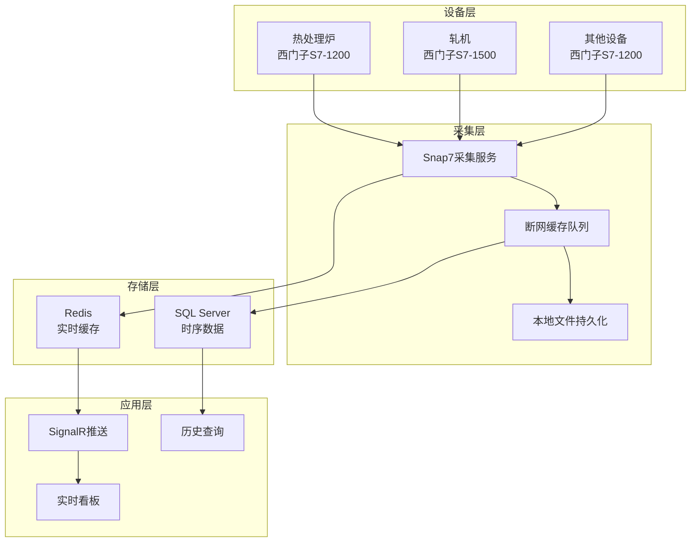

> **📖 参考文档**：本文档为规划中的参考文档，未与具体代码实现同步，不作为开发依据。
>
> **⚠️ 规划中，尚未实现**

# 数据采集设计

**版本：V1.2**
**最后更新：2026-08-15**

---

## 一、采集架构



## 二、PLC通信配置
### 2.1 通信协议

| 项目 | 配置 |
|------|------|
| 协议 | Snap7（西门子S7协议，V2.0 规划依赖） |
| 端口 | 102 |
| 采集频率 | 3秒/次（可配置） |
| 超时时间 | 5秒 |

> **V2.0 依赖说明**：Snap7、SignalR、Redis（StackExchange.Redis）等依赖项尚未安装，详见 `01_设计总纲领.md` 2.1 节技术规划表。本设计文档为 V2.0 实现蓝图。

### 2.2 PLC连接配置
```json
// appsettings.json
{
  "PlcConfigs": [
    {
      "DeviceId": "HeatFurnace",
      "DeviceName": "热处理炉",
      "IpAddress": "192.168.1.10",
      "Rack": 0,
      "Slot": 1,
      "IntervalMs": 3000,
      "Tags": [
        { "Name": "Temperature", "Address": "DB1.DBW20", "DataType": "Real" },
        { "Name": "Pressure", "Address": "DB1.DBW24", "DataType": "Real" }
      ]
    },
    {
      "DeviceId": "RollingMill",
      "DeviceName": "轧机",
      "IpAddress": "192.168.1.11",
      "Rack": 0,
      "Slot": 1,
      "IntervalMs": 3000,
      "Tags": [
        { "Name": "Speed", "Address": "DB2.DBD10", "DataType": "Real" },
        { "Name": "Current", "Address": "DB2.DBD14", "DataType": "Real" }
      ]
    }
  ]
}
```

## 三、采集服务实现
### 3.1 后台服务
```csharp
public class PlcCollectionService : BackgroundService
{
    private readonly IServiceScopeFactory _scopeFactory;
    private readonly ILogger<PlcCollectionService> _logger;
    private readonly ConcurrentDictionary<string, S7Client> _clients;
    private readonly ConcurrentQueue<PlcData> _cacheQueue;
    
    protected override async Task ExecuteAsync(CancellationToken stoppingToken)
    {
        while (!stoppingToken.IsCancellationRequested)
        {
            try
            {
                await CollectAllPlcsAsync();
                await Task.Delay(3000, stoppingToken);
            }
            catch (Exception ex)
            {
                _logger.LogError(ex, "采集失败");
            }
        }
    }
    
    private async Task CollectAllPlcsAsync()
    {
        var tasks = _plcConfigs.Select(config => CollectSinglePlcAsync(config));
        await Task.WhenAll(tasks);
    }
    
    private async Task CollectSinglePlcAsync(PlcConfig config)
    {
        try
        {
            var client = GetOrCreateClient(config);
            if (!client.IsConnected)
            {
                await ReconnectAsync(client, config);
                return;
            }
            
            var data = await ReadPlcDataAsync(client, config);
            await ProcessDataAsync(data);
        }
        catch (Exception ex)
        {
            _logger.LogError(ex, "采集设备 {DeviceId} 失败", config.DeviceId);
            _cacheQueue.Enqueue(new PlcData { DeviceId = config.DeviceId, Error = ex.Message });
        }
    }
}
```

### 3.2 数据读取
```csharp
private float ReadReal(S7Client client, string address)
{
    var (dbNum, startByte) = ParseAddress(address);
    byte[] buffer = new byte[4];
    client.ReadArea(S7Consts.s7AreaDB, dbNum, startByte, 4, buffer);
    Array.Reverse(buffer); // 西门子大端序
    return BitConverter.ToSingle(buffer, 0);
}
```

## 四、断网缓存
### 4.1 缓存机制
```yaml
内存队列:
  - 结构: ConcurrentQueue<PlcData>
  - 容量: 10000条
  - 策略: 先进先出

文件持久化:
  - 路径: /data/cache/plc_cache.json
  - 格式: JSON Lines
  - 恢复: 服务启动时自动加载
```
### 4.2 缓存实现
```csharp
public class OfflineCacheService
{
    private readonly ConcurrentQueue<PlcData> _memoryQueue = new();
    private readonly string _cacheFile = "/data/cache/plc_cache.json";
    
    public void Enqueue(PlcData data)
    {
        _memoryQueue.Enqueue(data);
        File.AppendAllText(_cacheFile, JsonSerializer.Serialize(data) + "\n");
    }
    
    public async Task FlushAsync(AppDbContext db)
    {
        while (_memoryQueue.TryDequeue(out var data))
        {
            try
            {
                db.PlcHistories.Add(data);
                await db.SaveChangesAsync();
            }
            catch
            {
                _memoryQueue.Enqueue(data);
                break;
            }
        }
        
        if (_memoryQueue.IsEmpty)
        {
            File.Delete(_cacheFile);
        }
    }
}
```
## 五、数据存储
### 5.1 时序数据表
```sql
CREATE TABLE PlcHistory (
    Id BIGINT PRIMARY KEY IDENTITY,
    DeviceId NVARCHAR(50) NOT NULL,
    TagName NVARCHAR(50) NOT NULL,
    Value DECIMAL(18,4),
    Quality INT DEFAULT 192,
    CollectTime DATETIMEOFFSET NOT NULL,
    CreatedTime DATETIMEOFFSET DEFAULT SYSDATETIMEOFFSET()
);

-- 按月分表（自动创建）
SELECT * INTO PlcHistory_202401 FROM PlcHistory WHERE 1=0;
SELECT * INTO PlcHistory_202402 FROM PlcHistory WHERE 1=0;
```

### 5.2 实时缓存（Redis）
```csharp
// 存储最新值
await _redis.HashSetAsync($"plc:{deviceId}:latest", new HashEntry[]
{
    new HashEntry("temperature", temperature),
    new HashEntry("pressure", pressure),
    new HashEntry("timestamp", DateTime.Now.Ticks)
});

// 设置过期时间
await _redis.KeyExpireAsync($"plc:{deviceId}:latest", TimeSpan.FromHours(24));
```

## 六、监控看板
### 6.1 SignalR推送
```csharp
public class MonitorHub : Hub
{
    public async Task SendPlcData(PlcData data)
    {
        await Clients.All.SendAsync("OnPlcData", data);
    }
}
```
### 6.2 前端接收
```csharp
// Blazor组件
hubConnection.On<PlcData>("OnPlcData", (data) =>
{
    currentTemperature = data.Temperature;
    currentPressure = data.Pressure;
    StateHasChanged();
});
```

## 七、版本历史

| 版本 | 日期 | 说明 |
|------|------|------|
| **V1.2** | **2026-08-15** | **文档失效内容清理**：本文档为「规划中，尚未实现」参考文档，不随代码同步；核对无失效描述，仅 Version bump |
| V1.0 | 2026-04-12 | 初始版本，数据采集规划蓝图 |
| V1.1 | 2026-05-17 | 修正日期格式为 ISO 标准；补充版本历史章节 |

---

## 八、总结
```yaml
采集方案:
  - 协议: Snap7（西门子PLC）
  - 频率: 3秒/次
  - 缓存: 内存队列 + 文件持久化
  - 存储: SQL Server按月分表 + Redis实时缓存
  - 推送: SignalR实时看板

一句话:
  - 数据采集采用Snap7协议采集西门子PLC数据，
  - 断网缓存保证数据不丢失，
  - 按月分表存储时序数据，
  - SignalR实时推送看板。
```
