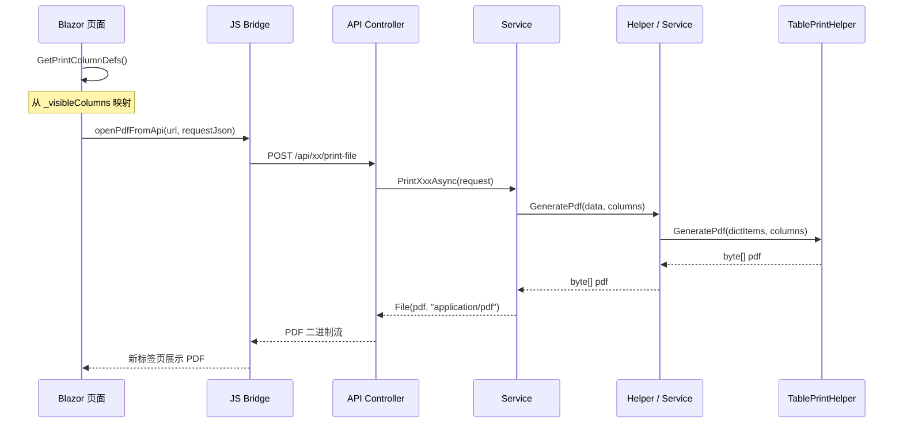

# 打印模块设计

**版本：V2.9**
**最后更新：2026-08-18**
**适用范围：MES系统所有打印功能**

---

## 一、总体架构

### 1.1 分类体系

```
打印
├── 前端打印（浏览器端渲染，JS window.print）
│   ├── ProcessCardPrint.razor
│   └── OrderDetail.razor 等
│
└── 后端打印（服务端 PDF 生成，QuestPDF）
    ├── Mode A：自包含富布局
    │   └── Helper 调用 Document.Create()，列硬编码
    │
    ├── Mode B：TablePrintHelper 驱动
    │   └── Helper 封装，列来自前端 PrintColumnDef
    │
    └── Mode B（内联）：TablePrintHelper 直接调用
        └── Service/Controller 内联调用，无 Helper 封装
```

### 1.2 技术选型

| 维度 | 前端打印 | 后端打印 |
|------|-----------|-------------|
| 渲染端 | 浏览器 (Blazor) | 服务端 (QuestPDF) |
| PDF 生成 | 浏览器打印 | QuestPDF Document |
| 触发方式 | `window.print()` | `openPdfFromApi` JS 调用 |
| 列来源 | 前端直接渲染 | 硬编码 / 前端传输 |

### 1.3 JS 桥接方法

位于 `wwwroot/js/print.js`：

| 函数 | 类型 | 说明 |
|------|------|------|
| `window.MES.printQrCodes` | HTML | 构建 QR 码 HTML，新窗口打开后打印 |
| `window.printRawHtml` | HTML | 接收 HTML 字符串，包装为打印页后打印 |
| `window.openPdf` | PDF Base64 | 解码 Base64 PDF，Blob URL 展示 |
| `window.openPdfFromApi` | PDF fetch | 从 API 获取 PDF（JWT 认证），支持 `application/pdf` 和 Base64 两种响应 |

---

## 二、前端打印

### 2.1 流程

1. 页面初始化时加载 HTML 内容
2. 前端调用 `JS.InvokeVoidAsync("openPdfInNewTab", url)` 或 `JS.InvokeVoidAsync("print")` 触发打印
3. 用户手动 Ctrl+P 或调用 `window.print()`

### 2.2 对应关系

| 页面 | 触发方式 | 说明 |
|------|---------|------|
| ProcessCardPrint.razor | `openPdfFromApi`（工艺卡 PDF），`window.print()`（工艺卡 HTML） | 双模式：列表页调用 PDF，打印页走 HTML |
| OrderDetail.razor | `openPdfFromApi` | 销售订单打印 |
| PurchaseOrders.razor | `openPdfFromApi` | 采购订单打印 |
| SubcontractOrders.razor | `openPdfFromApi` | 委外订单打印 |
| WorkOrderDetail.razor | `openPdfFromApi` | 工单打印 |
| WorkOrderMaterialPlan.razor | `openPdfFromApi` | 物料计划打印 |

---

## 三、后端打印 — Mode A

### 3.1 定义

Mode A 是**自包含富布局**模式，Helper 调用 `Document.Create()` 直接构建 PDF，列定义、布局、样式完全硬编码在 Service 层，不依赖前端的列显隐配置。适用于详情页、报表类打印。

> **ProcessCardPrintHelper 特殊说明**：V4.6+ 该 Helper 虽属 Mode A，但新增了部分动态能力——`ComposeBlockTable` 通过 `rowCols`/`rowColRatios` 参数动态控制行内列比例，区别于传统 Mode A 的纯硬编码布局。同时页眉添加 QR 码、移除页脚、枚举字段改用 `EnumHelper.GetDisplayName()`（非手动 switch）。

### 3.2 Helper 列表（共 8 个）

| Helper | 用途 | 备注 |
|--------|------|------|
| ProcessCardPrintHelper | 工艺流转卡 PDF | 含 QR 码页眉、动态列宽比例、工序组表格、质检要求等富布局。V4.6+: QR码(80x80)、移除页脚、rowCols/rowColRatios 动态列宽、companyName 参数、EnumHelper 显示枚举 |
| SalesOrderPrintHelper | 销售订单 PDF + 产品要求 PDF | 双模式 |
| NcrPrintHelper | 不合格品报告 PDF | 自包含富布局，含多段表格（处置/分析/追责/措施） |
| SubcontractOrderPrintHelper | 委外订单 PDF | 双模式 |
| WorkOrderPrintHelper | 工单 PDF | 双模式 |
| MaterialPlanPrintHelper | 物料计划 PDF（7 种计划类型） | 双模式：原料采购、成品采购、库存使用、库料改制、圆棒穿孔、在产改制、在产主工单 |
| CertificatePrintHelper | 质量证明书 PDF | V2.9 新增。配置驱动：版式键值对（CertificatePrintSettings）+ 列布局（CertificatePrintColumnDefinitions）；每页固定 4 行数据分页；中英文双语版式；区块间距 SectionSpacing 可配 |

> 注：标有"双模式"的 Helper 同时提供 前端打印入口。

### 3.3 枚举显示

Mode A 枚举字段直接在 switch 中手动映射（**ProcessCardPrintHelper 例外**：V4.6+ 改用 `EnumHelper.GetDisplayName<T>()`，见下方说明）：

```csharp
"ProductionType" => b.ProductionType switch
{
    "Normal" => "正常生产",
    "Rework" => "返整",
    "InProcessRework" => "在制修检",
    "RoundBarPiercing" => "圆棒穿孔",
    _ => b.ProductionType
}
```

---

## 四、后端打印 — Mode B

### 4.1 定义

Mode B 是**动态列表**模式，列定义由前端通过 `List<PrintColumnDef>` 传递，数据由 Service 投影为 `List<Dictionary<string,object>>`，最终委托 `TablePrintHelper.GeneratePdf()` 生成 PDF。

### 4.2 数据准备子模式

根据枚举中文映射的职责位置，Mode B 分为两种子模式：

#### 子模式 ⓪（前端准备数据）

前端持有完整 DTO 列表，在前端通过 `DisplayConverter`/`ResolvePrintValue` 将枚举字段转换为中文，将已解析好的 `List<Dictionary<string, object>>` 随 `Columns` 一并发送到后端。后端只负责排版输出，**不感知枚举类型**。

```csharp
// 前端：构建已含中文的字典列表
var printItems = _selectedItems.Select(item =>
{
    var dict = new Dictionary<string, object>();
    foreach (var col in _visibleColumns)
        dict[col.Key] = ResolvePrintValue(item, col);  // 枚举→中文
    return dict;
}).ToList();

request.Items = printItems;
request.Columns = GetPrintColumnDefs();
```

```csharp
// 后端：直接输出，无需枚举处理
TablePrintHelper.GeneratePdf(title, request.Items, request.Columns);
```

#### 子模式 ⓫（后端查询数据）

前端仅发送搜索条件（如 `Keyword`/`Ids`）+ `Columns`，后端根据条件查库获取 DTO 列表，在构建 Dictionary 时通过 `TryGetEnumDisplay<T>()` 将枚举转为中文。

```csharp
// 前端：只传条件
request.Keyword = _searchKeyword;
request.Columns = GetPrintColumnDefs();
```

```csharp
// 后端：查库 + 枚举解析
var data = await _db.ProductionBatches.Where(/* Keyword */).ToListAsync();
var dictItems = data.Select(b => BuildDictItem(b, request.Columns)).ToList();
TablePrintHelper.GeneratePdf(title, dictItems, request.Columns);
```

#### 选择原则

| 条件 | 建议子模式 |
|------|-----------|
| 前端已有完整数据（如表格当前页已加载） | ⓪ 前端准备数据 |
| 数据量大、需服务端分页筛选后再打印 | ⓫ 后端查询数据 |
| 打印范围跨越当前页（如"打印全部"） | ⓫ 后端查询数据 |

> 注：子模式 ⓪ 对应 `04_开发规范.md` §6.33 标准模板；子模式 ⓫ 为 BatchService 使用的模式。

### 4.3 实现形态

按代码组织方式分为两种形态：

#### 形态一：Helper 封装类（共 35 个）

这些 Helper 独立封装了 Dictionary 投影逻辑，供 Service 调用：

| Helper | 子模式 | 标题 | 所属上下文 |
|--------|--------|------|-----------|
| EquipmentPrintHelper | ⓫ | 设备台账列表 | 设备上下文 |
| InspectionRecordPrintHelper | ⓫ | 点检记录列表 | 设备上下文 |
| MaintenanceOrderPrintHelper | ⓫ | 保养工单列表 | 设备上下文 |
| RepairOrderPrintHelper | ⓫ | 维修工单列表 | 设备上下文 |
| MaterialCheckPrintHelper | ⓫ | 成检到料列表 | 质量上下文 |
| ProductionRecordPrintHelper | ⓫ | 生产记录列表 | 批次上下文 |
| StandardRegisterPrintHelper | ⓫ | 标准号列表 | 生产标准上下文 |
| GradeChemicalCompositionPrintHelper | ⓫ | 标准牌号化学成分列表 | 生产标准上下文 |
| GradePhysicalPropertyPrintHelper | ⓫ | 牌号物理性能列表 | 生产标准上下文 |
| SubStandardQuickViewPrintHelper | ⓫ | 子标准速览列表 | 生产标准上下文 |
| StandardInspectionRequirementPrintHelper | ⓫ | 标准号检验项要求列表 | 生产标准上下文 |
| ChemicalCompositionPrintHelper | ⓫ | 工厂牌号化学成分列表 | 生产标准上下文 |
| ChemicalValidationRulePrintHelper | ⓫ | 工厂牌号化分验证规则列表 | 生产标准上下文 |
| ChemicalAnalysisPrintHelper | ⓫ | 化学分析列表 | 质量上下文 |
| TensileTestPrintHelper | ⓫ | 拉伸试验列表 | 质量上下文 |
| FlatteningTestPrintHelper | ⓫ | 压扁试验列表 | 质量上下文 |
| FlaringTestPrintHelper | ⓫ | 卷边试验列表 | 质量上下文 |
| HardnessTestPrintHelper | ⓫ | 硬度试验列表 | 质量上下文 |
| GrainSizeTestPrintHelper | ⓫ | 晶粒度试验列表 | 质量上下文 |
| MetallographicTestPrintHelper | ⓫ | 金相检验列表 | 质量上下文 |
| IntergranularCorrosionTestPrintHelper | ⓫ | 晶间腐蚀试验列表 | 质量上下文 |
| PittingCorrosionTestPrintHelper | ⓫ | 点腐蚀试验列表 | 质量上下文 |
| FinalInspectionPrintHelper | ⓫ | 成品检验列表 | 质量上下文 |
| FurnaceRegistrationPrintHelper | ⓫ | 来料炉号登记列表 | 质量上下文 |
| ProcessInspectionPrintHelper | ⓫ | 过程检验列表 | 质量上下文 |
| QualityProcessTrackingPrintHelper | ⓫ | 成检追踪列表 | 质量上下文 |
| WorkOrderExecutionPrintHelper | ⓫ | 工单执行状况列表 | 工单上下文 |
| WorkOrderSchedulePrintHelper | ⓫ | 排程计划列表 | 排程上下文 |
| BatchPlanPrintHelper | ⓫ | 批次计划列表 | 排程上下文 |
| FinalInspectionPlanPrintHelper | ⓫ | 成检计划列表 | 排程上下文 |
| RawMaterialLockPlanPrintHelper | ⓫ | 原锁计划列表 | 排程上下文 |
| OrderDemandAdjustmentPrintHelper | ⓫ | 工单需求调整列表 | 工单上下文 |
| PendingDeliveryPrintHelper | ⓫ | 待发货订单成品列表 | 仓库上下文 |
| EmployeePrintHelper | ⓫ | 员工列表 | 配置上下文 |
| WorkstationPrintHelper | ⓫ | 工位列表 | 配置上下文 |

#### 形态二：Service/Controller 内联（共 14 处，无独立 Helper）

Service 或 Controller 直接构建 Dictionary 并调用 `TablePrintHelper.GeneratePdf()`：

| 位置 | 子模式 | 标题 | 所属上下文 |
|------|--------|------|-----------|
| BatchService | ⓫ | 生产批次 | 批次上下文 |
| SectionOutsourceService（委外） | ⓫ | 工段委外列表 | 批次上下文 |
| SectionOutsourceService（回收） | ⓫ | 委外回收列表 | 批次上下文 |
| PicklingService（入缸） | ⓫ | 酸洗入缸记录 | 批次上下文 |
| PicklingService（出缸） | ⓫ | 酸洗完工记录 | 批次上下文 |
| InventoryService | ⓫ | 库存/入库/出库列表 | 仓库上下文 |
| SectionFlowAnalysisService | ⓫ | 工段流转分析 | 计划排程 |
| SectionProductionStatusService | ⓫ | 工段待产量 | 计划排程 |
| FixedLengthWorkOrderService | ⓪ | 定尺工单定尺数据 | 工单上下文 |
| CustomerService | 纯A类 | 客户信息 | 订单上下文 |
| SupplierService | 纯A类 | 供应商信息 | 物料上下文 |
| PurchaseOrderService | 纯A类 | 采购订单 | 物料上下文 |
| GradeMappingService | 纯A类 | 牌号映射 | 生产标准上下文 |

### 4.4 核心流程



### 4.5 DTO 结构

```csharp
/// <summary>
/// Mode B 通用列定义，由前端 _visibleColumns 映射而来
/// </summary>
public class PrintColumnDef
{
    public string Key { get; set; }    // 字段标识，如 "BatchNo"
    public string Label { get; set; }  // 列标题，如 "生产编号"
}

/// <summary>
/// 全量打印请求（示例）
/// </summary>
public class BatchPrintAllRequest
{
    public string? Keyword { get; set; }
    public List<PrintColumnDef>? Columns { get; set; }
}

/// <summary>
/// 选中项打印请求（示例）
/// </summary>
public class BatchPrintSelectedRequest
{
    public int[] Ids { get; set; }
    public List<PrintColumnDef>? Columns { get; set; }
}
```

### 4.6 前端模式

```csharp
private List<PrintColumnDef> GetPrintColumnDefs()
{
    return _visibleColumns.Select(c => new PrintColumnDef
    {
        Key = c.Key,
        Label = c.Label
    }).ToList();
}

private async Task PrintAll()
{
    var request = new BatchPrintAllRequest
    {
        Keyword = _searchKeyword,
        Columns = GetPrintColumnDefs()
    };
    var json = JsonSerializer.Serialize(request);
    await JS.InvokeVoidAsync("openPdfFromApi", apiUrl, json);
}

private async Task PrintSelected()
{
    var request = new BatchPrintSelectedRequest
    {
        Ids = selectedIds.ToArray(),
        Columns = GetPrintColumnDefs()
    };
    var json = JsonSerializer.Serialize(request);
    await JS.InvokeVoidAsync("openPdfFromApi", apiUrl, json);
}
```

### 4.7 后端字段映射（子模式 ⓫ 核心）

Mode B 的核心是 Service 层的字段值提取 `switch` 表达式，枚举字段必须手动转换为中文显示名：

```csharp
private static object GetBatchFieldValue(ProductionBatch b, string key) => key switch
{
    "BatchNo" => b.BatchNo,
    "Status" => EnumHelper.GetDisplayName(b.Status),
    "ProductionType" => TryGetEnumDisplay<ProductionType>(b.ProductionType),
    "ManufacturingItem" => TryGetEnumDisplay<MaterialType>(b.ManufacturingItem),
    "MaterialName" => TryGetEnumDisplay<PipeManufacturingType>(b.MaterialName),
    "SettlementMethod" => TryGetEnumDisplay<SettlementMethod>(b.SettlementMethod),
    "DeliveryState" => TryGetEnumDisplay<DeliveryState>(b.DeliveryState),
    "LengthStatus" => TryGetEnumDisplay<LengthStatus>(b.LengthStatus),
    "TechnicalRequirements" => TryGetEnumDisplay<RequirementType>(b.TechnicalRequirements),
    "TotalWeight" => b.TotalWeight,
    // ...
    _ => ""
};

private static string TryGetEnumDisplay<T>(string? value) where T : struct, Enum
{
    if (string.IsNullOrEmpty(value)) return "";
    return Enum.TryParse<T>(value, true, out var result)
        ? EnumHelper.GetDisplayName(result)
        : value;
}
```

---

## 五、按业务上下文索引

### 5.1 批次上下文

| 打印内容 | 模式 | 实现位置 | 前端页面 |
|---------|------|---------|---------|
| 批次列表 | Mode B（内联）⓫ | BatchService | Batches.razor |
| 工艺流转卡 | 前端 + Mode A（动态列宽） | ProcessCardPrintHelper | ProcessCardPrint.razor |
| 生产记录 | Mode B（Helper）⓫ | ProductionRecordPrintHelper | ProductionRecords.razor |
| 成检到料 | Mode B（Helper）⓫ | MaterialCheckPrintHelper | MaterialReceiveChecks.razor |
| 工段委外 | Mode B（内联）⓫ | SectionOutsourceService | SectionOutsources.razor |
| 委外回收 | Mode B（内联）⓫ | SectionOutsourceService | OutsourceRecoveries.razor |
| 酸洗入缸记录 | Mode B（内联）⓫ | PicklingService | PicklingInRecords.razor |
| 酸洗完工记录 | Mode B（内联）⓫ | PicklingService | PicklingOutRecords.razor |

### 5.2 设备上下文

| 打印内容 | 模式 | 实现位置 | 前端页面 |
|---------|------|---------|---------|
| 设备台账 | Mode B（Helper）⓫ | EquipmentPrintHelper | Equipments.razor |
| 点检记录 | Mode B（Helper）⓫ | InspectionRecordPrintHelper | InspectionRecords.razor |
| 保养工单 | Mode B（Helper）⓫ | MaintenanceOrderPrintHelper | MaintenanceOrders.razor |
| 维修工单 | Mode B（Helper）⓫ | RepairOrderPrintHelper | RepairOrders.razor |

### 5.3 质量管理上下文

| 打印内容 | 模式 | 实现位置 | 前端页面 |
|---------|------|---------|---------|
| 化学分析 | Mode B（Helper）⓫ | ChemicalAnalysisPrintHelper | ChemicalAnalyses.razor |
| 拉伸试验 | Mode B（Helper）⓫ | TensileTestPrintHelper | TensileTests.razor |
| 压扁试验 | Mode B（Helper）⓫ | FlatteningTestPrintHelper | FlatteningTests.razor |
| 卷边试验 | Mode B（Helper）⓫ | FlaringTestPrintHelper | FlaringTests.razor |
| 硬度试验 | Mode B（Helper）⓫ | HardnessTestPrintHelper | HardnessTests.razor |
| 晶粒度试验 | Mode B（Helper）⓫ | GrainSizeTestPrintHelper | GrainSizeTests.razor |
| 金相检验 | Mode B（Helper）⓫ | MetallographicTestPrintHelper | MetallographicTests.razor |
| 晶间腐蚀试验 | Mode B（Helper）⓫ | IntergranularCorrosionTestPrintHelper | IntergranularCorrosionTests.razor |
| 点腐蚀试验 | Mode B（Helper）⓫ | PittingCorrosionTestPrintHelper | PittingCorrosionTests.razor |
| 成品检验 | Mode B（Helper）⓫ | FinalInspectionPrintHelper | FinalInspections.razor |
| 炉号登记 | Mode B（Helper）⓫ | FurnaceRegistrationPrintHelper | FurnaceRegistrations.razor |
| 过程检验 | Mode B（Helper）⓫ | ProcessInspectionPrintHelper | ProcessInspections.razor |
| 质量过程追踪 | Mode B（Helper）⓫ | QualityProcessTrackingPrintHelper | QualityProcessTracking.razor |
| NCR 报告 | Mode A | NcrPrintHelper | Ncrs.razor |
| 质量证明书 | Mode A（配置驱动） | CertificatePrintHelper | Certificates.razor |

### 5.4 订单上下文

| 打印内容 | 模式 | 实现位置 | 前端页面 |
|---------|------|---------|---------|
| 销售订单 | 前端 + Mode A | SalesOrderPrintHelper | OrderDetail.razor |
| 产品要求 | Mode A | SalesOrderPrintHelper | ProductRequirement.razor |
| 订单列表 | Mode A | OrderService→SalesOrderPrintHelper | Orders.razor |
| 工单需求调整 | Mode B（Helper）⓫ | OrderDemandAdjustmentPrintHelper | OrderDemandAdjustment.razor |
| 客户信息 | Mode B（内联）⓫ | CustomerService | Customers.razor |

### 5.5 物料上下文

| 打印内容 | 模式 | 实现位置 | 前端页面 |
|---------|------|---------|---------|
| 采购订单 | Mode B（内联）⓫ | PurchaseOrderService | PurchaseOrders.razor |
| 委外订单 | 前端 + Mode A | SubcontractOrderPrintHelper | SubcontractOrders.razor |
| 子项查询 | Mode B（内联）⓫ | SubcontractOrderService | SubcontractReturnItems.razor |
| 供应商信息 | Mode B（内联）⓫ | SupplierService | Suppliers.razor |

### 5.6 工单上下文

| 打印内容 | 模式 | 实现位置 | 前端页面 |
|---------|------|---------|---------|
| 工单 | 前端 + Mode A | WorkOrderPrintHelper | WorkOrderDetail.razor |
| 工单列表 | Mode A | WorkOrderPrintHelper | WorkOrders.razor |
| 工单执行状况 | Mode B（Helper）⓫ | WorkOrderExecutionPrintHelper | WorkOrderExecution.razor |
| 物料计划 | 前端 + Mode A | MaterialPlanPrintHelper | WorkOrderMaterialPlan.razor |
| 物料计划概览 | Mode A | MaterialPlanPrintHelper | MaterialPlanOverview.razor |
| 定尺工单定尺数据 | Mode B（内联）⓪ | FixedLengthWorkOrderService | FixedLengthWorkOrderView.razor |

### 5.7 计划排程上下文

| 打印内容 | 模式 | 实现位置 | 前端页面 |
|---------|------|---------|---------|
| 排程计划 | Mode B（Helper）⓫ | WorkOrderSchedulePrintHelper | WorkOrderSchedules.razor |
| 批次计划 | Mode B（Helper）⓫ | BatchPlanPrintHelper | BatchPlans.razor |
| 成检计划 | Mode B（Helper）⓫ | FinalInspectionPlanPrintHelper | FinalInspectionPlan.razor |
| 原锁计划 | Mode B（Helper）⓫ | RawMaterialLockPlanPrintHelper | RawMaterialLockPlanAndExecution.razor |
| 工段流转分析 | Mode B（内联）⓫ | SectionFlowAnalysisController | SectionFlowAnalysis.razor |
| 工段待产量 | Mode B（内联）⓫ | SectionProductionStatusController | SectionProductionStatus.razor |

### 5.8 仓库上下文

| 打印内容 | 模式 | 实现位置 | 前端页面 |
|---------|------|---------|---------|
| 库存列表 | Mode B（内联）⓫ | InventoryService | WarehouseInventory.razor |
| 入库记录 | Mode B（内联）⓫ | InventoryService | InboundHistory.razor |
| 出库记录 | Mode B（内联）⓫ | InventoryService | OutboundHistory.razor |
| 待发货订单成品 | Mode B（Helper）⓫ | PendingDeliveryPrintHelper | PendingDelivery.razor |

### 5.9 生产标准上下文

| 打印内容 | 模式 | 实现位置 | 前端页面 |
|---------|------|---------|---------|
| 牌号映射 | Mode B（内联）⓫ | GradeMappingService | GradeMappings.razor |
| 标准号列表 | Mode B（Helper）⓫ | StandardRegisterPrintHelper | StandardRegisters.razor |
| 标准牌号化学成分 | Mode B（Helper）⓫ | GradeChemicalCompositionPrintHelper | GradeChemicalCompositions.razor |
| 牌号物理性能 | Mode B（Helper）⓫ | GradePhysicalPropertyPrintHelper | GradePhysicalProperties.razor |
| 子标准速览 | Mode B（Helper）⓫ | SubStandardQuickViewPrintHelper | SubStandardQuickViews.razor |
| 标准号检验项要求 | Mode B（Helper）⓫ | StandardInspectionRequirementPrintHelper | StandardInspectionRequirements.razor |
| 工厂牌号化学成分 | Mode B（Helper）⓫ | ChemicalCompositionPrintHelper | ChemicalCompositions.razor |
| 工厂牌号化分验证规则 | Mode B（Helper）⓫ | ChemicalValidationRulePrintHelper | ChemicalValidationRules.razor |

---

## 六、枚举显示设计

### 6.1 问题背景

数据库中的枚举字段以字符串存储（如 `"SemiFinished"`、`"RoughTube"`）。后端打印使用 QuestPDF 生成 PDF 时，`TablePrintHelper.FormatValue()` 通过 `raw.GetType().IsEnum` 检测枚举类型。但对于以 `string` 类型传递的枚举值，该检测失效，导致 PDF 中显示英文值而非中文。

### 6.2 处理规则

| 打印模式 | 处理方式 | 示例 |
|---------|---------|------|
| 前端打印 | 前端 `DisplayHelper.GetXxxText()` 直接输出中文（2026-08-06 起 EnumHelper 读取 `EnumDisplayDefinition` 配置表显示名） | `GetProductionTypeText(item.ProductionType)` |
| Mode A | Helper 内部 switch 映射或 ValueResolvers | `b.ProductionType switch { "Normal" => "正常生产", ... }` |
| Mode B（Helper） | Helper 内 `TryGetEnumDisplay<T>()` | `TryGetEnumDisplay<ProductionType>(b.ProductionType)` |
| Mode B（Helper，ValueResolvers） | Helper 定义 `Dictionary<string, Func<object?, string>>` resolvers 传给 `TablePrintHelper.GeneratePdf(title, items, columns, resolvers)`（新式 Helper 首选，如 WorkOrderExecutionPrintHelper / OrderDemandAdjustmentPrintHelper / FinalInspectionPrintHelper 等） | `resolvers["SettlementMethod"] = v => EnumHelper.GetDisplayName<SettlementMethod>(v?.ToString())` |
| Mode B（内联） | Service/Controller 内 switch 或 `TryGetEnumDisplay<T>()` | 同上 |

**2026-08-06 枚举/字典显示参数化后新增的统一出口（后端打印内联/Helper 均适用）：**

- **int 档位字段**（`ScheduleStage`/`FlowStatus`/`MainNoFlowStatus`/入库状态等）→ `IntStatusDisplayHelper.GetXxxText()`，或直接取 DTO 已计算的 `XxxText` 属性（如 `ScheduleStageText`）
- **紧急度/流转/备注等英文 Key 字典类** → `UrgencyLevelKeys.ToChinese()` / `ProductionFlowKeys.ToChinese()` / `RawMaterialLockRemarkKeys.ToChinese()` 等 Keys 常量类（兜底）或前端 `DictValueDisplayHelper.GetText()`（配置表 OverrideMap 优先）
- **工序/工段** → `ProcessKeys.ToChinese()` / `SectionKeys.ToChinese()`（后端）；前端走 `ProcessDisplayHelper.GetProcessNameText` / `SectionDisplayHelper.GetSectionNameText`
- **定尺切割长度匹配** `CutLengthMatchType` → `CutLengthMatchHelper.GetText()`（ProductionRecordPrintHelper / FinalInspectionPrintHelper 已用）
- **产类** `ProductStatus` → `DictValueDisplayHelper.GetText(DictValueDefaults.ProductStatus, ...)`
- **数据来源** `DataSource` → `StringEnumDisplayHelper.GetDataSourceText()`
- **技术要求检验阶段** `InspectionRequirementStage`（4 值：None=「-」/FinalOnly=「终」/PreOnly=「预」/PreAndFinal=「预+终」）→ `EnumHelper.GetDisplayName`（2026-08-17 V2.8：SalesOrderPrintHelper 产品要求打印 10 项成品检验项 BoolText→StageText）

### 6.3 TryGetEnumDisplay 泛型方法

```csharp
private static string TryGetEnumDisplay<T>(string? value) where T : struct, Enum
{
    if (string.IsNullOrEmpty(value)) return "";
    return Enum.TryParse<T>(value, true, out var result)
        ? EnumHelper.GetDisplayName(result)
        : value;
}
```

---

## 七、扩展指南

### 7.1 新增 Mode B 打印（有 Helper）

1. **DTO**：定义请求 DTO，包含 `List<PrintColumnDef> Columns`
2. **Helper**：新建 Helper 类，实现 DTO→Dictionary 投影 + 枚举转换
3. **Service**：调用 Helper 的 `GeneratePdf()` 方法
4. **Controller**：新增 `print-file` 端点
5. **前端**：实现 `GetPrintColumnDefs()` + 发送 `Columns`

### 7.2 新增 Mode B 打印（内联）

适用于简单列表，不创建独立 Helper：
1. **DTO**：定义请求 DTO，包含 `List<PrintColumnDef> Columns`
2. **Service/Controller**：直接构建 Dictionary + 调用 `TablePrintHelper.GeneratePdf()`
3. **前端**：实现 `GetPrintColumnDefs()` + 发送 `Columns`

### 7.3 新增 Mode A 打印

1. **Helper**：调用 `Document.Create()` 构建 PDF，列定义硬编码
2. **枚举字段**：在 switch 表达式中手动映射中文显示
3. **Controller**：新增打印端点

### 7.4 注意事项

- Mode B 的列 key 必须与前端 `ColumnDef.Key` 一一对应
- 枚举字段不能通过 `Enum.ToString()` 输出，必须转中文
- 数值字段使用 `G29` 格式去除多余零
- PDF 文件通过 Controller 以 `File(pdf, "application/pdf")` 返回
- `-file` 后缀端点为最佳实践（直接返回 PDF 流，而非 Base64 包装）

---

## 八、列宽策略（TablePrintHelper）

### 8.1 动态列宽

`TablePrintHelper` 使用 **RelativeColumn** 按比例分配列宽，而非固定 `ConstantColumn`：

```csharp
table.ColumnsDefinition(columnsDef =>
{
    columnsDef.ConstantColumn(28); // 序号列固定
    foreach (var col in columns)
        columnsDef.RelativeColumn(col.Width ?? 1); // 用 Width 作为比例权重
});
```

前端 ColumnDef 的 `Width` 值（如 `"130px"`）经 `ToPrintColumnDef()` 去除 `px` 后缀后作为比例权重传入。各列按权重占总权重的比例自动分配 A4 横版（297mm）的可用宽度。

### 8.2 设计原因

前端列宽设计值为 CSS 像素（px），直接作为 QuestPDF 的点（pt）值会造成溢出：
- A4 横版可用宽度 ≈ 802pt（297mm 减 40pt 边距）
- 前端 13 列 px 总和 ≈ 1278，远超可用宽度
- 改为 RelativeColumn 后，各列按比例自动分配实际空间，杜绝溢出

### 8.3 固定列与动态列混合

- **序号列**：`ConstantColumn(28)` — 固定 28pt
- **数据列**：`RelativeColumn(weight)` — 按比例分配剩余宽度
- 无 Width 的列默认权重为 1

---

## 版本历史

| 版本 | 日期 | 变更说明 |
|------|------|----------|
| **V2.9** | **2026-08-18** | **质量证明书打印模板**：§3.2 Mode A Helper 7→8 新增 CertificatePrintHelper（配置驱动：CertificatePrintSettings 版式键值对 + CertificatePrintColumnDefinitions 列布局；每页固定 4 行数据分页；中英文双语版式；区块间距 SectionSpacing 可配）；§5.3 质量管理上下文补「质量证明书」条目 |
| **V2.8** | **2026-08-17** | **技术要求检验阶段枚举显示同步**：§6.2 统一出口补充 `InspectionRequirementStage`（None=「-」/FinalOnly=「终」/PreOnly=「预」/PreAndFinal=「预+终」）→ EnumHelper.GetDisplayName；SalesOrderPrintHelper 产品要求打印 10 项成品检验项由 BoolText 改 StageText |
| **V2.7** | **2026-08-15** | **文档失效内容清理**：核对 §4.3 形态二/§5.7 计划排程上下文中的工段流转分析（SectionFlowAnalysisService）与工段待产量（SectionProductionStatusService）——两个查询页面已从菜单栏移除，但 Service/Controller 及 print-file 端点仍存在、页面 .razor 仍在，打印条目保留；仅 Version bump |
| **V2.6** | **2026-08-09** | **文档同步更新**：§3.2 MaterialPlanPrintHelper 计划类型 6→7（补在产主工单）；§4.3 形态二 13→14（补 FixedLengthWorkOrderService 定尺工单打印 Mode B ⓪，SectionFlowAnalysis/SectionProductionStatus 位置更正为 Service）；§5.6 工单上下文补定尺工单定尺数据；§6.2 枚举显示处理规则补充 ValueResolvers 模式与 2026-08-06 后统一出口（IntStatusDisplayHelper / Keys.ToChinese / DictValueDisplayHelper / CutLengthMatchHelper / StringEnumDisplayHelper） |
| **V2.5** | **2026-08-01** | **文档同步更新**：修正 §4.7 示例 `TryGetEnumDisplay<MaterialName>` → `TryGetEnumDisplay<PipeManufacturingType>`（MaterialName 是 ProductionBatch 的 string 字段，对应枚举为 PipeManufacturingType，与 BatchService 实际实现一致） |
| **V2.4** | **2026-07-26** | **文档同步更新**：Version bump |
| **V2.3** | **2026-07-25** | **Controller Helper 化同步**：7 个 Controller（WorkOrderSchedule/BatchPlan/FinalInspectionPlan/RawMaterialLockPlan/OrderDemandAdjustment/WorkOrderExecution/PendingDelivery）从形态二（内联）移至形态一（Helper），对应 §5.x 上下文索引同步更新；形态二计数 20→13 |
| **V2.2** | **2026-07-20** | **工艺流转卡打印重构**：§3.1 ProcessCardPrintHelper 新增 QR 码页眉、移除页脚、ComposeBlockTable 动态列宽参数(rowCols/rowColRatios)、companyName 参数、枚举改用 EnumHelper.GetDisplayName（非手动 switch）；§3.2 Helper 列表备注更新；§5.1 标注"动态列宽" |
| **V2.1** | 2026-07-09 | 常规更新 |
