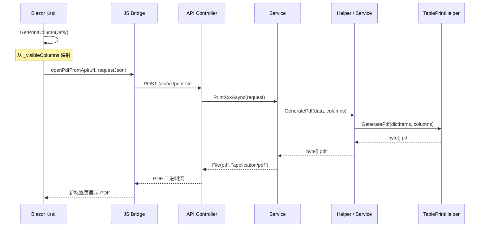

# 打印模块设计

**版本：V2.19**
**最后更新：2026-09-14**
**适用范围：MES系统所有打印功能**

> **本次变更（V2.19）**：**新增「就地打印（所见即所得）」约定 + 订单进度树打印**（2026-09-14，纯前端，无接口 / 数据库变更）—— `OrderProgress.razor`（订单进度树 `/orders/progress`）卡头新增「打印」按钮，走 `window.print()` **就地打印**：按页面**当前折叠/展开状态**原样输出（折叠主号的展开区在 DOM 中本就不存在，故无需任何额外逻辑）；配套页面内非 scoped `<style>@@media print` 规则隐藏 `.mud-appbar` / `.mud-drawer` / 操作按钮，并解除 `.mud-layout` / `.mud-main-content` 的 flex 与滚动容器（否则多页只印首屏、左侧留抽屉宽度），`@@page { size: landscape; margin: 8mm }`、`-webkit-print-color-adjust: exact` 保留主号灰底与比率红字；纸面末尾含**打印页脚** `打印日期：yyyy-MM-dd`（`.op-print-footer` 屏幕隐藏、仅 `@@media print` 显示，`_printDate` 取打印当天）。同时把该模式沉淀为 §2.2「就地打印约定」（并补登此前已有的 `ColdRollPlans.razor`）。**不新增 JS 桥接函数**（`print.js` / `index.html` 版本号不动）。详见 `订单模块详细设计.md` V1.28。

> **历史变更（V2.18）**：**NCR 报告 G1 补「让步放行」三格 +「流向」更名「次品流向」**（2026-09-12，纯字段增补、版式与页数口径不变）—— `NcrPrintHelper` G1「问题反馈」重排为：`次品支数 / 次品重量` → `问题描述`（整行）→ **`次品流向`（原「流向」更名）** / `让步支数` → `让步重量` / `让步说明`（整行）；**让步放行区仅被动来源渲染**（判据 `Ncr.SourceGroupKey` 非空 **或** `Ncr.FlowDirection` 有值），主动来源（不合格反馈 / 人工上报）无此概念、不占版面。字段口径与列表页 G1 一致（**被动比主动恰多 4 个字段**）。详见 `质量管理模块详细设计.md` V8.30。

> **历史变更（V2.17）**：**不合格反馈单打印补「来源类型」与「检验项目」两字段**（2026-09-12，纯字段增补、版式与页数口径不变）—— `NonconformingFeedbackPrintHelper` G1「反馈信息」增「来源类型」（`EnumHelper.GetDisplayName<NonconformingFeedbackSourceType>`，空/未知兜底 `-`）；G2「位置信息」在「工段名称」之后增「检验项目」（`InspectionItem` 中文，**仅成品检验来源有值，其余为空 → 打 `-`**）；`SectionName` 改为可空后在成品检验档打 `-`。与列表页 / 查看弹窗 / 扫码页字段口径一致。详见 `质量管理模块详细设计.md` V8.29。

---

## 一、总体架构

### 1.1 分类体系

```
打印
├── 前端打印（浏览器端渲染，JS window.print）
│   ├── ProcessCardPrint.razor
│   └── OrderDetail.razor 等
│
└── 后端打印（服务端 PDF 生成，QuestPDF）
    ├── Mode A：自包含富布局
    │   └── Helper 调用 Document.Create()，列硬编码
    │
    ├── Mode B：TablePrintHelper 驱动
    │   └── Helper 封装，列来自前端 PrintColumnDef
    │
    └── Mode B（内联）：TablePrintHelper 直接调用
        └── Service/Controller 内联调用，无 Helper 封装
```

### 1.2 技术选型

| 维度 | 前端打印 | 后端打印 |
|------|-----------|-------------|
| 渲染端 | 浏览器 (Blazor) | 服务端 (QuestPDF) |
| PDF 生成 | 浏览器打印 | QuestPDF Document |
| 触发方式 | `window.print()` | `openPdfFromApi` JS 调用 |
| 列来源 | 前端直接渲染 | 硬编码 / 前端传输 |

### 1.3 JS 桥接方法

位于 `wwwroot/js/print.js`：

| 函数 | 类型 | 说明 |
|------|------|------|
| `window.MES.printQrCodes` | HTML | 构建 QR 码 HTML，新窗口打开后打印 |
| `window.printRawHtml` | HTML | 接收 HTML 字符串，包装为打印页后打印 |
| `window.openPdfFromApi` | PDF fetch | 从 API 获取 PDF 二进制流（JWT 认证），Blob URL + iframe 覆盖层展示 |

---

## 二、前端打印

### 2.1 流程

1. 页面初始化时加载 HTML 内容
2. 前端调用 `JS.InvokeVoidAsync("openPdfFromApi", apiUrl, json)`（PDF 打印）或 `JS.InvokeVoidAsync("print")`（浏览器打印）触发
3. 用户手动 Ctrl+P 或调用 `window.print()`

### 2.2 对应关系

| 页面 | 触发方式 | 说明 |
|------|---------|------|
| ProcessCardPrint.razor | `openPdfFromApi`（工艺卡 PDF），`window.print()`（工艺卡 HTML） | 双模式：列表页调用 PDF，打印页走 HTML |
| OrderDetail.razor | `openPdfFromApi` | 销售订单打印 |
| PurchaseOrders.razor | `openPdfFromApi` | 采购订单打印 |
| SubcontractOrders.razor | `openPdfFromApi` | 委外订单打印 |
| WorkOrderDetail.razor | `openPdfFromApi` | 工单打印 |
| WorkOrderMaterialPlan.razor | `openPdfFromApi` | 物料计划打印 |
| ColdRollPlans.razor | `window.print()` **就地打印** | 排程计划 / 排程汇总二选一（`body.print-summary` 切换打印区） |
| OrderProgress.razor | `window.print()` **就地打印** | 订单进度树「所见即所得」：按当前折叠/展开状态打印，不改动 DOM；纸面末尾带「打印日期」页脚（2026-09-14） |

**就地打印（所见即所得）约定**（2026-09-14 起，参考 `ColdRollPlans.razor` 与 `OrderProgress.razor`）：

- 触发：`await JS.InvokeVoidAsync("window.print")`，**不需要**新增 JS 桥接函数（故 `print.js` / `index.html` 版本号不动）。
- 样式：写页面内**非 scoped** `<style>` 块（razor 内 `@@media` / `@@page` 需双 `@` 转义）——`.mud-appbar` / `.mud-drawer` / `.mud-main-content` / `.mud-layout` 属**其它组件**的元素，写进 `.razor.css` 会被 Blazor scoped CSS 追加 `[b-xxx]` 属性而匹配不到。
- 必需规则：隐藏 `.mud-appbar` / `.mud-drawer` / 操作按钮；`.mud-layout` 与 `.mud-main-content` 解除 flex + 滚动容器并置 `margin-left/padding-top: 0`（否则多页内容只打印首屏、左侧留出抽屉宽度）；`body { -webkit-print-color-adjust: exact }` 保留底色/字色；`@page { size: ... }` 指定纸张方向。
- 打印粒度由 DOM 决定：条件渲染（`@if`）掉的节点本就不存在 → 「折叠状态原样打印」无需额外逻辑。
- **打印页脚**：纸面末尾输出 `打印日期：yyyy-MM-dd`（与 `printRawHtml` / QuestPDF 页脚同口径）。就地打印无法用 JS 注入，做法 = 页面内放一个 `.op-print-footer`（屏幕 `display:none`、`@@media print` 下 `display:block` + `margin-top/padding-top/border-top`），点击时 `_printDate = DateTime.Today; StateHasChanged(); await Task.Yield();` 再调 `window.print`，保证页脚日期先落到 DOM。

---

## 三、后端打印 — Mode A

### 3.1 定义

Mode A 是**自包含富布局**模式，Helper 调用 `Document.Create()` 直接构建 PDF，列定义、布局、样式完全硬编码在 Service 层，不依赖前端的列显隐配置。适用于详情页、报表类打印。

> **ProcessCardPrintHelper 特殊说明**：该 Helper 虽属 Mode A，但具有部分动态能力——`ComposeBlockTable` 通过 `rowCols`/`rowColRatios` 参数动态控制行内列比例，区别于传统 Mode A 的纯硬编码布局。同时页眉添加 QR 码、移除页脚、枚举字段改用 `EnumHelper.GetDisplayName()`（非手动 switch）。

### 3.2 Helper 列表（共 10 个）

| Helper | 用途 | 备注 |
|--------|------|------|
| ProcessCardPrintHelper | 工艺流转卡 PDF | 含 QR 码页眉、动态列宽比例、工序组表格、质检要求等富布局。QR码(80x80)、移除页脚、rowCols/rowColRatios 动态列宽、companyName 参数、EnumHelper 显示枚举 |
| SalesOrderPrintHelper | 销售订单 PDF + 产品要求 PDF | 双模式 |
| NcrPrintHelper | 不合格品报告 PDF | 自包含富布局，含多段表格（处置/分析/追责/措施）；V2.12 起嵌入「问题照片」区（取自关联不合格反馈的附件）；V2.13 起照片另起第 2 页，见 §3.4；V2.16 起 G1「不合格品信息」增「流向」字段（只读带出，枚举 5 档）、G2 处置方式改字典显示（`NcrDisposalKey` 8 档可扩展）；**V2.18 起 G1 让步放行区增「让步支数/让步重量/让步说明」三格**（`次品支数/次品重量` 后接 `问题描述`，再按 `次品流向` → 让步支数 → 让步重量 → 让步说明 排布；**仅被动来源渲染** —— 判据 `SourceGroupKey` 非空 或 `FlowDirection` 有值） |
| ProcessInspectionPrintHelper | 过程检验 PDF | 双模式：Mode B（列表横表，前端列配置驱动）+ 单据式打印 `GeneratePagePdf`（A4 竖版、每条一页；V2.13 起照片另起第 2 页、字段页紧凑排版档，见 §3.4） |
| FinalInspectionPrintHelper | 成品检验 PDF | 双模式：Mode B（列表横表）+ 单据式打印 `GeneratePagePdf`（A4 竖版、每条一页，按检验项目仅渲染有效字段；V2.13 起照片另起第 2 页、字段页紧凑排版档，见 §3.4） |
| SubcontractOrderPrintHelper | 委外订单 PDF | 双模式 |
| WorkOrderPrintHelper | 工单 PDF | 双模式 |
| MaterialPlanPrintHelper | 物料计划 PDF（7 种计划类型） | 双模式：原料采购、成品采购、库存使用、库料改制、圆棒穿孔、在产改制、在产主工单 |
| CertificatePrintHelper | 质量证明书 PDF | 配置驱动：版式键值对（CertificatePrintSettings）+ 列布局（CertificatePrintColumnDefinitions）；每页固定 4 行数据分页；中英文双语版式；区块间距 SectionSpacing 可配 |
| PayrollSummaryPrintHelper | 月工资汇总 PDF（工资结算） | 17 列与《工资条及打印》列序一致（工号→姓名→月份→出勤→金额…→实发），供月工资汇总页「打印」使用 |

> 注：标有"双模式"的 Helper 同时提供 前端打印入口。
>
> 注：`InspectionPatrolPrintHelper`（巡检记录）、`NonconformingFeedbackPrintHelper`（不合格反馈）同为自包含富布局 Helper，明细见 §5.3。

### 3.3 枚举显示

Mode A 枚举字段直接在 switch 中手动映射（**ProcessCardPrintHelper 例外**：改用 `EnumHelper.GetDisplayName<T>()`，见下方说明）：

```csharp
"ProductionType" => b.ProductionType switch
{
    "Normal" => "正常生产",
    "Rework" => "返整",
    "InProcessRework" => "在制修检",
    "RoundBarPiercing" => "圆棒穿孔",
    _ => b.ProductionType
}
```

### 3.4 单据式打印的照片页版式（V2.14；照片上限 V2.15 上调）

适用范围：`ProcessInspectionPrintHelper` / `FinalInspectionPrintHelper` / `InspectionPatrolPrintHelper` / `NonconformingFeedbackPrintHelper` / `NcrPrintHelper` 五个单据式 Helper。

**规则：字段全部在第 1 页，照片一律另起第 2 页；照片单列铺排、每页 2 张。**

- 无照片 → 恰好 1 页；有照片 → 1 页字段页 + ⌈N/2⌉ 页照片（照片超出一页容量时按行自动续页）。
- 实现：字段区末尾渲染审计行后，`col.Item().PageBreak()` 另起一页，页首为**照片页归属行**（左侧「编号: XXX-NNNN」，右侧「区名（N 张）」），其下为照片表格；无照片时整页省略（不产生空白页）。
- 多条记录时逐条「字段页 + 照片页」，记录间分页与照片页分页不叠加空白页。

| Helper | 照片区名 | 单张占位高 | 第 1 页字段区 |
|--------|---------|-----------|--------------|
| ProcessInspectionPrintHelper | 检验照片 | 290pt | 紧凑排版档（字号 9→8、行内边距 3→2、区块标题 11→10） |
| FinalInspectionPrintHelper | 检验照片 | 290pt | 紧凑排版档（同上；探伤类字段多，满字段 24 行） |
| InspectionPatrolPrintHelper | 巡检照片 + 整改验证照片（**合并为同一张连续表格**，区内插组标题行） | 290pt | 常规排版 |
| NonconformingFeedbackPrintHelper | 问题照片 | 290pt | 常规排版 |
| NcrPrintHelper | 问题照片 | 290pt | 常规排版 |

- 照片单列（`RelativeColumn` 单列）铺满页宽；高度 290pt 时 A4 竖版正文（≈709pt）恰好容纳「归属行 + 2 张」（≈2×(290+27)+33 ≈ 667pt），第 3 张自动续页。
- ⚠️ **照片实际尺寸只由高度决定**：`Image(...).FitArea()` 是「等比缩放到『页宽 × ImageBoxHeight』框内」，竖拍/横拍照片均受**高度**约束（除非照片宽高比大于框宽高比），故加宽列并不放大照片——**放大照片的唯一手段是加大高度，而高度上限由每页张数决定**（每页 n 张时 `h ≤ (709 − 归属行 − 组标题行)/n − 27`）。2026-09-12 由「每行 2 张 / 200pt」改本版式后单张尺寸 +45%（原每页 6 张的巡检单由 120pt → 290pt，+142%）。
- 巡检单照片表多一个「区内组标题行」（≈18pt），故单张取 290pt 而非 300pt（300pt 时首页余量仅 ~5pt，易随引擎版本飘页）；满载 8 张（巡检 4 + 整改验证 4，V2.15 上限）＝ 4 页照片，整份 5 页。
- **上传张数上限与本版式配套（V2.15）**：`QualityPhotoLimits.PerRecord` = **4**（过程检验 / 成品检验 / 不合格反馈每条记录）、`PerType` = **4**（巡检单每类，两类合计单个巡检单最多 8 张）→ 满张时 4 张 = 1 页字段页 + 2 页照片（共 3 页）。**打印层代码无改动**（仍单列每页 2 张 / 290pt），仅上传上限常量与 §7.2 回归用例取上限值。
- 回归保护：`MES.Tests/Services/Printing/*PrintHelperTests.cs` 以「扫描 PDF 字节中 `/Type /Page` 对象数」断言页数（见 `PrintTestAssets.CountPdfPages`）；用例照片张数按 `QualityPhotoLimits` 常量取上限（现 4 / 巡检 8）。

---

## 四、后端打印 — Mode B

### 4.1 定义

Mode B 是**动态列表**模式，列定义由前端通过 `List<PrintColumnDef>` 传递，数据由 Service 投影为 `List<Dictionary<string,object>>`，最终委托 `TablePrintHelper.GeneratePdf()` 生成 PDF。

### 4.2 数据准备子模式

根据枚举中文映射的职责位置，Mode B 分为两种子模式：

#### 子模式 ⓪（前端准备数据）

前端持有完整 DTO 列表，在前端通过 `DisplayConverter`/`ResolvePrintValue` 将枚举字段转换为中文，将已解析好的 `List<Dictionary<string, object>>` 随 `Columns` 一并发送到后端。后端只负责排版输出，**不感知枚举类型**。

```csharp
// 前端：构建已含中文的字典列表
var printItems = _selectedItems.Select(item =>
{
    var dict = new Dictionary<string, object>();
    foreach (var col in _visibleColumns)
        dict[col.Key] = ResolvePrintValue(item, col);  // 枚举→中文
    return dict;
}).ToList();

request.Items = printItems;
request.Columns = GetPrintColumnDefs();
```

```csharp
// 后端：直接输出，无需枚举处理
TablePrintHelper.GeneratePdf(title, request.Items, request.Columns);
```

#### 子模式 ⓫（后端查询数据）

前端仅发送搜索条件（如 `Keyword`/`Ids`）+ `Columns`，后端根据条件查库获取 DTO 列表，在构建 Dictionary 时通过 `TryGetEnumDisplay<T>()` 将枚举转为中文。

```csharp
// 前端：只传条件
request.Keyword = _searchKeyword;
request.Columns = GetPrintColumnDefs();
```

```csharp
// 后端：查库 + 枚举解析
var data = await _db.ProductionBatches.Where(/* Keyword */).ToListAsync();
var dictItems = data.Select(b => BuildDictItem(b, request.Columns)).ToList();
TablePrintHelper.GeneratePdf(title, dictItems, request.Columns);
```

#### 选择原则

| 条件 | 建议子模式 |
|------|-----------|
| 前端已有完整数据（如表格当前页已加载） | ⓪ 前端准备数据 |
| 数据量大、需服务端分页筛选后再打印 | ⓫ 后端查询数据 |
| 打印范围跨越当前页（如"打印全部"） | ⓫ 后端查询数据 |

> 注：子模式 ⓪ 对应 `04_开发规范.md` §6.33 标准模板；子模式 ⓫ 为 BatchService 使用的模式。

### 4.3 实现形态

按代码组织方式分为两种形态：

#### 形态一：Helper 封装类（共 36 个）

这些 Helper 独立封装了 Dictionary 投影逻辑，供 Service 调用：

| Helper | 子模式 | 标题 | 所属上下文 |
|--------|--------|------|-----------|
| EquipmentPrintHelper | ⓫ | 设备台账列表 | 设备上下文 |
| InspectionRecordPrintHelper | ⓫ | 点检记录列表 | 设备上下文 |
| MaintenanceOrderPrintHelper | ⓫ | 保养工单列表 | 设备上下文 |
| RepairOrderPrintHelper | ⓫ | 维修工单列表 | 设备上下文 |
| MaterialCheckPrintHelper | ⓫ | 成检到料列表 | 质量上下文 |
| ProductionRecordPrintHelper | ⓫ | 生产记录列表 | 批次上下文 |
| StandardRegisterPrintHelper | ⓫ | 标准号列表 | 生产标准上下文 |
| GradeChemicalCompositionPrintHelper | ⓫ | 标准牌号化学成分列表 | 生产标准上下文 |
| GradePhysicalPropertyPrintHelper | ⓫ | 牌号物理性能列表 | 生产标准上下文 |
| SubStandardQuickViewPrintHelper | ⓫ | 子标准速览列表 | 生产标准上下文 |
| StandardInspectionRequirementPrintHelper | ⓫ | 标准号检验项要求列表 | 生产标准上下文 |
| ChemicalCompositionPrintHelper | ⓫ | 工厂牌号化学成分列表 | 生产标准上下文 |
| ChemicalValidationRulePrintHelper | ⓫ | 工厂牌号化分验证规则列表 | 生产标准上下文 |
| ChemicalAnalysisPrintHelper | ⓫ | 化学分析列表 | 质量上下文 |
| TensileTestPrintHelper | ⓫ | 拉伸试验列表 | 质量上下文 |
| FlatteningTestPrintHelper | ⓫ | 压扁试验列表 | 质量上下文 |
| FlaringTestPrintHelper | ⓫ | 卷边试验列表 | 质量上下文 |
| HardnessTestPrintHelper | ⓫ | 硬度试验列表 | 质量上下文 |
| GrainSizeTestPrintHelper | ⓫ | 晶粒度试验列表 | 质量上下文 |
| MetallographicTestPrintHelper | ⓫ | 金相检验列表 | 质量上下文 |
| IntergranularCorrosionTestPrintHelper | ⓫ | 晶间腐蚀试验列表 | 质量上下文 |
| PittingCorrosionTestPrintHelper | ⓫ | 点腐蚀试验列表 | 质量上下文 |
| FinalInspectionPrintHelper | ⓫ | 成品检验列表 | 质量上下文 |
| FurnaceRegistrationPrintHelper | ⓫ | 来料炉号登记列表 | 质量上下文 |
| ProcessInspectionPrintHelper | ⓫ | 过程检验列表 | 质量上下文 |
| QualityProcessTrackingPrintHelper | ⓫ | 成检追踪列表 | 质量上下文 |
| WorkOrderExecutionPrintHelper | ⓫ | 工单执行状况列表 | 工单上下文 |
| WorkOrderSchedulePrintHelper | ⓫ | 排程计划列表 | 排程上下文 |
| BatchPlanPrintHelper | ⓫ | 批次计划列表 | 排程上下文 |
| FinalInspectionPlanPrintHelper | ⓫ | 成检计划列表 | 排程上下文 |
| RawMaterialLockPlanPrintHelper | ⓫ | 原锁计划列表 | 排程上下文 |
| OrderDemandAdjustmentPrintHelper | ⓫ | 工单需求调整列表 | 工单上下文 |
| PendingDeliveryPrintHelper | ⓫ | 订单成品(实时库存)列表 | 订单上下文 |
| EmployeePrintHelper | ⓫ | 员工列表 | 配置上下文 |
| WorkstationPrintHelper | ⓫ | 工位列表 | 配置上下文 |
| FactoryInspectionRequirementPrintHelper | ⓫ | 工厂检验项要求列表 | 生产标准上下文 |

#### 形态二：Service/Controller 内联（共 14 处，无独立 Helper）

Service 或 Controller 直接构建 Dictionary 并调用 `TablePrintHelper.GeneratePdf()`：

| 位置 | 子模式 | 标题 | 所属上下文 |
|------|--------|------|-----------|
| BatchService | ⓫ | 生产批次 | 批次上下文 |
| SectionOutsourceService（委外） | ⓫ | 工段委外列表 | 批次上下文 |
| SectionOutsourceService（回收） | ⓫ | 委外回收列表 | 批次上下文 |
| PicklingService（入缸） | ⓫ | 酸洗入缸记录 | 批次上下文 |
| PicklingService（出缸） | ⓫ | 酸洗完工记录 | 批次上下文 |
| InventoryService | ⓫ | 库存/入库/出库列表 | 仓库上下文 |
| SectionParagraphFlowAnalysisService | ⓫ | 段落流转分析 | 计划排程 |
| FixedLengthWorkOrderService | ⓪ | 定尺工单定尺 | 工单上下文 |
| CustomerService | ⓫ | 客户信息 | 订单上下文 |
| SupplierService | ⓫ | 供应商信息 | 物料上下文 |
| PurchaseOrderService | ⓫ | 采购订单 | 物料上下文 |
| GradeMappingService | ⓫ | 牌号映射 | 生产标准上下文 |
| SubcontractOrderService | ⓫ | 子项查询 | 物料上下文 |

### 4.4 核心流程



### 4.5 DTO 结构

```csharp
/// <summary>
/// Mode B 通用列定义，由前端 _visibleColumns 映射而来
/// </summary>
public class PrintColumnDef
{
    public string Key { get; set; }    // 字段标识，如 "BatchNo"
    public string Label { get; set; }  // 列标题，如 "生产编号"
}

/// <summary>
/// 选中项打印请求（示例）
/// </summary>
public class BatchPrintSelectedRequest
{
    public int[] Ids { get; set; }
    public List<PrintColumnDef>? Columns { get; set; }
}

/// <summary>
/// 全量/列表打印请求：原 *PrintAllRequest（后端按筛选全量查询）已移除，
/// 列表全量打印改由前端把当前可见列逐行转 dict（Mode A 子模式）后组装，如 OrderPrintListRequest。
/// </summary>
public class OrderPrintListRequest
{
    public string Title { get; set; } = "订单列表";
    public List<Dictionary<string, object>> Items { get; set; } = new();
    public List<PrintColumnDef> Columns { get; set; } = new();
}
```

### 4.6 前端模式

```csharp
private List<PrintColumnDef> GetPrintColumnDefs()
{
    return _visibleColumns.Select(c => new PrintColumnDef
    {
        Key = c.Key,
        Label = c.Label
    }).ToList();
}

private async Task PrintAll()
{
    // 全量/列表打印：前端按当前可见列逐行转 dict，POST print-list-file（Mode A，等价 *PrintAllRequest 的替代）
    var items = _pageItems
        .Select(item =>
        {
            var dict = new Dictionary<string, object>();
            foreach (var col in _visibleColumns)
                dict[col.Key] = GetCellDisplayText(item, col.Key);
            return dict;
        }).ToList();

    var request = new OrderPrintListRequest
    {
        Title = "订单列表",
        Items = items,
        Columns = GetPrintColumnDefs()
    };
    var json = JsonSerializer.Serialize(request);
    var apiUrl = $"{Http.BaseAddress}{ApiEndpoints.Order}/print-list-file";
    await JS.InvokeVoidAsync("openPdfFromApi", apiUrl, json);
}

private async Task PrintSelected()
{
    var request = new BatchPrintSelectedRequest
    {
        Ids = selectedIds.ToArray(),
        Columns = GetPrintColumnDefs()
    };
    var json = JsonSerializer.Serialize(request);
    await JS.InvokeVoidAsync("openPdfFromApi", apiUrl, json);
}
```

### 4.7 后端字段映射（子模式 ⓫ 核心）

Mode B 的核心是 Service 层的字段值提取 `switch` 表达式，枚举字段必须手动转换为中文显示名：

```csharp
private static object GetBatchFieldValue(ProductionBatch b, string key) => key switch
{
    "BatchNo" => b.BatchNo,
    "Status" => EnumHelper.GetDisplayName(b.Status),
    "ProductionType" => TryGetEnumDisplay<ProductionType>(b.ProductionType),
    "ManufacturingItem" => TryGetEnumDisplay<MaterialType>(b.ManufacturingItem),
    "MaterialName" => TryGetEnumDisplay<PipeManufacturingType>(b.MaterialName),
    "SettlementMethod" => TryGetEnumDisplay<SettlementMethod>(b.SettlementMethod),
    "DeliveryState" => TryGetEnumDisplay<DeliveryState>(b.DeliveryState),
    "LengthStatus" => TryGetEnumDisplay<LengthStatus>(b.LengthStatus),
    "TechnicalRequirements" => TryGetEnumDisplay<RequirementType>(b.TechnicalRequirements),
    "TotalWeight" => b.TotalWeight,
    // ...
    _ => ""
};

private static string TryGetEnumDisplay<T>(string? value) where T : struct, Enum
{
    if (string.IsNullOrEmpty(value)) return "";
    return Enum.TryParse<T>(value, true, out var result)
        ? EnumHelper.GetDisplayName(result)
        : value;
}
```

---

## 五、按业务上下文索引

### 5.1 批次上下文

| 打印内容 | 模式 | 实现位置 | 前端页面 |
|---------|------|---------|---------|
| 批次列表 | Mode B（内联）⓫ | BatchService | Batches.razor |
| 工艺流转卡 | 前端 + Mode A（动态列宽） | ProcessCardPrintHelper | ProcessCardPrint.razor |
| 生产记录 | Mode B（Helper）⓫ | ProductionRecordPrintHelper | ProductionRecords.razor |
| 成检到料 | Mode B（Helper）⓫ | MaterialCheckPrintHelper | MaterialReceiveChecks.razor |
| 工段委外 | Mode B（内联）⓫ | SectionOutsourceService | SectionOutsources.razor |
| 委外回收 | Mode B（内联）⓫ | SectionOutsourceService | OutsourceRecoveries.razor |
| 委外单位列表（打印选中，含② 往来统计列） | Mode A（print-list-file） | OutsourceVendorProfileService | OutsourceVendors.razor |
| 酸洗入缸记录 | Mode B（内联）⓫ | PicklingService | PicklingInRecords.razor |
| 酸洗完工记录 | Mode B（内联）⓫ | PicklingService | PicklingOutRecords.razor |

### 5.2 设备上下文

| 打印内容 | 模式 | 实现位置 | 前端页面 |
|---------|------|---------|---------|
| 设备台账 | Mode B（Helper）⓫ | EquipmentPrintHelper | Equipments.razor |
| 点检记录 | Mode B（Helper）⓫ | InspectionRecordPrintHelper | InspectionRecords.razor |
| 保养工单 | Mode B（Helper）⓫ | MaintenanceOrderPrintHelper | MaintenanceOrders.razor |
| 维修工单 | Mode B（Helper）⓫ | RepairOrderPrintHelper | RepairOrders.razor |

### 5.3 质量管理上下文

| 打印内容 | 模式 | 实现位置 | 前端页面 |
|---------|------|---------|---------|
| 化学分析 | Mode B（Helper）⓫ | ChemicalAnalysisPrintHelper | ChemicalAnalyses.razor |
| 拉伸试验 | Mode B（Helper）⓫ | TensileTestPrintHelper | TensileTests.razor |
| 压扁试验 | Mode B（Helper）⓫ | FlatteningTestPrintHelper | FlatteningTests.razor |
| 卷边试验 | Mode B（Helper）⓫ | FlaringTestPrintHelper | FlaringTests.razor |
| 硬度试验 | Mode B（Helper）⓫ | HardnessTestPrintHelper | HardnessTests.razor |
| 晶粒度试验 | Mode B（Helper）⓫ | GrainSizeTestPrintHelper | GrainSizeTests.razor |
| 金相检验 | Mode B（Helper）⓫ | MetallographicTestPrintHelper | MetallographicTests.razor |
| 晶间腐蚀试验 | Mode B（Helper）⓫ | IntergranularCorrosionTestPrintHelper | IntergranularCorrosionTests.razor |
| 点腐蚀试验 | Mode B（Helper）⓫ | PittingCorrosionTestPrintHelper | PittingCorrosionTests.razor |
| 成品检验 | Mode B（Helper）⓫ | FinalInspectionPrintHelper | FinalInspections.razor |
| 成品检验 · 单据式打印 | Mode A | FinalInspectionPrintHelper.GeneratePagePdf（A4 竖版、每条一页；V2.13 起照片另起第 2 页、字段页紧凑排版档）；端点 `print-selected-doc-file` | FinalInspections.razor（「打印选中单据」） |
| 炉号登记 | Mode B（Helper）⓫ | FurnaceRegistrationPrintHelper | FurnaceRegistrations.razor |
| 过程检验 | Mode B（Helper）⓫ | ProcessInspectionPrintHelper | ProcessInspections.razor |
| 过程检验 · 单据式打印 | Mode A | ProcessInspectionPrintHelper.GeneratePagePdf（A4 竖版、每条一页；V2.13 起照片另起第 2 页、字段页紧凑排版档）；端点 `print-selected-doc-file` | ProcessInspections.razor（「打印选中单据」） |
| 巡检记录 | Mode A | InspectionPatrolPrintHelper（V2.13 起双照片区合并为一张连续表格、统一另起第 2 页；V2.14 起单列每页 2 张 / 290pt） | InspectionPatrols.razor |
| 不合格反馈 | Mode A | NonconformingFeedbackPrintHelper（V2.13 起问题照片另起第 2 页；V2.17 起 G1 增「来源类型」、G2 增「检验项目」） | NonconformingFeedbacks.razor |
| 质量过程追踪 | Mode B（Helper）⓫ | QualityProcessTrackingPrintHelper | QualityProcessTracking.razor |
| NCR 报告 | Mode A | NcrPrintHelper（`print-selected-file` / `print-list-file`；V2.12 起选中报告嵌入关联不合格反馈「问题照片」区，V2.13 起该区另起第 2 页；V2.16 起 G1 增「流向」字段、G2 处置方式走字典显示） | Ncrs.razor |
| 质量证明书 | Mode A（配置驱动） | CertificatePrintHelper | Certificates.razor |

### 5.4 订单上下文

| 打印内容 | 模式 | 实现位置 | 前端页面 |
|---------|------|---------|---------|
| 销售订单 | 前端 + Mode A | SalesOrderPrintHelper | OrderDetail.razor |
| 产品要求 | Mode A | SalesOrderPrintHelper | ProductRequirement.razor |
| 订单列表 | Mode A | OrderService→SalesOrderPrintHelper | Orders.razor |
| 工单需求调整 | Mode B（Helper）⓫ | OrderDemandAdjustmentPrintHelper | OrderDemandAdjustment.razor |
| 客户信息 | Mode B（内联）⓫ | CustomerService | Customers.razor |
| 客户列表（打印选中，含② 往来统计列） | Mode A（print-list-file） | CustomerService | Customers.razor |
| 订单成品(实时库存) | Mode B（Helper）⓫ | PendingDeliveryPrintHelper | PendingDelivery.razor |

### 5.5 物料上下文

| 打印内容 | 模式 | 实现位置 | 前端页面 |
|---------|------|---------|---------|
| 采购订单 | Mode B（内联）⓫ | PurchaseOrderService | PurchaseOrders.razor |
| 委外订单 | 前端 + Mode A | SubcontractOrderPrintHelper | SubcontractOrders.razor |
| 子项查询 | Mode B（内联）⓫ | SubcontractOrderService | SubcontractReturnItems.razor |
| 供应商信息 | Mode B（内联）⓫ | SupplierService | Suppliers.razor |
| 供应商列表（打印选中，含② 往来统计列） | Mode A（print-list-file） | SupplierService | Suppliers.razor |

### 5.6 工单上下文

| 打印内容 | 模式 | 实现位置 | 前端页面 |
|---------|------|---------|---------|
| 工单 | 前端 + Mode A | WorkOrderPrintHelper | WorkOrderDetail.razor |
| 工单列表 | Mode A | WorkOrderPrintHelper | WorkOrders.razor |
| 工单执行状况 | Mode B（Helper）⓫ | WorkOrderExecutionPrintHelper | WorkOrderExecution.razor |
| 物料计划 | 前端 + Mode A | MaterialPlanPrintHelper | WorkOrderMaterialPlan.razor |
| 物料计划概览 | Mode A | MaterialPlanPrintHelper | MaterialPlanOverview.razor |
| 定尺工单定尺 | Mode B（内联）⓪ | FixedLengthWorkOrderService | FixedLengthWorkOrderView.razor |

### 5.7 计划排程上下文

| 打印内容 | 模式 | 实现位置 | 前端页面 |
|---------|------|---------|---------|
| 排程计划 | Mode B（Helper）⓫ | WorkOrderSchedulePrintHelper | WorkOrderSchedules.razor |
| 批次计划 | Mode B（Helper）⓫ | BatchPlanPrintHelper | BatchPlans.razor |
| 成检计划 | Mode B（Helper）⓫ | FinalInspectionPlanPrintHelper | FinalInspectionPlan.razor |
| 原锁计划 | Mode B（Helper）⓫ | RawMaterialLockPlanPrintHelper | RawMaterialLockPlanAndExecution.razor |
| 段落流转分析 | Mode B（内联）⓫ | SectionParagraphFlowAnalysisService | 经批次计划页折叠展示与报表总览消费（原独立查询页已移除） |

### 5.8 仓库上下文

| 打印内容 | 模式 | 实现位置 | 前端页面 |
|---------|------|---------|---------|
| 库存列表 | Mode B（内联）⓫ | InventoryService | WarehouseInventory.razor |
| 入库记录 | Mode B（内联）⓫ | InventoryService | InboundHistory.razor |
| 出库记录 | Mode B（内联）⓫ | InventoryService | OutboundHistory.razor |

### 5.9 生产标准上下文

| 打印内容 | 模式 | 实现位置 | 前端页面 |
|---------|------|---------|---------|
| 牌号映射 | Mode B（内联）⓫ | GradeMappingService | GradeMappings.razor |
| 标准号列表 | Mode B（Helper）⓫ | StandardRegisterPrintHelper | StandardRegisters.razor |
| 标准牌号化学成分 | Mode B（Helper）⓫ | GradeChemicalCompositionPrintHelper | GradeChemicalCompositions.razor |
| 牌号物理性能 | Mode B（Helper）⓫ | GradePhysicalPropertyPrintHelper | GradePhysicalProperties.razor |
| 子标准速览 | Mode B（Helper）⓫ | SubStandardQuickViewPrintHelper | SubStandardQuickViews.razor |
| 标准号检验项要求 | Mode B（Helper）⓫ | StandardInspectionRequirementPrintHelper | StandardInspectionRequirements.razor |
| 工厂牌号化学成分 | Mode B（Helper）⓫ | ChemicalCompositionPrintHelper | ChemicalCompositions.razor |
| 工厂牌号化分验证规则 | Mode B（Helper）⓫ | ChemicalValidationRulePrintHelper | ChemicalValidationRules.razor |
| 工厂检验项要求 | Mode B（Helper）⓫ | FactoryInspectionRequirementPrintHelper | FactoryInspectionRequirements.razor |

---

## 六、枚举显示设计

### 6.1 问题背景

数据库中的枚举字段以字符串存储（如 `"SemiFinished"`、`"RoughTube"`）。后端打印使用 QuestPDF 生成 PDF 时，`TablePrintHelper.FormatValue()` 通过 `raw.GetType().IsEnum` 检测枚举类型。但对于以 `string` 类型传递的枚举值，该检测失效，导致 PDF 中显示英文值而非中文。

### 6.2 处理规则

| 打印模式 | 处理方式 | 示例 |
|---------|---------|------|
| 前端打印 | 前端 `DisplayHelper.GetXxxText()` 直接输出中文（EnumHelper 读取 `EnumDisplayDefinition` 配置表显示名） | `GetProductionTypeText(item.ProductionType)` |
| Mode A | Helper 内部 switch 映射或 ValueResolvers | `b.ProductionType switch { "Normal" => "正常生产", ... }` |
| Mode B（Helper） | Helper 内 `TryGetEnumDisplay<T>()` | `TryGetEnumDisplay<ProductionType>(b.ProductionType)` |
| Mode B（Helper，ValueResolvers） | Helper 定义 `Dictionary<string, Func<object?, string>>` resolvers 传给 `TablePrintHelper.GeneratePdf(title, items, columns, resolvers)`（新式 Helper 首选，如 WorkOrderExecutionPrintHelper / OrderDemandAdjustmentPrintHelper / FinalInspectionPrintHelper 等） | `resolvers["SettlementMethod"] = v => EnumHelper.GetDisplayName<SettlementMethod>(v?.ToString())` |
| Mode B（内联） | Service/Controller 内 switch 或 `TryGetEnumDisplay<T>()` | 同上 |

**枚举/字典显示参数化后新增的统一出口（后端打印内联/Helper 均适用）：**

- **int 档位字段**（`ScheduleStage`/`FlowStatus`/`MainNoFlowStatus`/入库状态等）→ `IntStatusDisplayHelper.GetXxxText()`，或直接取 DTO 已计算的 `XxxText` 属性（如 `ScheduleStageText`）
- **紧急度/流转/备注等英文 Key 字典类** → `UrgencyLevelKeys.ToChinese()` / `ProductionFlowKeys.ToChinese()` / `RawMaterialLockRemarkKeys.ToChinese()` 等 Keys 常量类（兜底）或前端 `DictValueDisplayHelper.GetText()`（配置表 OverrideMap 优先）
- **工序/工段** → `ProcessKeys.ToChinese()` / `SectionKeys.ToChinese()`（后端）；前端走 `ProcessDisplayHelper.GetProcessNameText` / `SectionDisplayHelper.GetSectionNameText`
- **定尺切割长度匹配** `CutLengthMatchType` → `CutLengthMatchHelper.GetText()`（ProductionRecordPrintHelper / FinalInspectionPrintHelper 已用）
- **产类** `ProductStatus` → `DictValueDisplayHelper.GetText(DictValueDefaults.ProductStatus, ...)`
- **数据来源** `DataSource` → `StringEnumDisplayHelper.GetDataSourceText()`
- **技术要求检验阶段** `InspectionRequirementStage`（4 值：None=「-」/FinalOnly=「终」/PreOnly=「预」/PreAndFinal=「预+终」）→ `EnumHelper.GetDisplayName`（SalesOrderPrintHelper 产品要求打印 10 项成品检验项为 StageText）

### 6.3 TryGetEnumDisplay 泛型方法

```csharp
private static string TryGetEnumDisplay<T>(string? value) where T : struct, Enum
{
    if (string.IsNullOrEmpty(value)) return "";
    return Enum.TryParse<T>(value, true, out var result)
        ? EnumHelper.GetDisplayName(result)
        : value;
}
```

---

## 七、扩展指南

### 7.1 新增 Mode B 打印（有 Helper）

1. **DTO**：定义请求 DTO，包含 `List<PrintColumnDef> Columns`
2. **Helper**：新建 Helper 类，实现 DTO→Dictionary 投影 + 枚举转换
3. **Service**：调用 Helper 的 `GeneratePdf()` 方法
4. **Controller**：新增 `print-file` 端点
5. **前端**：实现 `GetPrintColumnDefs()` + 发送 `Columns`

### 7.2 新增 Mode B 打印（内联）

适用于简单列表，不创建独立 Helper：
1. **DTO**：定义请求 DTO，包含 `List<PrintColumnDef> Columns`
2. **Service/Controller**：直接构建 Dictionary + 调用 `TablePrintHelper.GeneratePdf()`
3. **前端**：实现 `GetPrintColumnDefs()` + 发送 `Columns`

### 7.3 新增 Mode A 打印

1. **Helper**：调用 `Document.Create()` 构建 PDF，列定义硬编码
2. **枚举字段**：在 switch 表达式中手动映射中文显示
3. **Controller**：新增打印端点

### 7.4 注意事项

- Mode B 的列 key 必须与前端 `ColumnDef.Key` 一一对应
- 枚举字段不能通过 `Enum.ToString()` 输出，必须转中文
- 数值字段使用 `G29` 格式去除多余零
- PDF 文件通过 Controller 以 `File(pdf, "application/pdf")` 返回
- `-file` 后缀端点为最佳实践（直接返回 PDF 流，而非 Base64 包装）

---

## 八、列宽策略（TablePrintHelper）

### 8.1 动态列宽

`TablePrintHelper` 使用 **RelativeColumn** 按比例分配列宽，而非固定 `ConstantColumn`：

```csharp
table.ColumnsDefinition(columnsDef =>
{
    columnsDef.ConstantColumn(28); // 序号列固定
    foreach (var col in columns)
        columnsDef.RelativeColumn(col.Width ?? 1); // 用 Width 作为比例权重
});
```

前端 ColumnDef 的 `Width` 值（如 `"130px"`）经 `ToPrintColumnDef()` 去除 `px` 后缀后作为比例权重传入。各列按权重占总权重的比例自动分配 A4 横版（297mm）的可用宽度。

### 8.2 设计原因

前端列宽设计值为 CSS 像素（px），直接作为 QuestPDF 的点（pt）值会造成溢出：
- A4 横版可用宽度 ≈ 802pt（297mm 减 40pt 边距）
- 前端 13 列 px 总和 ≈ 1278，远超可用宽度
- 改为 RelativeColumn 后，各列按比例自动分配实际空间，杜绝溢出

### 8.3 固定列与动态列混合

- **序号列**：`ConstantColumn(28)` — 固定 28pt
- **数据列**：`RelativeColumn(weight)` — 按比例分配剩余宽度
- 无 Width 的列默认权重为 1

---
