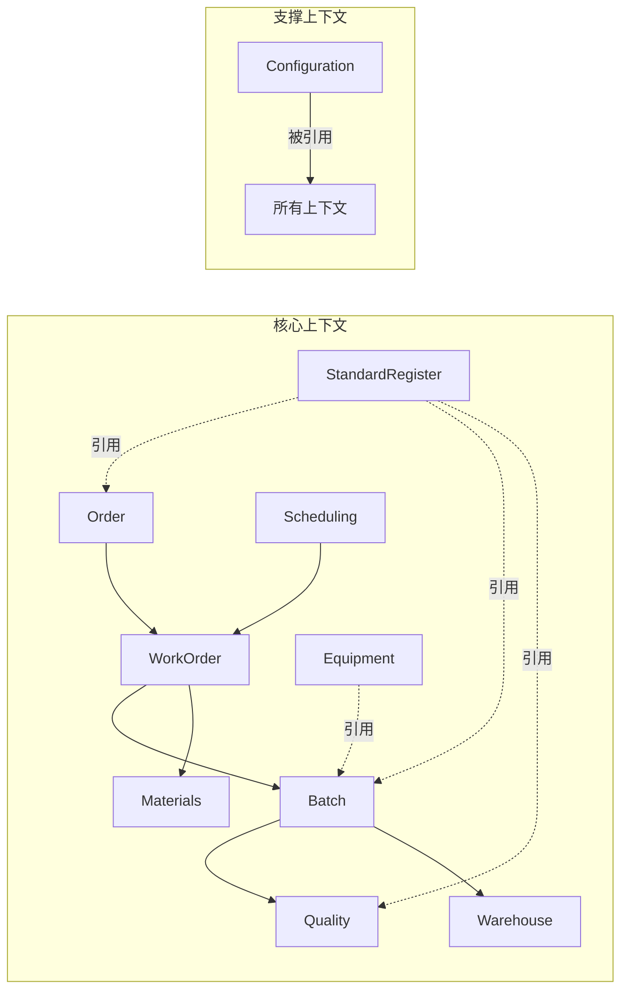

# 上下文映射

**版本：V1.6**
**最后更新：2026-08-15**

## 1. 概述

本文档记录 MES 系统中各限界上下文之间的实体引用关系，区分**读引用**（read-only access）和**写操作**（create/update/delete），并为跨上下文写操作提供规范指引。

### 1.1 上下文清单

| 编号 | 上下文 | 目录前缀 | 说明 |
|-----|-------|---------|------|
| CTX01 | 订单 | Order | 销售合同、订单管理 |
| CTX02 | 工单 | WorkOrder | 生产工单、用料计划 |
| CTX03 | 批次 | Batch | 生产批次、流转卡 |
| CTX04 | 质量 | Quality | 过程检验、成检、理化检测、NCR |
| CTX05 | 计划排程 | Scheduling | 工单排程、批次计划、冷轧计划 |
| CTX06 | 物料 | Materials | 采购、委外、供应商档案（物料档案主档已删除） |
| CTX07 | 仓库 | Warehouse | 库存、出入库 |
| CTX08 | 设备 | Equipment | 设备台账、点检、保养、维修 |
| CTX09 | 生产标准 | StandardRegister | 标准号、牌号对照、化学成分 |
| CTX10 | 配置 | Configuration | 参数表、工位、员工、枚举/字典显示配置、工序组定义 |
| CTX11 | 权限 | Auth | 用户管理、登录认证 |
| CTX12 | 报表 | Report | 产量报表、数据统计 |

---

## 2. 实体所有权总表

每个实体归属于唯一上下文（即该实体创建/编辑/删除的入口上下文）。详见 `06_读模型架构.md` 附录A。

---

## 3. 跨上下文引用矩阵

### 3.1 读引用（Read Model / Query Only）

列表页或查询操作中引用其他上下文的实体或读模型：

| 上下文 | 引用的外部实体/读模型 | 引用方式 | 用途 |
|-------|---------------------|---------|------|
| **订单** | WorkOrder 上下文 | | |
| 订单→ | WorkOrderExecutionSummary | 读模型查询 | 订单列表显示工单执行状态 |
| 订单→ | WorkOrder | 读模型查询 | 工单生成状态 |
| **工单** | | | |
| 工单→ | SalesOrder (Order) | 读模型 JOIN | 显示订单信息 |
| 工单→ | OrderItem (Order) | 读模型 JOIN | 显示规格/交期 |
| 工单→ | CustomerProfile (Order) | 读模型 JOIN | 显示客户/业务员 |
| 工单→ | ProductionBatch (Batch) | 读模型查询 | 批次执行进度 |
| 工单→ | ConfigParameter (配置) | 读模型查询 | 满足率计算阈值 |
| 工单→ | StandardWorkDay (配置) | 读模型查询 | 工艺周期计算 |
| **批次** | | | |
| 批次→ | WorkOrder (工单) | 读模型查询 | 批次关联工单信息 |
| 批次→ | SalesOrder (Order) | 读模型 JOIN | 批次关联订单信息 |
| 批次→ | StandardRegister (生产标准) | 读模型查询 | 标准号引用 |
| 批次→ | StandardGradeMapping (生产标准) | 读模型查询 | 牌号映射 |
| 批次→ | StandardWorkDay (配置) | 读模型查询 | 工量天数计算 |
| 批次→ | Workstation (配置) | 读模型查询 | 工位引用 |
| 批次→ | Employee (配置) | 读模型查询 | 员工引用 |
| 批次→ | FixedLengthWorkOrder (工单) | 读模型查询 | 定尺长度集合（生产记录定尺切割长度匹配 CutLengthMatchType 判定） |
| **质量** | | | |
| 质量→ | ProductionBatch (Batch) | 读模型查询 | 批次信息引用 |
| 质量→ | WorkOrder (工单) | 读模型查询 | 工单信息引用 |
| 质量→ | SalesOrder (Order) | 读模型查询 | 订单信息引用 |
| 质量→ | StandardRegister (生产标准) | 读模型查询 | 标准号引用 |
| 质量→ | Equipment (设备) | 读模型查询 | 设备引用 |
| 质量→ | FixedLengthWorkOrder (工单) | 读模型查询 | 定尺长度集合（成品检验定尺切割长度匹配判定） |
| **计划排程** | | | |
| 计划排程→ | WorkOrderExecutionSummary (工单) | 读模型查询 | 排程数据源 |
| 计划排程→ | WorkOrderListSummary (工单) | 读模型查询 | 用料计划数据源 |
| 计划排程→ | WorkOrder (工单) | 读模型查询 | 工单基础信息 |
| 计划排程→ | SalesOrder (Order) | 读模型查询 | 订单信息 |
| 计划排程→ | ProductionBatch (Batch) | 读模型查询 | 批次执行信息 |
| 计划排程→ | DailyProductionCapacity (配置) | 读模型查询 | 产能计算 |
| 计划排程→ | DailyOutputEstimate (配置) | 读模型查询 | 日产预估 |
| 计划排程→ | StandardWorkDay (配置) | 读模型查询 | 工量天数 |
| 计划排程→ | SectionFlowCategorySetting (配置) | 读模型查询 | 流转量配置 |
| **物料** | | | |
| 物料→ | WorkOrder (工单) | 读模型查询 | 采购关联工单 |
| **仓库** | | | |
| 仓库→ | ProductionBatch (Batch) | 读模型查询 | 批次信息引用 |
| 仓库→ | WorkOrder (工单) | 读模型查询 | 工单信息引用 |
| 仓库→ | SalesOrder (Order) | 读模型查询 | 订单信息 |
| 仓库→ | FixedLengthWorkOrder (工单) | 读模型查询 | 定尺长度集合（成品入库定尺切割长度匹配判定） |
| **设备** | | | |
| 设备→ | Employee (配置) | 读模型查询 | 维修人员引用 |
| 设备→ | Workstation (配置) | 读模型查询 | 工位引用 |
| **生产标准** | | | 无跨上下文引用 |
| **配置** | | | 无跨上下文引用 |

### 3.2 写操作（直接跨上下文实体修改）

Service 层中直接创建/更新/删除属于其他上下文的实体：

> **注**：读模型刷新（对 `OrderListSummary`/`WorkOrderExecutionSummary`/`WorkOrderListSummary`/`QualityProcessTracking` 的写入）按设计属于跨上下文写，单独列在 §3.3。

| 来源上下文 | Service | 目标实体(目标上下文) | 操作 | 说明 |
|-----------|---------|---------------------|------|------|
| 订单 | OrderService | Notification (工单) | Create | ~~直接 _context.Notifications.Add~~ ✅ V1.1 已改为 INotificationService.CreateAsync |
| 工单 | MaterialPlanService | WorkOrder (工单上下文内) | Update | 写回 MaterialPlanRate/Status |
| 批次 | BatchService | WorkOrderExecutionSummary (工单) | Update | 刷新读模型 |
| 批次 | ProductionRecordService | WorkOrderExecutionSummary (工单) | Update | 刷新读模型 |
| 批次 | SectionOutsourceService | WorkOrderExecutionSummary (工单) | Update | 刷新读模型 |
| 质量 | FinalInspectionService | WorkOrderExecutionSummary (工单) | Update | 刷新读模型 |
| 质量 | MaterialReceiveCheckService | QualityProcessTracking (质量上下文内) | Upsert | 刷新读模型 |
| 质量 | MaterialReceiveCheckService | ProductionBatch (批次) | Update | 创建/删除成检到料时刷新 BatchTrk 跟踪字段 |
| 仓库 | InventoryService | QualityProcessTracking (质量) | Update | 刷新读模型 |
| 仓库 | InventoryService | WorkOrderExecutionSummary (工单) | Update | 刷新读模型 |
| 仓库 | InventoryBatchWriteService | ProductionBatch (批次) | Update | 入库完成推进 + HardDelete 回退时刷新 BatchTrk 跟踪字段 |
| 物料 | PurchaseOrderService | WorkOrderExecutionSummary (工单) | Update | 刷新读模型 |
| 物料 | SubcontractOrderService | WorkOrderExecutionSummary (工单) | Update | 刷新读模型 |

### 3.3 读模型刷新（按设计允许的跨上下文写）

以下写操作为架构设计允许的读模型刷新，通过 await 异步调用的方式触发（V2.7 从 fire-and-forget 改为 await 确保异常可捕获）：

| 读模型 | 归属上下文 | 由哪些 Service 触发刷新 | 触发方式 |
|--------|-----------|----------------------|---------|
| OrderListSummary | 订单 | OrderService, ProductRequirementService (订单自身) | await |
| WorkOrderExecutionSummary | 工单 | WorkOrderService, MaterialPlanService, PurchaseOrderService, SubcontractOrderService, BatchService, ProductionRecordService, InventoryService, FinalInspectionService | await |
| WorkOrderListSummary | 工单 | MaterialPlanService, WorkOrderService | await |
| QualityProcessTracking | 质量 | MaterialReceiveCheckService, FinalInspectionService, InventoryService, ProductionRecordService；HangfireJobService（每小时兜底刷新最近1小时有变更或从未刷新的记录） | await |

---

## 4. 跨上下文写操作规范

### 4.1 原则

1. **实体所有权归唯一上下文**：每个实体的 CRUD 入口应归属于一个上下文
2. **读模型刷新例外**：读模型的写入由数据源上下文的 Service 触发，但这是架构设计允许的例外
3. **跨上下文业务操作应通过接口调用**：优先调用目标上下文的 Service 接口方法，而非直接操作 `_dbContext.DbSet`

### 4.2 推荐模式

```csharp
// ✅ 正确：通过接口调用目标上下文的 Service
await _workOrderService.UpdateStatusAsync(workOrderId, newStatus);

// ❌ 避免：直接操作其他上下文的 DbSet
var workOrder = await _dbContext.WorkOrders.FindAsync(workOrderId);
workOrder.Status = newStatus;
// 直接改非本上下文实体，边界模糊
```

### 4.3 已整改项

| 原实现 | 问题 | 整改内容 | 版本 |
|---------|------|---------|------|
| OrderService 直接 `_context.Notifications.Add(...)` 写入 Notification 实体（属工单上下文） | 跨上下文直接操作 DbSet | 在 INotificationService 新增 `CreateAsync()` 方法，OrderService 改为通过接口调用 | V1.1 |

---

## 5. 上下文依赖关系图

详见 `01_设计总纲领.md` §4.2 上下文依赖关系。



---

## 6. 变更日志

| 版本 | 日期 | 变更 |
|------|------|------|
| **V1.6** | **2026-08-15** | **文档失效内容清理**：核对 §1 上下文列表、§3 跨上下文读引用矩阵、§4 写操作清单均与现状一致；仅 Version bump |
| **V1.5** | **2026-08-09** | **定尺切割长度匹配跨上下文读引用补充**：§3.1 批次/质量/仓库上下文补充 FixedLengthWorkOrder（工单）读引用（定尺长度集合，供 CutLengthMatchType 判定）；§3.3 QualityProcessTracking 刷新补充 HangfireJobService 每小时兜底；§1.1 配置上下文补充枚举/字典显示配置、工序组定义 |
| **V1.4** | **2026-07-26** | **文档同步更新**：Version bump |
| V1.1 | 2026-07-10 | 整改第1项：OrderService 直接写 Notification → 改为 INotificationService.CreateAsync；更新写操作表和已整改项列表 |
| V1.0 | 2026-07-10 | 初始创建，建立跨上下文引用矩阵和写操作清单 |
