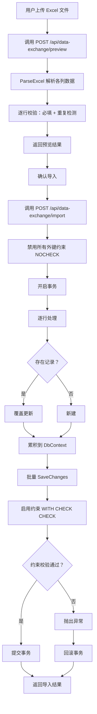

# 数据工具接口设计

**版本**：V7.15
**最后更新**：2026-09-04

---

## 一、概述

本文档定义数据导入导出工具的接口设计，包括实体注册表、API 端点、导入/导出流程、错误处理等。

**功能定位**：跨上下文的通用数据工具，支持 80 个实体的 Excel 导入导出。端点权限按数据工具三档角色控制：实体列表/导出/模板/预览=`DataToolView`、导入=`DataToolEdit`、一键修复=`DataToolDelete`（策略尾部均含 Admin 隐式全权）。

> **显示名称规范**：所有实体中文显示名均采用 `{上下文前缀}-{实体名}` 格式，上下文前缀按 `DataExchangeRegistry.ContextOrder` 固定顺序：订单→工单→批次→质量→物料→仓库→设备→标准→配置→扫码→**工资**→系统（工位/员工归「扫码」、5 张排程/流转配置表归「配置」、工资结算 8 张月表归「工资」、ConfigParameter 归「系统」）。

### 核心能力

| 功能 | 说明 |
|------|------|
| 导出 Excel | 将指定实体的全部数据导出为 `.xlsx` 文件 |
| 下载导入模板 | 生成包含列头和示例数据的空模板 |
| 预览导入 | 解析 Excel 文件，校验必填字段和重复检测，返回预览结果（不写入数据库） |
| 确认导入 | 将 Excel 数据写入数据库，采用单一「覆盖（含新增）」模式 |

### 技术实现

| 组件 | 说明 |
|------|------|
| EPPlus 7.1.0 | Excel 文件读写（非商业授权） |
| EnumHelper | 枚举值 ↔ 中文显示名双向映射 |
| 事务保护 | 导入操作在事务中执行（禁约束 → 批量写入 → 验约束 → 提交/回滚） |

---

## 二、实体注册表

### 2.1 实体列表（按依赖顺序排序）

| 批次 | 实体键 | 显示名称 | 主键策略 | 说明 |
|------|--------|----------|----------|------|
| 1 | Warehouse | 仓库-仓库档案 | 单键（Code） | 仓库基础档案 |
| 1 | StandardGradeMapping | 标准-牌号对照 | 复合键（StandardGrade+StandardGradeCategory） | 标准牌号与工厂牌号映射 |
| 1 | CustomerProfile | 订单-客户档案 | 单键（CustomerCode） | 客户基本信息 |
| 1 | SupplierProfile | 物料-供应商档案 | 单键（SupplierName） | 供应商基本信息 |
| 1 | FurnaceRegistration | 质量-来料炉号登记 | 无单键（无唯一约束） | 来料炉号信息登记 + 化学成分 |
| 1 | ChemicalComposition | 标准-工厂牌号化学成分 | 单键（PlantGrade） | 工厂牌号标准化学成分参考值 |
| 1 | ChemicalValidationRule | 标准-工厂牌号化分验证规则 | 单键（PlantGrade） | 工厂牌号化学元素验证规则 |
| 1 | Ncr | 质量-不合格报告 | 无单键 | 来料/过程/成品检验不合格品登记处理 |
| 1 | Equipment | 设备-设备台账 | 单键（EquipmentCode） | 设备基础档案（点检/保养/维修） |
| 1 | Workstation | 扫码-工位管理 | 单键（Code） | 扫码报工工位定义（工段+设备+报工模板类型） |
| 1 | Employee | 扫码-员工管理 | 单键（Code） | 员工基础信息（扫码报工和工资结算基础） |
| 1 | ConfigParameter | 系统-系统参数(全局参数) | 复合键（Category+ParamKey） | 系统参数（数值型，分类代码+参数键唯一） |
| 1 | StandardRegister | 标准-标准号 | 单键（StandardNo） | 标准号登记（标准号/版本/名称/引用规范/级别/制造方式/钢类），含子项目 |
| 1 | StandardRegisterItem | 标准-标准号子项目 | 无单键（FK→StandardRegister） | 标准号子项目（检验项目/强制性/取样要求等） |
| 1 | GradeChemicalComposition | 标准-牌号化学成分 | 复合键（StandardGrade+StandardGradeCategory） | 标准牌号各化学元素含量范围 |
| 1 | GradePhysicalProperty | 标准-牌号物理性能 | 复合键（StandardGrade+StandardGradeCategory） | 标准牌号物理性能参数（密度/硬度/强度等） |
| 1 | SubStandardQuickView | 标准-子标准速览 | 单键（StandardNo） | 按标准号快速查看各检验项目引用标准 |
| 1 | StandardWorkDay | 配置-工段工量天数(排程/用料) | 无单键 | 各工段标准天数配置，支持牌号前缀覆盖 |
| 1 | StandardWorkDayDeliveryState | 配置-交货状态附加天数(排程/用料) | 无单键 | 各交货状态附加天数配置，含默认值 |
| 1 | DailyOutputEstimate | 配置-规格日产预估(工单执行) | 无单键 | 按成品外径区间设定日产能（吨/天） |
| 1 | DailyProductionCapacity | 配置-重点工段日产(生产总览) | 无单键 | 按重点工段设定日产能力 |
| 1 | SectionParagraphConfig | 配置-段落日产配置(段落流转) | 复合键（ParagraphKey+CategoryType） | 段落日产配置（3 类配置驱动自动生成：冷轧拔/普通工段/检验，段落仅参数可编辑，段落随配置增减） |
| 1 | ProcessDefinition | 配置-工序组定义(批次/工艺) | 单键（ProcessKey） | 工序组字典（ProcessKey 稳定键 + 可改名中文名 + 默认工段） |
| 1 | ColdRollCapacity | 配置-冷轧产能档案(冷轧排程) | 复合键（ProcessType+BilletSpec+RollingSpec+IsFinished） | 机台×规格单机单日量，冷轧排程保存自动反哺 |
| 1 | ColdRollMachineConfig | 配置-冷轧机台数配置(冷轧排程) | 单键（ProcessType） | 按机型机台数参数，排程引擎产能平衡输入 |
| 1 | ColdRollMachineGroupConfig | 配置-冷轧机台组配置(冷轧排程) | 单键（GroupKey） | 工序归组 + 供需链（SupplyTargetGroupKey 显式表达） |
| 1 | EnumDisplayDefinition | 配置-枚举显示配置(全局显示) | 复合键（EnumKey+Value） | C# 枚举中文显示配置 |
| 1 | DictValueDefinition | 配置-字典显示配置(全局显示) | 复合键（DictKey+Value） | string 字典中文显示/启停/加值配置 |
| 1 | StandardInspectionRequirement | 标准-标准号检验项要求 | 单键（StandardNo） | 标准号对应的检验项目分类及要求明细 |
| 2 | SalesOrder | 订单-销售订单 | 单键（OrderNumber） | 依赖客户档案（FK） |
| 2 | RepairOrder | 设备-维修工单 | 单键（RepairOrderNo） | 依赖设备台账（FK） |
| 2 | MaintenanceOrder | 设备-保养工单 | 单键（MaintOrderNo） | 依赖设备台账（FK） |
| 2 | InspectionRecord | 设备-点检记录 | 单键（RecordNo） | 依赖设备台账（FK） |
| 3 | OrderItem | 订单-订单项次 | 复合键（OrderNumber+Sequence） | 依赖销售订单（FK）、牌号对照（值引用） |
| 4 | ProductRequirement | 订单-技术要求 | 复合键（OrderNo+ItemSequence） | 依赖订单项次（复合FK：订单号+项次号） |
| 5 | WorkOrder | 工单-工单 | 单键（WorkOrderNo） | 字符串引用订单号 |
| 5 | OrderDemandAdjustment | 工单-需求调整 | 无单键 | 催单/分批交货/暂停/强制完成标记，WorkOrderId 唯一 |
| 6 | PurchaseOrder | 物料-采购订单 | 单键（OrderNo） | 依赖供应商档案 |
| 7 | SubcontractOrder | 物料-委外订单 | 单键（OrderNo） | 依赖供应商档案 |
| 7 | SubcontractReturnItem | 物料-委外子项 | 复合键（OrderNo+Sequence） | 依赖委外订单 |
| 7 | ProductionBatch | 批次-生产批次 | 单键（BatchNo） | 依赖工单（字符串引用） |
| 8 | ProcessGroup | 批次-工序组 | 复合键（BatchNo+SequenceNumber） | 依赖生产批次（FK） |
| 8 | InventoryBatch | 仓库-库存批次 | 单键（BatchNo） | 依赖仓库档案 |
| 8 | OutboundRecord | 仓库-出库记录 | 无单键 | 依赖库存批次 |
| 8 | ProductionRecord | 批次-生产记录 | 无单键 | 依赖生产批次+工序组 |
| 8 | SectionOutsource | 批次-工段委外 | 无单键 | 依赖生产批次 |
| 8 | OutsourceRecovery | 批次-委外回收 | 无单键 | 依赖工序委外 |
| 8 | MaterialReceiveCheck | 质量-成检到料 | 复合键（BatchNo） | 依赖生产批次 |
| 8 | ProcessInspection | 质量-过程检验 | 复合键（BatchNo+ProcessName+ManufacturingSpec+SectionName+InspectionDate） | 依赖生产批次 |
| 8 | FinalInspection | 质量-成品检验 | 无单键 | 依赖生产批次 |
| 8 | ChemicalAnalysis | 质量-化学分析 | 无单键 | 理化检测，依赖生产批次 |
| 8 | HardnessTest | 质量-硬度检验 | 无单键 | 理化检测，依赖生产批次 |
| 8 | GrainSizeTest | 质量-晶粒度检验 | 无单键 | 理化检测，依赖生产批次 |
| 8 | PittingCorrosionTest | 质量-点腐蚀检验 | 无单键 | 理化检测，依赖生产批次 |
| 8 | IntergranularCorrosionTest | 质量-晶间腐蚀检验 | 无单键 | 理化检测，依赖生产批次 |
| 8 | TensileTest | 质量-室温拉伸检验 | 无单键 | 理化检测，依赖生产批次 |
| 8 | MetallographicTest | 质量-金相检验 | 无单键 | 理化检测，依赖生产批次 |
| 8 | FlatteningTest | 质量-压扁检验 | 无单键 | 理化检测，依赖生产批次 |
| 8 | FlaringTest | 质量-扩口检验 | 无单键 | 理化检测，依赖生产批次 |
| 8 | PicklingInRecord | 批次-去油酸洗入缸记录 | 无单键 | 依赖生产批次+工序组 |
| 8 | PicklingOutRecord | 批次-去油酸洗完工记录 | 无单键 | 依赖去油酸洗入缸记录 |
| 8 | OperationLog | 系统-操作日志 | 无单键 | 系统操作日志（Module 区分上下文） |
| 9 | InventoryPlan | 工单-库存计划 | 无单键 | 依赖工单 |
| 9 | PurchaseSemiPlan | 工单-荒管采购计划 | 无单键 | 依赖工单 |
| 9 | RoundBarPiercingPlan | 工单-圆棒穿孔计划 | 无单键 | 依赖工单 |
| 9 | PurchaseFinishedPlan | 工单-成品采购计划 | 无单键 | 依赖工单 |
| 9 | SemiPlanProcessGroup | 工单-荒管采购工序组 | 复合键（PurchaseSemiPlanId+SequenceNumber） | 依赖荒管采购计划 |
| 9 | InventoryPlanProcessGroup | 工单-库存计划工序组 | 复合键（InventoryPlanId+SequenceNumber） | 依赖库存计划 |
| 9 | PiercingPlanProcessGroup | 工单-圆棒穿孔工序组 | 复合键（RoundBarPiercingPlanId+SequenceNumber） | 依赖圆棒穿孔计划 |
| 9 | InProcessReworkPlan | 工单-在产改制计划 | 无单键 | 在产改制计划，依赖工单和生产批次 |
| 9 | InProcessReworkPlanProcessGroup | 工单-在产改制工序组 | 复合键（InProcessReworkPlanId+SequenceNumber） | 依赖在产改制计划 |

### 2.2 实体依赖关系图

```mermaid
graph TB
    subgraph 批次1_独立实体
        W[仓库-仓库档案]
        SGM[标准-牌号对照]
        CP[订单-客户档案]
        SP[物料-供应商档案]
        FR[质量-来料炉号登记]
        CC[标准-工厂牌号化学成分]
        CVR[标准-工厂牌号化分验证规则]
        NCR[质量-不合格报告]
        EQ[设备-设备台账]
        WK[扫码-工位管理]
        EMP[扫码-员工管理]
        SR[标准-标准号]
        SRI[标准-标准号子项目]
        GCC[标准-牌号化学成分]
        GPP[标准-牌号物理性能]
        SIR[标准-标准号检验项要求]
        SSQV[标准-子标准速览]
        SWD[配置-工段工量天数(排程/用料)]
        SWDDS[配置-交货状态附加天数(排程/用料)]
        DOE[配置-规格日产预估(工单执行)]
        DPC[配置-重点工段日产(生产总览)]
        SPC[配置-段落日产配置(段落流转)]
        CONFIG[系统-系统参数(全局参数)]
    end

    subgraph 批次2
        SO[订单-销售订单] -->|FK| CP
        RO[设备-维修工单] -->|FK| EQ
        MO[设备-保养工单] -->|FK| EQ
        IR[设备-点检记录] -->|FK| EQ
    end

    subgraph 批次3
        OI[订单-订单项次] -->|FK| SO
    end

    subgraph 批次4
        PR[订单-技术要求] -->|复合FK| OI
    end

    subgraph 批次5
        WO[工单-工单]
        ODA[工单-需求调整]
    end

    subgraph 批次6
        PO[物料-采购订单] -->|FK| SP
        SCO[物料-委外订单] -->|FK| SP
        SRI[物料-委外子项] -->|FK| SCO
        PB[批次-生产批次] -->|FK| WO
    end

    subgraph 批次8
        PG[批次-工序组] -->|FK| PB
        REC[批次-委外回收] -->|FK| SOUT
        MRC[质量-成检到料] -->|FK| PB
        PREC[批次-生产记录] -->|FK| PG
        SOUT[批次-工段委外] -->|FK| PB
        PIN[质量-过程检验] -->|FK| PB
        FIN[质量-成品检验] -->|FK| PB
        CA[质量-化学分析] -->|FK| PB
        HT[质量-硬度检验] -->|FK| PB
        GST[质量-晶粒度检验] -->|FK| PB
        PCT[质量-点腐蚀检验] -->|FK| PB
        ICT[质量-晶间腐蚀检验] -->|FK| PB
        TT[质量-室温拉伸检验] -->|FK| PB
        MT[质量-金相检验] -->|FK| PB
        FLT[质量-压扁检验] -->|FK| PB
        FRT[质量-扩口检验] -->|FK| PB
        PIR[批次-去油酸洗入缸记录] -->|FK| PB
        POR[批次-去油酸洗完工记录] -->|FK| PIR
        OPL[系统-操作日志]
        IB[仓库-库存批次] -->|FK| W
        OR[仓库-出库记录] -->|FK| IB
    end

    subgraph 批次9
        IP[工单-库存计划] -->|FK| WO
        PSP[工单-荒管采购计划] -->|FK| WO
        RBP[工单-圆棒穿孔计划] -->|FK| WO
        PFP[工单-成品采购计划] -->|FK| WO
        IRP[工单-在产改制计划] -->|FK| WO
        SPG[工单-荒管采购工序组] -->|FK| PSP
        IPG[工单-库存计划工序组] -->|FK| IP
        PPG[工单-圆棒穿孔工序组] -->|FK| RBP
        IRPPG[工单-在产改制工序组] -->|FK| IRP
    end
```

> **说明**：FK 为数据库级物理外键约束。导入时按批次顺序执行以解决依赖。

### 2.3 枚举字段一览

| 实体 | 枚举字段 | 枚举类型 | 可选值（中文） |
|------|----------|----------|----------------|
| 订单-客户档案 | 状态 | CustomerStatus | 启用、停用 |
| 订单-销售订单 | 状态 | SalesOrderStatus | 待处理、已确认、已取消 |
| 订单-订单项次 | 结算方式 | SettlementMethod | 理算、过磅、过磅-负 |
| 订单-订单项次 | 物料名称 | PipeManufacturingType | 无缝管、焊管 |
| 订单-订单项次 | 交货状态 | DeliveryState | 固溶酸洗、固溶酸洗-U型管、固溶酸洗-外抛光、固溶酸洗-内抛光、固溶酸洗-内外抛光、固溶酸洗-盘管、光亮、光亮-U型管、光亮-盘管、硬态、固溶矫直（共11种） |
| 订单-订单项次 | 长度状态 | LengthStatus | 定尺、范围尺、非定尺 |
| 订单-技术要求 | 技术要求类型 | RequirementType | 普通、特殊 |
| 工单-工单 | 状态 | WorkOrderStatus | 未编制、已确定、待修正、已取消 |
| 工单-工单 | 物料名称 | PipeManufacturingType | 无缝管、焊管 |
| 工单-工单 | 结算方式 | SettlementMethod | 理算、过磅、过磅-负 |
| 工单-工单 | 交货状态 | DeliveryState | 同上（11种） |
| 工单-工单 | 长度状态 | LengthStatus | 定尺、范围尺、非定尺 |
| 工单-工单 | 技术要求 | RequirementType | 普通、特殊 |
| 工单-库存计划 | 计划状态 | InventoryPlanStatus | 已计划、已确认、已取消、已完成 |
| 工单-库存计划 | 改制类型 | ReworkType? | 空拉改制、少道次改制、人工选择改制（可空） |
| 工单-荒管采购计划 | 原料类型 | MaterialType | Finished/OrderFinished/SemiFinished 等 |
| 工单-圆棒穿孔计划 | 原料类型 | MaterialType | RoundBar |
| 工单-成品采购计划 | 成品类型 | FinishedProductType | 临界成品、订单成品 |
| 批次-生产批次 | 状态 | BatchStatus | 未产、在产、成检、完成、暂停 |
| 批次-生产批次 | 制造物品 | MaterialType | 备料成品、订单成品、临界成品、余库料 等 |
| 批次-生产批次 | 生产类型 | ProductionType | 荒管生产、在制生产、库存、外购、返整、委外生产、对外加工 |
| 批次-生产批次 | 交货状态/制造状态 | DeliveryState | 同上（11种） |
| 批次-生产批次 | 长度状态 | LengthStatus | 定尺、范围尺、非定尺 |
| 批次-生产批次 | 技术要求 | RequirementType | 普通、特殊 |
| 批次-生产批次 | 投料类型 | BatchInputType | 仓库投料、编号拆分、其它 |
| 质量-成品检验 | 检验项目 | InspectionItem | PMI检验/表检/尺寸/内窥/水压/水下气压/涡流/超声波/端口着色（9类） |
| 质量-成品检验 | 成检类型 | InspectionType | 预检、终检 |
| 质量-成品检验 | 班次 | ShiftType | 白班、中班、夜班 |
| 批次-生产记录 | 班次 | ShiftType | 白班、中班、夜班 |
| 批次-去油酸洗入缸记录 | 班次 | ShiftType | 白班、中班、夜班 |
| 质量-成检到料 | 班次 | ShiftType | 白班、中班、夜班 |
| 质量-过程检验 | 班次 | ShiftType | 白班、中班、夜班 |
| 仓库-库存批次 | 物料类型 | MaterialType | 备料成品、订单成品、临界成品、余库料、半成品、荒管、圆棒、报废品、在制品 等 |
| 仓库-库存批次 | 入库来源 | InboundSource | 外购、委外、生产入库、检验入库、其它 |
| 仓库-库存批次 | 制造状态 | DeliveryState | 同上（11种） |
| 仓库-出库记录 | 出库类型 | OutboundType | 生产领用、销售出库、退货出库、委外出库、其它出库 |
| 工单-库存计划 | 物料名称 | MaterialType | 同上（15种） |
| 工单-在产改制计划 | 长度状态 | LengthStatus | 定尺、范围尺、非定尺 |
| 工单-在产改制计划 | 计划状态 | InventoryPlanStatus | 已计划、已确认、已取消、已完成 |
| 交货状态附加天数(排程/用料) | 交货状态 | DeliveryState | 同上（11种） |

---

## 三、API 端点

路由前缀：`/api/data-exchange`

### 3.1 获取实体类型列表

| 方法 | 路由 | 权限 | 说明 |
|------|------|------|------|
| GET | /api/data-exchange/entities | DataToolView | 获取所有支持的实体类型列表 |

**响应**：
```json
{
    "success": true,
    "code": 200,
    "message": "查询成功",
    "data": [
        { "key": "Warehouse", "name": "仓库-仓库档案" },
        { "key": "CustomerProfile", "name": "订单-客户档案" },
        ...
    ]
}
```

### 3.2 导出 Excel

| 方法 | 路由 | 权限 | 说明 |
|------|------|------|------|
| GET | /api/data-exchange/export/{entityKey} | DataToolView | 导出指定实体的全部数据为 Excel |

**响应**：`Content-Type: application/vnd.openxmlformats-officedocument.spreadsheetml.sheet`
文件名格式：`{显示名称}_{yyyyMMdd}.xlsx`（如 `仓库档案_20260502.xlsx`）

**导出规则**：
- 枚举字段自动转换为中文显示名（通过 EnumHelper）
- FK 外键字段自动解析为目标实体的业务主键值
- 布尔字段显示为"是"/"否"
- DateTime 字段格式化为 `yyyy-MM-dd`
- 数值字段使用 `ToString("G29")` 去零
- `OrderItemIds` 字段（工单/库存批次）将内部逗号分隔 ID 解析为 `订单号|项次号` 格式，多个以分号分隔
- 空数据时返回空 Excel（仅保留列头）

### 3.3 下载导入模板

| 方法 | 路由 | 权限 | 说明 |
|------|------|------|------|
| GET | /api/data-exchange/template/{entityKey} | DataToolView | 生成包含列头和1行示例数据的导入模板 |

**响应**：与导出相同格式，包含标题行 + 1行示例数据。

**模板规则**：
- 列头使用中文名称
- 模板列与"下载数据"完全一致，含主键 **ID** 系统列（ID 留空即新增，填写 ID 则按 ID 覆盖）
- 示例数据包含：枚举字段的首个可选值、FK 字段的首个引用值、日期为当天、数值为 0.00/1
- 不含列头注释（如标注可选值或目标实体名）

### 3.4 预览导入

| 方法 | 路由 | 权限 | 说明 |
|------|------|------|------|
| POST | /api/data-exchange/preview/{entityKey} | DataToolView | 解析 Excel 文件，校验数据，返回预览结果（不写入数据库） |

**请求**：`multipart/form-data`，字段名 `file`

**预览校验规则**：
- 必填字段非空校验
- 重复记录检测（基于实体主键，命中标记为"覆盖"，未命中标记为"新增"）
- 行带 ID 但库中不存在 → 标记为"ID不存在"并提示错误（防静默变新增导致重复）
- 注意：枚举值有效性、FK 引用有效性在导入阶段才校验

**响应**：
```json
{
    "success": true,
    "code": 200,
    "message": "预览完成",
    "data": {
        "totalRows": 100,
        "validCount": 95,
        "errorCount": 3,
        "duplicateCount": 2,
        "addCount": 80,
        "overwriteCount": 15,
        "invalidIdCount": 2,
        "rowResults": [
            {
                "rowNumber": 2,
                "key": "WH001",
                "errors": ["仓库编码不能为空"],
                "isDuplicate": false,
                "isValid": false,
                "rowAction": "新增"
            }
        ]
    }
}
```

### 3.5 确认导入

| 方法 | 路由 | 权限 | 说明 |
|------|------|------|------|
| POST | /api/data-exchange/import/{entityKey} | DataToolEdit | 将 Excel 数据写入数据库 |

**导入模式**：单一「覆盖（含新增）」，接口不含策略参数。

| 行情况 | 行为 |
|--------|------|
| 行带 ID 且库中命中该 ID | 覆盖更新该记录 |
| 行带 ID 但库中不存在该 ID | **报错**（计入 failedCount，防静默变新增导致重复） |
| 行无 ID、业务键命中（KeyColumn / CompositeKeyColumns） | 覆盖更新已存在记录 |
| 行无 ID、业务键未命中 | 新增插入 |

**导入流程**：
1. 解析 Excel → 2. 构建 FK 引用缓存 → 3. 禁用所有外键约束 → 4. 在事务内逐行写入（枚举解析/FK解析/覆盖去重）→ 5. 批量 SaveChanges → 6. 启用并校验约束 → 7. 提交事务（或失败回滚）

**事务保护**：整个导入在单个事务中执行，任何错误导致自动回滚。

**响应**：
```json
{
    "success": true,
    "code": 200,
    "message": "导入完成",
    "data": {
        "totalRows": 100,
        "successCount": 98,
        "failedCount": 2,
        "hasRolledBack": false,
        "errors": [
            { "rowNumber": 5, "message": "客户单位不能为空" }
        ]
    }
}
```

### 3.6 一键修复系统字段

| 方法 | 路由 | 权限 | 说明 |
|------|------|------|------|
| POST | /api/data-exchange/fix-all-system-fields | DataToolDelete | 一键重算所有系统计算字段（批次跟踪、工单汇总、订单快照、采购/委外同步、设备日期等） |

**响应**：
```json
{
    "success": true,
    "code": 200,
    "message": "修复完成：工序组连续化 2 处，组内序号 12 条，工段委外状态 3 条，批次跟踪 923 条，设备日期 0 条",
    "data": {
        "processGroupSectionNumbersFixed": 2,
        "sequenceNumbersFixed": 12,
        "outsourceStatusFixed": 3,
        "batchTrackingFixed": 923,
        "equipmentFixed": 0
    }
}
```

**修复范围**（`DataFixService.FixAllAsync`，整个修复在单个事务中执行，任一步骤失败则全量回滚）：
0. **工序组工段步骤号连续化**：按批次将工序组全部非空工段步骤号重排为 1..N 连续（仅补缺号、不改变相对执行顺序），修复前端手填导致的缺号/孤立号（FlowJudgment 规则2 依赖连续性）
1. **组内序号**：修正 5 类记录（ProductionRecord/ProcessInspection/SectionOutsource/PicklingInRecord/MaterialReceiveCheck）的 `SequenceNumber`（语义A=工段步骤号）。前 3 类按"批次号+工序名称+制造规格+工段名称"匹配工序组并修正 `ProcessGroupId`；入缸按 `ProcessGroupId` 直接定位取 `GetSectionSequence`；成检到料取 `pg.Inspection`。
2. **工段委外状态**：按回收重量是否达标（`OutsourceRecoveryRatio` 默认 0.99）重算 `SectionOutsourceStatus`
3. **批次跟踪字段**：全部批次重算当前工段/完工状态/剩余工量/全工量/投料变更/理论成品/成切跟踪。人工「暂停」批次的 `Status` 不被覆盖；强制完成批次仅重算全工量/理论成品/成切跟踪
4. **采购/委外订单同步**：重算已到货/已回收等汇总字段
5. **设备日期**：最后点检/保养/维修日期取最大记录日期
6. **工单执行状况汇总**：刷新用料计划等读模型字段
7. **订单客户快照**：空值填充占位

> **使用场景**：Excel 批量导入的仅是业务原始字段，系统派生读字段（如"投料变更""当前工段完工""剩余工量(天)"）只随导出带出、不随导入写入。导入完成后调用本端点全量重算，确保派生字段与源数据一致。

---

## 四、导入导出流程

### 4.1 导出流程

```mermaid
flowchart TD
    A[用户点击导出] --> B[调用 GET /api/data-exchange/export/{entityKey}]
    B --> C[根据实体键查找 Registry 定义]
    C --> D[查询数据库获取全部数据]
    D --> E[构建FK反向缓存 + OrderItem复合键缓存]
    E --> F[使用 EPPlus 创建工作簿]
    F --> G[遍历 ColumnDef 列表]
    G --> H{外键列？}
    H -->|是| I[查询关联实体解析业务主键值]
    H -->|否| J{OrderItemIds 列？}
    J -->|是| K[解析为"订单号|项次号"格式]
    J -->|否| L{枚举列？}
    L -->|是| M[EnumHelper.GetDisplayName 转中文]
    L -->|否| N{布尔列？}
    N -->|是| O[是/否]
    N -->|否| P{DateTime 列？}
    P -->|是| Q[yyyy-MM-dd 格式]
    P -->|否| R[ToString() 写入原始值]
    I --> S[写入 Excel 单元格]
    K --> S
    M --> S
    O --> S
    Q --> S
    R --> S
    S --> T[返回 xlsx 字节流]
    T --> U[前端触发浏览器下载]
```

### 4.2 导入流程



### 4.3 关键实现细节

#### FK 解析机制
- **常规 FK**：导入时通过 `BuildFkCacheAsync` 预加载所有引用实体的 `{业务主键 → Id}` 映射（大小写不敏感）
- **复合 FK**（ProductRequirement → OrderItem）：使用 `订单号|项次号` 组合键查询
- **导出 FK**：通过 `BuildFkReverseCacheForExportAsync` 将 `Id` 反向解析回业务主键值

#### 匹配机制（CompositeKeyColumns）
- **无单键实体**通过 `CompositeKeyColumns` 定义复合业务键，无 ID 行命中时覆盖更新
- 注册时定义 `compositeKeyColumns: new[] { "Prop1", "Prop2" }`，对应实体属性名
- `GetRowKey` 将属性名映射回 Excel 列头，从行数据中提取键值拼接为 `值1|值2|...`
- `LoadExistingEntitiesAsync` 预加载所有已有记录，按相同规则拼接为键 → 实体映射
- FK 列的源文本值通过 `Property` 参数写入实体冗余字段（如 "批次号" 列同时写入实体 `BatchNo` 属性），供 CompositeKeyColumns 匹配使用
- 目前共 10 个实体支持复合键匹配导入：
  - OrderItem（订单号+项次号）
  - ProductRequirement（订单号+项次号）
  - SubcontractReturnItem（委外单号+行号）
  - ProcessGroup（批次号+组内序号）
  - MaterialReceiveCheck（批次号）
  - ProcessInspection（批次号+工序名称+制造规格+工段名称+检验日期）
  - SemiPlanProcessGroup（所属荒管计划ID+组内序号）
  - InventoryPlanProcessGroup（所属库存计划ID+组内序号）
  - PiercingPlanProcessGroup（所属穿孔计划ID+组内序号）
  - InProcessReworkPlanProcessGroup（所属在产改制计划ID+组内序号）

#### OrderItemIds 格式转换
| 实体 | 内部存储 | Excel 显示 |
|------|----------|------------|
| WorkOrder | `1,2,3`（订单项次序号，逗号分隔） | `D26Z2117001\|1;D26Z2117001\|2`（订单号\|项次号，分号分隔） |
| InventoryBatch | `1,2,3` | 同上格式 |

#### 枚举转换
- 导出：`EnumHelper.GetDisplayName(type, value)` → 中文显示名
- 导入：`EnumHelper.Parse(text, type)` → 支持中文名和英文枚举名两种输入
- 字符串存储的枚举（如 Equipment 生命周期/作用类型、维修工单优先级/维修状态、批次制造状态 DeliveryState 等）：实体属性为 string 类型，注册时 `isEnum: true` + 枚举类型声明，导入返回 `enumValue.ToString()`（英文枚举名）

#### 工序/工段英文 Key 与字典值转换
- 工序名称（ProcessName/ProcessGroupName/CurrentGroupName/NextProcess）与工段名称（SectionName/CurrentSectionName/NextSectionName）在数据库中存储**英文 Key**（`ProcessKeys`/`SectionKeys`）
  - 导入：Excel 中文经 `ProcessKeys.ToKey`/`SectionKeys.ToKey` 归一化为英文 Key 存储（含复合键拼接与 FK 冗余字段写入场景）
  - 导出：经 `IProcessDefinitionService.ToDisplayAsync`/`ISectionNameDisplayService.ToDisplayAsync` 转回中文显示
- 字典字段：产类（ProductStatus）、责任类型（LiabilityType）为字典值（英文 Key 存储）
  - 导入：Excel 中文经 `ProductStatuses.ToKey`/`LiabilityTypeKeys.ToKey` 转英文 Key（未知值原样保留）
  - 导出：经 `DictValueDisplayHelper.GetText(DictValueDefaults.ProductStatus/LiabilityTypeKey, ...)` 转中文（配置表优先，兜底静态 Key 映射）

#### 布尔转换
- 导出：`true`→`"是"`，`false`→`"否"`
- 导入：支持 `是/否`、`true/false`、`1/0`

---

## 五、错误处理

| 错误场景 | HTTP 状态码 | 处理方式 |
|----------|-------------|----------|
| 不支持的实体键 | 500 | 返回 `导出失败: 不支持的实体类型: {key}` |
| 未上传文件 | 400 | 返回 `请选择文件` |
| 枚举值无法解析 | 导入失败 | 回滚事务，提示可用值列表 |
| FK 引用不存在 | 导入失败 | 回滚事务，提示 `第X行: {列名} "XXX" 在{实体}中不存在` |
| 必填字段为空 | 预览校验错误 | 提示 `第X行: {列名} 不能为空` |
| 数据库写入异常 | 500 | 自动回滚事务，返回详细错误信息 |
| 外键约束校验失败 | 500 | 自动回滚事务，列出违反的约束 |

---

## 六、各实体列定义一览

### 批次1：独立实体

**仓库档案（Warehouse）**：仓库编码、仓库名称、显示顺序、是否启用、备注
- 主键：仓库编码

**牌号对照（StandardGradeMapping）**：标准牌号、标准牌号类别、工厂牌号、密度(g/cm³)、热处理方式、特殊材料、特殊说明、钢性、备注
- 复合主键：标准牌号 + 标准牌号类别

**客户档案（CustomerProfile）**：客户编码、客户单位、业务员、最终用户、联系人、联系电话、地址、状态、备注
- 主键：客户编码

**供应商档案（SupplierProfile）**：供应商编码(系统)、供应商名称、物料分类、联系人、联系电话、地址、是否启用、备注
- 主键：供应商名称
- 说明：`供应商编码` 为系统自动编码，导入时跳过写入

**来料炉号登记（FurnaceRegistration）**：来料日期、原料单位、原料类型、登记牌号、关联工厂牌号、炉号、规格、支数、重量、C、Si、Mn、P、S、Ni、Cr、Mo、Cu、N、Nb、Ti、Fe、Al、W、PREN腐蚀当量、备注
- 无单键（炉号可重复，无唯一约束）

**工厂牌号化学成分（ChemicalComposition）**：工厂牌号、C、Si、Mn、P、S、Ni、Cr、Mo、Cu、N、Nb、Ti、Fe、Al、W、PREN腐蚀当量
- 主键：工厂牌号
- 说明：15个元素 + PREN 存储为字符串（支持范围值如"≤0.08"、"0.03-0.06"）

**工厂牌号化分验证规则（ChemicalValidationRule）**：工厂牌号、C-/C+、Si-/Si+、Mn-/Mn+、P-/P+、S-/S+、Ni-/Ni+、Cr-/Cr+、Mo-/Mo+、Cu-/Cu+、N-/N+、Nb-/Nb+、Ti-/Ti+、Fe-/Fe+、Al-/Al+、W-/W+、PREN腐蚀当量-
- 主键：工厂牌号
- 共 32 列（含15元素×Min/Max + PRENMin + PlantGrade）
- 说明：Min/Max 支持纯数值（如"0.04"）和公式表达式（如"10×C%"）

**不合格报告（Ncr）**：反馈日期、反馈部门、反馈人、钢管类别(MaterialType枚举)、生产编号、工单号、工厂牌号、规格、次品支数、次品重量、问题描述、来源检验项目、处置方式(DisposalMethod枚举)、处置备注、处置是否完结(bool)、处置完结日期、原因分析、严重程度(SeverityLevel枚举)、分析确认人、分析确认日期、责任类别(字典 NcrResponsibilityKey)、责任部门、生产操作日期、生产责任人、责任人处理、责任人处理完结(bool)、责任人处理完结日期、纠正预防措施、计划人、计划日期、验证人、验证日期、结果判定、验证结论(VerifyResult枚举)、状态(NcrStatus枚举)
- 无单键（共35列）
- 说明：按「问题反馈→不合格品处置→原因分析→责任人及处理→纠正预防措施及结果验证」五组组织

**设备台账（Equipment）**：设备编号、设备名称、型号规格、技术参数、制造商、安装日期、所在区域、关联工段、是否需点检(bool)、点检负责人、点检周期(天)、本次点检日起始、是否需保养(bool)、保养负责人、保养周期(天)、本次保养日起始、最近维修日期、生命周期(LifecycleStatus枚举)、作用类型(UsageType枚举)、备注
- 主键：设备编号
- 说明：设备基础档案，供维修/保养/点检工单通过设备编号 FK 引用

**工位管理（Workstation）**：工位编码、工位名称、设备名称、工段、报工模板类型、是否启用
- 主键：工位编码

**员工管理（Employee）**：工号、姓名、岗位类别、岗位、岗位备注、工资结算模式、工资结算备注、靠工岗位、靠工系数、小时工资、日工资、月工资、工序组、工段、成检项目资质、成检到料确认人、是否启用
- 主键：工号

**参数配置（ConfigParameter）**：英文分类代码、分类及用途、所属上下文、参数键、参数值、用途说明
- 复合键：英文分类代码 + 参数键
- 说明：系统参数（数值型），按分类代码分组，同一分类下参数键唯一

**标准号（StandardRegister）**：标准号、标准名称、引用规范、标准级别、制造方式、钢类、备注
- 主键：标准号

**标准号子项目（StandardRegisterItem）**：标准号(FK→标准号)、序号、检验项目类别、检验项目、强制性、取样要求、适用范围、引用标准、详细要求
- 无单键（FK 通过 StandardNo 解析为 StandardRegisterId）

**标准牌号化学成分（GradeChemicalComposition）**：标准牌号、标准牌号类别、碳(C)、硅(Si)、锰(Mn)、磷(P)、硫(S)、镍(Ni)、铬(Cr)、钼(Mo)、铜(Cu)、氮(N)、铌(Nb)、钛(Ti)、铁(Fe)、铝(Al)、钨(W)
- 复合主键：标准牌号 + 标准牌号类别
- 说明：15个元素存储为字符串（支持范围值如"≤0.08"、"0.03-0.06"）

**牌号物理性能（GradePhysicalProperty）**：标准牌号、标准牌号类别、密度(g/cm³)、热处理温度、硬度洛氏、硬度维氏、硬度布氏、抗拉强度(MPa)、屈服强度0.2(MPa)、屈服强度1.0(MPa)、延伸率(%)、晶粒度
- 复合主键：标准牌号 + 标准牌号类别
- 说明：密度为decimal必填，其余物理性能存储为字符串

**子标准速览（SubStandardQuickView）**：标准号、化学分析(成品)、液压检验、涡流探伤、超声波检验、射线探伤、硬度(洛氏)、硬度(布氏)、硬度(维氏)、拉伸(室温)、拉伸(高温)、焊接接头拉伸、冲击试验、焊接接头冲击、压扁试验、卷边试验、扩口试验、弯曲试验、焊接接头弯曲、晶粒度、晶间腐蚀、点腐蚀、金相检验、低倍组织
- 主键：标准号（共24列）

**工段工量天数（StandardWorkDay）**：工段名称、牌号前缀、标准天数、备注
- 无单键
- 说明：各工段工量天数配置，支持按牌号前缀覆盖

**交货状态附加天数（StandardWorkDayDeliveryState）**：交货状态(DeliveryState枚举)、附加天数、牌号前缀、备注
- 无单键
- 说明：各交货状态附加天数配置，含牌号前缀覆盖

**规格日产预估（DailyOutputEstimate）**：最小外径(mm)、日产能力(吨)、备注
- 无单键
- 说明：按成品外径区间设定日产能

**重点工段日产（DailyProductionCapacity）**：工序名称、日产能力(吨/天)、说明
- 无单键
- 说明：按重点工段设定日产能力

**段落日产配置（SectionParagraphConfig）**：段落Key(ParagraphKey)、段落类型(CategoryType：冷轧拔/普通工段/检验)、段落名称、显示顺序、日流转设定、偏少天数值、过多天数值、备注
- 主键：复合键（ParagraphKey + CategoryType）
- 说明：3 类配置驱动自动生成（冷轧拔按冷轧机台组配置自动生成、普通工段按启用工段自动生成、检验固定「荒管检/在制检」），段落随配置增减，仅参数可编辑

**标准号检验项要求（StandardInspectionRequirement）**：标准号、化学分析(成品)、液压检验、涡流探伤、超声波检验、射线探伤、硬度(洛氏)、硬度(布氏)、硬度(维氏)、拉伸(室温)、拉伸(高温)、焊接接头拉伸、冲击试验、焊接接头冲击、压扁试验、卷边试验、扩口试验、弯曲试验、焊接接头弯曲、晶粒度、晶间腐蚀、点腐蚀、金相检验、低倍组织
- 主键：标准号
- 说明：与子标准速览同构，但为独立配置表（按标准号存储检验项目要求）

**工序组定义(批次/工艺)（ProcessDefinition）**：稳定Key(ProcessKeys)、工序组中文名、显示顺序、是否启用(是/否)、是否冷轧(是/否)、是否冷拔(是/否)、默认工段(SectionKeys JSON数组)、说明
- 主键：ProcessKey
- 说明：工序组字典（ProcessKey 稳定键 + 可改名中文名 + 默认工段），工艺/批次参照的工序组基础配置

**冷轧产能档案(冷轧排程)（ColdRollCapacity）**：冷轧类型(ProcessKeys)、轧坯规格、轧制规格、是否成品(是/否)、常用机台(分号分隔)、单机单日量(kg)、样本次数
- 主键：复合键（ProcessType + BilletSpec + RollingSpec + IsFinished）
- 说明：机台×规格 单机单日量（kg/天/单机），冷轧排程保存自动反哺；SampleCount 为样本置信度统计（最近反哺时间 LastConfirmedAt 由系统回写，不导入）

**冷轧机台数配置(冷轧排程)（ColdRollMachineConfig）**：机型(ProcessKeys)、本厂机台数、最小机台数、最大机台数、估算单机日产(kg)、备注
- 主键：ProcessType
- 说明：按机型机台数参数（60 可干 50、30 覆盖 20），冷轧排程建议引擎产能平衡输入

**冷轧机台组配置(冷轧排程)（ColdRollMachineGroupConfig）**：组稳定Key、组显示名、组内工序(逗号分隔ProcessKeys)、显示顺序、供给目标组Key、备注
- 主键：GroupKey
- 说明：工序归组 + 供需链（SupplyTargetGroupKey 显式表达供给目标，配了目标=供给方/被指向=需求方），冷轧排程/机台需求归并输入

**枚举显示配置(全局显示)（EnumDisplayDefinition）**：枚举标识(类型名)、枚举值名(英文)、中文显示名、显示顺序、说明
- 主键：复合键（EnumKey + Value）
- 说明：管理 C# 枚举中文显示（EnumHelper 静态兜底映射，配置表优先），显示层参数化基础

**字典显示配置(全局显示)（DictValueDefinition）**：字典标识(DictKey)、英文稳定Key、中文显示名、显示顺序、是否启用(是/否)、说明
- 主键：复合键（DictKey + Value）
- 说明：管理 string 字典字段中文显示/启停/加值（DictValueDefaults 兜底），显示层参数化基础

### 批次2：依赖客户档案

**销售订单（SalesOrder）**：订单号、签订日期、状态、客户名称、业务员、最终用户、最后项次变更时间
- 主键：订单号

**维修工单（RepairOrder）**：工单编号(系统)、设备编号(FK→设备台账)、故障描述、故障类型、优先级(RepairPriority枚举)、维修状态(RepairOrderStatus枚举)、报修人、报修时间、维修人、维修开始时间、维修结束时间、维修内容、备件更换
- 主键：工单编号（系统自动生成）

**保养工单（MaintenanceOrder）**：工单编号(系统)、设备编号(FK→设备台账)、实际日期、执行人、执行简述、备注
- 主键：工单编号（系统自动生成）

**点检记录（InspectionRecord）**：记录编号(系统)、设备编号(FK→设备台账)、实际日期、点检人、执行简述、备注
- 主键：记录编号（系统自动生成）

### 批次3：依赖销售订单、牌号对照

**订单项次（OrderItem）**：订单号(FK→销售订单)、项次号、交货日期、延期罚款、结算方式、物料名称、产品标准编码、交货状态、标准牌号、工厂牌号、密度(g/cm³)、外径(mm)、壁厚(mm)、规格、外径下偏差(mm)、外径上偏差(mm)、壁厚下偏差(mm)、壁厚上偏差(mm)、长度状态、最小长度(mm)、最大长度(mm)、数量(支)、米数(m)、合同重量(kg)、理算重量(kg)、备注
- 复合键：订单号 + 项次号

### 批次4：依赖订单项次

**技术要求（ProductRequirement）**：订单号(复合FK→订单项次)、项次号(复合FK→订单项次)、技术要求类型、化学分析(成品)、PMI检验、表检、尺寸、内窥、液压检验、水下气压、涡流探伤、超声波检验、端口着色、射线探伤、硬度(洛氏)、硬度(布氏)、硬度(维氏)、拉伸(室温)、拉伸(高温)、焊接接头拉伸、冲击试验、焊接接头冲击、压扁试验、卷边试验、扩口试验、弯曲试验、焊接接头弯曲、晶粒度、晶间腐蚀、点腐蚀、金相检验、低倍组织、其他要求
- **10 项成品检验项（PMI检验/表检/尺寸/内窥/液压检验/水下气压/涡流探伤/超声波检验/端口着色/射线探伤）为 `InspectionRequirementStage` 4 值枚举（isEnum:true）**：导入支持中文（终/预/预+终/- 或枚举名），导出 EnumHelper.GetDisplayName 转中文；化学分析/硬度/拉伸/冲击/压扁/卷边/扩口/弯曲/晶粒度/腐蚀/金相/低倍 为 bool（是/否）
- FK 解析方式：通过 `订单号|项次号` 组合键匹配 OrderItem.Id
- 复合键：订单号 + 项次号

### 批次5：工单

**工单（WorkOrder）**：工单号、订单号、主号、次号、状态、签订日期、业务员、最终用户、交货日期、延期罚款、物料名称、结算方式、产品标准编码、交货状态、工厂牌号、规格、外径下偏差(mm)、外径上偏差(mm)、壁厚下偏差(mm)、壁厚上偏差(mm)、长度状态、最小长度(mm)、最大长度(mm)、总数量(支)、总米数(m)、总重量(kg)、技术要求、总项次数(系统)、明细(系统)、用料计划状态(系统)、用料计划满足率(%)(系统)、关联项次(订单号|项次号)
- 主键：工单号
- 说明：`关联项次(订单号|项次号)` 存储为 `订单号|项次号;订单号|项次号` 格式，导入时自动解析为内部ID；`总项次数/明细/用料计划状态/用料计划满足率` 为系统派生字段，导入时跳过写入

**工单-需求调整（OrderDemandAdjustment）**：工单号(FK→工单)、催单(bool)、分批交货(bool)、暂停(bool)、强制完成(bool)、调整备注
- 无单键（WorkOrderId 唯一）

### 批次6：物料（已删除）

物料档案主档已删除，本批次不再有注册实体。

### 批次7：采购/委外（依赖供应商）

**采购订单（PurchaseOrder）**：采购单号、供应商名称(FK→供应商档案)、下单日期、状态(PurchaseOrderStatus枚举)、强制完成(bool)、物料分类、厂内钢种、名义规格、单支重量(kg)、采购支数、采购重量(kg)、投料制成倍、要求到货日期、单价、总金额、来源工单号、备注、最后到货日期(系统)、已到货支数(系统)、已到货重量(kg)(系统)
- 主键：采购单号
- 说明：`最后到货日期/已到货支数/已到货重量` 为 Service 维护字段，导入时跳过写入

**委外订单（SubcontractOrder）**：委外单号、供应商名称(FK→供应商档案)、下单日期、加工类型、状态(SubcontractOrderStatus枚举)、强制完成(bool)、发出物料分类、炉号、发出钢种、发出规格、发出支数、发出重量(kg)、收回截止日期、备注、已收回支数(系统)、已收回重量(kg)(系统)
- 主键：委外单号
- 说明：`已收回支数/已收回重量` 为 Service 维护字段，导入时跳过写入

**委外子项（SubcontractReturnItem）**：委外单号(FK→委外订单)、行号、物料分类、工厂牌号、加工规格、单重(kg)、需求支数、需求重量(kg)、投料制成倍、状态备注、备注、加工单价、加工总价、来源工单号、回收支数(系统)、回收重量(kg)(系统)、加工状态(SubcontractOrderStatus枚举)(系统)、强制完成(bool)
- 复合键：委外单号 + 行号
- 说明：`回收支数/回收重量/加工状态` 为系统回写字段，导入时跳过写入

### 批次8：工序组/仓库出入库/生产报工/工段委外

**生产批次（ProductionBatch）**：生产编号、状态(BatchStatus枚举)、挂牌号、生产类型、制造物品、制成倍数、强制完成(bool)、质量备注、固溶参数、截止执行日、当前工序、当前工段、当前设备、当前委外、当前规格、下一工段、对应规格、下一工序、备注、工单号、订单号、主号、次号、签订日期、业务员、最终用户、交货日期、延期罚款(bool)、物料名称、结算方式、标准编码、交货状态、制造状态、工厂牌号、规格、外径下偏差(mm)、外径上偏差(mm)、壁厚下偏差(mm)、壁厚上偏差(mm)、长度状态、最小长度(mm)、最大长度(mm)、总数量(支)、总米数(m)、总重量(kg)、总项次数、明细、技术要求、关联项次、来源库存批次号、原料类型、来料单位、炉号、来源工厂牌号、来源名义规格、来源长度状态、单支重(kg)、领料支数、领料重量(kg)、投料类型、源生产编号、现有效支数、现有效重量(kg)、投料变更(系统)、当前工段完工(系统)、剩余工量(天)(系统)、全工量(天)(系统)、理论成品支(系统)、理论成品重(系统)、理论单支重(系统)、成切需求(系统)、成切执行(系统)、成切支数(系统)、成切存疑(系统)
- 主键：生产编号
- 系统跟踪字段（投料变更/当前工段完工/剩余工量/全工量/理论成品/成切跟踪）只随导出带出，导入时跳过写入，由"一键修复"（§3.6）全量重算
- 枚举字段：制造物品（MaterialType）、交货状态/制造状态（DeliveryState）、生产类型（ProductionType）、长度状态（LengthStatus）、技术要求（RequirementType）、投料类型（BatchInputType）、成切存疑（CutDoubtType）

**工序组（ProcessGroup）**：所属批次号(FK→生产批次)、组内序号、工序名称、制造规格、外径公差、壁厚公差、制造长度、断切处理、备注、冷轧拔、油管断、去油、乳液浸洗、超声波清洗、布抛光、光亮退火、固溶、矫直、断切、测壁厚、酸洗、外抛光、内抛光、内修磨、外点磨、喷砂、喷丸、检验、焊头、焊接、润滑、包装、入库、备用1、备用2
- 复合键：批次号 + 组内序号
- FK 通过 BatchNo 解析为 ProductionBatchId

**库存批次（InventoryBatch）**：批次号、仓库编码(FK→仓库档案)、物料类型(MaterialType枚举)、厂内钢种、名义规格、入库来源(InboundSource枚举)、来料单位、入库日期、炉号、生产批号、长度状态(LengthStatus枚举)、最小长度(mm)、最大长度(mm)、入库支数、入库重量(kg)、理论单支重(kg)、米数(m)、当前剩余支数、当前剩余重量(kg)、当前剩余米数(m)、实际规格、制造状态(DeliveryState枚举)、放置区域、放置架号、次品原因、责任类型、原始来料单位、挂牌号、次品备注、工单号、订单号、是否关联工单、项次ID、来源单号、备注
- 主键：批次号
- 共 35 列

**出库记录（OutboundRecord）**：批次号(FK→库存批次)、出库类型(OutboundType枚举)、出库工单号、退货-原仓库批、委外-穿孔号、目标单位、出库支数、出库重量(kg)、出库米数(m)、出库日期、备注

**生产报工（ProductionRecord）**：ID(系统)、批次号(FK→生产批次)、挂牌号、组内序号(FK→工序组)、工序名称、工厂牌号、制造规格、工段名称、执行序号、执行日期、设备名称、操作人、班次(ShiftType枚举)、加工支数、加工重量(kg)、固溶温度(℃)、保温时间(min)、产类、长度状态(LengthStatus枚举)、断切倍数、成品断切长度(mm)、切后支数、平头数、备注、数据来源(系统)
- 无单键，FK 通过 BatchNo 解析为 ProductionBatchId；ID 列为系统字段，导入跳过

**工段委外（SectionOutsource）**：批次号(FK→生产批次)、挂牌号、组内序号、工序名称、工厂牌号、委外规格、制造规格、工段名称、委外单位、发出日期、发出支数、发出重量(kg)、要求收回日期、是否紧急(bool)、备注、状态(SectionOutsourceStatus枚举)、数据来源
- 无单键，FK 通过 BatchNo 解析为 ProductionBatchId

**委外收回（OutsourceRecovery）**：批次号(FK→工序委外)、工段名称(FK→工序委外)、委外单位(FK→工序委外)、回收日期、回收支数、回收重量(kg)、未加工支数、未加工重量(kg)、备注、数据来源
- 无单键，FK 通过 SectionOutsource 复合键解析

**成检到料（MaterialReceiveCheck）**：批次号(FK→生产批次)、到料日期、工序序号(FK→工序组,复合键)、工序名称、执行序号、成检类型(InspectionType枚举)、强制完成(bool)、班次(ShiftType枚举)、确认人、备注、数据来源(系统)
- 复合键：批次号
- FK 通过 BatchNo 解析为 ProductionBatchId

**过程检验（ProcessInspection）**：批次号(FK→生产批次)、挂牌号、组内序号、工序名称、工厂牌号、制造规格、工段名称、检验日期、设备名称、检验员、班次(ShiftType枚举)、检验支数、检验重量(kg)、检验项目、合格支数、合格重量(kg)、**合格中让步放行支**、**让步说明**、不合格返整支数、不合格入库支数、不合格报废支数、不合格描述、来料单位、备注、数据来源
- 复合键：批次号 + 工序名称 + 制造规格 + 工段名称 + 检验日期
- FK 通过 BatchNo 解析为 ProductionBatchId，组内序号解析为 ProcessGroupId
- 注意：检验项目（InspectionItem）为普通字符串字段，非枚举类型

**成品检验（FinalInspection）**：生产编号(FK→生产批次)、定尺长度、非定尺长度范围、定尺切割匹配(CutLengthMatchType枚举,系统)、成检类型(InspectionType枚举)、检验项目(InspectionItem枚举)、检验日期、设备名称、班次(ShiftType枚举)、操作员、检验支数、检验重量(kg)、合格支数、合格重量(kg)、合格中让步放行支、让步说明、不合格返整支数、不合格入库支数、不合格报废支数、次品返整重量(kg)、次品入库重量(kg)、次品报废重量(kg)、不合格情况描述、外径范围、壁厚范围、长度余量范围、压力Mpa、保压时间s、资格等级、检验标准、检验等级、检验仪器型号、检验方式、标样尺寸、标样人工缺陷、探头类型、耦合剂、检测设备校准频率、检测频率、检测灵敏度、检测相位、检测速度、检验备注、数据来源
- 无单键，FK 通过 BatchNo 解析为 ProductionBatchId
- 枚举字段：检验项目（InspectionItem 枚举，9类：PMI检验/表检/尺寸/内窥/水压/水下气压/涡流/超声波/端口着色）、成检类型（InspectionType 枚举：预检/终检）、班次（ShiftType 枚举）

### 批次8扩展：理化检测模块

**化学分析（ChemicalAnalysis）**：分析日期、分析员、炉号、牌号、分析次数、分析标准、C%、Si%、Mn%、P%、S%、Ni%、Cr%、Mo%、Cu%、N%、Nb%、Ti%、Fe%、Al%、W%
- 无单键

**硬度检验（HardnessTest）**：检验日期、检验员、炉批号、牌号、规格、试样编号、试样尺寸、检验标准、硬度模式、硬度测定值、判定
- 无单键

**晶粒度检验（GrainSizeTest）**：检验日期、检验员、炉批号、牌号、规格、试样编号、试样尺寸、检验标准、晶粒度级别、晶粒度测定方法、观察倍数、判定
- 无单键

**点腐蚀检验（PittingCorrosionTest）**：检验日期、检验员、生产编号、牌号、规格、试样编号、试样尺寸(mm)、检验标准、试样研磨粒度、试样原始重量mg、浸蚀溶液、浸蚀温度、浸蚀时间、浸蚀后试样重量mg、腐蚀率g/(m2.h)、腐蚀最大孔深mm、判定
- 无单键

**晶间腐蚀检验（IntergranularCorrosionTest）**：检验日期、检验员、生产编号、牌号、规格、试样编号、试样尺寸、检验标准、试样敏化温度、敏化持续时间、浸蚀溶液、浸蚀时间、试样弯曲度数、观察放大倍数、观察结果、判定
- 无单键

**室温拉伸检验（TensileTest）**：检验日期、检验员、生产编号、牌号、规格、试样编号、试样尺寸(mm)、检验标准、原始标距(mm)、断后标距(mm)、抗拉强度(MPa)、屈服强度Rp0.2、屈服强度Rp1、延伸率(%)、判定
- 无单键

**金相检验（MetallographicTest）**：检验日期、检验员、生产编号、牌号、规格、试样编号、试样尺寸(mm)、检验标准、浸蚀方式、电解电压、电解时间、检测观察倍数、对照测定铁素体含量(%)、判定
- 无单键

**压扁检验（FlatteningTest）**：检验日期、检验员、生产编号、牌号、规格、试样编号、试样尺寸(mm)、检验标准、压后平板间距(mm)、观察、判定
- 无单键

**扩口检验（FlaringTest）**：检验日期、检验员、生产编号、牌号、规格、试样编号、试样尺寸(mm)、检验标准、顶心锥度、扩后外径(mm)、扩口率(%)、观察、判定
- 无单键

### 批次8扩展：去油酸洗与操作日志

**去油酸洗入缸记录（PicklingInRecord）**：批次号(FK→生产批次)、挂牌号、工序名称、制造规格、工段名称、组内序号(FK→工序组)、入缸日期、状态(PicklingStatus枚举)、设备名称、操作人、班次(ShiftType枚举)、加工支数、加工重量(kg)、产类、工厂牌号、备注、数据来源(系统)
- 无单键，FK 通过 BatchNo 解析为 ProductionBatchId，组内序号解析为 ProcessGroupId

**去油酸洗完工记录（PicklingOutRecord）**：入缸批次号(FK→入缸记录)、入缸工段(FK→入缸记录)、完工日期、备注、数据来源(系统)
- 无单键，FK 通过 PicklingInRecord 复合键（批次号+工段名称）解析

**操作日志（OperationLog）**：模块、业务主键、操作类型、操作详情
- 无单键

### 批次9：各类计划

**库存计划（InventoryPlan）**：工单号(FK→工单)、计划日期、库存批次号、批次号、物料名称(MaterialType枚举)、工厂牌号、规格、放置区域、放置架号、投料制成倍、使用模式、出库支数、出库重量(kg)、要求到位日期、计划状态(InventoryPlanStatus枚举)、改制类型(ReworkType枚举，可空)、备注、工艺周期

**荒管采购计划（PurchaseSemiPlan）**：工单号(FK→工单)、计划日期、调整成品壁厚(mm)、成材率(%)、投料制成倍、正品率(%)、原料类型(MaterialType枚举)、工厂牌号、原料规格、需求单重(kg/支)、需求支数、需求重量(kg)、要求到货日期、备注、工艺周期

**圆棒穿孔计划（RoundBarPiercingPlan）**：工单号(FK→工单)、计划日期、调整成品壁厚(mm)、成材率(%)、投料制成倍、正品率(%)、原料类型(MaterialType枚举)、工厂牌号、圆棒规格、穿孔规格、需求单重(kg/支)、需求支数、需求重量(kg)、要求到货日期、备注、工艺周期

**成品采购计划（PurchaseFinishedPlan）**：工单号(FK→工单)、计划日期、成品类型(FinishedProductType枚举)、工厂牌号、规格、外径负公差(mm)、外径正公差(mm)、壁厚负公差(mm)、壁厚正公差(mm)、长度状态(LengthStatus枚举)、最小长度(mm)、最大长度(mm)、交货状态(DeliveryState枚举)、采购支数、采购重量(kg)、投料制成倍、要求到货日期、备注、工艺周期

**荒管采购工序组（SemiPlanProcessGroup）**：所属荒管计划ID(FK→荒管采购计划)、组内序号、工序名称、制造规格、外径公差、壁厚公差、制造长度、断切处理、备注、冷轧拔、油管断、去油、乳液浸洗、超声波清洗、布抛光、光亮退火、固溶、矫直、断切、测壁厚、酸洗、外抛光、内抛光、内修磨、外点磨、喷砂、喷丸、检验、焊头、焊接、润滑、包装、入库、备用1、备用2
- 复合键：所属荒管计划ID + 组内序号

**库存计划工序组（InventoryPlanProcessGroup）**：所属库存计划ID(FK→库存计划)、组内序号、工序名称、制造规格、外径公差、壁厚公差、制造长度、断切处理、备注、冷轧拔、油管断、去油、乳液浸洗、超声波清洗、布抛光、光亮退火、固溶、矫直、断切、测壁厚、酸洗、外抛光、内抛光、内修磨、外点磨、喷砂、喷丸、检验、焊头、焊接、润滑、包装、入库、备用1、备用2
- 复合键：所属库存计划ID + 组内序号

**圆棒穿孔工序组（PiercingPlanProcessGroup）**：所属穿孔计划ID(FK→圆棒穿孔计划)、组内序号、工序名称、制造规格、外径公差、壁厚公差、制造长度、断切处理、备注、冷轧拔、油管断、去油、乳液浸洗、超声波清洗、布抛光、光亮退火、固溶、矫直、断切、测壁厚、酸洗、外抛光、内抛光、内修磨、外点磨、喷砂、喷丸、检验、焊头、焊接、润滑、包装、入库、备用1、备用2
- 复合键：所属穿孔计划ID + 组内序号

**在产改制计划（InProcessReworkPlan）**：所属工单ID(FK→工单)、计划日期、生产批次ID(FK→生产批次)、批次号、挂牌号、工厂牌号、规格、长度状态(LengthStatus枚举)、投料制成倍、使用支数、使用重量、要求到货日、计划状态(InventoryPlanStatus枚举)、备注、工艺周期(天)
- 无单键

**在产改制工序组（InProcessReworkPlanProcessGroup）**：所属在产改制计划ID(FK→在产改制计划)、组内序号、工序名称、制造规格、外径公差、壁厚公差、制造长度、断切处理、备注、冷轧拔、油管断、去油、乳液浸洗、超声波清洗、布抛光、光亮退火、固溶、矫直、断切、测壁厚、酸洗、外抛光、内抛光、内修磨、外点磨、喷砂、喷丸、检验、焊头、焊接、润滑、包装、入库、备用1、备用2
- 复合键：所属在产改制计划ID + 组内序号

---

## 八、总结

```yaml
已定义内容:
  - 80个实体注册定义 ✅（含9批依赖顺序、枚举字段一览、完整列定义）
  - 6个 API 端点 ✅（实体列表/导出/模板/预览/导入/一键修复）
  - 导入导出流程图 ✅（含 OrderItemIds 特殊处理）
  - 错误处理方案 ✅
  - 导入模式说明（覆盖含新增，无 strategy 参数）✅
  - 各实体完整列定义 ✅

注意事项:
  - 导入采用单一「覆盖（含新增）」模式：行带 ID 命中覆盖、未命中报错；无 ID 按业务键命中覆盖、未命中新增
  - 覆盖导入通过 CompositeKeyColumns 定义复合业务键匹配已有记录，替代旧的"先删后插"方式
  - OrderItemIds 格式自动转换（内部ID ←→ 订单号|项次号）
  - 枚举类字段中英转换：后端/数据库存英文枚举名，Excel 导入导出用中文（枚举走 EnumHelper，字符串存储枚举返回英文枚举名）
  - 工序/工段名称英文 Key 化：数据库存 ProcessKeys/SectionKeys 英文 Key，导入中文归一为 Key，导出转回中文
  - 字典字段（产类/责任类型）Key 化：数据库存英文 Key，导入中文转 Key，导出经 DictValueDisplayHelper 转中文（配置表优先）
  - 导入全程事务保护（禁约束 → 批量写入 → 验约束 → 提交/回滚）
```
