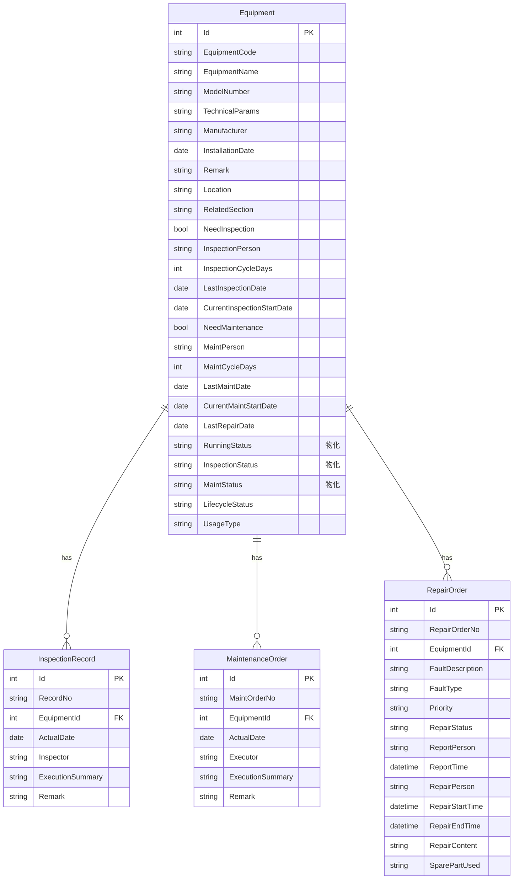

# 设备上下文数据库设计

**版本：V2.2**
**最后更新：2026-08-15**

---

## 一、概述

本文档定义设备上下文的数据库设计。设备上下文涵盖设备主数据管理、设备点检、设备保养和设备维修四个子模块，通过 EquipmentId 外键约束实现实体间关联。

**当前范围（V2.0）：**
- 设备台账（Equipment）
- 点检记录（InspectionRecord）
- 保养工单（MaintenanceOrder）
- 维修工单（RepairOrder）

**设计原则：**
- 设备台账的 `LifecycleStatus`/`UsageType` 为手工设置字段，`RunningStatus`/`InspectionStatus`/`MaintStatus` 为 Service 层自动计算的**物化存储字段**（由 `EquipmentStatusCalculator` 在点检/保养/维修写操作后同步更新），不再动态计算
- 点检/保养/维修通过 `EquipmentId` 物理 FK 关联到设备台账
- **维修状态（RepairStatus）为维修工单表（RepairOrder）的 Service 层自动推导并持久化存储字段**（根据 RepairStartTime/RepairEndTime 时间完整性推导）；点检/保养无独立状态表字段，其状况（InspectionStatus/MaintStatus）物化存储在设备台账表
- **V1.0→V2.0 变更**：RunningStatus/InspectionStatus/MaintStatus 从 Service 层动态计算改为 Equipment 实体物化存储，支持 DB 级排序和筛选

---

## 二、实体清单

| 序号 | 实体 | 表名 | 说明 |
|------|------|------|------|
| 1 | Equipment | Equipment | 设备台账（主数据） |
| 2 | InspectionRecord | InspectionRecord | 点检执行记录 |
| 3 | MaintenanceOrder | MaintenanceOrder | 保养工单 |
| 4 | RepairOrder | RepairOrder | 维修工单 |

---

## 三、Equipment（设备台账）

### 3.1 表名

`Equipment`

### 3.2 字段定义

| 字段 | 类型 | 必填 | 默认值 | 说明 | 生成方式 |
|------|------|------|--------|------|----------|
| Id | int | ✅ | 自增 | 主键 | 🔄 |
| EquipmentCode | nvarchar(50) | ✅ | - | 设备编号 | 👤 |
| EquipmentName | nvarchar(200) | ✅ | - | 设备名称 | 👤 |
| ModelNumber | nvarchar(100) | ❌ | - | 型号规格 | 👤 |
| TechnicalParams | nvarchar(500) | ❌ | - | 技术参数 | 👤 |
| Manufacturer | nvarchar(200) | ❌ | - | 制造商 | 👤 |
| InstallationDate | date | ❌ | - | 安装日期 | 👤 |
| Remark | nvarchar(500) | ❌ | - | 备注 | 👤 |
| Location | nvarchar(100) | ✅ | - | 所在区域 | 👤 |
| RelatedSection | nvarchar(100) | ❌ | - | 关联工段 | 👤 |
| NeedInspection | bit | ✅ | 0 | 是否需点检 | 👤 |
| InspectionPerson | nvarchar(50) | ❌ | - | 点检负责人 | 👤 |
| InspectionCycleDays | int | ✅ | 7 | 点检周期（天） | 👤 |
| LastInspectionDate | date | ❌ | - | 最近点检日期（自动回写） | ⚙️ |
| CurrentInspectionStartDate | date | ❌ | - | 本次点检日起始 | 👤 |
| NeedMaintenance | bit | ✅ | 0 | 是否需保养 | 👤 |
| MaintPerson | nvarchar(50) | ❌ | - | 保养负责人 | 👤 |
| MaintCycleDays | int | ✅ | 30 | 保养周期（天） | 👤 |
| LastMaintDate | date | ❌ | - | 最近保养日期（自动回写） | ⚙️ |
| CurrentMaintStartDate | date | ❌ | - | 本次保养日起始 | 👤 |
| LastRepairDate | date | ❌ | - | 最近维修日期（自动回写） | ⚙️ |
| RunningStatus | nvarchar(20) | ✅ | 'Normal' | 运行状态：Normal(正常)/Pending(待维修)/InProgress(维修中)，由 EquipmentStatusCalculator 自动计算并持久化 | ⚙️ |
| InspectionStatus | nvarchar(20) | ✅ | 'NotApplicable' | 点检状况：NotApplicable(不适用)/Pending(待执行)/Normal(正常)/Overdue(逾期)，由 EquipmentStatusCalculator 自动计算并持久化 | ⚙️ |
| MaintStatus | nvarchar(20) | ✅ | 'NotApplicable' | 保养状况：NotApplicable(不适用)/Pending(待执行)/Normal(正常)/Overdue(逾期)，由 EquipmentStatusCalculator 自动计算并持久化 | ⚙️ |
| LifecycleStatus | nvarchar(20) | ✅ | 'Active' | 生命周期：Active(在用)/Standby(备用)/Scrapped(报废) | 👤 |
| UsageType | nvarchar(20) | ✅ | 'Primary' | 作用类型：Primary(主生产设备)/Secondary(辅生产设备)/Other(其它) | 👤 |
| CreatedTime | datetimeoffset | ✅ | GETUTCDATE() | 创建时间 | 📅 |
| CreatedBy | nvarchar(50) | ✅ | - | 创建人 | 📅 |
| UpdatedTime | datetimeoffset | ✅ | GETUTCDATE() | 更新时间 | 📅 |
| UpdatedBy | nvarchar(50) | ✅ | - | 更新人 | 📅 |

> **注：** `LastInspectionDate`/`LastMaintDate`/`LastRepairDate` 由 Service 层在点检/保养/维修操作时自动回写。
> **V2.0 变更：** `RunningStatus`/`InspectionStatus`/`MaintStatus` 现为 Equipment 实体物化存储字段，由 `EquipmentStatusCalculator` 在点检/保养/维修写操作后同步更新（原为 Service 层动态计算，不存储）。

### 3.3 生命周期枚举值

| 存储值 | 中文显示 | 说明 |
|--------|----------|------|
| Active | 在用 | 设备正常使用中 |
| Standby | 备用 | 设备备用状态 |
| Scrapped | 报废 | 设备已报废 |

### 3.4 作用类型枚举值

| 存储值 | 中文显示 | 说明 |
|--------|----------|------|
| Primary | 主生产设备 | 直接参与生产的主要设备 |
| Secondary | 辅生产设备 | 辅助生产的设备 |
| Other | 其它 | 其他类型设备 |

### 3.5 物化状态计算规则

以下状态字段由 `EquipmentStatusCalculator` 在点检/保养/维修写操作后自动计算并持久化：

| 状态字段 | 计算逻辑 | 触发时机 |
|----------|----------|---------|
| RunningStatus(运行状态) | 取设备所有维修工单中按 `RepairStartTime??RepairEndTime` 降序排序的最新记录：无维修记录→Normal(正常)；RepairEndTime 不为空→Normal(正常)；RepairStartTime 不为空→InProgress(维修中)；均为空→Pending(待维修) | 维修工单创建/更新/删除/开始维修/完成维修 |
| InspectionStatus(点检状况) | NeedInspection=false→NotApplicable(不适用)；CurrentInspectionStartDate 为空→Pending(待执行)；今天 < CurrentInspectionStartDate→Normal(正常)；周期范围内有ActualDate记录→Normal(正常)；今天 > 周期结束日→Overdue(逾期)；否则→Pending(待执行) | 点检记录创建/更新/删除 |
| MaintStatus(保养状况) | NeedMaintenance=false→NotApplicable(不适用)；CurrentMaintStartDate 为空→Pending(待执行)；今天 < CurrentMaintStartDate→Normal(正常)；周期范围内有ActualDate记录→Normal(正常)；今天 > 周期结束日→Overdue(逾期)；否则→Pending(待执行) | 保养工单创建/更新/删除 |

> **V2.0 变更：** 上述状态字段从动态计算改为物化存储，由 `EquipmentStatusCalculator.cs` 管理。删除操作后不会回退历史日期（LastInspectionDate/LastMaintDate/LastRepairDate 删除后不恢复）。

---

## 四、InspectionRecord（点检记录）

### 4.1 表名

`InspectionRecord`

### 4.2 字段定义

| 字段 | 类型 | 必填 | 默认值 | 说明 | 生成方式 |
|------|------|------|--------|------|----------|
| Id | int | ✅ | 自增 | 主键 | 🔄 |
| RecordNo | nvarchar(50) | ✅ | - | 点检记录编号，格式 DJ-YYYYMMDD-XXX | ⚙️ |
| EquipmentId | int | ✅ | - | 关联设备（FK→Equipment） | 👤 |
| ActualDate | date | ❌ | - | 实际点检日 | 👤 |
| Inspector | nvarchar(50) | ❌ | - | 点检人 | 👤 |
| ExecutionSummary | nvarchar(500) | ❌ | - | 执行简述 | 👤 |
| Remark | nvarchar(500) | ❌ | - | 备注 | 👤 |
| CreatedTime | datetimeoffset | ✅ | GETUTCDATE() | 创建时间 | 📅 |
| CreatedBy | nvarchar(50) | ✅ | - | 创建人 | 📅 |
| UpdatedTime | datetimeoffset | ✅ | GETUTCDATE() | 更新时间 | 📅 |
| UpdatedBy | nvarchar(50) | ✅ | - | 更新人 | 📅 |

### 4.3 索引

```sql
CREATE INDEX IX_InspectionRecord_EquipmentId ON InspectionRecord(EquipmentId);
ALTER TABLE InspectionRecord ADD CONSTRAINT UK_InspectionRecord_No UNIQUE (RecordNo);
```

> **注：** `UK_InspectionRecord_No` 是 RecordNo 的唯一约束，确保点检记录编号全局唯一。

### 4.4 外键约束

```sql
ALTER TABLE InspectionRecord ADD CONSTRAINT FK_InspectionRecord_Equipment
    FOREIGN KEY (EquipmentId) REFERENCES Equipment(Id);
```

---

## 五、MaintenanceOrder（保养工单）

### 5.1 表名

`MaintenanceOrder`

### 5.2 字段定义

| 字段 | 类型 | 必填 | 默认值 | 说明 | 生成方式 |
|------|------|------|--------|------|----------|
| Id | int | ✅ | 自增 | 主键 | 🔄 |
| MaintOrderNo | nvarchar(50) | ✅ | - | 工单编号，格式 BY-YYYYMMDD-XXX | ⚙️ |
| EquipmentId | int | ✅ | - | 关联设备（FK→Equipment） | 👤 |
| ActualDate | date | ❌ | - | 实际执行日期 | 👤 |
| Executor | nvarchar(50) | ❌ | - | 执行人 | 👤 |
| ExecutionSummary | nvarchar(500) | ❌ | - | 执行简述 | 👤 |
| Remark | nvarchar(500) | ❌ | - | 备注 | 👤 |
| CreatedTime | datetimeoffset | ✅ | GETUTCDATE() | 创建时间 | 📅 |
| CreatedBy | nvarchar(50) | ✅ | - | 创建人 | 📅 |
| UpdatedTime | datetimeoffset | ✅ | GETUTCDATE() | 更新时间 | 📅 |
| UpdatedBy | nvarchar(50) | ✅ | - | 更新人 | 📅 |

### 5.3 索引

```sql
CREATE INDEX IX_MaintenanceOrder_EquipmentId ON MaintenanceOrder(EquipmentId);
ALTER TABLE MaintenanceOrder ADD CONSTRAINT UK_MaintenanceOrder_No UNIQUE (MaintOrderNo);
```

> **注：** `UK_MaintenanceOrder_No` 是 MaintOrderNo 的唯一约束，确保保养工单编号全局唯一。

### 5.4 外键约束

```sql
ALTER TABLE MaintenanceOrder ADD CONSTRAINT FK_MaintenanceOrder_Equipment
    FOREIGN KEY (EquipmentId) REFERENCES Equipment(Id);
```

---

## 六、RepairOrder（维修工单）

### 6.1 表名

`RepairOrder`

### 6.2 字段定义

| 字段 | 类型 | 必填 | 默认值 | 说明 | 生成方式 |
|------|------|------|--------|------|----------|
| Id | int | ✅ | 自增 | 主键 | 🔄 |
| RepairOrderNo | nvarchar(50) | ✅ | - | 工单编号，格式 WX-YYYYMMDD-XXX | ⚙️ |
| EquipmentId | int | ✅ | - | 关联设备（FK→Equipment） | 👤 |
| FaultDescription | nvarchar(500) | ✅ | - | 故障描述 | 👤 |
| FaultType | nvarchar(50) | ❌ | - | 故障类型 | 👤 |
| Priority | nvarchar(20) | ✅ | 'Normal' | 优先级：Normal(普通)/Urgent(紧急)/Emergency(特急) | 👤 |
| RepairStatus | nvarchar(20) | ✅ | 'Pending' | 维修状态（自动推导）：Pending(待维修)/InProgress(维修中)/Completed(已完成) | ⚙️ |
| ReportPerson | nvarchar(50) | ✅ | - | 报修人 | 👤 |
| ReportTime | datetime2 | ✅ | - | 报修时间 | 👤 |
| RepairPerson | nvarchar(50) | ❌ | - | 维修人 | 👤 |
| RepairCategory | nvarchar(20) | ❌ | - | 维修类别：厂内维修/外协维修/换模 | 👤 |
| RepairStartTime | datetime2 | ❌ | - | 维修开始时间 | 👤 |
| RepairEndTime | datetime2 | ❌ | - | 维修结束时间 | 👤 |
| RepairContent | nvarchar(1000) | ❌ | - | 维修内容/结果 | 👤 |
| SparePartUsed | nvarchar(500) | ❌ | - | 备件更换记录（JSON或简要文字） | 👤 |
| OtherRepairPersons | nvarchar(500) | ❌ | - | 辅助维修人（多人协作时补充，逗号分隔） | 👤 |
| CreatedTime | datetimeoffset | ✅ | GETUTCDATE() | 创建时间 | 📅 |
| CreatedBy | nvarchar(50) | ✅ | - | 创建人 | 📅 |
| UpdatedTime | datetimeoffset | ✅ | GETUTCDATE() | 更新时间 | 📅 |
| UpdatedBy | nvarchar(50) | ✅ | - | 更新人 | 📅 |

### 6.3 维修状态自动推导规则

| 条件 | 推导结果 |
|------|----------|
| RepairEndTime 不为空 | Completed（已完成） |
| RepairStartTime 不为空但 RepairEndTime 为空 | InProgress（维修中） |
| RepairStartTime 和 RepairEndTime 均为空 | Pending（待维修） |

### 6.4 优先级枚举值

| 存储值 | 中文显示 | 说明 |
|--------|----------|------|
| Normal | 普通 | 常规维修 |
| Urgent | 紧急 | 紧急维修 |
| Emergency | 特急 | 特急维修 |

### 6.5 索引

```sql
CREATE INDEX IX_RepairOrder_EquipmentId ON RepairOrder(EquipmentId);
CREATE INDEX IX_RepairOrder_RepairStatus ON RepairOrder(RepairStatus);
CREATE INDEX IX_RepairOrder_ReportTime ON RepairOrder(ReportTime);
ALTER TABLE RepairOrder ADD CONSTRAINT UK_RepairOrder_No UNIQUE (RepairOrderNo);
```

> **注：** `UK_RepairOrder_No` 是 RepairOrderNo 的唯一约束，确保维修工单编号全局唯一。

### 6.6 外键约束

```sql
ALTER TABLE RepairOrder ADD CONSTRAINT FK_RepairOrder_Equipment
    FOREIGN KEY (EquipmentId) REFERENCES Equipment(Id);
```

---

## 七、实体关系图



---

## 八、编号规则

| 实体 | 前缀 | 格式 | 示例 |
|------|------|------|------|
| InspectionRecord | DJ | DJ-YYYYMMDD-XXX | DJ-20260516-001 |
| MaintenanceOrder | BY | BY-YYYYMMDD-XXX | BY-20260516-001 |
| RepairOrder | WX | WX-YYYYMMDD-XXX | WX-20260516-001 |

> 设备编号（EquipmentCode）为用户手动输入，无系统自动生成规则。

---

## 九、版本历史

| 版本 | 日期 | 说明 |
|------|------|------|
| **V2.2** | **2026-08-15** | **RepairPerson 描述修正**：§6.2 RepairOrder 字段表"维修人（多人用逗号分隔）"更正为"维修人"（多人协作现存入独立 OtherRepairPersons 字段，见接口设计 V2.5）；RunningStatus 计算逻辑修正：取最新维修工单的排序键由 `RepairStartTime??RepairEndTime??CreatedTime` 更正为 `RepairStartTime??RepairEndTime`（EquipmentStatusCalculator 无 CreatedTime 回退） |
| **V2.0** | **2026-07-09** | **设备物化状态字段**：Equipment 新增 RunningStatus/InspectionStatus/MaintStatus 三个物化存储字段，由 EquipmentStatusCalculator 在点检/保养/维修写操作后自动计算并持久化，支持 DB 级排序和筛选 |
| **V2.1** | **2026-08-09** | **维修状态持久化说明修正**：§一 设计原则"点检/保养/维修的状态为 Service 层自动推导、不直接存储"修正为——维修状态（RepairStatus）为 RepairOrder 表自动推导并持久化存储字段（与 §6.2 字段定义一致），点检/保养状况（InspectionStatus/MaintStatus）物化存储在设备台账表 |
| V1.0 | 2026-05-16 | 初始版本，定义设备上下文4个实体的数据库设计 |
