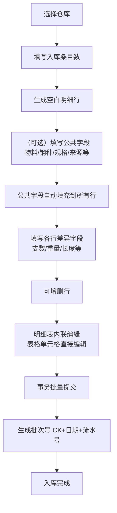
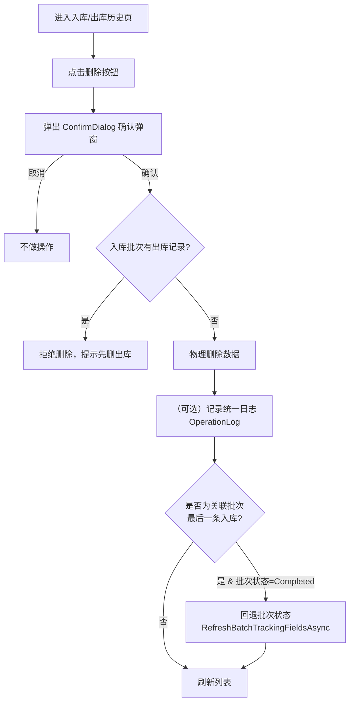
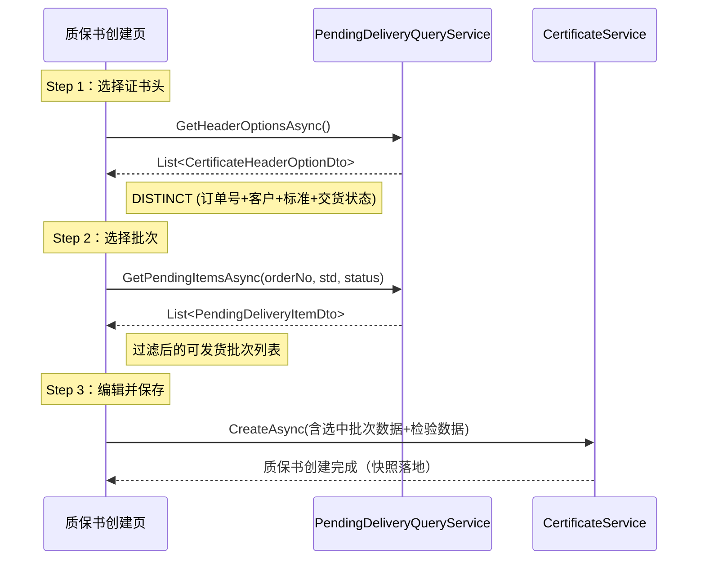

# 仓库模块详细设计（V7.16）

**版本**：V7.16
**最后更新**：2026-08-23

---

## 一、概述

本文档定义仓库模块的详细设计，包括核心流程、业务规则、页面设计、角色权限。

**核心功能**：
- 库存批次管理（批量入库、批量出库、筛选多选出库）
- 分批出库支持（部分出库）
- 次品管理
- 与工单、订单模块集成

**设计原则**：
- 4库合并实体，前端按仓库代码（Code）切分展示和字段可见性
- 出入库均为批量操作，支持公共字段预填
- 出库采用筛选→勾选→跳转独立出库页面模式

---

## 二、核心流程

### 2.1 批量入库流程



**关键设计**：
- 公共字段可留空，留空则明细表中该字段为可编辑状态
- 公共字段填写后自动应用到所有行，明细表中不再展示（减少冗余）
- 明细表按仓库类型展示对应列（FG显示米数，DEFECT显示次品字段等）
- 编辑采用表格单元格内联编辑模式，直接编辑数字/文本/下拉选择框
- 支持上下左右方向键在单元格间导航（table-nav.js）
- 可配置列显示/隐藏（列选择器）+ 公共字段预填
- 事务提交：全部成功或全部回滚

### 2.2 出库流程

```mermaid
flowchart TD
    A[进入仓库页面] --> B[使用表头筛选<br/>批次号/物料/钢种/规格等]
    B --> C[勾选需出库的条目]
    C --> D[点击批量出库]
    D --> E[跳转到独立出库页面<br/>/warehouse/outbound/{Code}]
    E --> F[各条目默认全部出库<br/>可手动改为部分出库]
    F --> G[填写公共信息<br/>出库类型/目标单位等]
    G --> H{校验}
    H -->|通过| I[事务批量提交]
    I --> J[更新各批次剩余量]
    J --> K[创建出库记录]
    K --> L[出库完成]
    H -->|不通过| M[提示错误]
```

**关键设计**：
- 出库流程使用独立页面（`/warehouse/outbound/{Code}`），通过 OutboundStateService 传递已选批次
- 默认全部出库（数量=剩余量），用户可手动改为部分出库
- 多条目一次性提交，事务保障

### 2.3 移库流程

> ⏳ 待实现

### 2.4 批次删除流程

**适用范围**：入库历史页、出库历史页



**关键设计**：
- 使用 MudBlazor `DialogService.ShowAsync<ConfirmDialog>` 确认弹窗（符合 04_开发规范.md §6.10）
- 物理删除，记录到统一 OperationLog 表（InventoryBatchDeleteLog 已于 2026-07-20 并入）
- 入库批次有未删除的出库记录时禁止删除（抛出 BusinessException）
- 删除后若为该 ProductionBatch 的最后一条入库记录且批次状态为 Completed，自动回退状态（通过 RefreshBatchTrackingFieldsAsync 重算）
- 操作不可恢复

---

## 三、业务规则

| 规则ID | 规则说明 | 状态 |
|--------|----------|------|
| INV-001 | 入库时自动生成批次号（CK+年月日+流水号） | ✅ 已实现 |
| INV-002 | 出库更新批次剩余数量和重量 | ✅ 已实现 |
| INV-003 | 出库数量/重量不能超过剩余 | ✅ 已实现 |
| INV-004 | 批量操作全部成功或全部回滚（事务） | ✅ 已实现 |
| INV-005 | 委外出库+圆棒时必须填写委外-穿孔号，且必须为有效的 SubcontractOrder.OrderNo | ✅ 已实现 |
| INV-006 | 出库历史编辑时，委外-穿孔号不可修改（只读），仅可删除重建 | ✅ 已实现 |
| INV-007 | **入库验证规则**：工厂牌号必填、物料类型在允许范围内、入库来源必填 | ✅ 已实现 |
| INV-008 | **长度验证（仅 FG/WIP 适用）**：定尺时最小长度=最大长度且>0，范围尺时最大长度>最小长度且>0 | ✅ 已实现 |
| INV-009 | **次品库（DEFECT）额外验证**：次品原因必填、责任类型必填 | ✅ 已实现 |
| INV-010 | **4库通用验证规则**：支数/重量/物料类型/钢种/名义规格/来源类型/工厂牌号/入库日期必填；物料类型允许范围校验；重量>0；支数>0 | ✅ 已实现 |
| INV-011 | **入库完成推进**：任何仓库的首笔入库均触发 `TryCompleteProductionBatchAsync`（InFinalInspection→Completed 或 InProgress+余材→Completed），不再仅限 FG 仓库 | ✅ 已实现（V7.1） |
| INV-012 | **入库删除状态回退**：删除最后一条入库记录后，若 ProductionBatch 状态为 Completed 且无其他入库，自动回退状态（RefreshBatchTrackingFieldsAsync 重算） | ✅ 已实现 |
| INV-013 | **定尺切割长度匹配标识（CutLengthMatchType）**：仅成品库（FG）+ 订单类成品（OrderFinished/CriticalFinished/SpecialDeliveryStatus）+ 定尺核查；关联解析生产批号为主、工单号兜底（ResolveAssociationAsync）；标识 = 命中本工单号定尺集 → FullMatch（完全匹配）/ 命中「订单号+主号」定尺集 → MainNoMatch（主号匹配）/ 其余 → null（不适用）；其他库房即使有生产批号关联也不核查（库房维度为准）；备料成品 Finished 无工单号不参与 | ✅ 已实现（V7.5） |
| INV-014 | **定尺切割长度硬校验**：仅自动填充第2种「检验入库」按生产批号时（前端 EnforceCutLengthMatch=true）启用，需同时满足 FG 成品库 + 检验入库 + 订单类成品 + 定尺 + 生产批号非空 + 工单号非空，入库长度必须命中「订单号+主号」定尺长度集合，否则 SaveChanges 前抛 BusinessException 禁止入库（采购/委外与手动填写不受影响） | ✅ 已实现（V7.5） |
| INV-015 | **内联编辑核查条件**：入库批次内联编辑时，仅当生产批次 + 工单号都非空才进行定尺切割长度核查；任一缺失则 CutLengthMatchType 标识清空；主号在工单号/生产批号任一非空时按权威关联推导 | ✅ 已实现（V7.5） |

> ⏳ 移库规则待实现；冻结功能已废弃（IsFrozen字段已移除）；删除规则 ✅ 已实现

---

## 四、页面设计

### 4.1 仓库首页

**页面路由：** `/warehouse`

**功能说明：** 单页面双模式实现（`WarehouseInventory.razor`）：
- 首页模式（Code 为空）：4个仓库卡片入口，选择后进入对应仓库库存页
- 详情模式（Code 不为空）：展示当前仓库库存批次列表，页头包含入库/出库历史入口按钮

**页面元素：**
- 4个仓库卡片（原料库/成品库/次品库/在制品库），点击进入 `/warehouse/{code}`
- 入库入口从每个仓库详情页顶栏进入

### 4.2 仓库库存页（核心页面）

**页面路由：** `/warehouse/{Code}`（Code = raw / fg / defect / wip）

**功能说明：** 展示当前仓库库存批次列表，支持表头筛选、多选批量出库。

**表头筛选（每列独立）：**
- 可筛选列：批次号、物料、来源、来料单位、入库日期、炉号、钢种、名义规格、长度状态、制造状态、实际规格、生产批号、工单号、主号等
- 不可筛选列：支数、重量、位置、操作（按约定）
- 输入即筛（500ms防抖自动刷新）

**表格列（按仓库类型动态展示）：**

| 列组 | RAW | FG | DEFECT | WIP |
|------|-----|----|--------|-----|
| 批次号 | ✅ | ✅ | ✅ | ✅ |
| 物料/来源/日期等基础列 | ✅ | ✅ | ✅ | ✅ |
| 长度状态/最小/最大长度 | ✅ | ✅ | ✅ | ✅ |
| 米数/剩余米数 | ❌ | ✅ | ❌ | ❌ |
| 实际规格/外径/壁厚 | ❌ | ✅ | ❌ | ✅ |
| 次品原因/责任类型/来料/备注 | ❌ | ❌ | ✅ | ❌ |
| 挂牌号（TagNo） | ✅ | ✅ | ✅ | ✅ |
| 生产批号 | ❌ | ✅ | ✅ | ✅ |
| 关联工单/工单号/订单号/主号 | ⚠️ | ✅ | ✅ | ❌ |

> 注：RAW 库"关联工单/工单号/订单号/主号"为 ⚠️：IsLinkedToWorkOrder 和 WorkOrderNo 适用，SalesOrderNo 和 ProductionMainNo 不适用。项次（OrderItemIds）已弃用，各仓库统一 `SetNotApplicable` 不显示；主号（ProductionMainNo）列已接入（FG 默认隐藏，可手动开启列显隐）。
| 操作（批量出库入口） | ✅ | ✅ | ✅ | ✅ |

**分组结构**：4库共用 `AssignGroups()` 分组逻辑，DEFECT 额外有 G7 次品信息组（次品原因/责任类型/来料/次品备注）。挂牌号（TagNo）位于 G1 来源信息组（所有仓库），次品库 DEFECT 的 G7 组不包含挂牌号。

**操作栏：**
- 工具栏"批量出库"按钮：先通过复选框勾选多行，点击后在出库模式弹窗中确认，跳转到独立出库页面（`/warehouse/outbound/{Code}`）
- 无逐行单行出库按钮，出库操作统一走批量出库流程

**出库操作页（`WarehouseOutbound.razor`）：**
- 选中条目列表（批次号/钢种/规格/剩余/出库数量输入/出库重量输入）
- 公共信息（出库类型/目标单位/委外-穿孔号/备注）
- 合计汇总
- 事务提交
- 通过 `OutboundStateService` 从库存页传递已选批次

### 4.3 批量入库页面

**页面路由：** `/warehouse/inbound` 或 `/warehouse/inbound/{Code}`（预选仓库）。无 Code 参数时自动重定向到 `/warehouse`。

**功能说明：** 批量录入入库信息，表格内联编辑直接输入明细。

**页面布局：**

**顶栏：** 仓库选择 + 列选择按钮 + 重置按钮

**生成区域：** 入库条目数输入 + "生成入库明细"按钮

**明细表（内联编辑）：**
- 使用 `FixedHeader="true"` 固定表头
- 所有字段直接在表格单元格编辑（MudTextField/MudNumericField/MudSelect）
- 每行均包含：支数*、重量(kg)*、长度状态、最小长度、最大长度、单支重、制造状态、区域、框架、备注
- FG额外：米数
- DEFECT额外：次品原因、责任类型、挂牌号、次品备注
- 订单信息组（G2）：订单号/主号/工单号等，主号列默认隐藏（可手动开启列显隐）；项次列已弃用，统一 `SetNotApplicable` 不显示
- 可增删行（底部 +/- 按钮）
- 底部合计行（总支数/总重量）
- 自动填充第2种「检验入库」按生产批号填充并启用定尺切割长度硬校验（EnforceCutLengthMatch，见 INV-014）

**分组标题栏结构**：按仓库类型动态生成分组标题栏，4库共用 G1-G5 组结构，DEFECT 额外有 G6 组（次品信息：次品原因/责任类型/挂牌号/次品备注）。操作列尾部添加空白占位（90px）避免偏移。分组标题栏通过 `initGroupHeaders` JS 与表格横向滚动同步对齐。

**列选择器（列选择按钮弹出）：**
- 列显示控制：每列有显示/隐藏复选框 + 上移/下移排序
- 公共字段标记：勾选后新增行自动从上一行复制该字段值
- 重置按钮恢复所有适用字段显示

**方向键导航：** 支持 ↑ ↓ ← → 在单元格间移动焦点

**表格样式配置：**
- `Class="auto-table"` 自动压缩列间距，容器默认支持横向滚动
- 滚动容器 `max-height: calc(100vh - 310px)` 固定表头
- "确认入库"按钮固定在滚动容器外部

### 4.4 批次详情页

> ⏳ 待实现

### 4.5 打印功能

**支持页面：** 库存列表页（WIP/FG/DEFECT/RAW）、入库历史页、出库历史页

**实现方式：** 使用 QuestPDF 的 `TablePrintHelper` 通用表格打印帮助类，根据前端上传的列定义（PrintColumnDef）动态生成 A4 横向 PDF。

**打印按钮（工具栏）：**
- **库存台账打印全部** → POST `/api/inventory/print-stock-all-file`（携带当前筛选条件 + 可见列定义，仅含库存台账页使用 `OnlyWithStock=true`）
- **库存台账打印选中** → POST `/api/inventory/print-stock-selected-file`（携带选中批次ID + 可见列定义）
- **库存列表打印全部** → POST `/api/inventory/print-inventory-all-file`（携带当前筛选条件 + 可见列定义）
- **库存列表打印选中** → POST `/api/inventory/print-inventory-selected-file`（携带选中批次ID + 可见列定义）
- **入库历史打印全部** → POST `/api/inventory/print-inbound-all-file`
- **入库历史打印选中** → POST `/api/inventory/print-inbound-selected-file`
- **出库历史打印全部** → POST `/api/inventory/print-outbound-all-file`
- **出库历史打印选中** → POST `/api/inventory/print-outbound-selected-file`

**前端处理：** 后端返回 PDF base64 字符串 → 前端 `openPdf()` 通过 Blob URL 打开（与工单打印方案一致）

**表头：** 标题 + 横线 | **内容：** 序号 + 动态列（依列定义渲染） | **页脚：** 横线 + 打印日期 + 页码

> **打印列定义（PrintColumnDef）**：Key=属性名，Label=显示名称，由前端列选择器的当前可见列自动生成。

### 4.6 入库历史页

**页面路由：** `/warehouse/inbound-history`（可选参数 `/{Code}` 预选仓库）

**页面文件：** `MES.Blazor/Pages/Warehouse/InboundHistory.razor`

**功能说明：** 展示入库历史记录，支持仓库筛选、搜索、排序、删除。按仓库编码（Code）可过滤展示对应仓库的入库记录。

**组标题设计：** 列按业务语义分为三组——来源信息（仓库批次/来源类型/来料单位/原始来料/入库日期）、自动填充（物料/钢种/规格/重量/区域/框架/炉号/工单号/订单号/主号）、手工填写（长度状态/最小最大长度/单支重/制造状态/备注）。FG/DEFECT 额外有 G2 订单信息组（订单号/主号/项次/工单号/关联工单）与 G3 物料信息组，FG 另有 G4 入库计量组（含「符合工单长度」CutLengthMatchType 列，枚举下拉走 `DisplayHelper.GetCutLengthMatchOptions`），DEFECT 库额外有 G7 次品信息组。项次列已弃用，各仓库统一 `SetNotApplicable` 不显示。组标题通过 JS 与表格横向滚动同步对齐，操作列尾部添加空白占位避免偏移。

**标签统一：** 入库操作页、入库历史页、库存页的列标签已统一为标准命名。如"来源"→"来源类型"，其余字段标签与库存页面保持一致。

**验证规则对齐：** 入库历史页的 SaveRow 内联编辑验证与入库操作页（WarehouseInbound）完全一致，包括：工厂牌号必填、物料类型允许范围校验、入库来源必填、重量/支数>0。长度验证仅 FG/WIP 适用（定尺/范围尺逻辑与入库页相同）。DEFECT 次品库额外验证：次品原因必填、责任类型必填。

### 4.7 出库历史页

**页面路由：** `/warehouse/outbound-history`（可选参数 `/{Code}` 预选仓库）

**页面文件：** `MES.Blazor/Pages/Warehouse/OutboundHistory.razor`

**功能说明：** 展示出库历史记录，支持仓库筛选、搜索、排序、删除、打印。出库记录删除时自动恢复批次剩余量，更新时使用增量计算调整批次。

**字段说明：**
- **委外-穿孔号（SourceOrderNo）：** 原"物料单号"，仅委外出库+圆棒时填写。已在出库操作页面重命名为"委外-穿孔号"以明确用途。出库历史中此字段为**只读**，编辑时不可修改，仅可删除重建（与入库历史来源信息组处理方式一致）。
- **出库工单号（WorkOrderNo）：** 标识本次出库对应的生产工单，位于"出库类型"列之后，内联编辑可手改，并纳入搜索/排序/筛选（SortKey=workorderno）。生产领料出库时该字段是批次用料计划"完成"判定的匹配键（见 §6.1）。
- **退货-原仓库批（ReturnSourceBatchNo）：** 位于"出库工单号"列之后，退货出库时记录原仓库批号（原"退货-原批次号"，改名防混淆），全类型可填可空，内联编辑可手改，并纳入搜索/排序/筛选（SortKey=returnsourcebatchno）。

### 4.8 出库页面

**页面路由：** `/warehouse/outbound/{Code}`（通过仓库详情页进入，无 Code 时回退到共享状态，均无效则重定向到 `/warehouse`）

**页面文件：** `MES.Blazor/Pages/Warehouse/WarehouseOutbound.razor`

**功能说明：** 出库操作页面，通过仓库详情页的面包屑进入（`/warehouse/outbound/{code}`），仓库和批次已在来源页面选定。填写出库类型/目标单位等公共信息后事务提交。

**字段说明：**
- **出库工单号（WorkOrderNo）：** 出库页面"出库类型"列之后的可编辑列。**默认值 = 所选仓库批的工单号（`s.WorkOrderNo`），可手改**；单条与批量出库（OutboundItemRequest）均一致，AutoFill/Submit 同步提交。生产领料出库时需与用料计划工单号一致才能"完成"对应计划（见 §6.1）
- **退货-原仓库批（ReturnSourceBatchNo）：** "出库工单号"列之后的可编辑列。退货出库时记录原仓库批号（原"退货-原批次号"，改名防混淆），全类型可填可空；单条与批量出库（OutboundItemRequest）均一致，AutoFill/Submit 同步提交。
- **出库米数（OutboundMeters）：** 字段仍存在，对非成品库默认隐藏
- **委外-穿孔号（SourceOrderNo）：** 原"物料单号"，专门用于委外出库（SubcontractOut）+圆棒（RoundBar）场景，关联 SubcontractOrder.OrderNo。填写时进行后端校验：委外-穿孔号必须对应有效的委外单

### 4.9 待发货页面

**页面路由：** `/warehouse/pending-delivery`

**页面文件：** `MES.Blazor/Pages/Warehouse/PendingDelivery.razor`

**功能说明：** 成品库待发货库存实时查询视图，展示可发货的库存批次列表。支持服务端分页、ExcelFilter 列筛选、入库日期范围筛选、打印。提供证书头选择项和批次选择数据接口，供质保书创建页引用。

### 4.10 物料进出存报表

**页面路由：** `/warehouse/monthly-stock`（仓库管理，2026-08-23 自 /reports/monthly-stock 迁移；旧路由已废弃）

**页面文件：** `MES.Blazor/Pages/Reports/MonthlyStock.razor` / `.razor.cs`

**功能说明：** 物料进出存透视表，行=库房×物料类型，列=期初 + 12 月×（入/出/结）+ 实时数据/实时结存。**同一数据集支撑 4 报表切换**（入库报表/出库报表/库存报表/物料进出存报表），仅展示列不同；**入库/出库报表额外按 来源/出库类型 展开粒度**。**当前月份之后的月份尚未发生，单元格留空**（前端按 `_currentMonthIndex` 判断，2026-08-23）。

- **行结构（关键）**：库房名称列置于「物料类型」前，**库房名合并单元格（rowspan）**（后端按库房固定顺序排序保证同库房相邻，前端 ComputeRowspans 计算 rowspan）；库房固定顺序=**原料库→成品库→在制品库→次品库**；物料类型固定顺序=**圆棒→荒管→临界成品→订单成品→订成-非交付态→备料成品→余库料→半成品→在制品→次品圆棒→次品荒管→次品成品→次品半成品→次品在制→报废品**
- **4 报表切换**：入库报表仅展示每月「入」+「来源汇总(t)」（列=库房×物料类型×入库来源，来源固定顺序=外购→委外→生产入库→检验入库→其它，全 0 来源行隐藏）；出库报表仅展示「出」+「出库类型汇总(t)」（列=库房×物料类型×出库类型，类型固定顺序=生产领用→销售出库→退货出库→委外出库→其它出库，全 0 类型行隐藏）；库存报表仅展示「结」+期初+实时结存；物料进出存报表展示「入/出,[结]」三值 + 期初 + 实时数据
- **物料汇总列（入库/出库报表专用）**：「来源汇总(t)」后追加「**物料汇总(t)**」合并列——按物料类型全年合计（入报表=ΣTotalIn、出报表=ΣTotalOut），物料类型合并单元格（双层 rowspan=库房+物料类型，前端 ComputeRowspans 计算）
- **结存口径（关键）**：每月「结」为**真实库存余额（全口径）**，由「期初+累计入−累计出」逐月递推；期初=截至上年末的入−出；入/出为**全口径流量**（不按来源/类型拆分，无筛选维度）；来源/类型粒度行**仅累计本年入/出**，不展示期初/结存
- **单位显示**：kg/1000 → t，F1，0 值留空；「入/出,[结]」三值（如 80/15,[65]=当月入 80t、出 15t、月末结存 65t，0 的部分省略，结存负数仍显示），「实时结存/实时数据」=截至当前月的 入/出/结 合计
- **未来月留空**：当前月份之后（`m > _currentMonthIndex`）的月份单元格留空不显示数据
- **表格线**：浅色 1px `#d0d0d0` 独立边框模型（border-collapse:separate，保证 sticky 表头/列边框不随折叠丢失）；月份表头/单元格 min-width:90px 保证列宽一致
- **无合计行**（用户决策）
- **打印**：前端 getTableHtml(`#monthly-stock-table-wrap`) + printRawHtml（原生 table，按当前报表标题打印）——**传容器选择器**（getTableHtml 契约=container 内第一张 table，传表自身 id 会取不到返回空）；**打印前追加 `<style>`（table-layout:fixed;width:100%;font-size:12px;white-space:normal）并传 `"landscape"` 横向 A4**，表格总宽度恒等于页宽、不超过单页界限
- **⚠️ 数据完整性说明**：入库流=InventoryBatch 行本身；物理删除无出库记录的批次会使对应入库流从报表消失（接受为设计决策）

**服务端实现：** `InventoryService.GetMonthlyStockSummaryAsync`（`MES.Services/Warehouse/InventoryService.cs`）：加载全部入库批次投影（含 InboundSource）+ 出库记录 JOIN 批次（含 OutboundType），按「库房Id|物料类型」字典聚合（OrdinalIgnoreCase）得全口径 Rows（期初/逐月递推），再分别按「库房Id|物料类型|来源」/「库房Id|物料类型|类型」聚合本年入/出得 InboundSourceRows/OutboundTypeRows（仅累计入/出，全 0 隐藏），均按库房固定顺序+物料类型固定顺序+来源/类型固定顺序排序，无合计行。前端 ApplyRows 按报表类型切换数据源，ComputeRowspans 双层 rowspan（库房+物料类型）+ 物料类型汇总值。

---

## 五、角色权限

| 角色 | 库存查看 | 入库 | 出库 | 移库 | 冻结/解冻 | 删除批次 |
|------|----------|------|------|------|-----------|----------|
| WarehouseStaff | ✅ | ❌ | ❌ | ❌ | ❌ | ❌ |
| WarehouseDirector | ✅ | ✅ | ✅ | ❌ | ❌ | ✅ |
| Admin | ✅ | ✅ | ✅ | ❌ | ❌ | ✅ |

> 实际使用 `Roles.Staffs.Warehouse` / `Roles.Directors.Warehouse` / `Roles.Admin` 角色，储存在 `MES.Shared.Constants.Roles` 中。

---

## 六、与其他模块的集成

### 6.1 与工单模块集成

- 成品入库时，通过工单号自动带入订单信息
- 生产领料出库时，**出库工单号（OutboundRecord.WorkOrderNo）默认 = 仓库批工单号，可手改**（单条与批量一致）。**批次用料计划"完成"匹配口径**：可用批次引用（GetAvailableBatchesAsync 投影 `WorkOrderNo = 出库工单号 ?? 仓库批工单号` 优先出库侧）；库存使用/库料改制计划（第4/5类）的"完成"判定=「**仓库批 + 出库工单号 == 计划工单号** 且 出库类型=生产领用」，非仅按仓库批存在性判定——同批次多工单共享时出库工单号需手改正确否则计划不消失（通知滞留，安全方向）；出库工单号为空则不匹配

### 6.2 与订单模块集成

- 通过主号（ProductionMainNo）关联订单，实际查询键为「订单号+主号」（项次 OrderItemIds 已弃用，待阶段二删除）

### 6.3 与批次模块集成

- **ProductionBatchInventory（批次-库存批次关联）**：库存批次通过 `ProductionBatchInventory` 关联表与生产批次建立多对多关系，记录领料支数和领料重量（按出库记录粒度跟踪消耗），支持"合并投料"场景
- **ManufacturingStatus（制造状态）**：生产批次的制造状态字段（枚举同 DeliveryState），仓库入库操作不会直接修改此字段，但入库完成推进（`TryCompleteProductionBatchAsync`）可能触发批次状态变更

### 6.4 与质保书模块（Quality）集成

- **待发货项查询**：质保书创建页 Step 1 通过 `GetHeaderOptionsAsync()` 获取 DISTINCT (订单号+客户名称+产品标准+交货状态) 作为证书头选择项
- **批次选择**：质保书创建页 Step 2 通过 `GetPendingItemsAsync(orderNo, productStandard, deliveryStatus)` 获取某订单下可发货的库存批次列表
- 详见 `docs/模块设计/质量证明书详细设计.md`

---

## 七、API 控制器

### 7.1 库存 API

| Controller | 路由前缀 | 文件 |
|-----------|---------|------|
| InventoryController | `api/inventory` | `MES.Api/Controllers/Warehouse/InventoryController.cs` |

> ⚠️ **跨上下文标注**：`(→物料)` 表示验证采购/委外单号，`(→工单)` 表示验证工单号，数据所有权在对应上下文。

| 方法 | 路由 | 说明 |
|------|------|------|
| GET | `api/inventory/list` | 分页查询库存列表 |
| GET | `api/inventory/all` | 全量查询库存批次（无分页） |
| GET | `api/inventory/{id}` | 获取批次详情 |
| POST | `api/inventory/batch-inbound` | 批量入库 |
| POST | `api/inventory/inbound` | 入库 |
| POST | `api/inventory/outbound` | 出库 |
| POST | `api/inventory/batch-outbound` | 批量出库 |
| GET | `api/inventory/outbound-records` | 查询出库记录 |
| PUT | `api/inventory/{id}` | 更新入库批次 |
| DELETE | `api/inventory/{id}` | 删除入库批次 |
| PUT | `api/inventory/outbound-records/{id:long}` | 更新出库记录 |
| DELETE | `api/inventory/outbound-records/{id:long}` | 删除出库记录 |
| POST | `api/inventory/validate-source-order` | 验证来源单号 (→物料) |
| GET | `api/inventory/validate-workorder-nos/{warehouseId}` | 验证仓库内工单号 (→工单) |
| GET | `api/inventory/workorder-nos/{warehouseId}` | 获取仓库入库批次中引用的所有工单号 (→工单，用于工单变更通知过滤) |
| POST | `api/inventory/validate-production-batch` | 验证生产批号（检验入库自动填充） |
| POST | `api/inventory/refresh-all-cut-length-match` | 全量回填定尺切割长度匹配标识（CutLengthMatchType） |
| POST | `api/inventory/print-inventory-all` | 打印全部库存 |
| POST | `api/inventory/print-inventory-selected` | 打印选中库存 |
| POST | `api/inventory/print-outbound-all` | 打印全部出库记录 |
| POST | `api/inventory/print-outbound-selected` | 打印选中出库记录 |
| GET | `api/inventory/outbound-filter-contexts` | 出库记录筛选上下文 |
| GET | `api/inventory/inventory-filter-contexts` | 库存批次筛选上下文 |
| GET | `api/inventory/monthly-stock-summary` | 物料进出存汇总（一次返回 Rows 全口径 + InboundSourceRows 入库来源粒度 + OutboundTypeRows 出库类型粒度，列=期初+12月×入/出/结+实时数据/实时结存；4 报表共用数据源，无合计行） |

### 7.2 仓库 API

| Controller | 路由前缀 | 文件 |
|-----------|---------|------|
| WarehouseController | `api/warehouse` | `MES.Api/Controllers/Warehouse/WarehouseController.cs` |

| 方法 | 路由 | 说明 |
|------|------|------|
| GET | `api/warehouse/list` | 分页查询仓库列表 |
| GET | `api/warehouse/all` | 全量查询仓库列表 |
| GET | `api/warehouse/{id}` | 获取仓库详情 |
| POST | `api/warehouse` | 创建仓库 |
| PUT | `api/warehouse/{id}` | 更新仓库 |
| DELETE | `api/warehouse/{id}` | 删除仓库 |
| GET | `api/warehouse/filter-contexts` | 筛选上下文 |

### 7.3 待发货查询 API

| Controller | 路由前缀 | 文件 |
|-----------|---------|------|
| PendingDeliveryController | `api/pending-delivery` | `MES.Api/Controllers/Warehouse/PendingDeliveryController.cs` |

| 方法 | 路由 | 说明 |
|------|------|------|
| GET | `api/pending-delivery/list` | 获取待发货列表（无分页，供质保书创建页引用） |
| GET | `api/pending-delivery/all` | 分页查询待发货列表（含 Keyword/排序/ExcelFilter/入库日期范围） |
| GET | `api/pending-delivery/header-options` | 获取证书头选择项（DISTINCT 订单号+客户+标准+交货状态） |
| GET | `api/pending-delivery/filter-contexts` | 筛选上下文（各列 DISTINCT 值） |
| POST | `api/pending-delivery/print-file` | 打印选中行 |
| POST | `api/pending-delivery/print-all-file` | 打印全部（按当前筛选条件） |

---

## 八、待发货项查询（PendingDeliveryQueryService）

### 8.1 功能定位

待发货项查询服务（`PendingDeliveryQueryService`）是**成品库待发货库存**的实时查询视图，不存储独立数据，通过 JOIN InventoryBatch + SalesOrder + OrderItem + WorkOrder + WorkOrderExecutionSummary 5 张表实时组装 DTO。

**用途**：
- 仓库管理 → 待发货成品列表页（服务端分页+筛选+排序+打印）
- 质保书创建页 → 证书头选择（Step 1）+ 批次选择（Step 2）

### 8.2 数据流

```
┌─────────────────────────────────────────────────────────────────────────────┐
│ 1. SQL 层筛选（InventoryBatch）                                             │
│    MaterialType == OrderFinished（订成-非交付态）                             │
│    AND (RemainingQuantity > 0 OR RemainingWeight > 0)                       │
│    [可选] SalesOrderNo 精确过滤                                             │
│    [可选] Keyword 匹配 BatchNo/HeatNo/PlantGrade/Spec/SalesOrderNo/PBNo    │
│                              ↓                                              │
│ 2. 查 WorkOrder → 反推权威 SalesOrderNo + ProductionMainNo                 │
│    （当 InventoryBatch.SalesOrderNo/ProductionMainNo 为空时，通过 WorkOrder 反查）│
│                              ↓                                              │
│ 3. 查 SalesOrder → CustomerName / Salesman / EndCustomer                   │
│                              ↓                                              │
│ 4. 查 OrderItem → StandardNo / StandardGrade / DeliveryState                │
│    （按 OrderNumber|Sequence 复合键匹配）                                   │
│                              ↓                                              │
│ 5. 查 ProductionBatch → 补充炉号（当仓库 HeatNo 为空时）                     │
│                              ↓                                              │
│ 6. 查 WorkOrderExecutionSummary → 补充「工单关注」（主号-关注档位）           │
│    （按 WorkOrderNo 关联，读模型无记录 → null）                              │
│                              ↓                                              │
│ 7. 内存组装 PendingDeliveryItemDto                                         │
│                              ↓                                              │
│ 8. Keyword 全字段内存匹配（含跨表字段：CustomerName/Salesman/EndCustomer 等）│
│ 9. InboundDate 范围筛选                                                     │
│ 10. ExcelFilter 列筛选                                                       │
│ 11. 内存排序 + 分页                                                        │
└─────────────────────────────────────────────────────────────────────────────┘
```

### 8.3 DTO 字段映射

| DTO 字段 | 数据来源 | 说明 |
|----------|----------|------|
| `InventoryBatchNo` | InventoryBatch.BatchNo | 仓库批次号 |
| `MaterialType` | InventoryBatch.MaterialType | 物料类型 |
| `InboundSource` | InventoryBatch.InboundSource | 入库来源 |
| `SourceName` | InventoryBatch.SourceName | 来料单位 |
| `ProductionBatchNo` | InventoryBatch.ProductionBatchNo | 生产批号 |
| `HeatNo` | InventoryBatch.HeatNo → ProductionBatch.SourceHeatNo（回退） | 炉号：优先取仓库字段，为空时从生产批号反查 |
| `PlantGrade` | InventoryBatch.PlantGrade | 工厂牌号 |
| `Specification` | InventoryBatch.Specification | 名义规格 |
| `LengthStatus` | InventoryBatch.LengthStatus | 长度状态 |
| `MinLength` | InventoryBatch.MinLength | 最小长度 |
| `MaxLength` | InventoryBatch.MaxLength | 最大长度 |
| `RemainingQuantity` | InventoryBatch.RemainingQuantity | 剩余支数 |
| `RemainingWeight` | InventoryBatch.RemainingWeight | 剩余重量 |
| `Meters` | InventoryBatch.Meters | 米数 |
| `RemainingMeters` | InventoryBatch.RemainingMeters | 剩余米数 |
| `InboundDate` | InventoryBatch.InboundDate | 入库日期 |
| `SalesOrderNo` | InventoryBatch.SalesOrderNo ← WorkOrder.SalesOrderNo（回退） | 订单号：优先直接从批次取，为空时通过工单反查 |
| `ProductionMainNo` | InventoryBatch.ProductionMainNo ← WorkOrder.ProductionMainNo（回退） | 主号（查询/显示/Keyword/筛选均用主号） |
| `WorkOrderNo` | InventoryBatch.WorkOrderNo | 工单号 |
| `WorkOrderAttention` | WorkOrderExecutionSummary.ScheduleStage（按 WorkOrderNo 关联） | 工单关注：读模型「实时关注」组「主号-关注」档位（0=主号暂停 1=主号完成 2=原料锁定 3=生产执行 4=成品检验），读模型无记录为 null |
| `CustomerName` | SalesOrder.CustomerName | 客户名称 |
| `Salesman` | SalesOrder.Salesman | 业务员 |
| `EndCustomer` | SalesOrder.EndCustomer | 最终客户 |
| `ProductStandard` | OrderItem.StandardNo | 产品标准（项次的标准号） |
| `DeliveryStatus` | OrderItem.DeliveryState → 中文映射 | 交货状态（枚举→中文） |
| `StandardGrade` | OrderItem.StandardGrade | 标准牌号 |

> **炉号回退规则**：当 `InventoryBatch.HeatNo` 为空时，通过 `ProductionBatchNo` 查 `ProductionBatch.SourceHeatNo` 补充。该逻辑在 `LoadDtosAsync` 的步骤 3b 中完成。

> **订单号回退规则**：当 `InventoryBatch.SalesOrderNo` 为空或与 WorkOrder 不一致时，以 WorkOrder 中的 `SalesOrderNo` 为准。该逻辑保证即使批次未关联订单号，也能通过工单反查到正确的订单信息。

> **项次仅内部解析（2026-08-09）**：`OrderItemIds` 仅作内部解析「产品标准/标准等级/交货状态」的关联键（订单号|序列 复合键），查询/显示/Keyword/筛选已改用主号（`ProductionMainNo`），`PendingDeliveryItemDto` 不再暴露 `OrderItemIds` 字段。

### 8.4 ⚠️ 架构说明：Hybrid 查询模式

待发货项查询采用 **SQL 投影 + 内存 JOIN** 的 Hybrid 模式，原因如下：

- DTO 的 `CustomerName`/`ProductStandard`/`DeliveryStatus` 等字段来自 SalesOrder/OrderItem，**不是 InventoryBatch 实体字段**
- 无法在 EF Core IQueryable 上直接做跨表排序/筛选
- 待发货成品批次通常数量有限（几百～几千），全部加载到内存是可控的
- 因此 SQL 层只做 InventoryBatch 自身字段的过滤，跨表字段的 Keyword 匹配/排序/筛选全部在内存中进行

### 8.6 缓存策略（V6.9 优化）

待发货项查询采用 **3 层内存缓存（MemoryCache）** 策略优化查询性能，避免每次翻页都重新跨表 JOIN 计算：

**缓存层级：**

```
┌─────────────────────────────────────────────────────────────────┐
│ 第1层：已组装 DTO 缓存（CacheKey = "PendingDeliveryQuery..."）   │
│   SlidingExpiration = 5 分钟                                     │
│   失效条件：InventoryService 出库/入库操作时 Remove(CacheKey)      │
│   命中时：0 DB 查询，直接返回全部 DTO                             │
│   未命中时：从 C1 + C2 重建                                     │
├─────────────────────────────────────────────────────────────────┤
│ 第2层：InventoryBatch 原始实体（内部 key）                        │
│   SlidingExpiration = 10 分钟                                    │
│   存储：MaterialType=OrderFinished 且剩余>0 的成品批次            │
├─────────────────────────────────────────────────────────────────┤
│ 第3层：引用数据（复合 key = 各批次的标识符 MD5）                   │
│   SlidingExpiration = 30 分钟                                    │
│   存储：CustomerName/Salesman/EndCustomer/ProductStandard/        │
│         DeliveryStatus/StandardGrade 等跨表字段                   │
└─────────────────────────────────────────────────────────────────┘
```

**失效策略：**
- 出库/入库操作时，主动移除第 1 层（`Remove(CacheKey)`），下次请求从 C1+C2 重建
- C1（InventoryBatch 原始实体）和 C2（引用数据）有效期较长，减少 DB 查询
- 因待发货成品批次通常数量有限（几百～几千），全部加载到内存可控
- 首次加载后，后续翻页无需重新计算，性能大幅提升

### 8.5 与质保书模块的集成关系



---

## 九、版本历史

| 版本 | 日期 | 说明 |
|------|------|------|
| **V7.17** | **2026-08-23** | **产量报表删除**：报表系统上下文消亡（ReportController/ReportService/ReportPrintHelper/DailyProductionReportDto、前端 ProductionOutput.razor + ReportService 全删，菜单「报表系统」组移除，ApiEndpoints 常量/DI 注册清理；物料进出存报表不受影响） |
| **V7.16** | **2026-08-23** | **菜单归属调整 + 待发货项「工单关注」+ 报表路由迁移**：①仓库管理菜单顺序「在制品库」移至「次品库」上方（原料库→成品库→在制品库→次品库→物料进出存报表→待发货项）；②物料进出存报表菜单自报表系统移入仓库管理组（位于「次品库」之下，权限同为仓库角色，报表系统仅余产量报表）；③**物料进出存报表路由 /reports/monthly-stock → /warehouse/monthly-stock**（旧路由直接废弃，前端菜单 Href 同步，产量报表仍留 /reports）；④待发货项查询 JOIN 扩为 5 表（+WorkOrderExecutionSummary），新增「工单关注」字段（WorkOrderAttention=读模型「实时关注」组「主号-关注」档位，按 WorkOrderNo 关联，无记录为 null），订单关联组工单号后新增列+筛选+排序+打印全链路；⑤修复 WorkOrderAttention 无读模型时 GetValueOrDefault 返回 0（误显示「主号暂停」）→ 改 TryGetValue 置 null；§8.1/§8.2/§8.3 同步，新增 PendingDeliveryQueryServiceTests 4 用例 |
| **V7.15** | **2026-08-23** | **4 报表统一调整（未来月留空/实时列名/新格格式/表格线/打印适配）**：§4.10 ①当前月之后月份单元格留空；②「全年末结存」→「实时结存」、库存报表「全年末结存(t)」表头同步；③「全年合计」→「实时数据」、物料进出存表头同步；④三值格式「入X/出Y/结Z」→「入/出,[结]」（如 80/15,[65]）；⑤浅色 1px 表格线（独立边框模型 sticky 安全）+ 月份列 min-width:90px；⑥打印追加 print-fit `<style>` + 横向 A4；注释栏/§7.1 同步 |
| **V7.14** | **2026-08-23** | **报表改名「物料进出存报表」**：§4.10 月底进出库报表→物料进出存报表（标题/菜单/第 4 个切换标签/文档全链路同步）；§7.1 端点说明同步 |
| **V7.13** | **2026-08-23** | **入库/出库报表加来源/出库类型粒度**：§4.10 入库报表改按「入库来源」展开（库房×物料类型×来源，附「来源汇总(t)」+「物料汇总(t)」合并列）、出库报表按「出库类型」展开（库房×物料类型×类型，附「出库类型汇总(t)」+「物料汇总(t)」合并列）；后端 GetMonthlyStockSummaryAsync 新增 InboundSourceRows/OutboundTypeRows 聚合（仅累计本年入/出、全 0 隐藏、来源/类型固定顺序）；前端 ApplyRows 切换数据源 + ComputeRowspans 双层 rowspan（库房+物料类型）+ 物料类型汇总值；打印传容器选择器 #monthly-stock-table-wrap 修复取表；§7.1 端点说明同步 |
| **V7.12** | **2026-08-23** | **月底进出库报表重构**：§4.10 重写为「月底进出库报表」（行=库房×物料类型+库房合并单元格，库房固定顺序 原料库→成品库→在制品库→次品库、物料类型固定顺序；去钢种粒度/入出筛选维度；4 报表切换 入库/出库/库存/月底进出库 同一数据源仅展示列不同；入/出为全口径单值；无合计行）；§7.1 端点说明同步；对应服务端实现 InventoryService.GetMonthlyStockSummaryAsync |
| **V7.11** | **2026-08-23** | **月度库存报表**：新增 §4.10 月度库存报表（路由 /reports/monthly-stock，粒度双切换/入出双下拉/真实全口径结存/合计行/打印）；§7.1 新增 GET api/inventory/monthly-stock-summary 端点；对应服务端实现 InventoryService.GetMonthlyStockSummaryAsync |
| **V7.10** | **2026-08-19** | **出库字段改名**：§4.7/§4.8「退货-原批次号」→「退货-原仓库批」（防混淆，语义更明确为原仓库批，出库历史页+批量出库页+DataExchange Excel 表头全链路）；字段名 ReturnSourceBatchNo 不变 |
| **V7.9** | **2026-08-19** | **入库来源精简 7→5 值**：InboundSource 枚举删除 ReturnIn（退货入库）/TransferIn（移库入库），保留 Purchase/Subcontract/ProductionInbound/InspectionInbound/Other；真库无 ReturnIn/TransferIn 存量记录，仅清理 EnumDisplayDefinitions 显示配置并重排 DisplayOrder；入库历史页/入库操作页来源类型下拉随之收敛为 5 值（WarehouseInbound 兜底 GetEnumOptions 自动收敛） |
| **V7.8** | **2026-08-19** | **出库类型精简 8→5 值 + 新增退货-原批次号 + 委外-穿孔号改名**：OutboundType 删除 ScrapOut/InspectionPick/TransferOut（存量 TransferOut 归入 OtherOut），保留 ProductionPick/SalesOut/ReturnOut/SubcontractOut/OtherOut（OtherOut 显示名统一「其它出库」）；§4.7/§4.8 出库历史页与出库页新增「退货-原批次号（ReturnSourceBatchNo，全类型可填可空）」列（在出库工单号后，内联编辑+搜索/排序/筛选）；§4.7/§4.8「委外穿孔号」改名「委外-穿孔号」 |
| **V7.7** | **2026-08-15** | **文档审查清理**：§十 待实现列表移除「冻结/解冻（已废弃，IsFrozen 字段已移除）」行（功能已废弃，不属于待实现项，与 §4.3 已废弃标注重复） |
| **V7.6** | **2026-08-11** | **出库工单号（WorkOrderNo）+ 用料计划完成口径两级匹配**：§4.7 出库历史页新增出库工单号列（内联编辑+搜索/排序/筛选）；§4.8 出库页 OutboundItem 新增出库工单号，默认=仓库批工单号可手改，AutoFill/Submit 同步；§6.1 生产领料出库默认回退仓库批工单号、可用批次引用投影 `WorkOrderNo = 出库工单号 ?? 仓库批工单号`、库存使用/库料改制计划"完成"判定改两级匹配（仓库批+出库工单号==计划工单号 且 出库类型=生产领用） |
| **V7.5** | **2026-08-09** | **项次→主号 + 定尺切割长度匹配**：§4.2 库存页列矩阵「项次」改「主号」（项次已弃用统一 SetNotApplicable 不显示，主号列接功能 FG 默认隐藏）；§4.3/§4.6「表面状态」改「制造状态」，§4.6 组标题补主号与「符合工单长度」列（CutLengthMatchType，下拉走 DisplayHelper.GetCutLengthMatchOptions）；§三 新增 INV-013 定尺切割长度匹配标识 / INV-014 定尺硬校验（仅检验入库自动填充启用）/ INV-015 内联编辑核查条件；§6.2 订单集成 OrderItemIds 改主号；§7.1 新增 refresh-all-cut-length-match 端点；§8 待发货查询 DTO 移除 OrderItemIds、Keyword/筛选上下文改主号，OrderItemIds 仅作内部解析关联键 |
| **V7.4** | **2026-08-01** | **删除日志并入 OperationLog 同步**：§2.4 删除流程节点改为（可选）OperationLog 统一日志，删除日志说明由"记录完整快照到 InventoryBatchDeleteLog"改为"记录到统一 OperationLog 表"（InventoryBatchDeleteLog 已于 2026-07-20 并入）；§十 总结同步澄清 |
| **V7.0** | **2026-07-25** | **文档同步修复（代理报告 #19）：§2.2 出库流程对话框→独立页面；§4.1 补充双模式说明；§4.2 列矩阵 RAW 关联列修正、补充 RemainingMeters、操作栏删除单行出库；§4.5 打印端点更新（print-stock-*）；§十 删除已实现的字段验证规则** |
| V1.0 | 2026-04-26 | 初始版本 |
| V2.0 | 2026-04-29 | 跳过物料上下文，入库流程简化 |
| V3.0 | 2026-04-29 | 批量入库/出库实现；表头列筛选；4库分离展示；出库改为对话框模式 |
| V4.0 | 2026-04-30 | 文档与实际代码同步：删除混合包装/IsFrozen相关描述和业务规则 |
| V4.1 | 2026-05-01 | 修正§5权限表：WarehouseDirector/Admin的删除批次权限改为✅（代码已实现） |
| **V5.0** | **2026-05-01** | **批次号格式 STK→CK，统一为 11 位编号：CK+yyMMdd+3位流水** |
| **V6.0** | **2026-05-06** | **入库页面更新：内联编辑模式（表格单元格直接编辑）+ 列选择器（列显示控制+公共字段）+ 方向键导航 + auto-table 紧凑布局；入库页添加重置按钮；库存页添加重置按钮** |
| **V6.1** | **2026-05-06** | **补充打印功能：§4.5 新增打印功能描述，包括 TablePrintHelper 通用表格PDF生成、4个打印API端点、列定义传递方案** |
| **V6.2** | **2026-05-07** | **入库批次删除行为修正**：有未删除的出库记录时禁止删除批次（抛出 BusinessException），不再级联删除关联出库记录；出库记录删除时自动恢复批次剩余量；出库记录更新时使用增量计算调整批次 |
| **V6.3** | **2026-05-10** | **文档同步**：修正头部版本号与版本历史一致 |
| **V6.4** | **2026-05-17** | **物料类型补充"订成-非交付态"**：InventoryMaterialTypes 新增 SpecialDeliveryStatus 常量，仅成品库（FG）可用；仓库详细设计文档同步 |
| **V6.5** | **2026-07-06** | **自动通知改造**：移除"即时更新"按钮，页面加载时自动调用工单号有效性校验（Snackbar警告）和待出库用料计划通知（Snackbar警告）；修复首次加载数据不显示问题（OnAfterRenderAsync触发ReloadServerData） |
| **V6.6** | **2026-07-15** | **新增待发货项查询表文档**：新增 §8 待发货项查询（PendingDeliveryQueryService）完整设计文档，含 Hybrid 查询模式说明、DTO 字段映射表（InventoryBatch + SalesOrder + OrderItem + WorkOrder 4表JOIN）、炉号回退规则、与质保书模块集成关系；对应 §6.3 和 §7.3 同步更新 |
| **V6.7** | **2026-07-18** | **文档审查修复**：标题与版本号对齐 |
| **V7.3** | **2026-07-26** | **§6 补充批次上下文集成**：新增 §6.3 ProductionBatchInventory 多对多关联说明和 ManufacturingStatus 制造状态引用 |
| **V7.2** | **2026-07-26** | **文档同步更新**：Version bump，与各模块文档版本对齐 |
| **V6.9** | **2026-07-24** | **待发货项查询缓存优化**：§8.6 新增 3 层内存缓存策略文档（已组装 DTOs 5min + InventoryBatch 10min + 引用数据 30min），出库/入库操作时主动失效第1层缓存 |
| **V6.8** | **2026-07-19** | **验证规则标准化 + 分组结构调整**：§三 新增入库验证规则 INV-007~010（工厂牌号/物料类型/长度/FG&WIP定尺范围尺/DEFECT次品原因责任类型）；§4.2 库存页 TagNo 从 G7 移至 G1（来源信息组），DEFECT G7 不包含挂牌号；§4.3 入库页补充分组标题栏结构说明（DEFECT G6 次品信息组）；§4.6 入库历史页补充验证规则对齐说明（与入库操作页一致）+ G7 组补充；原始来料/挂牌号字段名统一为 TagNo |

---

## 十、总结

```yaml
已实现:
  - 4库合并实体+分开展示 ✅
  - 批量入库（内联编辑+列选择器+公共字段+方向键导航） ✅
  - 表头列筛选（除数量/位置外全部可筛） ✅
  - 多选批量出库（对话框模式） ✅
  - 按仓库类型动态列展示 ✅
  - 库存页重置列显示按钮 ✅
  - 打印功能（TablePrintHelper通用PDF生成+4个打印API） ✅
  - 事务保障 ✅
  - 批次物理删除（含确认弹窗；删除日志已并入统一 OperationLog） ✅

待实现:
  - 移库流程 ⏳
  - 批次详情页 ⏳
  - 权限细化 ⏳

一句话:
  - 仓库模块以批量操作和筛选为核心，
  - 4库合并统一管理，
  - 出入库均在同一页面流程内完成。
```
