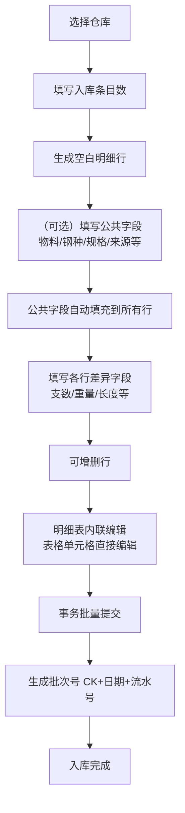
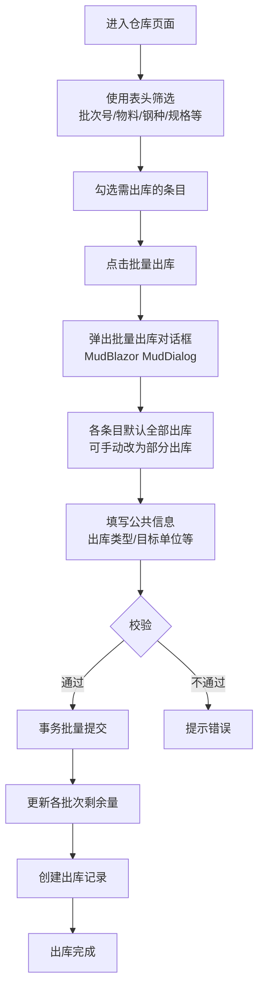
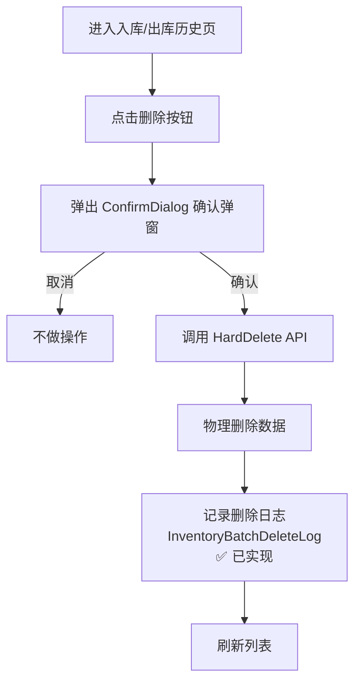
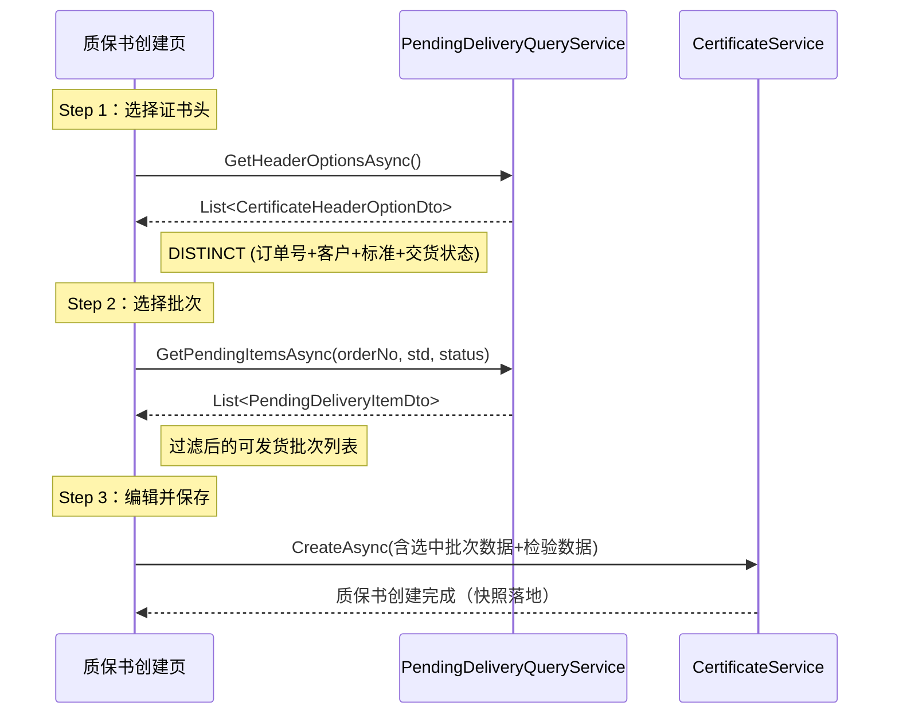

# 仓库模块详细设计（V6.6）

**版本**：V6.8
**最后更新**：2026-07-19

---

## 一、概述

本文档定义仓库模块的详细设计，包括核心流程、业务规则、页面设计、角色权限。

**核心功能**：
- 库存批次管理（批量入库、批量出库、筛选多选出库）
- 分批出库支持（部分出库）
- 次品管理
- 与工单、订单模块集成

**设计原则**：
- 4库合并实体，前端按仓库代码（Code）切分展示和字段可见性
- 出入库均为批量操作，支持公共字段预填
- 出库采用筛选→勾选→对话框模式，无需独立出库页面

---

## 二、核心流程

### 2.1 批量入库流程



**关键设计**：
- 公共字段可留空，留空则明细表中该字段为可编辑状态
- 公共字段填写后自动应用到所有行，明细表中不再展示（减少冗余）
- 明细表按仓库类型展示对应列（FG显示米数，DEFECT显示次品字段等）
- 编辑采用表格单元格内联编辑模式，直接编辑数字/文本/下拉选择框
- 支持上下左右方向键在单元格间导航（table-nav.js）
- 可配置列显示/隐藏（列选择器）+ 公共字段预填
- 事务提交：全部成功或全部回滚

### 2.2 出库流程



**关键设计**：
- 无需独立出库页面，在当前库存页面对话框完成
- 默认全部出库（数量=剩余量），用户可手动改为部分出库
- 多条目一次性提交，事务保障

### 2.3 移库流程

> ⏳ 待实现

### 2.4 批次删除流程

**适用范围**：入库历史页、出库历史页



**关键设计**：
- 使用 MudBlazor `DialogService.ShowAsync<ConfirmDialog>` 确认弹窗（符合 04_开发规范.md §6.10）
- 物理删除，记录完整快照到 InventoryBatchDeleteLog ✅ 已实现
- 入库批次有未删除的出库记录时禁止删除（抛出 BusinessException）
- 操作不可恢复

---

## 三、业务规则

| 规则ID | 规则说明 | 状态 |
|--------|----------|------|
| INV-001 | 入库时自动生成批次号（CK+年月日+流水号） | ✅ 已实现 |
| INV-002 | 出库更新批次剩余数量和重量 | ✅ 已实现 |
| INV-003 | 出库数量/重量不能超过剩余 | ✅ 已实现 |
| INV-004 | 批量操作全部成功或全部回滚（事务） | ✅ 已实现 |
| INV-005 | 委外出库+圆棒时必须填写委外穿孔号，且必须为有效的 SubcontractOrder.OrderNo | ✅ 已实现 |
| INV-006 | 出库历史编辑时，委外穿孔号不可修改（只读），仅可删除重建 | ✅ 已实现 |
| INV-007 | **入库验证规则**：工厂牌号必填、物料类型在允许范围内、入库来源必填 | ✅ 已实现 |
| INV-008 | **长度验证（仅 FG/WIP 适用）**：定尺时最小长度=最大长度且>0，范围尺时最大长度>最小长度且>0 | ✅ 已实现 |
| INV-009 | **次品库（DEFECT）额外验证**：次品原因必填、责任类型必填 | ✅ 已实现 |
| INV-010 | **4库通用验证规则**：支数/重量/物料类型/钢种/名义规格/来源类型/工厂牌号/入库日期必填；物料类型允许范围校验；重量>0；支数>0 | ✅ 已实现 |

> ⏳ 移库规则待实现；冻结功能已废弃（IsFrozen字段已移除）；删除规则 ✅ 已实现

---

## 四、页面设计

### 4.1 仓库首页

**页面路由：** `/warehouse`

**功能说明：** 4个仓库卡片入口，选择后进入对应仓库库存页。

**页面元素：**
- 4个仓库卡片（原料库/成品库/次品库/在制品库），点击进入 `/warehouse/{code}`
- 入库按钮（直接跳转 `/warehouse/inbound`）

### 4.2 仓库库存页（核心页面）

**页面路由：** `/warehouse/{Code}`（Code = raw / fg / defect / wip）

**功能说明：** 展示当前仓库库存批次列表，支持表头筛选、多选批量出库。

**表头筛选（每列独立）：**
- 可筛选列：批次号、物料、来源、来料单位、入库日期、炉号、钢种、名义规格、长度状态、表面状态、实际规格、生产批号、工单号等
- 不可筛选列：支数、重量、位置、操作（按约定）
- 输入即筛（500ms防抖自动刷新）

**表格列（按仓库类型动态展示）：**

| 列组 | RAW | FG | DEFECT | WIP |
|------|-----|----|--------|-----|
| 批次号 | ✅ | ✅ | ✅ | ✅ |
| 物料/来源/日期等基础列 | ✅ | ✅ | ✅ | ✅ |
| 长度状态/最小/最大长度 | ✅ | ✅ | ✅ | ✅ |
| 米数 | ❌ | ✅ | ❌ | ❌ |
| 实际规格/外径/壁厚 | ❌ | ✅ | ❌ | ✅ |
| 次品原因/责任类型/来料/备注 | ❌ | ❌ | ✅ | ❌ |
| 挂牌号（TagNo） | ✅ | ✅ | ✅ | ✅ |
| 生产批号 | ❌ | ✅ | ✅ | ✅ |
| 关联工单/工单号/订单号/项次 | ✅ | ✅ | ✅ | ❌ |
| 操作（单行出库按钮） | ✅ | ✅ | ✅ | ✅ |

**分组结构**：4库共用 `AssignGroups()` 分组逻辑，DEFECT 额外有 G7 次品信息组（次品原因/责任类型/来料/次品备注）。挂牌号（TagNo）位于 G1 来源信息组（所有仓库），次品库 DEFECT 的 G7 组不包含挂牌号。

**操作栏：**
- 单行出库按钮（出库图标，打开批量出库对话框，仅含此行）
- 工具栏"批量出库"按钮（多选后启用，打开对话框含所有选中行）

**批量出库对话框：**
- 选中条目列表（批次号/钢种/规格/剩余/出库数量输入/出库重量输入）
- 公共信息（出库类型/目标单位/委外穿孔号/备注）
- 合计汇总
- 事务提交

### 4.3 批量入库页面

**页面路由：** `/warehouse/inbound` 或 `/warehouse/inbound/{Code}`（预选仓库）

**功能说明：** 批量录入入库信息，表格内联编辑直接输入明细。

**页面布局：**

**顶栏：** 仓库选择 + 列选择按钮 + 重置按钮

**生成区域：** 入库条目数输入 + "生成入库明细"按钮

**明细表（内联编辑）：**
- 使用 `FixedHeader="true"` 固定表头
- 所有字段直接在表格单元格编辑（MudTextField/MudNumericField/MudSelect）
- 每行均包含：支数*、重量(kg)*、长度状态、最小长度、最大长度、单支重、表面状态、区域、框架、备注
- FG额外：米数
- DEFECT额外：次品原因、责任类型、挂牌号、次品备注
- 可增删行（底部 +/- 按钮）
- 底部合计行（总支数/总重量）

**分组标题栏结构**：按仓库类型动态生成分组标题栏，4库共用 G1-G5 组结构，DEFECT 额外有 G6 组（次品信息：次品原因/责任类型/挂牌号/次品备注）。操作列尾部添加空白占位（90px）避免偏移。分组标题栏通过 `initGroupHeaders` JS 与表格横向滚动同步对齐。

**列选择器（列选择按钮弹出）：**
- 列显示控制：每列有显示/隐藏复选框 + 上移/下移排序
- 公共字段标记：勾选后新增行自动从上一行复制该字段值
- 重置按钮恢复所有适用字段显示

**方向键导航：** 支持 ↑ ↓ ← → 在单元格间移动焦点

**表格样式配置：**
- `Class="auto-table"` 自动压缩列间距，容器默认支持横向滚动
- 滚动容器 `max-height: calc(100vh - 310px)` 固定表头
- "确认入库"按钮固定在滚动容器外部

### 4.4 批次详情页

> ⏳ 待实现

### 4.5 打印功能

**支持页面：** 库存列表页（WIP/FG/DEFECT/RAW）、入库历史页、出库历史页

**实现方式：** 使用 QuestPDF 的 `TablePrintHelper` 通用表格打印帮助类，根据前端上传的列定义（PrintColumnDef）动态生成 A4 横向 PDF。

**打印按钮（工具栏）：**
- **打印全部** → POST `/api/inventory/print-inventory-all`（携带当前筛选条件 + 可见列定义）
- **打印选中** → POST `/api/inventory/print-inventory-selected`（携带选中批次ID + 可见列定义）
- **出库历史打印全部** → POST `/api/inventory/print-outbound-all`
- **出库历史打印选中** → POST `/api/inventory/print-outbound-selected`

**前端处理：** 后端返回 PDF base64 字符串 → 前端 `openPdf()` 通过 Blob URL 打开（与工单打印方案一致）

**表头：** 标题 + 横线 | **内容：** 序号 + 动态列（依列定义渲染） | **页脚：** 横线 + 打印日期 + 页码

> **打印列定义（PrintColumnDef）**：Key=属性名，Label=显示名称，由前端列选择器的当前可见列自动生成。

### 4.6 入库历史页

**页面路由：** `/warehouse/inbound-history`（可选参数 `/{Code}` 预选仓库）

**页面文件：** `MES.Blazor/Pages/Warehouse/InboundHistory.razor`

**功能说明：** 展示入库历史记录，支持仓库筛选、搜索、排序、删除。按仓库编码（Code）可过滤展示对应仓库的入库记录。

**组标题设计：** 列按业务语义分为三组——来源信息（仓库批次/来源类型/来料单位/原始来料/入库日期）、自动填充（物料/钢种/规格/重量/区域/框架/炉号/工单号/订单号/项次）、手工填写（长度状态/最小最大长度/单支重/表面状态/备注）。DEFECT 库额外有 G7 组（次品信息）。组标题通过 JS 与表格横向滚动同步对齐，操作列尾部添加空白占位避免偏移。

**标签统一：** 入库操作页、入库历史页、库存页的列标签已统一为标准命名。如"来源"→"来源类型"，其余字段标签与库存页面保持一致。

**验证规则对齐：** 入库历史页的 SaveRow 内联编辑验证与入库操作页（WarehouseInbound）完全一致，包括：工厂牌号必填、物料类型允许范围校验、入库来源必填、重量/支数>0。长度验证仅 FG/WIP 适用（定尺/范围尺逻辑与入库页相同）。DEFECT 次品库额外验证：次品原因必填、责任类型必填。

### 4.7 出库历史页

**页面路由：** `/warehouse/outbound-history`（可选参数 `/{Code}` 预选仓库）

**页面文件：** `MES.Blazor/Pages/Warehouse/OutboundHistory.razor`

**功能说明：** 展示出库历史记录，支持仓库筛选、搜索、排序、删除、打印。出库记录删除时自动恢复批次剩余量，更新时使用增量计算调整批次。

**字段说明：**
- **委外穿孔号（SourceOrderNo）：** 原"物料单号"，仅委外出库+圆棒时填写。已在出库操作页面重命名为"委外穿孔号"以明确用途。出库历史中此字段为**只读**，编辑时不可修改，仅可删除重建（与入库历史来源信息组处理方式一致）。

### 4.8 出库页面

**页面路由：** `/warehouse/outbound`

**页面文件：** `MES.Blazor/Pages/Warehouse/WarehouseOutbound.razor`

**功能说明：** 独立出库操作页面，支持选择仓库、筛选库存批次、勾选批次进行批量出库操作，填写出库类型/目标单位等公共信息后事务提交。

**字段说明：**
- **出库米数（OutboundMeters）：** 已移除，仅成品库需此字段已在仓库库存页支持
- **委外穿孔号（SourceOrderNo）：** 原"物料单号"，专门用于委外出库（SubcontractOut）+圆棒（RoundBar）场景，关联 SubcontractOrder.OrderNo。填写时进行后端校验：委外穿孔号必须对应有效的委外单

### 4.9 待发货页面

**页面路由：** `/warehouse/pending-delivery`

**页面文件：** `MES.Blazor/Pages/Warehouse/PendingDelivery.razor`

**功能说明：** 成品库待发货库存实时查询视图，展示可发货的库存批次列表。支持服务端分页、ExcelFilter 列筛选、入库日期范围筛选、打印。提供证书头选择项和批次选择数据接口，供质保书创建页引用。

---

## 五、角色权限

| 角色 | 库存查看 | 入库 | 出库 | 移库 | 冻结/解冻 | 删除批次 |
|------|----------|------|------|------|-----------|----------|
| WarehouseStaff | ✅ | ❌ | ❌ | ❌ | ❌ | ❌ |
| WarehouseDirector | ✅ | ✅ | ✅ | ❌ | ❌ | ✅ |
| Admin | ✅ | ✅ | ✅ | ❌ | ❌ | ✅ |

> 实际使用 `Roles.Staffs.Warehouse` / `Roles.Directors.Warehouse` / `Roles.Admin` 角色，储存在 `MES.Shared.Constants.Roles` 中。

---

## 六、与其他模块的集成

### 6.1 与工单模块集成

- 成品入库时，通过工单号自动带入订单信息
- 生产领料出库时，关联工单号

### 6.2 与订单模块集成

- 通过 OrderItemIds 字段（逗号分隔）关联订单项次，支持多对多关联

### 6.3 与质保书模块（Quality）集成

- **待发货项查询**：质保书创建页 Step 1 通过 `GetHeaderOptionsAsync()` 获取 DISTINCT (订单号+客户名称+产品标准+交货状态) 作为证书头选择项
- **批次选择**：质保书创建页 Step 2 通过 `GetPendingItemsAsync(orderNo, productStandard, deliveryStatus)` 获取某订单下可发货的库存批次列表
- 详见 `docs/模块设计/质量证明书详细设计.md`

---

## 七、API 控制器

### 7.1 库存 API

| Controller | 路由前缀 | 文件 |
|-----------|---------|------|
| InventoryController | `api/inventory` | `MES.Api/Controllers/Warehouse/InventoryController.cs` |

> ⚠️ **跨上下文标注**：`(→物料)` 表示验证采购/委外单号，`(→工单)` 表示验证工单号，数据所有权在对应上下文。

| 方法 | 路由 | 说明 |
|------|------|------|
| GET | `api/inventory/list` | 分页查询库存列表 |
| GET | `api/inventory/all` | 全量查询库存批次（无分页） |
| GET | `api/inventory/{id}` | 获取批次详情 |
| POST | `api/inventory/batch-inbound` | 批量入库 |
| POST | `api/inventory/inbound` | 入库 |
| POST | `api/inventory/outbound` | 出库 |
| POST | `api/inventory/batch-outbound` | 批量出库 |
| GET | `api/inventory/outbound-records` | 查询出库记录 |
| PUT | `api/inventory/{id}` | 更新入库批次 |
| DELETE | `api/inventory/{id}` | 删除入库批次 |
| PUT | `api/inventory/outbound-records/{id:long}` | 更新出库记录 |
| DELETE | `api/inventory/outbound-records/{id:long}` | 删除出库记录 |
| POST | `api/inventory/validate-source-order` | 验证来源单号 (→物料) |
| GET | `api/inventory/validate-workorder-nos/{warehouseId}` | 验证仓库内工单号 (→工单) |
| POST | `api/inventory/print-inventory-all` | 打印全部库存 |
| POST | `api/inventory/print-inventory-selected` | 打印选中库存 |
| POST | `api/inventory/print-outbound-all` | 打印全部出库记录 |
| POST | `api/inventory/print-outbound-selected` | 打印选中出库记录 |
| GET | `api/inventory/outbound-filter-contexts` | 出库记录筛选上下文 |
| GET | `api/inventory/inventory-filter-contexts` | 库存批次筛选上下文 |

### 7.2 仓库 API

| Controller | 路由前缀 | 文件 |
|-----------|---------|------|
| WarehouseController | `api/warehouse` | `MES.Api/Controllers/Warehouse/WarehouseController.cs` |

| 方法 | 路由 | 说明 |
|------|------|------|
| GET | `api/warehouse/list` | 分页查询仓库列表 |
| GET | `api/warehouse/all` | 全量查询仓库列表 |
| GET | `api/warehouse/{id}` | 获取仓库详情 |
| POST | `api/warehouse` | 创建仓库 |
| PUT | `api/warehouse/{id}` | 更新仓库 |
| DELETE | `api/warehouse/{id}` | 删除仓库 |
| GET | `api/warehouse/filter-contexts` | 筛选上下文 |

### 7.3 待发货查询 API

| Controller | 路由前缀 | 文件 |
|-----------|---------|------|
| PendingDeliveryController | `api/pending-delivery` | `MES.Api/Controllers/Warehouse/PendingDeliveryController.cs` |

| 方法 | 路由 | 说明 |
|------|------|------|
| GET | `api/pending-delivery/list` | 获取待发货列表（无分页，供质保书创建页引用） |
| GET | `api/pending-delivery/all` | 分页查询待发货列表（含 Keyword/排序/ExcelFilter/入库日期范围） |
| GET | `api/pending-delivery/header-options` | 获取证书头选择项（DISTINCT 订单号+客户+标准+交货状态） |
| GET | `api/pending-delivery/filter-contexts` | 筛选上下文（各列 DISTINCT 值） |
| POST | `api/pending-delivery/print-file` | 打印选中行 |
| POST | `api/pending-delivery/print-all-file` | 打印全部（按当前筛选条件） |

---

## 八、待发货项查询（PendingDeliveryQueryService）

### 8.1 功能定位

待发货项查询服务（`PendingDeliveryQueryService`）是**成品库待发货库存**的实时查询视图，不存储独立数据，通过 JOIN InventoryBatch + SalesOrder + OrderItem + WorkOrder 4 张表实时组装 DTO。

**用途**：
- 仓库管理 → 待发货成品列表页（服务端分页+筛选+排序+打印）
- 质保书创建页 → 证书头选择（Step 1）+ 批次选择（Step 2）

### 8.2 数据流

```
┌─────────────────────────────────────────────────────────────────────────────┐
│ 1. SQL 层筛选（InventoryBatch）                                             │
│    MaterialType == OrderFinished（特定交态成品）                             │
│    AND (RemainingQuantity > 0 OR RemainingWeight > 0)                       │
│    [可选] SalesOrderNo 精确过滤                                             │
│    [可选] Keyword 匹配 BatchNo/HeatNo/PlantGrade/Spec/SalesOrderNo/PBNo    │
│                              ↓                                              │
│ 2. 查 WorkOrder → 反推权威 SalesOrderNo + OrderItemIds                     │
│    （当 InventoryBatch.SalesOrderNo 为空时，通过 WorkOrder 反查）              │
│                              ↓                                              │
│ 3. 查 SalesOrder → CustomerName / Salesman / EndCustomer                   │
│                              ↓                                              │
│ 4. 查 OrderItem → StandardNo / StandardGrade / DeliveryState                │
│    （按 OrderNumber|Sequence 复合键匹配）                                   │
│                              ↓                                              │
│ 5. 查 ProductionBatch → 补充炉号（当仓库 HeatNo 为空时）                     │
│                              ↓                                              │
│ 6. 内存组装 PendingDeliveryItemDto                                         │
│                              ↓                                              │
│ 7. Keyword 全字段内存匹配（含跨表字段：CustomerName/Salesman/EndCustomer 等）│
│ 8. InboundDate 范围筛选                                                     │
│ 9. ExcelFilter 列筛选                                                       │
│ 10. 内存排序 + 分页                                                        │
└─────────────────────────────────────────────────────────────────────────────┘
```

### 8.3 DTO 字段映射

| DTO 字段 | 数据来源 | 说明 |
|----------|----------|------|
| `InventoryBatchNo` | InventoryBatch.BatchNo | 仓库批次号 |
| `MaterialType` | InventoryBatch.MaterialType | 物料类型 |
| `InboundSource` | InventoryBatch.InboundSource | 入库来源 |
| `SourceName` | InventoryBatch.SourceName | 来料单位 |
| `ProductionBatchNo` | InventoryBatch.ProductionBatchNo | 生产批号 |
| `HeatNo` | InventoryBatch.HeatNo → ProductionBatch.SourceHeatNo（回退） | 炉号：优先取仓库字段，为空时从生产批号反查 |
| `PlantGrade` | InventoryBatch.PlantGrade | 工厂牌号 |
| `Specification` | InventoryBatch.Specification | 名义规格 |
| `LengthStatus` | InventoryBatch.LengthStatus | 长度状态 |
| `MinLength` | InventoryBatch.MinLength | 最小长度 |
| `MaxLength` | InventoryBatch.MaxLength | 最大长度 |
| `RemainingQuantity` | InventoryBatch.RemainingQuantity | 剩余支数 |
| `RemainingWeight` | InventoryBatch.RemainingWeight | 剩余重量 |
| `Meters` | InventoryBatch.Meters | 米数 |
| `RemainingMeters` | InventoryBatch.RemainingMeters | 剩余米数 |
| `InboundDate` | InventoryBatch.InboundDate | 入库日期 |
| `SalesOrderNo` | InventoryBatch.SalesOrderNo ← WorkOrder.SalesOrderNo（回退） | 订单号：优先直接从批次取，为空时通过工单反查 |
| `OrderItemIds` | InventoryBatch.OrderItemIds ← WorkOrder.OrderItemIds（回退） | 项次号列表（逗号分隔） |
| `WorkOrderNo` | InventoryBatch.WorkOrderNo | 工单号 |
| `CustomerName` | SalesOrder.CustomerName | 客户名称 |
| `Salesman` | SalesOrder.Salesman | 业务员 |
| `EndCustomer` | SalesOrder.EndCustomer | 最终客户 |
| `ProductStandard` | OrderItem.StandardNo | 产品标准（项次的标准号） |
| `DeliveryStatus` | OrderItem.DeliveryState → 中文映射 | 交货状态（枚举→中文） |
| `StandardGrade` | OrderItem.StandardGrade | 标准牌号 |

> **炉号回退规则**：当 `InventoryBatch.HeatNo` 为空时，通过 `ProductionBatchNo` 查 `ProductionBatch.SourceHeatNo` 补充。该逻辑在 `LoadDtosAsync` 的步骤 3b 中完成。

> **订单号回退规则**：当 `InventoryBatch.SalesOrderNo` 为空或与 WorkOrder 不一致时，以 WorkOrder 中的 `SalesOrderNo` 为准。该逻辑保证即使批次未关联订单号，也能通过工单反查到正确的订单信息。

### 8.4 ⚠️ 架构说明：Hybrid 查询模式

待发货项查询采用 **SQL 投影 + 内存 JOIN** 的 Hybrid 模式，原因如下：

- DTO 的 `CustomerName`/`ProductStandard`/`DeliveryStatus` 等字段来自 SalesOrder/OrderItem，**不是 InventoryBatch 实体字段**
- 无法在 EF Core IQueryable 上直接做跨表排序/筛选
- 待发货成品批次通常数量有限（几百～几千），全部加载到内存是可控的
- 因此 SQL 层只做 InventoryBatch 自身字段的过滤，跨表字段的 Keyword 匹配/排序/筛选全部在内存中进行

### 8.5 与质保书模块的集成关系



---

## 九、版本历史

| 版本 | 日期 | 说明 |
|------|------|------|
| V1.0 | 2026-04-26 | 初始版本 |
| V2.0 | 2026-04-29 | 跳过物料上下文，入库流程简化 |
| V3.0 | 2026-04-29 | 批量入库/出库实现；表头列筛选；4库分离展示；出库改为对话框模式 |
| V4.0 | 2026-04-30 | 文档与实际代码同步：删除混合包装/IsFrozen相关描述和业务规则 |
| V4.1 | 2026-05-01 | 修正§5权限表：WarehouseDirector/Admin的删除批次权限改为✅（代码已实现） |
| **V5.0** | **2026-05-01** | **批次号格式 STK→CK，统一为 11 位编号：CK+yyMMdd+3位流水** |
| **V6.0** | **2026-05-06** | **入库页面更新：内联编辑模式（表格单元格直接编辑）+ 列选择器（列显示控制+公共字段）+ 方向键导航 + auto-table 紧凑布局；入库页添加重置按钮；库存页添加重置按钮** |
| **V6.1** | **2026-05-06** | **补充打印功能：§4.5 新增打印功能描述，包括 TablePrintHelper 通用表格PDF生成、4个打印API端点、列定义传递方案** |
| **V6.2** | **2026-05-07** | **入库批次删除行为修正**：有未删除的出库记录时禁止删除批次（抛出 BusinessException），不再级联删除关联出库记录；出库记录删除时自动恢复批次剩余量；出库记录更新时使用增量计算调整批次 |
| **V6.3** | **2026-05-10** | **文档同步**：修正头部版本号与版本历史一致 |
| **V6.4** | **2026-05-17** | **物料类型补充"特定交态成品"**：InventoryMaterialTypes 新增 SpecialDeliveryStatus 常量，仅成品库（FG）可用；仓库详细设计文档同步 |
| **V6.5** | **2026-07-06** | **自动通知改造**：移除"即时更新"按钮，页面加载时自动调用工单号有效性校验（Snackbar警告）和待出库用料计划通知（Snackbar警告）；修复首次加载数据不显示问题（OnAfterRenderAsync触发ReloadServerData） |
| **V6.6** | **2026-07-15** | **新增待发货项查询表文档**：新增 §8 待发货项查询（PendingDeliveryQueryService）完整设计文档，含 Hybrid 查询模式说明、DTO 字段映射表（InventoryBatch + SalesOrder + OrderItem + WorkOrder 4表JOIN）、炉号回退规则、与质保书模块集成关系；对应 §6.3 和 §7.3 同步更新 |
| **V6.8** | **2026-07-19** | **验证规则标准化 + 分组结构调整**：§三 新增入库验证规则 INV-007~010（工厂牌号/物料类型/长度/FG&WIP定尺范围尺/DEFECT次品原因责任类型）；§4.2 库存页 TagNo 从 G7 移至 G1（来源信息组），DEFECT G7 不包含挂牌号；§4.3 入库页补充分组标题栏结构说明（DEFECT G6 次品信息组）；§4.6 入库历史页补充验证规则对齐说明（与入库操作页一致）+ G7 组补充；原始来料/挂牌号字段名统一为 TagNo |

---

## 十、总结

```yaml
已实现:
  - 4库合并实体+分开展示 ✅
  - 批量入库（内联编辑+列选择器+公共字段+方向键导航） ✅
  - 表头列筛选（除数量/位置外全部可筛） ✅
  - 多选批量出库（对话框模式） ✅
  - 按仓库类型动态列展示 ✅
  - 库存页重置列显示按钮 ✅
  - 打印功能（TablePrintHelper通用PDF生成+4个打印API） ✅
  - 事务保障 ✅
  - 批次物理删除（含确认弹窗；删除日志 ✅ 已实现） ✅

待实现:
  - 移库流程 ⏳
  - 冻结/解冻（已废弃，IsFrozen 字段已移除）
  - 批次详情页 ⏳
  - 权限细化 ⏳
  - 字段验证规则 ⏳

一句话:
  - 仓库模块以批量操作和筛选为核心，
  - 4库合并统一管理，
  - 出入库均在同一页面流程内完成。
```
