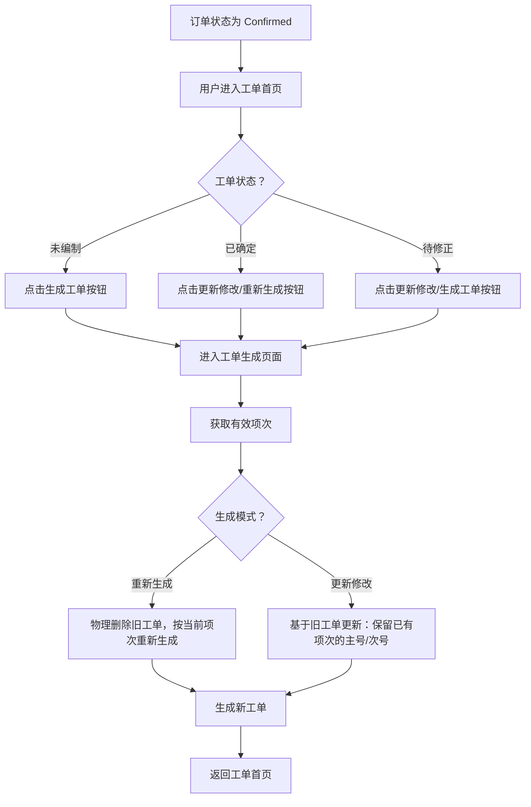
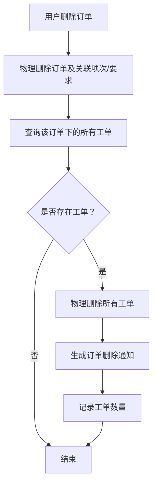
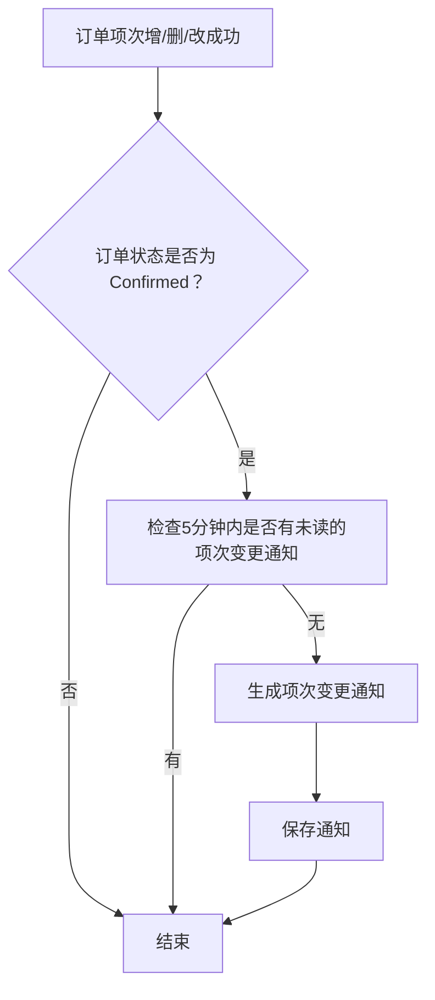
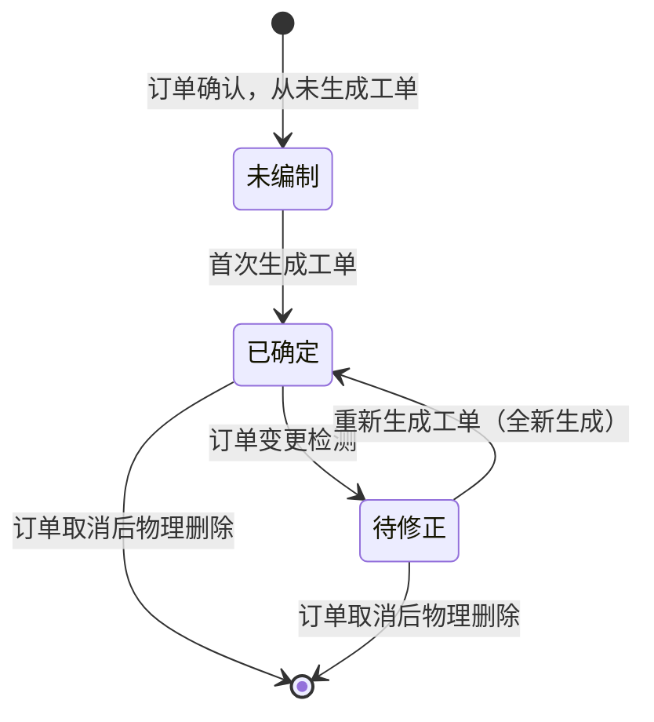
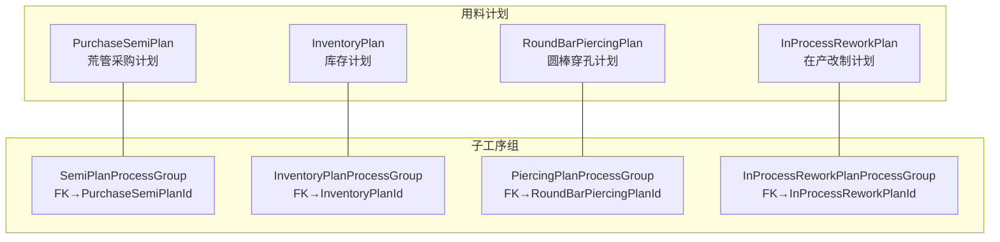

# 工单模块详细设计（V7.4）

**版本**：V7.4
**最后更新**：2026-08-20

---

## 一、概述

本文档定义工单模块的详细设计，包括核心流程、状态流转、业务规则、页面设计、角色权限，以及订单变更通知机制。

工单模块的核心功能：
- 工单生成：订单确认后，用户手动生成工单
  - **首次生成**：未编制状态，创建新工单，生成全新主号/次号
  - **覆盖生成**：已确定状态且订单项次未变更，物理删除旧工单，保留原主号/次号（用户可修改）
  - **待修正生成**：待修正状态（订单项次已变更），物理删除旧工单，按当前项次重新生成全新主号/次号
  - **更新修改**：已确定或待修正状态，在旧工单基础上更新（新增/删除/修改项次），已有项次的主号/次号保持不变，删除的项次从工单中移除，新增的项次主号/次号留空由用户填写。若新增项次的主号匹配已有工单，自动合并到该工单中
- 工单状态监控：检测订单变更，自动标记工单为待修正状态
- 工单管理：查询、取消工单、详情查看（支持同一订单工单间切换）
- 订单已取消-工单待删除：单独区域显示，支持物理删除工单
- 工单项次追溯：订单号文字点击进入追溯页面
- **订单变更通知**：当订单被删除或项次发生变更时，系统自动生成通知，提醒工员工及时处理
- **工单打印**：单个工单卡片式打印（A4，每页1个工单）、批量打印（每页2个工单）、选中/全部打印
- **工单执行状况**：物化读模型展示工单维度的投料/执行汇总，增量触发自动刷新
- ~~**标准工艺生产周期（StandardProcessCycle）**：已移除（V5.0 起删除该实体）~~
- **定尺工单联通视图**：定尺工单（FixedLengthWorkOrder）冗余表随工单生成/编辑/删除自动重建（BuildFixedLengthWorkOrders 按 OrderItem.MaxLength 分组，LengthStatus==Fixed，冗余字段从 WorkOrder 填充无漂移风险），页面 `/fixed-length-work-order-view`「定尺工单定尺数据」，端点 `GET api/fixed-length-work-order/list`（V6.1 新增）
- **在产改制计划**：从可用在产批次中选取进行改制计划（V5.3 新增）
- **在产主工单计划**：从可用在产批次中选取，按主工单分配支数/重量（第7类，V6.2 新增）
- **工单需求调整**：手工标记催单/分批交货/主号暂停，管理排程优先级（V5.5 新增）

---

## 二、核心流程

### 2.1 工单生成流程（手动触发）



> **三种生成模式**：
> - **首次生成**（NotGenerated）：未编制状态，创建新工单，生成全新主号/次号
> - **覆盖生成/重新生成**（Regenerate）：已确定/待修正状态，物理删除旧工单，按当前项次重新生成，保留原主号/次号
> - **更新修改**（Update）：已确定/待修正状态，基于旧工单更新（不删除），已有项次的主号/次号保持不变，删除的项次从工单中移除，新增的项次留空由用户填写

### 2.2 订单变更检测流程（增量触发）

```mermaid
flowchart TD
    A[订单项次CRUD] --> B[检查订单状态是否为 Confirmed]
    B -->|否| C[结束]
    B -->|是| D[逐工单比较 LastItemChangeTime 与 Max(CreatedTime, UpdatedTime)]
    D --> E{该工单是否有变更？}
    E -->|否| F[该工单状态保持已确定]
    E -->|是| G[该工单状态变更为待修正]
    G --> H[记录日志（含工单号）]
```

> **变更检测规则**：
> - 每个工单**独立检测**，仅标记实际有变更的工单为"待修正"，不变更的工单不受影响
> - 使用 `Max(CreatedTime, UpdatedTime)` 作为最近同步时间：若工单被"更新修改"过，`UpdatedTime` 会更新到最新，避免更新修改后的工单再次被标记为"待修正"
> - 检测逻辑详见 `WorkOrderService.CheckAndUpdateWorkOrderStatusInternalAsync`
> - **变更检测不再依赖定时任务**：原 `CheckOrderChangeJob`（每5分钟检测）已删除，改为在订单项次 CRUD 时自动增量触发

### 2.3 订单删除时自动清理工单



### 2.4 订单项次变更时生成通知



### 2.5 订单已取消-工单待删除流程

```mermaid
flowchart TD
    A[订单状态变更为 Cancelled] --> B[定时任务检测]
    B --> C{工单是否存在且未物理删除？}
    C -->|是| D[显示在"订单已取消-工单待删除"区域]
    C -->|否| E[不显示]
    D --> F[用户点击订单号]
    F --> G[确认弹窗]
    G -->|确认| H[物理删除工单]
    H --> I[从区域移除]
    G -->|取消| J[不做操作]
```

---

## 三、状态流转

### 3.1 工单状态定义

| 状态 | 英文 | 值 | 说明 |
|------|------|-----|------|
| 未编制 | NotGenerated | 0 | 订单从未生成过工单 |
| 已确定 | Confirmed | 1 | 工单与订单一致 |
| 待修正 | Pending | 2 | 订单已有工单，但订单变更，需重新生成 |

> **注**：工单为 3 态设计，不含"已取消"状态。工单物理删除后不再保留状态记录。

### 3.2 状态流转图



### 3.3 状态流转规则

| 当前状态 | 允许变更到的状态 | 触发方式 | 权限 |
|----------|------------------|----------|------|
| 未编制 | 已确定 | 生成工单 | WorkOrderEditor/WorkOrderFull/Admin |
| 已确定 | 待修正 | 订单变更检测 | 系统自动 |
| 已确定 | 已取消 | 删除工单 / 订单删除时自动清理 | WorkOrderFull/Admin 或 系统自动 |
| 待修正 | 已确定 | 重新生成工单（全新生成） | WorkOrderEditor/WorkOrderFull/Admin |
| 待修正 | 已取消 | 删除工单 / 订单删除时自动清理 | WorkOrderFull/Admin 或 系统自动 |

---

## 四、业务规则

### 4.1 工单首页显示规则

**主表格：**
- 只显示订单状态为 `Confirmed` 的订单
- 根据工单状态显示不同按钮

| 工单状态 | 显示按钮 | 点击行为 |
|----------|----------|----------|
| 未编制 | [生成工单] | 首次生成（全新主号/次号） |
| 已确定 | [重新生成] | 覆盖生成（保留原主号/次号） |
| 待修正 | [生成工单] | 全新生成（不保留原编号） |

**"订单已取消-工单待删除"区域：**
- 位置：表格上方
- 显示条件：订单状态为 `Cancelled`，且工单存在（未删除）
- 显示内容：订单号、签订日期、业务员、客户名称
- 操作：点击订单号 → 确认弹窗 → 删除工单 → 从区域移除
- 权限：WorkOrderEditor/WorkOrderFull/Admin

### 4.2 主号生成规则

| 物料名称 | 长度状态 | 主号前缀 | 格式 | 示例 |
|----------|----------|----------|------|------|
| 焊管（WeldedPipe） | 任意 | H | H + 2位数字 | H01, H02 |
| 无缝管（SeamlessPipe） | 任意 | X | X + 2位数字 | X01, X02 |

**序号生成规则：**
- 序号范围：01 到 99，按前缀分组独立计数
- 同一前缀序号达到 99 时，提示错误，需要人工介入
- **覆盖生成时**：保留原主号/次号，不生成新序号
- **首次生成/待修正生成时**：生成新序号
- 主号前缀由管型（PipeManufacturingType）决定（`GetMainNoPrefix`：焊管→H，无缝管→X），与长度状态无关

### 4.3 次号规则

| 长度状态 | 次号要求 | 格式 | 示例 |
|----------|----------|------|------|
| 定尺（Fixed） | 必填 | 2位数字（01~99） | 01, 02, 03 |
| 范围尺（Range） | 必填 | F0 | F0 |
| 非定尺（NonFixed） | 必填 | F0 | F0 |

> **次号全模式非空**（`ValidateSubNo`）：定尺必须为两位数字（01~99），范围尺/非定尺必须为 F0。任意模式均不可为空。

### 4.4 合并分组字段

以下字段必须**完全相同**的项次才能合并为一个主号（共15个字段；SalesOrderNo 用于分组，不参与合并键）：

| 字段 | 说明 |
|------|------|
| DeliveryDate | 交货日期 |
| DelayPenalty | 延期罚款 |
| MaterialName | 物料名称 |
| SettlementMethod | 结算方式 |
| StandardCode | 产品标准编码 |
| DeliveryState | 交货状态 |
| PlantGrade | 工厂牌号 |
| Specification | 规格 |
| OuterDiameter | 外径 |
| OuterDiameterNegative | 外径负公差 |
| OuterDiameterPositive | 外径正公差 |
| WallThickness | 壁厚 |
| WallThicknessNegative | 壁厚负公差 |
| WallThicknessPositive | 壁厚正公差 |
| LengthStatus | 长度状态 |

### 4.5 汇总计算规则

**长度合并规则：**

| 字段 | 合并规则 |
|------|----------|
| MinLength | 取合并项次中所有 MinLength 的**最小值** |
| MaxLength | 取合并项次中所有 MaxLength 的**最大值** |

> **定尺模式修正**：之前定尺模式下 MaxLength 被强制设为等于 MinLength（`finalMaxLength = minLength`），导致多个定尺项次合并到一个工单时最大长度丢失。现已修正为直接使用聚合后的 `Max(所有项次的 MaxLength)`，不再覆盖。

**更新修改模式聚合重算规则：**

当使用"更新修改"模式时，无论项次是否有变化，始终重新计算聚合字段（MinLength、MaxLength、TotalQuantity、TotalWeight 等），以修复原始生成时的错误值。之前仅当项次变化时才触发重算，导致原始生成的错误值无法通过更新修改纠正。

**汇总计算规则：**

| 长度状态 | TotalQuantity | TotalMeters | TotalWeight |
|----------|---------------|-------------|-------------|
| Fixed（定尺） | 合并项次的 Quantity 总和 | 合并项次的 Meters 总和 | 合并项次的 TheoreticalWeight 总和 |
| Range（范围尺） | 0 | 0 | 合并项次的 ContractWeight 总和 |
| NonFixed（非定尺） | 0 | 0 | 合并项次的 ContractWeight 总和 |

### 4.6 技术要求规则

| 规则 | 说明 |
|------|------|
| 合并项次中，只要有一个项次的 RequirementType == Special | TechnicalRequirements = 'Special' |
| 所有项次的 RequirementType 都是 Normal | TechnicalRequirements = 'Normal' |

### 4.7 订单变更检测规则

**检测机制：**

工单变更检测依赖订单表的 `LastItemChangeTime` 字段（定义在订单上下文的 SalesOrder 表中）：

- 当订单项次增、删、改时，订单模块会自动更新 `LastItemChangeTime` 为当前时间
- 工单模块逐工单对比此时间与工单的 `Max(CreatedTime, UpdatedTime)`：
  - 若 `LastItemChangeTime > Max(CreatedTime, UpdatedTime)`，则该工单存在变更，状态变更为 **待修正**
  - 否则保持 **已确定**
- **逐工单独立检测**：一个订单下多个工单各自独立判断，仅变更的工单被标记，未变更的工单不受影响

> **PS: 关于 Max(CreatedTime, UpdatedTime)**：使用 `UpdatedTime` 是因为"更新修改"模式下旧工单被更新后 `UpdatedTime` 被 EF Core 自动刷新。若仍用 `CreatedTime`，已被"更新修改"过的工单会再次被标记为"待修正"。

**检测触发方式（V5.4 起）：** 不再依赖定时任务，改为在订单项次 CRUD 时自动增量触发（由 `OrderService.UpdateItemAsync` / `DeleteItemAsync` 在项次变更后自动标记关联工单为 Pending）。原每5分钟的 CheckOrderChangeJob 定时任务已删除。

### 4.8 工单号生成规则

| 格式 | 示例 | 说明 |
|------|------|------|
| {订单号}-{主号}[-{次号}] | PO2026001-X01-01 | 订单号 + 主号，有次号时追加 |

**格式说明：** 工单号 = `{SalesOrderNo}-{ProductionMainNo}[-{ProductionSubNo}]`。主号由管型（PipeManufacturingType）决定前缀（焊管=H、无缝管=X），后接2位序号；次号 2 位全模式非空（定尺 01~99 / 范围尺·非定尺 F0）。

### 4.9 订单删除时自动清理工单

| 项目 | 说明 |
|------|------|
| 触发时机 | 订单被物理删除时 |
| 操作 | 自动物理删除该订单下的所有工单 |
| 通知 | 若有工单被清理，生成一条“订单删除通知”，记录订单号和清理数量 |

### 4.10 订单项次变更时生成通知

| 项目 | 说明 |
|------|------|
| 触发时机 | 项次添加、修改、删除成功后，且订单状态为 `Confirmed` |
| 去重策略 | 同一订单在5分钟内若已有未读的“项次变更”通知，则不重复生成 |
| 通知 | 生成一条“项次变更通知” |

### 4.11 通知展示与清理

| 项目 | 说明 |
|------|------|
| 展示方式 | 统一使用 MudAlert 提醒条：页面加载时查询对应类型未读通知，有通知时显示黄色警告条 +「忽略」按钮 |
| 通知类型 | NewMaterial（新物料待审核）、DeleteBlocked（删除被阻止）、OutboundAlert（出库预警）、WorkOrderDeleted（工单已删除，**已废弃**：不再主动写入，保留仅用于已有数据兼容）、OrderDeleted（订单已删除）、OrderChanged（订单已变更）、WorkOrderChanged（工单内容已变更）、BatchPlanAutoCompleted（批次变更导致关联用料计划自动完成）、InboundMismatchAlert（入库制造状态不一致） |
| WorkOrders页面 | 查询 OrderChanged 类型通知，显示「订单变更提醒」 |
| InboundHistory页面 | 查询 WorkOrderDeleted 类型通知，显示「工单已删除」提醒 |
| 忽略操作 | 点击忽略按钮调用 MarkAllByTypeAsReadAsync，标记该类型所有通知为已读 |
| 数据保留 | 通知保留30天，由定时任务（Hangfire）自动清理过期记录 |
| 权限 | WorkOrderViewer/WorkOrderEditor/WorkOrderFull/ReportViewer/ReportEditor/ReportFull/Admin, WorkOrderEditor/WorkOrderFull/Admin, Admin 可查看和处理通知 |
| 在产计划通知消除 | 批次创建时自动消除关联的在产计划通知（G8/G9），详见下方§4.12 |

### 4.12 在产计划通知消除规则

**G8（在产改制计划执行）和 G9（在产主工单计划执行）** 的通知在批次创建时自动消除。

#### 消除场景

| 场景 | 类型 | 消除方法 | 说明 |
|------|------|---------|------|
| 批次创建（SplitFromNumber） | Type A | `DismissXxxByBatchAndWorkOrderAsync` | **精准消除** — JOIN WorkOrders 表按 WorkOrderNo 过滤，仅消除当前分工单的在产计划 |
| 批次更新/批量保存（工单号从"非工单"变更为真实工单号） | Type B | `DismissXxxPlansByBatchAsync` | **批量消除** — 消除源批次关联的全部待处理计划 |

> **精准消除原理（V6.0 新增）：** Type A 场景下，多个分工单可能共享同一源批次的余量。若使用批量消除，所有分工单的待处理计划会被一并消除，导致未创建批次的分工单丢失通知。精准消除方法 `DismissInMainWorkOrderPlanByBatchAndWorkOrderAsync` 和 `DismissInProcessReworkPlanByBatchAndWorkOrderAsync` 通过 `ProductionBatchId` + `WorkOrderNo` 双重条件匹配，仅消除当前分工单对应的计划记录。

#### 数据匹配范围

所有涉及批次数据的 Group 在计算投料量时，使用 `woBatches`（当前工单自身的批次集合）而非 `batches`（全族批次集合），确保跨工单数据隔离：

| 上下文 | 旧值（错误） | 新值（正确） |
|--------|-------------|-------------|
| 涉及批次数据的 Group（G3-G7、G8）投料量 | `batches`（同主号所有批次） | `woBatches`（当前工单批次） |
| 在产计划通知消除 | 批次创建时自动消除关联的在产计划通知，详见下方§4.12 |

---

## 五、页面设计

### 5.1 工单首页（订单状态监控）

**页面路由：** `/workorders`

**功能说明：** 展示已确认订单及其工单状态，提醒哪些订单需要生成或重新生成工单。订单变更检测在项次 CRUD 时自动增量触发，无需手动操作。

**页面布局（简化描述）：**

- **顶栏提醒条**：订单变更时显示 MudAlert 黄色警告条，提示「订单变更提醒：有N条订单发生变更，关联工单可能需要更新」+「忽略」按钮。
- **顶栏操作按钮**：无手动刷新按钮（订单变更检测在项次 CRUD 时自动增量触发）。
- **第一块：订单已取消-工单待删除区域**

| 订单号 | 签订日期 | 业务员 | 客户名称 | 操作 |
|--------|----------|--------|----------|------|
| D26Z2117005 | 2026-01-08 | 李勇 | 某已取消客户 | [点击订单号删除工单] |

- **第二块：筛选栏**

| 筛选条件 | 说明 |
|----------|------|
| 搜索框 | 模糊搜索订单号/客户名称/业务员 |
| 列头筛选 | 各列支持 ExcelFilter 多选筛选（含工单状态等 14 列枚举筛选 + 1 列布尔筛选），详见 §5.5 筛选规则表 |

- **第三块：工具栏（表格上方）**

| 按钮 | 说明 |
|------|------|
| [打印选中 (N)] | 选中订单批量打印，N为选中数量；无选中时禁用 |
| [打印全部] | 按当前筛选条件打印全部订单 |
| 共N条记录 | 总记录数（右对齐） |

- **第四块：主表格**

| □全选 | 订单号 | 签订日期 | 业务员 | 客户名称 | 最终用户 | 交期起始 | 交期截止 | 延期罚款 | 订单总重量 | 含项次数 | 现工单数 | 工单状态 | 操作 |
|-------|--------|----------|--------|----------|----------|----------|----------|----------|------------|----------|----------|----------|------|
| □ | D26Z2117001（点击跳转追溯） | 2026-01-04 | 李勇 | 青岛畅隆重型 | 最终客户A | 2026-02-01 | 2026-03-15 | 否 | 15000 | 5 | 3 | 待修正 | [生成工单] |

> **现工单数**：使用 `MudChip Color.Primary` 样式（蓝色背景块）显示，与其他文本字段视觉区分。

**聚合字段说明（从订单项次 OrderItem 聚合计算）：**

| 字段 | 计算方式 | 说明 |
|------|----------|------|
| 最终用户 | `OrderItem.EndCustomer`（取首项） | 展示订单首个项次的最终用户 |
| 交期起始 | `MIN(OrderItem.DeliveryDate)` | 所有项次中最早的交货日期 |
| 交期截止 | `MAX(OrderItem.DeliveryDate)` | 所有项次中最晚的交货日期 |
| 延期罚款 | `ANY(OrderItem.DelayPenalty == true)` | 任一项次有罚款则显示"是" |
| 订单总重量 | `SUM(OrderItem.ContractWeight)` | 所有项次合同重量之和取整 |
| 含项次数 | `COUNT(OrderItem.Id)` | 该订单的项次数量 |
| 现工单数 | `COUNT(WorkOrder.Id)` | 该订单已生成的工单数量 |

**排序支持：** 以上7个聚合字段及工单状态均支持点击表头升降序排列。

**状态判断逻辑：**

| 场景 | 工单状态 | 显示按钮 | 生成行为 |
|------|----------|----------|----------|
| 订单已确认，从未生成工单 | 未编制 | [生成工单] | 首次生成（全新主号/次号） |
| 订单已确认，已有工单，且工单与订单一致 | 已确定 | [重新生成] | 覆盖生成（保留原主号/次号） |
| 订单已确认，已有工单，但订单发生变更 | 待修正 | [生成工单] | 全新生成（不保留原编号） |

**通知展示方式（MudAlert 提醒条）：** 详见 4.11 通知展示与清理。

### 5.2 工单生成页面

**页面路由：** `/workorders/generate?salesOrderNo={orderNo}&status={status}&regenerate={true/false}`

**功能说明：** 展示订单项次列表，用户填写主号和次号后生成工单。

**页面布局（覆盖生成模式示例）：**

| 项次 | 物料名称 | 交货日期 | 交货状态 | 工厂牌号 | 规格 | 长度状态 | 最小长度 | 最大长度 | 支数 | 米数 | 合同重量 | 主号 | 次号 |
|------|----------|----------|----------|----------|------|----------|----------|----------|------|------|----------|------|------|
| 1 | 无缝管 | 2026-01-30 | 固溶酸洗 | 32100 | 19*2.5 | 定尺 | 11036 | 11692 | 11 | 1723 | 1942 | X01 | 01 |
| 2 | 无缝管 | 2026-01-30 | 固溶酸洗 | 32100 | 19*2.5 | 定尺 | 11036 | 11272 | 43 | 1723 | 1942 | X01 | 01 |
| 3 | 无缝管 | 2026-01-30 | 固溶酸洗 | 32100 | 19*2.5 | 定尺 | 11036 | 12984 | 27 | 1723 | 1942 | X01 | 02 |
| 4 | 无缝管 | 2026-01-30 | 固溶酸洗 | 32100 | 19*2.5 | 定尺 | 11036 | 12292 | 30 | 1723 | 1942 | X01 | 02 |
| 5 | 无缝管 | 2026-01-30 | 固溶酸洗 | 32100 | 19*2.5 | 非定尺 | (空) | (空) | 50 | 1723 | 1942 | X01 | F0 |

**字段说明：**

| 字段 | 可编辑 | 说明 |
|------|--------|------|
| 主号 | 是 | 覆盖生成时预填原主号，用户可修改；首次生成/待修正生成时系统自动生成建议主号 |
| 次号 | 是 | 2 位全模式非空（定尺=01~99；范围尺/非定尺=F0）；覆盖生成时预填原次号 |
| 其他字段 | 否 | 从订单项次读取，只读显示 |

**提交验证（前端）：**
- 验证同一主号下的项次是否满足合并规则（15个字段必须相同）
- 验证 StandardGrade（标准牌号）字段在合并项次中必须完全一致
- 验证次号不为空，且格式与长度状态匹配：定尺=两位数字（01~99）；范围尺/非定尺=F0
- 验证主号前缀与管型匹配（焊管=H、无缝管=X，正则 `^[HX]\d{2}$`）

### 5.3 工单详情页

**页面路由：** `/workorders/{Id:int}`

**功能说明：** 展示工单详细信息，支持同一订单工单间切换。

**页面内容：**

- **顶部导航**：上一个/下一个按钮、返回按钮（"工单首页"）
- **工单信息**：当前第X个/共N个工单提示
- **工单信息卡片**（紧凑布局，27字段，3组）：
  - 表头标签：body2字号、深色(#37474F)、加粗
  - 卡片背景：#fafafa
  - **第1组-基本信息（12字段）**：工单号、源订单号、主号、次号、签订日期、业务员、最终用户、交货日期、延期罚款、物料名称、结算方式、标准编码
  - **第2组-工艺参数与汇总（13字段）**：交货状态、工厂牌号、规格、外径公差、壁厚公差、长度状态、最小长度、最大长度、总支数、总米数、总重量、理论单支重、技术要求
  - **第3组-项次与明细（2字段）**：总项次数、明细
- **汇总信息**：总支数、总米数、总重量、总项次数
- **明细列表**：项次号、长度、支数
- **技术要求**：特殊/常规标识

**导航功能：**
- 上一个/下一个按钮：在同一订单的所有工单间切换
- 显示当前工单序号和总数
- 边界处理：第一个工单禁用上一个按钮，最后一个工单禁用下一个按钮

**页面操作：**
- **[打印]** 按钮：调用 `POST /api/workorder/{id}/print-file`，生成 A4 卡片样式 PDF（QuestPDF），前端 `openPdfFromApi()` fetch 二进制流后以 Blob URL + iframe 覆盖层展示
- "用料计划"菜单和"用料计划总览"链接**已移除**

### 5.4 工单项次追溯页面

**页面路由：** `/workorders/relation?salesOrderNo={orderNo}`

**功能说明：** 展示订单下所有工单及其项次详细信息。

**页面内容：**

- **顶部信息**：订单号、客户名称、业务员等
- **工单卡片列表**：每个工单一个卡片，包含：
  - 工单号（可点击跳转到工单详情页）
  - 主号、次号、状态
  - 工单基本信息：物料名称、工厂牌号、规格、交货日期、交货状态、长度状态、总支数、总重量
  - 包含的原始订单项次表格：项次号、标准牌号、规格、长度状态、最小长度、最大长度、支数、米数、合同重量、理算重量

**入口：** 工单首页的订单号文字链接（点击可直接跳转）。

### 5.5 工单执行状况页面

**页面路由：** `/workorder-execution`

**页面文件：** `MES.Blazor/Pages/WorkOrders/WorkOrderExecution.razor`

**导航位置：** 工单管理 → 工单执行状况（与工单首页、用料计划总览、工单需求调整同菜单）

**功能说明：** 以工单维度展示执行状况汇总数据，列分组 18 组（基础数据/工单需求调整/实时关注/用料计划及执行实况/圆棒穿孔/荒管采购/成品采购/库存使用/库料改制/在产改制/在产主工单/原始投料/实际生产总流转/原始投料有效流转/返整执行/次品总量/成品入库/在产节点待量）。数据通过物化读模型 `WorkOrderExecutionSummary` 存储，8 个数据源 CRUD 时自动增量触发刷新（无需手动操作）。

**页面布局：**

- **顶部工具栏**：列显示切换 + 重置按钮；右侧打印选中（复选框选择行后启用）、打印全部按钮、最后更新时间显示（数据变更后自动增量更新）
- **筛选栏**：模糊搜索框（工单号/订单号/业务员/客户/牌号/规格/主号），Debounce 500ms；订单日期起止范围搜索
- **复选框选择列**：第一列 40px 复选框，支持全选/取消全选（`SelectAllItems`），用于"打印选中"操作
- **主表格**（MudTable 服务端分页，列分组展示）：

**列分组（18组）：**

**基础数据（22列）：** 工单号、业务员、往来单位、最终客户、订单日期、交货日期、延期罚款、结算方式、订单号、主号、次号、钢管制造、交货状态、工厂牌号、规格、长度状态、最小长度、最大长度、含项次数、总支数、总米数、总重量

**工单需求调整（5列）：** 催单、分批交货、暂停、强制完成、调整备注

**实时关注（7列，主号级）：** 主号-关注（五档：0=主号暂停/1=主号完成/2=原料锁定/3=生产执行/4=成品检验）、主号-计划性（A+急/A急/B顺/C缓/D缓，存储英文 Key）、主号-预计完成日、主号-交期相差天数、主号-剩余总工量(天)、主号-产能工量(天)、主号-原锁备注（仅原料锁定有值：A质量补料/B执行返整/C执行计划/D完善计划）

**用料计划及执行实况（14列）：** 主号-用料计划（五档：0=无计划/1=未执行/2=部分/3=已完成/4=异常）、主号-计划满足率(%)、主号-计划执行状态（主号级，G4~G10 执行状态取最差）、主号-实投状态、工单用料计划（四档：0=未计划/1=部分/2=满足/3=超量）、料态种数（4种料态中有做计划的种数0-4）、用料占比（如"穿105% 荒160% 成20% 库40%"）、理论截止投料日、计划投料总重、截止到料日、现可投料总重、理论缺失总料重、实际已投料量、到料实投一致性（七态：0一致/1待投/2疑问-到料少投/3疑问-到料超投/4错误-无料已投/5错误-无需投料/6略）

**圆棒穿孔（6列）：** 穿孔计划量(kg)、穿孔委外量(kg)、穿孔委外状态、穿孔回收量(kg)、穿孔待回收(kg)、穿孔回收状态

**荒管采购（6列）：** 荒管计划量(kg)、荒管采购量(kg)、荒管采购状态、荒管到货量(kg)、荒管待货(kg)、荒管到货状态

**成品采购（6列）：** 成品计划量(kg)、成品采购量(kg)、成品采购状态、成品到货量(kg)、成品待货(kg)、成品到货状态

**库存使用（3列）：** 库存计划量(kg)、库存出库量(kg)、库存出库状态

**库料改制（3列）：** 改制计划量(kg)、改制投料量(kg)、改制投料状态

**在产改制（3列）：** 产改计划量(kg)、产改投料量(kg)、产改投料状态

**在产主工单（3列）：** 主工单计划量(kg)、主工单投料量(kg)、主工单投料状态

**原始投料（11列，所有关联批次）：** 主号-投料状态（0=未投料/1=部分/2=满足）、主号-投料比(%)、工单投料状态、工单投料比(%)、投料起始日、投料截止日、批次数、总支数、总重量、理论成品支、理论成品重

**实际生产总流转（7列，G13~G15 汇整）：** 主号-流转状态（0=未计划/1=部分/2=满足）、主号-流转比(%)、工单流转状态（0=未投料/1=部分/2=满足）、工单流转比(%)、总批次数（制造物品=订单成品的所有批次计数）、未完成批数（执行状态≠完成的计数）、最大剩余工量(天)（关联批次中最大 RemainingWorkDays）

> **批次作用域原则（V6.0）：** 所有涉及批次数据的 Group，在计算时使用 **当前工单自身的批次集合**（`woBatches`），而非同主号下所有兄弟工单的批次集合（`batches`）。曾因错误使用全族批次集合导致 A 工单误包含 B 工单创建的 SplitFromNumber 批次的投料量，已修复。

**原始投料有效流转（5列，排除作废批次）：** 有效批次数、有效流转总支数、有效流转总重量、流转成品支数、流转成品重量

**返整执行（12列，ProductionType=返整 且 ManufacturingItem=OrderFinished）：** 主号-返整后状态（主号级三档：0=未投料/1=部分/2=满足，在有效流转基础上加待返整后按主号总需求判定，定尺按支/非定尺按重，阈值=SupplySatisfiedRate）、是否必返整（是/否，主号级：附返整主号状态=满足 且 有效主号状态≠满足 时为"是"，其余一律"否"含无返整数据）、待返整成支（=理论返整可产成支−返整理论成品支，无返整为空，负值归0）、待返整成重（=理论返整可产成重−返整理论成品重，无返整为空，负值归0）、理论返整可产成支（Σ每条返整记录重量÷该记录原批次单支重）、理论返整可产成重（=过程检返整量×0.92+成品检返整量×0.96，无返整量为空）、返整投料截止日、返整批次数、返整投料支数、返整投料重量、返整理论成品支、返整理论成品重

> **附返整主号状态与是否必返整口径（V7.2）：** 附返整主号状态 = 有效流转基础上加「待返整」——等价于 Σ(合格流转 ValidOutput + 理论返整可产成 ReworkTheoreticalProduce − 成检次品 FinalInspectionDefect)/主号总需求×100（因 返整理论成品 + 待返整 = 理论返整可产成），定尺按支数、非定尺按重量，负值归零；≤0→未投料(0)、≥SupplySatisfiedRate→满足(2)、否则→部分(1)，与有效主号状态三档一致。是否必返整（ReworkInputConsistency）由主号级聚合统一赋值："附返整主号状态=满足(2) 且 有效主号状态(MainNoFlowStatus)≠满足(2)" 时为"是"，其余一律"否"。

**次品总量（9列，过程检/成检次品聚合，仅订单成品批次）：** 过程检次品总重、过程检返整量、过程检入库重、过程检报废重、成检次品总支、成检次品总重、成品检返整量、成检入库重、成检报废重

**成品入库（7列，从 InventoryBatch 聚合）：** 订单-入库状态（从主号状态上卷）、主号-入库状态（按「主号聚合入库量 vs 主号总需求」判定四档：0=无入库/1=部分/2=完结/3=超额）、工单入库状态（0=无入库/1=入库部分/2=入库完结/3=入库超额）、入库起始日、入库截止日、入库总支数、入库总重量

> **入库状态口径（V6.8）：** 工单级（WoWarehousingStatus）独立判定不聚合：定尺按支数（=需求→完结、>需求→超额）、非定尺按重量容差（≥需求×0.95 且 ≥需求−100→完结、>需求×1.05→超额）。主号级（MainNoWarehousingStatus）按主号聚合入库量 vs 主号总需求直接比较：定尺按支数（=需求→完结、>需求→超额）、非定尺按重量容差（同工单级容差，>需求→超额）。订单级（OrderWarehousingStatus）从主号状态上卷：全0→无入库、全达成(2/3)→入库完结、否则→入库部分。

**在产节点待量（13列）：** 主号-关注工序、荒管处理待量(kg)、在制修检待量(kg)、60冷轧待量(kg)、50冷轧待量(kg)、30冷轧待量(kg)、20冷轧待量(kg)、三辊冷轧待量(kg)、冷拔待量(kg)、变形工序完成、生产关注工序、生产流转性、最大剩余工量(天)

> 注：工艺周期(ProcessCycle)同主号均无计划时默认22天（不含缓冲），剩余总工量在原料锁定阶段 = 主号最大 ProcessCycle + 3天缓冲，缓冲由 TotalRemainingWorkDays 公式中的 bufferDays 统一加算。

> **主号关注判定逻辑（五档，优先级从高到低，全部主号级）**：IsPaused=true→0主号暂停；强制完成 IsForceCompleted=true→1主号完成；主号入库 MainNoWarehousingStatus≥2→1主号完成；有效主号状态 MainNoFlowStatus 为 0 或 1→2原料锁定；主号下任一工单有活动批次（未产/在产/暂停）→3生产执行；其余→4成品检验。批次暂停(BatchStatus.Suspended)归入生产执行，与在产同等对待；**仅"主号暂停"，不允许"工单暂停"**——工单需求调整 SaveUrgingAsync 联动连带，同主号下未入库完结工单的 IsPaused 一并写入（已闭环工单不被牵连）；**强制完成与暂停互斥，同为主号级联动**：勾选任一工单强制完成，SaveUrgingAsync 将同主号下未入库完结工单的 IsForceCompleted 一并写入（强制完成优先级 > 档3/4，业务完结后不再评估生产执行）
>
> **剩余总工量判定逻辑**：主号完成→空；主号暂停→主号最大剩余工量（停滞展示，恢复后继续）；原料锁定→关联主号最大 ProcessCycle + 3；生产执行→关联主号最大 FlowMaxRemainingWorkDays；成品检验→3
>
> **产能工量(天)**（2026-08-20 统一公式，WorkOrderExecutionSummary 与 WorkOrderListSummary 两表同口径）：`Ceiling((主号总重量 − 成品采购FinishPlanWeight − 库存使用InventoryPlanWeight − 已完成批次有效产出completedOutput) / 1000 / 规格日产预估(吨/天))`，剩余 ≤ 0 → 0，**主号完成 → null**（显示「-」）。completedOutput = 已完成批次（Status=Completed 且 ProductionType≠"Rework" 且 ManufacturingItem∈{OrderFinished, SpecialDeliveryStatus}）有效产出 `Σ(批次有效原料重CurrentValidWeight × (1 − 有效工序组数 × 2.5%))`，**排除外购/库存批次**（外购重量已由成品采购计划扣减、库存已由库存使用计划扣减，防双重扣减导致负值低估）。
>
> **用料计划总览中的产能工量**（2026-08-20 起与执行层面统一）：`Ceiling((主号总重量 − 成品采购 − 库存使用 − completedOutput) / 1000 / 规格日产预估)`，档1主号完成→null；原"计划层面仅扣除成品采购"旧口径已废弃。
>
> **主号计划性判定逻辑**：`差值 = 剩余总工量 + 今天天数(DayNumber) - G1交货日期天数(DayNumber)`，差值>67→A+急、>60→A急、>53→B顺、>45→C缓、其余→D缓；存储英文 Key（UrgencyLevelKeys），主号完成/已停时为 null
>
> **工艺预计完成日**：`今天 + TotalRemainingWorkDays`
>
> **交期相差天数**：`工艺预计完成日 - G1交货日期`
>
> ScheduleStage=1（主号完成）时，剩余总工量/产能工量/主号计划性/工艺预计完成日/交期相差天数均为空；主号暂停(0)剩余工量停滞展示不置空
>
**排序规则：**

所有 ~98 个列均支持点击表头升降序排列，后端通过 `WorkOrderExecutionService.ApplySorting()` switch 表达式（~70+ 分支）直接映射到实体属性。包括：

| 类别 | 分支数 | 示例 |
|------|--------|------|
| 字符串/数值/日期 | 基础 | WorkOrderNo, Specification, SignDate, TotalWeight 等 |
| 状态列（int 存储） | 14 | MaterialPlanStatus, InputStatus, FlowStatus, WoWarehousingStatus, MainNoWarehousingStatus, OrderWarehousingStatus, ScheduleStage, MainNoMaterialPlanStatus, MainNoInputStatus, MainNoFlowStatus, ProcessCycle, FlowMaxRemainingWorkDays, TotalRemainingWorkDays, DaysDiffFromDelivery |
| 字符串状态列 | 2 | UrgencyLevel, RawMaterialLockRemark |
| 排序兜底 | 1 | 属性名无效时按 CreatedTime 降序 |

**筛选规则：**

| 筛选类型 | 列数 | 实现方式 |
|----------|------|----------|
| 模糊搜索（Keyword） | 12 个 string 字段 | ServerData 层 OR 链匹配工单号/订单号/业务员/客户/牌号/规格/主号等 |
| 状态列/枚举筛选（FilterType="enum"） | 14 | ExcelFilter 多选下拉，选项带中文标签（含10列int状态+4列string枚举：结算方式/物料名称/交货状态/长度状态），后端 `BuildIn()` 按值匹配 |
| 布尔筛选 | 1 | 延期罚款：是/否 |
| 日期列 | 10 | 不作为筛选条件（ExcelFilter 组件不支持日期范围筛选），不含 FilterType

**API：**

| 方法 | 路由 | 说明 |
|------|------|------|
| GET | /api/workorder-execution/list | 分页查询（支持关键词搜索+排序） |
| POST | /api/workorder-execution/refresh-all | 全量刷新所有工单的执行状况汇总（数据修复用，前端无手动按钮，由增量触发自动刷新） |
| **POST** | **/api/workorder-execution/print-file** | **打印选中行 PDF（前端解析显示文本，后端 `TablePrintHelper` 直接排版输出）** |
| **POST** | **/api/workorder-execution/print-all-file** | **打印全部 PDF（按筛选条件，后端查库解析枚举→中文后生成，Mode B ⓫）** |

**授权：** WorkOrderViewer/WorkOrderEditor/WorkOrderFull/ReportViewer/ReportEditor/ReportFull/Admin

**数据来源：** 物化表 `WorkOrderExecutionSummary`（只读），8个数据源 CRUD 时通过 await 增量触发刷新。一个工单一条记录。

`MES.Services.PlanRateCalculator` 是 `internal static` 共享工具类，供 `WorkOrderExecutionService` 和 `WorkOrderService` 共用。

算法：
- 7 种计划类型分别计算满足率：原料采购（`PurchaseSemiPlan`）、成品采购（`PurchaseFinishedPlan`）、库存使用-常规（`InventoryPlan.ReworkType==null`）、库存使用-改制（`InventoryPlan.ReworkType!=null`）、圆棒穿孔（`RoundBarPiercingPlan`）、在产改制（`InProcessReworkPlan`）、在产主工单（`InMainWorkOrderPlan`）
- **定尺（LengthStatus=Fixed）**：满足率 = `SUM(有效原料支数) / TotalQuantity × 100`。原料/穿孔的有效支数 = `RequiredPieces × InputMultiple`；成品采购的有效支数 = `RequiredPiece`；库存的有效支数 = `UsedQuantity × InputMultiple`
- **非定尺**：满足率 = `SUM(计划重量) / TotalWeight × 100`
- **总满足率** = `MIN(Sigma(各类满足率), 999)`
- **状态阈值（Fixed）**：≤0=未计划、<100=部分、≤110=满足、>110=超量
- **状态阈值（非Fixed）**：≤0=未计划、<100=部分、≤120=满足、>120=超量
- 库存计划排除 `PlanStatus==Cancelled`（同 `MaterialPlanService` 逻辑）
- 主号级用料计划率取工单满足率的 **加权平均**：定尺按 `TotalQuantity`、非定尺按 `TotalWeight` 加权

### 5.8 工单需求调整页面（/workorders-demand-adjustment）

**页面路由：** `/workorders-demand-adjustment`

**页面文件：** `MES.Blazor/Pages/WorkOrders/OrderDemandAdjustment.razor`

**导航位置：** 工单管理 → 工单需求调整（工单首页与用料计划总览之后、工单执行状况之前）

**功能说明：** 展示工单的 G1（基础数据）+ G12（实时关注）+ G7（有效流转）汇总数据，并支持手工标记催单/分批交货/主号暂停等调整标记，用于管理排程优先级。数据源为 `WorkOrderExecutionSummary` 读模型 LEFT JOIN `OrderDemandAdjustment` 手工字段表。

**页面布局：**

- **顶栏**：标题"工单需求调整" + 记录总数（右对齐）
- **筛选栏**：
  - 模糊搜索框（工单号/订单号/业务员/客户/牌号/规格/主号，Debounce 500ms）
  - 订单日期从/至（Placeholder="yyyy-MM-dd"，Clearable）
- **工具栏**：列显隐选择 + 重置按钮 | 打印选中(@选中数)/打印全部 | 共N条记录
- **表格**（MudTable 服务端分页 + ExcelFilter + B23 分组列标题栏）：

**列分组（3组）：**

**Group 1 - 工单基础数据（15列）：** 工单号、业务员、客户名称、签订日期、交货日期、延期罚款、结算方式、订单号、主号、次号、物料名称、交货状态、工厂牌号、规格、长度状态

**Group 2 - 计划执行（11列）：** 最小长度、最大长度、含项次数、总支数、总米数、总重量、流转成品比(%)、有效流转状态、有效主号流转比(%)、有效主号状态、总批次数/未完成批数/最大剩余工量（3列合并）

**Group 3 - 实时关注 + 手工调整（12列）：** 主号关注、剩余总工量(天)、产能工量(天)、主号计划性、工艺预计完成日、交期相差天数、催单(MudCheckBox)、分批交货(MudCheckBox)、主号暂停(MudCheckBox)、强制完成(MudCheckBox)、原锁备注、调整备注(MudTextField)

> **内联编辑**：Group 3 中的 催单/分批交货/主号暂停/强制完成 使用 MudCheckBox 内联编辑，调整备注使用 MudTextField 内联编辑。修改后自动调用 `SaveUrgingAsync` 保存（防抖 500ms）。**联动连带**：仅"主号暂停"，不允许"工单暂停"——勾选/取消任一工单的暂停，`SaveUrgingAsync` 自动将同主号（订单号+主号）下未入库完结（WoWarehousingStatus≠2）的其他工单 IsPaused 一并写入，已闭环工单不受牵连；**强制完成同为主号级联动**，与暂停互斥，勾选后该主号 ScheduleStage 归主号完成(1)。

**授权：** WorkOrderViewer/WorkOrderEditor/WorkOrderFull/ReportViewer/ReportEditor/ReportFull/Admin

**API 端点：**

| 方法 | 路由 | 说明 |
|------|------|------|
| GET | `api/workorder-demand-adjustment/list` | 分页查询 |
| POST | `api/workorder-demand-adjustment/save` | 保存手工调整字段（upsert，请求体 SaveUrgingRequest） |
| GET | `api/workorder-demand-adjustment/filter-contexts` | 筛选上下文 |
| POST | `api/workorder-demand-adjustment/print-file` | 打印选中行（Mode B ⓪，前端解析枚举→中文） |
| POST | `api/workorder-demand-adjustment/print-all-file` | 打印全部（Mode B ⓫，后端查库解析枚举） |

---

### 5.9 用料计划总览页

**页面路由：** `/material-plan-overview`

**页面文件：** `MES.Blazor/Pages/WorkOrders/MaterialPlanOverview.razor`

**功能说明：** 以主号维度展示各工单的用料计划汇总视图，涵盖固定单/非固定单/圆棒穿孔/库存 4 种计划类型的满足状态、工艺周期、截止日期等。

### 5.10 工单用料计划页

**页面路由：** `/workorders/{WorkOrderId:int}/material-plan`

**页面文件：** `MES.Blazor/Pages/WorkOrders/WorkOrderMaterialPlan.razor`

**功能说明：** 展示指定工单的用料计划列表（固定单/非固定单/圆棒穿孔/库存），支持查看/编辑/删除计划项。

**子页面：**
- 新建用料计划：`/workorders/{WorkOrderId:int}/material-plan/create`
- 编辑用料计划：`/workorders/{WorkOrderId:int}/material-plan/edit/{PlanId:int}`

### 5.12 工单完工计划页

**页面路由：** `/workorders/{WorkOrderId:int}/finish-plan/create`（新建）/ `/workorders/{WorkOrderId:int}/finish-plan/edit/{PlanId:int}`（编辑）

**功能说明：** 管理工单完工计划的新建与编辑。

### 5.13 工单返工计划页

**页面路由：** `/workorders/{WorkOrderId:int}/rework-plan/create`（新建）/ `/workorders/{WorkOrderId:int}/rework-plan/edit/{PlanId:int}`（编辑）

**功能说明：** 管理工单返工计划的新建与编辑。

### 5.14 工单改制返工计划页

**页面路由：** `/workorders/{WorkOrderId:int}/in-process-rework-plan/create`（新建）/ `/workorders/{WorkOrderId:int}/in-process-rework-plan/edit/{PlanId:int}`（编辑）

**功能说明：** 管理工单改制返工计划的新建与编辑。

### 5.15 工单圆棒穿孔计划页

**页面路由：** `/workorders/{WorkOrderId:int}/piercing-plan/create`（新建）/ `/workorders/{WorkOrderId:int}/piercing-plan/edit/{Id:int}`（编辑）

**功能说明：** 管理工单圆棒穿孔计划的新建与编辑。

### 5.16 工单库存计划页

**页面路由：** `/workorders/{WorkOrderId:int}/inventory-plan/create`（新建）/ `/workorders/{WorkOrderId:int}/inventory-plan/edit/{PlanId:int}`（编辑）

**功能说明：** 管理工单库存计划的新建与编辑。

---

### 5.17 API 控制器清单

工单上下文共 7 个 API 控制器，完整清单如下：

#### 5.7.1 工单 API

| Controller | 路由前缀 | 文件 |
|-----------|---------|------|
| WorkOrderController | `api/workorder` | `MES.Api/Controllers/WorkOrder/WorkOrderController.cs` |

> ⚠️ **跨上下文标注**：以下带 `(→订单)` 标记的端点，逻辑上属于"工单视角读取订单数据"或"检测订单变更后联动更新工单"，**数据所有权在订单上下文**，工单上下文只有读取/检测权限，不拥有订单数据。

| 方法 | 路由 | 说明 |
|------|------|------|
| GET | `api/workorder/list` | 分页查询工单列表 |
| GET | `api/workorder/list-all` | 获取全部工单列表 |
| GET | `api/workorder/{id}` | 获取工单详情 |
| GET | `api/workorder/by-workorder-no/{workOrderNo}` | 按工单号查询 |
| GET | `api/workorder/by-order/{salesOrderNo}` | 按销售订单号查询 (→订单) |
| GET | `api/workorder/order-status` | 分页查询订单工单状态 (→订单) |
| GET | `api/workorder/order-status-all` | 获取所有订单状态列表 (→订单) |
| GET | `api/workorder/pending-orders` | 待生成工单订单列表（已确认且无工单） (→订单) |
| GET | `api/workorder/items-for-generation` | 查询可生成工单的订单项 (→订单) |
| GET | `api/workorder/order-relation/{salesOrderNo}` | 查询工单-订单关系 (→订单) |
| POST | `api/workorder/generate` | 生成工单 |
| POST | `api/workorder/check-all-order-change` | 检测全部订单变更 (→订单) |
| PUT | `api/workorder/{id}/status` | 更新工单状态 |
| DELETE | `api/workorder/{id}` | 删除工单 |
| POST | `api/workorder/{id}/soft-delete` | 软删除工单 |
| POST | `api/workorder/{id}/print-file` | 打印单个工单（直接返回 PDF 文件） |
| POST | `api/workorder/order-print-file` | 按订单打印工单（直接返回 PDF 文件） |
| POST | `api/workorder/order-print-batch-file` | 批量打印工单（直接返回 PDF 文件） |
| POST | `api/workorder/order-print-all-file` | 按条件打印全部工单（直接返回 PDF 文件） |
| POST | `api/workorder/refresh-material-plan-readmodel` | 刷新用料计划读模型 |
| GET | `api/workorder/filter-contexts` | 筛选上下文 |

#### 5.7.2 工单执行状况 API

| Controller | 路由前缀 | 文件 |
|-----------|---------|------|
| WorkOrderExecutionController | `api/workorder-execution` | `MES.Api/Controllers/WorkOrder/WorkOrderExecutionController.cs` |

| 方法 | 路由 | 说明 |
|------|------|------|
| GET | `api/workorder-execution/list` | 分页查询工单执行状况（只读） |
| POST | `api/workorder-execution/refresh-all` | 全量刷新执行状况汇总（保留用于数据修复/初始化） |
| GET | `api/workorder-execution/filter-contexts` | 筛选上下文 |
| **POST** | **`api/workorder-execution/print-file`** | **打印选中行 PDF（前端解析显示文本，后端直接排版输出）** |
| **POST** | **`api/workorder-execution/print-all-file`** | **打印全部 PDF（按筛选条件，后端查库解析枚举→中文后生成）** |

#### 5.7.3 用料计划 API

| Controller | 路由前缀 | 文件 |
|-----------|---------|------|
| MaterialPlanController | `api/material-plan` | `MES.Api/Controllers/WorkOrder/MaterialPlanController.cs` |

> ⚠️ **跨上下文标注**：`(→订单)` 表示读取订单/工单关联数据；`(→仓库)` 表示查询可用库存批次数据，数据所有权在仓库上下文。

| 方法 | 路由 | 说明 |
|------|------|------|
| GET | `api/material-plan/semi/{workOrderId}` | 查询原料采购计划列表 |
| GET | `api/material-plan/semi/detail/{id}` | 查询原料采购计划详情 |
| POST | `api/material-plan/semi` | 创建原料采购计划 |
| DELETE | `api/material-plan/semi/{id}` | 删除原料采购计划 |
| GET | `api/material-plan/finished/{workOrderId}` | 查询成品采购计划列表 |
| GET | `api/material-plan/finished/detail/{id}` | 查询成品采购计划详情 |
| POST | `api/material-plan/finished` | 创建成品采购计划 |
| POST | `api/material-plan/finished/batch` | 批量创建成品采购计划 |
| DELETE | `api/material-plan/finished/{id}` | 删除成品采购计划 |
| GET | `api/material-plan/inventory/{workOrderId}` | 查询库存使用计划列表 |
| GET | `api/material-plan/rework/{workOrderId}` | 查询返工计划列表 |
| GET | `api/material-plan/inventory/available/{workOrderId}` | 查询可用库存批次 (→仓库) |
| GET | `api/material-plan/rework-inventory/{workOrderId}` | 查询可用返工库存 (→仓库) |
| POST | `api/material-plan/inventory` | 创建库存使用计划 |
| POST | `api/material-plan/inventory/batch` | 批量创建库存使用计划 |
| DELETE | `api/material-plan/inventory/{id}` | 删除库存使用计划 |
| GET | `api/material-plan/piercing/{workOrderId}` | 查询圆棒穿孔计划列表 |
| GET | `api/material-plan/piercing/detail/{id}` | 查询圆棒穿孔计划详情 |
| POST | `api/material-plan/piercing` | 创建圆棒穿孔计划 |
| PUT | `api/material-plan/piercing/{id}` | 更新圆棒穿孔计划 |
| DELETE | `api/material-plan/piercing/{id}` | 删除圆棒穿孔计划 |
| POST | `api/material-plan/calculate` | 用料测算 |
| GET | `api/material-plan/summary/{workOrderId}` | 工单用料计划总览 |
| POST | `api/material-plan/refresh-status/{workOrderId}` | 刷新计划状态 |
| POST | `api/material-plan/print/semi/{id}/file` | 打印原料采购计划（直接返回 PDF 文件） |
| POST | `api/material-plan/print/finished/{id}/file` | 打印成品采购计划（直接返回 PDF 文件） |
| POST | `api/material-plan/print/inventory/{id}/file` | 打印库存使用计划（直接返回 PDF 文件） |
| POST | `api/material-plan/print/rework/{id}/file` | 打印返工计划（直接返回 PDF 文件） |
| POST | `api/material-plan/print/piercing/{id}/file` | 打印圆棒穿孔计划（直接返回 PDF 文件） |
| POST | `api/material-plan/print/batch` | 批量打印用料计划 |
| **GET** | **`api/material-plan/in-process-rework/{workOrderId}`** | **查询在产改制计划列表** |
| **POST** | **`api/material-plan/in-process-rework`** | **创建在产改制计划** |
| **PUT** | **`api/material-plan/in-process-rework/{id}`** | **更新在产改制计划** |
| **DELETE** | **`api/material-plan/in-process-rework/{id}`** | **删除在产改制计划** |
| **POST** | **`api/material-plan/print/in-process-rework/{id}/file`** | **打印在产改制计划（直接返回 PDF 文件）** |

#### 5.7.4 通知 API

| Controller | 路由前缀 | 文件 |
|-----------|---------|------|
| NotificationController | `api/notification` | `MES.Api/Controllers/WorkOrder/NotificationController.cs` |

| 方法 | 路由 | 说明 |
|------|------|------|
| GET | `api/notification/unread-count` | 获取未读通知数量 |
| GET | `api/notification/list` | 分页获取通知列表 |
| POST | `api/notification/{id}/read` | 标记单条已读 |
| POST | `api/notification/read-all` | 标记全部已读 |
| GET | `api/notification/by-type/{type}` | 获取指定类型通知 |
| POST | `api/notification/mark-type/{type}/read` | 标记指定类型全部已读 |

#### 5.7.6 用料计划工序组 API

| Controller | 路由前缀 | 文件 |
|-----------|---------|------|
| MaterialPlanProcessGroupController | `api/material-plan/{planType}/process-groups` | `MES.Api/Controllers/WorkOrder/MaterialPlanProcessGroupController.cs` |

| 方法 | 路由 | 说明 |
|------|------|------|
| GET | `api/material-plan/{planType}/process-groups/{planId}` | 获取某用料计划的工序组列表 |
| POST | `api/material-plan/{planType}/process-groups/{planId}` | 保存某用料计划的工序组列表 |

> **planType 映射**：1=荒管采购(PurchaseSemiPlan)，3=库存使用/改制(InventoryPlan)，4=圆棒穿孔(RoundBarPiercingPlan)，**6=在产改制(InProcessReworkPlan)**，**7=在产主工单(InMainWorkOrderPlan)**
>
> **子表对应**：planType=1 使用 SemiPlanProcessGroup（FK→PurchaseSemiPlan），planType=3 使用 InventoryPlanProcessGroup（FK→InventoryPlan），planType=4 使用 PiercingPlanProcessGroup（FK→RoundBarPiercingPlan），**planType=6 使用 InProcessReworkPlanProcessGroup（FK→InProcessReworkPlan）**。成品采购计划(PurchaseFinishedPlan) 与在产主工单计划(InMainWorkOrderPlan) 不采用工序组子实体，无对应 planType。

#### 5.7.7 工单需求调整 API

| Controller | 路由前缀 | 文件 |
|-----------|---------|------|
| OrderDemandAdjustmentController | `api/workorder-demand-adjustment` | `MES.Api/Controllers/WorkOrder/OrderDemandAdjustmentController.cs` |

| 方法 | 路由 | 说明 |
|------|------|------|
| GET | `api/workorder-demand-adjustment/list` | 分页查询工单需求调整列表 |
| POST | `api/workorder-demand-adjustment/save` | 保存工单需求调整（upsert，催单/分批交货/暂停/强制完成/备注，写权限） |
| GET | `api/workorder-demand-adjustment/filter-contexts` | 筛选上下文 |
| POST | `api/workorder-demand-adjustment/print-file` | 打印选中行（Mode B ⓪，前端解析枚举→中文） |
| POST | `api/workorder-demand-adjustment/print-all-file` | 打印全部（Mode B ⓫，后端按筛选条件查库解析枚举） |

#### 5.7.8 定尺工单 API

| Controller | 路由前缀 | 文件 |
|-----------|---------|------|
| FixedLengthWorkOrderController | `api/fixed-length-work-order` | `MES.Api/Controllers/WorkOrder/FixedLengthWorkOrderController.cs` |

| 方法 | 路由 | 说明 |
|------|------|------|
| GET | `api/fixed-length-work-order/list` | 获取全部定尺工单定尺数据列表（主号级按长度实时聚合；IMemoryCache 5 分钟绝对过期缓存） |
| POST | `api/fixed-length-work-order/print-file` | 打印全部/打印选中 PDF（Mode B ⓪，前端已解析枚举→中文，`FixedLengthWorkOrderPrintRequest`） |

---

### 5.18 定尺工单联通视图页面（/fixed-length-work-order-view）

**页面路由：** `/fixed-length-work-order-view`

**功能说明：** 「定尺工单定尺数据」联通视图，列表模式（Items 模式，对齐 RawMaterialLockPlan 模板），主号级按长度实时聚合展示定尺工单的切割/成检/成品入库/总现况数据。FixedLengthWorkOrder 冗余表随工单生成/编辑/删除自动重建（BuildFixedLengthWorkOrders 按 OrderItem.MaxLength 分组，LengthStatus==Fixed，WorkOrderNo/SalesOrderNo/ProductionMainNo 冗余字段从 WorkOrder 填充，无漂移风险）。

**页面要点：**
- 列显隐 + 重置 + 打印全部 + 打印选中 + 共N条记录 + 分组标题栏 + 分页汇总
- 分页汇总按**当前页显示行**求和（`ComputePageSums` 取 MudTable 当前页切片）；可汇总列：G1 需求支数 / G3 切后支数 / G4 到料总支·成切到料支·非成切到料支·次品支数·合格支数·合格盈缺 / G5 入库支数·入库盈缺；G6 主号级聚合值同主号多行重复，不参与求和
- 选择列（40px）+ 打印全部（`_filteredItems`）/打印选中（`_selectedItems`），Mode B ⓪ 前端转字典（枚举已转中文）→ `openPdfFromApi` → `api/fixed-length-work-order/print-file`
- 行 = 工单号+长度；主号聚合键 = 订单号|主号 转大写归一
- 6 组字段：G1基础数据 / G2计划状态 / G3成品切割 / G4成检数据 / G5成品入库 / G6主号数据及现况分析（主号级汇总，三档恒等式：免切理论支 + 待切理论支 + 已切理论支 = 理论成品总；当前理论产出 = 免切+待切+实切 − 预计损耗支）
- 计算属性 QualifiedQuantity / QualifiedSurplus / InboundSurplus / InboundDoubt / EstimatedLossQty / MainNoCutRationality / MainNoCurrentInput / TotalSurplus / TotalSurplusStatus
- 数据缓存：`GetListAsync` 结果 IMemoryCache 5 分钟绝对过期（键 `FixedLengthWorkOrderService:List`）

---

## 六、角色权限

| 角色 | 工单读 | 工单写 | 生成工单 | 删除工单 | 流转到批次 | 查看通知 | 标记通知已读 |
|------|--------|--------|----------|------------|------------|----------|--------------|
| Admin | ✅ | ✅ | ✅ | ✅ | ✅ | ✅ | ✅ |
| WorkOrderEditor/WorkOrderFull/Admin | ✅ | ✅ | ✅ | ✅ | ✅ | ✅ | ✅ |
| WorkOrderViewer/WorkOrderEditor/WorkOrderFull/ReportViewer/ReportEditor/ReportFull/Admin | ✅ | ❌ | ✅ | ❌ | ❌ | ✅ | ✅ |

**API 权限映射：**

| API | WorkOrderViewer/WorkOrderEditor/WorkOrderFull/ReportViewer/ReportEditor/ReportFull/Admin | WorkOrderEditor/WorkOrderFull/Admin | Admin |
|-----|----------------|-------------------|-------|
| GET /api/workorder/order-status | ✅ | ✅ | ✅ |
| GET /api/workorder/pending-orders | ✅ | ✅ | ✅ |
| GET /api/workorder/list | ✅ | ✅ | ✅ |
| GET /api/workorder/{id} | ✅ | ✅ | ✅ |
| GET /api/workorder/by-order/{salesOrderNo} | ✅ | ✅ | ✅ |
| GET /api/workorder/order-relation | ✅ | ✅ | ✅ |
| GET /api/workorder/items-for-generation | ✅ | ✅ | ✅ |
| POST /api/workorder/generate | ✅ | ✅ | ✅ |
| PUT /api/workorder/{id}/status | ❌ | ✅ | ✅ |
| DELETE /api/workorder/{id} | ❌ | ✅ | ✅ |
| GET /api/notification/unread-count | ✅ | ✅ | ✅ |
| GET /api/notification/list | ✅ | ✅ | ✅ |
| POST /api/notification/{id}/read | ✅ | ✅ | ✅ |
| POST /api/notification/read-all | ✅ | ✅ | ✅ |

---

## 七、定时任务

### 7.1 订单变更检测任务 ~~已移除 🙅~~

| 项目 | 说明 |
|------|------|
| 任务名称 | ~~订单变更检测~~ |
| 执行频率 | ~~每5分钟执行一次~~ |
| Cron表达式 | ~~`*/5 * * * *`~~ |
| 任务内容 | ~~检测所有已确认订单，对比 LastItemChangeTime 与工单创建时间，不一致则更新工单状态为待修正~~ |
| 移除原因 | V5.4 已改为增量触发：订单项次 CRUD 时自动标记关联工单为 Pending，不再依赖定时任务轮询 |

### 7.2 订单已取消检测任务 ⚠️

| 项目 | 说明 |
|------|------|
| 任务名称 | 订单已取消检测 |
| 执行频率 | 每5分钟执行一次 |
| Cron表达式 | `*/5 * * * *` |
| 任务内容 | 检测所有已取消订单，若有关联工单且工单未删除，则显示在"订单已取消-工单待删除"区域 |

> **⚠️ 规划中，尚未实现**

### 7.3 通知清理任务

| 项目 | 说明 |
|------|------|
| 任务名称 | 清理过期通知 |
| 执行频率 | 每日凌晨2点执行一次 |
| Cron表达式 | `0 2 * * *` |
| 任务内容 | 删除创建时间超过30天的通知记录 |

### 7.4 任务配置示例

```csharp
// 使用 Hangfire 配置定时任务（Program.cs）
recurringJobManager.AddOrUpdate<HangfireJobService>(
    "cleanup-old-notifications",
    service => service.CleanupOldNotificationsJob(),
    "0 2 * * *");      // 每天凌晨2点执行

// 注意：原 check-order-change（每5分钟）和 material-sync（每小时）定时任务已删除
// 数据一致性由写路径增量更新保证，不依赖定时任务轮询
```

---

## 八、操作日志规则

工单模块的操作日志由基础设施 `IOperationLogService` 统一管理，Module="WorkOrder"。

### 8.1 日志记录点

| 操作 | 触发方法 | 操作类型 | Detail 格式 |
|------|---------|---------|-------------|
| 生成工单 | `GenerateWorkOrdersAsync` | "创建" | `工单号=xxx, 订单号=xxx, 交货日期=..., 交货状态=..., 规格=..., 长度状态=..., 最小长度=..., 最大长度=..., 总支数=..., 总重量=...kg, 项次数=...` |
| 更新状态 | `UpdateStatusAsync` | "变更" | `工单号=xxx, 状态变更: A → B` |
| 删除工单 | `DeleteAsync` | "删除" | `工单号=xxx` |
| 软删除 | `SoftDeleteAsync` | "变更" | `工单号=xxx, 软删除` |

### 8.2 创建日志字段

工单创建时记录以下初始字段值：
- 交货日期 / 交货状态 / 标准牌号 / 规格 / 外径公差 / 壁厚公差
- 长度状态 / 定尺 / 最小长度 / 最大长度 / 总支数 / 总重量 / 含项次数

枚举字段（交货状态、长度状态等）记录中文显示名，通过 `EnumHelper.GetDisplayName()` 转换。

### 8.3 详情页展示

工单详情页（`WorkOrderDetail.razor`）底部包含可折叠的操作日志区块：
- 默认收起，点击"展开"加载
- 通过 `WorkOrderService.GetOperationLogsAsync(Id)` 调用 `IOperationLogService.GetLogsAsync("WorkOrder", entityId)`
- 表格显示：操作类型（MudChip 着色）、详情、操作人、操作时间

---

## 九、数值格式化规范

### 8.1 规格显示

| 原始值 | 显示值 | 规则 |
|--------|--------|------|
| 19.000*2.500 | 19*2.5 | 去除末尾无效零 |
| 323.900*9.530 | 323.9*9.53 | 去除末尾无效零 |
| 76.00*5.00 | 76*5 | 去除末尾无效零 |

### 8.2 数值显示

| 原始值 | 显示值 | 规则 |
|--------|--------|------|
| 76.00 | 76 | 去除末尾无效零 |
| 76.005 | 76.005 | 保留有效小数 |
| 10.050 | 10.05 | 去除末尾零 |

---

## 十、用料计划扩展

### 9.1 7类计划体系

| 类型 | 实体 | 路由 | 说明 |
|------|------|------|------|
| 圆棒穿孔 | RoundBarPiercingPlan | `/workorders/{id}/piercing-plan` | 圆棒经穿孔工序，含用料测算（调整壁厚、成材率、投料倍率、正品率）+ 圆棒规格/穿孔规格 + 工序组 |
| 荒管采购 | PurchaseSemiPlan | `/workorders/{id}/material-plan` | 外购荒管/半成品，含用料测算（调整壁厚、成材率、投料倍率、正品率）+ 工序组 |
| 成品采购 | PurchaseFinishedPlan | `/workorders/{id}/finish-plan` | 直接采购成品，极简设计，不涉及测算（含投料倍率字段），不采用工序组子实体 |
| 库存使用 | InventoryPlan (ReworkType=null) | `/workorders/{id}/inventory-plan` | 从可用库存列表中选取进行计划 + 工序组 |
| 库料改制 | InventoryPlan (ReworkType!=null) | `/workorders/{id}/rework-plan` | 三种改制类型：空拉改制/少道次改制/人工选择改制，各自不同的库存筛选规则 + 工序组 |
| **在产改制** | **InProcessReworkPlan** | `/workorders/{id}/material-plan` (Tab6) | 从可用在产批次列表中选取进行计划，改制类型恒为人工选择，外径上限无限制 + 工序组 |
| **在产主工单** | **InMainWorkOrderPlan** | `/workorders/{id}/material-plan` (Tab7) | 从可用在产批次列表中选取，按主工单分配支数/重量，编辑完全锁死（可删除后重建），无工序组 |

### 9.2 满足率计算规则

#### 分类系数

7类计划均不涉及生产损耗系数（1.02/1.05）。圆棒穿孔和荒管采购按实际用料乘以投料倍率计算，成品采购和库存类按实际值计算：

| 类型 | 定尺（支数） | 范围尺/非定尺（重量） |
|------|-------------|---------------------|
| 圆棒穿孔 | `原料支数×投料倍率÷工单总支数` | `原料重量÷工单总重量` |
| 荒管采购 | `原料支数×投料倍率÷工单总支数` | `原料重量÷工单总重量` |
| 成品采购 | `采购支数÷工单总支数` | `采购重量÷工单总重量` |
| 库存使用 | `出库支数×投料倍率÷工单总支数` | `出库重量÷工单总重量` |
| 库料改制 | `出库支数×投料倍率÷工单总支数` | `出库重量÷工单总重量` |
| **在产改制** | **`UsedQuantity×InputMultiple÷工单总支数`** | **`UsedWeight÷工单总重量`** |
| **在产主工单** | **`AllocatedQuantity÷工单总支数`** | **`AllocatedWeight÷工单总重量`** |

#### 工单级聚合

7类计划各自计算满足率和状态后，**满足率相加（Sum）**，上限999%，再映射为状态：

```
工单满足率 = Min(Sum(圆棒穿孔满足率, 荒管采购满足率, 成品满足率, 库存满足率, 改制满足率, 在产改制满足率, 在产主工单满足率), 999%)
工单总状态 = CalculateOverallStatus(工单满足率)

定尺：<100%→部分, ≤110%→满足, >110%→超量
范围尺：<100%→部分, ≤120%→满足, >120%→超量
```

不存在某类计划时视为满足率=0（不参与计算）。

#### 主号级聚合

按 `SalesOrderNo + ProductionMainNo` 分组，将该主号下所有工单的7类计划合并重算。各计划系数规则如下：

| 计划类型 | 定尺（支数） | 系数 |
|---------|-------------|------|
| 圆棒穿孔 | Σ(RequiredPieces × 投料倍率) | 不乘系数 |
| 荒管采购 | Σ(RequiredPieces × 投料倍率) | 不乘系数 |
| 成品采购 | Σ RequiredPiece | ×1.02 |
| 库存使用 | Σ(UsedQuantity × InputMultiple) | ×1.02 |
| 库料改制 | Σ(UsedQuantity × InputMultiple) | 不乘系数 |
| **在产改制** | **Σ(UsedQuantity × InputMultiple)** | **不乘系数** |
| **在产主工单** | **Σ AllocatedQuantity** | **不乘系数** |

| 计划类型 | 非定尺（重量） | 系数 |
|---------|---------------|------|
| 圆棒穿孔 | Σ RequiredWeight | 不乘系数 |
| 荒管采购 | Σ RequiredWeight | 不乘系数 |
| 成品采购 | Σ RequiredWeight | ×1.05 |
| 库存使用 | Σ UsedWeight | ×1.05 |
| 库料改制 | Σ UsedWeight | 不乘系数 |
| **在产改制** | **Σ UsedWeight** | **不乘系数** |
| **在产主工单** | **Σ AllocatedWeight** | **不乘系数** |

主号级阈值（保持 102/105 部分边界，无"理论满足"档）：定尺 <102%→部分、≤110%→满足、>110%→超量；非定尺 <105%→部分、≤120%→满足、>120%→超量；无任何投料（rate≤0）时直接判定为"未计划"。

> **小批量特殊处理**：若定尺工单总支数≤20支，满足率≥100%直接视为"满足"。

#### 订单级聚合

按 `SalesOrderNo` 分组：全部主号为"未计划"→未计划；存在任一"部分"或"未计划"→部分；否则→全部满足。

### 9.3 用料计划页面一览

| 页面 | 路由 | 说明 |
|------|------|------|
| 工单用料计划（合并） | `/workorders/{id}/material-plan` | **7个Tab**（圆棒穿孔/荒管采购/成品采购/库存使用/库料改制/**在产改制/在产主工单**），统一WorkOrderInfoCard+状态摘要+计划列表+打印/取消操作 |
| 荒管采购计划创建 | `/workorders/{id}/material-plan/create` | 测算参数+采购信息+自动计算结果（独立页面） |
| 成品采购计划创建 | `/workorders/{id}/finish-plan/create` | 成品类型+支数+重量+到货日期（独立页面） |
| 库存使用计划创建 | `/workorders/{id}/inventory-plan/create` | 从可用库存批次中选择使用量（独立页面） |
| 库料改制计划创建 | `/workorders/{id}/rework-plan/create` | 选择改制类型+库存批次（独立页面） |
| **在产改制计划创建** | **`/workorders/{id}/in-process-rework-plan/create`** | **从可用在产批次中选择，含批次信息卡片+投料倍率+使用支数/重量+计划日期+工序组（独立页面）** |
| **在产主工单计划创建** | **`/workorders/{id}/in-main-work-order-plan/create`** | **从可用在产批次中选择，按主工单分配支数/重量（独立页面）** |
| 用料计划总览 | `/material-plan-overview` | 三级状态展示+关键字筛选+批量打印+状态颜色标识；支持按计划类型过滤（7个复选框）；计划日期列（可排序、可搜索）；数据源为 `WorkOrderListSummary` 读模型（增量刷新） |

> **注：** 4个旧列表页（成品采购/库存使用/库料改制）已改为自动重定向到合并的工单用料计划页面，旧路由保留兼容。

**每类计划的表格列**：包含计划日期、计划明细、状态、操作（打印+取消/删除）。

**操作列**：仅保留"打印"+"取消"按钮（已移除"编辑"+"刷新状态"）。删除使用ConfirmDialog确认弹窗。

### 9.4 批量打印

用料计划总览页面工具栏提供"打印选中"按钮，支持按计划类型筛选打印内容（7个复选框：圆棒穿孔/荒管采购/成品采购/库存使用/库料改制/**在产改制/在产主工单**）。

选中工单后，后端按计划类型分别汇总为独立表格，一页一个表格（圆棒穿孔汇总/荒管采购汇总/成品采购汇总/库存使用汇总/库料改制汇总/**在产改制汇总/在产主工单汇总**），每个表格包含所有选中工单对应类型的数据行。最终合并为单个PDF文档返回前端。

**请求体（MaterialPlanBatchPrintRequest）：** WorkOrderIds(int[]), IncludeSemi(bool), IncludeFinish(bool), IncludeInventory(bool), IncludeRework(bool), IncludeRoundBarPiercing(bool), **IncludeInProcessRework(bool)**，**IncludeInMainWorkOrder(bool)**。

**性能优化：** 批量打印使用 IN 子句批量查询（7次查询：1次工单+6次计划，而非 N×7 次循环），避免 N+1 问题。

### 9.5 用料计划总览页面功能
#### 筛选栏
搜索栏包含以下筛选组件：

| 顺序 | 筛选组件 | 说明 |
|------|----------|------|
| 1 | 模糊搜索框 | 匹配工单号/订单号/主号/次号/业务员/最终用户/牌号/规格 |
| 2 | 计划类型复选框 | 7 个 MudCheckBox：圆棒穿孔/荒管采购/成品采购/库存使用/库料改制/**在产改制/在产主工单** |
| 3 | 列头筛选 | MaterialPlanStatus/MainNoMaterialPlanStatus/OrderMaterialPlanStatus 等列支持 ExcelFilter 多选筛选 |

#### 列表字段
表格包含以下工单信息字段（位于次号和计划日期之间，从 `WorkOrderListSummary` 读模型读取，预计算字段直接映射）：

| 字段 | 对应 WorkOrder 属性 | 显示说明 |
|------|-------------------|----------|
| 签订日期 | SignDate | yyyy-MM-dd 格式 |
| 业务员 | Salesman | 文本 |
| 最终用户 | EndCustomer | 为空显示"-" |
| 交货日期 | DeliveryDate | yyyy-MM-dd 格式 |
| 延期罚款 | DelayPenalty | 是/否 |
| 结算方式 | SettlementMethod | 通过 DisplayHelper 转换文本 |
| 工厂牌号 | PlantGrade | 文本 |
| 规格 | Specification | 文本 |
| 物料名称 | MaterialName | 通过 DisplayHelper 转换文本（无缝管/焊管） |
| 长度状态 | LengthStatus | 通过 DisplayHelper 转换文本 |
| 最大长度 | MaxLength | G29 去零，为空显示"-" |
| 最小长度 | MinLength | G29 去零，为空显示"-" |
| 总支数 | TotalQuantity | 整数 |
| 总重量 | TotalWeight | G29 去零 |
| 交货状态 | DeliveryState | 通过 DisplayHelper 转换文本 |
| 含项次数 | TotalItemCount | 整数 |

以上字段均支持点击表头升降序排列，后端通过动态排序映射到 `WorkOrderListSummary` 字段实现。

**新增主号级聚合字段（位于含项次数之后、计划日期之前，从 `WorkOrderListSummary` 读模型读取）：**

| 字段 | 对应 WorkOrderListSummary 属性 | 显示说明 |
|------|-------------------------------|----------|
| 最大工艺周期 | MaxStandardCycle | >0时显示"X天"，否则"-" |
| 主号最大工艺周期 | MainNoMaxStandardCycle | >0时显示"X天"，否则"-" |
| 产能工量 | CapacityWorkDays | 有值(≥0)时显示"X天"（0 显示"0天"），**null（主号完成）显示"-"**；公式=(主号总重量−成品采购−库存使用−已完成批次有效产出)/1000/规格日产预估，completedOutput 排除外购/库存批次 |
| 理论截止投料日 | TheoreticalCutoffDate | 有值时 yyyy-MM-dd 格式 MudChip 高亮显示，否则"-" |
| 料态种数 | MaterialPlanCoveredCount | >0时显示"X/4"，否则"-" |
| 要求到货日 | LatestRequiredDate | 有值时 yyyy-MM-dd 格式普通文本，否则"-" |

#### 计划日期
"计划日期"列位于含项次数之后、工单用料计划之前，显示该工单7种用料计划中最新的 PlanDate（取最大值），无计划时显示 "-"。支持点击表头升降序排列（从 `WorkOrderListSummary.LatestPlanDate` 直接映射），支持在关键字搜索框中输入 yyyy-MM-dd 格式进行日期匹配。

**显示样式：** 计划日期使用 `MudChip Size.Small Color.Info`（蓝色底色块），与其他普通文本字段作视觉区分。

#### 计划类型过滤
工具栏中7个复选框（圆棒穿孔/荒管采购/成品采购/库存使用/库料改制/在产改制/在产主工单），默认全选。取消勾选时，列表仅显示包含对应类型计划的工单。通过 `WorkOrderQueryParams.PlanTypeFilter` 传递给后端，后端以 WHERE 条件过滤（对应计划类型的重量/支数字段 > 0）。

### 9.7 27字段工单基本信息（3组，所有计划页面统一）

**第1组-基本信息（12字段）：**
1. 工单号 | 2. 源订单号 | 3. 主号 | 4. 次号
5. 签订日期 | 6. 业务员 | 7. 最终用户 | 8. 交货日期
9. 延期罚款 | 10. 物料名称 | 11. 结算方式 | 12. 标准编码

**第2组-工艺参数与汇总（13字段）：**
13. 交货状态 | 14. 工厂牌号 | 15. 规格 | 16. 外径公差
17. 壁厚公差 | 18. 长度状态 | 19. 最小长度 | 20. 最大长度
21. 总支数 | 22. 总米数 | 23. 总重量 | 24. 理论单支重
25. 技术要求

**第3组-项次与明细（2字段）：**
26. 总项次数 | 27. 明细

### 9.8 打印功能

所有7种计划均使用 **QuestPDF 2026.2.4** 生成正式PDF，打印实现类：`MES.Services/Printing/MaterialPlanPrintHelper.cs`。

前端使用 Blob URL 方案（`wwwroot/js/print.js` 中的 `openPdfFromApi()` 函数）fetch 二进制流后展示，避免浏览器安全限制。

### 9.9 工单打印功能

**打印实现类：** `MES.Services/Printing/WorkOrderPrintHelper.cs`

**打印类型：**

| 类型 | 后端端点 | 说明 |
|------|---------|------|
| 单个工单打印 | POST /api/workorder/{id}/print-file | A4卡片样式，每页1个工单完整信息（3组27字段） |
| 按订单打印 | POST /api/workorder/order-print-file | 按订单号打印其下所有工单，每页2个工单 |
| 选中打印 | POST /api/workorder/order-print-batch-file | 传入选中的订单号数组，按订单分组打印，每页2个工单 |
| 全部打印 | POST /api/workorder/order-print-all-file | 按当前筛选条件（关键词+状态）打印所有匹配订单的工单，每页2个工单 |

**单工单打印布局：** A4竖版，每页1个工单卡片，卡片包含3组共27字段（见§9.7）。

**批量打印布局：** A4竖版，每页2个工单卡片，每个卡片包含：
- 基本信息组（12字段）：工单号、订单号/主号/次号、物料名称、结算方式、交货状态、延期罚款、交货日期、工厂牌号、规格、外径公差、壁厚公差、长度状态
- 工艺参数与汇总组（13字段）：数量/重量、理论单支重、定尺长度/范围、签定日期、业务员、最终用户、产品标准、技术要求、交货状态、状态、项次数、明细
- 项次与明细组：项次号列表等

**数据流：** 后端生成 byte[] → `File(pdfBytes, "application/pdf")` → 前端 `openPdfFromApi()` fetch 二进制流 → Blob URL → iframe 覆盖层展示

### 9.10 架构总览

```mermaid
graph TB
    subgraph 工单上下文_用料计划
        WO[WorkOrder 工单]
        WO --> MPS[用料计划状态 0/1/2/3<br/>未计划/部分/满足/超量]

        subgraph 三级聚合
            WO_LEVEL[工单级：7类满足率相加→CalculateOverallStatus]
            MAIN_LEVEL[主号级：按SalesOrderNo+MainNo汇总]
            ORDER_LEVEL[订单级：按SalesOrderNo汇总]
        end

    subgraph 穿孔与采购计划
            RBP[RoundBarPiercingPlan<br/>圆棒穿孔计划]
            PSP[PurchaseSemiPlan<br/>荒管采购计划]
            PFP[PurchaseFinishedPlan<br/>成品采购计划]
        end

        subgraph 库存计划
            IP[InventoryPlan ReworkType=null<br/>库存使用计划]
            RP[InventoryPlan ReworkType!=null<br/>库料改制计划]
        end

        subgraph 在产计划
            IRP[InProcessReworkPlan<br/>在产改制计划]
        end

    WO --> RBP
    WO --> PSP
    WO --> PFP
    WO --> IP
    WO --> RP
    WO --> IRP

    WO_LEVEL --> MPS
    MAIN_LEVEL --> MPS
    ORDER_LEVEL --> MPS
```

## 十一、用料计划工序组

### 10.1 概述

用料计划（荒管采购、库存使用/改制、圆棒穿孔）需要关联对应的工艺路线（工序组）。本模块为每种用料计划建立独立的工序组子实体，用户通过用料计划页的工序组对话框直接编辑。

**核心设计原则：**
- **4个独立子实体**：每种用料计划单独一张子表，FK 指向各自父表，Cascade 级联删除。成品采购计划(PurchaseFinishedPlan) 不采用工序组子实体。
- **批次侧不动**：批次现有的 ProcessGroup 子实体保持原样。

### 10.2 实体关系



### 10.3 工序组字段

所有子实体共享相同字段结构，批次 ProcessGroup 与用料计划工序组均已移除 ManufacturingMultiple（迁移 20260807163708）：

| 字段 | 类型 | 说明 |
|------|------|------|
| SequenceNumber | int | 序号（同父表内 Unique） |
| ProcessName | string | 工序名称（荒管处理/在制修检/60冷轧/50冷轧/30冷轧/20冷轧/三辊冷轧/冷拔/附加成检，英文 Key 存储） |
| ManufacturingSpec | string? | 制造规格 |
| OuterDiameterTolerance | string? | 外径公差 |
| WallThicknessTolerance | string? | 壁厚公差 |
| ManufacturingLength | string? | 制造长度 |
| CuttingTreatment | string? | 断切处理 |
| Remark | string? | 备注 |
| ColdRollDraw ~ Extra2 | int? | 26个工段执行顺序（按 StandardWorkDayService.enabled-sections 配置表动态加载） |

### 10.4 子实体对应关系

| 子实体 | 父表 | FK 字段 | planType |
|--------|------|---------|----------|
| SemiPlanProcessGroup | PurchaseSemiPlan | PurchaseSemiPlanId | 1 |
| InventoryPlanProcessGroup | InventoryPlan | InventoryPlanId | 3 |
| PiercingPlanProcessGroup | RoundBarPiercingPlan | RoundBarPiercingPlanId | 4 |
| **InProcessReworkPlanProcessGroup** | **InProcessReworkPlan** | **InProcessReworkPlanId** | **6** |

每个子实体 Unique index on `(ParentFK, SequenceNumber)`。

### 10.5 编辑流程

1. 用户在用料计划页的 Tab 操作列点击"工序组"按钮（AccountTree 图标）
2. 弹出 ProcessGroupDialog，展示当前计划行的工序组列表（按 SequenceNumber 排序）
3. 用户可以直接内联编辑每行工序组的字段
4. 支持新增行、删除行
5. 点击"保存"后，后端清空该计划下原有工序组，批量插入新数据（事务包裹）

### 10.6 默认值

| 计划类型 | 默认工序组规则 |
|---------|--------------|
| 荒管采购（planType=1） | 默认生成1行：ProcessName 取自下拉首项（选中后按工序配置表默认工段填充） |
| 库存使用/改制（planType=3） | 默认生成1行：ProcessName 取自下拉首项（选中后按工序配置表默认工段填充） |
| 圆棒穿孔（planType=4） | 默认生成1行：ProcessName 取自下拉首项（选中后按工序配置表默认工段填充） |
| **在产改制（planType=6）** | **默认生成1行：ProcessName 取自下拉首项（选中后按工序配置表默认工段填充）** |
| 成品采购（planType=2） | 不采用工序组子实体 |

> **默认工段配置化（V6.2 起）**：工序选中后 `ApplyProcessGroupDefaults` 从 `ProcessDefinitions.DefaultSections` 配置表读取默认工段列表并填充执行顺序，新增工序/改默认工段无需改代码，在配置上下文「工序配置」页面内联编辑逗号分隔的 SectionKey。


## 十二、版本历史

| 版本 | 日期 | 说明 |
|------|------|------|
| **V7.4** | **2026-08-20** | **产能工量统一公式 + 主号完成置 null**：§5.5 实时关注组产能工量（CapacityWorkDays）公式统一为 (主号总重量 − 成品采购 − 库存使用 − 已完成批次有效产出) / 1000 / 日产估算，向上取整，剩余≤0→0；**主号完成（执行关注=主号完成）→ null** 显示「-」（与执行表一致）；completedOutput 排除外购/库存批次（外购由成品采购计划扣减、库存由库存使用计划扣减，防双重扣减）；列表读模型 WorkOrderListSummary.CapacityWorkDays 改可空（迁移 20260819162808），前端 5 页 HasValue ? "X天" : "-" 处理 null |
| **V7.3** | **2026-08-15** | **文档清理与一致性修正**：① §1 概述删除过时的"17组指标（G1~G10）"表述（现为 §5.5 的 18 组现结构）；② §5.2 主号/次号示例更新为新规则格式（定尺 X01/01、非定尺 X01/F0，原 D01/C01/L01 旧格式）；③ §5.5 到料实投一致性五态→七态（补 5=错误-无需投料/6=略）、工单入库状态补第 4 档"入库超额"、入库状态口径工单级补超额档、删除过时的原锁备注判定逻辑块（旧 A质量影响/B已购未回/C计划未执行/D未完善计划，现为 A质量补料/B执行返整/C执行计划/D完善计划，见 §5.5 列分组实时关注组）；④ §5.17 控制器数修正 9→7、"已取消订单"端点更正为"待生成工单订单"（pending-orders）；⑤ §9.3 删除重复句 |
| **V7.2** | **2026-08-11** | **文档按最新实现同步**：① §5.5 工单执行状况列分组由 9 组旧结构重写为 18 组现结构（补用料计划及执行实况 6 类计划执行/次品总量/在产节点待量，删物料执行旧组）；② §9 用料计划 6 类→7 类体系（新增在产主工单第7类），满足率计算/主号级聚合/页面一览/批量打印/计划类型过滤/打印全部同步补在产主工单；③ §10.3 用料计划工序组删除已废弃的 ManufacturingMultiple 字段、工段 15→26、ProcessName 补附加成检；④ §10.6 默认工序组改为配置驱动（ProcessDefinitions.DefaultSections）；⑤ §5.6 标准工艺生产周期列表页整节删除（页面早已移除，仅剩残留描述）；⑥ 通知类型 7 种→9 种（补 BatchPlanAutoCompleted/InboundMismatchAlert） |
| **V7.1** | **2026-08-09** | **工单号规则变更 + 字段改名**：§4.2 主号生成规则改为管型前缀（焊管=H / 无缝管=X）+2位序号，删除 D/F/L 前缀；§4.3 次号改为 2 位全模式非空（定尺 01~99 / 范围尺·非定尺 F0，`ValidateSubNo` 校验）；§4.8 工单号格式示例更新为 `PO2026001-X01-01`；§5.2 提交验证更新次号/主号校验；§5.5 Group 9 与 §5.8 Group 3「关注状态」→「主号关注」、「工单计划性」→「主号计划性」，主号关注判定改为全主号级（主号下任一工单有活动批次→3）；§4.2 主号前缀由管型决定（`GetMainNoPrefix`），与长度状态无关 |
| **V7.0** | **2026-08-05** | **关注状态升级五档（Group 9/实时关注）**：ScheduleStage 由 4 档改为 5 档（0=主号暂停/1=主号完成/2=原料锁定/3=生产执行/4=成品检验）；新增第一档"主号暂停"(依据 OrderDemandAdjustment.IsPaused)，原"工单完成"改名"主号完成"并后移；不允许"工单暂停"，SaveUrgingAsync 联动连带同主号未入库完结工单同步 IsPaused；批次暂停(BatchStatus.Suspended)归入生产执行；主号完成时剩余工量/产能工量等置空，主号暂停停滞展示；§5.5 Group 9 判定/剩余工量/原锁备注 + §5.8 内联编辑联动连带同步更新 |
| **V6.9** | **2026-08-04** | **G6 返整执行新增4字段 + 是否必返整改造**：新增理论返整可产成重（=过程检返整量×0.92+成品检返整量×0.96）、待返整成支（=理论返整可产成支−返整理论成品支，负值归0）、待返整成重（=理论返整可产成重−返整理论成品重，负值归0）、附返整主号状态（主号级三档，有效流转基础上加待返整后按主号总需求判定）；ReworkInputConsistency 改名为"是否必返整"，逻辑变更为主号级"附返整主号状态=满足 且 有效主号状态≠满足"时为"是"否则"否"；G6 由 6 列扩为 12 列；§5.5 Group 6 描述 + §5.18 列显隐/渲染/导出/排序同步更新 |
| **V6.8** | **2026-08-04** | **主号/订单入库状态逻辑改造（Group 8）**：MainNoWarehousingStatus 由「工单状态上卷」改为「主号聚合入库量 vs 主号总需求」直接比较（四档：0=无入库/1=部分/2=完结/3=超额，定尺按支数、非定尺按重量容差）；OrderWarehousingStatus 由「工单状态上卷」改为「主号状态上卷」（全0→0/全达成(2/3)→2/否则→1）；工单级 WoWarehousingStatus 独立判定不变；§5.5 Group 8 描述 + §5.18 列显隐（MainNo 列 EnumOptions 加"入库超额"+ 颜色）同步更新 |
| **V6.7** | **2026-08-04** | **读模型删除三组不合格指标**：工单执行状况删除 G19过程不合格/G20成检不合格/G18汇总不合格（共16字段：DefectiveRawQty/DefectiveRawWeight/DefectiveOutputQty/DefectiveOutputWeight/DefectiveRatio/InspectionStartDate/InspectionEndDate/InspectionDefectQty/InspectionDefectWeight/InspectionDefectRatio/GeneralDefectWeight/GeneralDefectRatio/SeriousDefectWeight/SeriousDefectRatio/ScrapWeight/ScrapRatio），列分组从12组缩为9组（原G8/G9/G10删除，G11→8成品入库、G12→9实时关注）；排程读模型原料锁计划与执行同步删除 G10汇总不合格（6字段）；数据库 DropColumn 迁移 WorkOrderExecutionSummaryDropDefectGroups 已应用；存量 426 条已全量刷新；§2/§5.5/§5.18 列分组及数据匹配范围同步更新 |
| **V6.6** | **2026-08-02** | **定尺工单联通视图打印 + 缓存 + 当前页汇总**：§5.7.8 新增 POST `api/fixed-length-work-order/print-file`；§5.18 前端新增选择列 + 打印全部/打印选中按钮（Mode B ⓪）；分页汇总改为按当前页显示行求和并补齐 G3/G4/G5 数值列（G6 主号级聚合不参与求和）；`GetListAsync` 加 IMemoryCache 5 分钟绝对过期缓存 |
| **V6.5** | **2026-08-02** | **G5 新增入库存疑**：InboundDoubt（工单完成 且 入库支数&lt;需求支数；或 入库支数−需求支数&gt;10支 且 入库/需求&gt;105% → 疑问；否则正常）；两态 MudChip 渲染；§5.18 同步更新 |
| **V6.4** | **2026-08-02** | **G6 新增预计损耗支**：EstimatedLossQty = 待切理论支 × 1%（四舍五入取整）；MainNoCurrentInput 扣减预计损耗支（免切+待切+实切−预计损耗）；TotalSurplus 随 MainNoCurrentInput 联动扣减；§5.18 同步更新 |
| **V6.3** | **2026-08-02** | **定尺工单联通视图命名与字段完善**：G6 组名「总现况分析」→「主号数据及现况分析」；G6 新增实切合理性（MainNoCutRationality，实际−理论 绝对偏差/理论 ≤5%=正常、否则=异常、理论≤0=略）与现理论实投支（MainNoCurrentInput = 免切+待切+实切）；TotalSurplus 公式 = 现理论实投支 − 主号成检次品总 − 主号总需求支；前端 G3「切割支数」→「切后支数」、G4「成切到料/非成切到料」→「成切到料支/非成切到料支」；§5.18 同步更新 |
| **V6.2** | **2026-08-02** | **定尺工单联通视图增强**：DTO 分组扩展为 6 组（新增 G5 成品入库 InboundDeadline/InboundQuantity/InboundSurplus，InventoryBatch 经 WorkOrder 推断主号按主号+长度聚合，总现况调至 G6）；G4 成检数据拆分成切到料/非成切到料（反查批次 CutRequirement）；G6 总现况 MainNoUncut 拆为主号无需切割支+主号需切未切支（三档恒等式 = 主号总投料支）；G3 移除 CutSurplus；§5.18 同步更新 |
| **V6.1** | **2026-08-01** | **定尺工单联通视图实现**：新增 FixedLengthWorkOrder 冗余表（随工单生成/编辑/删除自动重建，BuildFixedLengthWorkOrders 按 OrderItem.MaxLength 分组，LengthStatus==Fixed，WorkOrderNo/SalesOrderNo/ProductionMainNo 冗余字段从 WorkOrder 填充无漂移风险）；新增定尺工单页面 `/fixed-length-work-order-view`「定尺工单定尺数据」与 `GET api/fixed-length-work-order/list` 端点；§1 概述/§5 页面设计/§5.7.8 API 控制器清单同步补充 |
| **V6.0** | **2026-07-29** | **G8/G9 批次作用域修正 + 在产计划精准消除**：§5.5 新增批次作用域原则说明（`woBatches` 而非 `batches`），修复跨工单数据污染；§4.12 新增在产计划通知消除规则（Type A 精准消除 vs Type B 批量消除），含消除场景表和数据匹配范围说明 |
| **V5.8** | **2026-07-25** | **文档审查修复**：§4.11 NotificationType 更新为 7 种类型说明；§十三 总结工单状态流转修正为 3 态 |
| **V5.7** | **2026-07-20** | **操作日志统一管理**：新增 §八 操作日志规则，工单操作日志通过 `IOperationLogService.AddLogAsync("WorkOrder", ...)` 记录；后续章节重新编号（八→九、九→十、十→十一、十一→十二、十二→十三） |
| **V5.6** | **2026-07-15** | **新增工单需求调整页面**：新增 §5.8 工单需求调整页面（/workorders-demand-adjustment），含 G1+G7+G12+4个手工调整字段（催单/分批交货/暂停/备注），支持 MudCheckBox/MudTextField 内联编辑自动保存；新增 §5.7.7 OrderDemandAdjustment API（5个端点：list/save/filter-contexts/print-file/print-all-file）；导航菜单新增"工单需求调整"链接；§5.5 导航位置文本更新（标准工艺生产周期已移除）；§5.6 标记为已移除；§1 概述新增工单需求调整； |
| **V5.5** | **2026-07-09** | **工单执行状况新增打印功能**：§5.5 页面布局新增复选框选择列 + 打印选中/打印全部按钮 + 日期范围搜索说明；API 表新增 print-file 和 print-all-file 两个端点；§5.7.2 新增两个打印端点 |
| **V5.4** | **2026-07-07** | **CheckOrderChangeJob 定时任务删除 + 文档同步更新**: HangfireJobService 中 CheckOrderChangeJob（原每5分钟检测）已删除，订单变更检测改为在项次 CRUD 时自动增量触发；§2.2 流程从"定时任务触发"改为"订单项次CRUD触发"；§4.7 检测频率改为"增量触发"；§7.1 标记已移除；§7.4 配置示例移除 CheckOrderChangeJob 代码；§12 总结移除"即时更新按钮"和"每5分钟定时检测"行 |
| **V5.3** | **2026-07-06** | **新增在产改制计划（InProcessReworkPlan）**：6类计划体系（原5类）；与库料改制不同，从可用在产批次（WorkOrderNo="非工单"）中选取，ReworkType 固定为 ManualSelect，外径上限无限制；新增 InProcessReworkPlanProcessGroup 工序组子实体（planType=6）；满足率计算/主号级聚合/批量打印均纳入在产改制计划；§9.1/§9.2/§9.3/§9.4/§9.5/§9.10/§5.7.3/§10.2/§10.4/§10.6 同步更新 |
| **V5.2** | **2026-07-06** | **WorkOrderExecution 改为增量触发刷新**：8 个数据源的 CRUD 通过 fire-and-forget 自动触发 TryRefreshExecutionSummaryAsync；前端"即时更新"按钮移除；§5.6 工单执行状况页面描述更新为"增量触发自动刷新"；§5.1 工单首页移除"即时更新"按钮描述 |
| **V5.1** | **2026-06-25** | **ProcessCycle 默认值调整 + 产能工量改名+重新计算**：TheoreticalWorkDays 更名为 CapacityWorkDays；WorkOrderListSummary 新增 CapacityWorkDays/TheoreticalCutoffDate/MainNoMaxStandardCycle/MaterialPlanCoveredCount/LatestRequiredDate 字段；ProcessCycle 默认值从 25→22 |
| **V5.0** | **2026-06-25** | **移除 StandardProcessCycle**：该实体已从代码中完全删除，文档同步移除 §5.6（标准工艺生产周期列表页）和 §10.7（StandardCycle 自动同步章节）；版本历史中 V4.5/V4.4 的 SPC 描述标注"已移除"；§11 总结移除 SPC 行 |
| **V4.9** | **2026-06-24** | **修复 SqlTransaction 事务 Bug（全代码库 19 处）**：工单生成/更新事务（GenerateWorkOrdersCoreAsync/UpdateWorkOrdersAsync）提交后的 `RefreshBySalesOrderAsync` 读模型刷新移出 `using (transaction)` 块；同 Bug 修复涉及 OrderService、MaterialPlanService(14处)、SubcontractOrderService、PurchaseOrderService(2处)、InventoryService 共 19 处；`WorkOrderListSummary` UPSERT 的 SetValues 主键修改错误改为 delete+insert 模式 |
| **V4.8** | **2026-06-04** | **G12 新增产能工量字段**：CapacityWorkDays(int?) 加入 G12 分组；§5.5 实时关注列数从6列增至7列，~97列更新为~98列；补充产能工量判定逻辑 |
| **V4.7** | **2026-05-29** | **4枚举字段FilterType合规修正**：SettlementMethod/MaterialName/DeliveryState/LengthStatus 从 FilterType="string"（DB DISTINCT动态取值）改为 FilterType="enum"+EnumOptions（固定中文标签），后端GetFilterContextsAsync同步移除这4字段的DISTINCT查询；§5.5筛选规则表更新（枚举筛选列数10→14，移除枚举字符串行） |
| **V4.6** | **2026-05-29** | **G12新增原锁备注**：RawMaterialLockRemark字段，仅ScheduleStage=1时记录原料锁定原因(A质量影响/B已购未回/C计划未执行/D未完善计划)；G12列数从5列增至6列；§5.5补充原锁备注判定逻辑 |
| **V4.5** | **2026-05-29** | **StandardProcessCycle 自动 upsert（已移除）**：用料计划创建/更新时（荒管采购/圆棒穿孔）和工序组保存时系统自动同步 StandardProcessCycle 引用记录；§10 新增 §10.7 StandardCycle 自动同步章节（含计算步骤+字段来源映射表）；§1 概述 StandardProcessCycle 描述同步更新（StandardProcessCycle 已于后续版本移除） |
| **V4.4** | **2026-05-29** | **StandardCycle 计算逻辑变更 + ProcessPlan 移除**：工艺周期(StandardCycle)不再从 StandardProcessCycle 表查询，改为从 PlanProcessGroup 工段数据（ExtractSections + CalculateStandardCycleFromSections）实时计算；PurchaseSemiPlan/RoundBarPiercingPlan/InventoryPlan 实体移除废弃的 ProcessPlan 字段；StandardProcessCycle 表保留为参考数据手工维护；InventoryPlan 改制计划创建时 StandardCycle 默认3天，由工序组管理端点后续重新计算。§1/§5.6/§9.1 相关描述同步更新 |
| **V4.3** | **2026-05-28** | **新增用料计划工序组子实体**：3个用料计划子实体（SemiPlanProcessGroup/InventoryPlanProcessGroup/PiercingPlanProcessGroup）；用料计划Tab新增"工序组"按钮；ProcessGroupDialog 展示+内联编辑工序组。**废弃**：工序组模板(ProcessGroupTemplate)及模板管理页面已移除；成品采购工序组子实体(FinishedPlanProcessGroup)已移除；用料计划工序组直接编辑，不再支持从模板调取
| **V4.1** | **2026-05-28** | **工单执行状况 G2/G7/G12 新增字段**：G2 新增工艺周期(ProcessCycle，4种用料计划StandardCycle最大值，未计划默认25)；G7 新增最大剩余工量(FlowMaxRemainingWorkDays，关联批次RemainingWorkDays最大值)；G12 新增剩余总工量(TotalRemainingWorkDays，根据关注状态取主号级工艺周期+3/剩余工量/3)+工单计划性(UrgencyLevel，A+急/A急/B顺/C缓/D缓)+工艺预计完成日(EstimatedProcessCompletionDate，今天+剩余总工量)+交期相差天数(DaysDiffFromDelivery，工艺预计完成日-交货日期)；§5.5 列数从~92更新为~96列；字段总数91→96 |
| **V4.0** | **2026-05-27** | **新增 StandardProcessCycle 页面**：§5.6 标准工艺生产周期列表页（内联编辑，8列）+ 新建页；核心功能新增标准工艺生产周期描述；更新版本历史 |
| **V3.9** | **2026-05-26** | **工单执行状况页面排序/筛选全面合规**：10列状态字段（MaterialPlanStatus/InputStatus/FlowStatus/WoWarehousingStatus/ScheduleStage等）新增 FilterType="enum"+EnumOptions 中文多选筛选 + SortKey 排序支持；10列日期字段移除 FilterType；4列枚举字符串字段（SettlementMethod/MaterialName/DeliveryState/LengthStatus）新增 DisplayHelper 映射中文筛选选项；ApplySorting() 补充12个缺失的排序分支；§5.5 补充排序/筛选规则说明 |
| **V3.8** | **2026-05-26** | **工单执行状况扩展为11组(G5-G11)**：新增 G5(物料执行/采购订单聚合)、G6(返整执行/返整类型批次)、G7(有效流转/G4+G6合并)、G8(过程不合格/G3-G4差值)、G9(成检不合格/FinalInspection聚合含日期)、G10(汇总不合格/G6+G8+G9汇总)、G11(成品入库/InventoryBatch聚合含三级状态)；§5.5 列数从~47列更新为~85列11组；总字段84个(不含基类) |
| **V3.7** | **2026-05-25** | **成品采购计划新增投料倍率**：PurchaseFinishedPlan 实体/DTO/打印模板均添加 InputMultiple（投料倍率）字段，位于 RequiredWeight 之后、RequiredDate 之前；三个打印模板（圆棒穿孔/荒管采购/成品采购）的表格中均新增"投料倍率"列 |
| **V3.6** | **2026-05-23** | **工单号格式重新定义**：从 GD+yyMMdd+3位流水 改为 {订单号}-{主号}[-{次号}]（如 PO2026001-D01-C01），与主号生成规则保持一致；同步修正 WorkOrder 实体注释 |
| **V3.5** | **2026-05-20** | **修复满足率计算逻辑**：新增 `PlanRateCalculator` 共享工具类；满足率从计划数据实时计算，主号级取加权平均；投料起止日取自批次 CreatedTime；LastRefreshTime 改用本地时间 |
| **V3.4** | **2026-05-17** | **工单执行状况新增字段**：Group 4 新增"现有效关联主号投料成品比"和"现有效关联主号投料状态"（三态，rate≥100%即满足）；**修复主号级用料状态取最大值Bug**：`ComputeMainNoInputAggregation` 中 `MainNoMaterialPlanStatus` 从取 maxStatus 改为基于 avgRate 重新计算，与 WorkOrderService 阈值一致 |
| **V3.3** | **2026-05-17** | **修正定尺模式 MaxLength 合并规则**：移除定尺模式下 MaxLength = MinLength 的强制覆盖逻辑，改为直接取所有项次 MaxLength 的最大值；**更新修改模式始终重算聚合字段**：即使项次无变化也重新计算 MinLength/MaxLength 等聚合值，修复原始生成时的错误值；**用料计划总览新增列**：物料名称(MaterialName)和最小长度(MinLength)，支持排序 |
| **V3.2** | **2026-05-17** | **新增工单执行状况页面**：物化读模型 WorkOrderExecutionSummary（WorkOrderExecutionSummaryDto 44字段），4组指标展示工单维度的投料/执行汇总，手动全量刷新 |
| **V3.1** | **2026-05-15** | **用料计划扩展为5类**：新增"圆棒穿孔计划"（RoundBarPiercingPlan），§9 全面更新为5类计划体系（圆棒穿孔/荒管采购/成品采购/库存使用/库料改制），"原料采购"更名"荒管采购"，总览页复选框/占比/Tab顺序同步调整；**采购/委外首页执行状态拆分**：采购首页只显示4类计划（不含圆棒穿孔），委外首页仅显示圆棒穿孔计划，状态文本"未采购/部分采购"改为"未穿孔/部分穿孔"；导航菜单"委外加工"→"圆棒穿孔"，委外首页标题"原料委外加工"→"圆棒穿孔"，创建页标题"新建委外加工单"→"新建圆棒穿孔单"；数据工具注册 RoundBarPiercingPlan 实体（16列模板），荒管采购计划显示名同步修正 |
| **V3.0** | **2026-05-10** | **新增"更新修改"模式**：§1 核心功能新增"更新修改"模式（保留旧工单主号/次号，新增/删除/修改项次，新增项次可合并到匹配主号的现有工单）；§2.2 变更检测改为逐工单独立检测 + `Max(CreatedTime, UpdatedTime)` 判断；§4.7 逐工单检测规则详述 |
| **V2.9** | **2026-05-09** | **工单首页新增聚合字段**：添加最终用户、交期起始/截止、延期罚款、订单总重量、含项次数、现工单数7个聚合字段（从 OrderItem/WorkOrder 聚合计算），支持排序；**用料计划总览大增字段**：添加14个工单信息字段（签订日期/业务员/最终用户/交货日期/延期罚款/结算方式/工厂牌号/规格/长度状态/最大长度/总支数/总重量/交货状态/含项次数）；筛选栏顺序调整（关联订单用料 ↔ 工单用料计划状态）；计划日期列改为 MudChip 蓝色底色块样式 |
| **V2.8** | **2026-05-07** | **通知体系统一**：订单变更通知迁移至统一 Notification 实体；通知展示从 MudDrawer 抽屉改为 MudAlert 提醒条；WorkOrders 页面和 InboundHistory 页面均采用统一提醒条模式 |
| **V2.7** | **2026-05-05** | **用料计划总览增强**：新增计划类型过滤（4个复选框）、计划日期列（可排序/可搜索）、批量打印 N+1 优化 |
| **V2.5** | **2026-05-04** | **新增工单打印功能**：WorkOrderPrintHelper（QuestPDF卡片样式A4，每页2个工单）；工单首页新增工具栏（"打印选中"/"打印全部"）和复选框选择；操作栏去除"追溯"按钮（改为订单号文字点击跳转）；工单详情页卡片美化（深色加粗标签、#fafafa背景）、去除用料计划链接、新增打印按钮 |
| **V2.3** | **2026-05-02** | **新增"即时更新"按钮**：工单首页顶栏新增"即时更新"按钮，调用 `POST /api/workorder/check-all-order-change` 手动触发所有已确认订单的变更检测 |
| **V2.2** | **2026-05-02** | **统一§9.2满足率系数**：4类计划统一乘以1.02/1.05系数，确保仅靠成品采购/库存使用也能达到满足阈值 |
| **V2.1** | **2026-05-01** | **工单号格式 WO→GD，改为 11 位统一格式（GD+yyMMdd+3位流水）** |
| V2.0 | 2026-05-01 | **修正§9.2主号级满足率系数**：废除"全部使用1.02/1.05系数"，改为区分涉及生产（原料采购/库料改制乘系数）与不涉及生产（成品采购/库存使用不乘系数），与代码实现保持一致 |
| V1.9 | 2026-05-01 | **新增用料计划扩展章节**：4类计划体系、满足率计算规则（工单级Sum+主号级+订单级）、8个用料计划页面、打印设计、架构总览图 |
| V1.8 | 2026-04-28 | **修正角色权限**：WorkOrderStaff 的"生成工单"列改为 ✅；**更新合并分组字段**：StandardCode 替换为 ProductionStandardId，新增 OuterDiameter 和 WallThickness 字段，补充 StandardGrade 字段校验说明；**标记 7.2 节**："订单已取消检测定时任务"标记为规划中尚未实现 |
| V1.7 | 2026-04-25 | **删除工单项次明细页面**：删除 `/workorders/{id}/items` 页面及相关接口；工单项次追溯统一使用 `/workorders/relation` 页面；工单详情页删除"查看项次明细"按钮；追溯页面添加工厂牌号和标准牌号字段 |
| V1.6 | 2026-04-24 | **修正定时任务频率**：变更检测频率改为每5分钟；补充 LastItemChangeTime 检测机制说明 |
| V1.5 | 2026-04-23 | **新增订单变更通知机制**：订单删除时自动清理工单并生成通知；订单项次变更时生成去重通知；保留30天后自动清理（展示方式已由 V2.8 统一为 MudAlert 提醒条） |
| V1.4 | 2026-04-23 | **重新定义生成规则**：覆盖生成保留原编号（项次未变）；待修正生成完全全新生成（项次已变）；新增工单项次追溯页面 |
| V1.3 | 2026-04-23 | 重大更新：工单状态改为4态；新增"订单已取消-工单待删除"区域；待修正状态显示原主号/原次号；区分首次生成、重新生成（覆盖）、待修正生成（新工单）三种行为 |
| V1.2 | 2026-04-23 | 完善：添加工单详情页导航说明；更新筛选栏描述；补充数值格式化规范 |
| V1.1 | 2026-04-23 | 修正：工单生成改为手动触发；工单号序号解析索引修正 |
| V1.0 | 2026-04-22 | 初始版本 |

---

## 十三、总结

```yaml
已定义内容:
  - 工单生成流程（四种模式：首次生成/覆盖生成/待修正生成/更新修改）✅
  - 订单变更检测流程 ✅
  - 订单删除自动清理工单流程 ✅
  - 订单项次变更通知流程 ✅
  - 订单已取消检测流程 ✅
  - 工单状态流转（3态）✅
  - 主号/次号生成规则 ✅
  - 汇总计算规则 ✅
  - 页面设计（首页/生成页/详情页/追溯页/通知提醒条/执行状况页/需求调整页/定尺工单联通视图）✅
  - 订单已取消-工单待删除区域 ✅
  - 工单详情页导航（上一个/下一个）✅
  - 角色权限 ✅
  - 订单变更检测（项次CRUD时增量触发）✅
  - 数值格式化规范 ✅
  - 订单变更通知机制 ✅
  - 工单打印功能（WorkOrderPrintHelper，4种模式）✅
  - 用料计划扩展为7类（含在产改制/在产主工单）✅
  - 采购/委外首页执行状态拆分 ✅
  - 导航/页面标题统一改名（委外加工→圆棒穿孔）✅
  - 用料计划3个Tab（荒管采购/库存使用/改制/圆棒穿孔）新增"工序组"按钮，ProcessGroupDialog 内联编辑 ✅
  - StandardCycle 从工序组工段数据实时计算（ExtractSections + CalculateStandardCycleFromSections）✅
  - StandardProcessCycle 已移除（不再使用）✅
  - 工艺路线JSON（ProcessPlan）已从 PurchaseSemiPlan/RoundBarPiercingPlan/InventoryPlan 移除 ✅

变更记录(V2.8):
  - 通知体系统一：迁移至 Notification 统一实体 ✅
  - 通知展示由 MudDrawer 抽屉改为 MudAlert 提醒条 ✅
  - InboundHistory 页面新增工单删除提醒条 ✅

一句话:
  - 工单由订单项次手动生成，
  - 订单变更后自动标记待修正或生成通知，
  - 订单删除时自动清理工单并通知，
  - 定尺模式按长度拆分次号（01~99），范围尺/非定尺次号固定 F0（2 位全模式非空），
  - 订单变更检测在项次CRUD时自动增量触发，
  - 工单详情支持同订单工单间切换，
  - 支持三种生成模式：首次生成、覆盖生成、待修正生成，
  - 工单项次追溯统一使用订单关联页面展示，
  - 工单首页支持打印选中/全部工单（A4卡片样式，单工单每页1个，批量每页2个）。
```