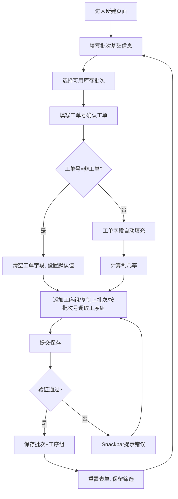
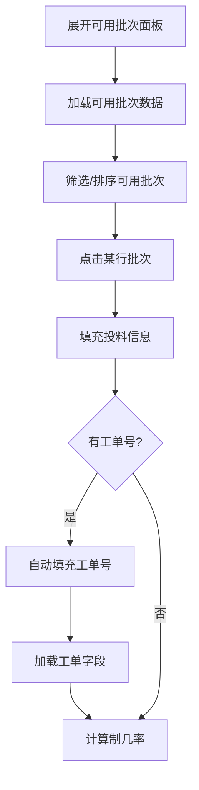
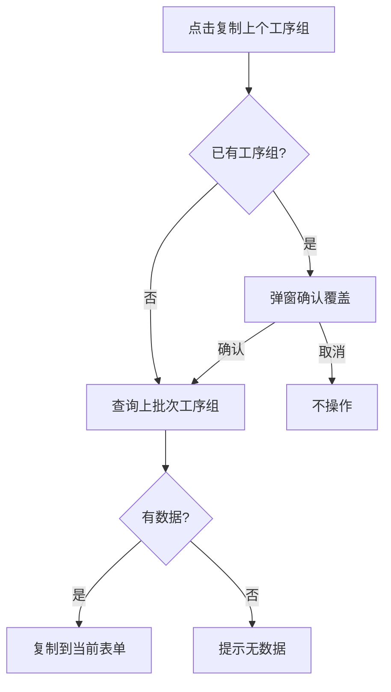
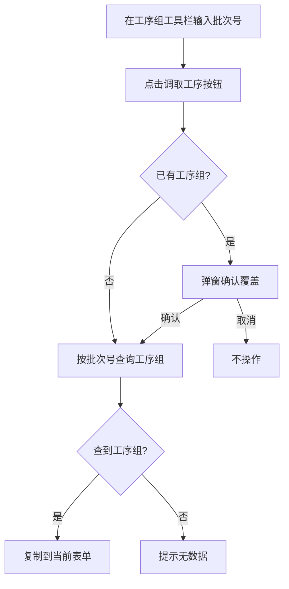
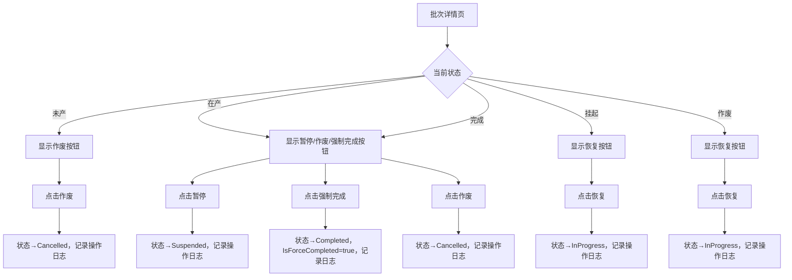
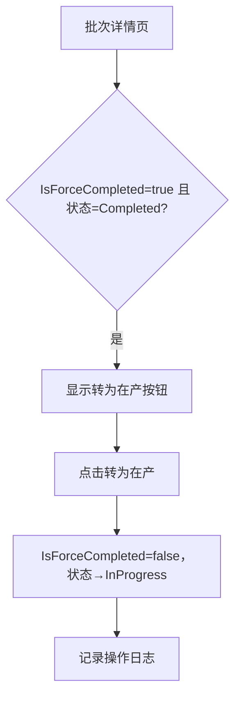

# 批次模块详细设计（V5.6）

**版本**：V5.6
**最后更新**：2026-08-15

---

## 一、概述

本文档定义批次模块的详细设计，包括核心流程、业务规则、页面设计、角色权限。

**核心功能**：
- 生产批次创建（含工单字段冗余、仓库来源选择）
- 工序组管理（含复制上个工序组 + 按批次号调取工序组）
- 可用库存批次查询与引用
- 生产批次列表（分页/搜索/筛选/排序）
- 批次打印（详情/列表）
- **工艺流转卡打印（列选择格式设置 + 选中/全部打印）**
- **批次编辑（仿新建页面布局，5个MudCard区块）**
- **生产记录管理（跨批次列表+批量创建 + 内联编辑+列选择+打印）**
- **工段委外管理（跨批次列表+内联编辑+批量创建+批量回收+多选打印+列选择器+方向键导航）**
- **委外回收管理（跨批次列表+多选打印+列选择器+排序+方向键导航）**
- **批次跟踪可视化（8区块展示批次执行进度）**
- **操作日志（记录状态变更等关键操作，由基础设施统一管理）**
- **相邻批次导航（上一条/下一条快速切换）**
- **工单号/订单号跳转链接（批次列表/详情页）**
- **"非工单"支持（无对应工单的库存生产，WorkOrderNo="非工单"）**
- **验证规则分类**：统一必填（两路径共用）+ 有工单专属（WorkOrderNo≠"非工单"时追加）+ 条件必填（定尺时）
- **去油/酸洗入缸记录管理（跨批次列表+内联编辑+批量创建+完工登记+方向键导航+列选择器+列分组）**
- **去油/酸洗完工记录管理（跨批次列表+内联编辑+删除+方向键导航+列选择器）**

**设计原则**：
- 批次创建时从工单复制30个冗余字段（快照模式，不随工单变化）
- 支持"非工单"值：无对应工单的库存生产，指定值 WorkOrderNo="非工单" 时跳过工单存在性检查
- 批次创建时可选择可用库存批次作为来源（支持多批次合并投料，通过 ProductionBatchInventory 多对多关联表记录领料信息）
- 非仓库模式：无可用库存批次时，使用列表输入直接填写来源物料信息（原料类型/炉号/牌号/规格/支数/重量/原料备注），支持多行输入
- SourceRemark（原料备注）：投料信息中的附加备注字段，存储于 ProductionBatch.SourceRemark（nvarchar(500)），在批次详情和工艺流转卡打印中显示
- 工序组支持"复制上个批次"快速录入
- 物理删除策略（CASCADE删除工序组/生产记录/工段委外）
- 生产记录/工段委外：冗余工序名称和制造规格（从ProcessGroup快照）
- 工段委外 → 委外回收：一对多级联关系（CASCADE）
- 检验到料：每道检验工序组唯一一条记录（UK_MaterialReceiveCheck_ProcessGroup），支持多工序组成检到料
- 操作日志：状态变更等关键操作自动记录到 OperationLog 统一表（Module="Batch"），由基础设施 IOperationLogService 统一管理
- 工序组调取：支持按批次号从已有批次复制整个工序组（替代覆盖确认）
- 去油/酸洗：两阶段模式（入缸→完工），1:1关联，状态由系统自动管理

---

## 二、核心流程

### 2.1 新建批次流程



### 2.2 可用库存批次选择流程



### 2.3 复制上个工序组流程



---

### 2.4 按批次号调取工序组流程



### 2.5 暂停/恢复/作废流程



### 2.6 强制完成恢复流程



---

## 三、页面设计

### 3.1 批次列表页（/batches）

| 项目 | 说明 |
|------|------|
| 路由 | `@page "/batches"` |
| 授权 | BatchStaff/BatchDirector/Admin |
| 表格 | MudTable 服务端分页 + auto-table |
| 筛选 | 关键字搜索 + ExcelFilter 列头多选筛选（状态/HasInputChange（有效投料变更，枚举选项「有/无」）/CurrentSectionCompleted 等列均支持从列头下拉筛选） |
| 排序 | BatchNo/Status/WorkOrderNo/CreatedTime 等全字段，`CurrentSectionCompleted` 按 `bool?` 排序（null→false→true），`HasInputChange` 不可排序（SortKey=null），`RemainingWorkDays` 按 int 值排序 |
| 样式 | 有效投料变更=有时显示 MudChip Color="Warning" 黄色警示样式，=无时 MudChip Color="Success" 绿色样式。工段完工值为"完工"时 MudChip Color="Success" 绿色，"生产中"时 MudChip Color="Warning" 黄色 |
| 列分组 | 现有分组之外：**G2「现执行状态」**（GroupKey=2）新增 **成检附加（InspectionStage，预检/终检/空）**；**G3「有效投料变更」**（GroupKey=3）含 **6 个过程检字段**（过程检合格支/合格量/理论成品支/需调整/缺陷-返整量/缺陷-纯次品量）+ HasInputChange + 理论三字段 + 现有效支数/重量；**G4「成品切割跟踪」**（GroupKey=4）：CutRequirement/CutExecution/CutQuantity/CutDoubt + 中文显示字段（是/否/略/疑问-数量/疑问-缺少/正常），MudChip 渲染（疑问-数量=红/疑问-缺少=橙/正常=绿）；**G8「产品要求」**（GroupKey=8）新增 **产品单支量（ProductUnitWeight）**。计算规则详见 §4.15 |
| 操作 | 打印选中 + 打印全部 + 查看详情 + 工艺卡打印 |
| 通知轮询 | 30秒定时器自动轮询加载在产改制计划通知、在产主工单计划通知、工单号核查结果、工单变更通知。通过 `StartNotificationPollingAsync()` + `CancellationTokenSource` 实现，页面销毁时通过 `IAsyncDisposable.DisposeAsync()` 取消轮询 |
| 通知加载方法 | `LoadPendingInProcessReworkPlansAsync()` / `LoadPendingInMainWorkOrderPlansAsync()` — 调用 MaterialPlanService 获取 Planned 状态的待处理计划列表；`CheckWorkOrdersAsync()` — 调用 BatchService 核查工单号存在性；`CheckWorkOrderChangedNotificationsAsync()` — 调用 NotificationService 获取工单变更通知。每次加载后清空旧数据（空结果时 `Clear()`）避免残留 |
| 打印 | QuestPDF 生成 PDF，Blob URL 打开 |

### 3.2 批次创建页（/batches/create）

| 项目 | 说明 |
|------|------|
| 路由 | `@page "/batches/create"` |
| 授权 | BatchDirector/Admin |
| 布局 | 5个区块：投料信息 → 工单字段信息 → 质量要求信息 → 基础信息 → 工序组 |
| 区块样式 | MudCard + compact-card。质量要求信息/基础信息使用水平flex布局（label:input 行内模式），非 MudSimpleTable |
| 日期字段 | MudTextField + Placeholder="yyyy-MM-dd"（不使用 MudDatePicker） |
| 方向键导航 | enableTableArrowNav("#batch-create-table") |
| 可用批次 | 可展开面板，含搜索筛选 + 排序，支持多选合并投料，点击行自动添加到来源列表（通过 ProductionBatchInventory 关联） |
| 非仓库模式 | 无可用来源批次时，通过"非仓库模式"开关切换到列表输入。MudTable 多行输入，每行包含：原料类型(MudSelect)、炉号、工厂牌号、规格、长度状态、单支重、领料支数、领料重量、原料备注(SourceRemark)。支持增删行（最少1行）。提交时行级验证：原料类型必填、领料支数/重量>0、原料备注必填。多行时合并汇总到请求字段 |
| 工单确认 | 输入工单号 → 确认 → 有工单时30字段自动填充（含 ManufacturingStatus）；工单号为"非工单"时清空工单字段（保留Specification/外径公差/壁厚公差/LengthStatus/MinLength/MaxLength不变，设置DeliveryState="固溶酸洗"、PlantGrade=SourcePlantGrade、MaterialName="SeamlessPipe"、ProductionRatio=0），并自动同步 ManufacturingItem（非工单→Finished，普通工单→OrderFinished） |
| 制造物品联动 | `ValidManufacturingItems` 属性根据 WorkOrderNo 动态过滤：`"非工单"` 时仅可选 Finished(备料成品)/Surplus(余库料)；普通工单时仅可选 OrderFinished(订单成品)/SpecialDeliveryStatus(订成-非交付态)。切换工单号时通过 `SyncManufacturingItem()` 自动重置越界值 |
| 工序组 | MudTable 内联编辑，7基础列（工序名称/制造规格/外径公差/壁厚公差/制造长度/断切处理/备注）+ 动态工段列（`InitProcessGroupColumnsAsync` 先 `LoadSectionColsAsync` 从配置加载，fallback `SectionDefs` 26 预置，Extra1/Extra2 默认隐藏）+ 序号列 + 操作列，列选择器（列偏好持久化 `PgColPrefsKey`）。工具栏包含：输入批次号（右侧上方）→ 复制上个工序组 → 新增工序 → 列显示 → 重置 → 调取工序（130px宽，最右侧） |
| 工序组调取 | 输入批次号 + 点击"调取工序"按钮，按批次号从已有批次复制工序组（有数据时弹窗确认覆盖） |
| 提交验证 | Snackbar 汇总错误，不实时校验。验证分为三类：统一必填（两路径共用）、有工单专属（非"非工单"时追加）、条件必填（定尺时） |
| 验证规则 | **统一必填（14字段）**：生产类型、制造物品、工厂牌号、规格、交货状态、物料名称、长度状态、总重量(>0)、制几率(>0)、仓库牌号、仓库规格、来源长度状态、领料重量(>0)、领料支数(>0)。**有工单专属（3字段）**：结算方式、产品标准编码、技术要求。**条件必填**：总支数（定尺时>0）。详见§4.17 |
| 提交流程 | 保存成功 → 重置表单 → 刷新可用批次（保留筛选文本） |
| 有效/领料同步 | 有效支数(CurrentValidQty)默认与领料支数(InputQuantity)相同，有效重量(CurrentValidWeight)默认与领料重量(InputWeight)相同，均允许手动修改。通过 `@bind-Value:after` 事件处理器实现同步 |
| 列偏好持久化 | 列表页和创建页的列显隐/排序通过 ColumnPrefsService 保存到 localStorage |
| 页面压缩 | 质量要求信息无标题/图标；固溶参数无图标；基础信息无副标题/审计信息；生产编号加粗黑色字体 |

### 3.3 批次详情/编辑页（/batches/{id} / /batches/{id}/edit）

| 项目 | 说明 |
|------|------|
| 路由 | `@page "/batches/{Id:int}"` + `@page "/batches/{Id:int}/edit"` |
| 路由说明 | 批次详情/编辑采用**双路由分离模式**（而非 04_开发规范.md 描述的合并模式 `_isEditMode`），因编辑模式布局与查看模式差异较大（5区块MudCard + 状态管理），分离路由更清晰 |
| 授权 | 查看：BatchStaff/BatchDirector/Admin；编辑：BatchStaff（按钮级权限控制）/BatchDirector/Admin |
| 查看模式 | 字段只读，显示"编辑""打印"按钮。**9个区块**：批次基本信息 → 跟踪可视化 → 执行信息 → 质量要求 → 投料信息 → 工单信息 → 工序组列表 → 操作日志。其中「区块二b 成切跟踪」位于「执行信息 → 成切跟踪 → 批次执行进度」，含 **成检附加（InspectionStage：预检/终检/空）** + 成切跟踪四字段（成切需求/执行/支数/存疑）。工单信息区块显示当前快照值，字段为空或默认值时自动显示「-」保护（采用 FmtDate/FmtStr 辅助方法） |
| 编辑模式 | **5区块MudCard布局（仿新建页面）**：投料信息 → 工单字段信息 → 质量要求信息 → 基础信息 → 工序组 |
| 编辑差异 | ①页面加载时预填充数据 ②基础信息区块移除状态字段（编辑页不显示状态，统一在详情页操作）③工序组工具栏与新建页一致（输入框在上方，按钮右对齐）|
| 编辑验证规则 | 统一必填（14字段，与新建页相同）、有工单专属（3字段仅在 WorkOrderNo≠"非工单"时验证）、条件必填（定尺时总支数>0）。采用 `??` 降级模式（请求值→原实体值），避免部分更新时误报 |
| 基础信息只读字段 | 生产编号（业务主键）|
| 投料信息可编辑字段 | 来源库存批次号、原料类型、入库来源(MudSelect,7选项，与仓库模块一致)、来料单位、入库日期(yyyy-MM-dd自由文本)、炉号、工厂牌号、名义规格、长度状态、单支重、领料支数、领料重量、仓库名称、来源工单号、原料备注 |
| 投料信息只读字段 | 无（全部可编辑）|
| 质量要求 | 固溶参数、质量备注均可编辑 |
| 工单信息 | 30个字段均可编辑（列选择器控制显隐）|
| 工序组 | 全部字段可编辑（7基础列 + 动态26工段列 + 序号 + 操作列，同新建页 InitProcessGroupColumnsAsync 动态加载，fallback SectionDefs 26 预置，Extra1/Extra2 默认隐藏）|
| 保存策略 | 工序组：删除全部原工序组后重新插入（级联删除 + 批量重新创建） |
| 编辑自动同步 | 修改有效支数时自动计算有效重量：`有效重量 = 领料重量 / 领料支数 × 有效支数`，通过 `@bind-Value:after="RecalcValidWeightOnQtyChange"` 实现，允许手动再修改 |
| 刷新执行状态 | 详情页提供"刷新执行状态"按钮，调用 ProdRecordService.RefreshBatchTrackingAsync 更新批次跟踪字段（当前工序/工段/设备/委外/下一工段） |
| 状态操作 | 未产→作废；在产/完成→暂停/作废/强制完成（三个手动调整按钮）；挂起→恢复；作废→恢复；强制完成→转为在产。所有操作记录操作日志。Completed 状态不再限制回退 |
| 相邻批次导航 | 页眉左右箭头按钮，按创建时间排序，显示上一条/下一条批次号 |
| 工单号跳转 | 工单信息区块中工单号为 MudLink，点击跳转到工单详情页 |
| 订单号跳转 | 工单信息区块中源订单号为 MudLink，点击跳转到订单详情页 |
| 操作日志 | 第8区块，默认收起，点击"展开"加载并显示操作日志表格（操作类型/详情/操作人/操作时间）。操作类型 MudChip 颜色："创建"→Default、"变更"→Warning、"删除"→Error（旧版"状态变更"/"强制完成"/"更新工单"等类型已统一归并为"变更"） |
| 跟踪可视化 | 第2区块，显示8个卡片展示批次各执行阶段状态（待执行/执行中/已完成/不涉及）；各工段名称下方显示执行日期(MM-dd)（从生产记录/过程检验/检验到料[检验工段匹配]/工段委外/检验到料[末段回退]五类记录中按优先级获取）；"现有效原料投料量"替代原"投料量"标签；进度百分比排除"入库"工段 |
| 返回按钮 | "返回批次列表" → /batches |

### 3.4 工艺流转卡打印页（/process-card-print）

| 项目 | 说明 |
|------|------|
| 路由 | `@page "/process-card-print"` |
| 授权 | BatchStaff/BatchDirector/Admin |
| 入口 | ①顶部导航栏"工艺卡打印"按钮 ②批次列表页页眉"工艺卡打印"按钮 |
| 格式设置 | 5区块（批次基本信息/质量要求/投料信息/工单信息/工序组），MudSwitch列显隐 |
| 列偏好持久化 | 通过 ColumnPrefsService 保存到 localStorage（key: `process_card_print_list`），切换开关自动保存。**跨区块去重**：相同 Key 在不同区块出现时，通过 `matchedRefs` HashSet 确保每个 Key 只匹配一次，避免列偏好加载错乱 |
| 默认状态 | 格式设置面板默认收起（showSettings=false） |
| 批次选择 | MudTable 服务端分页 + 关键词搜索 + 状态筛选 + 多选勾选 + 列分组（与批次首页分组对齐） |
| 打印选中 | 勾选批次 → "打印选中"按钮 → 仅打印已选批次 |
| 打印全部 | "打印全部"按钮 → 打印所有批次 |
| PDF输出 | A4横向，QuestPDF 生成，标题行 + 动态区块布局 |

**默认列可见性（5区块，MudSwitch 控制）：**

| 区块 | 默认可见字段 | 默认隐藏字段 |
|------|-------------|-------------|
| 批次基本信息 | BatchNo, TagNo, ProductionType, ManufacturingItem, ProductionRatio, CreatedBy, CreatedTime, CurrentSpec | Status, IsForceCompleted |
| 质量要求 | 全部质量字段默认可见 | — |
| 投料信息 | 全部仓库字段默认可见 | — |
| 工单信息 | WorkOrderNo, SalesOrderNo, ProductionMainNo, ProductionSubNo, OrderItemIds, StandardCode, TechnicalRequirements, TotalMeters, DeliveryState, TotalItemCount, ItemDetails | — |
| 工序组 | ProcessName, ManufacturingSpec 及所有工段字段, CuttingTreatment, Remark | — |

> 实际列偏好以用户保存为准，首次加载使用上述默认值。

### 3.5 生产记录独立列表页（/production-records）

| 项目 | 说明 |
|------|------|
| 路由 | `@page "/production-records"` |
| 授权 | BatchStaff/BatchDirector/Admin |
| 入口 | ①顶部导航"生产记录"按钮 ②批次详情页底部的"生产记录"Tab |
| 表格 | MudTable 服务端分页 + auto-table，**内联编辑** |
| 搜索 | MudTextField Immediate + DebounceInterval 500ms，模糊搜索（批次号/工序/工段） |
| 日期筛选 | 执行日期范围：两个 MudTextField（_execDateFrom/_execDateTo），格式 yyyy-MM-dd，变化时自动刷新 |
| 列选择器 | ColumnDisplaySelect + 重置按钮，列偏好通过 ColumnPrefsService 持久化到 localStorage（key: `productionrecords`），4组分组切换 |
| 排序列头 | 带排序箭头（▲▼），`ToggleSort(col.SortKey)` 切换升降序，默认按创建时间降序 |
| 多选 | 每行 MudCheckBox + 表头全选；**编辑时隐藏多选框**（`@if (!_editingIds.Contains(item.Id))`） |
| 内联编辑 | _editingIds/_editCache 模式，支持 16 个可编辑字段（ExecDate/EquipmentName/Operator/Shift/Quantity/Weight/SolutionTemperature/SoakTime/FaceCutCount/CuttingMultiple/FinishedCutLength/PostCutQuantity/TagNo/PlantGrade/Remark/IsPreCut），产类(ProductStatus) 为系统计算字段不可编辑 |
| 保存防重提 | `_isSaving` 标志，保存按钮 Disabled="@_isSaving"，SaveEdit 用 try/finally 包裹 |
| 方向键导航 | enableTableArrowNav + _isArrowNavSetup 防重入 |
| 操作列 | 编辑/保存/取消 + 删除（ConfirmDialog确认） |
| 删除策略 | 物理删除（DELETE FROM），ConfirmDialog 确认后执行，成功后 Snackbar 提示 |
| 打印 | "打印选中"+"打印全部"按钮，传递 PrintColumnDef（从 _visibleColumns 映射），QuestPDF 生成，Blob URL 打开 |
| 批次号链接 | BatchNo 列为 MudLink，点击跳转到批次详情页 |

**字段分组（4组29列）：**

| 分组 | GroupKey | 背景色 | 列数 | 字段 |
|------|----------|--------|------|------|
| G1 执行信息 | 1 | col-g3（绿） | 9 | ExecDate, BatchNo（link）, WorkOrderNo, SalesOrderNo, ProductionMainNo, ProcessName, ManufacturingSpec, SectionName, SequenceNumber |
| G2 产出数据 | 2 | col-g4（橙） | 13 | EquipmentName, Operator, Shift, Quantity, Weight, 产类(ProductStatus), 预成切(IsPreCut), 长度状态(LengthStatus), CuttingMultiple, FinishedCutLength, 符合工单长度(CutLengthMatchType), PostCutQuantity, FaceCutCount |
| G3 工艺参数 | 3 | col-g5（紫） | 2 | SolutionTemperature（固溶温度℃）, SoakTime（保温时间min） |
| G4 追溯信息 | 4 | col-g6（青） | 5 | TagNo, PlantGrade, Remark, DataSource（扫码/手动）, UpdatedTime |

### 3.6 生产记录新建页（/production-records/create）

| 项目 | 说明 |
|------|------|
| 路由 | `@page "/production-records/create"` |
| 授权 | BatchDirector/Admin |
| 入口 | 生产记录列表页"新建"按钮 |
| 布局 | 批量表格输入，每行对应一个工段的执行数据 |
| 列选择器 | ColumnDisplaySelect + 重置按钮，列偏好持久化（key: `production-records-create`） |
| 方向键导航 | enableTableArrowNav(".table-scroll") + _isArrowNavSetup 防重入 |
| 添加行 | 工具栏"添加行"按钮 + 表尾 + 按钮 |
| 删除行 | 每行删除按钮（至少保留1行） |
| 提交验证 | Snackbar 汇总错误（批次号/工序名称/工段名称/执行日期/制造规格/加工重量），不实时校验 |
| 提交流程 | 逐行验证 → 批量提交 → 成功跳转列表页 |
| 字段录入 | **BatchNo（批次号，文本输入）替代 ProductionBatchId（内部数值）**，服务端自动解析：BatchNo → ProductionBatchId，BatchNo+ProcessName+ManufacturingSpec → ProcessGroupId，ProcessGroupId+SectionName → SequenceNumber |
| 自动填充 | 输入 BatchNo + ManufacturingSpec 后自动触发 `OnAutoFillAsync`：调用 `BatchService.GetByBatchNoAsync()` 获取批次数据，自动填充 TagNo/PlantGrade，匹配对应 ProcessGroup 的工序名称（ProcessName）。填充后字段仍可编辑 |

**字段顺序（17列）：**
执行日期 * → 批次号 * → 工序名称 * → 制造规格 → 工段名称 * → 设备名称 → 操作工 → 班次 → 加工支数 → 加工重量 → 是否成品 → 断切倍数 → 成品长度 → 切后支数 → 挂牌号 → 工厂牌号 → 备注

> 执行序号（SequenceNumber）已从页面移除，由服务端根据 ProcessGroupId + SectionName 自动计算。

### 3.7 工段委外列表页（/section-outsources）

| 项目 | 说明 |
|------|------|
| 路由 | `@page "/section-outsources"`（新建：`/section-outsources/create`） |
| 授权 | BatchStaff/BatchDirector/Admin |
| 入口 | ①顶部导航"工段委外"按钮 ②委外回收页"返回委外"链接 |
| 表格 | MudTable 服务端分页 + auto-table，**内联编辑** |
| 搜索 | MudTextField Immediate + DebounceInterval 500ms，模糊搜索（批次号/工序/工段/委外单位） |
| 日期筛选 | 发出日期范围 + 回收日期范围：4个 MudTextField，格式 yyyy-MM-dd，变化时自动刷新 |
| 列选择器 | ColumnDisplaySelect + 重置按钮，列偏好通过 ColumnPrefsService 持久化到 localStorage（key: `section-outsources`） |
| 排序列头 | 带排序箭头（▲▼），`ToggleSort(col.SortKey)` 切换升降序，默认按创建时间降序 |
| 多选 | 每行 MudCheckBox + 表头全选；**编辑时隐藏多选框**（`@if (!_editingIds.Contains(item.Id))`）；单选与编辑互斥 |
| 内联编辑 | `_editingIds/_editCache` 模式，支持 7 个可编辑字段（SendOutDate/SendQuantity/SendWeight/OutsourceVendor/OutsourceSpec/ExpectedReturnDate/IsUrgent/Remark） |
| 保存防重提 | `_isSaving` 标志，保存按钮 `Disabled="@_isSaving"`，SaveEdit 用 try/finally 包裹 |
| 方向键导航 | `enableTableArrowNav` + `_isArrowNavSetup` 防重入，id 容器 `#section-outsources-list-table` |
| 操作列 | 编辑/保存/取消 + 删除（ConfirmDialog确认，已有回收记录时服务端拒绝删除） |
| 状态显示 | 通过 `DisplayHelper.GetSectionOutsourceStatusText()` 显示中文（待回收/已回收/在轧），`GetSectionOutsourceStatusColor()` 设置 MudChip 颜色 |
| 状态自动管理 | 创建时默认"待回收"，累计回收数量≥发出数量时自动切换为"已回收" |
| 删除策略 | 物理删除（DELETE FROM），有回收记录时返回 BusinessException |
| 打印 | "打印选中"+"打印全部"按钮，传递 PrintColumnDef，QuestPDF 生成，Blob URL 打开 |
| 批量回收 | 工具栏"批量回收"按钮（多选后激活），弹出 RecoveryCreateDialog 批量创建回收记录 |
| 回收管理链接 | 工具栏"回收管理"链接 → `/outsource-recoveries` |
| 新建页 | `/section-outsources/create`：批量表格输入 + ColumnDisplaySelect + 重置；BatchNo 替代 ProductionBatchId。输入 BatchNo + ManufacturingSpec 后自动触发 `OnAutoFillAsync` 填充 TagNo/ProcessName/PlantGrade（同生产记录新建页）。**CopyFromAbove/AddRow 复制策略**：新增行从末行复制 BatchNo/OutsourceVendor 及所有工序/规格/日期字段，排除 SendQuantity/SendWeight/Remark

**字段顺序（17列）：**
发出日期 → 批次号 → 工序名称 → 制造规格 → 工段名称 → 委外单位 → 发出支数 → 发出重量(kg) → 状态 → 委外规格 → 要求收回日期 → 是否紧急 → 挂牌号 → 工厂牌号 → 备注 → 创建日期 → 更新日期

### 3.8 委外回收列表页（/outsource-recoveries）

| 项目 | 说明 |
|------|------|
| 路由 | `@page "/outsource-recoveries"`（新建：通过工段委外页"批量回收"入口，弹出 RecoveryCreateDialog；也可通过独立页面 `/section-outsources/create-recovery` 创建） |
| 授权 | BatchStaff/BatchDirector/Admin |
| 入口 | ①工段委外列表页"批量回收"按钮 ②工段委外列表页"回收管理"链接 |
| 表格 | MudTable 服务端分页 + auto-table |
| 搜索 | MudTextField Immediate + DebounceInterval 500ms，模糊搜索（批次号/工序/委外单位） |
| 日期筛选 | 回收日期范围：2个 MudTextField（_recoveryDateFrom/_recoveryDateTo），格式 yyyy-MM-dd，变化时自动刷新 |
| 列选择器 | ColumnDisplaySelect + 重置按钮，列偏好持久化（key: `outsource-recoveries`） |
| 排序列头 | 带排序箭头（▲▼），默认按创建时间降序 |
| 多选 | 每行 MudCheckBox + 表头全选 |
| 打印 | "打印选中"+"打印全部"，传递 PrintColumnDef |
| 操作列 | 删除（ConfirmDialog确认），**无内联编辑**（回收记录为只读历史数据） |
| 删除策略 | 物理删除，删除时自动更新关联委外状态（已回收→待回收） |
| 返回按钮 | 页眉"返回委外" → `/section-outsources` |
| 委外字段来源 | 回收实体本身**不存**委外冗余列（BatchNo/OutsourceVendor/ProcessName/SectionName/OutsourceSpec/ManufacturingSpec/SendQuantity/SendWeight/TagNo/PlantGrade），DTO 的该组字段由查询时 `Include(r => r.SectionOutsource).ThenInclude(s => s.ProductionBatch)` 读时 JOIN 现取，实时一致无漂移 |

**字段顺序（12列）：**
回收日期 → 批次号 → 委外单位 → 工序名称 → 工段名称 → 回收支数 → 回收重量(kg) → 未加工支数 → 未加工重量(kg) → 备注 → 创建日期 → 更新日期

### 3.9 成检到料列表页（/quality/material-receive-checks）

| 项目 | 说明 |
|------|------|
| 路由 | `@page "/quality/material-receive-checks"`（新建：`/quality/material-receive-checks/create`） |
| 授权 | QualityStaff/QualityDirector/Admin |
| 入口 | ①顶部导航"质量管理→成检到料"按钮 ②批次详情页底部的"成检到料"Tab |
| 归属 | 菜单归属质量管理，后端独立实现在质量上下文（MaterialReceiveCheckService + MaterialReceiveCheck 实体） |
| 表格 | MudTable 服务端分页 + auto-table，**内联编辑** |
| 搜索 | MudTextField Immediate + DebounceInterval 500ms，模糊搜索（批次号/确认人） |
| 日期筛选 | 到料日期范围：两个 MudTextField（_receiveDateFrom/_receiveDateTo），格式 yyyy-MM-dd |
| 列选择器 | ColumnDisplaySelect + 重置按钮，列偏好持久化（key: `material-checks`） |
| 排序列头 | 带排序箭头，默认按创建时间降序 |
| 多选 | 每行 MudCheckBox + 表头全选；**编辑时隐藏多选框** |
| 内联编辑 | _editingIds/_editCache + _isSaving 防重提 |
| 打印 | "打印选中"+"打印全部"，传递 PrintColumnDef |
| 去重 | 每个（批次+工序组）最多一条到料记录（UK_MaterialReceiveCheck_ProcessGroup），支持多工序组成检到料 |
| 新建页 | 批量表格输入 + ColumnDisplaySelect + 重置；批次号（BatchNo）文本输入替代 ProductionBatchId |

**字段顺序（9列）：**
到料日期 → 批次号 → 工序名称 → 执行序号 → 班次 → 确认人 → 数据来源 → 备注 → 创建时间

### 3.10 生产记录相关对话框

#### BatchReportDialog（保留）

| 项目 | 说明 |
|------|------|
| 文件 | `MES.Blazor/Shared/BatchReportDialog.razor` |
| 用途 | 批次详情页内联的批量生产记录录入对话框 |

---

### 3.11 去油/酸洗入缸记录列表页（/pickling-in-records）

| 项目 | 说明 |
|------|------|
| 路由 | `@page "/pickling-in-records"`（新建：`/pickling-in-records/create`） |
| 授权 | BatchStaff/BatchDirector/Admin |
| 入口 | ①顶部导航"批次管理→去油/酸洗入缸"按钮 ②详情页底部关联Tab（未来支持） |
| 表格 | MudTable 服务端分页 + auto-table + compact-table，**内联编辑** |
| 搜索 | MudTextField Immediate + DebounceInterval 500ms，模糊搜索（批次号/工序/工段/制造规格/挂牌号/工厂牌号/备注） |
| 列选择器 | ColumnDisplaySelect + 重置按钮，列偏好持久化（key: `pickling-in-records`） |
| 排序列头 | 带排序箭头（▲▼），默认按创建时间降序，支持24列排序 |
| 内联编辑 | _editingIds/_editCache 模式，支持 6 个可编辑字段（EquipmentName/Operator/Shift/Quantity/Weight/Remark），ProductStatus 为系统计算字段不可编辑 |
| 操作列 | 编辑/保存/取消 + 完工(状态为Soaking时显示) + 删除 |
| 完工登记 | 通过 PicklingCompleteDialog 弹出，填写 CompleteDate + Remark，自动创建完工记录并更新入缸状态为 Completed |
| 状态显示 | Status="Completed"时显示 MudChip Color="Success" "已完工"，否则 MudChip Color="Warning" "浸泡中" |
| ProductStatus显示 | 荒管→MudChip Color="Primary"「荒管」、成品→MudChip Color="Success"「成品」、在制→MudChip Color="Default"「在制」 |
| 保存防重提 | 无特殊处理（单行编辑，不涉及大量并发） |
| 方向键导航 | enableTableArrowNav + _isArrowNavSetup 防重入，id 容器 `pickling-in-records-list-table` |
| 删除策略 | 物理删除，已有完工记录时服务端返回 BusinessException 禁止删除 |
| 分页汇总 | Quantity/Weight 两列底部 B33 汇总，col-footer-cell + col-footer-sum 样式 |
| 列分组 | 前端通过 initGroupHeaders JS 函数实现：G1(去油/酸洗信息: InDate/BatchNo/TagNo/WorkOrderNo/SalesOrderNo/ProductionMainNo/ProcessName/SectionName/PlantGrade/ManufacturingSpec/SequenceNumber/EquipmentName/Shift/Operator/Quantity/Weight/ProductStatus/Remark/DataSource/UpdatedTime) / G2(完工信息: Status/CompleteDate/CompleteShift/CompleteOperator) |
| 打印 | "打印选中"+"打印全部"按钮，后端 PicklingService.PrintBatchAsync/PrintAllAsync 生成 PDF 直接返回文件 |
| 新建页链接 | 页眉"入缸报工"按钮 → `/pickling-in-records/create` |
| 完工记录入口 | 页眉"完工记录"按钮 → `/pickling-out-records` |

**字段顺序（24列）：**
入缸日期 → 生产编号 → 挂牌号 → 工单号 → 订单号 → 主号 → 工序名称 → 工段名称 → 工厂牌号 → 制造规格 → 执行序号 → 设备名称 → 班次 → 操作人 → 加工支数 → 加工重量 → 产类 → 备注 → 数据来源 → 更新时间 → 状态 → 完工日期 → 完工班次 → 完工操作人

### 3.12 去油/酸洗入缸记录创建页（/pickling-in-records/create）

| 项目 | 说明 |
|------|------|
| 路由 | `@page "/pickling-in-records/create"` |
| 授权 | BatchDirector/Admin |
| 入口 | 入缸记录列表页"入缸报工"按钮 |
| 布局 | 批量表格输入（MudTable Items 模式，非 ServerData） |
| 列选择器 | ColumnDisplaySelect + 重置按钮，列偏好持久化（key: `pickling-in-record-create`） |
| 方向键导航 | enableTableArrowNav + _isArrowNavSetup 防重入，id 容器 `pickling-in-record-create-table` |
| 添加行 | 工具栏"添加行"按钮 + 表尾 + 按钮 |
| 删除行 | 每行删除按钮（至少保留1行） |
| 提交验证 | Snackbar 汇总错误（批次号/工序名称/工段名称/制造规格不能为空），不实时校验 |
| 提交流程 | 逐行验证 → 批量提交（BatchCreateAsync）→ 成功跳转列表页 |
| 字段录入 | **BatchNo（批次号，文本输入）** 替代 ProductionBatchId，服务端自动解析：BatchNo→ProductionBatchId，BatchNo+ProcessName+ManufacturingSpec→ProcessGroupId，ProcessGroupId+SectionName→SequenceNumber |
| 自动填充 | BatchNo+ManufacturingSpec → `OnAutoFillAsync` 自动填充 TagNo/PlantGrade/ProcessName；BatchNo+ProcessName → `OnAutoFillByProcessNameAsync` 自动填充 ManufacturingSpec |
| 工序名称 | MudSelect 下拉，选项来自 `ProcessNames.All` 常量列表 |
| 工段名称 | MudTextField，Placeholder 提示"去油/酸洗" |
| 入缸日期 | MudTextField + Placeholder="yyyy-MM-dd"，默认当天 |
| 提交按钮 | "确认提交 (N 条)"，底部右对齐，Loading 状态 |

**字段顺序（14列）：**
生产编号 * → 工序名称 * → 制造规格 * → 工段名称 * → 入缸日期 * → 设备名称 → 操作人 → 班次 → 加工数量 → 重量(kg) → 是否成品 → 挂牌号 → 工厂牌号 → 备注

### 3.13 去油/酸洗完工记录列表页（/pickling-out-records）

| 项目 | 说明 |
|------|------|
| 路由 | `@page "/pickling-out-records"` |
| 授权 | BatchStaff/BatchDirector/Admin |
| 入口 | 入缸记录列表页"完工记录"按钮（无独立顶部导航入口，遵循 OutsourceRecoveries 模式） |
| 表格 | MudTable 服务端分页 + auto-table，**内联编辑** |
| 搜索 | MudTextField Immediate + DebounceInterval 500ms，模糊搜索（批次号/工序/工段） |
| 列选择器 | ColumnDisplaySelect + 重置按钮，列偏好持久化（key: `pickling-out-records`） |
| 排序列头 | 带排序箭头（▲▼），默认按完工日期降序 |
| 内联编辑 | _editingIds/_editCache 模式，支持 2 个可编辑字段（CompleteDate MudTextField yyyy-MM-dd + Remark） |
| 操作列 | 编辑/保存/取消 + 删除 |
| 删除策略 | 物理删除，删除时自动恢复关联入缸状态为 Soaking |
| 方向键导航 | enableTableArrowNav + _isArrowNavSetup 防重入，id 容器 `pickling-out-records-list-table` |
| 返回按钮 | 页眉"返回入缸记录" → `/pickling-in-records` |

**字段顺序（9列）：**
生产编号 → 工序名称 → 工段名称 → 制造规格 → 完工日期 → 挂牌号 → 工厂牌号 → 备注 → 创建时间

---

## 四、业务规则

### 4.1 制几率计算与验证

制几率为统一必填字段（两路径共用），所有长度状态下均须 > 0。
定尺（LengthStatus="Fixed"）时自动计算，不定尺时默认0但用户必须手工填值（> 0）：
```
制几率 = floor(投料单重 / 工单单重)
       = floor((领料重量/领料支数) / (总重量/总支数))
```

计算公式在`CreateAsync`和前端同时实现（后端优先）。
提交时无条件验证 `ProductionRatio > 0`，不通过则 Snackbar 提示"制几率必须大于0"。

### 4.2 生产编号规则

格式：`YYMM-XXXX`，每年每月从0001开始递增。

### 4.3 可用库存批次筛选规则

从出库记录（OutboundType=ProductionPick）中筛选已出库生产领用的库存批次，排除已被生产批次引用（通过 ProductionBatchInventory 多对多关联表记录）的库存批次。支持多批次合并投料（单个生产批次引用多个库存批次）。

### 4.4 状态流转

| 当前状态 | 可流转至 | 说明 |
|----------|----------|------|
| None | InProgress/Completed/Cancelled | 开始生产、直接完成或作废 |
| InProgress | Completed/Suspended/Cancelled | 生产完成、挂起（暂停）或作废 |
| Suspended | InProgress | 恢复生产 |
| Completed | InProgress/Suspended/Cancelled | 暂停、作废或强制完成（允许回退，无限制） |
| Cancelled | InProgress | 恢复（取消作废标记，重回在产状态） |

强制完成（IsForceCompleted=true）时状态直接设为Completed。强制完成状态可通过"转为在产"恢复，清除 IsForceCompleted 标记。
Completed 状态不再限制回退，三个手动调整状态（暂停/作废/强制完成）始终可用。

**制造状态（ManufacturingStatus）**：与 BatchStatus（生命周期状态：None/InProgress/Completed/Cancelled/Suspended）不同，ManufacturingStatus 记录批次执行的实际制造状态（与交货状态 DeliveryState 同枚举），由用户在创建/编辑批次时选择。业务约束：当制造物品（ManufacturingItem）为"订单成品"（OrderFinished）时，制造状态必须等于交货状态；当制造物品为"订成-非交付态"（SpecialDeliveryStatus）时，制造状态不能等于交货状态。

### 4.5 工序组规则

- 每个工序组必须填写工序名称
- 工序名称：存储英文 Key（`ProcessKeys` 常量：RoughTubeProcessing/InProcessRepair/ColdRoll60/ColdRoll50/ColdRoll30/ColdRoll20/ThreeRollColdRoll/ColdDraw/AdditionalFinalInspection），中文显示走 `ProcessDisplayHelper.GetProcessNameText`；前端 MudSelect 选项由 ProcessDefinitionService 加载（ProcessInfoDto：Value=ProcessKey 英文、Display=中文）
- 26个工段字段为可选的执行顺序值（null=不涉及；ColdRollDraw/OilPipeCut/Degrease/EmulsionWash/UltrasonicWash/ClothPolish/BrightAnnealing/Solution/Straighten/Cut/ThicknessMeasure/Pickle/OuterPolish/InnerPolish/InnerGrinding/OuterSpotGrinding/SandBlasting/ShotBlasting/Inspection/WeldingHead/Welding/Lubrication/Packing/Warehouse/Extra1/Extra2），前端 `LoadSectionColsAsync` 动态加载（StandardWorkDayService 配置优先，fallback SectionDefs 26 预置，Extra1/Extra2 默认隐藏）
- 工序组序号从1开始按顺序排列
- 复制上个工序组时，若当前已有工序组则弹窗确认覆盖
- 调取工序：按批次号从已有批次复制工序组，同样弹窗确认覆盖

### 4.6 生产记录规则

- 同一批次+工序组内，工段名称唯一（UK_ProductionRecord_Section）
- 执行序号 SequenceNumber 由服务端自动解析：ProcessGroupId + SectionName → SequenceNumber（来自工序组中该工段的顺序值），传0时自动计算
- 断切倍数：非百分比数值，表示每支成品管需要几支原料管的倍数
- 切后支数 = 断切倍数 × 加工支数（前端自动计算）
- **制造规格必填**：提交时必须提供 ManufacturingSpec（未提供时返回 BusinessException）
- **加工重量验证**：加工重量不得超过该批次领料重量（InputWeight），超出时返回 BusinessException
- **执行序号范围验证（3A）**：新建生产记录时，该批次的 SequenceNumber 不得超过"该批次最近有记录的日期的最大 SeqNumber + 7"。即取该批次所有 ExecDate < 当前记录日期的记录中，ExecDate 最大的一天对应的最大 SequenceNumber + 7 作为上限。使用 .Date 截断日期部分进行比较（2026-05-12 修正，2026-05-24 改为按记录日期对比而非固定"今天"）。**V4.6 扩展**：对比范围从单一 ProductionRecord 扩展为 ProductionRecord/SectionOutsource/ProcessInspection/PicklingInRecord 四类记录的统一排序，跨记录类型防止序号跳跃**
- **冷轧拔前置验证（3B）**：如果工序组（ProcessGroup）的工序名称（ProcessName）以"冷轧"开头或是"冷拔"，则该批次必须先有"冷轧拔"工段的生产记录，才能记录与该冷轧拔工段匹配的其它后续工段。即：对于非"冷轧拔"工段的记录请求，检查该工序组中 ColdRollDraw 字段是否有值（表示该工序存在冷轧拔工段），若有值但无对应冷轧拔生产记录，则拒绝提交
- **工段有效性验证**：提交时验证 SectionName 对应的 SequenceNumber 是否 > 0。通过 `GetSectionsFromProcessGroup(pg)` 获取工序组中所有非空工段字段，若 `ResolveSequenceNumber(pg, sectionName) == 0`，表示该批次此工序组不包含此工段，返回 BusinessException 拒绝提交
- **"检验"工段禁用**：过程检验已独立为单独模块（质量管理），生产记录中不允许使用工段名称"检验"，提交时直接拒绝并提示"已由过程检验模块管理"
- **重复记录校验**：按工段类型分三类规则——
  - **简单唯一工段**（油管断/去油/固溶/矫直/测壁厚/酸洗/外抛光/内修磨/外点磨/打焊头/润滑）：同批次+同工序组+同工段已存在记录则拒绝
  - **冷轧拔**：同批次+同工序组+同工段+同执行日期(.Date)+同设备名称+同操作人已存在则拒绝；且该工序组冷轧拔总加工重量累积不超过批次现有效原料重量（CurrentValidWeight）
  - **断切**：同批次+同工序组+同工段+同成品长度(FinishedCutLength)已存在则拒绝
- **V4.6 新增 pendingKeys 防重复模式**：批量创建时采用 `pendingKeys` HashSet 在内存中跟踪本次提交内新增行的键值，避免同一批次提交中多行相互重复（数据库层仅能检测已有记录）。所有验证规则先查 DB 已存在记录，再查 pendingKeys 中是否已占用。验证通过后统一 AddRange + SaveChangesAsync 原子写入
- **预成切（IsPreCut）规则**：预成切本质是"成品切割"行为，勾选时必须为断切工段（SectionName=Cut），且必须填写成品长度（FinishedCutLength>0）；预成切不计入成品切割统计支数（成切跟踪 CutQuantity 与成品切割回填均排除 IsPreCut=true 的记录）
- **预成切长度校验（V5.3 收紧）**：预成切长度不能属于该订单号+主号下的正式定尺长度集合（预成切应区别于正式成品长度）；正式成品切割长度必须属于该订单号+主号下的定尺长度集合（硬校验，提交即拦）
- **定尺切割长度匹配标识（CutLengthMatchType）**：存储 CutLengthMatchType 枚举名（FullMatch=完全匹配/MainNoMatch=主号匹配/null=不适用）。**仅「成品切割（ProductStatus=成品）+ 定尺（LengthStatus=Fixed）+ 非预成切 + 有成品长度（FinishedCutLength>0）」时计算**。判定走 `CutLengthMatchHelper.Match`（纯函数）：完全匹配=长度属本工单号（订单+主号+次号）定尺集合；主号匹配=仅属订单+主号定尺集合；其余/集合为空→null。长度集合来自 FixedLengthWorkOrder（`GetLengthMapsAsync`：ByWorkOrderNo=按工单号、ByMainKey=按「订单号|主号」）。现有成品切割长度硬校验保证可提交长度必属订单+主号集合，故实际只命中两态之一。中文显示走 `CutLengthMatchHelper.GetText`（完全匹配/主号匹配/空串=不适用）
- **批次编辑级联重算（V5.4）**：BatchService.UpdateAsync/SaveAllAsync 在 **LengthStatus/工单号/订单号/主号** 任一变更时，级联调用 `ProductionRecordService.RecomputeCutLengthMatchByBatchAsync` + `FinalInspectionService.RecomputeCutLengthMatchByBatchAsync` 重算该批次生产记录与成检记录的派生列（口径与 `RefreshAllCutLengthMatchAsync` 一致）

### 4.7 工段委外规则

- 同一批次+工序组内，委外工段名称唯一（UK_SectionOutsource_Section）
- **状态按重量现算**：`SectionOutsourceStatus`（0=待回收/1=已回收/2=在轧，旧系统遗留）不手工维护，由 `UpdateOutsourceStatusByWeightAsync`/`BatchUpdateOutsourceStatusByWeightAsync` 按 `Σ(RecoveryWeight + UnprocessedWeight) >= SendWeight × OutsourceRecoveryRatio` 现算（OutsourceRecoveryRatio 配置自 WarehouseThreshold，默认 0.99）；创建/批量创建/更新/删除回收 4 入口均重算状态并刷新批次跟踪，删除回收可自动回退为"待回收"
- 委外回收级联删除：删除委外记录时自动删除关联的回收记录
- **工段有效性验证**：创建工段委外时同样验证 SectionName 对应的 SequenceNumber 是否 > 0，若该批次此工序组不包含该工段，返回 BusinessException 拒绝提交（与生产记录规则一致）
- **委外规格必填**：提交时 OutsourceSpec 不能为空，为空时返回 BusinessException
- **重复记录校验**：同批次+同工序组+同工段+同委外单位(OutsourceVendor)已存在记录则拒绝

### 4.8 委外回收规则

- 回收日期为必填项（标记批次完成节点）
- 未加工支数/重量：记录委外单位未加工而直接退回的原料数量
- 物理删除：通过 ConfirmDialog 确认后删除
- **重复记录校验**：同委外记录(SectionOutsourceId)+同回收日期(.Date)已存在则拒绝
- **回收总重量验证**：正常回收重量(RecoveryWeight)累积（含已有记录+本次提交中同委外记录的其它回收行）不得超过委外发出重量(SendWeight)。非正常回收(UnprocessedWeight)不计入此限制

### 4.9 成检到料规则

- 每个（批次+工序组）最多一条到料记录（UK_MaterialReceiveCheck_ProcessGroup），支持多工序组成检到料（替代旧的 UK_MaterialReceiveCheck_BatchId，原"附加成检"概念被多工序组模式替代）
- 创建到料记录设批次为**成检阶段**（`BatchStatus.InFinalInspection`），同时继续执行完整跟踪计算（不跳过）
- 检验到料通过其 Specification 字段匹配 ProcessGroup.ManufacturingSpec（且该工序组包含"检验"工段），参与批次跟踪计算中的当前工序/工段/规格/日期四路比较
- 到料日期为必填项
- **完成推进**：入库（任何仓库）触发 `TryCompleteProductionBatchAsync`，将 `InFinalInspection` 推进至 `Completed`；余库料（Surplus）无成检阶段，入库直接 `InProgress → Completed`
- **删除回退**：删除成检到料后调用 `RefreshBatchTrackingFieldsAsync` 回退批次跟踪字段（含 Status），使批次回到成检前状态
- **创建联动**：创建成检到料时同时触发 BatchTrk 刷新 + WES 刷新 + QPT 刷新

### 4.10 工厂牌号替代验证

- 批次创建/编辑时，提交前验证仓库牌号能否替代工单牌号
- 规则：通过 GradeSubstitutes 配置的牌号替代关系，判断仓库来源牌号是否可替代工单要求牌号
- 替代规则：高牌号可替代低牌号（如 304 可替代 316？按实际配置）
- 验证不通过时，Snackbar 提示"仓库牌号 {x} 不能替代工单牌号 {y}"

### 4.11 工序组工段数值验证

- 提交前验证工序组的工段执行顺序值
- 规则：同一组内工段值不重复、从1开始连续、跨组不重复
- 验证不通过时，Snackbar 汇总显示所有错误

### 4.12 乐观并发控制（RowVersion）

- 批次详情/编辑使用 RowVersion 字段实现乐观并发
- 更新时传入 RowVersion，服务端对比版本号，冲突时返回 409 并发冲突错误

### 4.13 BatchNo 替代内部ID规则

- 所有创建页面（生产记录/成检到料/工段委外等）**禁止显示内部数值ID**（ProductionBatchId/ProcessGroupId/SectionOutsourceId）
- 用户通过 **BatchNo（批次号，文本输入）** 识别关联批次
- 服务端自动解析：`BatchNo → ProductionBatch.BatchNo → ProductionBatch.Id → ProductionBatchId`
- ProcessGroupId 同理：通过 `(ProductionBatchId, ProcessName, ManufacturingSpec)` 自动匹配 ProcessGroup
- SequenceNumber 同理：通过 `(ProcessGroupId, SectionName)` 自动匹配该工段在工序组中的顺序值
- SectionOutsourceId 同理：通过 `(BatchNo, ProcessName, SectionName)` 自动匹配 SectionOutsource

### 4.14 操作日志规则

- 所有批次状态变更（暂停/恢复/强制完成/转为在产/作废）自动记录到 OperationLog 统一表（Module="Batch"），通过 `IOperationLogService` 操作
- 操作类型统一为三种："创建"、"变更"、"删除"（旧版"状态变更"/"有效数量变更"/"强制完成"/"更新工单"等类型已归并）
- **创建日志**：批次创建时记录 `工单号=xxx, 生产类型=xxx, 制造物品=xxx, 制成倍数=xxx, 有效支数=xxx, 有效重量=xxxkg`
- **6字段变更检测**（UpdateAsync/SaveAllAsync）：变更前快照旧值，逐个对比以下6个字段，仅记录有变化的字段：
  - 工单号、生产类型、制造物品、制成倍数、有效支数、有效重量
  - 格式：`工单号: old→new; 生产类型: old→new; ...`（有变化的字段以分号拼接）
  - 无变化时跳过日志写入
- **状态变更**：操作类型"变更"，详情格式：`状态变更: {oldStatus} → {newStatus}`
- **删除日志**：批次删除时记录 `批次号=xxx, 工单号=xxx`
- 日志与状态变更在同一事务中写入，保证一致性
- 操作日志在批次详情页默认收起，点击"展开"加载，通过 `IOperationLogService.GetLogsAsync("Batch", entityId)` 查询
- 旧版 `BatchService.AddOperationLogAsync()`/`GetOperationLogsAsync()` 方法已移除，由 `BatchController` 直接注入 `IOperationLogService`

### 4.15 跟踪计算规则（V4.0）

- 批次跟踪字段（CurrentExecDate/CurrentGroupName/CurrentSectionName/CurrentEquipmentName/CurrentOutsource/CurrentSpec/NextSectionName/CorrespondingSpec/NextProcess）由以下**五类**记录综合计算：
  - **生产记录（ProductionRecord）**：内部工段执行记录
  - **工段委外（SectionOutsource）**：委外发出记录（含回收状态）
  - **过程检验（ProcessInspection）**：质量检验记录（2026-05-14 新增）
  - **检验到料（MaterialReceiveCheck）**：到料检验记录，**2026-06-02 起升级为与前三类并列参与当前工序/工段/规格/日期计算**（原仅作末段回退日期来源）
  - **仓库入库（InventoryBatch）**：入库记录，**2026-07-25 起纳入跟踪可视化计算**，参与入库工段的日期和仓库明细显示

#### 当前跟踪字段计算

- 五类记录按其 SequenceNumber 统一排序，取最大值（overallMaxSeq）对应的记录填充当前跟踪字段：
  - **生产记录最大**：取 ExecDate/ProcessName/SectionName/EquipmentName
  - **工段委外最大**：取 SendOutDate/ProcessName/SectionName/OutsourceVendor（无回收时）
  - **过程检验最大**：取 InspectionDate/ProcessName/SectionName/EquipmentName
  - **检验到料最大**：通过检验到料的 `Specification` 字段匹配该批次中 `ProcessGroup.ManufacturingSpec`（且该工序组包含"检验"工段 `pg.Inspection.HasValue`），定位匹配的工序组后取 `ProcessName` 作为 CurrentGroupName、`ManufacturingSpec` 作为 CurrentSpec、`"检验"` 作为 CurrentSectionName
- 当 **检验到料** 的 SequenceNumber 为最大值时：
  - `CurrentGroupName` = 匹配工序组的 ProcessName
  - `CurrentSectionName` = "检验"
  - `CurrentSpec` = 匹配工序组的 ManufacturingSpec
  - `CurrentEquipmentName` = null
  - `CurrentOutsource` = null
  - `CurrentExecDate` = MaterialReceiveCheck.ReceiveDate

#### 未开始生产规则

- 当 `overallMaxSeq < 0`（四类记录均无数据）时：
  - `NextSectionName` = 取第一工序组（SequenceNumber=1）中工段值最小（>0）的 SectionName
  - `CorrespondingSpec` = 第一工序组的 ManufacturingSpec
  - 此为该批次尚未开始生产时的默认值

#### 下一工段（NextSectionName）/ 对应规格（CorrespondingSpec）

- **有记录时**：NextSectionName = overallMaxSeq 对应工段 + 1，在工序组全局工段列表中查找匹配项；CorrespondingSpec = 匹配项所在工序组的 ManufacturingSpec
- **无记录时**（overallMaxSeq < 0）：取第一工序组的最小工段值和 ManufacturingSpec

#### 下一工序（NextProcess）

- 基于下一工段所在的工序组确定，与 CurrentGroupName 无关：
  - **尚无任何记录**（未开始生产）：NextProcess = 当前批次首个工序组（SequenceNumber 最小）的 ProcessName
  - **已有记录**：NextProcess = 下一工段（NextSectionName）所在工序组的 ProcessName
  - **下一工段为 null**（所有工段已完成或未设置）：NextProcess = null

#### 强制完成跳过

- 强制完成的批次（IsForceCompleted=true）跳过自动跟踪计算

#### 过程检验触发刷新

- 过程检验创建/更新/删除时自动触发跟踪刷新（通过 IProductionRecordService.RefreshBatchTrackingFieldsAsync）

#### 跟踪可视化工段执行日期（ExecDate）优先级

- 七源比较，仅取日不取时，每工段独立逐级回退（并非全批次统一）：
  1. **生产记录（ProductionRecord.ExecDate）**：最高优先级，有记录则取
  2. **过程检验（ProcessInspection.InspectionDate）**：无生产记录时取最近的检验日期
  3. **检验到料（MaterialReceiveCheck.ReceiveDate）**：当该工段为"检验"且匹配对应工序组时（`sectionName == "检验" && materialCheckPg.Id == pg.Id`），取检验到料日期
  4. **去油/酸洗入缸记录（PicklingInRecord.InDate）**：以上均无时取入缸日期（V4.1 新增）
  5. **工段委外（SectionOutsource.SendOutDate）**：以上均无时取发出日期
  6. **仓库入库（InventoryBatch.InboundDate）**：以上均无时取入库日期（V4.5 新增）
  7. **检验到料（MaterialReceiveCheck.ReceiveDate）**：末段回退，仅当末段无以上任何日期时取到料日期

#### 进度百分比排除入库工段

- **TotalSectionCount**：统计工段总数时**排除"入库"工段**（`sectionName != "入库"`），入库不计入进度统计
- **CompletedSectionCount**：同样排除入库工段
- **ProgressPercent** = 排除入库后的 CompletedSectionCount / TotalSectionCount

#### 仓库入库明细展示（V4.5 新增）

- **入库工段摘要栏**：`EquipmentName` 显示为"库房"（多库房名称用"、"连接），非入库工段不显示
- **入库日期**：取所有关联入库记录的 `InboundDate` 最大值（晚于任意单笔入库日期）
- **多仓库明细**：摘要栏行内展示各仓库的支数/重量汇总，格式：`库房：成品库，50支/100Kg；次品库，5支/15Kg`
- **数量/重量汇总**：Quantity = 入库支数汇总（`Sum(InitialQuantity)`），Weight = 入库重量汇总（`Sum(InitialWeight)`）

#### 现有效原料投料量

- 批次跟踪可视化中的"现有效原料投料量"（InputQuantity/InputWeight）**不再使用**仓库领料支数/重量，改为使用 **CurrentValidQty/CurrentValidWeight**（现有效原料支数/重量）
- 创建批次时将领料输入同步到有效字段（`InputQuantity→CurrentValidQty`、`InputWeight→CurrentValidWeight`）
- 用户可在创建/编辑页面手动调整这两个字段

#### 工段完工判定（CurrentSectionCompleted）

- 与上述跟踪字段同步计算：
  - **冷轧拔**：该工序组全部冷轧拔生产记录总重量 ≥ `CurrentValidWeight`（或 `InputWeight`）× 95%
  - **工段委外**：该委外记录存在 OutsourceRecovery 回收记录（RecoveryCount > 0）
  - **其它工段**（含过程检验）：有记录即完工（`true`）
  - **无任何记录**：`null`（批次未产）

#### 剩余工量（RemainingWorkDays）

- 在 `UpdateBatchTrackingFromRecords` 中与上述跟踪字段同步计算，规则如下：
  - **完成/作废**状态 → 0
  - **起始工段确定**：`overallMaxSeq < 0` 从第一个工段开始；`CurrentSectionCompleted == false`（生产中）包含当前工段；否则从下一工段开始
  - **工段天数映射**：从 StandardWorkDays 配置表中按工段名称读取标准天数，替代原硬编码映射（冷轧拔+2、油管断/去油/固溶/测壁厚/检验/润滑+1、矫直/断切/外抛光/内修磨/外点磨/打焊头+0.5、酸洗+1/2、入库+2）
  - **交货状态调整**：从 StandardWorkDayDeliveryStates 配置表中按交货状态读取附加天数，替代原 +4 天硬编码
  - 四舍五入取整（`MidpointRounding.AwayFromZero`）
  - 存储为数据库列（int），由 Service 层在跟踪计算时保存

#### 有效投料变更（HasInputChange，V5.2 统一算法）

- 与上述跟踪字段同步计算，单批次模式（`UpdateBatchTrackingFromRecordsAsync`）与批量模式（`BatchUpdateTrackingFromRecordsAsync`）使用统一算法：
  - `HasInputChange = InputQuantity.HasValue && CurrentValidQty.HasValue && InputQuantity != CurrentValidQty`（简单相等判断，非重量比率阈值）
  - `CurrentValidQty` 无值（未投料）时默认为 `false`（无变更）
- **V5.2 变更**：`ValidInputQuestion` 改名为 `HasInputChange`，算法由「重量比率阈值」改为「领料支数与有效支数是否相等的简单判断」；`ValidInputLower/ValidInputUpper` 参数代码不再读取

#### 批次成切跟踪（CutRequirement/CutExecution/CutQuantity/CutDoubt，V5.2 新增）

- 四字段语义（与上述跟踪字段同步计算，`ComputeCutTracking` 在 `ComputeTheoreticalOutput` 之后执行）：
  - **CutRequirement（成切需求）**：任一成品工序组（`ManufacturingSpec == batch.Specification`）内含"断切"工段 → `true`，否则 `false`
  - **CutExecution（成切执行）**：需求=否 → `null`（显示"略"）；成品工序组内有断切生产记录 → `true`；否则 → `false`
  - **CutQuantity（成切支数）**：断切记录汇总；批次长度状态=定尺 → `PostCutQuantity`（切后支数），非定尺 → `Quantity`（加工支数）；无记录 → `null`
  - **CutDoubt（成切存疑）**：`CutDoubtType` 枚举字符串（`QuantityMismatch`/`MissingRecords`/`Normal`，null=略），判定分三种情形——
    - 无需求（需求=否）→ `null`（略）
    - 有需求无断切记录（执行=否）：强制完成 → `null`（人控短路，不判缺失）；**状态=成检 且 成检附加=预检（InspectionStage=PreInspection）→ `Normal`（正常，仅预成检流程，正式切割留待正式成检）**；成检/完成 且 其余 → `MissingRecords`（疑问-缺少，缺失成品切割记录）；在产 → `null`（略）
    - 有断切记录：`|成切支数−理论成品支|/理论成品支 > 5%` → `QuantityMismatch`（疑问-数量）；否则 `Normal`（正常）；理论成品支不可得 → `null`

#### 成检附加（InspectionStage，V5.4 新增）

- 存储 InspectionType 枚举名（`FormalInspection`=终检/`PreInspection`=预检），**仅"成检"状态有效**——三个刷新入口均以 `batch.Status == InFinalInspection ? ComputeInspectionStage(...) : null` 赋值，非成检状态一律置 null（显示空）
- 判定（`ComputeInspectionStage`，静态私有）：依据 MaterialReceiveChecks 的 InspectionType——无到料 → null；含正式检验 **或 InspectionType 为空（按终检保守）** → `FormalInspection`（终检）；仅预成检 → `PreInspection`（预检）。InspectionType 由 `MaterialReceiveCheckService.IsLastProcessGroupAsync` 自动判定（检验工段序号最大=Formal，其余=Pre）
- **预成切批次修正**：预成切批次唯一检验工段到料=Formal（易误报，靠 InspectionStage=PreInspection 在成切存疑判定中特判为"正常"，见成切跟踪规则）

#### 过程检字段（ProcessInspectionFields，V5.4 新增）

- 6 字段持久化到批次表（`ComputeProcessInspectionFields`，静态私有，依赖理论成品支/单支重，须在 ComputeTheoreticalOutput 之后执行）：
  - `ProcessInspectionReworkWeight`（缺陷-返整量）= 全部过程检验 理论返整重 求和（返整会另开批次，不延续本批）
  - `ProcessInspectionScrapWeight`（缺陷-纯次品量）= 全部过程检验 理论报废重+理论入库重 求和（彻底退出正常流）
  - `ProcessInspectionQualifiedQty/QualifiedWeight`（过程检合格支/合格量）= 当前执行工序组（CurrentGroupName 匹配）全部检验 合格支/合格量 求和；无 → null
  - `ProcessInspectionTheoreticalQty`（过程检理论成品支）= `Round(合格量 ÷ 合格支 ÷ 成品的理论单支重, AwayFromZero) × 合格支`（重量口径折算）
  - `ProcessInspectionNeedAdjust`（需调整）= 批次状态为 成检/完成 时固定 null；其余 过程检理论成品支 与 当前理论成品支 偏差 > 3% → true；否则/无数据 → null

#### 产品单支量（ProductUnitWeight，V5.4 新增）

- `ComputeProductUnitWeight`（静态私有）：**仅"定尺"批次有效** = `总重量 ÷ 总支数`，保留 1 位小数（AwayFromZero）；非定尺 → null

#### 共享跟踪计算方法（ComputeBatchTrackingCore，V4.1 提取）

- `ComputeBatchTrackingCore()` 为 `private static` 共享方法，接收全部数据作为参数（生产记录/工段委外/过程检验/去油酸洗入缸/检验到料），统一计算以下字段：
  - `maxSeq`、`overallMaxSeq`（五路最大值比较）
  - `CurrentExecDate`、`CurrentGroupName`、`CurrentSectionName`、`CurrentEquipmentName`、`CurrentSpec`、`CurrentOutsource`
  - `CurrentSectionCompleted`（工段完工判定）
  - `NextSectionName`、`NextSectionName`（下一工段）、`NextProcess`（下一工序）
  - `RemainingWorkDays`、`TotalWorkDays`（剩余/总工量）
- 不计算 `HasInputChange`（因算法需使用各自上下文中的 InputQuantity/CurrentValidQty）；跟踪计算链为**五步**：`HasInputChange` → `ComputeTheoreticalOutput` → 成检附加/成切跟踪（`ComputeInspectionStage` 仅"成检"状态 + `ComputeCutTracking`）→ 过程检字段（`ComputeProcessInspectionFields`）→ 产品单支量（`ComputeProductUnitWeight`）。后四步依赖理论成品支/单支重，`ComputeTheoreticalOutput` 必须最先执行
- 单批次模式（`UpdateBatchTrackingFromRecordsAsync`）和批量模式（`BatchUpdateTrackingFromRecordsAsync`）均调用此共享方法，消除两段代码冗余
- **在制修检和附加成检不计入有效工序组数**：目标量计算（2.5% 扣减）和工段完工判定中，在制修检（InProcessRepair）和附加成检（AdditionalFinalInspection）两道工序排除在有效工序组计数之外；`HasAnySection()` 同样排除这两道工序，不影响工单执行状况计算

#### 硬编码字符串常量（V4.1）

- 批次跟踪计算中所有 "冷轧拔" 字符串引用已替换为 `SectionDefs.ColdRollDraw` 常量（共 11 处），集中管理冷轧拔工段名称引用

### 4.16 枚举字段中文显示规则

- 批次上下文中所有枚举字段（包括DTO中为string类型但实际存储枚举值的字段）在页面和打印中必须通过 `DisplayHelper.GetXxxText()` 显示中文
- **已知枚举字符串字段**：
  - `BatchStatus` → `DisplayHelper.GetBatchStatusText()`（None→未产、InProgress→在产、Completed→完成、Suspended→挂起、Cancelled→作废）
  - `SectionOutsourceStatus` → `DisplayHelper.GetSectionOutsourceStatusText()`
  - `ProductionType` → `DisplayHelper.GetProductionTypeText()`
  - `ManufacturingItem` → `DisplayHelper.GetMaterialTypeText()`（MaterialType 枚举名→中文，如 Finished→备料成品、OrderFinished→订单成品、Surplus→余库料、SemiFinished→半成品、SpecialDeliveryStatus→订成-非交付态）
  - `InboundSource` → `DisplayHelper.GetInboundSourceText()`
  - `CutLengthMatchType` → `CutLengthMatchHelper.GetText()`（FullMatch→完全匹配、MainNoMatch→主号匹配、null→空串=不适用）
- **禁止直接输出**：`@item.Status`、`builder.AddContent(0, item.Status)`、`.ToString()` 均违规
- 详见 `docs/04_开发规范.md §4.8`

### 4.17 批次提交验证规则分类

批次创建（`CreateAsync`/`Submit`）和编辑（`SaveAllAsync`/`SaveAsync`）时，验证规则分为三类：

#### A. 统一必填（两路径共用）— 14个字段

无论 WorkOrderNo 是否为"非工单"，均需验证：

| # | 字段 | 验证 | 类别 |
|---|------|------|------|
| 1 | 生产类型 ProductionType | 非空 | 基础 |
| 2 | 制造物品 ManufacturingItem | 非空 | 基础 |
| 3 | 工厂牌号 PlantGrade | 非空 | 工单规格 |
| 4 | 规格 Specification | 非空 | 工单规格 |
| 5 | 交货状态 DeliveryState | 非空 | 工单规格 |
| 6 | 物料名称 MaterialName | 非空 | 工单规格 |
| 7 | 长度状态 LengthStatus | 非空 | 工单规格 |
| 8 | 总重量 TotalWeight | > 0 | 工单规格 |
| 9 | 制几率 ProductionRatio | > 0 | 工单规格 |
| 10 | 仓库工厂牌号 SourcePlantGrade | 非空 | 仓库来源 |
| 11 | 仓库规格 SourceSpecification | 非空 | 仓库来源 |
| 12 | 来源长度状态 SourceLengthStatus | 非空 | 仓库来源 |
| 13 | 领料重量 InputWeight | > 0 | 仓库来源 |
| 14 | 领料支数 InputQuantity | > 0 | 仓库来源 |

#### B. 有工单专属（WorkOrderNo ≠ "非工单" 时追加）— 3个字段

仅当关联真实工单时验证，非工单路径跳过：

| # | 字段 | 验证 |
|---|------|------|
| 1 | 结算方式 SettlementMethod | 非空 |
| 2 | 产品标准编码 StandardCode | 非空 |
| 3 | 技术要求 TechnicalRequirements | 非空 |

#### C. 条件必填（依赖长度状态）— 1个字段

| 字段 | 条件 | 验证 |
|------|------|------|
| 总支数 TotalQuantity | LengthStatus == "Fixed" | > 0 |

#### D. 已移除验证

| 字段 | 说明 |
|------|------|
| 总米数 TotalMeters | 曾为必填，已移除 |
| 来源长度状态 SourceLengthStatus | 曾为统一必填，批次切换为"非工单"时不再验证（Submit/SaveAsync 前端条件跳过，后端 CreateAsync/SaveAllAsync 已移除检查） |

#### 实现位置

所有4个验证入口保持规则一致：
- 前端：`BatchCreate.razor Submit()` / `BatchEdit.razor SaveAsync()`
- 后端：`BatchService.CreateAsync()` / `BatchService.SaveAllAsync()`

编辑模式使用 `??` 降级模式（`request.Field ?? entity.Field`），避免部分更新时因未传值而误报为空。

### 4.18 去油/酸洗入缸记录规则

- **工段范围**：SectionName 仅支持"去油"和"酸洗"两种工段，但服务端不做限制（由工序组定义约束）
- **制造规格必填**：创建入缸记录时 ManufacturingSpec 为必填字段（与生产记录规则一致），用于匹配 ProcessGroupId
- **执行序号解析**：SequenceNumber 由服务端自动通过 ProcessGroupId+SectionName 解析（传0时自动计算），若解析值为0则返回 BusinessException 拒绝提交
- **ProcessGroupId 解析**：通过 BatchNo→ProductionBatchId，再通过 (ProductionBatchId, ProcessName, ManufacturingSpec) 三元组匹配 ProcessGroup
- **批次冗余自动填充**：TagNo/PlantGrade 在创建时自动从 ProductionBatch 冗余，前端也可手动覆盖
- **完工记录约束**：入缸记录有完工记录（PicklingOutRecords.Count > 0）时禁止删除，必须先删除完工记录
- **状态自动管理**：创建时默认 PicklingStatus.Soaking，创建完工记录时自动更新为 PicklingStatus.Completed，删除完工记录时自动恢复为 PicklingStatus.Soaking
- **批次跟踪联动刷新**：`PicklingService` 的创建入缸/批量创建/更新入缸/删除入缸/创建完工/删除完工等 7 个操作均调用 `RefreshBatchTrackingFieldsAsync` 刷新批次跟踪字段（执行进度/成切跟踪/理论成品等），无需手动刷新
- **V4.6 原子提交改造**：`BatchCreateAsync`（批量创建入缸记录）已重构为原子提交模式——先全量预加载（批次/工序组/已有记录/执行序号/冷轧拔记录），逐行验证时通过 `pendingKeys` 跟踪本次提交内的键值占用，全部验证通过后一次性 `AddRange` + `SaveChangesAsync`。不再逐行写入，避免部分成功部分失败的数据不一致

### 4.19 去油/酸洗完工记录规则

- **1:1 关联约束**：每个入缸记录最多关联一条完工记录（UK_PicklingOutRecord_InRecordId 唯一约束）
- **重复完工禁止**：已完工（Status=Completed）的入缸记录不能再次创建完工记录，返回 BusinessException
- **完工日期必填**：CompleteDate 为必填字段
- **出缸状态联动**：创建完工记录时自动更新入缸状态为 Completed；删除完工记录时自动恢复状态为 Soaking

---

## 五、角色权限

| 角色 | 创建 | 编辑 | 删除 | 查看 | 打印 |
|------|------|------|------|------|------|
| Admin | ✅ | ✅ | ✅ | ✅ | ✅ |
| BatchDirector | ✅ | ✅ | ❌¹ | ✅ | ✅ |
| BatchStaff | ❌ | ❌ | ❌ | ✅ | ✅ |

> ¹ BatchDirector 可删除生产记录/工段委外/委外回收等子记录（因无权删除主批次，但不影响子记录删除）

---

## 六、与其它上下文的集成

### 6.1 批次上下文内部集成

- **生产记录（ProductionRecord）**：关联 ProductionBatch + ProcessGroup，冗余工序名称/制造规格
- **工段委外（SectionOutsource）**：关联 ProductionBatch + ProcessGroup，冗余工序名称/制造规格；一对多级联到委外回收（OutsourceRecovery）
- **委外回收（OutsourceRecovery）**：关联 SectionOutsource，级联删除；不直接关联批次/工序组
- **过程检验（ProcessInspection）**：关联 ProductionBatch + ProcessGroup，冗余工序名称/制造规格/批次信息。由质量管理模块管理，但影响批次跟踪计算
- **成检到料（MaterialReceiveCheck）**：关联 ProductionBatch + ProcessGroup，每道检验工序组唯一一条到料记录（UK_MaterialReceiveCheck_ProcessGroup），新增 ProcessGroupId/ProcessName/SequenceNumber 字段用于多工序组支持。菜单归属质量管理，后端独立实现在质量上下文（MaterialReceiveCheckService）

### 6.2 工单上下文

- 批次通过 WorkOrderNo 关联工单
- 创建批次时一次性冗余复制30个工单字段（快照）
- 工单被删除后，批次数据不受影响（字符串引用）
- **"非工单"特殊值**：WorkOrderNo 可填写"非工单"，表示无对应工单的库存生产/余料生产。此时跳过工单存在性检查，清空工单冗余字段（保留 Specification/外径公差/壁厚公差/LengthStatus/MinLength/MaxLength，设置 DeliveryState="固溶酸洗"、ManufacturingItem="备料成品"），验证规则降至统一必填（14字段），其中来源长度状态不再验证
- **编辑时工单调回普通工单**：若批次已设为"非工单"，编辑时改为真实工单号，验证规则恢复为完整验证（含来源长度状态等）
- **后端Edit双路径**：`SaveAllAsync`/`UpdateAsync` 中工单冗余字段采用双路径赋值——「非工单」时允许清空（string→""、DateTime→default、nullable→null），正常路径保留守卫防覆盖（`request.Xxx ?? entity.Xxx`）
- **工单号变更联动同步**：`SaveAllAsync`/`UpdateAsync` 中检测到 `entity.WorkOrderNo != oldWorkOrderNo` 时，自动同步更新三张关联表中的全部重叠冗余字段（MaterialReceiveChecks、FinalInspections、Ncrs），通过 `ExecuteUpdateAsync` 单条 SQL 完成，不加载实体到内存
- **SaveAllAsync 工序组删除补全 ProcessInspection 引用检查**：全量替换工序组时，旧工序组跳过删除的引用检查从 3 张表（ProductionRecords、SectionOutsources、PicklingInRecords）扩展为 4 张表，新增 ProcessInspections 引用检测，修复外键约束冲突
- 批次列表/详情页中"非工单"显示为普通文本（非 MudLink），点击不跳转
- **定尺切割长度匹配级联重算（V5.4）**：BatchService.UpdateAsync/SaveAllAsync 在 **LengthStatus/工单号/订单号/主号** 任一变更时，级联调用 `ProductionRecordService.RecomputeCutLengthMatchByBatchAsync` + `FinalInspectionService.RecomputeCutLengthMatchByBatchAsync`，重算该批次生产记录与成检记录的派生列（CutLengthMatchType），口径与 `RefreshAllCutLengthMatchAsync` 一致
- **工单号规则（V5.4）**：主号 = 管型前缀（H=焊管 WeldedPipe / X=无缝管）+ 2 位序号（如 X01），由 `GetMainNoPrefix` + 计数器生成；次号 2 位、**全模式非空**——定尺模式 `^\d{2}$`（01~99）、范围尺/非定尺固定 `F0`。后端 `WorkOrderService.ValidateSubNo`（生成/更新工单时校验）+ 前端 `WorkOrderGenerate` 双校验

#### 在产计划通知消除规则（G8/G9 Type A）

批次创建时（`CreateAsync`）触发在产计划通知消除。根据在产计划类型的不同，消除策略分为**精准消除**和**批量消除**：

| 场景 | 方法 | 说明 |
|------|------|------|
| **Type A（新建 SplitFromNumber 批次）** | `DismissInMainWorkOrderPlanByBatchAndWorkOrderAsync` / `DismissInProcessReworkPlanByBatchAndWorkOrderAsync` | **精准消除** — 通过 JOIN WorkOrders 表按 `WorkOrderNo` 过滤，仅消除当前分工单对应的在产计划，不影响其他分工单的待处理计划 |
| **Type B（工单号从"非工单"变更为真实工单号）** | `DismissInMainWorkOrderPlansByBatchAsync` / `DismissInProcessReworkPlansByBatchAsync` | **批量消除** — 消除源批次关联的全部待处理计划 |

**原理：** Type A 场景下存在多个分工单共享同一源批次的情况（如 A 工单和 B 工单都在等待从主批次分配余量）。若使用批量消除，B 工单的计划会被连带消除，导致 B 工单通知丢失。精准消除通过 `WorkOrderNo` 筛选确保仅消除当前创建批次对应分工单的计划。

### 6.3 仓库上下文

- 批次通过 SourceBatchNo 关联库存批次（旧模式，单一批次关联）
- **ProductionBatchInventory 多对多关联**（新模式，支持合并投料）：`ProductionBatch` ↔ `InventoryBatch` 通过 `ProductionBatchInventory` 关联表建立多对多，记录领料支数（InputQuantity）和领料重量（InputWeight），按出库记录粒度跟踪消耗（OutboundRecordId）
- 可用库存批次查询：从 OutboundRecord(ProductionPick) → InventoryBatch 联表查询
- 选择可用批次后，自动填充投料信息到批次

### 6.4 物料上下文

- 批次关联采购单/委外单等来源单号（通过 InboundSource 文本类型）
- 无物理外键约束，字符串引用

---

## 七、打印设计

### 7.1 批次详情打印

使用 QuestPDF 生成 PDF，包含：
- 批次头信息（BatchNo/Status/TagNo/WorkOrderNo/PlantGrade/Specification/CreatedTime）
- 工序组列表

### 7.2 批次列表打印

使用 TablePrintHelper 生成 PDF 表格，传递列定义和数据。

### 7.3 工艺流转卡打印（/process-card-print）

| 项目 | 说明 |
|------|------|
| 文件 | `MES.Blazor/Pages/Batches/ProcessCardPrint.razor` |
| 打印模板 | `MES.Services/Printing/ProcessCardPrintHelper.cs` |
| 请求DTO | `MES.Core/DTOs/Batch/ProcessCardPrintRequest.cs` |
| 纸张 | A4横向（Landscape） |
| 字体 | SimSun，默认10pt，数据标题11pt，单元格9pt |
| 布局 | 5区块：批次基本信息(2行) → 质量要求(1行) → 投料信息(1行，14列) → 工单信息(3行) → 工序组(动态表格) |
| 区块样式 | 每个区块 = 灰底标题行(ColumnSpan) + 灰底表头行(字段名) + 数据行(数值) |
| 页眉 | 标题居中，左侧 QR 码（80x80，通过 `QRCodeHelper.GeneratePng(batch.BatchNo)` 生成） |
| 页脚 | **已移除**（不再显示打印日期/页码） |
| 列宽 | 通过 `rowCols` + `rowColRatios` 参数动态控制各行列比例：批次信息 = 2行(8+11列)、工单信息 = 3行(14+11+2列)、质量要求 = 1行(1:8比例)、投料信息 = 14列均分、工序组列宽 = 工段字段 1:1:1，Remark=4，其余3 |
| 工序组 | #序号 + 动态列表格（列选择器控制），头部分离使用table.Header()，数值居中对齐（`.AlignCenter()`）|
| 枚举显示 | 使用 `EnumHelper.GetDisplayName<T>()` 替代手动 switch 映射（ManufacturingItem、SourceMaterialType 等字段）|
| 列宽 | RelativeColumn 配合自定义比例 |
| 列选择持久化 | localStorage (key: "process_card_print_list") |
| 隐藏字段默认值 | "-" |
| companyName | `GeneratePdf()` 新增 `string? companyName = null` 参数，传入时标题显示为 `{companyName} - {title}` |

### 7.4 前端打印实现

```csharp
var result = await Service.PrintBatchAsync(id);
if (result.Success && result.Data != null)
    await JS.InvokeVoidAsync("openPdf", result.Data);
```

---

## 八、API 控制器

### 8.1 批次 API

| Controller | 路由前缀 | 文件 |
|-----------|---------|------|
| BatchController | `api/batch` | `MES.Api/Controllers/Batch/BatchController.cs` |

> ⚠️ **跨上下文标注**：`(→仓库)` 表示查询库存数据，`(→工单)` 表示读取工单数据，数据所有权在对应上下文。

| 方法 | 路由 | 说明 |
|------|------|------|
| GET | `api/batch/list` | 分页查询批次列表 |
| GET | `api/batch/all-list` | 查询所有批次列表（无分页） |
| GET | `api/batch/{id}` | 查询批次详情 |
| GET | `api/batch/by-batch-no/{batchNo}` | 按批次号查询 |
| POST | `api/batch` | 创建批次 |
| PUT | `api/batch/{id}` | 更新批次 |
| PUT | `api/batch/{id}/status` | 更新批次状态 |
| DELETE | `api/batch/{id}` | 删除批次 |
| POST | `api/batch/{id}/save-all` | 批次批量保存（含工序组） |
| GET | `api/batch/{batchId}/records` | 获取工序组列表 |
| POST | `api/batch/{batchId}/records` | 添加工序组 |
| DELETE | `api/batch/records/{recordId}` | 删除工序组 |
| GET | `api/batch/available-batches` | 查询可用库存批次 (→仓库) |
| GET | `api/batch/last-process-groups` | 获取上个批次工序组（复制用） |
| GET | `api/batch/next-batch-no` | 获取下一个批次编号 |
| GET | `api/batch/verify-workorders` | 验证工单号一致性 (→工单) |
| GET | `api/batch/by-work-order/{workOrderNo}` | 按工单号查询批次 (→工单) |
| GET | `api/batch/{id}/tracking` | 批次跟踪可视化 |
| GET | `api/batch/{id}/adjacent` | 相邻批次导航 |
| GET | `api/batch/{batchNo}/process-groups` | 按批次号调取工序组 |
| GET | `api/batch/{id}/operation-logs` | 操作日志 |
| GET | `api/batch/filter-contexts` | 筛选上下文 |
| GET | `api/batch/{id}/print` | 批次详情打印 |
| POST | `api/batch/print-all` | 全部批次打印 |
| POST | `api/batch/print-selected` | 选中批次打印 |
| POST | `api/batch/print-process-card` | 工艺流转卡打印 |

### 8.2 生产记录/工段委外/检验到料 API

| Controller | 路由前缀 | 文件 |
|-----------|---------|------|
| ProductionRecordController | `api/production-record` | `MES.Api/Controllers/Batch/ProductionRecordController.cs` |
| MaterialReceiveCheckController | `api/material-receive-check` | `MES.Api/Controllers/Quality/MaterialReceiveCheckController.cs` |

| 方法 | 路由 | 说明 |
|------|------|------|
| GET | `api/production-record/{batchId}/records` | 查询批次内部生产记录（分页） |
| POST | `api/production-record/record` | 创建内部生产记录 |
| POST | `api/production-record/records/batch` | 批量创建内部生产记录 |
| PUT | `api/production-record/record/{id}` | 更新内部生产记录 |
| DELETE | `api/production-record/record/{id}` | 删除内部生产记录 |
| GET | `api/production-record/{batchId}/outsources` | 查询批次工段委外（分页） |
| POST | `api/production-record/outsource` | 创建工段委外 |
| DELETE | `api/production-record/outsource/{id}` | 删除工段委外 |
| GET | `api/production-record/outsource/{outsourceId}/recoveries` | 查询委外回收列表 |
| POST | `api/production-record/recovery` | 创建委外回收 |
| DELETE | `api/production-record/recovery/{id}` | 删除委外回收 |
| GET | `api/material-receive-check/{batchId}` | 查询检验到料 |
| POST | `api/material-receive-check` | 创建检验到料 |
| POST | `api/production-record/{batchId}/refresh-tracking` | 刷新批次跟踪字段 |
| GET | `api/production-record/all/records` | 跨批次查询所有生产记录（分页） |
| GET | `api/production-record/all/outsources` | 跨批次查询所有工段委外（分页） |
| GET | `api/production-record/all/recoveries` | 跨批次查询所有委外回收（分页） |
| GET | `api/material-receive-check/all` | 跨批次查询所有检验到料（分页） |
| POST | `api/production-record/outsources/batch` | 批量创建工段委外 |
| POST | `api/production-record/recoveries/batch` | 批量创建委外回收 |
| POST | `api/material-receive-check/batch` | 批量创建检验到料 |
| PUT | `api/material-receive-check/{id}` | 更新检验到料 |
| DELETE | `api/material-receive-check/{id}` | 删除检验到料 |
| DELETE | `api/production-record/cleanup-degrease-pickle` | 清理去油/酸洗入缸的无用记录 |
| POST | `api/production-record/refresh-all-tracking` | 批量刷新所有批次跟踪字段 |
| POST | `api/production-record/backfill-theoretical-output` | 回填全部批次的理论成品量字段（理论成品支/单支重） |
| POST | `api/production-record/refresh-all-cut-length-match` | 回填全部生产记录的定尺切割长度匹配标识（CutLengthMatchType） |
| POST | `api/production-record/print-batch` | 批量打印生产记录 |
| POST | `api/production-record/print-all` | 全部打印生产记录 |
| POST | `api/production-record/print-batch-file` | 批量打印生产记录（PDF 文件直接返回） |
| POST | `api/production-record/print-all-file` | 全部打印生产记录（PDF 文件直接返回） |
| POST | `api/material-receive-check/print-batch` | 批量打印检验到料 |
| POST | `api/material-receive-check/print-all` | 全部打印检验到料 |
| POST | `api/material-receive-check/print-batch-file` | 批量打印检验到料（PDF 文件） |
| POST | `api/material-receive-check/print-all-file` | 全部打印检验到料（PDF 文件） |
| GET | `api/production-record/all-list` | 获取所有生产记录列表（无分页） |
| GET | `api/production-record/all/filter-contexts` | 生产记录筛选上下文 |
| GET | `api/material-receive-check/filter-contexts` | 检验到料筛选上下文 |
| GET | `api/material-receive-check/all-list` | 获取所有检验到料（无分页） |
| GET | `api/production-record/section-outsources/all-list` | 获取所有工段委外（无分页） |
| GET | `api/production-record/outsource-recoveries/all-list` | 获取所有委外回收（无分页） |

### 8.3 工段委外独立查询 API

| Controller | 路由前缀 | 文件 |
|-----------|---------|------|
| SectionOutsourceController | `api/section-outsource` | `MES.Api/Controllers/Batch/SectionOutsourceController.cs` |

| 方法 | 路由 | 说明 |
|------|------|------|
| GET | `api/section-outsource/by-ids` | 根据ID列表获取委外记录 |
| GET | `api/section-outsource/list` | 跨批次分页查询委外发出 |
| POST | `api/section-outsource` | 创建委外发出 |
| POST | `api/section-outsource/batch` | 批量创建委外发出 |
| PUT | `api/section-outsource/{id}` | 更新委外发出 |
| DELETE | `api/section-outsource/{id}` | 删除委外发出 |
| GET | `api/section-outsource/{outsourceId}/recoveries` | 获取委外回收明细 |
| GET | `api/section-outsource/recoveries/list` | 跨批次分页查询回收记录 |
| POST | `api/section-outsource/recovery` | 创建委外回收 |
| POST | `api/section-outsource/recoveries/batch` | 批量创建委外回收 |
| PUT | `api/section-outsource/recovery/{id}` | 更新委外回收 |
| DELETE | `api/section-outsource/recovery/{id}` | 删除委外回收 |
| POST | `api/section-outsource/print-selected` | 批量打印委外发出 |
| POST | `api/section-outsource/print-all` | 全部打印委外发出 |
| POST | `api/section-outsource/print-selected-file` | 批量打印委外发出（PDF 文件直接返回） |
| POST | `api/section-outsource/print-all-file` | 全部打印委外发出（PDF 文件直接返回） |
| POST | `api/section-outsource/recoveries/print-selected` | 批量打印回收记录 |
| POST | `api/section-outsource/recoveries/print-all` | 全部打印回收记录 |
| POST | `api/section-outsource/recoveries/print-selected-file` | 批量打印回收记录（PDF 文件直接返回） |
| POST | `api/section-outsource/recoveries/print-all-file` | 全部打印回收记录（PDF 文件直接返回） |
| GET | `api/section-outsource/recoveries/filter-contexts` | 委外回收筛选上下文 |
| GET | `api/section-outsource/filter-contexts` | 委外发出筛选上下文 |
| GET | `api/section-outsource/pending-by-batch` | 按批次号和工段名查询待回收委外记录 |
| GET | `api/section-outsource/vendors` | 模糊搜索委外单位（MudAutocomplete 用） |

### 8.4 去油/酸洗 API

| Controller | 路由前缀 | 文件 |
|-----------|---------|------|
| PicklingController | `api/pickling` | `MES.Api/Controllers/Batch/PicklingController.cs` |

| 方法 | 路由 | 说明 |
|------|------|------|
| GET | `api/pickling/list` | 跨批次分页查询入缸记录 |
| POST | `api/pickling` | 创建入缸记录 |
| POST | `api/pickling/batch` | 批量创建入缸记录 |
| PUT | `api/pickling/{id}` | 更新入缸记录 |
| DELETE | `api/pickling/{id}` | 删除入缸记录 |
| GET | `api/pickling/filter-contexts` | 入缸记录筛选上下文 |
| POST | `api/pickling/print-selected` | 批量打印选中入缸记录 |
| POST | `api/pickling/print-all` | 按筛选条件打印全部入缸记录 |
| POST | `api/pickling/print-selected-file` | 批量打印选中入缸记录（PDF 文件直接返回） |
| POST | `api/pickling/print-all-file` | 按筛选条件打印全部入缸记录（PDF 文件直接返回） |
| GET | `api/pickling/{id}/out-record` | 获取指定入缸的完工记录 |
| GET | `api/pickling/out-records/list` | 跨批次分页查询完工记录 |
| POST | `api/pickling/out-record` | 创建完工记录 |
| PUT | `api/pickling/out-record/{id}` | 更新完工记录 |
| DELETE | `api/pickling/out-record/{id}` | 删除完工记录 |
| POST | `api/pickling/out-records/print-selected-file` | 批量打印完工记录（PDF 文件直接返回） |
| POST | `api/pickling/out-records/print-all-file` | 全部打印完工记录（PDF 文件直接返回） |
| GET | `api/pickling/by-batch/{batchNo}` | 按批次号查询入缸记录 |
| GET | `api/pickling/out-records/filter-contexts` | 完工记录筛选上下文 |

---

## 版本历史

| 版本 | 日期 | 变更说明 |
|------|------|----------|
| **V5.6** | **2026-08-15** | **文档核对同步（无业务流程变更）**：批次模块主体无删除/结构调整；批次计划工段筛选 Tab 三类口径、「过程检/成品检」概念删除等变更均属计划排程上下文（见《计划排程上下文详细设计》V5.31），本模块"过程检字段"（ProcessInspectionFields 6 字段持久化到批次表）为真实列，与批次计划 Tab 概念无关，予以保留 |
| **V5.5** | **2026-08-11** | **委外状态按重量现算 + 委外回收读时 JOIN + 入缸打印实现 + 批次跟踪联动刷新**：①§4.7 委外状态改由 `UpdateOutsourceStatusByWeightAsync`/`BatchUpdateOutsourceStatusByWeightAsync` 按 `Σ(RecoveryWeight+UnprocessedWeight) >= SendWeight × OutsourceRecoveryRatio`（配置自 WarehouseThreshold，默认 0.99）现算，删除回收自动回退待回收；②§3.8 委外回收字段来源由"写时复制冗余"改为"读时 JOIN"（Include SectionOutsource→ProductionBatch 现取，DTO 冗余字段组为投影），批次跟踪 4 入口全刷；③§3.11 去油/酸洗入缸列表：打印"后端未实现返回空 PDF"标注更正为已实现（PicklingService.PrintBatchAsync/PrintAllAsync 生成 PDF）、列分组 4 组→2 组（G1 去油/酸洗信息 20 列/G2 完工信息 4 列）、字段 16→24 列（补工单号/订单号/主号/执行序号/数据来源/更新时间/完工班次/完工操作人）；④§4.18 "跟踪刷新缺失（已知问题）"条目删除，改为"批次跟踪联动刷新"——Pickling 7 操作（Create/Update/Delete/完工/回收等）均调 `RefreshBatchTrackingFieldsAsync` |
| **V5.4** | **2026-08-09** | **成检附加/过程检字段/产品单支量 + 定尺切割长度匹配标识 + 工序组26工段动态化 + 工单号规则**：①§4.15 新增「成检附加 InspectionStage（仅成检状态，PreInspection=预检/FormalInspection=终检）」「过程检字段 6 字段持久化到批次表」「产品单支量 ProductUnitWeight（仅定尺批次=总重÷总支数）」，跟踪计算链由三步扩展为五步（HasInputChange → ComputeTheoreticalOutput → 成检附加+成切跟踪 → 过程检字段 → 产品单支量），成切存疑补充"成检+预检→正常"特判；②§4.6 新增预成切规则、定尺切割长度匹配标识 CutLengthMatchType 规则（门=成品切割+定尺+非预成切+有成品长度，长度集合来自 FixedLengthWorkOrder ByWorkOrderNo/ByMainKey，CutLengthMatchHelper.Match 判定）、批次编辑级联重算说明；③§3.2/§3.3/§4.5 工序组由 15 工段扩展为 26 工段动态加载（LoadSectionColsAsync 配置优先 fallback SectionDefs，Extra1/Extra2 默认隐藏），工序名称存储改英文 Key（ProcessKeys）；④§3.5 生产记录列表页 4组23列→4组29列（G1 加 WorkOrderNo/SalesOrderNo/ProductionMainNo、G2 加预成切/长度状态/符合工单长度）、内联编辑 15→16 字段（加 IsPreCut）；⑤§6.2 补级联重算（LengthStatus/工单号/订单号/主号变更→两 Service RecomputeCutLengthMatchByBatchAsync）+ 工单号规则（主号=管型前缀+2位序号、次号2位全模式非空，ValidateSubNo 双校验）；⑥§4.16 补 CutLengthMatchType 显示；⑦§8.2 补 backfill-theoretical-output / refresh-all-cut-length-match 两端点 |
| **V5.3** | **2026-08-02** | **成切存疑两档枚举化**：CutDoubt 从 bool? 改为 CutDoubtType? 枚举（QuantityMismatch=疑问-数量 / MissingRecords=疑问-缺少 / Normal=正常，null=略）；新增判定——需求=是、执行=否，但批次已到成检/完成且非强制完成 → 疑问-缺少（缺失成品切割记录）；列表页 MudChip 三态配色（疑问-数量=红/疑问-缺少=橙/正常=绿），详情页同步 |
| **V5.2** | **2026-08-01** | **HasInputChange 改名+算法重构 + 成切跟踪四字段 + 工序组 ManufacturingMultiple 删除**：①§4.15/§3.1 `ValidInputQuestion` 改名为 `HasInputChange`，算法改为「`InputQuantity != CurrentValidQty` 简单相等判断」，`ValidInputLower/ValidInputUpper` 参数代码不再读取，`CurrentValidWeight` 类型由 `decimal?` 改为 `int?`；②新增批次成切跟踪四字段（CutRequirement/CutExecution/CutQuantity/CutDoubt），列表页新增 G4「成品切割跟踪」分组（GroupKey=4），详情页新增「区块二b 成切跟踪」，跟踪计算链改为三步 `HasInputChange` → `ComputeTheoreticalOutput` → `ComputeCutTracking`；③工序组删除 `ManufacturingMultiple` 字段，工艺流转卡默认列与 §7.3 列宽说明同步移除 |
| **V5.1** | **2026-07-29** | **批次页面通知轮询 + 在产计划精准消除**：§3.1 新增 30 秒定时轮询机制（`StartNotificationPollingAsync` + `IAsyncDisposable`），自动加载在产改制/主工单通知、工单号核查、工单变更通知；新增 PlanStatus 筛选修复完成计划通知不消失问题；§6.2 新增"在产计划通知消除规则"说明（Type A 精准消除 vs Type B 批量消除）|
| **V5.0** | **2026-07-28** | **重命名"仓库来源信息"→"投料信息" + 非仓库模式列表输入 + SourceRemark 字段**：全文"仓库来源信息"/"仓库信息"统一重命名为"投料信息"；§3.2 新增非仓库模式 MudTable 列表输入说明；§6.3 "仓库信息"→"投料信息"；新增 SourceRemark(原料备注)字段说明及非仓库模式设计原则；创建/编辑页投料信息区块新增原料备注字段 |
| **V4.9** | **2026-07-26** | **合并投料/ManufacturingStatus 全局更新**：SS1 设计原则补充 合并投料 ProductionBatchInventory多对多关联 说明；工单冗余字段计数 29→30；SS3.2 批次创建补充 合并投料多选 说明、工单确认30字段；SS4.3 可用库存批次规则改写为 ProductionBatchInventory 多对多描述；SS4.9 成检到料规则 UK 约束更新（UK_MaterialReceiveCheck_ProcessGroup 替代旧 BatchId 约束）；SS6.1 成检到料实体说明补全 ProcessGroupId/ProcessName/SequenceNumber；SS6.2 工单冗余字段计数 29→30 |
| **V4.8** | **2026-07-26** | **§3.9 成检到料同步多工序组字段**：字段顺序中移除已废弃的"到料支数/到料重量"，新增"工序名称/执行序号/数据来源"；去重说明更新为 UK_MaterialReceiveCheck_ProcessGroup 按工序组唯一；§4.4 补充 ManufacturingStatus 制造状态说明；§6.3 补充 ProductionBatchInventory 多对多关联说明 |
| **V4.6** | **2026-07-20** | **操作日志统一管理 + 工艺卡打印重构 + ManufacturingItem 联动 + 6字段变更检测**：①§4.14 操作日志由 BatchOperationLog 独立表改为基础设施 OperationLog 统一表（Module="Batch"），BatchController 直接注入 IOperationLogService；②变更检测从2字段(有效支数/重量)扩展为6字段(工单号/生产类型/制造物品/制成倍数/有效支数/有效重量)，新增创建日志和删除日志；③§3.4/§7.3 工艺卡打印：PDF 页眉添加 QR 码、移除页脚、ComposeBlockTable 新增 rowCols/rowColRatios 动态列宽参数、枚举改用 EnumHelper.GetDisplayName（替代手动 switch）、批次信息改为2行布局、工单信息改为3行布局、质量要求 1:8 比例、仓库信息14列均分、工序组列宽差异化、companyName 参数支持、列偏好 cross-block key dedup 修复；④§3.2 创建页新增 ManufacturingItem 联动规则（ValidManufacturingItems + SyncManufacturingItem）；§1 概述/设计原则同步更新 |
| **V4.5** | **2026-07-20** | **pendingKeys 防重复模式 + 执行序号跳跃扩展 + PicklingService 原子提交 + SectionOutsourceCreate CopyFromAbove 调整** |
| **V4.4** | **2026-07-08** | **生产记录/工艺卡打印列分组规范化**：ProductionRecords 拆分为4组（G1执行信息/G2产出数据/G3工艺参数/G4追溯信息），SolutionTemperature/SoakTime 从"工艺追溯"独立为"工艺参数"组；ProcessCardPrint 分组对齐批次首页，Status/ProductionType/ManufacturingItem 从 G3 移回 G1；两页面均增加分组标题栏渲染 |
| **V4.3** | **2026-06-28** | **工单号变更联动同步 + SaveAllAsync ProcessInspection 引用补全**：SaveAllAsync/UpdateAsync 中工单号变更时自动同步更新 MaterialReceiveChecks/FinalInspections/Ncrs 三张关联表的全部重叠冗余字段（ExecuteUpdateAsync 直接 SQL）；SaveAllAsync 工序组全量替换引用检查从 3 表扩展为 4 表，新增 ProcessInspections 检测，修复外键约束冲突 |
| **V4.2** | **2026-06-27** | **"非工单"双路径增强 + 详情页空值保护**：§3.2/§6.2 更新"非工单"默认值（保留规格/公差/长度状态，设置 DeliveryState="固溶酸洗"、ManufacturingItem="备料成品"）；§6.2 新增后端双路径说明和编辑时工单调回逻辑；SaveAllAsync/UpdateAsync 工单冗余字段改为分路径赋值（非工单时允许清空，正常时保留守卫）；移除"来源长度状态不能为空"验证（前端 BatchEdit 全移除、BatchCreate 条件跳过，后端 CreateAsync/SaveAllAsync 移除检查）；§4.17 已移除验证补充来源长度状态 |
| **V4.1** | **2026-06-13** | **跟踪计算增强与统一**：... |
| **V4.0** | **2026-06-13** | **新增去油/酸洗模块**：新增 §3.11 入缸记录列表页（内联编辑/完工登记/列分组/分页汇总/B22）、§3.12 入缸记录创建页（批量输入/自动填充/方向键导航）、§3.13 完工记录列表页（内联编辑/删除/方向键导航）；新增 §4.18/§4.19 业务规则（两阶段模式/状态自动管理/制造规格必填）；新增 §8.4 PicklingController（16个端点）；设计原则新增去油/酸洗描述 |
| **V2.9** | **2026-06-02** | **NextProcess 改为工序级别 + 检验到料不再跳过跟踪计算**：§4.15 跟踪字段列表新增 NextProcess；下一工序改为工序级别逻辑（基于 CurrentGroupName 按 SequenceNumber 取下一工序组的 ProcessName，与工段值无关）；新增"未开始生产"规则（无记录时 NextProcess = 首个工序名称）；移除"有检验到料的批次跳过自动跟踪计算"规则（检验到料仅设状态和日期，继续执行完整跟踪计算） |
| **V2.8** | **2026-05-26** | **新增剩余工量（RemainingWorkDays）字段**：列表页新增"剩余工量"列（显示"X天"格式，可排序）；详情页执行信息区新增剩余工量显示；§4.15 新增剩余工量计算规则（含工段天数映射、交货状态调整） |
| **V2.7** | **2026-05-24** | **新增工段完工字段 + ValidInputQuestion 默认值修复**：列表页新增"工段完工"列（完工/生产中 MudChip 显示 + 筛选）；ValidInputQuestion 默认值由 true（疑问）改为 false（正常），无过程检验记录时不再默认疑问；§4.15 新增 CurrentSectionCompleted 计算规则 |
| **V2.6** | **2026-05-23** | **验证规则重构 + "非工单"支持**：WorkOrderNo 支持"非工单"特殊值（无对应工单的库存生产）；验证拆分为统一必填(14字段) + 有工单专属(3字段) + 条件必填(1字段)；制几率改为无条件 > 0；新增来源长度状态/领料支数为统一必填；总米数移除验证；编辑模式使用 ?? 降级避免部分更新误报 |
| **V2.5** | **2026-05-18** | **列表页新增有效投料疑问筛选 + 警示样式**：列表页新增"有效投料疑问"下拉筛选（正常/疑问，内存过滤，置于状态筛选左侧）；值为"疑问"时显示 MudChip Warning 黄色警示，值为"正常"时显示 MudChip Success 绿色；BatchCreate 有效/领料自动同步（CurrentValidQty←InputQuantity、CurrentValidWeight←InputWeight）；BatchEdit 有效支数变更时自动计算有效重量(=领料重量/领料支数×有效支数)；制几率由只读改为可编辑（`request.ProductionRatio = originalBatch.ProductionRatio` 预填充）；有效重量 Format 改为"0"无小数位 |
| **V2.4** | **2026-05-18** | **跟踪可视化增强**：各工段卡片增加执行日期(MM-dd)显示（四类记录按优先级获取：生产记录→过程检验→工段委外→检验到料）；"投料量"标签改为"现有效原料投料量"；§4.15 跟踪计算规则全面更新 ExecDate 优先级链 |
| **V2.3** | **2026-05-17** | **生产类型/制造物品不允许为空**：前端提交增加非空验证；后端 SaveAllAsync/UpdateAsync 增加 BusinessException 拦截空值；UpdateAsync 补写 ProductionType/ManufacturingItem 赋值（之前缺失）|
| **V2.2** | **2026-05-17** | **新增 ManufacturingItem（制造物品）字段**：DTO/实体/页面全面新增 ManufacturingItem 字段；创建/编辑页新增制造物品下拉选择 |
| **V2.1** | **2026-05-14** | **删除 DefectQuantity/DefectWeight 字段**：从生产记录实体、DTO、前端页面（列表/新建/批量报工）、导入导出全面移除次品支数和次品重量字段 |
| **V2.0** | **2026-05-14** | **过程检验独立+菜单调整**：生产记录禁用"检验"工段（移至过程检验模块）；跟踪计算纳入过程检验记录（三路比较）；检验到料菜单移至质量管理模块；修正"当前规格"应为制造规格（CurrentSpec）而非工厂牌号 |
| **V1.8** | **2026-05-13** | **新增多个批次管理功能**：BatchStatus 新增 Suspended（挂起）状态，详情页新增暂停/恢复/强制完成/转为在产操作 + 相邻批次导航 + 操作日志（可展开/收起）+ 跟踪可视化（8区块）；批次列表/详情页工单号/订单号 MudLink 跳转；创建/编辑页工序组新增按批次号调取工序组功能，工具栏改为输入框在上按钮在下右对齐布局，页面纵向压缩（移除标题/图标/副标题/审计信息）；生产编号加粗黑色显示；Block C/D 改为水平flex布局；工单项次ID去重 |
| **V1.6** | **2026-05-12** | **移除待重建标记**：§3.7工段委外列表页移除"待重建"标记，全面列出现有功能（内联编辑/列选择器/排序/多选打印/方向键导航/批量回收/状态中文显示）；§3.8委外回收列表页移除"待新建"标记，全面列出现有功能（列选择器/排序/多选打印/回收日期间接创建）；新增§4.14枚举字段中文显示规则 |
| **V1.5** | **2026-05-11** | **SequenceNumber 改为服务端自动解析**：新建页去掉"执行序号"列（由19列），服务端通过 ProcessGroupId + SectionName 自动计算 SequenceNumber；制造规范→制造规格；完善字段映射关系说明 |
| **V1.4** | **2026-05-11** | **全面重写生产记录/检验到料页面设计**：生产记录列表页改为22列（ExecDate首位+CreatedTime/UpdatedTime），新建页20列+BatchNo替代ID+ColumnDisplaySelect；检验到料到料日期首位+列选择+内联编辑；新增BatchNo替代内部ID规则、保存防重提、方向键导航、打印列选择等细节；工段委外/委外回收标记为待重建 |
| **V1.2** | **2026-05-09** | **补充打印设计**：工艺流转卡打印格式设置、ProcessCardPrintHelper 实现细节 |
| **V1.1** | **2026-05-06** | **补充生产记录/工段委外/委外回收/检验到料**：4个子模块独立列表页、对话框、业务规则 |
| **V1.0** | **2026-05-05** | **初稿**：基础流程、页面设计、业务规则、角色权限 |

