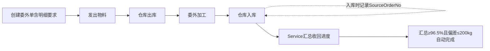

# 物料模块详细设计

> 版本：V3.9（2026-09-16）
> 本次变更（V3.9）：**文档与代码对账**。① §4.2 采购列表页列分组/列数按源码重写（实为 **5 组 46 列**：采购信息 16 / 工单实时关注 4 / 执行状态 5 / 来源销售订单 17 / 审计信息 4，原文「3 组 33 列」漏「工单实时关注」「审计信息」两组及 G1 计价单位·单价·总价三列）；工具栏按钮更正为「列显隐 + 重置 + 打印选中(N) + 共 N 条记录」（原文「打印全部 / +新建」不存在，新建在卡头「新建采购单」）；补记卡头 **6 个折叠卡**（荒管待购/荒管在购/荒管月度/成品待购/成品在购/成品月度）与「下单日期从/至」筛选。② §4.5 委外列表页折叠面板更正为「**工单圆棒穿孔计划执行状态**」（列含 工厂牌号/缺少量/工单关注/原锁执行/工单计划性，非「用料计划执行状态」）；列数 14 → **19 列定义（15 可见 + 4 审计默认隐藏，补「委外金额(元)」）**；工具栏按钮更正为「打印选中穿孔单 (N)」「打印选中列表」，新建按钮名「新建圆棒穿孔」。③ §6.3 补子项/圆棒穿孔 6 个端点的归口指引。④ 概述折叠卡表述补全为 6 卡。⑤ §4.6 子项查询首列语义与列分组更正——首列实为「**序号（= 子项序号 `Sequence`，可排序**」而非「#（当前页行号，不可排序）」；列分组由「两组」更正为**三组**（委外信息 15 / 工单实时关注 4 / 执行状态 6）。⑥ §4.6 加载方式由「全量加载+内存筛选」更正为**服务端分页 + 服务端筛选/排序**（`MudTable.ServerData` → `LoadDataFromServer`）。⑦ §4.4 采购详情页「操作」行更正——原文「无操作按钮」不实，实际有「返回」+「编辑」（`MaterialEdit`）/ 编辑态「取消」+「保存」。⑧ 概述状态口径更正——原文「委外**主表**/子项状态均含超量到货」不实，**委外主表只赋 3 态**（OverReceived 仅落子项，见 MAT-009 / MAT-012）。
> 历史版本（V3.8，2026-09-14）：供应商页双日期区间。
> 状态：**已实施完成**。物料上下文 = 采购（一单一料）+ 委外加工（一单多行 SubcontractReturnItem）+ 供应商档案三大板块，通过 SourceWorkOrderNo 字符串与工单上下文、入库/出库记 SourceOrderNo 与仓库上下文松耦合（无 FK/JOIN）。到货/收回进度由仓库入库/编辑/删除事件经 `SyncSourceOrdersAsync` 增量同步，前端无手动同步按钮；**采购单 4 档状态含「超量到货(OverReceived)」，委外仅子项 4 档含该态**——委外主表只赋 3 态（Sent/PartialReturned/Completed，见 MAT-009 / MAT-012），委外状态判定按**净回收 = 收回 − 退货**口径；退货量按「委外单号×序号」经 `SubcontractHelper.AggregateReturnsBySequence` 实时汇总（序号为空归序号 0）。委外子项查询页含圆棒穿孔（待穿孔/在穿孔/月度）3 折叠表，采购列表页含「荒管待购/荒管在购/荒管月度/成品待购/成品在购/成品月度」6 折叠卡。原物料档案 Material 主档已删除，无对应实体/页面/API/角色列。

---

## 一、概述

物料上下文涵盖"买（采购）+ 委外（加工）+ 供应商档案"三大板块，负责物资获取的全流程管理。通过字符串引用与工单上下文（来源工单号）和仓库上下文（入库/出库时记来源单号）松耦合衔接。

**简化设计：** 采购单采用 **一单一料** 模式，一个采购订单仅包含一项物料，无需独立的采购项次表。

---

## 二、核心流程

### 2.1 采购流程


### 2.2 委外加工流程



> **注意：** 与采购单同步不同，委外单同步不追踪 `LastArrivalDate`（委外单实体无此字段）。进度同步仅更新收回数量和重量。

---

## 三、业务规则

| 规则ID | 规则说明 |
|--------|----------|
| MAT-001 | 采购单采用一单一料设计，一个采购订单只包含一项物料 |
| MAT-002 | 到货进度由仓库入库记录触发：入库（BatchInboundAsync）/编辑（UpdateAsync）/删除（HardDeleteInventoryBatchAsync）时自动调用 SyncSourceOrdersAsync 按 SourceOrderNo 增量同步收货数量/重量/日期/状态，无需手动操作 |
| MAT-003 | 实物入库由仓库上下文完成，入库时记录 SourceOrderNo 用于追溯 |
| MAT-004 | 委外发出时由物料部门手工录入发出信息；收回进度由仓库入库记录触发，按 SourceOrderNo 汇总，入库/编辑/删除时自动增量同步，无需手动操作 |
| MAT-006 | 所有跨上下文字段均为字符串（无FK），业务完整性由Service层保证 |
| MAT-007 | 采购/委外单可独立存在（备料采购/常规补库），不强制关联工单 |
| MAT-008 | 委外采用一单多行设计：SubcontractReturnItem 子表记录加工要求+费用+工单号，不参与主表状态计算 |
| MAT-009 | 委外主表状态自动计算（**净回收口径**，2026-08-22）：净回收=Max(0, InWeight−退货量)；净回收为空或0→Sent，未达阈值→PartialReturned，净回收≥OutWeight×0.965且≥OutWeight−200kg→Completed（IsThresholdMet 逻辑，与采购同口径） |
| MAT-010 | 如需追溯销售订单/项次，通过 SourceWorkOrderNo → WorkOrder.SalesOrderNo 中转查询 |
| MAT-011 | 采购状态 4 档自动计算：ReceivedWeight=0→Open；到料重量>采购×超额比率(1.05) 且 超出量>超额偏差(100kg)→**超量到货(OverReceived)**（优先于完成判定）；≥完成阈值(0.965 且偏差≤200kg)→Completed；否则→Partial；强制完成固定 Completed 不判超量 |
| MAT-012 | 委外子项回收状态 4 档自动计算（RecalcReturnItemStatus，仿采购，**净回收口径** 2026-08-22）：IsForceCompleted→Completed；净量=Max(0, 回收量/重−退货量/重)，净量=0→Sent；净回收重量>需求×超额比率(SubcontractOverRatio=1.05) 且 超出量>超额偏差(SubcontractOverDeviation=100kg)→**超量到货(OverReceived)**（优先于完成判定）；净量≥需求量→Completed；否则→PartialReturned。**ReturnedQuantity/Weight 实体值仍存总回收（退货另列显示），净回收仅用于状态判定**。主表 SubcontractOrder.Status 聚合仍 3 态（Sent/PartialReturned/Completed），不产生 OverReceived |
| MAT-013 | 子项查询「退货量」实时汇总（**委外单号×序号级**，2026-08-22）：退货出库（OutboundType=ReturnOut）按 **ReturnSourceBatchNo（退货-原仓库批=原仓库批批次号）** 反查 InventoryBatch.BatchNo→SourceOrderNo==子项委外单号 且 **SourceOrderSequence==子项序号**（OrdinalIgnoreCase；批次序号为空→归入序号0不归集到明细）累加支/重量，不落库。共享 helper `SubcontractHelper.AggregateReturnsBySequence`（SubcontractOrderService.BuildReturnSummaryAsync 与 InventorySyncService.SyncSourceOrdersAsync 同口径）；委外单号级=各序号求和派生 |

---

## 四、页面设计

### 4.2 采购订单列表页

**路由：** `/purchase-orders`

**功能：** 采购订单列表，支持按供应商/状态筛选，到货进度由仓库入库事件驱动自动同步，多选打印。

| 筛选条件 | 说明 |
|----------|------|
| 搜索框 | 搜索采购单号/工单号/供应商/物料分类/钢种/规格 |
| 状态筛选 | 全部 / 已下单 / 部分到货 / 已完成 / **超量到货** |

**卡头折叠卡（`CardHeaderActions`，6 个折叠按钮 + 新建）：** 荒管待购 / 荒管在购 / **荒管月度** / 成品待购 / 成品在购 / **成品月度**（各按钮文案前带 ExpandMore/ExpandLess 图标，展开态高亮 Primary）+「新建采购单」（Filled Primary → `/purchase-orders/create`）。前四张分别对应 `api/purchase-order/summary/pending|in-progress|monthly`（`?isFinished=` 区分荒管/成品），懒加载 + DOM 打印。

**日期筛选：** 搜索栏同排含「下单日期从」「下单日期至」两个 `MudTextField`（`Placeholder="yyyy-MM-dd"`，禁 MudDatePicker）。

**表格列（按 GroupKey 分五组，支持列选择器显隐/排序，共46列）：**
- **G1 采购信息（GroupKey=1，16列）：** 采购单号(MudLink)、供应商、下单日期、来源工单号、物料分类（enum 筛选）、厂内钢种、规格、单支重量、支数、采购重量、计价单位（默认隐藏）、单价（默认隐藏）、总价（默认隐藏）、要求到货日、投料制成倍（默认隐藏）、采购备注（默认隐藏）
- **G2 工单实时关注（GroupKey=2，4列）：** 工单关注（enum，取自工单执行状况读模型按来源工单号关联，无记录显示"-"）、原锁执行备注、计划性、理论截止投料日（默认隐藏）
- **G3 执行状态（GroupKey=3，5列）：** 状态（enum）、到货截止日（=最后到货日期，按 `lastarrivaldate` 排序）、已到货量（0支/0kg 显示"-"）、退货量（按采购单号→仓库批→退货出库实时汇总支/重量，0支/0kg 显示"-"）、强制完成（是/-）
- **G4 来源销售订单（GroupKey=4，17列，默认隐藏）：** 订单号(Wo)、主号(Wo)、次号(Wo)、签订日期(Wo)、业务员(Wo)、最终用户(Wo)、交货日期(Wo)、延期罚款(Wo)、结算方式(Wo)、工厂牌号(Wo)、成品规格(Wo)、长度状态(Wo)、最大长度(Wo)、总支数(Wo)、总重量(Wo)、交货状态(Wo)、含项次数(Wo)
- **G5 审计信息（GroupKey=5，4列，默认隐藏）：** 创建人、创建时间、更新人、更新时间

**操作列：** [编辑] [取消]（仅Open/Partial状态显示；Admin 无视状态强制显示，带"管理员强制编辑/取消"提示）

**列选择器：** 支持46列定义的显隐切换和顺序拖动，列偏好通过 ColumnPrefsService 持久化到 localStorage
**搜索框：** 搜索采购单号/工单号/供应商/物料分类/钢种/规格，同时支持搜索 Wo* 字段（订单号/主号/业务员/最终用户/工厂牌号）
**列表工具栏（`div.list-toolbar`）：** 左 列显隐(`ColumnDisplaySelect`)+[重置]；右 [打印选中 (N)]（Outlined Info，未选中禁用）+「共 N 条记录」。新建入口在卡头（见上），列表页无可"打印全部"按钮

**列排序：** 后端排序，客户端显示▼/▲指示器（到货截止日按 lastarrivaldate 排序）

**打印说明：** 支持单条/批量/全部打印，使用 QuestPDF A4横向，平铺表格模式（按当前可见列输出；已到货量/退货量 0支/0kg 显示"-"，属强制完成 是/-）

**自动刷新：** 页面启用了定时轮询（每 2 分钟，`DisposeAsync` 释放），除刷新卡头 6 个状态折叠卡外同时刷新表格数据。

**同步说明：** 入库操作（批量入库/编辑/删除）时，Service 自动调用 SyncSourceOrdersAsync 按 SourceOrderNo 增量同步收货数量/重量/日期/状态，前端无手动同步按钮。

**采购单 API 端点：**
| 方法 | 路由 | 说明 |
|------|------|------|
| GET | /api/purchase-order/mismatched-orders | 采购单与工单用料计划关联异常检测 |

### 4.3 采购订单创建页

**路由：** `/purchase-orders/create`

**功能：** 创建采购订单，支持从工单用料计划执行状态快速添加行。

#### 页面布局

- **第一块：工单采购执行状态（可折叠区域）**
  - 默认展开，展开高度约 25vh，超出滚动
  - 折叠/展开由一个 MudPaper 卡片控制，标题右侧显示"未采购 N"（MudChip Error）/"部分采购 M"（MudChip Warning）
  - 展开后为简明表格（10 列）：工单号 | 物料分类 | 工厂牌号 | 计划总量(kg) | 已采购(kg) | 缺少量(kg) | 工单关注 | 原锁执行 | 工单计划性 | 状态
  - 状态用 MudChip 显示（红色=未采购，橙色=部分采购）
  - 完成阈值：已采购/已穿孔判定为 `total >= planWeight * 0.965 && total >= planWeight - 200`
  - 点击工单号自动在下方采购订单列表添加一条预填记录（不跳转页面）
  - 查询逻辑：按工单号+物料分类聚合 PurchaseOrder.Weight + SubcontractReturnItems.RequiredWeight，与用料计划总量比较
  - 添加行后折叠状态不变（完全由用户手动操作）

- **第二块：采购订单列表（多行编辑，17 列）**
  - 表格列：行号 | 下单日期 | 来源工单号[展开查看详情] | 物料分类* | 厂内钢种* | 规格* | 单支重量 | 支数 | 投料制成倍 | 采购重量* | 要求到货日期 | 备注 | 供应商* | 计价单位 | 单价 | 总价(元) | 操作（带 `*` 为必填）
  - 来源工单号旁展开的详情弹窗：工单号、订单号/主号/次号、厂内牌号、规格、交货状态、交货日期
  - 支持多行添加（首行可删除）
  - 提交后批量保存（CreatePurchaseOrderRequest 数组）

#### 供应商选择规则
- 供应商名称可能重复（同一名称可供应多种物料分类）
- 前端使用复合键（Name|Category）查询供应商
- 新建供应商记录时，自动填充当前行的 MaterialCategory

### 4.4 采购订单详情页

**路由：** `/purchase-orders/{id}`

**功能：** 查看采购订单详情，包括物料信息、到货进度（仓库入库自动同步）。

| 区域 | 内容 |
|------|------|
| 基本信息 | 采购单号、供应商、下单日期、状态、强制完成（MudSwitch开关）、来源工单号 |
| 物料信息 | 物料分类、钢种、规格、单支重、支数、重量、单价、金额 |
| 到货进度 | 已到货数量/重量 vs 采购数量/重量、最后到货日期、进度条 |
| 操作 | 无手动同步按钮（到货进度由仓库入库事件驱动自动同步）；卡头有「返回」+「编辑」（`MaterialEdit`）按钮，进入编辑态后变「取消」+「保存」，可编辑基本信息与计价信息（计价单位/单价/总价） |

### 4.5 委外加工单列表页（扁平排序表格）

**路由：** `/subcontract-orders`（**页标题「圆棒穿孔」**，图标 Handyman）

**功能：** 委外加工单列表，支持全字段模糊搜索、列排序、多选打印、工单圆棒穿孔计划执行状态展示。

| 筛选条件 | 说明 |
|----------|------|
| 搜索框 | 模糊搜索 单号/加工类型/物料分类/钢种/规格/供应商（`DebounceInterval=500`） |
| 下单日期 | 「下单日期从」「下单日期至」两个 `MudTextField`（`Placeholder="yyyy-MM-dd"`） |
| 列筛选 | 表头 `ExcelFilter` 下拉多选（按列 `FilterType`：string/date/enum） |

**工单圆棒穿孔计划执行状态（可折叠区域）：**
- 默认展开，标题右侧 3 个 MudChip 计数：未穿孔 N（Error）/ 部分穿孔 M（Warning）/ 超额穿孔 K（Error）
- 展开后表格列（10 列，max-height 25vh 内滚）：工单号、物料分类、工厂牌号、计划总量(kg)、已委外(kg)、**缺少量(kg)**、工单关注、原锁执行、工单计划性、状态（MudChip，未穿孔/超额穿孔=Error、部分穿孔=Warning）
- 数据源 `procurementItems`（无数据时整块不渲染）

**表格列（支持排序，共19列定义 = 15 可见 + 4 审计默认隐藏，支持列选择器显隐/排序）：** 委外单号(MudLink)、下单日期、加工类型、物料分类、工厂牌号、规格、发出支数、发出重量、收回期限、供应商、状态、**实发量**、已回收、**已退货**（X支/Ykg，净回收仅用于状态判定，退货另列显示）、**委外金额(元)**（可见）；创建人、创建时间、更新人、更新时间（ `Visible=false`，审计信息）

**操作列：** [编辑] [取消]（仅Sent/PartialReturned状态显示；Admin 无视状态强制显示，带"管理员强制编辑/取消"提示）
**列选择器：** 支持19列定义的显隐切换和顺序拖动，列偏好通过 ColumnPrefsService 持久化到 localStorage
**列表工具栏（`div.list-toolbar`）：** 左 列显隐(`ColumnDisplaySelect`)+[重置]；右 [打印选中穿孔单 (N)]（Outlined Info，未选中禁用）+ [打印选中列表]（Text Info，按可见列 Mode A）+「共 N 条记录」。新建入口在卡头「新建圆棒穿孔」

**列排序说明：** 支持委外单号/下单日期/加工类型/物料分类/工厂牌号/规格/发出支数/发出重量/收回期限/供应商/状态 列排序（后端排序，客户端显示▼/▲指示器）。

**打印说明：** 支持单条/批量/全部打印，使用 QuestPDF A4横向，"表头+明细"模式（仿订单管理），每单显示表头信息（委外单号/供应商/下单日期/加工类型/炉号/物料分类/牌号/规格/发出量/**已回收/退货量**/状态）和明细加工数据表（14列：序号/物料分类/加工牌号/加工规格/单重/需求支数/需求重量/**退货量**/投料倍率/加工状态/单价/金额/来源工单号/备注）

**实发量说明：** 实发量 = 仓库委外出库记录（OutboundType=SubcontractOut）按 SourceOrderNo 汇总的出库量。显示格式为"X支/Ykg"，与已回收列统一。数据来源：SubcontractOrderService.GetPagedAsync 每页查询 OutboundRecords 实时汇总。

**自动刷新：** 页面启用了定时轮询（每 2 分钟），除刷新采购计划状态面板外同时刷新表格数据，确保实发量在跨标签页出库后自动更新。

**同步说明：** 入库操作（批量入库/编辑/删除）时，Service 自动按 SourceOrderNo 增量同步收回数量/重量/状态，前端无手动同步按钮。

**委外单 API 端点：**
| 方法 | 路由 | 说明 |
|------|------|------|
| GET | /api/subcontract/mismatched-orders | 委外单与工单用料计划关联异常检测 |

### 4.6 子项查询列表页

**路由：** `/subcontract-return-items`

**功能：** 委外子项执行查询列表，只读模式。展示所有委外明细要求的加工执行状态，字段分三组展示，全列 ExcelFilter 筛选、列排序、打印选中。

| 筛选方式 | 说明 |
|----------|------|
| 模糊搜索 | 单号/工单号/供应商/牌号/规格 |
| 列筛选 | ExcelFilter 下拉多选（按列 `FilterType`，含 下单日期/要求到货日/退货量/强制完成） |

**表格列（支持列显隐切换、排序、列拖动，共25列定义 = 20 可见 + 5 默认隐藏，分三组，分组标题栏标色）：**
- **一、委外信息（GroupKey=1，15列）：** 序号（= 子项序号 `Sequence`，**可排序**，非「当前页行号」）、委外单号(MudLink)、供应商、下单日期（按主表 OrderDate）、来源工单号、牌号、规格、单重(kg)、需求支数、需求重量(kg)、要求到货日（按主表收回期限 ReturnDeadline）；另有 计价单位、加工单价、加工金额、委外备注（子项 Remark）四列 **`Visible=false` 默认隐藏**
- **二、工单实时关注（GroupKey=2，4列）：** 工单关注（enum，无记录显示"-"）、原锁执行备注、计划性、理论截止投料日（默认隐藏）
- **三、执行状态（GroupKey=3，6列）：** 执行状态（4 档 MudChip）、截止回收日（实际收回入库日期：按委外单号反查仓库批 InboundDate 最大值）、回收支数、回收重量(kg)、退货量（X支/Ykg 或 "-"）、强制完成（是/-）

**加载方式：** **服务端分页 + 服务端筛选/排序**（`MudTable` 用 `ServerData` → `LoadDataFromServer`，调 `GET api/subcontract/return-items/list` 分页端点，见表）；跨表字段 OrderNo/SupplierName/OrderDate/RequiredArrivalDate=ReturnDeadline 等导航属性字段通过 DTO 投影预解析；退货量按「委外单号×序号」粒度经共享 helper `SubcontractHelper.AggregateReturnsBySequence`（退货出库 `OutboundRecord.ReturnSourceBatchNo` 反查原仓库批 `SourceOrderNo==委外单号` 且 `SourceOrderSequence==序号`）实时汇总，委外单号级=各序号求和派生，截止回收日=仓库批 InboundDate 最大值；筛选/排序/分页均由服务端完成）

**特殊说明：**
- 执行状态显示中文（SubcontractOrderStatus 枚举映射，MudChip 颜色与采购订单一致）：Sent→已发出、PartialReturned→部分收回、Completed→已完成、**OverReceived→超量到货（红）**
- 执行状态筛选值通过 EnumOptions 映射为中文显示，实际筛选值保持英文枚举名
- 复选框多选 + [打印选中] 按钮
- 退货量关联链（序号级）：`OutboundRecord.ReturnSourceBatchNo`（退货-原仓库批）→ 反查 `InventoryBatch.BatchNo` → `SourceOrderNo`==子项委外单号（OrdinalIgnoreCase）**且 `SourceOrderSequence`==子项序号**，仅统计退货出库（OutboundType=ReturnOut）；批次序号为空→归入序号0（不匹配任何子项 1..n，即不归集到明细）；委外单号级退货量=各序号求和派生。共享 helper `SubcontractHelper.AggregateReturnsBySequence`（SubcontractOrderService.BuildReturnSummaryAsync 与 InventorySyncService.SyncSourceOrdersAsync 共用，退货口径一致）
- **截止回收日 ≠ 要求到货日**：要求到货日=主表收回期限 `SubcontractOrder.ReturnDeadline`（计划值）；截止回收日=同一批仓库批 `InventoryBatch.InboundDate` 最大值（实际收回入库日期，未回收入库则为空），随退货量一并内存补充

**子项查询 API 端点：**
| 方法 | 路由 | 说明 |
|------|------|------|
| GET | /api/subcontract/return-items/list | 分页查询子项列表（关键字段/状态参数 + 筛选器 JSON） |
| GET | /api/subcontract/return-items/filter-contexts | 获取列筛选上下文（各列可选值） |
| POST | /api/subcontract/return-items/print-selected-file | 打印选中的子项（body: ids + columns） |

### 4.6.1 圆棒穿孔汇总折叠表（3个）

**路由：** `/subcontract-return-items`（子项查询页顶部，CardHeaderActions 3 个折叠按钮「圆钢待穿孔 / 圆钢在穿孔 / 圆钢月度穿孔数据」+ 懒加载 + 各表独立「打印」按钮走 DOM 打印）

**定位：** 委外子项页面内的圆钢穿孔汇总折叠表（不放圆棒穿孔首页，防误导）。三种汇总口径不同——待穿孔看「缺料计划」，在穿孔/月度看「已下委外子项执行」。

**① 圆钢待穿孔（= 圆钢缺少量）**
- **数据源：** 圆棒穿孔计划 `RoundBarPiercingPlan` 需求 − 已下委外量（委外子项 `SubcontractReturnItem` 按 `SourceWorkOrderNo` 聚合 `RequiredWeight`），口径与 `PurchaseOrderService.GetPiercingProcurementStatusAsync`（计划−已委外）完全一致
- **行 = 工单（按 WorkOrderId 聚合）**；`MissingWeight = Max(0, 计划需求 − 已下委外量)`，仅显示 `>0` 行
- **列对齐「荒管待购」：** 工单号、工单关注（档位 chip）、原锁执行、工单计划性、钢种（多值合并）、穿孔规格（多值合并）、缺少量(kg)（取整、0 留空，同 FormatPendingWeight）
- **无委外单号/序号/委外单位列**——待穿孔的委外单位尚未决定（根本未下委外单）
- 私有 helper `BuildExecutionMapAsync` 从 `WorkOrderExecutionSummary` 查工单关注/原锁/计划性

**② 圆钢在穿孔（二维 委外单位×加工规格）**
- 未完成子项 `Max(0, 需求 − 净回收)` 按（委外单位×加工规格）聚合（不含急量），含合计行
- 委外单位 = 主表 `SupplierName` 快照，空 →「未填写单位」

**③ 圆钢月度穿孔数据（二维 委外单位×1~12月）**
- 单元格「发X/回Y」：发=需求（按下单日期分月，仅本年）、回=净回收；含合计列 + 现在穿橙底列（未完成子项待穿孔，不分规格，Max 0）+ 合计行

**汇总口径：** 在穿孔/月度保留子项口径；在穿孔/月度显示单位 t（kg/1000 F1，0 值留空）；待穿孔显示 kg（取整，0 留空）。净回收 = 回收量 − 退货量（序号级退货量经 `BuildReturnSummaryAsync` 复用），与主表/子表状态判定同口径。

**圆棒穿孔汇总 API 端点：**
| 方法 | 路由 | 说明 |
|------|------|------|
| GET | /api/subcontract/piercing-pending | 待穿孔（List\<SubcontractPiercingPendingDto\>，行=工单，含工单关注） |
| GET | /api/subcontract/piercing-in-progress | 在穿孔（SubcontractPiercingInProgressResultDto，委外单位×加工规格+合计行） |
| GET | /api/subcontract/piercing-monthly | 月度（SubcontractPiercingMonthlyResultDto，委外单位×1~12月+合计+现在穿+合计行） |

### 4.7 委外加工单详情页

**路由：** `/subcontract-orders/{id}`

**功能：** 查看委外加工单详情，包括发出物料、委外明细要求、收回汇总（仓库入库自动同步）。

| 区域 | 内容 |
|------|------|
| 基本信息 | 委外单号、供应商、下单日期、状态、强制完成（MudSwitch开关）、来源工单号[查看] |
| 发出物料 | 物料分类、钢种、规格、支数、重量 |
| 委外明细要求 | 行号、加工类型、加工后分类、加工规格、单重、需求支数、需求重量、**退货量**（returnedweight 后）、投料倍率、状态备注、加工单价、加工总价、工单号[查看] |
| 收回汇总 | 收回截止日期、收回支数、收回重量、**退货总量**（inweight 后，X支/Ykg）——状态按**净回收=Max(0, 收回重量−退货总量)**判定：净回收为空或0→已发出、未达阈值→部分收回、净回收≥发出重量×96.5%且偏差≤200kg→已完成（仓库同步自动） |
| 操作 | 列表页操作列：详情、取消；无收回登记按钮（收回进度由仓库同步） |

### 4.9 委外加工单创建页

**路由：** `/subcontract-orders/create`

**页面文件：** `MES.Blazor/Pages/Materials/SubcontractOrderCreate.razor`

**功能说明：** 创建委外加工单，填写委外信息、发出物料、委外明细要求等，支持从用料计划快速添加。

### 4.10 供应商列表页

**路由：** `/suppliers`

**页面文件：** `MES.Blazor/Pages/Materials/Suppliers.razor`

**功能说明：** 供应商档案列表，支持搜索、筛选、维护。列分两分组展示（表头分组栏 + 数据区同色标底）：
- **① 基本信息（GroupKey=1）：** 供应商编码/名称、物料分类（中文）、联系人/电话、地址、启用状态、备注等 8 列（内联编辑，枚举/布尔转中文文案）。
- **② 往来信息（GroupKey=2，仿客户管理/委外单位 V74 口径，只读 11 列）：** 累计（单数+吨+金额万）、本年（单数+吨+金额万）、本年到货[扣除退货]（吨+货款万）、待收货（吨+货款万）、本年退货（吨）；数据由 Service 层 `AttachTradeStatsAsync`（页内档案行「名+物料分类」命中采购/委外单）回填，页脚按②列合计。吨/金额单列均按 F1 显示、全 0 显「—」，单元格左对齐。
- **工具栏：** 列显隐/排序 + [打印选中(N)]（Mode A `print-list-file`，按当前可见列——含② 统计列文本——渲染列表 PDF）+ 页脚合计。
- **日期区间（2026-09-14 新增，双区间互相独立可叠加）：** 搜索栏下方一行「**出单日期起/止 + 应用出单区间 + 清除**」→ `MudDivider` →「**到货日期起/止 + 应用到货区间 + 清除**」→（有区间时）「清空全部区间」，区间生效时下方追加口径提示条。
  - **出单区间**（`QueryParams.SupplierOrderDateFrom/To`，任一端有值即生效）——「本年出单」改按采购/委外单 `OrderDate` 落区间统计，表头改称「**区间出单**」。
  - **到货区间**（`QueryParams.SupplierArrivalDateFrom/To`）——「本年到货[扣除退货]」改按入厂批 `InventoryBatch.InboundDate`、「本年退货」改按退货出库 `OutboundRecord.OutboundDate` 落区间统计（两列同源同一窗口），表头改称「**区间到货[扣除退货]**」「**区间退货**」。
  - **未激活列（含累计出单、待收货）置灰色「—」**（口径为自然年/全时段/当前存量，与所选区间不同源）；服务端 `GetPagedInRangeModeAsync` 同步做**行过滤**（只返回激活列有数据的供应商行，`TotalCount` = 过滤后条数），与报表总览「供应商往来数据」卡同口径。
  - 页面实现：`Suppliers.razor.cs` 新增 `_orderDateFrom/_To`、`_arrivalDateFrom/_To`、`OrderRangeMode`/`ArrivalRangeMode`/`AnyRangeMode`、`ActiveTradeColumns()`（键名 `YearOrdering`/`Arrived`/`YearReturn`）、`IsTradeColumnActive`、`TradeColumnLabel(col)`、`RangeHint()`、`ParseRangeDate`、`ApplyRangeAsync`。

### 4.11 供应商创建页

**路由：** `/suppliers/create`

**页面文件：** `MES.Blazor/Pages/Materials/SupplierCreate.razor`

**功能说明：** 创建/编辑供应商信息，填写供应商名称、物料分类、联系方式等。

---

## 五、跨上下文查询链路

```
采购单追溯销售订单：
  PurchaseOrder.SourceWorkOrderNo
    → WorkOrder.WorkOrderNo
      → WorkOrder.SalesOrderNo（源订单号）
      → WorkOrder.OrderItemIds（项次序号列表，逗号分隔）

委外单追溯销售订单：
  SubcontractReturnItem.SourceWorkOrderNo（子表行级工单号）
    → WorkOrder.WorkOrderNo
      → WorkOrder.SalesOrderNo（源订单号）
      → WorkOrder.OrderItemIds（项次序号列表，逗号分隔）
```

> 所有跨上下文查询均通过字符串引用在应用层完成，不涉及数据库FK或JOIN。

---

## 六、API 控制器

> ⚠️ **跨上下文标注**：`(→仓库)` 表示从仓库汇总到货/收回数据，`(→工单)` 表示读取用料计划数据，数据所有权在对应上下文。

### 6.2 采购订单 API

| Controller | 路由前缀 | 文件 |
|-----------|---------|------|
| PurchaseOrderController | `api/purchase-order` | `MES.Api/Controllers/Materials/PurchaseOrderController.cs` |

| 方法 | 路由 | 说明 |
|------|------|------|
| GET | `api/purchase-order/list` | 分页查询采购订单列表 |
| GET | `api/purchase-order/{id}` | 获取采购订单详情 |
| POST | `api/purchase-order` | 创建采购订单 |
| POST | `api/purchase-order/batch` | 批量创建采购订单 |
| PUT | `api/purchase-order/{id}` | 更新采购订单 |
| PUT | `api/purchase-order/{id}/status` | 更新采购订单状态 |
| DELETE | `api/purchase-order/{id}` | 删除采购订单 |
| GET | `api/purchase-order/filter-contexts` | 筛选上下文 |
| GET | `api/purchase-order/procurement-status` | 采购状态概览 |
| GET | `api/purchase-order/summary/pending` | 采购待购折叠表（?isFinished= 区分荒管/成品，行=工单×物料分类） |
| GET | `api/purchase-order/summary/in-progress` | 采购在购折叠表（?isFinished=） |
| GET | `api/purchase-order/summary/monthly` | 采购月度折叠表（?isFinished=） |
| GET | `api/purchase-order/mismatched-orders` | 采购单异常检测 (→工单) |
| POST | `api/purchase-order/print-batch-file` | 批量打印采购订单（PDF文件） |
| GET | `api/purchase-order/plan-detail` | 用料计划详情 (→工单) |

### 6.3 委外加工单 API

| Controller | 路由前缀 | 文件 |
|-----------|---------|------|
| SubcontractOrderController | `api/subcontract` | `MES.Api/Controllers/Materials/SubcontractOrderController.cs` |

| 方法 | 路由 | 说明 |
|------|------|------|
| GET | `api/subcontract/list` | 分页查询委外订单列表 |
| GET | `api/subcontract/{id}` | 获取委外订单详情 |
| POST | `api/subcontract` | 创建委外订单 |
| PUT | `api/subcontract/{id}` | 更新委外订单 |
| PUT | `api/subcontract/{id}/status` | 更新委外订单状态 |
| DELETE | `api/subcontract/{id}` | 删除委外订单 |
| GET | `api/subcontract/filter-contexts` | 筛选上下文 |
| GET | `api/subcontract/procurement-status` | 采购状态概览 |
| GET | `api/subcontract/mismatched-orders` | 委外单异常检测 (→工单) |
| POST | `api/subcontract/print-batch-file` | 批量打印委外订单（PDF文件） |
| POST | `api/subcontract/print-list-file` | 按可见列打印委外列表（PDF文件） |
| GET | `api/subcontract/plan-detail` | 用料计划详情 (→工单) |

> 同 Controller 另含**子项查询与圆棒穿孔 6 个端点**（`return-items/list`、`return-items/filter-contexts`、`return-items/print-selected-file`、`piercing-pending`、`piercing-in-progress`、`piercing-monthly`），归口详见 §4.6 / §4.6.1，此处不再重复。全部端点权限 = `MaterialView`（写操作 `MaterialEdit`、删除 `MaterialDelete`）。

### 6.4 供应商 API

| Controller | 路由前缀 | 文件 |
|-----------|---------|------|
| SupplierController | `api/supplier` | `MES.Api/Controllers/Materials/SupplierController.cs` |

| 方法 | 路由 | 说明 |
|------|------|------|
| GET | `api/supplier/list` | 分页查询供应商列表 |
| GET | `api/supplier/{id}` | 获取供应商详情 |
| POST | `api/supplier` | 创建供应商 |
| POST | `api/supplier/batch` | 批量创建供应商 |
| PUT | `api/supplier/{id}` | 更新供应商 |
| DELETE | `api/supplier/{id}` | 删除供应商 |
| GET | `api/supplier/filter-contexts` | 筛选上下文 |
| POST | `api/supplier/print-batch-file` | 批量打印供应商（PDF文件） |
| POST | `api/supplier/print-list-file` | 打印选中列表（Mode A，请求体 OrderPrintListRequest，按当前可见列含② 统计列文本，PDF文件） |
| GET | `api/supplier/active` | 获取启用的供应商列表 |

---

## 七、角色权限

| 角色 | 采购读 | 采购写 | 委外读 | 委外写 |
|------|--------|--------|--------|--------|
| MaterialViewer/MaterialEditor/MaterialFull/ReportViewer/ReportEditor/ReportFull/Admin | ✅ | ✅ | ✅ | ✅ |
| MaterialEditor/MaterialFull/Admin | ✅ | ✅ | ✅ | ✅ |
| Admin | ✅ | ✅ | ✅ | ✅ |

> ⚠️ 「物料读/物料写」列已随物料档案主档删除而移除；MaterialViewer/MaterialEditor/MaterialFull/ReportViewer/ReportEditor/ReportFull/Admin 角色保留，供采购/委外/供应商页面授权。

---

## 九、总结

```yaml
已定义内容:
  - 采购全流程（一单一料，仓库同步到货进度） ✅
  - 委外全流程（一单多明细要求，仓库同步收回进度） ✅
  - 供应商档案管理 ✅
  - 角色权限 ✅
  - 松耦合设计（跨上下文字符串） ✅
  - 跨上下文查询链路 ✅
  - 委外96.5%完成规则 ✅
  - 采购订单创建页工单用料执行状态展示 ✅
  - 供应商复合键（Name|Category）查询 ✅
  - 多行编辑采购列表（首行可删） ✅

一句话:
  - 物料上下文通过采购和委外两大流程实现物资获取，
  - 到货/收回进度均从仓库入库记录自动同步，
  - 仅通过字符串引用与工单和仓库上下文衔接。
```
