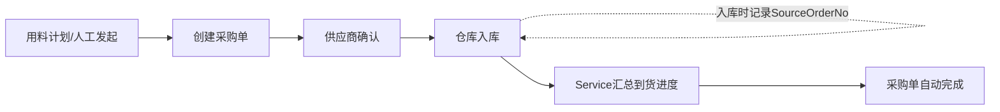
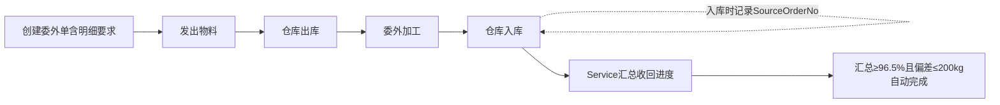

# 物料模块详细设计

**版本：V3.1**
**最后更新：2026-08-15**

---

## 一、概述

物料上下文涵盖"买（采购）+ 委外（加工）+ 管（主数据）"三大板块，负责物资获取的全流程管理。通过字符串引用与工单上下文（来源工单号）和仓库上下文（入库/出库时记来源单号）松耦合衔接。

**简化设计：** 采购单采用 **一单一料** 模式，一个采购订单仅包含一项物料，无需独立的采购项次表。

---

## 二、核心流程

### 2.1 采购流程



### 2.2 委外加工流程



> **注意：** 与采购单同步不同，委外单同步不追踪 `LastArrivalDate`（委外单实体无此字段）。进度同步仅更新收回数量和重量。

---

## 三、业务规则

| 规则ID | 规则说明 |
|--------|----------|
| MAT-001 | 采购单采用一单一料设计，一个采购订单只包含一项物料 |
| MAT-002 | 到货进度由仓库入库记录触发：入库（BatchInboundAsync）/编辑（UpdateAsync）/删除（HardDeleteInventoryBatchAsync）时自动调用 SyncSourceOrdersAsync 按 SourceOrderNo 增量同步收货数量/重量/日期/状态，无需手动操作 |
| MAT-003 | 实物入库由仓库上下文完成，入库时记录 SourceOrderNo 用于追溯 |
| MAT-004 | 委外发出时由物料部门手工录入发出信息；收回进度由仓库入库记录触发，按 SourceOrderNo 汇总，入库/编辑/删除时自动增量同步，无需手动操作 |
| MAT-005 | 物料档案新建即启用，无需审核 |
| MAT-006 | 所有跨上下文字段均为字符串（无FK），业务完整性由Service层保证 |
| MAT-007 | 采购/委外单可独立存在（备料采购/常规补库），不强制关联工单 |
| MAT-008 | 委外采用一单多行设计：SubcontractReturnItem 子表记录加工要求+费用+工单号，不参与主表状态计算 |
| MAT-009 | 委外状态自动计算：InWeight为空或0→Sent，未达阈值→PartialReturned，≥OutWeight×0.965且≥OutWeight−200kg→Completed（IsThresholdMet 逻辑） |
| MAT-010 | 如需追溯销售订单/项次，通过 SourceWorkOrderNo → WorkOrder.OrderNo 中转查询 |

---

## 四、页面设计

### 4.1 物料列表页

**路由：** `/materials`

**功能：** 物料档案列表，支持搜索、筛选。

| 筛选条件 | 说明 |
|----------|------|
| 搜索框 | 模糊搜索物料分类/钢种/规格 |

**表格列：** 物料编码、物料分类、厂内钢种、名义规格、创建时间、操作

**物料 API 端点：**
| 方法 | 路由 | 说明 |
|------|------|------|
| POST | /api/material/batch-match | 批量匹配物料号 |

### 4.2 采购订单列表页

**路由：** `/purchase-orders`

**功能：** 采购订单列表，支持按供应商/状态筛选，到货进度由仓库入库事件驱动自动同步，多选打印。

| 筛选条件 | 说明 |
|----------|------|
| 搜索框 | 搜索采购单号/工单号/供应商/物料分类/钢种/规格 |
| 状态筛选 | 全部 / 已下单 / 部分到货 / 已完成 |

**表格列（支持排序，共31列，支持列选择器显隐/排序）：** 采购单号(MudLink)、状态、供应商、下单日期、要求到货日、已到货(合并列)、物料分类、厂内钢种、规格、单支重量、支数、采购重量、投料制成倍、来源工单号、订单号(Wo)、主号(Wo)、次号(Wo)、签订日期(Wo)、业务员(Wo)、最终用户(Wo)、交货日期(Wo)、延期罚款(Wo)、结算方式(Wo)、工厂牌号(Wo)、成品规格(Wo)、长度状态(Wo)、最大长度(Wo)、总支数(Wo)、总重量(Wo)、交货状态(Wo)、含项次数(Wo)

**操作列：** [编辑] [取消]（仅Open/Partial状态显示；Admin 无视状态强制显示，带"管理员强制编辑/取消"提示）

**列选择器：** 支持31列的显隐切换和顺序拖动，列偏好通过 ColumnPrefsService 持久化到 localStorage
**搜索框：** 搜索采购单号/工单号/供应商/物料分类/钢种/规格，同时支持搜索 Wo* 字段（订单号/主号/业务员/最终用户/工厂牌号）
**工具栏按钮：** [打印选中] [打印全部] [+新建]

**列排序：** 后端排序，客户端显示▼/▲指示器

**打印说明：** 支持单条/批量/全部打印，使用 QuestPDF A4横向，平铺表格模式（含序号/采购单号/下单日期/物料分类/牌号/规格/支数/重量/供应商/要求到货日/状态/已到货）

**同步说明：** 入库操作（批量入库/编辑/删除）时，Service 自动调用 SyncSourceOrdersAsync 按 SourceOrderNo 增量同步收货数量/重量/日期/状态，无需手动操作。前端已移除"即时更新"按钮。

**采购单 API 端点：**
| 方法 | 路由 | 说明 |
|------|------|------|
| GET | /api/purchase-order/mismatched-orders | 采购单与工单用料计划关联异常检测 |

### 4.3 采购订单创建页

**路由：** `/purchase-orders/create`

**功能：** 创建采购订单，支持从工单用料计划执行状态快速添加行。

#### 页面布局

- **第一块：工单用料计划执行状态（可折叠区域）**
  - 默认展开，展开高度约 25vh，超出滚动
  - 折叠/展开由一个 MudPaper 卡片控制，顶部显示"未采购 N 项 / 部分采购 M 项"（MudChip 红/橙色标签）
  - 展开后为简明表格：工单号 | 物料分类 | 计划总量(kg) | 已采购(kg) | 已委外(kg) | 合计(kg) | 状态
  - 状态用 MudChip 显示（红色=未采购，橙色=部分采购）
  - 完成阈值：已采购/已穿孔判定为 `total >= planWeight * 0.965 && total >= planWeight - 200`
  - 点击工单号自动在下方采购订单列表添加一条预填记录（不跳转页面）
  - 查询逻辑：按工单号+物料分类聚合 PurchaseOrder.Weight + SubcontractReturnItems.RequiredWeight，与用料计划总量比较
  - 添加行后折叠状态不变（完全由用户手动操作）

- **第二块：采购订单列表（多行编辑）**
  - 表格列：来源工单号[展开查看详情] | 物料分类 | 供应商 | 单价 | 厂内钢种 | 规格 | 单支重量 | 支数 | 采购重量 | 要求到货日期 | 备注 | 操作
  - 来源工单号旁展开的详情弹窗：工单号、订单号/主号/次号、厂内牌号、规格、交货状态、交货日期
  - 支持多行添加（首行可删除）
  - 提交后批量保存（CreatePurchaseOrderRequest 数组）

#### 供应商选择规则
- 供应商名称可能重复（同一名称可供应多种物料分类）
- 前端使用复合键（Name|Category）查询供应商
- 新建供应商记录时，自动填充当前行的 MaterialCategory

### 4.4 采购订单详情页

**路由：** `/purchase-orders/{id}`

**功能：** 查看采购订单详情，包括物料信息、到货进度（仓库入库自动同步）。

| 区域 | 内容 |
|------|------|
| 基本信息 | 采购单号、供应商、下单日期、状态、强制完成（MudSwitch开关）、来源工单号 |
| 物料信息 | 物料分类、钢种、规格、单支重、支数、重量、单价、金额 |
| 到货进度 | 已到货数量/重量 vs 采购数量/重量、最后到货日期、进度条 |
| 操作 | 无操作按钮（到货进度由仓库入库事件驱动自动同步，前端"即时更新"按钮已移除） |

### 4.5 委外加工单列表页（扁平排序表格）

**路由：** `/subcontract-orders`

**功能：** 委外加工单列表，支持全字段模糊搜索、列排序、多选打印、用料计划执行状态展示。

| 筛选条件 | 说明 |
|----------|------|
| 搜索框 | 全字段模糊搜索（单号/加工类型/物料分类/钢种/规格/供应商） |
| 状态筛选 | 全部 / 已发出 / 部分收回 / 已完成 |

**用料计划执行状态（可折叠区域）：**
- 默认展开，显示"未采购 N 项 / 部分采购 M 项"
- 展开后表格列：工单号、物料分类、计划总量、已采购、已委外、合计、状态（MudChip）
- 完成阈值：已采购/已穿孔判定为 `total >= planWeight * 0.965 && total >= planWeight - 200`

**表格列（支持排序，共13列，支持列选择器显隐/排序）：** 委外单号(MudLink)、下单日期、加工类型、物料分类、工厂牌号、规格、发出支数、发出重量、收回期限、供应商、状态、**实发量**、已回收

**操作列：** [编辑] [取消]（仅Sent/PartialReturned状态显示；Admin 无视状态强制显示，带"管理员强制编辑/取消"提示）
**列选择器：** 支持13列的显隐切换和顺序拖动，列偏好通过 ColumnPrefsService 持久化到 localStorage
**搜索框：** 全字段模糊搜索
**工具栏按钮：** [打印选中] [打印全部] [+新建]

**列排序说明：** 支持委外单号/下单日期/加工类型/物料分类/工厂牌号/规格/发出支数/发出重量/收回期限/供应商/状态 列排序（后端排序，客户端显示▼/▲指示器）。

**打印说明：** 支持单条/批量/全部打印，使用 QuestPDF A4横向，"表头+明细"模式（仿订单管理），每单显示表头信息（委外单号/供应商/下单日期/加工类型/炉号/物料分类/牌号/规格/发出量/状态）和明细加工数据表（13列：序号/物料分类/加工牌号/加工规格/单重/需求支数/需求重量/投料倍率/加工状态/单价/金额/来源工单号/备注）

**实发量说明：** 实发量 = 仓库委外出库记录（OutboundType=SubcontractOut）按 SourceOrderNo 汇总的出库量。显示格式为"X支/Ykg"，与已回收列统一。数据来源：SubcontractOrderService.GetPagedAsync 每页查询 OutboundRecords 实时汇总。

**自动刷新：** 页面启用了定时轮询（每 2 分钟），除刷新采购计划状态面板外同时刷新表格数据，确保实发量在跨标签页出库后自动更新。

**同步说明：** 入库操作（批量入库/编辑/删除）时，Service 自动按 SourceOrderNo 增量同步收回数量/重量/状态。前端已移除"即时更新"按钮。

**委外单 API 端点：**
| 方法 | 路由 | 说明 |
|------|------|------|
| GET | /api/subcontract/mismatched-orders | 委外单与工单用料计划关联异常检测 |

### 4.6 子项查询列表页

**路由：** `/subcontract-return-items`

**功能：** 委外子项执行查询列表，只读模式。展示所有委外明细要求的加工执行状态，全列 ExcelFilter 筛选、列排序、打印选中。

| 筛选方式 | 说明 |
|----------|------|
| 模糊搜索 | 单号/工单号/供应商/牌号/规格 |
| 列筛选 | ExcelFilter 下拉多选（委外单号/供应商/来源工单号/牌号/规格/截止回收日/执行状态） |

**表格列（支持列显隐切换、排序，共12列）：** 复选框、#、委外单号、供应商、来源工单号、牌号、规格、单重(kg)、需求支数、需求重量(kg)、截止回收日、回收支数、回收重量(kg)、执行状态

**加载方式：** 全量加载+内存筛选（跨表字段 OrderNo/ReturnDeadline 等导航属性字段通过 DTO 投影预解析，筛选/排序均在内存 List 中完成）

**特殊说明：**
- 执行状态显示中文（SubcontractOrderStatus 枚举映射）：Sent→已发出、PartialReturned→部分收回、Completed→已完成
- 执行状态筛选值通过 EnumOptions 映射为中文显示，实际筛选值保持英文枚举名
- 复选框多选 + [打印选中] 按钮

**子项查询 API 端点：**
| 方法 | 路由 | 说明 |
|------|------|------|
| GET | /api/subcontract/return-items/list | 分页查询子项列表（关键字段/状态参数 + 筛选器 JSON） |
| GET | /api/subcontract/return-items/filter-contexts | 获取列筛选上下文（各列可选值） |
| POST | /api/subcontract/return-items/print-selected-file | 打印选中的子项（body: ids + columns） |
| POST | /api/subcontract/return-items/print-all-file | 打印全部子项（body: keyword + sortBy + columns） |

### 4.7 委外加工单详情页

**路由：** `/subcontract-orders/{id}`

**功能：** 查看委外加工单详情，包括发出物料、委外明细要求、收回汇总（仓库入库自动同步）。

| 区域 | 内容 |
|------|------|
| 基本信息 | 委外单号、供应商、下单日期、状态、强制完成（MudSwitch开关）、来源工单号[查看] |
| 发出物料 | 物料分类、钢种、规格、支数、重量 |
| 委外明细要求 | 行号、加工类型、加工后分类、加工规格、单重、需求支数、需求重量、投料倍率、状态备注、加工单价、加工总价、工单号[查看] |
| 收回汇总 | 收回截止日期、收回支数、收回重量（仓库同步，≥发出96.5%且偏差≤200kg自动完成） |
| 操作 | 列表页操作列：详情、取消；无收回登记按钮（收回进度由仓库同步） |

### 4.8 物料创建页

**路由：** `/materials/create`

**页面文件：** `MES.Blazor/Pages/Materials/MaterialCreate.razor`

**功能说明：** 创建物料档案，填写物料编码、物料分类、厂内钢种、名义规格等信息。

### 4.9 委外加工单创建页

**路由：** `/subcontract-orders/create`

**页面文件：** `MES.Blazor/Pages/Materials/SubcontractOrderCreate.razor`

**功能说明：** 创建委外加工单，填写委外信息、发出物料、委外明细要求等，支持从用料计划快速添加。

### 4.10 供应商列表页

**路由：** `/suppliers`

**页面文件：** `MES.Blazor/Pages/Materials/Suppliers.razor`

**功能说明：** 供应商档案列表，支持搜索、筛选、维护。

### 4.11 供应商创建页

**路由：** `/suppliers/create`

**页面文件：** `MES.Blazor/Pages/Materials/SupplierCreate.razor`

**功能说明：** 创建/编辑供应商信息，填写供应商名称、物料分类、联系方式等。

---

## 五、跨上下文查询链路

```
采购单追溯销售订单：
  PurchaseOrder.SourceWorkOrderNo
    → WorkOrder.WorkOrderNo
      → WorkOrder.OrderNo（销售订单号）
      → WorkOrder.ItemSequence（销售项次号）

委外单追溯销售订单：
  SubcontractReturnItem.SourceWorkOrderNo（子表行级工单号）
    → WorkOrder.WorkOrderNo
      → WorkOrder.OrderNo（销售订单号）
      → WorkOrder.ItemSequence（销售项次号）
```

> 所有跨上下文查询均通过字符串引用在应用层完成，不涉及数据库FK或JOIN。

---

## 六、API 控制器

> ⚠️ **跨上下文标注**：`(→仓库)` 表示从仓库汇总到货/收回数据，`(→工单)` 表示读取用料计划数据，数据所有权在对应上下文。

### 6.1 物料 API

| Controller | 路由前缀 | 文件 |
|-----------|---------|------|
| MaterialController | `api/material` | `MES.Api/Controllers/Materials/MaterialController.cs` |

| 方法 | 路由 | 说明 |
|------|------|------|
| GET | `api/material/list` | 分页查询物料列表 |
| GET | `api/material/all` | 全量查询物料列表 |
| GET | `api/material/{id}` | 获取单个物料 |
| GET | `api/material/match` | 按分类/钢种/规格匹配物料 |
| POST | `api/material/batch-match` | 批量匹配物料 |
| POST | `api/material` | 创建物料 |
| POST | `api/material/batch` | 批量创建物料 |
| PUT | `api/material/{id}` | 更新物料 |
| DELETE | `api/material/{id}` | 删除物料 |
| GET | `api/material/filter-contexts` | 筛选上下文 |
| POST | `api/material/print-single` | 打印物料 |
| POST | `api/material/print-single-file` | 打印物料（PDF文件） |
| POST | `api/material/print-batch` | 批量打印物料 |
| POST | `api/material/print-batch-file` | 批量打印物料（PDF文件） |
| POST | `api/material/print-all` | 全部打印物料 |
| POST | `api/material/print-all-file` | 全部打印物料（PDF文件） |
| GET | `api/material/categories` | 获取物料类别列表 |
| GET | `api/material/active` | 获取启用的物料列表 |

### 6.2 采购订单 API

| Controller | 路由前缀 | 文件 |
|-----------|---------|------|
| PurchaseOrderController | `api/purchase-order` | `MES.Api/Controllers/Materials/PurchaseOrderController.cs` |

| 方法 | 路由 | 说明 |
|------|------|------|
| GET | `api/purchase-order/list` | 分页查询采购订单列表 |
| GET | `api/purchase-order/all` | 全量查询采购订单 |
| GET | `api/purchase-order/{id}` | 获取采购订单详情 |
| POST | `api/purchase-order` | 创建采购订单 |
| POST | `api/purchase-order/batch` | 批量创建采购订单 |
| PUT | `api/purchase-order/{id}` | 更新采购订单 |
| PUT | `api/purchase-order/{id}/status` | 更新采购订单状态 |
| DELETE | `api/purchase-order/{id}` | 删除采购订单 |
| POST | `api/purchase-order/sync-all` | 全量同步采购订单 (→仓库) |
| POST | `api/purchase-order/{id}/sync` | 单个同步采购订单 (→仓库) |
| GET | `api/purchase-order/filter-contexts` | 筛选上下文 |
| GET | `api/purchase-order/procurement-status` | 采购状态概览 |
| GET | `api/purchase-order/mismatched-orders` | 采购单异常检测 (→工单) |
| POST | `api/purchase-order/print-single` | 打印采购订单 |
| POST | `api/purchase-order/print-single-file` | 打印采购订单（PDF文件） |
| POST | `api/purchase-order/print-batch` | 批量打印采购订单 |
| POST | `api/purchase-order/print-batch-file` | 批量打印采购订单（PDF文件） |
| POST | `api/purchase-order/print-all` | 全部打印采购订单 |
| POST | `api/purchase-order/print-all-file` | 全部打印采购订单（PDF文件） |
| GET | `api/purchase-order/plan-detail` | 用料计划详情 (→工单) |

### 6.3 委外加工单 API

| Controller | 路由前缀 | 文件 |
|-----------|---------|------|
| SubcontractOrderController | `api/subcontract` | `MES.Api/Controllers/Materials/SubcontractOrderController.cs` |

| 方法 | 路由 | 说明 |
|------|------|------|
| GET | `api/subcontract/list` | 分页查询委外订单列表 |
| GET | `api/subcontract/all` | 全量查询委外订单 |
| GET | `api/subcontract/{id}` | 获取委外订单详情 |
| POST | `api/subcontract` | 创建委外订单 |
| PUT | `api/subcontract/{id}` | 更新委外订单 |
| PUT | `api/subcontract/{id}/status` | 更新委外订单状态 |
| DELETE | `api/subcontract/{id}` | 删除委外订单 |
| POST | `api/subcontract/sync-all` | 全量同步委外订单 (→仓库) |
| POST | `api/subcontract/{id}/sync` | 单个同步委外订单 (→仓库) |
| GET | `api/subcontract/filter-contexts` | 筛选上下文 |
| GET | `api/subcontract/procurement-status` | 采购状态概览 |
| GET | `api/subcontract/mismatched-orders` | 委外单异常检测 (→工单) |
| GET | `api/subcontract/{id}/print` | 打印委外订单 |
| POST | `api/subcontract/{id}/print-file` | 打印委外订单（PDF文件） |
| POST | `api/subcontract/print-batch` | 批量打印委外订单 |
| POST | `api/subcontract/print-batch-file` | 批量打印委外订单（PDF文件） |
| POST | `api/subcontract/print-all` | 全部打印委外订单 |
| POST | `api/subcontract/print-all-file` | 全部打印委外订单（PDF文件） |
| GET | `api/subcontract/plan-detail` | 用料计划详情 (→工单) |

### 6.4 供应商 API

| Controller | 路由前缀 | 文件 |
|-----------|---------|------|
| SupplierController | `api/supplier` | `MES.Api/Controllers/Materials/SupplierController.cs` |

| 方法 | 路由 | 说明 |
|------|------|------|
| GET | `api/supplier/list` | 分页查询供应商列表 |
| GET | `api/supplier/all` | 全量查询供应商列表 |
| GET | `api/supplier/{id}` | 获取供应商详情 |
| POST | `api/supplier` | 创建供应商 |
| POST | `api/supplier/batch` | 批量创建供应商 |
| PUT | `api/supplier/{id}` | 更新供应商 |
| DELETE | `api/supplier/{id}` | 删除供应商 |
| GET | `api/supplier/filter-contexts` | 筛选上下文 |
| POST | `api/supplier/print-single` | 打印供应商 |
| POST | `api/supplier/print-single-file` | 打印供应商（PDF文件） |
| POST | `api/supplier/print-batch` | 批量打印供应商 |
| POST | `api/supplier/print-batch-file` | 批量打印供应商（PDF文件） |
| POST | `api/supplier/print-all` | 全部打印供应商 |
| POST | `api/supplier/print-all-file` | 全部打印供应商（PDF文件） |
| GET | `api/supplier/active` | 获取启用的供应商列表 |

---

## 七、角色权限

| 角色 | 物料读 | 物料写 | 采购读 | 采购写 | 委外读 | 委外写 |
|------|--------|--------|--------|--------|--------|--------|
| MaterialStaff | ✅ | ✅ | ✅ | ✅ | ✅ | ✅ |
| MaterialDirector | ✅ | ✅ | ✅ | ✅ | ✅ | ✅ |
| Admin | ✅ | ✅ | ✅ | ✅ | ✅ | ✅ |

---

## 八、版本历史

| 版本 | 日期 | 说明 |
|------|------|------|
| V1.0 | 2026-04-26 | 初始版本（仅物料档案） |
| V1.1 | 2026-05-01 | 补充当前策略说明 |
| V2.0 | 2026-05-01 | 重构为完整物料上下文：新增采购/委外全流程；明确跨上下文字符串引用规则 |
| V2.2 | 2026-05-05 | 新增采购订单创建页详细设计（4.3）：工单用料计划执行状态展示；供应商复合键查询规则；多行编辑列表 |
| **V2.3** | **2026-05-06** | 更新委外/采购列表页设计：委外改为扁平排序表格（移除日期范围筛选、添加用料计划执行状态区域、多选打印、列排序、MudLink单号）；采购添加列排序和打印功能；物料列表添加物料编码列 |
| **V2.4** | **2026-05-07** | **ManualStatus → IsForceCompleted**：采购详情页和委外详情页的状态辅助从MudSelect下拉框改为MudSwitch开关；关闭=自动计算状态，开启=强制完成 |
| **V2.5** | **2026-05-09** | **页面列字段同步**：采购订单列表页和委外加工单列表页新增17个 Wo* 工单来源字段，支持列选择器显隐/排序，列偏好持久化 |
| **V2.6** | **2026-05-25** | **委外明细要求新增投料倍率**：SubcontractReturnItem 新增 InputMultiple（投料倍率）字段；委外加工单详情页明细要求表新增"投料倍率"列，支持从用料计划自动调取；委外打印模板明细从12列扩展为13列 |
| **V2.7** | **2026-07-06** | **同步机制变更**：到货/收回进度改为仓库入库事件驱动增量同步（SyncSourceOrdersAsync），移除采购订单列表页和委外加工单列表页的"即时更新"按钮。MAT-002/MAT-004 同步更新 |
| **V2.8** | **2026-07-17** | **新增子项查询列表页（4.6）**：委外子项执行查询只读页面，全列ExcelFilter筛选+列显隐+排序+打印选中；全量加载+内存筛选模式，解决跨表字段SQL筛选不可用问题；新增3个API端点（return-items/list, return-items/filter-contexts, return-items/print-selected-file） |
| **V2.9** | **2026-08-01** | **完成阈值与列清单同步 + 打印端点修正**：委外自动完成阈值从95%调整为96.5%且偏差≤200kg（PurchaseCompleteRatio=0.965/PurchaseCompleteDeviation=200，流程图/MAT-009/总结同步更新）；采购列表列清单更新为实际31列（G1 14+G2 17，含已到货合并列、投料制成倍），委外列表更新为实际13列（移除17个Wo*列）；采购/委外状态筛选移除"已取消"；物料/采购/委外/供应商打印端点改为实际POST端点（print-single/print-single-file/print-batch/print-batch-file/print-all/print-all-file） |
| **V3.0** | **2026-08-09** | **文档同步**：子项查询 API 端点补充 return-items/print-all-file（与控制器一致）；无其他改动 |
| **V3.1** | **2026-08-15** | **文档审查清理**：§4.4 采购订单详情页「操作」行修正——「即时更新在列表页进行」表述过时（即时更新按钮已于 V2.7 移除），改为「到货进度由仓库入库事件驱动自动同步」 |

---

## 九、总结

```yaml
已定义内容:
  - 采购全流程（一单一料，仓库同步到货进度） ✅
  - 委外全流程（一单多明细要求，仓库同步收回进度） ✅
  - 物料档案管理 ✅
  - 角色权限 ✅
  - 松耦合设计（跨上下文字符串） ✅
  - 跨上下文查询链路 ✅
  - 委外96.5%完成规则 ✅
  - 采购订单创建页工单用料执行状态展示 ✅
  - 供应商复合键（Name|Category）查询 ✅
  - 多行编辑采购列表（首行可删） ✅

一句话:
  - 物料上下文通过采购和委外两大流程实现物资获取，
  - 到货/收回进度均从仓库入库记录自动同步，
  - 仅通过字符串引用与工单和仓库上下文衔接。
```
