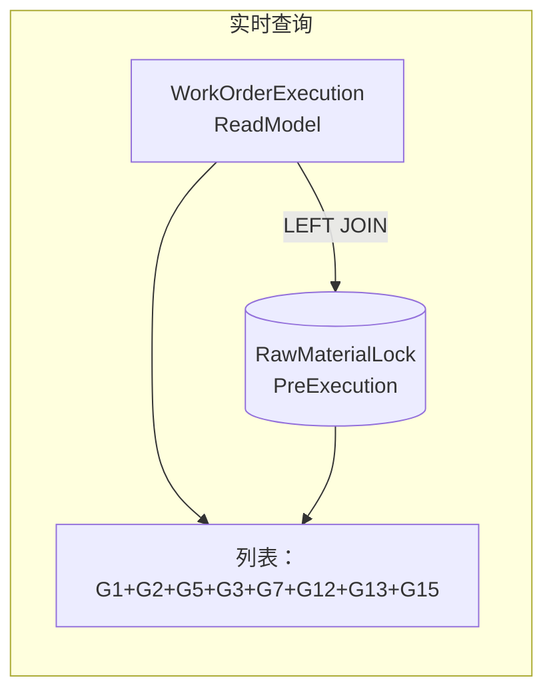
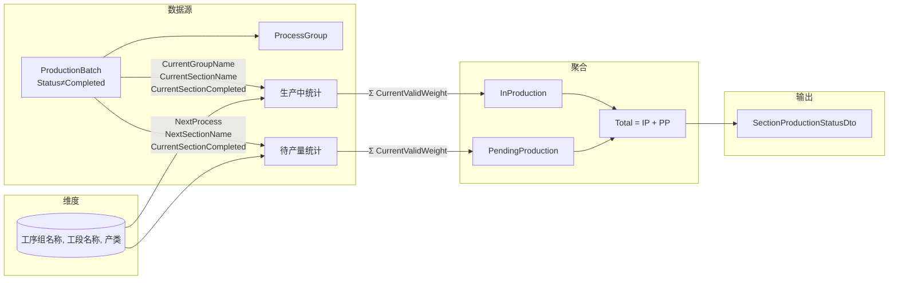
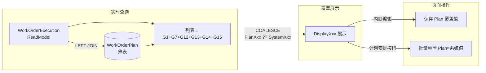
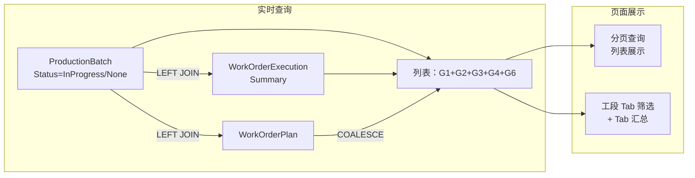

# 计划排程上下文详细设计

> 版本：V5.48（2026-08-30）
> 状态：**已实施完成**。计划排程上下文提供多层宏观到微观调度视图：工单总览（19 行产能负荷聚合 + 7 时间桶）、原锁计划（LEFT JOIN 实时查询 + RawMaterialLockPreExecution）、工单排程（WorkOrderExecutionSummary + WorkOrderPlan 薄表 COALESCE 覆盖）、冷轧排程（ColdRollSpecSchedule 独立实体全量同步 + 排程建议引擎 + 机台组/产能/机台数三配置表驱动）、批次计划（全量加载 Items 模式 + BatchPlanSchedule 薄表三规则计划安排 + 工段 Tab 配置驱动）、成检计划（四档看板 + 待检批支重/近日成检量汇总）。工单需求调整与冷轧/流转分析相关页面已迁至工单上下文或整套删除，流转分析体系收敛为 3 类配置驱动的段落流转分析。

---

## 一、概述

计划排程上下文（Scheduling Context）是工单执行状况读模型的上层调度管理上下文，提供多层宏观到微观的调度视图：

1. **工单总览** — 最宏观的产能负荷视图，展示各工段待产量与时间分布
2. **原锁计划** — 原料锁定（ScheduleStage=2）阶段的调度计划快照与执行跟踪
3. **工单排程** — 生产执行（ScheduleStage=3）阶段的排程快照与执行跟踪
4. **冷轧排程** — 按规格维度聚合的冷轧时间桶分布计划，含冷轧排程（ColdRollSpecSchedule）编辑
5. **批次计划** — 在产明细计划实时视图，ProductionBatch LEFT JOIN WorkOrderExecutionSummary + WorkOrderPlan + BatchPlanSchedule 薄表，G4 工单计划采用 COALESCE（Plan优先），G10 工单需求调整直接从实体读取（无需 JOIN OrderDemandAdjustment），展示批次级的生产执行状态与重点关注；含工段 Tab 汇总 + 计划安排（三规则生成薄表）+ G13 薄表内联编辑；ProductionFlowProperty 兜底：无 Plan 覆盖且无 Summary 数据时，非工单批次→"略"，其他→"疑问"
6. **成检计划** — 成品检验状态跟踪，全量加载 Items 模式，五档 Tab（全部/待到料/待检验/检验中/完成检验待入库），客户端分页/排序/筛选

**核心定位：**
- 工单总览为纯查询聚合（无独立实体），汇总 WorkOrderExecutionSummary 和 ProductionBatch 数据
- 不直接计算读模型，而是基于已完成的 `WorkOrderExecutionSummary` 读模型进行调度决策
- 工单需求调整是手工维护的独立实体（非读模型），记录对生产排程的催单要求
- 原锁计划是**实时查询视图**（非物化表），通过 LEFT JOIN WorkOrderExecutionSummary + RawMaterialLockPreExecution 实时查询（G13 直接从实体读取，无需 JOIN OrderDemandAdjustment），无需"计划安排"全量刷新
- 工单排程是**LEFT JOIN 实时查询 + WorkOrderPlan 手动覆盖薄表**：主数据从 `WorkOrderExecutionSummary` 实时查询（过滤 `ProductionFlowProperty != "略"`），`WorkOrderPlan` 薄表存储用户手工覆盖值（4 个字段：ScheduleStage/UrgencyLevel/ProductionAttentionProcess/ProductionFlowProperty），通过 COALESCE 模式 `DisplayXxx = PlanXxx ?? SystemXxx` 展示
- G15（预执行）为页面操作标记区域，存储于 `RawMaterialLockPreExecution` 独立表（仅含 WorkOrderId + 用户编辑字段），通过 LEFT JOIN 实时查询加载
- 工单需求调整 UI/API 已迁移至工单上下文，G13 字段通过 RefreshAllAsync 同步写入 WorkOrderExecutionSummary
- **冷轧排程（ColdRollSpecSchedule）是独立实体（非读模型），存储排程员在冷轧排程页面上设置的排程决策（完成类型+待轧类型+待轧序+待轧设备号+单机单日量），按 (ProcessType, BilletSpec, RollingSpec, IsFinished) 唯一约束，全量同步模式**
- **批次计划和冷轧排程的 G4 采用 WorkOrderPlan COALESCE 模式**（与工单排程统一），IsKeyBatch 计算使用 COALESCE 后的最终值，判定逻辑为 `MainNoAttentionProcess 非空 && UrgencyLevel in [APlusUrgent, AUrgent] && ProductionFlowProperty=="正常"` + 序号比较（生产收尾直接重点、未产批次执行序视为 0）
- **ScheduleStage 默认值**：无 WorkOrderExecutionSummary 记录的批次，其 ScheduleStage 默认为 `-1`（"存错-无此工单"，红色 MudChip 警示），批次计划和成检计划两处同口径
- **批次计划薄表（BatchPlanSchedule）是独立实体（非读模型），存储批次级的计划安排决策（IsFlow/PlanFlowLevel 五档/PlanFlowTarget 六档/PlanFlowCRType/PlanOuterDiameterSpan/PlanFlowExecSpec/ExecutionSequence/TargetSequence + 抢单/备注），通过"计划安排"按钮按三规则自动生成快照：规则1 冷轧排程命中→planFlowTarget=dto.FlowTarget（完工冷轧/冷轧/成检）；规则2 重点生产批次→planFlowTarget=MapFlowTargetByCRType(MainNoAttentionProcess)（荒管处理→荒管检、在制修检→在制检、生产收尾→成品检验、剩余冷轧类→冷轧）、planFlowCRType=MainNoAttentionProcess；规则3 降级→null；支持排程员手工调整排程计划（仅 IsGrabOrder/PlanRemark 内联编辑，其余只读）**
- **批次计划产量目标（BatchPlanTarget）已于 2026-08-24 整套删除**（实体/EF 配置/DbSet/Service/Controller/DTO/前端/DI 全删，迁移 `20260823194559_DropBatchPlanTargetTable`）

**当前范围：**
- 工单总览（ProductionOverview）：各工段产能负荷的宏观聚合视图
- 原锁计划（RawMaterialLockPlanAndExecution）：原料锁定阶段工单的 LEFT JOIN 实时查询视图
- **工单排程（WorkOrderSchedule）：LEFT JOIN 实时查询（WorkOrderExecutionSummary + WorkOrderPlan 薄表），过滤 `ProductionFlowProperty != "略"`，支持 G15 内联编辑 + ConsistencyStatus（三值：一致/进度调整/错误）+ 全量计划**
- **生产工段待产量现况（SectionProductionStatus）：按(工序组, 工段, 产类)三维汇总批次现有效原料重量 + 计划流转量/重点批重量**
- **段落流转分析（SectionParagraphFlowAnalysis）：段落日产配置 3 类驱动自动生成（冷轧拔按机台组/普通工段按启用工段/检验固定），分析待产总量与可持续天数**
- **冷轧排程（ColdRollPlan）：按规格维度聚合的冷轧时间桶分布计划，ProductionBatch LEFT JOIN WorkOrderExecutionSummary + WorkOrderPlan，G4 采用 COALESCE（Plan优先），支持明细/简化视图切换和打印功能**
- **冷轧排程（ColdRollSpecSchedule）：排程员在冷轧排程页面上作出的按规格的滚动排程决策，存储为独立实体（ColdRollSpecSchedule 表），全量同步模式（增/改 + 删除不在列表中的旧记录）**
- **批次计划（BatchPlan）：在产明细计划实时视图，ProductionBatch LEFT JOIN WorkOrderExecutionSummary + WorkOrderPlan + BatchPlanSchedule 薄表，G4 工单计划采用 COALESCE（Plan优先），G10 工单需求调整直接从实体读取（无需 JOIN OrderDemandAdjustment），含 Tab 汇总 + 计划安排（三规则生成）+ G13 薄表内联编辑**
- **成检计划（FinalInspectionPlan）：成品检验状态跟踪页面，全量加载 Items 模式，基于 ProductionBatch + MaterialReceiveCheck + FinalInspection 实时查询，五档 Tab 筛选（全部/待到料/待检验/检验中/完成检验待入库）**

---

## 二、核心流程

### 2.1 工单需求调整流程（已迁移至工单上下文）

工单需求调整 UI/API 已迁移至 **工单上下文**（工单需求调整页面 `/order-demand-adjustment`）。`OrderDemandAdjustment` 实体位于 `MES.Data.Entities.WorkOrder`，原锁计划和工单排程的 G13 字段通过 RefreshAllAsync 同步写入 WorkOrderExecutionSummary，无需 LEFT JOIN 引用。

### 2.2 原锁计划流程



**无需"计划安排"（PlanArrangement）**。原锁计划页面不使用物化表，为实时查询模式：

1. 查询 `WorkOrderExecutionSummary`（ScheduleStage=2，原料锁定）作为主表
2. LEFT JOIN `RawMaterialLockPreExecution` 获取 G15 预执行标记
3. G13 字段（IsUrging/IsBatchDelivery/IsPaused/AdjustmentRemark）直接从 WorkOrderExecutionSummary 实体读取，无需 JOIN OrderDemandAdjustment

**G15 字段来源：**
- `IsPreInput`、`BudgetInputDate` 存储在 `RawMaterialLockPreExecution` 表，通过 LEFT JOIN 加载
- `ExecutionError` 为 DTO 计算字段：`IsPreInput && (!BudgetInputDate.HasValue || BudgetInputDate.Value.Date < DateTime.Today)`
- `IsMainNoMaterialComplete`/`IsBudgetComplete` 已删除（迁移 `DropRawMaterialLockPreExecutionCompleteFields`）

### 2.3 工单总览数据流

```mermaid
flowchart LR
    subgraph 订单交期负荷 R1-R6
        A1[WorkOrderExecutionSummary<br/>ScheduleStage >= 2] -->|延期判定 EstComp>交期 且<br/>ScheduleStage=2| R1[订单延期-原料]
        A1 -->|延期判定 EstComp>交期 且<br/>ScheduleStage=3| R2[订单延期-在产]
        A1 -->|延期判定 EstComp>交期 且<br/>ScheduleStage=4| R3[订单延期-成检]
        A1 -->|延期判定 EstComp>交期<br/>按交货日期分桶| R4[订单延期量]
        A1 -->|延期判定 EstComp>交期<br/>按预计完成日分桶| R5[订单延期量[预计完结]]
        A1 -->|非延期 EstComp<=交期| R6[订单非延期]
    end

    subgraph 整体完工预计 R7
        A1 -->|Max生产工段天数 +<br/>原料待投料/2030日产 + 2天成检| R7[整体完工预计]
    end

    subgraph 原料行 R8-R11
        A2[WorkOrderExecutionSummary<br/>ScheduleStage=2] -->|完善计划待投料量| R8[原料·完善计划]
        A2 -->|执行计划待投料量| R9[原料·执行计划]
        A2 -->|成品计划量-已到货量| R10[原料·外购成品]
        R8 --> R11[原料·汇总]
        R9 --> R11
        R10 --> R11
    end

    subgraph 生产行 R12-R17
        B1[ProductionBatch<br/>Status=InProgress/None] -->|CurrentValidWeight| B2[ProcessGroup]
        B2 -->|荒管处理+OuterPolish+工段级到达| R12[荒管抛光]
        B2 -->|工序 Key ∈ 组 ProcessKeys<br/>完全遍历机台组| RG[冷轧/冷拔机台组行<br/>按 DisplayOrder 排序<br/>2026-08-30 起含 110]
        R12 --> R17[在产汇总]
        RG --> R17
    end

    subgraph 成检行 R18-R19
        C1[成检计划看板<br/>待检验+检验中] -->|批次去重| R18[成检]
        R18 --> R19[成检汇总]
    end

    subgraph 输出
        R1,R2,R3,R4,R5,R6,R7,R8,R9,R10,R11,R12,RG,R17,R18,R19 --> O[ProductionOverviewDto]
        D[7个动态时间桶] --> O
    end
```

> 注意：在制修检、附加成检两道工序无设备分类映射，不参与生产行分配。订单交期负荷 6 行 + 整体完工预计置顶展示。**生产行数随机台组配置动态**（1 荒管抛光 + N 机台组，完全遍历 `ColdRollMachineGroupConfig`）。

工单总览是纯查询聚合服务（`ProductionOverviewService`），不涉及数据写入。查询步骤：

1. 从 `WorkOrderExecutionSummary` 查询 `ScheduleStage >= 2` 的工单（排除主号暂停/主号完成）
2. 从 `ProductionBatch` 查询 `Status=InProgress/None` 的批次（延期分类行专用覆盖在产/未产/成检）
3. 从 `ProcessGroup` 查询关联批次的工序组
4. 按 7 个时间桶（交期截止-今日、今日+7、+15、+30、+45、+60、远日量）分布各行的重量
5. **延期判定统一为 `EstComp > 交货日期`**：订单延期量（按交货日期分桶）与订单延期量[预计完结]（按预计完成日分桶）统计同一批延期工单、总量一致；订单非延期互补（`EstComp <= 交货日期`）
6. 生产行（荒管抛光 + 冷轧/冷拔机台组行）按工序分类：`ClassifySection(pg, sectionName)` 互斥分配，**非荒管行按产出形态拆分在制/成品**（`ClassifyPendingProductStatus`：最先待执行工序组 `ManufacturingSpec==批次规格` 且产类为成品 → 成品，否则在制）；荒管抛光行不拆分（附加量 null 走纯数值）
7. 荒管抛光使用 `IsNotReachedBySection` 进行工段级到达判断（比较工段序号），其他工段使用 `IsNotReached`

### 2.4 生产工段待产量现况



**聚合步骤：**
1. 从 `ProductionBatch` 查询 `Status ≠ Completed` 的所有批次（含 `ProcessGroups`）
2. 提取唯⼀的 `(ProcessGroup.ProcessName, SectionName, ProductStatus)` 组合作为维度行（产类由 `ProductStatusHelper.Calculate` 逐批次判定）
3. 按维度逐行聚合指标（生产中/待产量/汇总量）
4. 另从批次计划全量数据（`GetAllAsync(null)` 口径）汇总 PlanFlowQuantity（计划流转量）与 PlanKeyWeight（重点批重量）

### 2.5 段落流转分析（3 类规则）

段落日产配置 `SectionParagraphConfig` 已重构为「3 类配置驱动自动生成」，段落只填参数；旧「生产段流转量分析（SectionFlowAnalysis）」及其依赖的组合段落归类 `CombinationGroups`、流转类别日产配置 `SectionFlowCategorySetting` 已全套删除，不再读取两张预设表。

```mermaid
flowchart LR
    subgraph 段落自动生成（3 类）
        C1[Cold<br/>冷轧机台组配置] -->|ParagraphKey=机台组 GroupKey| P[SectionParagraphConfig<br/>段落列表]
        C2[Section<br/>StandardWorkDays 启用工段] -->|ParagraphKey=工段 SectionKey| P
        C3[Fixed<br/>固定荒管检/在制检] -->|固定 Key| P
    end

    subgraph 聚合（3 类规则）
        P -->|Cold: 工序组命中机台组内任一工序| R1[按段落聚合]
        P -->|Section: 工段命中该段落工段 且<br/>不属于任何冷轧拔机台组| R1
        P -->|Fixed: 荒管检→RoughTube<br/>在制检→InProgress| R1
        SPS[SectionProductionStatus<br/>实时计算] -->|各(工序组,工段)待产量| R1
    end

    subgraph 输出
        R1 -->|PendingTotal ÷ DailyFlowTarget| R2[可持续天数]
        R2 -->|＜ LowerLimitDays→偏少<br/>＞ UpperLimitDays→过多<br/>其他→正常| R3[总况判定]
    end
```

**段落自动生成（3 类）：**

| CategoryType | 生成来源 | ParagraphKey | 聚合规则 |
|------|------|------|------|
| Cold（冷轧拔） | 冷轧机台组配置表 `ColdRollMachineGroupConfig` 组显示名 | 机台组 GroupKey | 工序组命中该机台组内任一工序 |
| Section（普通工段） | StandardWorkDays 启用工段（扣除冷轧拔/检验/入库） | 工段 SectionKey | 工段命中该段落工段 且 工序组不属于任何冷轧拔机台组（防重叠） |
| Fixed（检验） | 固定「荒管检」（RoughTubeInspection）/「在制检」（InProcessInspection） | 固定 Key | 荒管检→ProductStatus=RoughTube、在制检→ProductStatus=InProgress |

段落字段：ParagraphKey、CategoryType、ParagraphName（显示名）、DisplayOrder、DailyFlowTarget（日流转设定）、LowerLimitDays（偏少天数）、UpperLimitDays（过多天数）、Remark；唯一索引 `UK_SPC_CategoryType_ParagraphKey`（过滤非空）；段落随机台组/工段配置增减，仅参数可编辑。

**计算步骤：**
1. 从 `SectionParagraphConfig` 加载生产段落（按 CategoryType 自动生成，ParagraphKey 唯一，按 DisplayOrder 排序）
2. 按上述 3 类聚合规则将实时 (工序组, 工段) 归入对应段落
3. 调用 `SectionProductionStatusService.GetStatusAsync()` 实时获取各(工序组,工段)的待产量（Fixed 类按 ProductStatus 匹配）
4. 按归属段落聚合（/1000 转吨）
5. 计算可持续天数 = `PendingTotal / DailyFlowTarget`
6. 总况判定：可持续天数 < LowerLimitDays → "偏少"；> UpperLimitDays → "过多"；其他 → "正常"

**重点批次统计：**
- `GetAnalysisAsync()` 在计算完流转量分析后，额外从 ProductionBatch + WorkOrderExecutionSummary 查询非完成批次
- 按段落聚合批次级"重点生产批次"（IsKeyBatch）批次数和总重量（吨）
- 重点批次逻辑为**流转量分析看板专用算法**（与批次计划 IsKeyBatch 分道）：`ScheduleStage==3（生产执行）或 2（原料锁定）` 且 `UrgencyLevel in [APlusUrgent, AUrgent]`，且工序为荒管处理或 == MainNoAttentionProcess（非冷轧类工序，或工段为冷轧拔）；ScheduleStage==2 额外要求 IsUrging/IsBatchDelivery
- 结果通过 `KeyBatchCount`（int）和 `KeyBatchWeight`（decimal?）字段返回

**依赖关系：**
- 段落配置来源 `SectionParagraphConfig`（参数表菜单下维护，仅参数可编辑）
- **实时待产量**来自 SectionProductionStatus（生产工段待产量现况）的实时计算
- **重点批次数据**来自 ProductionBatch + WorkOrderExecutionSummary 实时查询

### 2.6 工单排程流程



**筛选规则：** 工单排程通过 LEFT JOIN 实时查询 WorkOrderExecutionSummary + WorkOrderPlan，筛选 `ProductionFlowProperty != "略"`（即仅显示有关注价值的工单，排除已标记"略"的工单）。

**数据来源：**
- **G1、G7、G12、G13、G14**：全部从 `WorkOrderExecutionSummary` 实时读取
- **G13**（IsUrging/IsBatchDelivery/IsPaused/AdjustmentRemark）：直接存储在 WorkOrderExecutionSummary 实体中（由 `RefreshAllAsync` 从 `OrderDemandAdjustment` 同步），无需 LEFT JOIN
- **G15**（工单计划）：从 `WorkOrderPlan` 薄表 LEFT JOIN 读取覆盖值

**覆盖展示（COALESCE 模式）：**
- `DisplayScheduleStage = PlanScheduleStage ?? ScheduleStage`（覆盖值优先，null=使用系统值）
- `DisplayUrgencyLevel = PlanUrgencyLevel ?? UrgencyLevel`
- `DisplayProductionAttentionProcess = PlanProductionAttentionProcess ?? ProductionAttentionProcess`
- `DisplayProductionFlowProperty = PlanProductionFlowProperty ?? ProductionFlowProperty`
- `ConsistencyStatus = 三值计算字段`：Service 端 `ApplyConsistencyStatus()` 方法对每行逐字段比较：
  - `"一致"`：全部 4 对字段完全一致
  - `"进度调整"`：仅 PlanProductionAttentionProcess 不同（其他 3 对一致）
  - `"错误"`：其他 3 对（Stage/Urgency/Flow）任一不一致，或跨主号 Plan 值冲突（同一 SalesOrderNo+ProductionMainNo 组的工单 Plan 值不一致）

**ProductionFlowProperty 在批次计划中的兜底逻辑：**
批次计划的 G4 字段 `ProductionFlowProperty` 在无 WorkOrderPlan 覆盖且无 WorkOrderExecutionSummary 数据时兜底为：
- 非工单批次（`WorkOrderNo == "非工单"`）→ `"略"`
- 其他批次 → `"疑问"`

**"全量计划"按钮：**
- 将当前查询条件（keyword + filters）发送到后端
- 后端重新执行匹配查询，对匹配的工单 Upsert WorkOrderPlan 记录（Plan = 系统值）
- 删除不匹配查询条件的 WorkOrderPlan 行（清理僵尸数据）

**依赖关系：**
- **无物化表**，数据始终最新
- WorkOrderPlan 为薄表（仅含 WorkOrderId + 4 个可 null 覆盖字段），不会过时
- WorkOrderSchedule 物化表（WorkOrderSchedules）已删除，不再使用

### 2.8 批次计划流程



**数据来源：**
- **G1（批次基础信息）+ G3（状态跟踪）**：从 `ProductionBatch` SELECT 实时读取
- **G4（工单计划）**：字段在 Service 投影时以 COALESCE 模式计算（`WorkOrderPlan.字段 ?? WorkOrderExecutionSummary.字段`），无物化表
- **G10（工单需求调整）**：直接从 `WorkOrderExecutionSummary` 实体读取（`RefreshAllAsync` 已同步），无需 JOIN `OrderDemandAdjustment`
- **G11（关联冷轧排程）/G12（执行反馈）**：实时计算；**G13（批次计划）**：BatchPlanSchedule 薄表 LEFT JOIN

**工段筛选（Section Tab，配置驱动）：**
- 顶部 MudButton 切换工段视图，Tab 列表经 `GET api/batch-plan/section-tab-options` 动态加载（唯一规范源 `BuildSectionTabOptionsAsync`，与委外在产列同源），不再编译期常量（`BatchPlanSectionTabs.All` 已删）
- **冷轧/冷拔类**：按「工序组定义」ProcessDefinitions 启用冷轧/冷拔工序（`GetColdRollOrDrawOptionsAsync`，已 5 分钟缓存）逐工序生成 Tab（工序英文 Key + 中文显示名，如 60冷轧/50冷轧/三辊冷轧/冷拔）；新增冷轧工序自动出现
- **普通工段类**：按「工段工量天数」StandardWorkDays 启用工段生成 Tab（SectionKey 英文 + SectionName 中文），扣除 ColdRollDraw/Inspection/Warehouse 三固定工段；**内抛与内修磨各自独立 Tab**
- **检验类（荒管检/在制检）**：固定追加末尾（工段=检验 AND 产类=荒管/在制，产类由批次全部 ProcessGroups 内存计算）
- 筛选匹配：前端传英文 Key（冷轧=ProcessKey、普通=SectionKey）；后端 `NormalizeSectionTab` 原样返回（`ProcessKeys.ToKey ?? SectionKeys.ToKey ?? 原样`），`crKeys.Contains(sectionTab)` 判定冷轧类（GetAllAsync/GetPagedAsync 双路径共用）

**重点批次（IsKeyBatch）逻辑：**
- 前置条件：MainNoAttentionProcess 非空 && UrgencyLevel in [APlusUrgent, AUrgent] && ProductionFlowProperty=="正常"
- **生产收尾（MainNoAttentionProcess==ProductionAttentionKeys.Finish）→ 直接重点**（不需序号比较）
- 其余：**未产批次（无当前工序组）执行序视为 0 纳入比较**；冷轧类（含三辊冷轧/冷拔）ExecutionSequence < AttentionProcessSectionSequence + 1；其他（荒管处理/在制修检/附加成检）ExecutionSequence < AttentionProcessSectionSequence
- 抽私有静态 `ComputeIsKeyBatch(item, crKeys)`，GetPagedAsync/GetAllAsync 双路径共用防漂移；⚠️ 判定+相应工段序推导+ExecutionSequence 赋值三者必须全放 foreach 顶部（pgLookup/pendingPg continue 之前）
- **仅 G4 工单计划概念（批次计划列显示用）**；冷轧排程逻辑改用三档分类器（Model B），不再使用 IsKeyBatch
- Tab 汇总（计划重点批次数/重量）按 PlanFlowLevel==1（急+）统计

**Tab 汇总：**
- 批次数、总重量(kg)、重点批次数、重点批次重量
- 在分页查询中通过 PagedResult.Extras 字典返回后端聚合结果

### 2.9 冷轧排程流程

```mermaid
flowchart LR
    subgraph 实时查询
        A[ColdRollPlan<br/>规格维度聚合] -->|行唯一键| B[ColdRollSpec<br/>Schedule]
        B -->|GetAllAsync| C[_scheduleEdits<br/>字典]
    end

    subgraph 排程编辑
        C -->|工具栏"编辑排程"| D[进入排程模式]
        D -->|RowTemplate<br/>MudSelect/MudNumericField| E[用户编辑<br/>CompletionType/RollType<br/>RollOrder/MachineNo<br/>DailyOutput]
        E -->|保存| F[验证: RollType≠None<br/>时 RollOrder>0]
        F -->|SaveAllAsync| G[ColdRollSpecSchedule<br/>表写入]
    end

    subgraph 前端展示
        G --> H[ApplyScheduleToItems<br/>回填 DTO]
        H --> I[排序/筛选/文本显示]
    end
```

**数据来源：**
- 排程数据存储在 `ColdRollSpecSchedule` 表，通过 `ColdRollSpecScheduleService.GetAllAsync()` 加载全部记录
- 行唯一键：明细模式为 `(ProcessType, BilletSpec, RollingSpec, IsFinished)`，简化模式为 `(ProcessType, ShortDisplay, IsFinished)`
- 简化视图编辑后保存时自动展开到明细级别
- **DailyOutput（单机单日量，kg/天）**：decimal(18,3)，单台设备每日可轧制重量，排机估算机台需求数依据（空/≤0 不计入）

**排程编辑操作：**
1. 点击工具栏"编辑排程"按钮进入排程模式
2. 排程设置列（在轧要求/待轧要求/待轧序/待轧设备号/单机单日量）变为 MudSelect/MudNumericField/MudTextField 内联编辑
3. 编辑完成后点击"保存排程"提交到后端
4. 简化视图模式下保存会自动展开到明细级别（`_rawAllItems` 匹配）
5. 验证规则：待轧要求非"无计划"时，待轧序必须 > 0
6. 保存排程时同步失效排机估算缓存（`ColdRollMachineEstimate:List`）与排程建议缓存（`ScheduleSuggestionCacheKey`）

**排程建议引擎（半自动）：**
- 端点 `GET /api/cold-roll-plan/suggestion`（`GetScheduleSuggestionAsync`）只产出建议、不自动写库；前端「一键采用」转既有 `POST /save-all` 全量同步通道（建议 Items 转 `ColdRollSpecScheduleDto`，合并未被覆盖的现有行防删僵尸）
- **三步决策：特急锁定(1) → 流转保底(3) → 产能平衡(2)**；数据源复用 `BuildAllocationsAsync`/`scheduleDict`/`capacityDict`/`machineConfigDict`；四维 key 合并 = `scheduleDict.Keys` ∪ allocations 维度
- **急+ 精确判据** = 既有六档档1（`isUrgent ∧ isNormal ∧ AttentionMatchesCurrentCR`）
- **档位阶梯** `TierLadder = [CrOnly, Urgent, Partial2, Partial3, All]`，宽度 0/1/2/3/4；`NormalizeTier`：Partial1→Urgent、Subsequent→All；`MatchesScheduleType`：All/Subsequent→true、CrOnly=档1、Urgent/Partial1=isUrgent∧normal、Partial2=isUrgent、Partial3=isUrgent∨B顺
- **机台数公式** `ComputeMachineCount`：Σ(Weight/(dailyOutput×6m)) 四舍五入远离零；dailyOutput 优先 `capacityDict(>0)` → `scheduleDict.DailyOutput(>0)` → null；PositionDiff≤6 才计
- **流转保底** `ComputeFlowDemand`（方案 A 按链对，方式B→方式A）：仅 PositionDiff≤6 且 ProcessType ∈ 某供给方组 Keys 的 allocation（PD1~6 待轧也计入），ProcessGroups 按 SequenceNumber 找下一冷轧/冷拔组，仅 next ∈ 该供给组 `SupplyTargetGroupKey` 目标组 Keys 计入；daily = capacityDict(方式B) → machineConfigDict.EstimatedDailyOutput(方式A) → null
- flowDemand 两部分：**部分二供给流入**（供给组在制/待轧 PD≤6 本次安排流转→延伸其目标组折算流入，按链对 `{供给组}|{目标组}` 独立累积，多供给方并行链各自独立、多级链中间节点既承接又再供给不重复）+ **部分一需求组本组未定流转**（需求组本组当前工序组、PD≤6、档位不命中，`BatchAllocation.IsCurrentGroup` 防双重计数）；输出 `(demandInflow, supplierOutflow)` 两字典，对倒判据用 supplierOutflow
- **5060 流转对倒两阶段**：阶段1 放宽 5060 在制档位（TierStepWide）喂饱 2030 负荷；阶段2 超 maxMachines 后逐档压缩成品档位（TierStepNarrow）
- **产能平衡**：minTarget = isDemander ? max(组 MinMachines, demandInflow.Total) : 组 MinMachines；沿阶梯双向调整——超上限向窄收（Urgent→CrOnly）、不足向宽放（Partial3→All）至 count∈[minTarget,max]；**凡配了 MaxMachines 的组（无论有无供需链）都走产能平衡**：无供需组（三辊/冷拔独立池、或取消供给目标组后的 5060）不再无条件固定「急+/急/急-」纯人工档，超上限标注矛盾 A'、不足标注矛盾 A；未配机台数上限的组级 no-op（suggestedTier 保持默认原始档，特急锁定在行级仍生效）
- **矛盾标注交人**：A=全量仍不足 / A'=急+锁定已超最大机台数 / B=5060在制折算 2030 需求<2030 最小机台数（可叠加）
- **行级标注**：特急锁定行强制档位≥CrOnly；新增行标注（锁定行保留"锁定"状态+追加"；出现批次但无排程行"）；非锁定行 RowStatus="新增"
- 缓存 `ScheduleSuggestionCacheKey` 60s，四处失效（排程保存/产能档案保存/机台数配置保存·删除）；在档门控按「实际命中档位」（`MatchesScheduleType` 同口径）标记待轧要求

**冷轧产能档案（ColdRollCapacity）：**
- 表 `ColdRollCapacity`，(ProcessType, BilletSpec, RollingSpec, IsFinished) 四维唯一（UK_CRC_Dimensions）；字段 DailyOutput/SampleCount/MachineNo/LastConfirmedAt
- 端点 `GET /api/cold-roll-capacity/all`、`/list`、`POST /save`；排程保存自动反哺（`ReverseFillCapacityAsync`），排程建议产能平衡输入（capacityDict 优先于 scheduleDict.DailyOutput）

**冷轧机台数配置（ColdRollMachineConfig）：**
- 表 `ColdRollMachineConfig`，按单冷轧类型 6 机型，ProcessType 唯一（UK_CRMC_ProcessType）；字段 OwnedCount/MinMachines/MaxMachines/EstimatedDailyOutput/Remark
- 端点 `GET /api/cold-roll-machine-config/all`、`/list`、`POST /save`、`POST /delete/{id}`；配置页 `/cold-roll-machine-configs`，排程建议产能平衡输入（方式A兜底 daily）

**冷轧机台组配置（ColdRollMachineGroupConfig）：**
- 表 `ColdRollMachineGroupConfig`，归组由编译期 `ColdRollMachineGroupKeys.Groups` 改为**配置表驱动**，新增冷轧工序可经配置归入现有组或新建组，无需改代码即可在排机估算/排程建议中看到新机台类型
- 字段 GroupKey（唯一，UK_CRMG_GroupKey）/DisplayName/ProcessKeys（**逗号分隔串**，非关联子表）/DisplayOrder/**SupplyTargetGroupKey（供给目标组 Key，可空）**/Remark（**组角色 FlowRole 已移除**，迁移 `20260829153516_RemoveFlowRoleFromColdRollMachineGroupConfig` DROP COLUMN）；DTO 用 `List<string> ProcessKeys` 供 MudSelect 多选，与实体逗号串互转；配置页「供给目标组」列编辑态 MudSelect 下拉选组 Key（Clearable）、显示态映射组显示名
- **组角色（FlowRole）已废除**：每组天然可同时为供给方与需求方，角色由配置推导而非显式字段：**供给方 = 配置了 `SupplyTargetGroupKey`**（驱动排机估算拆档取整 + 排程建议供给方两阶段流转平衡）、**需求方 = 被至少一个供给组指向**（`demandInflow` 驱动最小机台基准/矛盾 B）；多级链中间节点 isDemander ∧ isSupplier → flowState `Role=Both`；`ColdRollMachineGroupKeys.Groups` 五元组降四元组、`FlowRole*` 三常量删除（该常量现仅作种子/测试规范定义源）
- **供需链显式化（方案 A）**：供需链由 `SupplyTargetGroupKey` 显式表达（供给方组 → 下游需求组），**允许多条并行链、多级链**；强不变量为**链合法性**（`ValidateChainInvariant`）：① 凡配置了 SupplyTargetGroupKey → 目标组必须存在（2030→冷拔(None) 多级链末端合法，独立池/链末 = 不配目标即合法状态）；② 供给链无环（沿 SupplyTarget 链走，命中已访问组即抛）；删除被指向的需求组（供给目标悬空）也抛错。工序**全局唯一归属一组**（跨组重叠会导致引擎双重计数，服务层 `ToHashSet(OrdinalIgnoreCase)` 强校验）
- 校验链（`ColdRollMachineGroupConfigService.SaveAsync`）：GroupKey 必填/格式（`^[A-Za-z0-9][A-Za-z0-9_]*$`，字母或数字开头）/唯一（**前置**，链校验 `ToDictionary` 假定唯一，重复会字典崩溃而非业务异常）→ 工序非空、**全部 ∈ 已启用的冷轧/冷拔工序集**（`GetColdRollOrDrawOptionsAsync` 提取 ProcessKey，禁用工序无法归组）、组内无重复、跨组无重叠 → 链合法性（凡配目标则目标存在 + 无环）
- **引擎改造（`ColdRollPlanService`，方案 A 按链对）**：`MachineGroupDef` 映射 `SupplyTargetGroupKey`；`LoadMachineGroupsAsync()`（查配置表按 DisplayOrder 排序，缓存 60 秒）；排机估算拆档判定 `!string.IsNullOrEmpty(SupplyTargetGroupKey)`；排程建议 `ComputeFlowDemand` 返回 `(demandInflow, supplierOutflow)` 两字典（`demandInflow[需求组]` = Σ 所有指向它的供给流入 + 本组未定流转；`supplierOutflow[供给组]` = 本组→目标组流入，Total=目标组总承接），`isDemander = demandInflow.ContainsKey(group.Key)`、`isSupplier = !string.IsNullOrEmpty(SupplyTargetGroupKey)`、`minTarget = isDemander ? max(minMachines, demandInflow.Total) : minMachines`；`CountAtTierFlowTo(supplierGroup, targetGroup)` 按链对参数替代全局全集（均不读组角色字段）
- 端点 `GET /api/cold-roll-machine-group-config/all`、`/list`、`POST /save`、`POST /delete/{id}`；配置页 `/cold-roll-machine-group-configs`（参数表菜单）；**保存/删除后失效三缓存键**：`MachineGroupCacheKey` + `MachineEstimateCacheKey` + `ScheduleSuggestionCacheKey`
- **机型选项联动**：新增 `GET /api/process-definition/cold-roll-options`（`Where((IsColdRoll||IsColdDraw) && IsEnabled)` 按 DisplayOrder 排序返回 `List<ProcessInfoDto>`，**仅 IsEnabled=true 的启用工序**——禁用工序不参与机型下拉/工段 Tab/机台组归组）；机台数配置两处机型下拉（`ColdRollMachineConfigs`/`ColdRollPlans` 机台数卡片）与冷轧排程工段 Tab 由静态数组改为配置驱动（`ProcessDefinitionService.GetColdRollOptionsAsync`），新增启用冷轧工序自动出现在下拉与工段 Tab；`GetColdRollOrDrawKeysAsync`（引擎排程判定用）**仍不过滤 IsEnabled**（禁用工序存量批次仍需按冷轧处理，两者口径按用途拆分）
- **显示层统一走中文**：机台数配置两处机型下拉、冷轧排程工段 Tab、机台组配置工序多选，下拉/Tab 显示统一改 `ProcessDisplayHelper.GetProcessNameText(opt.ProcessKey)`（不再直显 `ProcessInfoDto.ProcessName` 实体字段——新增工序若被填英文 Key 会直出英文）；列表/打印列本就走 GetProcessNameText 不受影响
- **工序名中文强校验**：工序组定义页 `ProcessDefinitions.razor.cs` SaveEdit 加校验——`ProcessName` 须含中文字符（显示契约=「工序组中文名（可改名，显示用）」，英文稳定 Key 填在 Key 栏），违者提交拦截
- **禁用工序自动删除机台数配置**：`ProcessDefinitionService.SaveAsync` 中当 `dto.IsEnabled == false` 时自动①删除 `ColdRollMachineConfigs` 中 `ProcessType == ProcessKey` 的记录②从所有 `ColdRollMachineGroupConfigs.ProcessKeys` 逗号串中移除该工序（组内仅该工序则置空）③失效 `MachineGroupCacheKey`+`MachineEstimateCacheKey`+`ScheduleSuggestionCacheKey` 三引擎缓存键；与「禁用工序不可归组」服务层校验闭环——禁用即从排程建议产能平衡/机台组归组彻底移除；存量批次仍按冷轧处理（`GetColdRollOrDrawKeysAsync` 口径）

### 2.10 批次计划薄表流程

```mermaid
flowchart LR
    subgraph 自动计算
        A[批次计划<br/>"计划安排"按钮] --> B[BatchPlanScheduleService<br/>PlanAllAsync]
        B --> C[按三规则生成快照<br/>PlanIsFlow/PlanFlowLevel 五档/PlanFlowTarget 六档<br/>PlanFlowCRType/外径跨度/PlanFlowExecSpec<br/>PlanExecutionSequence/PlanTargetSequence]
        C --> D[(BatchPlanSchedule 表<br/>Upsert)]
    end

    subgraph 手工调整
        E[批次计划<br/>内联编辑] -->|仅抢单/备注| D
        F[批次计划组字段<br/>PlanIsFlow/PlanFlowLevel/...] -->|前端展示| G[BatchPlanDto]
        D --> F
    end
```

**数据来源：**
- 批次计划数据存储在 `BatchPlanSchedule` 表，通过 `BatchPlanScheduleService.GetAllAsync()` 加载全部记录
- 在 `GetAllAsync()`（批次计划）中通过 LEFT JOIN 映射到 BatchPlanDto 的 `Plan*` 属性
- 8 个字段由 `PlanAllAsync()` 按三规则自动计算，支持手工覆盖（仅抢单/备注内联编辑）

**计划安排流程：**
1. 排程员在批次计划点击"计划安排"按钮
2. 后端遍历当前工段 Tab 筛选的活跃批次，按**三规则**生成快照：
   - **规则1 冷轧排程命中** → planFlowTarget = dto.FlowTarget（完工冷轧/冷轧/成检）
   - **规则2 重点生产批次** → planFlowTarget = `MapFlowTargetByCRType(MainNoAttentionProcess)`（荒管处理→荒管检、在制修检→在制检、生产收尾→成品检验、剩余冷轧类→冷轧）、planFlowCRType = MainNoAttentionProcess
   - **规则3 降级** → planFlowTarget/planFlowCRType 等全 null
   - 等级 PlanFlowLevel 五档（1急+/2急/3急-/4一般/5略）；FlowTarget 存储英文 Key，显示走 DictValueDisplayHelper 兜底 FlowTargetKeys.ToChinese
3. 已有记录则更新（保留抢单/备注），无记录则创建（Upsert）
4. 用户可在页面内联编辑抢单/备注，即时保存（其余字段只读）

---

## 三、业务规则

### 3.1 通用规则

| 规则ID | 规则说明 |
|--------|----------|
| SC-001 | 两个手工实体均为独立实体，不是读模型——因为包含用户手工输入数据 |
| SC-002 | OrderDemandAdjustment 每个工单最多一条记录（WorkOrderId 唯一），由工单需求调整页面维护 |
| SC-003 | 原锁计划使用 LEFT JOIN 实时查询模式（WorkOrderExecutionSummary + RawMaterialLockPreExecution），G13 直接从实体读取，查询时过滤 ScheduleStage=2（原料锁定）的工单，无独立物化表 |
| SC-004 | 工单排程为 LEFT JOIN 实时查询（WorkOrderExecutionSummary + WorkOrderPlan），过滤 `ProductionFlowProperty != "略"`；WorkOrderPlan 为薄表（仅含 WorkOrderId + 4 个手工覆盖字段），通过 COALESCE 模式 `DisplayXxx = PlanXxx ?? SystemXxx` 展示；支持保存单行 Plan 覆盖值和"全量计划"批量重置；无物化表。批次计划和冷轧计划的 G4（工单计划）字段在 Service 投影时同样采用 COALESCE 模式（WorkOrderPlan.字段 ?? WorkOrderExecutionSummary.字段），与工单排程统一 |
| SC-005 | 生产工段待产量现况为纯查询聚合，无需 DB 表或视图，无独立实体 |
| SC-006 | 冷轧排程（ColdRollSpecSchedule）为独立实体，存储排程决策，按 (ProcessType, BilletSpec, RollingSpec, IsFinished) 唯一约束，全量同步模式 |

### 3.2 工单需求调整（已迁移至工单上下文）

工单需求调整业务规则（SU-001 ~ SU-003）已迁移至工单上下文。本上下文仅保留 `OrderDemandAdjustment` 数据库实体，G13 字段通过 RefreshAllAsync 同步写入 WorkOrderExecutionSummary 实体供查询使用。

### 3.3 原锁计划

| 规则ID | 规则说明 |
|--------|----------|
| RL-001 | 采用 LEFT JOIN 实时查询模式，**无物化表**。G1~G12 实时从 `WorkOrderExecutionSummary` 读取 |
| RL-002 | G13 字段直接从 `WorkOrderExecutionSummary` 实体读取（由 RefreshAllAsync 从 OrderDemandAdjustment 同步），无需 LEFT JOIN |
| RL-003 | `ScheduleStage` 筛选：查询时 WHERE `ScheduleStage=2`（原料锁定），无需存储冗余快照 |
| RL-004 | G15（预执行）存储在 `RawMaterialLockPreExecution` 独立表（仅含 WorkOrderId + IsPreInput + BudgetInputDate），通过 LEFT JOIN 实时加载 |
| RL-005 | `IsPreInput`（执行）：用户手工标注"近几日会投料"的工单，MudSwitch 内联编辑即时保存 |
| RL-006 | `BudgetInputDate`（预算投料日）：用户在 IsPreInput=true 时手工输入日期，MudTextField 内联编辑 |
| RL-007 | `ExecutionError`（执行异常）：DTO 计算字段，`IsPreInput && (!BudgetInputDate.HasValue || BudgetInputDate.Value.Date < DateTime.Today)`（已执行但日期为空或预算投料日已过）。页面以红色 MudChip 显示"是" |
| RL-010 | `HasAbnormality` 后端自动计算：`DaysDiffFromDelivery < 0 OR TotalRemainingWorkDays < 0` |
| RL-011 | `IsMainNoMaterialComplete`（主号齐全）与 `IsBudgetComplete`（预算主号齐全）字段已删除（迁移 `DropRawMaterialLockPreExecutionCompleteFields`），原就绪分组判定与级联逻辑一并移除，set-pre-execute-flags 仅剩 IsPreInput/BudgetInputDate 参数 |

### 3.4 工单总览

| 规则ID | 规则说明 |
|--------|----------|
| PO-001 | 工单总览为纯查询聚合，无独立实体，不涉及任何数据写入。**19 行布局**；**生产行数随机台组配置动态**（总行数 = 19 + 机台组数 − 4） |
| PO-002 | 数据源：`WorkOrderExecutionSummary`（ScheduleStage >= 2，排除主号暂停/主号完成）+ `ProductionBatch`（Status=InProgress/None，延期分类行另覆盖 InFinalInspection）+ `ProcessGroup` + 成检计划看板（`GetKanbanAsync`） |
| PO-003 | **展示顺序**：订单交期负荷 3 行置顶（订单延期-原料/在产/成检）→ 原料 4 行（完善计划/执行计划/外购成品/汇总）→ 投料-在产 N 行（[累]荒管抛光固定首行 + 冷轧机台组动态遍历，行序=机台组 DisplayOrder，完全遍历含 110）+汇总 → 成检+成检汇总 → 整体完工预计。**行名显示**：荒管抛光行走 DictValueDefinitions 配置表（DictKey=ProductionOverviewRowKey，优先 → 规范中文兜底）；机台组行走组 DisplayName（组显示名联动）；[累] 为固定口径前缀 |
| PO-004 | **延期判定**：延期 = `EstComp > 交货日期`。订单延期量（按交货日期分桶）与订单延期量[预计完结]（按预计完成日分桶）统计**同一批延期工单、总量一致**；订单非延期互补 = `EstComp <= 交货日期`（EstComp 为空不计入） |
| PO-005 | 订单延期-原料/在产/成检：主值 = 延期工单中 ScheduleStage=2/3/4 的 TotalWeight 按交货日期分桶；副值（SubValue）分别为 待料（CalcPending 待投料缺口）/ 在产（同工单在产·未产批次 TheoreticalOutputWeight 和）/ 在检（同工单 InFinalInspection 批次 TheoreticalOutputWeight 和） |
| PO-006 | 原料-完善计划 = 原锁计划待投料量汇总 A完善计划（RawMaterialLockRemark）待计划量；执行计划 = C执行计划 待投料量；外购成品 = 成品计划量 − 已到货量（FinishPlanWeight − FinishInWeight 缺口，外购由供应商生产、本厂不投料） |
| PO-007 | 原料-汇总 = 完善计划 + 执行计划 + 外购成品，日期桶逐桶求和（IsSummary） |
| PO-008 | 投料-在产各工段行待产量 = 匹配该工段类型且尚未到达的批次 CurrentValidWeight 之和。荒管抛光用 IsNotReachedBySection（工段级），其他工段用 IsNotReached（工序组级）；**冷轧/冷拔越界判定**：当前工序组==目标冷轧/冷拔组时，若当前工段序号已越过该组冷轧拔序号（如 ColdRoll50 组脱脂 8 > 冷轧拔 6）→ 机台已轧完、不再占用机台产能，IsNotReached 返回 false 不计入待产 |
| PO-009 | **产类拆分**（非荒管行）：批次在目标工段内最先待执行的工序组，`ManufacturingSpec == 批次规格(OrdinalIgnoreCase)` 且产类为成品（`ProductStatusHelper.IsFinishedManufacturingItem`）→ 计入成品，否则计入在制；**成品 + 在制 = 流转总量**（复合显示 `230（中100/成130）`）；荒管抛光行不拆分 |
| PO-010 | 荒管抛光：ProcessName = "荒管处理" 且 OuterPolish 有值；冷轧/冷拔机台组行：工序 Key ∈ 组 ProcessKeys（配置表 ColdRollMachineGroupConfig 驱动，无硬编码工序/组 Key 匹配） |
| PO-011 | 荒管抛光：ProcessName = "荒管处理" 且 OuterPolish 有值，IsNotReachedBySection 检查是否尚未到达外抛光（批次尚未开始或当前工序组序号 < 荒管处理序号计入；同组比较当前工段序号 < 外抛光序号才计入；当前工段不在荒管处理工段字段中不计入） |
| PO-012 | 投料-在产-汇总 = 全部工段行逐桶求和（IsSummary；工段行数=1 荒管抛光 + 机台组数，随机台组配置动态变化） |
| PO-013 | 投料-成检 = 成检计划看板「待检验+检验中」两档生产重量，预/正式合并、按批次去重（与成检计划 `GetSummaryAsync.SummarizePending` 同口径）；成检-汇总 = 成检自身 |
| PO-014 | 整体完工预计：EstDays = Max(生产工段天数) + CEILING(原料待投料量(吨) / 2030机台组日产) + **2 天成检**；EstDeadline = today + EstDays |
| PO-015 | **日期桶 7 桶**（边界 7/15/30/45/60）：交期截止-今日（MinValue~today）/ 今日+7 / 今日+15 / 今日+30 / 今日+45 / 今日+60 / 远日量（60+1~MaxValue），各桶互斥不累加；生产行日期桶仅统计已计入待产量的批次，各桶之和 = 该行待产量 |
| PO-016 | 延期分类行（订单延期-原料/在产/成检）副值口径：待料副值走 CalcPending（与行 8/9 同口径），在产/在检副值按工单号（OrdinalIgnoreCase）匹配批次状态聚合，仅统计在延期条件内的工单（副值严格为主值子集，防越出） |

### 3.5 数据分组

| 分组 | 组名 | 包含字段 |
|------|------|----------|
| G1 | 基础数据 | WorkOrderNo, Salesman, CustomerName, SignDate, DeliveryDate, DelayPenalty, SettlementMethod, SalesOrderNo, ProductionMainNo, ProductionSubNo, MaterialName, DeliveryState, PlantGrade, Specification, LengthStatus, TotalQuantity, TotalWeight |
| G2 | 用料计划 | LatestPlanDate, MaterialPlanRate, MaterialPlanStatus, MainNoMaterialPlanRate, MainNoMaterialPlanStatus, ProcessCycle, MaterialPlanCoveredCount, MaterialPlanProportion, LatestRequiredDate |
| G5 | 圆棒穿孔 | PiercingPlanWeight, PiercingSubOutWeight, PiercingSubStatus, PiercingSubInWeight, PiercingSubPendingWeight, PiercingReturnStatus |
| G3 | 投料数据 | InputStartDate, InputEndDate, TotalBatchCount, InputOutputRatio, InputStatus |
| G7 | 有效流转 | FlowOutputRatio, FlowStatus, MainNoFlowOutputRatio, MainNoFlowStatus, FlowTotalBatchCount, FlowIncompleteBatchCount, FlowMaxRemainingWorkDays |
| G12 | 实时关注 | ScheduleStage, TotalRemainingWorkDays, CapacityWorkDays, UrgencyLevel, EstimatedProcessCompletionDate, DaysDiffFromDelivery, RawMaterialLockRemark |
| G13 | 工单需求调整 | IsUrging(催单), IsBatchDelivery(分批交货), IsPaused(主号暂停, 联动连带), AdjustmentRemark(调整备注) |
| G15 | 预执行（原锁） | IsPreInput, BudgetInputDate, ExecutionError |
| G15 | 工单计划（排程） | PlanScheduleStage(覆盖状态), PlanUrgencyLevel(覆盖紧急性), PlanProductionAttentionProcess(覆盖生产关注), PlanProductionFlowProperty(覆盖流转性), ConsistencyStatus(实时一致性/计算字段) |
| G13 | 批次计划（批次计划） | PlanIsFlow(流转), PlanFlowLevel(等级,五档 1急+/2急/3急-/4一般/5略), PlanFlowCRType(目标工序), PlanFlowTarget(流转位,六档 成检/完工冷轧/冷轧/荒管检/在制检/成品检验), PlanOuterDiameterSpan(外径跨度), PlanFlowExecSpec(执行规格), PlanExecutionSequence(执行序), PlanTargetSequence(目标序), IsGrabOrder(抢单), PlanRemark(计划备注) — 对应 BatchPlanSchedule 表 |
| G12 | 执行反馈（批次计划） | OriginalDiff(原工量差=PlanTargetSeq-PlanExecutionSeq, 未产执行序视为0), CurrentDiff(现工量差=PlanTargetSeq-ExecutionSequence, 未产视为0), CurrentFlowDiff(G7实时工量差), IsExecuted(是否执行=原工量差≠现工量差), IsCompliant(达标/未达标, 流转=否→null) |
| - | 筛选标记 | HasAbnormality（异常标记，后端自动计算），ExecutionError（执行异常，DTO 计算字段） |

---

## 四、页面设计

### 4.1 工单需求调整页面（已迁移至工单上下文）

工单需求调整页面已迁移至 **工单上下文**：路由 `/order-demand-adjustment`，路径 `MES.Blazor/Pages/WorkOrders/OrderDemandAdjustment.razor`，导航位置「工单管理 → 工单需求调整」，权限 `Roles.Policies.WorkOrderView`。

### 4.2 原锁计划页面

- 路由：`/raw-material-lock-plan`
- 路径：`MES.Blazor/Pages/Scheduling/RawMaterialLockPlanAndExecution.razor`
- 导航位置：计划排程 → 原锁计划
- 权限：SchedulingViewer/SchedulingEditor/SchedulingFull/ReportViewer/ReportEditor/ReportFull/Admin

**页面布局：**
- 顶部工具栏：标题 + 右上角「待投料量汇总」按钮（Outlined，展开/收起切换汇总卡片显隐）
- **汇总数据卡片**（MudPaper 卡片风格，默认折叠）：
  - **顶部行**：工单总数(X批) | 待投料(Xt)，存在成购缺口工单时追加「+成购：Xt」
  - **待投料矩阵**：行=原料锁定备注，列=主号计划性，单元格=单数+待投料重量，含合计行/列
  - **成购矩阵**：仅当存在成购缺口工单时显示，同结构，单元格=成购单数/重量
  - **理论待投料截日**：原锁类别（完善计划/执行计划/外购成品/合计）× 日期桶（按理论截止投料日归桶，空→远日量；桶边界与订单负荷总量页同源），含「待投料总量」列
- **汇总计算公式：**
  - 成购（外购成品）= `Sum(Max(0, FinishPlanWeight - FinishInWeight))`（成品计划量 − 成品到货量缺口，外购由供应商生产、本厂不投料）
  - 待投料 = 分档口径（均扣除外购成品，与订单总览 R1 同口径）：
    - **A质量补料**：`Max(0, (TotalWeight - 成购) × 1.1 × (1 - FlowOutputRatio/100))`（投料已满足但产出不足，补料按流转比缺口折算）
    - **C执行计划/D完善计划等**：`Max(0, (TotalWeight - 成购) × 1.1 - InputWeight)`（扣除外购部分，加10%耗损，减已投料）
  - 理论待投料截日：完善计划/执行计划归 `PendingCalc(item)`，外购成品归 `PurchaseCalc(item)`，逐桶求和
- 搜索框：模糊搜索（工单号/订单号/业务员/客户/牌号/规格/主号）
- 数据表格：MudTable Items 模式（内存全量加载，compact-table 宽表模式），默认 rowsPerPage=10
- 列显隐切换（ColumnDisplaySelect）
- 列默认显隐：G13（实际生产总流转）默认全隐，其余组可见性由 ColumnPrefs 控制

**数据加载模式（B32 规范）：**
- `LoadDataAsync()` 调用 `GetPagedAsync(PageSize=50000)` 一次性加载全部数据到 `_allItems`
- `_filteredItems` 作为 MudTable 的 Items 绑定源
- 无服务端分页，排序/筛选/搜索均在内存中执行

**按钮行为：**
- "打印全部"：WYSIWYG 打印当前筛选后全部数据。调用 `PrintAll()` 构建 `RawMaterialLockPlanPrintRequest`（含当前可见列定义），通过 `openPdfFromApi` JS 函数 POST 到 `api/raw-material-lock-plan/print-file`，获取 PDF 二进制流后以 Blob URL + iframe 全屏覆盖展示
- "打印选中"：仅打印用户勾选的行。调用 `PrintSelected()`，构建与"打印全部"一致的请求体但仅含 `_selectedItems`，复用同一个打印端点。按钮右侧显示选中数量 `(@_selectedItems.Count)`，选中为 0 时 Disabled
- 行选择：左侧 40px 选择列（MudCheckBox），表头全选 CheckBox 控制当前页全选/取消。勾选数据存入 `_selectedItems`（HashSet 引用去重）

**行高亮规则（优先级从高到低）：**
- `overdue-row`（红色 #f8d7da）：DaysDiffFromDelivery <= -7（逾期严重）
- `sales-urging-row`（黄色 #fff3cd）：IsUrging = true（催单）

**排序：**
- 内存客户端排序，`ApplyFiltersAndSort()` 中 switch 按 SortBy 字段排序
- 默认排序：ScheduleStage DESC

**筛选：**
- 模糊搜索（Keyword 覆盖工单号/订单号/业务员/客户/牌号/规格/主号共 7 个字段）
- ExcelFilter 列筛选：通过 `GetFilterValue()` 静态方法从 `_allItems` 内存构建筛选上下文（`BuildFilterContextOptions()`），不再调用服务端 `GetFilterContextsAsync`

**内联编辑（G15 预执行）与全量加载优化（B32 规范）：**
- `IsPreInput`（执行）：MudSwitch 即时切换，调用 `SetPreExecuteFlagsAsync(workOrderIds, isPreInput: newValue, ...)` 即时保存
- `BudgetInputDate`（预算投料日）：仅在 IsPreInput=true 时显示 MudTextField（T="string" + Placeholder="yyyy-MM-dd"），`OnBudgetInputDateChanged` 即时保存
- `ExecutionError`（执行异常）：红色 MudChip 显示"是"（DTO 计算字段，不可编辑）
- **优化要点**：内联编辑后不触发 `LoadDataAsync()` 全量重载，改为本地更新 `_allItems` 中对应行 + 重新计算汇总计数/重量 + 调用 `ApplyFiltersAndSort()` 刷新视图
- 样式参考工单需求调整页面：MudSwitch Color.Primary + Dense，右侧显示"是/否"文本

**分页汇总行（B33 规范）：**
- FooterContent 中显示当前页支数/米数/重量/批次数小计（基于 `_filteredItems` 计算，即筛选后的全部数据，非仅当前页）
- 可汇总列由 `_summableColumnKeys` 静态 HashSet 定义
- 样式：col-footer-cell（顶部 2px 分隔线 + #FAFAFA 背景）+ col-footer-sum（#1565C0 蓝色字体）
- 整数显示规则：decimal 取整 ((int)sum).ToString()

**页面状态持久化：**
- 通过 PageStateService 保存/恢复：排序、搜索关键词、列显隐配置、列筛选值
- 分页索引不持久化（Items 模式加载后自动复位到第 1 页）
- 恢复后调用 `table.ReloadServerData()`

### 4.3 负载总览页面

- 路由：`/plan-overview`
- 路径：`MES.Blazor/Pages/Scheduling/PlanOverview.razor`
- 导航位置：计划排程 → 负载总览（第一项）
- 权限：所有登录用户

**页面布局：**
- 顶部工具栏：仅标题
- 数据表格：MudTable 客户端模式（只读无分页），Dense/Hover/Bordered
- 无搜索、无排序、无分页、无筛选（纯展示）

**表格列结构：**

| 列 | 说明 | 数据来源 |
|----|------|---------|
| 序号 | 行号 1-19 | Seq |
| 类别 | 订单交期负荷/整体完工预计/原料/投料-在产/投料-成检 | Category |
| 工段 | 各工段名称 | Section |
| 待计划量(吨) | 原料完善计划行的待计划量 | PendingPlanTons |
| 在购量(吨) | 原料外购成品行的采购缺口量 | InProcurementTons |
| 待产量(吨) | 投料-在产 5 工段待生产量（非荒管行复合显示 `230（中100/成130）`，中=在制/成=成品） | TotalRemainingTons + PendingInProgressTons + PendingFinishedTons |
| 预计天数 | 整体完工预计行 | EstDays |
| 预计完成 | 整体完工预计行 | EstDeadline |
| 7个时间桶 | 各时间段的重量分布 | DateBucketTons[i] |
| 桶副值 | 订单延期-原料/在产/成检（待料/在产/在检，斜杠式）、订单延期量（超1周，括号式 `87[*18]`） | DateBucketSubTons[i] + SubValuePrefix + SubValueParenFormat |

**日期桶说明**（边界 7/15/30/45/60）：
- 第一桶（交期截止-今日）：`MinValue ~ 今天`，交期在今天及以前的工单/批次
- 后续桶：今日+7 / 今日+15 / 今日+30 / 今日+45 / 今日+60（各桶区间互斥不累加）
- 远日桶（远日量）：今日+60 以后
- 原料行（完善计划/执行计划/外购成品）：按工单交期分布
- 投料-在产行：按匹配批次的交期分布，各桶之和 = 该行待产量
- 订单延期量：按交货日期分桶；订单延期量[预计完结]：按预计完成日分桶（同一批延期工单，总量一致）

**交互：**
- 切换页面即加载最新数据，无需手动刷新
- 纯展示，无内联编辑、无行点击

### 4.6 工单排程页面

- 路由：`/scheduling-plans`
- 路径：`MES.Blazor/Pages/Scheduling/WorkOrderSchedules.razor` + `.razor.cs`
- 前端 Service：`MES.Blazor/Services/WorkOrderScheduleService.cs`
- 导航位置：计划排程 → 工单排程
- 权限：SchedulingViewer/SchedulingEditor/SchedulingFull/ReportViewer/ReportEditor/ReportFull/Admin

**页面布局：**
- 顶部工具栏：标题 + "全量计划"按钮（右上角）+ 总记录数
- 搜索框：模糊搜索（工单号/订单号/业务员/客户/牌号/规格/主号）
- 数据表格：MudTable Items 模式（内存全量加载，Dense/Hover），默认 rowsPerPage=10
- 列显隐切换（ColumnDisplaySelect）+ 全字段排序 + ExcelFilter 列筛选
- 列分组标题栏（col-group-header-bar）：G1→G7→G12→G13→G14→G15

**数据加载模式（B32 规范）：**
- `LoadDataAsync()` 调用 `GetPagedAsync(PageSize=50000)` 一次性加载全部数据到 `_allItems`
- `_filteredItems` 作为 MudTable 的 Items 绑定源
- 无服务端分页，排序/筛选/搜索均在内存中执行

**查询模式：**
- LEFT JOIN 实时查询（WorkOrderExecutionSummary + WorkOrderPlan），无物化表
- 筛选条件：`ProductionFlowProperty != null && ProductionFlowProperty != "略"`（排除已标记"略"的工单，即仅显示有关注价值的工单）
- WorkOrderSchedule 物化表（WorkOrderSchedules）已删除，不再使用

**数据分组：**

| 分组 | 组名 | 包含字段 |
|------|------|----------|
| G1 | 基础数据 | WorkOrderNo, Salesman, CustomerName, SignDate, DeliveryDate, DelayPenalty, SettlementMethod, SalesOrderNo, ProductionMainNo, ProductionSubNo, MaterialName, DeliveryState, PlantGrade, Specification, LengthStatus, TotalQuantity, TotalWeight, TotalMeters, TotalItemCount, MinLength, MaxLength |
| G7 | 有效流转 | FlowOutputRatio, FlowStatus, MainNoFlowOutputRatio, MainNoFlowStatus, FlowTotalBatchCount, FlowIncompleteBatchCount, FlowMaxRemainingWorkDays |
| G12 | 实时关注 | ScheduleStage, TotalRemainingWorkDays, CapacityWorkDays, UrgencyLevel, EstimatedProcessCompletionDate, DaysDiffFromDelivery, RawMaterialLockRemark |
| G13 | 工单需求调整 | IsUrging(催单), IsBatchDelivery(分批交货), IsPaused(主号暂停, 联动连带), AdjustmentRemark(调整备注)（直接存储在 WorkOrderExecutionSummary 实体，由 RefreshAllAsync 同步） |
| G14 | 在产节点待量 | PendingSectionRoughTube, PendingSectionWarehouseFix, PendingSection60Roll, PendingSection50Roll, PendingSection30Roll, PendingSection20Roll, PendingSectionThreeRoll, PendingSectionDrawBench, DeformedProcessCompleted, ProductionAttentionProcess, ProductionFlowProperty |
| G15 | 工单计划 | PlanScheduleStage(覆盖工单状态), PlanUrgencyLevel(覆盖紧急性), PlanProductionAttentionProcess(覆盖生产关注), PlanProductionFlowProperty(覆盖流转性), ConsistencyStatus(实时一致性/计算字段) |

**G15 内联编辑：**
- 4 个覆盖字段均支持内联编辑：
  - **PlanScheduleStage**（工单状态覆盖）：MudSelect 选项（0=主号完成/1=原料锁定/2=生产执行/3=成品检验），空选项=使用系统值
  - **PlanUrgencyLevel**（紧急性覆盖）：MudSelect 选项（A+急/A急/B顺/C缓/D缓/E停），空选项=使用系统值（存英文 Key，显示走字典）
  - **PlanProductionAttentionProcess**（生产关注覆盖）：MudSelect 选项（参考 ProcessNames.All：荒管处理/在制修检/60冷轧/50冷轧/30冷轧/20冷轧/三辊冷轧/冷拔/附加成检），空选项=使用系统值
  - **PlanProductionFlowProperty**（流转性覆盖）：MudSelect 选项（正常/暂停/待料/疑问/略），空选项=使用系统值
- 编辑后即时调用 `SavePlanAsync(SaveWorkOrderPlanRequest)` 保存
- 当 4 个覆盖值全部为 null 时，自动删除 WorkOrderPlan 记录（恢复系统值）

**实时一致性（ConsistencyStatus）：**
- DTO 计算字段（Service 端 `ApplyConsistencyStatus()` 方法设置），位于 G15 组首列
- 每行逐字段比较 4 对值（Plan* vs 系统值），输出三值之一：
  - **"一致"**（绿色 MudChip）：全部 4 对字段完全一致
  - **"进度调整"**（蓝色 MudChip）：仅 PlanProductionAttentionProcess 不同，其他 3 对一致
  - **"错误"**（红色 MudChip）：Stage/Urgency/Flow 任一不一致，或跨主号 Plan 值冲突（同一 SalesOrderNo+ProductionMainNo 组的工单 Plan 值不一致）
- 用于快速识别手工覆盖过的行及需核查修正的计划值

**"全量计划"按钮（PlanScheduleAllAsync）：**
- 点击后弹出 ConfirmDialog 确认
- 后端执行流程：
  1. 重新执行当前筛选条件（keyword + filters）匹配 `WorkOrderExecutionSummary`
  2. 对匹配的工单 Upsert WorkOrderPlan 记录（Plan 值 = 系统值，即管理员确认当前系统值正确）
  3. 删除不匹配查询条件的 WorkOrderPlan 记录（清理僵尸数据）
  4. 单次 SaveChangesAsync
- 操作不可撤销，建议用户在筛选确认后再点击

**排序：**
- 全字段 SortBy/SortKey 排序
- 默认排序：WorkOrderNo DESC

**筛选：**
- 模糊搜索（Keyword 覆盖 16 个 string 字段）
- ExcelFilter 列筛选：12 个可筛选字段
- 枚举列（ScheduleStage/UrgencyLevel 等）通过 EnumOptions 映射中文显示

**分页汇总行（B33 规范）：**
- FooterContent 中显示当前页可汇总列的小计
- 14 个 B33 可汇总列（TotalQuantity/TotalWeight/TotalMeters 等）
- 样式：col-footer-cell + col-footer-sum（#1565C0 蓝色字体）

**页面状态持久化：**
- 通过 PageStateService 保存/恢复：排序、搜索关键词、分页索引、列显隐配置、列筛选值
- 恢复后调用 `table.ReloadServerData()`

### 4.7 批次计划页面

- 路由：`/batch-plans`
- 路径：`MES.Blazor/Pages/Scheduling/BatchPlans.razor` + `.razor.cs`
- 前端 Service：`MES.Blazor/Services/BatchPlanService.cs`
- 导航位置：计划排程 → 批次计划
- 权限：SchedulingViewer/SchedulingEditor/SchedulingFull/ReportViewer/ReportEditor/ReportFull/Admin

**页面布局：**
- 顶部：标题"批次计划" + "计划安排"按钮 + **"近日生产量数据"折叠卡片 + "显示类汇总" + "段落流转分析"两个折叠查询按钮** + 工段筛选 MudButton 选项卡 + Tab 汇总数据（批次数/总重量/计划流转批次/计划流转重量/计划重点批次数/计划重点批次重量）
- 搜索框：模糊搜索（全 string 字段 + 中文显示文本列：计划状态/等级/布尔 是·否，见下"搜索与筛选"）
- 数据表格：MudTable **全量加载 Items 模式**（客户端过滤/排序/分页）+ 列分组标题栏 + 列显隐切换 + ExcelFilter 列筛选
- 列分组标题栏（col-group-header-bar）顺序：冷轧排程(本层/下层/下下层/本层匹配/下层匹配)→工单需求调整→批次基础信息→批次计划→状态跟踪→执行反馈；**工单计划/关联冷轧排程组默认隐藏（列显隐可切换打开）**，**冷轧排程/工单需求调整组永久隐藏（标题栏不显示）**，批次计划(执行序/目标序)/状态跟踪(现执行序)/执行反馈(原工量差) 单列默认隐藏

**工段筛选 Tab（配置驱动，`GET api/batch-plan/section-tab-options` 动态加载）：**
- 全部（默认，固定首位）+ 冷轧/冷拔类逐工序（ProcessDefinitions 启用冷轧拔工序，含新增工序如 110冷轧）+ 普通工段逐工段（StandardWorkDays 启用工段，扣除冷轧拔/检验/入库；**内抛与内修磨独立**）+ 固定检验（荒管检/在制检）
- Tab 选项规范序 = 冷轧工序（按 DisplayOrder）→ 普通工段（按 DisplayOrder）→ 检验固定；前端传英文 Key
- 单击切换，高亮选中状态（Filled+Primary vs Outlined+Default）
- 切换后刷新 Tab 汇总数据
- 冷轧类 Tab 筛选：工段=冷轧拔 AND 工序∈该组（`crKeys.Contains` 判定）；断切等通用工段 Tab 筛选为**精确匹配**（CurrentSectionName/NextSectionName == Tab Key，避免子串误匹配油管断等）
- 页面状态持久化选中 Tab：恢复时若 Key 不在当前 Tab 选项集（工序/工段被配置禁用）则置回"全部"（防悬空）

**Tab 汇总指标（6 个）：**
- 批次数（_tabBatchCount）：当前 Tab 筛选后的总批次数
- 总重量（_tabTotalWeight）：当前 Tab 筛选后的总重量(t，÷1000 转换)
- **计划流转批次数**（_tabFlowBatchCount）：当前 Tab 筛选后 PlanIsFlow=true 的批次数量
- **计划流转批次重量**（_tabFlowBatchWeight）：当前 Tab 筛选后 PlanIsFlow=true 的批次重量(t)
- **计划重点批次数**（_tabKeyBatchCount）：当前 Tab 筛选后 PlanFlowLevel==1（急+）的批次数量
- **计划重点批次重量**（_tabKeyBatchWeight）：当前 Tab 筛选后 PlanFlowLevel==1 的批次重量(t)

**近日生产量数据卡片（折叠、懒加载 `GET api/batch-plan/summary`，口径与生产记录页一致）：**
- 行 = 26 工段（冷轧拔按工序分化 + 检验-荒管/检验-在制）+ 合计行；列 = 工段/前6日(t)/前3日(t)/今日(t)
- 统计量 = 生产记录+委外回收量（去油/酸洗=完工记录+委外回收量，荒管检/在制检=过程检验检验重量），显示 /1000 为 t；**0 值留空 + 整行全 0 的工段默认隐藏（合计行始终保留）**；可打印（表格 id `batch-plan-summary-table`）

**两个折叠查询（原菜单项移入批次计划页内嵌）：**
- **显示类汇总**：点击展开跨工段汇总卡片，按 `ProductionSummaryHelper.SummaryAllSectionTabs`（26 工段全量，内抛+内修磨合并）逐工段归桶统计，列：工段/批次数/总重量(t)/流转批次/流转重量(t)/重点批次/重点重量(t)/急+/急/急-/一般/略，含"合计"行（全量唯一批次），可打印
- **段落流转分析**：折叠查询按钮 → 纯 MudTable 表格（无"可持续天数"列），列：生产段落/待在产重量/总况判定/计划重点批流转量/计划流转判定/特急批重量，可打印；段落由 3 类配置驱动自动生成（冷轧拔按机台组/普通工段按启用工段/检验固定荒管检·在制检），按 3 类规则聚合（Cold=工序组命中机台组内任一工序、Section=工段命中该段落工段且不属于任何冷轧拔机台组、Fixed=荒管检→RoughTube/在制检→InProgress）

**数据分组**（全量加载 Items 模式，共 76 列，其中 26 列永久隐藏）：

| 分组 | 组名 | 包含字段 |
|------|------|----------|
| G1 | 批次基础信息（批次信息+关联工单合并） | BatchNo(生产编号), TagNo(挂牌号), PlantGrade(原料钢号), CurrentValidWeight(重量kg), WorkOrderNo(关联工单号), DeliveryState(交货状态), DeliveryDate(交货日期), Specification(成品规格), LengthStatus(长度状态)；Salesman(业务员)/MinLength(最小长度)/MaxLength(最大长度) 保留定义供搜索/筛选，**永久隐藏**（列显隐选择器不显示） |
| G3 | 状态跟踪 | CurrentExecDate(执行截止日), PendingProcess(执行工序/计算字段), PendingSectionName(待在产执行工段/计算字段), PendingSpec(执行规格/计算字段), PendingUnit(在产单位/计算字段), PendingEquipment(在产设备/计算字段), ExecutionSequence(现执行序) |
| G4 | 工单计划 | UrgencyLevel(工单紧急性), ScheduleStage(计划状态，含 -1无此工单/4非工单 特判), MainNoAttentionProcess(主号关注工序), AttentionProcessSectionSequence(相应工段序), ProductionFlowProperty(生产流转性), IsKeyBatch(重点生产批次/计算字段) |
| G10 | 工单需求调整 | IsUrging(催单), IsBatchDelivery(分批交货), IsPaused(工单暂停), AdjustmentRemark(调整备注)（直接从 WorkOrderExecutionSummary 实体读取，**永久隐藏**） |
| G5 | 冷轧排程（维度明细+匹配结果，**全部永久隐藏**） | 本层 CurrentCR_ProcessType/BilletSpec/RollingSpec/IsFinished/**DeformedSeqCompleted(变形序完成)**（5 列）、下层 NextCR_*（4 列）、下下层 NextNextCR_*（4 列）、实时 RealTimeCR_*（4 列），匹配结果 CR_CompletionType(在轧要求)/CR_RollType(待轧要求)/CR_SchedMachineNo(待轧设备号)（**永久隐藏**；冷轧信息展示统一走 G11 判定结果 + G13 批次计划） |
| G11 | 关联冷轧排程（实时计算） | IsFlow(流转，与冷轧排程页面「排程选中」口径一致，二值 是/否；Model B 档位：All=全量、CrOnly=急+(正常流转∧关注==当前冷轧)、Urgent=急+/急(正常流转)、Partial2=急+·急·急-、Partial3=急+·急·急-·顺，不掺入关注状态/IsKeyBatch；**重点兜底**：重点生产批次（IsKeyBatch）排程未命中（_trigger==None）→ KeyBatchFallback=true、IsFlow=true，等级=急), FlowLevel(等级列，**显示 ScheduleTierDisplay 六档**：急+/急/急-/顺/带/略，与 _trigger 同源：急+=正常流转∧关注==当前冷轧、急=正常流转∧关注≠当前冷轧、急-=非正常流转、顺=非急但流转(B顺)、带=All 档下非急非顺普通批次、略=不在排程内 IsFlow=false；筛选选项 GetScheduleTierOptions、客户端排序按 ScheduleTier；DTO 隐藏字段 ScheduleTier/ScheduleTierDisplay/AttentionMatchesCurrentCR), FlowTarget(流转目标), FlowCRType(冷轧类型), OuterDiameterSpan(外径跨度), FlowExecSpec(执行规格), TargetSequence(目标序)；**显示层统一**：FlowCRType/OuterDiameterSpan/FlowExecSpec 显示源统一到「冷轧排程(实时)」物理下一冷轧拔层（优先 RealTimeCR_*，回退本层→下层→下下层），排程匹配层仅用于 IsFlow/机台判断；**重点兜底**：FlowTarget=MapFlowTargetByCRType(MainNoAttentionProcess)（荒管处理→荒管检/在制修检→在制检/生产收尾→成品检验/其余冷轧→冷轧）、FlowCRType=MainNoAttentionProcess、FlowExecSpec=KeyBatchFallbackExecSpec（Service 填充） |
| G12 | 执行反馈 | OriginalDiff(原工量差), CurrentDiff(现工量差), IsExecuted(是否执行), IsCompliant(达标) |
| G13 | 批次计划（持久化，仅 IsGrabOrder/PlanRemark 内联编辑，其余只读） | PlanIsFlow(流转), PlanFlowLevel(等级，显示 PlanFlowLevelDisplay **五档** 1急+/2急/3急-/4一般/5略，特急A/B 手工档已删除), PlanFlowCRType(目标工序), PlanFlowTarget(流转位，**六档**：成检/完工冷轧/冷轧/荒管检/在制检/成品检验), PlanOuterDiameterSpan(外径跨度), PlanFlowExecSpec(执行规格), PlanExecutionSequence(执行序), PlanTargetSequence(目标序), PlanIsPaused(暂停), IsGrabOrder(抢单), PlanRemark(计划备注) |

**永久隐藏列（26 列）**：冷轧排程维度 4 组 17 列（本层 5 含变形序完成/下层 4/下下层 4/实时 4）+ 匹配结果 3 列 + 工单需求调整 4 列 + 最小长度/最大长度 2 列（`_permanentlyHiddenColumnKeys`，列显隐选择器不显示，定义保留供搜索/筛选）

**计算字段（仅前端展示，[JsonIgnore] 不参与网络传输）：**
- `PendingProcess`：工段未完工→CurrentGroupName，已完工→NextProcess
- `PendingSectionName`：工段未完工→CurrentSectionName，已完工→NextSectionName
- `PendingSpec`：工段未完工→CurrentSpec，已完工→CorrespondingSpec
- `PendingUnit`：工段未完工→CurrentOutsource（在产单位/当前委外），已完工→null
- `PendingEquipment`：工段未完工→CurrentEquipmentName（在产设备/当前设备），已完工→null
- `IsProducing`：[JsonIgnore] 仅后端排程判定，工段未完工且（在产单位或在产设备任一非空）→true（原 PendingEquipment 判空语义，在轧要求匹配用）
- `IsKeyBatch`（抽私有静态 `ComputeIsKeyBatch(item, crKeys)`，GetPagedAsync/GetAllAsync 双路径共用防漂移）：
  - 前置条件：MainNoAttentionProcess 非空 && UrgencyLevel in [APlusUrgent, AUrgent] && ProductionFlowProperty=="正常"
  - **生产收尾（MainNoAttentionProcess==ProductionAttentionKeys.Finish）→ 直接重点**（不需序号比较）
  - 其余：**未产批次（无当前工序组）执行序视为 0 纳入比较**；冷轧类（含三辊冷轧/冷拔）ExecutionSequence < AttentionProcessSectionSequence + 1；其他（荒管处理/在制修检/附加成检）ExecutionSequence < AttentionProcessSectionSequence
  - ⚠️ 判定+相应工段序推导+ExecutionSequence 赋值三者必须全放 foreach 顶部（pgLookup/pendingPg continue 之前）
  - 仅 G4 工单计划概念（批次计划列显示用）；冷轧排程逻辑改用三档分类器（Model B），不再使用 IsKeyBatch
- 所有 G4 工单计划字段在 Service 层已完成 COALESCE，前端直接用最终有效值

**搜索与筛选：**
- 模糊搜索覆盖全部 string 字段 + 中文显示文本列：计划状态（ScheduleStage 特判 无此工单/非工单）、等级（ScheduleTierDisplay/PlanFlowLevelDisplay）、布尔 是·否（重点生产批次/流转/计划流转/是否执行/抢单/催单/分批交货/工单暂停）
- 日期筛选值格式化 yyyy-MM-dd（DeliveryDate/CurrentExecDate）
- 搜索在 `ApplyFiltersAndSort()` 第 1 步执行，ExcelFilter 列筛选第 2 步执行

**排序模式**（全量 Items 模式客户端排序）：
- GetAllAsync 一次性加载全量数据到 `_allItems`，前端客户端过滤（搜索+ExcelFilter）+ 排序 + MudTable Items 自动分页（非 ServerData 分页查询）
- `ApplySorting(List<BatchPlanDto>, sortBy, desc)` 纯内存 switch（sortBy.ToLower()）覆盖全部列 Key，计算字段（IsKeyBatch/PendingProcess/ScheduleTier 等）也在内存 switch 直接排序，无需单独的 `_clientSortableKeys`

**分页汇总行：**
- `ComputePageSums()` 按当前页显示行求和（table.CurrentPage 切片，翻页重算）
- `_summableColumnKeys` 包含 "CurrentValidWeight"/"MinLength"/"MaxLength"
- 样式：col-footer-cell（顶部 2px 分隔线 + #FAFAFA）+ col-footer-sum（#1565C0 蓝色字体）

**枚举筛选中文显示：**
- 全量加载后 `BuildFilterOptionsFromData()` 从 `_allItems` 数据构建各列筛选选项（`_filterContextOptions`）
- 筛选取值 `GetFilterValue(item, key)` 内存取列显示值（枚举列返回英文 Value 与下拉选项匹配），筛选在 `ApplyFiltersAndSort()` 第 2 步 ExcelFilter 列筛选执行

**计划安排按钮（HandlePlanAllAsync）：**
- 点击后调用 `BatchPlanScheduleSvc.PlanAllAsync(_selectedSection)`
- 后端 `PlanAllAsync()` 遍历当前工段 Tab 筛选的活跃批次，按**三规则**生成薄表记录：
  - **规则1 冷轧排程命中** → planFlowTarget = dto.FlowTarget（完工冷轧/冷轧/成检）
  - **规则2 重点生产批次** → planFlowTarget = `MapFlowTargetByCRType(MainNoAttentionProcess)`（荒管处理→荒管检、在制修检→在制检、生产收尾→成品检验、剩余冷轧类→冷轧）、planFlowCRType = MainNoAttentionProcess、planExecutionSequence = dto.ExecutionSequence
  - **规则3 降级** → planFlowTarget/planFlowCRType = null、planExecutionSequence = dto.ExecutionSequence
  - 等级 PlanFlowLevel 五档（1急+/2急/3急-/4一般/5略）；流转位存储英文 Key，前端 DictValueDisplayHelper 兜底 FlowTargetKeys.ToChinese 显示中文
- Upsert 到 BatchPlanSchedule 表，保留已有记录的抢单和备注
- 完成后自动刷新数据

**页面状态持久化：**
- 通过 PageStateService 保存/恢复：排序、搜索关键词、分页索引、列显隐配置、列筛选值、选中工段 Tab
- 恢复后调用 `ApplyFiltersAndSort()` 重算 `_filteredItems`

### 4.8 冷轧排程页面

- 路由：`/cold-roll-plans`
- 路径：`MES.Blazor/Pages/Scheduling/ColdRollPlans.razor` + `.razor.cs`
- 前端 Service：`MES.Blazor/Services/ColdRollPlanService.cs`
- 导航位置：计划排程 → 冷轧排程
- 权限：SchedulingViewer/SchedulingEditor/SchedulingFull/ReportViewer/ReportEditor/ReportFull/Admin

**页面布局：**
- 顶部工具栏：标题 + 工段筛选 MudButton 选项卡（全部/60冷轧/50冷轧/30冷轧/20冷轧/三辊冷轧/冷拔）+ 明细/简化视图 MudSwitch + 搜索栏（搜索 ProcessType/BilletSpec/RollingSpec/MergeDisplay/ShortDisplay + Immediate 实时搜索）
- Tab 汇总数据：规格数、总重量(kg)、重点批次数、重点批次重量
- 操作按钮：打印 + 编辑排程（进入后显示保存/取消）+ **右上角「排机估算」按钮**（Outlined，展开时 Primary 色 + ExpandLess/ExpandMore 图标，折叠卡片、懒加载）+ ColumnDisplaySelect 列显隐
- 数据表格：MudTable 全量加载后客户端分页 + 列分组标题栏（规格信息/近日在轧/近日待轧/待轧分布/合计/排程设置）+ ExcelFilter 列筛选 + MudTablePager(10/25/50/100)

**排机估算折叠汇总表（仿原锁计划「待投料量汇总」模式）：**
- 标题行右上角「排机估算」按钮，默认折叠，展开懒加载（`GET /api/cold-roll-plan/machine-estimate`，60 秒缓存，排程保存主动失效）
- 行数 = 冷轧机台组配置行数（配置驱动，DisplayName 显示组名）× 5 列（轧机类型/流转总量(kg)/在制品(kg)/成品(kg)/机台需求数）
- 流转总量 = 该轧机类型已排程批次（排程表命中且档位匹配）近 6 天量（在轧+待轧 PositionDiff≤6，不含远日），口径与排程汇总 `GetScheduleSummaryAsync` 一致
- 在制品/成品 = 按排程产出形态 IsFinished 拆分（最后工序组=成品、中间工序组=在制品，成品+在制=流转总量）
- 机台需求数 = 每日台数 = Σ(规格_i流转量 ÷ 该规格单机单日量) ÷ 6 天，对总数四舍五入（AwayFromZero）；规格 DailyOutput 为空/≤0 不计入
- 固定近 6 天，不随排程汇总近 2/4/6 天切换；表格可打印（print.js `getTableHtml`/`printRawHtml`）

**数据来源与三档分类器（Model B）：**
- 规格维度数据从 `ProductionBatch` + `ProcessGroup` 实时聚合
- **三档分类器（在轧/待轧对称）：**
  - **急+（特急）** = IsUrgent(A+/A急) && 正常流转(ProductionFlowProperty=="Normal") && 关注==当前冷轧（主号关注工序经 ProcessKeys 归一 == 命中冷轧排程行 ProcessType）
  - **急（特急-）** = IsUrgent && 正常流转 && 关注≠当前冷轧（含非冷轧关注/无关注）
  - **急-（急）** = IsUrgent && 非正常流转
  - 无紧急度 → 普通/余量（急+/急/急- 均不计）
- 在轧/待轧侧分别按 CompletionType/RollType 档位匹配后才计入汇总（档位不匹配的批次不计入）
- 排程数据来自 `ColdRollSpecSchedule` 小表

**数据分组：**

| 分组 | 组名 | 包含字段 |
|------|------|----------|
| G1 | 规格信息 | ShortDisplay, ProcessType, BilletSpec, RollingSpec, IsFinished, MergeDisplay |
| G2 | 近日在轧 | MachineNo, WeightProd, WeightProdUrgent(急+/特急), WeightProdUrgentSub(急/特急-), WeightProdUrgentOther(急-/急) |
| G3 | 近日待轧 | WeightWaitNear, WeightWaitNearUrgent(急+/特急), WeightWaitNearBackUrgent(急/特急-), WeightWaitNearOtherUrgent(急-/急) |
| G4 | 待轧分布 | WeightToday, WeightTomorrow, WeightDayAfter, WeightExt3, WeightExt4, WeightExt5, WeightDistant |
| G5 | 合计 | WeightTotal |
| G6 | 排程设置 | CompletionType, RollType, RollOrder, SchedMachineNo, DailyOutput |

**排程编辑模式：**
- 5 个排程设置列（在轧要求/待轧要求/待轧序/待轧设备号/单机单日量）始终显示
- 工具栏"编辑排程"按钮进入编辑模式，排程设置列变为内联编辑控件
- 在轧要求（CompletionType）：MudSelect 选项（无计划/全量/急+/急+·急/急+·急·急-/急+·急·急-·顺，即 GetCompletionTypeOptions：CrOnly/Urgent/Partial2/Partial3/All/None）
- 待轧要求（RollType）：MudSelect 选项（显示名同上，GetRollTypeOptions）
- 待轧序（RollOrder）：MudNumericField（Min=0，HideSpinButtons）
- 待轧设备号（SchedMachineNo）：MudTextField
- 单机单日量（DailyOutput）：MudNumericField T="decimal?" + HideSpinButtons + Format="G29"，紧邻待轧设备号，排机估算机台需求数依据（空/≤0 不计入）
- 保存到 `ColdRollSpecSchedule` 表，`ScheduleSvc.GetAllAsync()` 加载已有数据
- 简化视图保存时展开到明细级别（`_rawAllItems` 匹配明细行）
- 保存验证：RollType≠"None" 时 RollOrder 必须 > 0
- 保存排程时失效排机估算缓存（`ColdRollMachineEstimate:List`，60 秒缓存）
- CompletionType/RollType 内部值（存储不变）：`CrOnly`=急+（特急）, `Urgent`=急+/急（特急/特急-，正常流转）, `Partial2`=急+·急·急-（A+/A急）, `Partial3`=急+·急·急-·顺（B顺）, `All`=全量, `None`=无计划（-）

**视图切换：**
- 明细视图：按 (ProcessType, BilletSpec, RollingSpec, IsFinished) 维度展示
- 简化视图：MudSwitch 切换，按 (ProcessType, ShortDisplay, IsFinished) 聚合所有重量字段，标题栏宽度自动匹配列宽

**筛选：**
- 关键词搜索：仅匹配 ProcessType/BilletSpec/RollingSpec/MergeDisplay/ShortDisplay 五列
- ExcelFilter 列筛选：CompletionType/RollType 使用 EnumOptions 预设选项，SchedMachineNo 从数据提取唯一值

**排序：**
- 全字段 SortBy/SortKey 排序
- 默认排序：ShortDisplay ASC

**排程编辑实时汇总：**
- 排程编辑模式下，在轧要求/待轧要求下拉值变更时自动触发本地汇总计算
- **计算方式**：从 `_allItems`（已应用 `_scheduleEdits`）中提取数据，按 (CompletionType/RollType, ShortDisplay) 分组
  - `TotalBatchCount` = SUM(BatchCount)，`TotalWeight` = SUM(WeightTotal)
  - `FlowWeight` = SUM(WeightProd + WeightProdUrgent + WeightWaitNear + WeightWaitNearUrgent)
  - `CompletionWeight` = SUM(WeightProd + WeightProdUrgent)
  - `RollWeight` = SUM(WeightWaitNear + WeightWaitNearUrgent)
- **视图切换**：通过 Chip 切换"按在轧要求" / "按待轧要求"维度
- 有未保存编辑时标题显示"编辑中"标识，原工量差筛选按钮隐藏
- 保存后自动恢复服务器汇总数据，取消编辑时从备份恢复服务器数据

**特急管列高亮：** `urgent-cell` CSS 类（浅红底色 #fff0f0 + 深红粗体 #c62828），作用于 WeightProdUrgent/WeightWaitNearUrgent 列

**分页汇总行（B33 规范）：**
- FooterContent 中显示当前页所有重量列（12 列）小计
- `_summableColumnKeys` 静态 HashSet 定义
- 样式：col-footer-cell + col-footer-sum（#1565C0 蓝色字体）

**页面状态持久化：**
- 通过 PageStateService 保存/恢复：排序、搜索关键词、分页索引、列显隐配置、列筛选值、选中工段 Tab、简化视图状态
- 恢复后调用 `table.ReloadServerData()`

### 4.9 成检计划页面

- 路由：`/final-inspection-plan`
- 路径：`MES.Blazor/Pages/Scheduling/FinalInspectionPlan.razor` + `.razor.cs`
- 前端 Service：`MES.Blazor/Services/FinalInspectionPlanService.cs`
- 后端 Service：`MES.Services/Scheduling/FinalInspectionPlanService : IFinalInspectionPlanService`
- Controller：`FinalInspectionPlanController`，`api/final-inspection-plan`
- 导航位置：计划排程 → 成检计划
- 权限：SchedulingViewer/SchedulingEditor/SchedulingFull/ReportViewer/ReportEditor/ReportFull/Admin
- 数据模式：**全量加载 Items 模式（B32）**，`_allItems` 缓存后客户端分页/排序/筛选

**页面布局：**
- 标题"成检计划" + **右上角「待检批支重汇总」按钮**（Outlined，展开时 Primary 色 + ExpandLess/ExpandMore 图标，折叠卡片、懒加载）+ 五档 Tab（全部/待到料/待检验/检验中/完成检验待入库）+ Tab 汇总（批次数、总重量、A+急/A急 批次统计）
- 搜索框：模糊搜索（批号/挂牌号/牌号/工单号/规格）
- 数据表格：MudTable 全量加载后客户端分页 + 列分组标题栏 G1-G6 + ExcelFilter 列筛选 + MudTablePager(10/25/50/100)
- B33 分页汇总：CurrentValidWeight, InspectionCount, TotalQuantity, QualifiedQuantity, DefectReworkQuantity, DefectWarehouseQuantity, DefectScrapQuantity

**待检批支重汇总卡片：**
- 按钮位于页面标题行右上方，点击切换显隐，首次展开懒加载 `GET api/final-inspection-plan/summary`
- **行=检验项**（PMI检验/表检/尺寸/内窥/水压/水下气压/涡流/超声波/端口着色 9 项），**列=检验项/待到料/待检验+检验中/汇总数据**
- **口径=待检量**：统计「要求该检验项（Req=true）且 本成检类型尚未完成该检验（对应检验日期为空）」的看板批次；已检完的批次（含「完成检验待入库」档）不计入
- 每格=批次数/生产支数/生产重量(kg) 三合一（如 "5批/1000支/8000kg"）；**0批/0支/0kg 显示 "-"** 防视觉污染
- 「待检验+检验中」列=待检验档与检验中档之和；「汇总数据」列=待到料+待检验+检验中 之和（高亮底色 #eef3fa）
- 预+正式合并、按批次去重（每批次仅一行，去重为防御性）；可打印（前端 printRawHtml 直接打印 DOM 表格，标题"成检计划-待检批支重汇总"）

**近日成检量数据卡片：**
- 按钮位于页面标题行右上方（待检批支重汇总按钮前），点击切换显隐，首次展开懒加载 `GET api/final-inspection/summary`（复用质量上下文成品检验列表页的同名端点）
- **行 = 9 个检验项目**（PMI检验/表检/尺寸/内窥/水压/水下气压/涡流/超声波/端口着色）+ 合计行；**列 = 检验项目/前6日(t)/前3日(t)/今日(t)**
- 统计量 = 成品检验记录检验重量 Weight(kg) /1000 显示 t；预检/终检合并统计；**0 值留空 + 整行全 0 的检验项目默认隐藏（合计行始终保留）**
- 可打印（前端 DOM 打印，表格 id `final-inspection-plan-recent-summary-table`）

**五档 Tab 及分组逻辑：**
- **待到料**（默认选中）：`KanbanStage == "待到料"` — ReceiveDate 为空
- **待检验**：`KanbanStage == "待检验"` — ReceiveDate 有值但 MaxInspectionDate 为空
- **检验中**：`KanbanStage == "检验中"` — MaxInspectionDate 有值但未全检
- **完成检验待入库**：`KanbanStage == "完成检验待入库"` — 已检验 且 未入库 且 要求项 ⊆ 已检验项（表检+尺寸恒必检 ∪ ProductRequirement 4 值枚举映射的成品检验项）

**数据分组：**

| 分组 | 组名 | 包含字段 |
|------|------|----------|
| G1 | 批次信息 | BatchNo, InspectionType, IsDeliveryStatus, ProductionType, ManufacturingItem, ManufacturingStatus, DeliveryState, PlantGrade, Specification, LengthStatus, ProductionCutQuantity, ProductionWeight, SourceHeatNo, SourceName, WorkOrderNo, SalesOrderNo, ProductionMainNo, Salesman, EndCustomer |
| G2 | 排程信息 | ScheduleStage, UrgencyLevel |
| G3 | 成检状态 | KanbanStage, ReceiveDate, MaxInspectionDate |
| G4 | 技术要求检验项 | ReqCount, ReqPmi, ReqVisual, ReqDimension, ReqEndoscopy, ReqHydro, ReqUnderwater, ReqEddy, ReqUltrasonic, ReqPortColoring |
| G5 | 各项检验的日期 | InspectionCount, PmiDate, VisualDate, DimensionDate, EndoscopyDate, HydroDate, UnderwaterPneumaticDate, EddyCurrentDate, UltrasonicDate, PortColoringDate |
| G6 | 检验的数量信息 | TotalQuantity, QualifiedQuantity, DefectReworkQuantity, DefectWarehouseQuantity, DefectScrapQuantity |

**紧急程度 MudChip 颜色渲染：**
- `"A+急"` / `"A急"` → Color.Error（红色）
- `"B顺"` → Color.Warning（黄色）

**排序：**
- 全字段 SortBy/SortKey 排序
- 默认排序：BatchNo ASC
- 客户端排序（全量加载模式）

**筛选：**
- 关键词搜索覆盖所有 string 字段
- ExcelFilter 列筛选：ScheduleStage/UrgencyLevel/KanbanStage 等枚举列按 EnumOptions 映射

**页面状态持久化：**
- 通过 PageStateService 保存/恢复：排序、搜索关键词、分页索引、列显隐配置、列筛选值、选中 Tab
- 恢复后调用 `table.ReloadServerData()`
