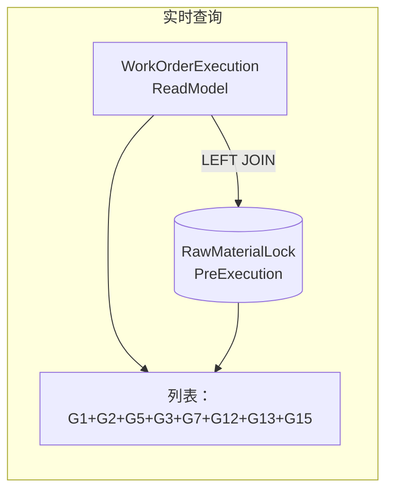
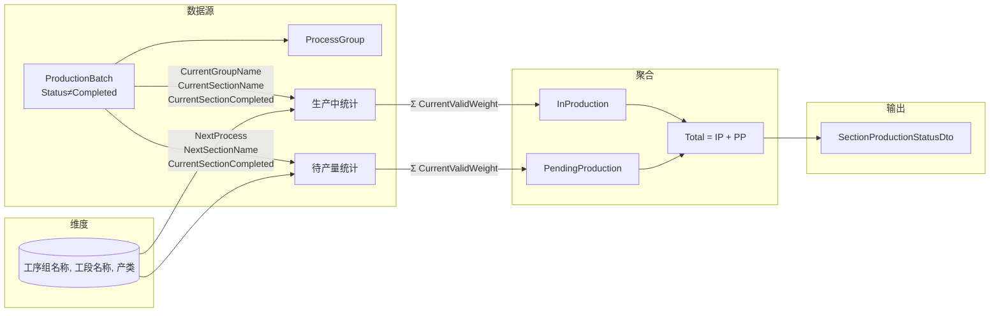
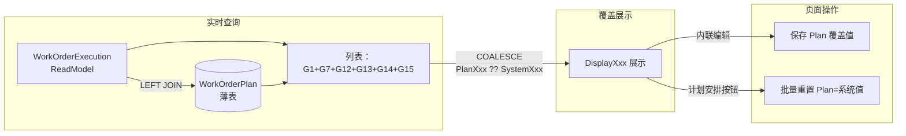
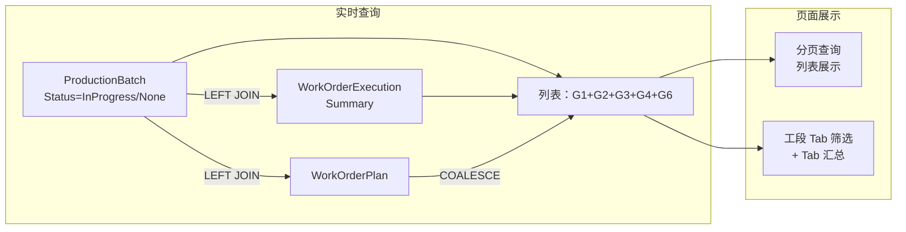

# 计划排程上下文详细设计

**版本：V5.37**
**最后更新：2026-08-21**

---

## 一、概述

计划排程上下文（Scheduling Context）是工单执行状况读模型的上层调度管理上下文，提供多层宏观到微观的调度视图：

1. **工单总览** — 最宏观的产能负荷视图，展示各工段待产量与时间分布
2. **原锁计划** — 原料锁定（ScheduleStage=2）阶段的调度计划快照与执行跟踪
3. **工单排程** — 生产执行（ScheduleStage=3）阶段的排程快照与执行跟踪
4. **冷轧排程** — 按规格维度聚合的冷轧时间桶分布计划（页面标题与菜单名，原"冷轧计划"改名，2026-08-21），含冷轧排程（ColdRollSpecSchedule）编辑
5. **批次计划** — 在产明细计划实时视图，ProductionBatch LEFT JOIN WorkOrderExecutionSummary + WorkOrderPlan + BatchPlanSchedule 薄表，G4 工单计划采用 COALESCE（Plan优先），G10 工单需求调整直接从实体读取（无需 JOIN OrderDemandAdjustment），展示批次级的生产执行状态与重点关注；含工段 Tab 汇总 + 计划安排（三规则生成薄表）+ G13 薄表内联编辑；ProductionFlowProperty 兜底：无 Plan 覆盖且无 Summary 数据时，非工单批次→"略"，其他→"疑问"
6. **成检计划** — 成品检验状态跟踪，全量加载 Items 模式，四档 Tab（全部/待到料/待检验/检验中），客户端分页/排序/筛选

**核心定位：**
- 工单总览为纯查询聚合（无独立实体），汇总 WorkOrderExecutionSummary 和 ProductionBatch 数据
- 不直接计算读模型，而是基于已完成的 `WorkOrderExecutionSummary` 读模型进行调度决策
- 工单需求调整是手工维护的独立实体（非读模型），记录对生产排程的催单要求
- 原锁计划是**实时查询视图**（非物化表），通过 LEFT JOIN WorkOrderExecutionSummary + RawMaterialLockPreExecution 实时查询（G13 直接从实体读取，无需 JOIN OrderDemandAdjustment），无需"计划安排"全量刷新
- 工单排程是**LEFT JOIN 实时查询 + WorkOrderPlan 手动覆盖薄表**：主数据从 `WorkOrderExecutionSummary` 实时查询（过滤 `ProductionFlowProperty != "略"`），`WorkOrderPlan` 薄表存储用户手工覆盖值（4 个字段：ScheduleStage/UrgencyLevel/ProductionAttentionProcess/ProductionFlowProperty），通过 COALESCE 模式 `DisplayXxx = PlanXxx ?? SystemXxx` 展示
- G15（预执行）为页面操作标记区域，存储于 `RawMaterialLockPreExecution` 独立表（仅含 WorkOrderId + 用户编辑字段），通过 LEFT JOIN 实时查询加载
- 工单需求调整 UI/API 已迁移至工单上下文，G13 字段通过 RefreshAllAsync 同步写入 WorkOrderExecutionSummary
- **冷轧排程（ColdRollSpecSchedule）是独立实体（非读模型），存储排程员在冷轧排程页面上设置的排程决策（完成类型+待轧类型+待轧序+待轧设备号+单机单日量），按 (ProcessType, BilletSpec, RollingSpec, IsFinished) 唯一约束，全量同步模式**
- **批次计划和冷轧排程的 G4 采用 WorkOrderPlan COALESCE 模式**（与工单排程统一），IsKeyBatch 计算使用 COALESCE 后的最终值，判定逻辑为 `MainNoAttentionProcess 非空 && UrgencyLevel in [APlusUrgent, AUrgent] && ProductionFlowProperty=="正常"` + 序号比较（V5.11 统一，2026-08-13 修订：生产收尾直接重点、未产批次执行序视为 0）
- **ScheduleStage 默认值修正**：无 WorkOrderExecutionSummary 记录的批次，其 ScheduleStage 默认值从 `0`（工单完成，误导）改为 `-1`（"存错-无此工单"，红色 MudChip 警示），批次计划和成检计划两处同步修改
- **批次计划薄表（BatchPlanSchedule）是独立实体（非读模型），存储批次级的计划安排决策（IsFlow/PlanFlowLevel 五档/PlanFlowTarget 六档/PlanFlowCRType/PlanOuterDiameterSpan/PlanFlowExecSpec/ExecutionSequence/TargetSequence + 抢单/备注），通过"计划安排"按钮按三规则自动生成快照：规则1 冷轧排程命中→planFlowTarget=dto.FlowTarget（完工冷轧/冷轧/成检）；规则2 重点生产批次→planFlowTarget=MapFlowTargetByCRType(MainNoAttentionProcess)（荒管处理→荒管检、在制修检→在制检、生产收尾→成品检验、剩余冷轧类→冷轧）、planFlowCRType=MainNoAttentionProcess；规则3 降级→null；支持排程员手工调整排程计划（仅 IsGrabOrder/PlanRemark 内联编辑，其余只读）**
- ~~**批次计划产量目标（BatchPlanTarget）是独立实体（非读模型），存储每个工段在本次计划周期的日产目标(吨)，在批次计划页面 Tab 栏下方以内联编辑框展示，全量覆盖保存，默认值 0 表示未设目标**~~（V5.28 弃用页面输入行，2026-08-24 整套删除：实体/EF 配置/DbSet/后端 Service+接口/Controller/DTO/前端 Service/两处 DI 注册全删，迁移 `20260823194559_DropBatchPlanTargetTable` DROP TABLE `BatchPlanTargets`）

**当前范围（V5.3）：**
- 工单总览（ProductionOverview）：各工段产能负荷的宏观聚合视图
- ~~工单需求调整（OrderDemandAdjustment）已迁移至工单上下文~~
- 原锁计划（RawMaterialLockPlanAndExecution）：原料锁定阶段工单的 LEFT JOIN 实时查询视图
- **工单排程（WorkOrderSchedule）：LEFT JOIN 实时查询（WorkOrderExecutionSummary + WorkOrderPlan 薄表），过滤 `ProductionFlowProperty != "略"`，支持 G15 内联编辑 + ConsistencyStatus（三值：一致/进度调整/错误，值存疑已并入错误）+ 全量计划（V4.5 重构，V5.12 增强）**
- **生产工段待产量现况（SectionProductionStatus）：按(工序组, 工段, 产类)三维汇总批次现有效原料重量 + 计划流转量/重点批重量（V2.4 新增）**
- **生产段流转量分析（SectionFlowAnalysis）：按段落类别维度分析待产总量与可持续天数（V2.5 新增）**
- **冷轧排程（ColdRollPlan）：按规格维度聚合的冷轧时间桶分布计划（页面标题与菜单名，原"冷轧计划"改名），ProductionBatch LEFT JOIN WorkOrderExecutionSummary + WorkOrderPlan，G4 采用 COALESCE（Plan优先），不再引用 WorkOrderSchedule，支持明细/简化视图切换和打印功能（V4.6 新增 WorkOrderPlan COALESCE + IsKeyBatch Tier 2）**
- **冷轧排程（ColdRollSpecSchedule）：排程员在冷轧排程页面上作出的按规格的滚动排程决策，存储为独立实体（ColdRollSpecSchedule 表），全量同步模式（增/改 + 删除不在列表中的旧记录）**
- **批次计划（BatchPlan）：在产明细计划实时视图，ProductionBatch LEFT JOIN WorkOrderExecutionSummary + WorkOrderPlan + BatchPlanSchedule 薄表，G4 工单计划采用 COALESCE（Plan优先），G10 工单需求调整直接从实体读取（无需 JOIN OrderDemandAdjustment），含 Tab 汇总 + 计划安排（三规则生成）+ G13 薄表内联编辑**
- ~~**批次计划产量目标（BatchPlanTarget）：独立实体，每个工段一条日产目标(吨)，在批次计划页面 Tab 栏下方以内联编辑框展示，全量覆盖保存（V5.0 新增）**~~（⚠️ 已删除 2026-08-24：V5.28 页面移除输入行后整套删除，迁移 `20260823194559_DropBatchPlanTargetTable`）
- **成检计划（FinalInspectionPlan）：成品检验状态跟踪页面，全量加载 Items 模式，基于 ProductionBatch + MaterialReceiveCheck + FinalInspection 实时查询，四档 Tab 筛选（全部/待到料/待检验/检验中）**

---

## 二、核心流程

### 2.1 ~~工单需求调整流程~~（已迁移至工单上下文）

> 工单需求调整 UI/API 已迁移至 **工单上下文（工单需求调整页面）**，详情请参见工单上下文相关设计文档。
> `OrderDemandAdjustment` 实体已迁移至 WorkOrder 模块（`MES.Data.Entities.WorkOrder`），原锁计划和工单排程的 G13 字段通过 RefreshAllAsync 同步写入 WorkOrderExecutionSummary，无需 LEFT JOIN 引用。

### 2.2 原锁计划流程



**无需"计划安排"（PlanArrangement）**。原锁计划页面**不再使用物化表**，改为实时查询模式：

1. 查询 `WorkOrderExecutionSummary`（ScheduleStage=2，原料锁定）作为主表
2. LEFT JOIN `RawMaterialLockPreExecution` 获取 G15 预执行标记
3. G13 字段（IsUrging/IsBatchDelivery/IsPaused/AdjustmentRemark）直接从 WorkOrderExecutionSummary 实体读取，无需 JOIN OrderDemandAdjustment

**G15 字段来源：**
- `IsPreInput`、`BudgetInputDate` 存储在 `RawMaterialLockPreExecution` 表，通过 LEFT JOIN 加载
- `ExecutionError` 为 DTO 计算字段：`IsPreInput && (!BudgetInputDate.HasValue || BudgetInputDate.Value.Date < DateTime.Today)`
- `IsMainNoMaterialComplete`/`IsBudgetComplete` 已删除（2026-08-11 迁移 `DropRawMaterialLockPreExecutionCompleteFields`）

### 2.3 工单总览数据流

```mermaid
flowchart LR
    subgraph 订单交期负荷 R1-R6
        A1[WorkOrderExecutionSummary<br/>ScheduleStage >= 2] -->|延期判定 EstComp>交期 且<br/>ScheduleStage=2| R1[订单延期-原料]
        A1 -->|延期判定 EstComp>交期 且<br/>ScheduleStage=3| R2[订单延期-在产]
        A1 -->|延期判定 EstComp>交期 且<br/>ScheduleStage=4| R3[订单延期-成检]
        A1 -->|延期判定 EstComp>交期<br/>按交货日期分桶| R4[订单延期量]
        A1 -->|延期判定 EstComp>交期<br/>按预计完成日分桶| R5[订单延期量[预计完结]]
        A1 -->|非延期 EstComp<=交期| R6[订单非延期]
    end

    subgraph 整体完工预计 R7
        A1 -->|Max生产工段天数 +<br/>原料待投料/2030日产 + 2天成检| R7[整体完工预计]
    end

    subgraph 原料行 R8-R11
        A2[WorkOrderExecutionSummary<br/>ScheduleStage=2] -->|完善计划待投料量| R8[原料·完善计划]
        A2 -->|执行计划待投料量| R9[原料·执行计划]
        A2 -->|成品计划量-已到货量| R10[原料·外购成品]
        R8 --> R11[原料·汇总]
        R9 --> R11
        R10 --> R11
    end

    subgraph 生产行 R12-R17
        B1[ProductionBatch<br/>Status=InProgress/None] -->|CurrentValidWeight| B2[ProcessGroup]
        B2 -->|荒管处理+OuterPolish+工段级到达| R12[荒管抛光]
        B2 -->|50/60冷轧| R13[冷轧5060]
        B2 -->|20/30冷轧| R14[冷轧2030]
        B2 -->|三辊冷轧| R15[冷轧三辊]
        B2 -->|冷拔+ColdRollDraw| R16[冷拔]
        R12 --> R17[在产汇总]
        R13 --> R17
        R14 --> R17
        R15 --> R17
        R16 --> R17
    end

    subgraph 成检行 R18-R19
        C1[成检计划看板<br/>待检验+检验中] -->|批次去重| R18[成检]
        R18 --> R19[成检汇总]
    end

    subgraph 输出
        R1,R2,R3,R4,R5,R6,R7,R8,R9,R10,R11,R12,R13,R14,R15,R16,R17,R18,R19 --> O[ProductionOverviewDto]
        D[7个动态时间桶] --> O
    end
```

> 注意：在制修检、附加成检两道工序无设备分类映射，不参与生产行分配。订单交期负荷 6 行 + 整体完工预计置顶展示（2026-08-19 重排）。

工单总览是纯查询聚合服务（`ProductionOverviewService`），不涉及数据写入。查询步骤：

1. 从 `WorkOrderExecutionSummary` 查询 `ScheduleStage >= 2` 的工单（排除主号暂停/主号完成）
2. 从 `ProductionBatch` 查询 `Status=InProgress/None` 的批次（延期分类行专用覆盖在产/未产/成检）
3. 从 `ProcessGroup` 查询关联批次的工序组
4. 按 7 个时间桶（交期截止-今日、今日+7、+15、+30、+45、+60、远日量，2026-08-19 桶边界 7/15/30/45/60）分布各行的重量
5. **延期判定统一为 `EstComp > 交货日期`**（2026-08-19）：订单延期量（按交货日期分桶）与订单延期量[预计完结]（按预计完成日分桶）统计同一批延期工单、总量一致；订单非延期互补（`EstComp <= 交货日期`）
6. 生产行（R13-R16 冷轧/冷拔）按工序分类：`ClassifySection(pg, sectionName)` 互斥分配，**非荒管行按产出形态拆分在制/成品**（`ClassifyPendingProductStatus`：最先待执行工序组 `ManufacturingSpec==批次规格` 且产类为成品 → 成品，否则在制）；荒管抛光行不拆分（附加量 null 走纯数值）
7. 荒管抛光使用 `IsNotReachedBySection` 进行工段级到达判断（比较工段序号），其他工段使用 `IsNotReached`

### 2.4 生产工段待产量现况



**聚合步骤：**
1. 从 `ProductionBatch` 查询 `Status ≠ Completed` 的所有批次（含 `ProcessGroups`）
2. 提取唯⼀的 `(ProcessGroup.ProcessName, SectionName, ProductStatus)` 组合作为维度行（产类由 `ProductStatusHelper.Calculate` 逐批次判定）
3. 按维度逐行聚合指标（生产中/待产量/汇总量）
4. 另从批次计划全量数据（`GetAllAsync(null)` 口径）汇总 PlanFlowQuantity（计划流转量）与 PlanKeyWeight（重点批重量）

### 2.5 生产段流转量分析

```mermaid
flowchart LR
    subgraph 数据源
        B[SectionFlowCategorySetting] -->|14 个类别 A-N| CAT[Category 维度]
        C[CombinationGroups<br/>组合段落归类] -->|(工序组,工段,产类)<br/>三维归属映射| ITEM[Category 归属行]
        D[SectionProductionStatus<br/>实时计算] -->|各(工序组,工段)维度<br/>待产量汇总| SPS[SectionProductionStatusDto]
    end

    subgraph 映射与聚合
        CAT -->|按 FlowCategoryId<br/>匹配归属行| M[Category 归属行 → 待产量]
        M -->|SUM 按 Category<br/>聚合| AGGR[Category 级汇总]
    end

    subgraph 输出
        AGGR -->|PendingTotal| R1[SectionFlowAnalysisDto]
        AGGR -->|÷ DailyProductionTarget| R2[可持续天数]
        R2 -->|＜ LowerLimitDays→偏少<br/>＞ UpperLimitDays→过多<br/>其他→正常| R3[总况判定]
    end
```

**计算步骤：**
1. 从 `SectionFlowCategorySetting` 加载 14 个流转类别（A-N）
2. 从 `CombinationGroups`（组合段落归类）加载每个类别下的归属行（`(工序组, 工段, 产类)` 三维唯一归属映射），工序组/工段支持"全部"通配，产类为 ProductStatuses 三态或 AllStatus 哨兵（不限定）；`SectionFlowCategoryItem` 已删除
3. 调用 `SectionProductionStatusService.GetStatusAsync()` 实时获取各(工序组,工段)的待产量
4. 按归属行的 `(ProcessGroupName, SectionName, ProductStatus)` 与实时待产量匹配，未归属行不参与聚合，按类别 SUM
5. 计算可持续天数 = `PendingTotal / DailyProductionTarget`
6. 总况判定：可持续天数 < LowerLimitDays → "偏少"；> UpperLimitDays → "过多"；其他 → "正常"

**14 个段落类别（A-N）：**

| 编码 | 名称 | 说明 |
|------|------|------|
| A | 外抛光 | (全部, 外抛光) 通配符 |
| B | 内修磨 | (全部, 内修磨) 通配符 |
| C | 外点磨 | (全部, 外点磨) 通配符 |
| D | 荒管检 | (荒管处理, 检验, 荒管) 三维通配行（由组合段落归类驱动） |
| E | 在制检 | (全部, 检验, 在制) 三维通配行（由组合段落归类驱动） |
| F | 固溶 | (全部, 固溶) 通配符 |
| G | 矫直 | (全部, 矫直) 通配符 |
| H | 切割 | (全部, 切割) 通配符 |
| I | 去油 | (全部, 去油) 通配符 |
| J | 酸洗 | (全部, 酸洗) 通配符 |
| K | 大轧 | (全部, 大轧) 通配符 |
| L | 小轧 | (全部, 小轧) 通配符 |
| M | 冷拔 | (全部, 冷拔) 通配符 |
| N | 成品待检 | (全部, 检验, 成品) 三维通配行（由组合段落归类驱动） |

**重点批次统计（V5.3 新增）：**
- `GetAnalysisAsync()` 在计算完流转量分析后，额外从 ProductionBatch + WorkOrderExecutionSummary 查询非完成批次
- 按段落类别聚合批次级"重点生产批次"（IsKeyBatch）批次数和总重量（吨）
- 重点批次逻辑为**流转量分析看板专用算法**（2026-08-13 起与批次计划 IsKeyBatch 已分道）：`ScheduleStage==3（生产执行）或 2（原料锁定）` 且 `UrgencyLevel in [APlusUrgent, AUrgent]`，且工序为荒管处理或 == MainNoAttentionProcess（非冷轧类工序，或工段为冷轧拔）；ScheduleStage==2 额外要求 IsUrging/IsBatchDelivery
- 结果通过 `KeyBatchCount`（int）和 `KeyBatchWeight`（decimal?）字段返回

**依赖关系：**
- 页面**数据源**来自 SectionFlowCategorySetting + CombinationGroups（组合段落归类）预设表（在"参数表"菜单下管理）
- **实时待产量**来自 SectionProductionStatus（生产工段待产量现况）的实时计算
- **重点批次数据**来自 ProductionBatch + WorkOrderExecutionSummary 实时查询
- 两个维度表均通过"配置上下文"的 AdminOnly 页面维护

### 2.6 工单排程流程



**筛选规则：** 工单排程通过 LEFT JOIN 实时查询 WorkOrderExecutionSummary + WorkOrderPlan，筛选 `ProductionFlowProperty != "略"`（即仅显示有关注价值的工单，排除已标记"略"的工单）。

**数据来源：**
- **G1、G7、G12、G13、G14**：全部从 `WorkOrderExecutionSummary` 实时读取
- **G13**（IsUrging/IsBatchDelivery/IsPaused/AdjustmentRemark）：直接存储在 WorkOrderExecutionSummary 实体中（由 `RefreshAllAsync` 从 `OrderDemandAdjustment` 同步），无需 LEFT JOIN
- **G15**（工单计划）：从 `WorkOrderPlan` 薄表 LEFT JOIN 读取覆盖值

**覆盖展示（COALESCE 模式）：**
- `DisplayScheduleStage = PlanScheduleStage ?? ScheduleStage`（覆盖值优先，null=使用系统值）
- `DisplayUrgencyLevel = PlanUrgencyLevel ?? UrgencyLevel`
- `DisplayProductionAttentionProcess = PlanProductionAttentionProcess ?? ProductionAttentionProcess`
- `DisplayProductionFlowProperty = PlanProductionFlowProperty ?? ProductionFlowProperty`
- `ConsistencyStatus = 三值计算字段`：Service 端 `ApplyConsistencyStatus()` 方法对每行逐字段比较：
  - `"一致"`：全部 4 对字段完全一致
  - `"进度调整"`：仅 PlanProductionAttentionProcess 不同（其他 3 对一致）
  - `"错误"`：其他 3 对（Stage/Urgency/Flow）任一不一致，或跨主号 Plan 值冲突（同一 SalesOrderNo+ProductionMainNo 组的工单 Plan 值不一致）

**ProductionFlowProperty 在批次计划中的兜底逻辑：**
批次计划的 G4 字段 `ProductionFlowProperty` 在无 WorkOrderPlan 覆盖且无 WorkOrderExecutionSummary 数据时，不再返回 null，改为：
- 非工单批次（`WorkOrderNo == "非工单"`）→ `"略"`
- 其他批次 → `"疑问"`

**"计划安排"按钮（V5.12 更名为"全量计划"）：**
- 将当前查询条件（keyword + filters）发送到后端
- 后端重新执行匹配查询，对匹配的工单 Upsert WorkOrderPlan 记录（Plan = 系统值）
- 删除不匹配查询条件的 WorkOrderPlan 行（清理僵尸数据）

**依赖关系：**
- **无物化表**，数据始终最新
- WorkOrderPlan 为薄表（仅含 WorkOrderId + 4 个可 null 覆盖字段），不会过时
- WorkOrderSchedule 物化表（WorkOrderSchedules）**已于 V4.5 删除**

### 2.8 批次计划流程



**数据来源：**
- **G1（批次基础信息）+ G3（状态跟踪）**：从 `ProductionBatch` SELECT 实时读取
- **G4（工单计划）**：字段在 Service 投影时以 COALESCE 模式计算（`WorkOrderPlan.字段 ?? WorkOrderExecutionSummary.字段`），无物化表
- **G10（工单需求调整）**：直接从 `WorkOrderExecutionSummary` 实体读取（`RefreshAllAsync` 已同步），无需 JOIN `OrderDemandAdjustment`
- **G11（关联冷轧排程）/G12（执行反馈）**：实时计算；**G13（批次计划）**：BatchPlanSchedule 薄表 LEFT JOIN

**工段筛选（Section Tab，BatchPlanSectionTabs.All 共享 17 Tab）：**
- 顶部 17 个 MudButton 切换工段视图
- **冷轧类（60冷轧/50冷轧/30冷轧/20冷轧/三辊冷轧/冷拔）**：工序名包含 Tab 名 AND 工段=冷轧拔
- **普通工段类（固溶/矫直/断切/油管断/去油/酸洗/外抛光/内抛+内修磨/外点磨）**：待执行工段精确匹配（"内抛+内修磨"匹配内抛/内修磨两工段）
- **检验类（荒管检/在制检）**：工段=检验 AND 产类=荒管/在制（产类由批次全部 ProcessGroups 内存计算）

**重点批次（IsKeyBatch）逻辑（V5.11 统一，2026-08-13 修订）：**
- 前置条件：MainNoAttentionProcess 非空 && UrgencyLevel in [APlusUrgent, AUrgent] && ProductionFlowProperty=="正常"
- **生产收尾（MainNoAttentionProcess==ProductionAttentionKeys.Finish）→ 直接重点**（不需序号比较）
- 其余：**未产批次（无当前工序组）执行序视为 0 纳入比较**；冷轧类（含三辊冷轧/冷拔）ExecutionSequence < AttentionProcessSectionSequence + 1；其他（荒管处理/在制修检/附加成检）ExecutionSequence < AttentionProcessSectionSequence
- 抽私有静态 `ComputeIsKeyBatch(item, crKeys)`，GetPagedAsync/GetAllAsync 双路径共用防漂移；⚠️ 判定+相应工段序推导+ExecutionSequence 赋值三者必须全放 foreach 顶部（pgLookup/pendingPg continue 之前）
- **仅 G4 工单计划概念（批次计划列显示用）**；冷轧排程逻辑不再使用（V5.25 Model B 改用三档分类器，见 §2.8 批次计划）
- Tab 汇总（计划重点批次数/重量）按 PlanFlowLevel==1（急+）统计（原"重点批次"改名）
- **等级分档：** 等级1A/1B 拆分已废弃（V5.22 实时等级改 3 档，V5.27 等级列细化六档，特急由薄表 PlanFlowLevel 手工体现）

**Tab 汇总：**
- 批次数、总重量(kg)、重点批次数、重点批次重量
- 在分页查询中通过 PagedResult.Extras 字典返回后端聚合结果

### 2.9 冷轧排程流程

```mermaid
flowchart LR
    subgraph 实时查询
        A[ColdRollPlan<br/>规格维度聚合] -->|行唯一键| B[ColdRollSpec<br/>Schedule]
        B -->|GetAllAsync| C[_scheduleEdits<br/>字典]
    end

    subgraph 排程编辑
        C -->|工具栏"编辑排程"| D[进入排程模式]
        D -->|RowTemplate<br/>MudSelect/MudNumericField| E[用户编辑<br/>CompletionType/RollType<br/>RollOrder/MachineNo<br/>DailyOutput]
        E -->|保存| F[验证: RollType≠None<br/>时 RollOrder>0]
        F -->|SaveAllAsync| G[ColdRollSpecSchedule<br/>表写入]
    end

    subgraph 前端展示
        G --> H[ApplyScheduleToItems<br/>回填 DTO]
        H --> I[排序/筛选/文本显示]
    end
```

**数据来源：**
- 排程数据存储在 `ColdRollSpecSchedule` 表，通过 `ColdRollSpecScheduleService.GetAllAsync()` 加载全部记录
- 行唯一键：明细模式为 `(ProcessType, BilletSpec, RollingSpec, IsFinished)`，简化模式为 `(ProcessType, ShortDisplay, IsFinished)`
- 简化视图编辑后保存时自动展开到明细级别
- **DailyOutput（单机单日量，kg/天）**：V5.33 新增字段，decimal(18,3)，单台设备每日可轧制重量，排机估算机台需求数依据（空/≤0 不计入）

**排程编辑操作：**
1. 点击工具栏"编辑排程"按钮进入排程模式
2. 排程设置列（在轧要求/待轧要求/待轧序/待轧设备号/单机单日量）变为 MudSelect/MudNumericField/MudTextField 内联编辑
3. 编辑完成后点击"保存排程"提交到后端
4. 简化视图模式下保存会自动展开到明细级别（`_rawAllItems` 匹配）
5. 验证规则：待轧要求非"无计划"时，待轧序必须 > 0
6. 保存排程时同步失效排机估算缓存（`ColdRollMachineEstimate:List`）与排程建议缓存（`ScheduleSuggestionCacheKey`）

**排程建议引擎（半自动，V5.41）：**
- 端点 `GET /api/cold-roll-plan/suggestion`（`GetScheduleSuggestionAsync`）只产出建议、不自动写库；前端「一键采用」转既有 `POST /save-all` 全量同步通道（建议 Items 转 `ColdRollSpecScheduleDto`，合并未被覆盖的现有行防删僵尸）
- **三步决策：特急锁定(1) → 流转保底(3) → 产能平衡(2)**；数据源复用 `BuildAllocationsAsync`/`scheduleDict`/`capacityDict`/`machineConfigDict`；四维 key 合并 = `scheduleDict.Keys` ∪ allocations 维度
- **急+ 精确判据** = 既有六档档1（`isUrgent ∧ isNormal ∧ AttentionMatchesCurrentCR`）
- **档位阶梯** `TierLadder = [CrOnly, Urgent, Partial2, Partial3, All]`，宽度 0/1/2/3/4；`NormalizeTier`：Partial1→Urgent、Subsequent→All；`MatchesScheduleType`：All/Subsequent→true、CrOnly=档1、Urgent/Partial1=isUrgent∧normal、Partial2=isUrgent、Partial3=isUrgent∨B顺
- **机台数公式** `ComputeMachineCount`：Σ(Weight/(dailyOutput×6m)) 四舍五入远离零；dailyOutput 优先 `capacityDict(>0)` → `scheduleDict.DailyOutput(>0)` → null；PositionDiff≤6 才计
- **流转保底** `ComputeFlowDemand2030`（方式B→方式A）：仅 PositionDiff≤6 且 ProcessType∈{50,60} 的 allocation（PD1~6 待轧也计入），ProcessGroups 按 SequenceNumber 找下一冷轧/冷拔组，仅 next∈{ColdRoll30,ColdRoll20} 计入；daily = capacityDict(方式B) → machineConfigDict.EstimatedDailyOutput(方式A) → null
- flowDemand2030 两部分：**FlowFrom5060**（5060 在制/待轧 PD≤6 本次安排流转→延伸下一 2030 组折算流入）+ **部分一**（2030 本组当前工序组 20/30、PD≤6、档位不命中，`BatchAllocation.IsCurrentGroup` 防双重计数）；对倒判据用 FlowFrom5060
- **5060 流转对倒两阶段**：阶段1 放宽 5060 在制档位（TierStepWide）喂饱 2030 负荷；阶段2 超 maxMachines 后逐档压缩成品档位（TierStepNarrow）
- **产能平衡**：targetCount = 2030 组 max(组 MinMachines, flowDemand2030) / 其他组 组 MinMachines；沿阶梯从 currentTier 放宽至 count∈[target,max]；无机台数配置组级 no-op（suggestedTier="-"）
- **矛盾标注交人**：A=全量仍不足 / A'=急+锁定已超最大机台数 / B=5060在制折算 2030 需求<2030 最小机台数（可叠加）
- **行级标注**：特急锁定行强制档位≥CrOnly；新增行标注（锁定行保留"锁定"状态+追加"；出现批次但无排程行"）；非锁定行 RowStatus="新增"
- 缓存 `ScheduleSuggestionCacheKey` 60s，四处失效（排程保存/产能档案保存/机台数配置保存·删除）；在档门控按「实际命中档位」（`MatchesScheduleType` 同口径）标记待轧要求

**冷轧产能档案（ColdRollCapacity，V5.41）：**
- 表 `ColdRollCapacity`，(ProcessType, BilletSpec, RollingSpec, IsFinished) 四维唯一（UK_CRC_Dimensions）；字段 DailyOutput/SampleCount/MachineNo/LastConfirmedAt
- 端点 `GET /api/cold-roll-capacity/all`、`/list`、`POST /save`；排程保存自动反哺（`ReverseFillCapacityAsync`），排程建议产能平衡输入（capacityDict 优先于 scheduleDict.DailyOutput）

**冷轧机台数配置（ColdRollMachineConfig，V5.41）：**
- 表 `ColdRollMachineConfig`，按单冷轧类型 6 机型，ProcessType 唯一（UK_CRMC_ProcessType）；字段 OwnedCount/MinMachines/MaxMachines/EstimatedDailyOutput/Remark
- 端点 `GET /api/cold-roll-machine-config/all`、`/list`、`POST /save`、`POST /delete/{id}`；配置页 `/cold-roll-machine-configs`，排程建议产能平衡输入（方式A兜底 daily）

### 2.10 批次计划薄表流程

```mermaid
flowchart LR
    subgraph 自动计算
        A[批次计划<br/>"计划安排"按钮] --> B[BatchPlanScheduleService<br/>PlanAllAsync]
        B --> C[按三规则生成快照<br/>PlanIsFlow/PlanFlowLevel 五档/PlanFlowTarget 六档<br/>PlanFlowCRType/外径跨度/PlanFlowExecSpec<br/>PlanExecutionSequence/PlanTargetSequence]
        C --> D[(BatchPlanSchedule 表<br/>Upsert)]
    end

    subgraph 手工调整
        E[批次计划<br/>内联编辑] -->|仅抢单/备注| D
        F[批次计划组字段<br/>PlanIsFlow/PlanFlowLevel/...] -->|前端展示| G[BatchPlanDto]
        D --> F
    end
```

**数据来源：**
- 批次计划数据存储在 `BatchPlanSchedule` 表，通过 `BatchPlanScheduleService.GetAllAsync()` 加载全部记录
- 在 `GetAllAsync()`（批次计划）中通过 LEFT JOIN 映射到 BatchPlanDto 的 `Plan*` 属性
- 8 个字段由 `PlanAllAsync()` 按三规则自动计算，支持手工覆盖（仅抢单/备注内联编辑）

**计划安排流程：**
1. 排程员在批次计划点击"计划安排"按钮
2. 后端遍历当前工段 Tab 筛选的活跃批次，按**三规则**生成快照：
   - **规则1 冷轧排程命中** → planFlowTarget = dto.FlowTarget（完工冷轧/冷轧/成检）
   - **规则2 重点生产批次** → planFlowTarget = `MapFlowTargetByCRType(MainNoAttentionProcess)`（荒管处理→荒管检、在制修检→在制检、生产收尾→成品检验、剩余冷轧类→冷轧）、planFlowCRType = MainNoAttentionProcess
   - **规则3 降级** → planFlowTarget/planFlowCRType 等全 null
   - 等级 PlanFlowLevel 五档（1急+/2急/3急-/4一般/5略）；FlowTarget 存储英文 Key，显示走 DictValueDisplayHelper 兜底 FlowTargetKeys.ToChinese
3. 已有记录则更新（保留抢单/备注），无记录则创建（Upsert）
4. 用户可在页面内联编辑抢单/备注，即时保存（其余字段只读）

---

## 三、业务规则

### 3.1 通用规则

| 规则ID | 规则说明 |
|--------|----------|
| SC-001 | 两个手工实体均为独立实体，不是读模型——因为包含用户手工输入数据 |
| SC-002 | OrderDemandAdjustment 每个工单最多一条记录（WorkOrderId 唯一），由工单需求调整页面维护 |
| SC-003 | 原锁计划使用 LEFT JOIN 实时查询模式（WorkOrderExecutionSummary + RawMaterialLockPreExecution），G13 直接从实体读取，查询时过滤 ScheduleStage=2（原料锁定）的工单，无独立物化表 |
| SC-004 | 工单排程为 LEFT JOIN 实时查询（WorkOrderExecutionSummary + WorkOrderPlan），过滤 `ProductionFlowProperty != "略"`；WorkOrderPlan 为薄表（仅含 WorkOrderId + 4 个手工覆盖字段），通过 COALESCE 模式 `DisplayXxx = PlanXxx ?? SystemXxx` 展示；支持保存单行 Plan 覆盖值和"计划安排"批量重置；无物化表。批次计划和冷轧计划的 G4（工单计划）字段在 Service 投影时同样采用 COALESCE 模式（WorkOrderPlan.字段 ?? WorkOrderExecutionSummary.字段），与工单排程统一 |
| SC-005 | 生产工段待产量现况为纯查询聚合，无需 DB 表或视图，无独立实体 |
| SC-006 | 冷轧排程（ColdRollSpecSchedule）为独立实体，存储排程决策，按 (ProcessType, BilletSpec, RollingSpec, IsFinished) 唯一约束，全量同步模式 |

### 3.2 ~~工单需求调整~~（已迁移至工单上下文）

> 工单需求调整业务规则（SU-001 ~ SU-003）已迁移至工单上下文的工单需求调整模块。
> 本上下文仅保留 `OrderDemandAdjustment` 数据库实体，G13 字段通过 RefreshAllAsync 同步写入 WorkOrderExecutionSummary 实体供查询使用。

### 3.3 原锁计划

| 规则ID | 规则说明 |
|--------|----------|
| RL-001 | 采用 LEFT JOIN 实时查询模式，**无物化表**。G1~G12 实时从 `WorkOrderExecutionSummary` 读取 |
| RL-002 | G13 字段直接从 `WorkOrderExecutionSummary` 实体读取（由 RefreshAllAsync 从 OrderDemandAdjustment 同步），无需 LEFT JOIN |
| RL-003 | `ScheduleStage` 筛选：查询时 WHERE `ScheduleStage=2`（原料锁定），无需存储冗余快照 |
| RL-004 | G15（预执行）存储在 `RawMaterialLockPreExecution` 独立表（仅含 WorkOrderId + IsPreInput + BudgetInputDate），通过 LEFT JOIN 实时加载 |
| RL-005 | `IsPreInput`（执行）：用户手工标注"近几日会投料"的工单，MudSwitch 内联编辑即时保存 |
| RL-006 | `BudgetInputDate`（预算投料日）：用户在 IsPreInput=true 时手工输入日期，MudTextField 内联编辑 |
| RL-007 | `ExecutionError`（执行异常）：DTO 计算字段，`IsPreInput && (!BudgetInputDate.HasValue || BudgetInputDate.Value.Date < DateTime.Today)`（已执行但日期为空或预算投料日已过）。页面以红色 MudChip 显示"是" |
| RL-010 | `HasAbnormality` 后端自动计算：`DaysDiffFromDelivery < 0 OR TotalRemainingWorkDays < 0` |
| RL-011 | ~~`IsMainNoMaterialComplete`（主号齐全）系统自动计算与 `IsBudgetComplete`（预算主号齐全）级联设置~~（已删除 2026-08-11 迁移 `DropRawMaterialLockPreExecutionCompleteFields`：原 RL-008/RL-009 A/B/C/D 就绪分组判定规则与 IsBudgetComplete 级联逻辑随之移除，set-pre-execute-flags 仅剩 IsPreInput/BudgetInputDate 参数） |

### 3.4 工单总览

| 规则ID | 规则说明 |
|--------|----------|
| PO-001 | 工单总览为纯查询聚合，无独立实体，不涉及任何数据写入。**2026-08-19 重构为 19 行**（原 8 行） |
| PO-002 | 数据源：`WorkOrderExecutionSummary`（ScheduleStage >= 2，排除主号暂停/主号完成）+ `ProductionBatch`（Status=InProgress/None，延期分类行另覆盖 InFinalInspection）+ `ProcessGroup` + 成检计划看板（`GetKanbanAsync`） |
| PO-003 | **展示顺序 19 行**：订单交期负荷 6 行置顶（订单延期-原料/在产/成检、订单延期量、订单延期量[预计完结]、订单非延期）→ 整体完工预计 → 原料 4 行（完善计划/执行计划/外购成品/汇总）→ 投料-在产 5 工段（[累]荒管抛光/冷轧5060/冷轧2030/冷轧三辊/冷拔）+汇总 → 成检+成检汇总。**2026-08-24 行名显示配置化**：5 工段行名改走 DictValueDefinitions 配置表（DictKey=ProductionOverviewRowKey，优先 → KeyToChinese 兜底），[累] 为固定口径前缀；改字典显示配置页即生效（后端静态快照保存即刷新） |
| PO-004 | **延期判定统一**（2026-08-19）：延期 = `EstComp > 交货日期`。订单延期量（按交货日期分桶）与订单延期量[预计完结]（按预计完成日分桶）统计**同一批延期工单、总量一致**；订单非延期互补 = `EstComp <= 交货日期`（EstComp 为空不计入）。原「> 桶截止日」会漏计交期在桶中段/远日量桶的工单 |
| PO-005 | 订单延期-原料/在产/成检：主值 = 延期工单中 ScheduleStage=2/3/4 的 TotalWeight 按交货日期分桶；副值（SubValue）分别为 待料（CalcPending 待投料缺口）/ 在产（同工单在产·未产批次 TheoreticalOutputWeight 和）/ 在检（同工单 InFinalInspection 批次 TheoreticalOutputWeight 和） |
| PO-006 | 原料-完善计划 = 原锁计划待投料量汇总 A完善计划（RawMaterialLockRemark）待计划量；执行计划 = C执行计划 待投料量；外购成品 = 成品计划量 − 已到货量（FinishPlanWeight − FinishInWeight 缺口，外购由供应商生产、本厂不投料） |
| PO-007 | 原料-汇总 = 完善计划 + 执行计划 + 外购成品，日期桶逐桶求和（IsSummary） |
| PO-008 | 投料-在产 5 工段待产量 = 匹配该工段类型且尚未到达的批次 CurrentValidWeight 之和。荒管抛光用 IsNotReachedBySection（工段级），其他工段用 IsNotReached（工序组级）；**冷轧/冷拔越界判定（2026-08-20）**：当前工序组==目标冷轧/冷拔组时，若当前工段序号已越过该组冷轧拔序号（如 ColdRoll50 组脱脂 8 > 冷轧拔 6）→ 机台已轧完、不再占用机台产能，IsNotReached 返回 false 不计入待产 |
| PO-009 | **产类拆分**（非荒管行）：批次在目标工段内最先待执行的工序组，`ManufacturingSpec == 批次规格(OrdinalIgnoreCase)` 且产类为成品（`ProductStatusHelper.IsFinishedManufacturingItem`）→ 计入成品，否则计入在制；**成品 + 在制 = 流转总量**（复合显示 `230（中100/成130）`）；荒管抛光行不拆分 |
| PO-010 | 三辊冷轧：ProcessName = "三辊冷轧"，直接匹配；50,60轧机："50冷轧"/"60冷轧"；20,30轧机："20冷轧"/"30冷轧"；拉机："冷拔"且 ColdRollDraw.HasValue |
| PO-011 | 荒管抛光：ProcessName = "荒管处理" 且 OuterPolish 有值，IsNotReachedBySection 检查是否尚未到达外抛光（批次尚未开始或当前工序组序号 < 荒管处理序号计入；同组比较当前工段序号 < 外抛光序号才计入；当前工段不在荒管处理工段字段中不计入） |
| PO-012 | 投料-在产-汇总 = 5 工段逐桶求和（IsSummary） |
| PO-013 | 投料-成检 = 成检计划看板「待检验+检验中」两档生产重量，预/正式合并、按批次去重（与成检计划 `GetSummaryAsync.SummarizePending` 同口径）；成检-汇总 = 成检自身 |
| PO-014 | 整体完工预计：EstDays = Max(生产工段天数) + CEILING(原料待投料量(吨) / 20·30轧机日产) + **2 天成检**（2026-08-19 补齐成品检验环节）；EstDeadline = today + EstDays |
| PO-015 | **日期桶 7 桶（2026-08-19 边界 7/15/30/45/60）**：交期截止-今日（MinValue~today）/ 今日+7 / 今日+15 / 今日+30 / 今日+45 / 今日+60 / 远日量（60+1~MaxValue），各桶互斥不累加；生产行日期桶仅统计已计入待产量的批次，各桶之和 = 该行待产量 |
| PO-016 | 延期分类行（订单延期-原料/在产/成检）副值口径：待料副值走 CalcPending（与行 8/9 同口径），在产/在检副值按工单号（OrdinalIgnoreCase）匹配批次状态聚合，仅统计在延期条件内的工单（副值严格为主值子集，防越出） |

### 3.5 数据分组

| 分组 | 组名 | 包含字段 |
|------|------|----------|
| G1 | 基础数据 | WorkOrderNo, Salesman, CustomerName, SignDate, DeliveryDate, DelayPenalty, SettlementMethod, SalesOrderNo, ProductionMainNo, ProductionSubNo, MaterialName, DeliveryState, PlantGrade, Specification, LengthStatus, TotalQuantity, TotalWeight |
| G2 | 用料计划 | LatestPlanDate, MaterialPlanRate, MaterialPlanStatus, MainNoMaterialPlanRate, MainNoMaterialPlanStatus, ProcessCycle, MaterialPlanCoveredCount, MaterialPlanProportion, LatestRequiredDate |
| G5 | 圆棒穿孔 | PiercingPlanWeight, PiercingSubOutWeight, PiercingSubStatus, PiercingSubInWeight, PiercingSubPendingWeight, PiercingReturnStatus |
| G3 | 投料数据 | InputStartDate, InputEndDate, TotalBatchCount, InputOutputRatio, InputStatus |
| G7 | 有效流转 | FlowOutputRatio, FlowStatus, MainNoFlowOutputRatio, MainNoFlowStatus, FlowTotalBatchCount, FlowIncompleteBatchCount, FlowMaxRemainingWorkDays |
| G12 | 实时关注 | ScheduleStage, TotalRemainingWorkDays, CapacityWorkDays, UrgencyLevel, EstimatedProcessCompletionDate, DaysDiffFromDelivery, RawMaterialLockRemark |
| G13 | 工单需求调整 | IsUrging(催单), IsBatchDelivery(分批交货), IsPaused(主号暂停, 联动连带), AdjustmentRemark(调整备注) |
| G15 | 预执行（原锁） | IsPreInput, BudgetInputDate, ExecutionError |
| G15 | 工单计划（排程） | PlanScheduleStage(覆盖状态), PlanUrgencyLevel(覆盖紧急性), PlanProductionAttentionProcess(覆盖生产关注), PlanProductionFlowProperty(覆盖流转性), ConsistencyStatus(实时一致性/计算字段) |
| G13 | 批次计划（批次计划） | PlanIsFlow(流转), PlanFlowLevel(等级,V5.28 五档 1急+/2急/3急-/4一般/5略), PlanFlowCRType(目标工序), PlanFlowTarget(流转位,六档 成检/完工冷轧/冷轧/荒管检/在制检/成品检验), PlanOuterDiameterSpan(外径跨度), PlanFlowExecSpec(执行规格), PlanExecutionSequence(执行序), PlanTargetSequence(目标序), IsGrabOrder(抢单), PlanRemark(计划备注) — 对应 BatchPlanSchedule 表 |
| G12 | 执行反馈（批次计划） | OriginalDiff(原工量差=PlanTargetSeq-PlanExecutionSeq, 未产执行序视为0), CurrentDiff(现工量差=PlanTargetSeq-ExecutionSequence, 未产视为0), CurrentFlowDiff(G7实时工量差), IsExecuted(是否执行=原工量差≠现工量差), IsCompliant(达标/未达标, 流转=否→null) |
| - | 筛选标记 | HasAbnormality（异常标记，后端自动计算），ExecutionError（执行异常，DTO 计算字段） |

---

## 四、页面设计

### 4.1 ~~工单需求调整页面~~（已迁移至工单上下文）

> 工单需求调整页面已迁移至 **工单上下文**，详情请参见工单上下文相关设计文档。
> - 新路由：`/order-demand-adjustment`
> - 新路径：`MES.Blazor/Pages/WorkOrders/OrderDemandAdjustment.razor`
> - 新导航位置：工单管理 → 工单需求调整
> - 权限：使用工单上下文角色权限（WorkOrderRead / WorkOrderWrite / Admin）

### 4.2 原锁计划页面

- 路由：`/raw-material-lock-plan`
- 路径：`MES.Blazor/Pages/Scheduling/RawMaterialLockPlanAndExecution.razor`
- 导航位置：计划排程 → 原锁计划
- 权限：WorkOrderStaff / WorkOrderDirector / Admin

**页面布局：**
- 顶部工具栏：标题 + 右上角「待投料量汇总」按钮（Outlined，展开/收起切换汇总卡片显隐）
- **汇总数据卡片**（MudPaper 卡片风格，默认折叠）：
  - **顶部行**：工单总数(X批) | 待投料(Xt)，存在成购缺口工单时追加「+成购：Xt」
  - **待投料矩阵**：行=原料锁定备注，列=主号计划性，单元格=单数+待投料重量，含合计行/列
  - **成购矩阵**：仅当存在成购缺口工单时显示，同结构，单元格=成购单数/重量
  - **理论待投料截日**：原锁类别（完善计划/执行计划/外购成品/合计）× 日期桶（按理论截止投料日归桶，空→远日量；桶边界与订单负荷总量页同源），含「待投料总量」列
- **汇总计算公式：**
  - 成购（外购成品）= `Sum(Max(0, FinishPlanWeight - FinishInWeight))`（成品计划量 − 成品到货量缺口，外购由供应商生产、本厂不投料）
  - 待投料 = 分档口径（均扣除外购成品，与订单总览 R1 同口径）：
    - **A质量补料**：`Max(0, (TotalWeight - 成购) × 1.1 × (1 - FlowOutputRatio/100))`（投料已满足但产出不足，补料按流转比缺口折算）
    - **C执行计划/D完善计划等**：`Max(0, (TotalWeight - 成购) × 1.1 - InputWeight)`（扣除外购部分，加10%耗损，减已投料）
  - 理论待投料截日：完善计划/执行计划归 `PendingCalc(item)`，外购成品归 `PurchaseCalc(item)`，逐桶求和
- 搜索框：模糊搜索（工单号/订单号/业务员/客户/牌号/规格/主号）
- 数据表格：MudTable Items 模式（内存全量加载，compact-table 宽表模式），默认 rowsPerPage=10
- 列显隐切换（ColumnDisplaySelect）
- 列默认显隐：G13（实际生产总流转）默认全隐，其余组可见性由 ColumnPrefs 控制

**数据加载模式（B32 规范）：**
- `LoadDataAsync()` 调用 `GetPagedAsync(PageSize=50000)` 一次性加载全部数据到 `_allItems`
- `_filteredItems` 作为 MudTable 的 Items 绑定源
- 无服务端分页，排序/筛选/搜索均在内存中执行

**按钮行为：**
- "打印全部"：WYSIWYG 打印当前筛选后全部数据。调用 `PrintAll()` 构建 `RawMaterialLockPlanPrintRequest`（含当前可见列定义），通过 `openPdfFromApi` JS 函数 POST 到 `api/raw-material-lock-plan/print-file`，获取 PDF 二进制流后以 Blob URL + iframe 全屏覆盖展示
- "打印选中"：仅打印用户勾选的行。调用 `PrintSelected()`，构建与"打印全部"一致的请求体但仅含 `_selectedItems`，复用同一个打印端点。按钮右侧显示选中数量 `(@_selectedItems.Count)`，选中为 0 时 Disabled
- 行选择：左侧 40px 选择列（MudCheckBox），表头全选 CheckBox 控制当前页全选/取消。勾选数据存入 `_selectedItems`（HashSet 引用去重）

**行高亮规则（优先级从高到低）：**
- `overdue-row`（红色 #f8d7da）：DaysDiffFromDelivery <= -7（逾期严重）
- `sales-urging-row`（黄色 #fff3cd）：IsUrging = true（催单）

**排序：**
- 内存客户端排序，`ApplyFiltersAndSort()` 中 switch 按 SortBy 字段排序
- 默认排序：ScheduleStage DESC

**筛选：**
- 模糊搜索（Keyword 覆盖工单号/订单号/业务员/客户/牌号/规格/主号共 7 个字段）
- ExcelFilter 列筛选：通过 `GetFilterValue()` 静态方法从 `_allItems` 内存构建筛选上下文（`BuildFilterContextOptions()`），不再调用服务端 `GetFilterContextsAsync`

**内联编辑（G15 预执行）与全量加载优化（B32 规范）：**
- `IsPreInput`（执行）：MudSwitch 即时切换，调用 `SetPreExecuteFlagsAsync(workOrderIds, isPreInput: newValue, ...)` 即时保存
- `BudgetInputDate`（预算投料日）：仅在 IsPreInput=true 时显示 MudTextField（T="string" + Placeholder="yyyy-MM-dd"），`OnBudgetInputDateChanged` 即时保存
- `ExecutionError`（执行异常）：红色 MudChip 显示"是"（DTO 计算字段，不可编辑）
- **优化要点**：内联编辑后不触发 `LoadDataAsync()` 全量重载，改为本地更新 `_allItems` 中对应行 + 重新计算汇总计数/重量 + 调用 `ApplyFiltersAndSort()` 刷新视图
- 样式参考工单需求调整页面：MudSwitch Color.Primary + Dense，右侧显示"是/否"文本

**分页汇总行（B33 规范）：**
- FooterContent 中显示当前页支数/米数/重量/批次数小计（基于 `_filteredItems` 计算，即筛选后的全部数据，非仅当前页）
- 可汇总列由 `_summableColumnKeys` 静态 HashSet 定义
- 样式：col-footer-cell（顶部 2px 分隔线 + #FAFAFA 背景）+ col-footer-sum（#1565C0 蓝色字体）
- 整数显示规则：decimal 取整 ((int)sum).ToString()

**页面状态持久化：**
- 通过 PageStateService 保存/恢复：排序、搜索关键词、列显隐配置、列筛选值
- 分页索引不持久化（Items 模式加载后自动复位到第 1 页）
- 恢复后调用 `table.ReloadServerData()`

### 4.3 负载总览页面

- 路由：`/plan-overview`
- 路径：`MES.Blazor/Pages/Scheduling/PlanOverview.razor`
- 导航位置：计划排程 → 负载总览（第一项）
- 权限：所有登录用户

**页面布局：**
- 顶部工具栏：仅标题
- 数据表格：MudTable 客户端模式（只读无分页），Dense/Hover/Bordered
- 无搜索、无排序、无分页、无筛选（纯展示）

**表格列结构：**

| 列 | 说明 | 数据来源 |
|----|------|---------|
| 序号 | 行号 1-19（V5.33 由 0-7 扩展） | Seq |
| 类别 | 订单交期负荷/整体完工预计/原料/投料-在产/投料-成检 | Category |
| 工段 | 各工段名称 | Section |
| 待计划量(吨) | 原料完善计划行的待计划量 | PendingPlanTons |
| 在购量(吨) | 原料外购成品行的采购缺口量 | InProcurementTons |
| 待产量(吨) | 投料-在产 5 工段待生产量（非荒管行复合显示 `230（中100/成130）`，中=在制/成=成品） | TotalRemainingTons + PendingInProgressTons + PendingFinishedTons |
| 预计天数 | 整体完工预计行 | EstDays |
| 预计完成 | 整体完工预计行 | EstDeadline |
| 7个时间桶 | 各时间段的重量分布 | DateBucketTons[i] |
| 桶副值 | 订单延期-原料/在产/成检（待料/在产/在检，斜杠式）、订单延期量（超1周，括号式 `87[*18]`） | DateBucketSubTons[i] + SubValuePrefix + SubValueParenFormat |

**日期桶说明（2026-08-19 边界 7/15/30/45/60）：**
- 第一桶（交期截止-今日）：`MinValue ~ 今天`，交期在今天及以前的工单/批次
- 后续桶：今日+7 / 今日+15 / 今日+30 / 今日+45 / 今日+60（各桶区间互斥不累加）
- 远日桶（远日量）：今日+60 以后
- 原料行（完善计划/执行计划/外购成品）：按工单交期分布
- 投料-在产行：按匹配批次的交期分布，各桶之和 = 该行待产量
- 订单延期量：按交货日期分桶；订单延期量[预计完结]：按预计完成日分桶（同一批延期工单，总量一致）

**交互：**
- 切换页面即加载最新数据，无需手动刷新
- 纯展示，无内联编辑、无行点击

### 4.4 生产工段待产量现况页面（已删除）

> 2026-08-24 删除独立路由页 `SectionProductionStatus.razor`。数据（(工序组,工段,产类) 三维聚合）改经**批次计划页**内嵌折叠与**报表总览页**消费，后端 Service/Controller/接口保留（`GET api/section-production-status`）。

### 4.5 生产段流转量分析页面（已删除）

> 2026-08-24 删除独立路由页 `SectionFlowAnalysis.razor`。数据改经**批次计划页**内嵌折叠与**报表总览页**消费，后端 Service/Controller/接口保留（`GET api/section-flow-analysis`），前端 `SectionFlowAnalysisService` 亦保留供上述页面调用。

### 4.5.1 生产段落流转量分析页面（已删除）

> 2026-08-24 删除独立路由页 `SectionParagraphFlowAnalysis.razor`。数据改经**批次计划页**内嵌折叠与**报表总览页**消费，后端 Service/Controller/接口保留（`GET api/section-paragraph-flow-analysis`），前端 `SectionParagraphFlowAnalysisService` 亦保留供上述页面调用。

### 4.6 工单排程页面（原"排程计划"，2026-08-21 改名）

- 路由：`/scheduling-plans`
- 路径：`MES.Blazor/Pages/Scheduling/WorkOrderSchedules.razor` + `.razor.cs`
- 前端 Service：`MES.Blazor/Services/WorkOrderScheduleService.cs`
- 导航位置：计划排程 → 工单排程
- 权限：WorkOrderStaff / WorkOrderDirector / Admin

**页面布局：**
- 顶部工具栏：标题 + "全量计划"按钮（右上角）+ 总记录数
- 搜索框：模糊搜索（工单号/订单号/业务员/客户/牌号/规格/主号）
- 数据表格：MudTable Items 模式（内存全量加载，Dense/Hover），默认 rowsPerPage=10
- 列显隐切换（ColumnDisplaySelect）+ 全字段排序 + ExcelFilter 列筛选
- 列分组标题栏（col-group-header-bar）：G1→G7→G12→G13→G14→G15

**数据加载模式（B32 规范）：**
- `LoadDataAsync()` 调用 `GetPagedAsync(PageSize=50000)` 一次性加载全部数据到 `_allItems`
- `_filteredItems` 作为 MudTable 的 Items 绑定源
- 无服务端分页，排序/筛选/搜索均在内存中执行

**查询模式：**
- LEFT JOIN 实时查询（WorkOrderExecutionSummary + WorkOrderPlan），无物化表
- 筛选条件：`ProductionFlowProperty != null && ProductionFlowProperty != "略"`（排除已标记"略"的工单，即仅显示有关注价值的工单）
- WorkOrderSchedule 物化表（WorkOrderSchedules）已删除，不再使用

**数据分组：**

| 分组 | 组名 | 包含字段 |
|------|------|----------|
| G1 | 基础数据 | WorkOrderNo, Salesman, CustomerName, SignDate, DeliveryDate, DelayPenalty, SettlementMethod, SalesOrderNo, ProductionMainNo, ProductionSubNo, MaterialName, DeliveryState, PlantGrade, Specification, LengthStatus, TotalQuantity, TotalWeight, TotalMeters, TotalItemCount, MinLength, MaxLength |
| G7 | 有效流转 | FlowOutputRatio, FlowStatus, MainNoFlowOutputRatio, MainNoFlowStatus, FlowTotalBatchCount, FlowIncompleteBatchCount, FlowMaxRemainingWorkDays |
| G12 | 实时关注 | ScheduleStage, TotalRemainingWorkDays, CapacityWorkDays, UrgencyLevel, EstimatedProcessCompletionDate, DaysDiffFromDelivery, RawMaterialLockRemark |
| G13 | 工单需求调整 | IsUrging(催单), IsBatchDelivery(分批交货), IsPaused(主号暂停, 联动连带), AdjustmentRemark(调整备注)（直接存储在 WorkOrderExecutionSummary 实体，由 RefreshAllAsync 同步） |
| G14 | 在产节点待量 | PendingSectionRoughTube, PendingSectionWarehouseFix, PendingSection60Roll, PendingSection50Roll, PendingSection30Roll, PendingSection20Roll, PendingSectionThreeRoll, PendingSectionDrawBench, DeformedProcessCompleted, ProductionAttentionProcess, ProductionFlowProperty |
| G15 | 工单计划 | PlanScheduleStage(覆盖工单状态), PlanUrgencyLevel(覆盖紧急性), PlanProductionAttentionProcess(覆盖生产关注), PlanProductionFlowProperty(覆盖流转性), ConsistencyStatus(实时一致性/计算字段) |

**G15 内联编辑：**
- 4 个覆盖字段均支持内联编辑：
  - **PlanScheduleStage**（工单状态覆盖）：MudSelect 选项（0=主号完成/1=原料锁定/2=生产执行/3=成品检验），空选项=使用系统值
  - **PlanUrgencyLevel**（紧急性覆盖）：MudSelect 选项（A+急/A急/B顺/C缓/D缓/E停），空选项=使用系统值（存英文 Key，显示走字典）
  - **PlanProductionAttentionProcess**（生产关注覆盖）：MudSelect 选项（参考 ProcessNames.All：荒管处理/在制修检/60冷轧/50冷轧/30冷轧/20冷轧/三辊冷轧/冷拔/附加成检），空选项=使用系统值（V5.12 从 MudTextField 改为 MudSelect）
  - **PlanProductionFlowProperty**（流转性覆盖）：MudSelect 选项（正常/暂停/待料/疑问/略），空选项=使用系统值
- 编辑后即时调用 `SavePlanAsync(SaveWorkOrderPlanRequest)` 保存
- 当 4 个覆盖值全部为 null 时，自动删除 WorkOrderPlan 记录（恢复系统值）

**实时一致性（ConsistencyStatus）：**
- DTO 计算字段（Service 端 `ApplyConsistencyStatus()` 方法设置），位于 G15 组首列
- 每行逐字段比较 4 对值（Plan* vs 系统值），输出三值之一：
  - **"一致"**（绿色 MudChip）：全部 4 对字段完全一致
  - **"进度调整"**（蓝色 MudChip）：仅 PlanProductionAttentionProcess 不同，其他 3 对一致
  - **"错误"**（红色 MudChip）：Stage/Urgency/Flow 任一不一致，或跨主号 Plan 值冲突（同一 SalesOrderNo+ProductionMainNo 组的工单 Plan 值不一致）
- 用于快速识别手工覆盖过的行及需核查修正的计划值

**"计划安排"按钮（PlanScheduleAllAsync）：**
- 点击后弹出 ConfirmDialog 确认
- 后端执行流程：
  1. 重新执行当前筛选条件（keyword + filters）匹配 `WorkOrderExecutionSummary`
  2. 对匹配的工单 Upsert WorkOrderPlan 记录（Plan 值 = 系统值，即管理员确认当前系统值正确）
  3. 删除不匹配查询条件的 WorkOrderPlan 记录（清理僵尸数据）
  4. 单次 SaveChangesAsync
- 操作不可撤销，建议用户在筛选确认后再点击

**排序：**
- 全字段 SortBy/SortKey 排序
- 默认排序：WorkOrderNo DESC

**筛选：**
- 模糊搜索（Keyword 覆盖 16 个 string 字段）
- ExcelFilter 列筛选：12 个可筛选字段
- 枚举列（ScheduleStage/UrgencyLevel 等）通过 EnumOptions 映射中文显示

**分页汇总行（B33 规范）：**
- FooterContent 中显示当前页可汇总列的小计
- 14 个 B33 可汇总列（TotalQuantity/TotalWeight/TotalMeters 等）
- 样式：col-footer-cell + col-footer-sum（#1565C0 蓝色字体）

**页面状态持久化：**
- 通过 PageStateService 保存/恢复：排序、搜索关键词、分页索引、列显隐配置、列筛选值
- 恢复后调用 `table.ReloadServerData()`

### 4.7 批次计划页面

- 路由：`/batch-plans`
- 路径：`MES.Blazor/Pages/Scheduling/BatchPlans.razor` + `.razor.cs`
- 前端 Service：`MES.Blazor/Services/BatchPlanService.cs`
- 导航位置：计划排程 → 批次计划
- 权限：WorkOrderRead

**页面布局：**
- 顶部：标题"批次计划" + "计划安排"按钮 + **"近日生产量数据"折叠卡片按钮 + "显示类汇总"（原"汇总"按钮改名）+ "段落流转分析" + "工段流转分析"三个折叠查询按钮** + 工段筛选 MudButton 选项卡 + Tab 汇总数据（批次数/总重量/计划流转批次/计划流转重量/计划重点批次数/计划重点批次重量）
- 搜索框：模糊搜索（全 string 字段 + 中文显示文本列：计划状态/等级/布尔 是·否，见下"搜索与筛选"）
- 数据表格：MudTable **全量加载 Items 模式**（客户端过滤/排序/分页）+ 列分组标题栏 + 列显隐切换 + ExcelFilter 列筛选
- 列分组标题栏（col-group-header-bar）顺序：冷轧排程(本层/下层/下下层/本层匹配/下层匹配)→工单需求调整→批次基础信息→批次计划→状态跟踪→执行反馈；**工单计划/关联冷轧排程组默认隐藏（列显隐可切换打开）**，**冷轧排程/工单需求调整组永久隐藏（标题栏不显示）**，批次计划(执行序/目标序)/状态跟踪(现执行序)/执行反馈(原工量差) 单列默认隐藏

**工段筛选 Tab（17 个，BatchPlanSectionTabs.All 前后端共享）：**
- 全部（默认）、60冷轧、50冷轧、30冷轧、20冷轧、三辊冷轧、冷拔、固溶、矫直、断切、油管断、去油、酸洗、外抛光、内抛+内修磨、外点磨、荒管检、在制检
- 该顺序与菜单导航排序一致（冷轧类在前）
- 单击切换，高亮选中状态（Filled+Primary vs Outlined+Default）
- 切换后刷新 Tab 汇总数据
- 断切等通用工段 Tab 筛选为**精确匹配**（CurrentSectionName/NextSectionName == Tab Key/中文，避免子串误匹配油管断等）

**Tab 汇总指标（6 个，V5.28 标签改名）：**
- 批次数（_tabBatchCount）：当前 Tab 筛选后的总批次数
- 总重量（_tabTotalWeight）：当前 Tab 筛选后的总重量(t，÷1000 转换)
- **计划流转批次数**（_tabFlowBatchCount）：当前 Tab 筛选后 PlanIsFlow=true 的批次数量（原"流转批次"）
- **计划流转批次重量**（_tabFlowBatchWeight）：当前 Tab 筛选后 PlanIsFlow=true 的批次重量(t)
- **计划重点批次数**（_tabKeyBatchCount）：当前 Tab 筛选后 PlanFlowLevel==1（急+）的批次数量（原"重点批次"）
- **计划重点批次重量**（_tabKeyBatchWeight）：当前 Tab 筛选后 PlanFlowLevel==1 的批次重量(t)

**近日生产量数据卡片（折叠、懒加载 `GET api/batch-plan/summary`，口径与生产记录页一致）：**
- 行 = 26 工段（冷轧拔按工序分化 + 检验-荒管/检验-在制）+ 合计行；列 = 工段/前6日(t)/前3日(t)/今日(t)
- 统计量 = 生产记录+委外回收量（去油/酸洗=完工记录+委外回收量，荒管检/在制检=过程检验检验重量），显示 /1000 为 t；**0 值留空 + 整行全 0 的工段默认隐藏（合计行始终保留）**；可打印（表格 id `batch-plan-summary-table`）

**三个折叠查询（2026-08-15，原菜单项已移入批次计划页内嵌）：**
- **显示类汇总**（原"汇总"按钮改名）：点击展开跨工段汇总卡片，按 BatchPlanSectionTabs.All 逐工段归桶统计，列：工段/批次数/总重量(t)/流转批次/流转重量(t)/重点批次/重点重量(t)/急+/急/急-/一般/略，含"合计"行（全量唯一批次），可打印
- **段落流转分析**：折叠查询按钮 → 纯 MudTable 表格（无"可持续天数"列），列：生产段落/待在产重量/总况判定/计划重点批流转量/计划流转判定/特急批重量（2026-08-21 表头改名），可打印
- **工段流转分析**：折叠查询按钮 → 纯 MudTable 表格（无"可持续天数"列），列：流转类别/待在产重量/总况判定/计划流转量/计划流转判定/重点批重量（列名未随段落流转分析改名），可打印

**数据分组（V5.28 列重组，全量加载 Items 模式，共 76 列，其中 26 列永久隐藏）：**

| 分组 | 组名 | 包含字段 |
|------|------|----------|
| G1 | 批次基础信息（批次信息+关联工单合并） | BatchNo(生产编号), TagNo(挂牌号), PlantGrade(原料钢号), CurrentValidWeight(重量kg), WorkOrderNo(关联工单号), DeliveryState(交货状态), DeliveryDate(交货日期), Specification(成品规格), LengthStatus(长度状态)；Salesman(业务员)/MinLength(最小长度)/MaxLength(最大长度) 保留定义供搜索/筛选，**永久隐藏**（列显隐选择器不显示） |
| G3 | 状态跟踪 | CurrentExecDate(执行截止日), PendingProcess(执行工序/计算字段), PendingSectionName(待在产执行工段/计算字段), PendingSpec(执行规格/计算字段), PendingUnit(在产单位/计算字段), PendingEquipment(在产设备/计算字段), ExecutionSequence(现执行序) |
| G4 | 工单计划 | UrgencyLevel(工单紧急性), ScheduleStage(计划状态，含 -1无此工单/4非工单 特判), MainNoAttentionProcess(主号关注工序), AttentionProcessSectionSequence(相应工段序), ProductionFlowProperty(生产流转性), IsKeyBatch(重点生产批次/计算字段) |
| G10 | 工单需求调整 | IsUrging(催单), IsBatchDelivery(分批交货), IsPaused(工单暂停), AdjustmentRemark(调整备注)（直接从 WorkOrderExecutionSummary 实体读取，**永久隐藏**） |
| G5 | 冷轧排程（维度明细+匹配结果，**V5.36 全部永久隐藏**） | 本层 CurrentCR_ProcessType/BilletSpec/RollingSpec/IsFinished/**DeformedSeqCompleted(变形序完成)**（5 列）、下层 NextCR_*（4 列）、下下层 NextNextCR_*（4 列）、实时 RealTimeCR_*（4 列），匹配结果 CR_CompletionType(在轧要求)/CR_RollType(待轧要求)/CR_SchedMachineNo(待轧设备号)（**永久隐藏**；冷轧信息展示统一走 G11 判定结果 + G13 批次计划） |
| G11 | 关联冷轧排程（实时计算） | IsFlow(流转，与冷轧排程页面「排程选中」口径一致，二值 是/否；Model B 档位（显示名 V5.26：急+=特急、急=特急-、急-=急）：All=全量、CrOnly=急+(正常流转∧关注==当前冷轧)、Urgent=急+/急(正常流转)、Partial2=急+·急·急-、Partial3=急+·急·急-·顺，不掺入关注状态/IsKeyBatch；**V5.35 重点兜底**：重点生产批次（IsKeyBatch）排程未命中（_trigger==None）→ KeyBatchFallback=true、IsFlow=true，等级=急), FlowLevel(等级列，**显示 ScheduleTierDisplay 六档（V5.27 细化）**：急+/急/急-/顺/带/略，与 _trigger 同源：急+=正常流转∧关注==当前冷轧、急=正常流转∧关注≠当前冷轧、急-=非正常流转、顺=非急但流转(B顺)、带=All 档下非急非顺普通批次、略=不在排程内 IsFlow=false；筛选选项 GetScheduleTierOptions、客户端排序按 ScheduleTier；DTO 隐藏字段 ScheduleTier/ScheduleTierDisplay/AttentionMatchesCurrentCR), FlowTarget(流转目标), FlowCRType(冷轧类型), OuterDiameterSpan(外径跨度), FlowExecSpec(执行规格), TargetSequence(目标序)；**V5.33 显示层统一**：FlowCRType/OuterDiameterSpan/FlowExecSpec 显示源统一到「冷轧排程(实时)」物理下一冷轧拔层（优先 RealTimeCR_*，回退本层→下层→下下层），排程匹配层仅用于 IsFlow/机台判断；**V5.35 重点兜底**：FlowTarget=MapFlowTargetByCRType(MainNoAttentionProcess)（荒管处理→荒管检/在制修检→在制检/生产收尾→成品检验/其余冷轧→冷轧）、FlowCRType=MainNoAttentionProcess、FlowExecSpec=KeyBatchFallbackExecSpec（Service 填充） |
| G12 | 执行反馈 | OriginalDiff(原工量差), CurrentDiff(现工量差), IsExecuted(是否执行), IsCompliant(达标) |
| G13 | 批次计划（持久化，仅 IsGrabOrder/PlanRemark 内联编辑，其余只读） | PlanIsFlow(流转), PlanFlowLevel(等级，显示 PlanFlowLevelDisplay **五档** 1急+/2急/3急-/4一般/5略，特急A/B 手工档已删除), PlanFlowCRType(目标工序), PlanFlowTarget(流转位，**六档**：成检/完工冷轧/冷轧/荒管检/在制检/成品检验), PlanOuterDiameterSpan(外径跨度), PlanFlowExecSpec(执行规格), PlanExecutionSequence(执行序), PlanTargetSequence(目标序), PlanIsPaused(暂停), IsGrabOrder(抢单), PlanRemark(计划备注) |

**永久隐藏列（26 列）**：冷轧排程维度 4 组 17 列（本层 5 含变形序完成/下层 4/下下层 4/实时 4）+ 匹配结果 3 列 + 工单需求调整 4 列 + 最小长度/最大长度 2 列（`_permanentlyHiddenColumnKeys`，列显隐选择器不显示，定义保留供搜索/筛选）

**计算字段（仅前端展示，[JsonIgnore] 不参与网络传输）：**
- `PendingProcess`：工段未完工→CurrentGroupName，已完工→NextProcess
- `PendingSectionName`：工段未完工→CurrentSectionName，已完工→NextSectionName
- `PendingSpec`：工段未完工→CurrentSpec，已完工→CorrespondingSpec
- `PendingUnit`：工段未完工→CurrentOutsource（在产单位/当前委外），已完工→null
- `PendingEquipment`：工段未完工→CurrentEquipmentName（在产设备/当前设备），已完工→null
- `IsProducing`：[JsonIgnore] 仅后端排程判定，工段未完工且（在产单位或在产设备任一非空）→true（原 PendingEquipment 判空语义，在轧要求匹配用）
- `IsKeyBatch`（2026-08-13 修订，抽私有静态 `ComputeIsKeyBatch(item, crKeys)`，GetPagedAsync/GetAllAsync 双路径共用防漂移）：
  - 前置条件：MainNoAttentionProcess 非空 && UrgencyLevel in [APlusUrgent, AUrgent] && ProductionFlowProperty=="正常"
  - **生产收尾（MainNoAttentionProcess==ProductionAttentionKeys.Finish）→ 直接重点**（不需序号比较）
  - 其余：**未产批次（无当前工序组）执行序视为 0 纳入比较**；冷轧类（含三辊冷轧/冷拔）ExecutionSequence < AttentionProcessSectionSequence + 1；其他（荒管处理/在制修检/附加成检）ExecutionSequence < AttentionProcessSectionSequence
  - ⚠️ 判定+相应工段序推导+ExecutionSequence 赋值三者必须全放 foreach 顶部（pgLookup/pendingPg continue 之前）
  - 仅 G4 工单计划概念（批次计划列显示用）；冷轧排程逻辑不再使用（V5.25 Model B 改用三档分类器，见 §2.8）
- 所有 G4 工单计划字段在 Service 层已完成 COALESCE，前端直接用最终有效值

**搜索与筛选（V5.28）：**
- 模糊搜索覆盖全部 string 字段 + 中文显示文本列：计划状态（ScheduleStage 特判 无此工单/非工单）、等级（ScheduleTierDisplay/PlanFlowLevelDisplay）、布尔 是·否（重点生产批次/流转/计划流转/是否执行/抢单/催单/分批交货/工单暂停）
- 日期筛选值格式化 yyyy-MM-dd（DeliveryDate/CurrentExecDate）
- 搜索在 `ApplyFiltersAndSort()` 第 1 步执行，ExcelFilter 列筛选第 2 步执行

**排序模式（V5.28 全量 Items 模式客户端排序）：**
- GetAllAsync 一次性加载全量数据到 `_allItems`，前端客户端过滤（搜索+ExcelFilter）+ 排序 + MudTable Items 自动分页（非 ServerData 分页查询）
- `ApplySorting(List<BatchPlanDto>, sortBy, desc)` 纯内存 switch（sortBy.ToLower()）覆盖全部列 Key，计算字段（IsKeyBatch/PendingProcess/ScheduleTier 等）也在内存 switch 直接排序，无需单独的 `_clientSortableKeys`

**分页汇总行：**
- `ComputePageSums()` 按当前页显示行求和（table.CurrentPage 切片，翻页重算）
- `_summableColumnKeys` 包含 "CurrentValidWeight"/"MinLength"/"MaxLength"
- 样式：col-footer-cell（顶部 2px 分隔线 + #FAFAFA）+ col-footer-sum（#1565C0 蓝色字体）

**枚举筛选中文显示：**
- 全量加载后 `BuildFilterOptionsFromData()` 从 `_allItems` 数据构建各列筛选选项（`_filterContextOptions`）
- 筛选取值 `GetFilterValue(item, key)` 内存取列显示值（枚举列返回英文 Value 与下拉选项匹配），筛选在 `ApplyFiltersAndSort()` 第 2 步 ExcelFilter 列筛选执行

**计划安排按钮（HandlePlanAllAsync）：**
- 点击后调用 `BatchPlanScheduleSvc.PlanAllAsync(_selectedSection)`
- 后端 `PlanAllAsync()` 遍历当前工段 Tab 筛选的活跃批次，按**三规则**生成薄表记录：
  - **规则1 冷轧排程命中** → planFlowTarget = dto.FlowTarget（完工冷轧/冷轧/成检）
  - **规则2 重点生产批次** → planFlowTarget = `MapFlowTargetByCRType(MainNoAttentionProcess)`（荒管处理→荒管检、在制修检→在制检、生产收尾→成品检验、剩余冷轧类→冷轧）、planFlowCRType = MainNoAttentionProcess、planExecutionSequence = dto.ExecutionSequence
  - **规则3 降级** → planFlowTarget/planFlowCRType = null、planExecutionSequence = dto.ExecutionSequence
  - 等级 PlanFlowLevel 五档（1急+/2急/3急-/4一般/5略）；流转位存储英文 Key，前端 DictValueDisplayHelper 兜底 FlowTargetKeys.ToChinese 显示中文
- Upsert 到 BatchPlanSchedule 表，保留已有记录的抢单和备注
- 完成后自动刷新数据

**页面状态持久化：**
- 通过 PageStateService 保存/恢复：排序、搜索关键词、分页索引、列显隐配置、列筛选值、选中工段 Tab
- 恢复后调用 `ApplyFiltersAndSort()` 重算 `_filteredItems`

### 4.8 冷轧排程页面（原"冷轧计划"，2026-08-21 改名）

- 路由：`/cold-roll-plans`
- 路径：`MES.Blazor/Pages/Scheduling/ColdRollPlans.razor` + `.razor.cs`
- 前端 Service：`MES.Blazor/Services/ColdRollPlanService.cs`
- 导航位置：计划排程 → 冷轧排程
- 权限：WorkOrderRead

**页面布局：**
- 顶部工具栏：标题 + 工段筛选 MudButton 选项卡（全部/60冷轧/50冷轧/30冷轧/20冷轧/三辊冷轧/冷拔）+ 明细/简化视图 MudSwitch + 搜索栏（搜索 ProcessType/BilletSpec/RollingSpec/MergeDisplay/ShortDisplay + Immediate 实时搜索）
- Tab 汇总数据：规格数、总重量(kg)、重点批次数、重点批次重量
- 操作按钮：打印 + 编辑排程（进入后显示保存/取消）+ **右上角「排机估算」按钮**（Outlined，展开时 Primary 色 + ExpandLess/ExpandMore 图标，折叠卡片、懒加载）+ ColumnDisplaySelect 列显隐
- 数据表格：MudTable 全量加载后客户端分页 + 列分组标题栏（规格信息/近日在轧/近日待轧/待轧分布/合计/排程设置）+ ExcelFilter 列筛选 + MudTablePager(10/25/50/100)

**排机估算折叠汇总表（V5.33 新增，仿原锁计划「待投料量汇总」模式）：**
- 标题行右上角「排机估算」按钮，默认折叠，展开懒加载（`GET /api/cold-roll-plan/machine-estimate`，60 秒缓存，排程保存主动失效）
- 固定 4 行 × 5 列：轧机类型（冷轧5060/冷轧2030/冷轧三辊/冷拔）×（轧机类型/流转总量(kg)/在制品(kg)/成品(kg)/机台需求数）
- 流转总量 = 该轧机类型已排程批次（排程表命中且档位匹配）近 6 天量（在轧+待轧 PositionDiff≤6，不含远日），口径与排程汇总 `GetScheduleSummaryAsync` 一致
- 在制品/成品 = 按排程产出形态 IsFinished 拆分（最后工序组=成品、中间工序组=在制品，成品+在制=流转总量）
- 机台需求数 = 每日台数 = Σ(规格_i流转量 ÷ 该规格单机单日量) ÷ 6 天，对总数四舍五入（AwayFromZero）；规格 DailyOutput 为空/≤0 不计入
- 固定近 6 天，不随排程汇总近 2/4/6 天切换；表格可打印（print.js `getTableHtml`/`printRawHtml`）

**数据来源与三档分类器（Model B）：**
- 规格维度数据从 `ProductionBatch` + `ProcessGroup` 实时聚合
- **三档分类器（在轧/待轧对称，V5.25 取代 IsKeyBatch/IsGeneralKeyBatch；显示名 V5.26：急+=特急、急=特急-、急-=急）：**
  - **急+（特急）** = IsUrgent(A+/A急) && 正常流转(ProductionFlowProperty=="Normal") && 关注==当前冷轧（主号关注工序经 ProcessKeys 归一 == 命中冷轧排程行 ProcessType）
  - **急（特急-）** = IsUrgent && 正常流转 && 关注≠当前冷轧（含非冷轧关注/无关注）
  - **急-（急）** = IsUrgent && 非正常流转
  - 无紧急度 → 普通/余量（急+/急/急- 均不计）
- 在轧/待轧侧分别按 CompletionType/RollType 档位匹配后才计入汇总（档位不匹配的批次不计入）
- 排程数据来自 `ColdRollSpecSchedule` 小表

**数据分组：**

| 分组 | 组名 | 包含字段 |
|------|------|----------|
| G1 | 规格信息 | ShortDisplay, ProcessType, BilletSpec, RollingSpec, IsFinished, MergeDisplay |
| G2 | 近日在轧 | MachineNo, WeightProd, WeightProdUrgent(急+/特急), WeightProdUrgentSub(急/特急-), WeightProdUrgentOther(急-/急) |
| G3 | 近日待轧 | WeightWaitNear, WeightWaitNearUrgent(急+/特急), WeightWaitNearBackUrgent(急/特急-), WeightWaitNearOtherUrgent(急-/急) |
| G4 | 待轧分布 | WeightToday, WeightTomorrow, WeightDayAfter, WeightExt3, WeightExt4, WeightExt5, WeightDistant |
| G5 | 合计 | WeightTotal |
| G6 | 排程设置 | CompletionType, RollType, RollOrder, SchedMachineNo, DailyOutput |

**排程编辑模式：**
- 5 个排程设置列（在轧要求/待轧要求/待轧序/待轧设备号/单机单日量）始终显示
- 工具栏"编辑排程"按钮进入编辑模式，排程设置列变为内联编辑控件
- 在轧要求（CompletionType）：MudSelect 选项（显示名 V5.26：无计划/全量/急+/急+·急/急+·急·急-/急+·急·急-·顺，即 GetCompletionTypeOptions：CrOnly/Urgent/Partial2/Partial3/All/None）
- 待轧要求（RollType）：MudSelect 选项（显示名同上，GetRollTypeOptions）
- 待轧序（RollOrder）：MudNumericField（Min=0，HideSpinButtons）
- 待轧设备号（SchedMachineNo）：MudTextField
- 单机单日量（DailyOutput，V5.33 新增）：MudNumericField T="decimal?" + HideSpinButtons + Format="G29"，紧邻待轧设备号，排机估算机台需求数依据（空/≤0 不计入）
- 保存到 `ColdRollSpecSchedule` 表，`ScheduleSvc.GetAllAsync()` 加载已有数据
- 简化视图保存时展开到明细级别（`_rawAllItems` 匹配明细行）
- 保存验证：RollType≠"None" 时 RollOrder 必须 > 0
- 保存排程时失效排机估算缓存（`ColdRollMachineEstimate:List`，60 秒缓存）
- CompletionType/RollType 内部值（存储不变，显示名 V5.26）：`CrOnly`=急+（特急）, `Urgent`=急+/急（特急/特急-，正常流转）, `Partial2`=急+·急·急-（A+/A急）, `Partial3`=急+·急·急-·顺（B顺）, `All`=全量, `None`=无计划（-）

**视图切换：**
- 明细视图：按 (ProcessType, BilletSpec, RollingSpec, IsFinished) 维度展示
- 简化视图：MudSwitch 切换，按 (ProcessType, ShortDisplay, IsFinished) 聚合所有重量字段，标题栏宽度自动匹配列宽

**筛选：**
- 关键词搜索：仅匹配 ProcessType/BilletSpec/RollingSpec/MergeDisplay/ShortDisplay 五列
- ExcelFilter 列筛选：CompletionType/RollType 使用 EnumOptions 预设选项，SchedMachineNo 从数据提取唯一值

**排序：**
- 全字段 SortBy/SortKey 排序
- 默认排序：ShortDisplay ASC

**排程编辑实时汇总（V5.12 新增）：**
- 排程编辑模式下，在轧要求/待轧要求下拉值变更时自动触发本地汇总计算
- **计算方式**：从 `_allItems`（已应用 `_scheduleEdits`）中提取数据，按 (CompletionType/RollType, ShortDisplay) 分组
  - `TotalBatchCount` = SUM(BatchCount)，`TotalWeight` = SUM(WeightTotal)
  - `FlowWeight` = SUM(WeightProd + WeightProdUrgent + WeightWaitNear + WeightWaitNearUrgent)
  - `CompletionWeight` = SUM(WeightProd + WeightProdUrgent)
  - `RollWeight` = SUM(WeightWaitNear + WeightWaitNearUrgent)
- **视图切换**：通过 Chip 切换"按在轧要求" / "按待轧要求"维度
- 有未保存编辑时标题显示"编辑中"标识，原工量差筛选按钮隐藏
- 保存后自动恢复服务器汇总数据，取消编辑时从备份恢复服务器数据

**特急管列高亮：** `urgent-cell` CSS 类（浅红底色 #fff0f0 + 深红粗体 #c62828），作用于 WeightProdUrgent/WeightWaitNearUrgent 列

**分页汇总行（B33 规范）：**
- FooterContent 中显示当前页所有重量列（12 列）小计
- `_summableColumnKeys` 静态 HashSet 定义
- 样式：col-footer-cell + col-footer-sum（#1565C0 蓝色字体）

**页面状态持久化：**
- 通过 PageStateService 保存/恢复：排序、搜索关键词、分页索引、列显隐配置、列筛选值、选中工段 Tab、简化视图状态
- 恢复后调用 `table.ReloadServerData()`

### 4.9 成检计划页面

- 路由：`/final-inspection-plan`
- 路径：`MES.Blazor/Pages/Scheduling/FinalInspectionPlan.razor` + `.razor.cs`
- 前端 Service：`MES.Blazor/Services/FinalInspectionPlanService.cs`
- 后端 Service：`MES.Services/Scheduling/FinalInspectionPlanService : IFinalInspectionPlanService`
- Controller：`FinalInspectionPlanController`，`api/final-inspection-plan`
- 导航位置：计划排程 → 成检计划
- 权限：WorkOrderRead
- 数据模式：**全量加载 Items 模式（B32）**，`_allItems` 缓存后客户端分页/排序/筛选

**页面布局：**
- 标题"成检计划" + **右上角「待检批支重汇总」按钮**（Outlined，展开时 Primary 色 + ExpandLess/ExpandMore 图标，折叠卡片、懒加载）+ 五档 Tab（全部/待到料/待检验/检验中/完成检验待入库）+ Tab 汇总（批次数、总重量、A+急/A急 批次统计）
- 搜索框：模糊搜索（批号/挂牌号/牌号/工单号/规格）
- 数据表格：MudTable 全量加载后客户端分页 + 列分组标题栏 G1-G6 + ExcelFilter 列筛选 + MudTablePager(10/25/50/100)
- B33 分页汇总：CurrentValidWeight, InspectionCount, TotalQuantity, QualifiedQuantity, DefectReworkQuantity, DefectWarehouseQuantity, DefectScrapQuantity

**待检批支重汇总卡片（V5.32 新增）：**
- 按钮位于页面标题行右上方，点击切换显隐，首次展开懒加载 `GET api/final-inspection-plan/summary`
- **行=检验项**（PMI检验/表检/尺寸/内窥/水压/水下气压/涡流/超声波/端口着色 9 项），**列=检验项/待到料/待检验+检验中/汇总数据**
- **口径=待检量**：统计「要求该检验项（Req=true）且 本成检类型尚未完成该检验（对应检验日期为空）」的看板批次；已检完的批次（含「完成检验待入库」档）不计入
- 每格=批次数/生产支数/生产重量(kg) 三合一（如 "5批/1000支/8000kg"）；**0批/0支/0kg 显示 "-"** 防视觉污染
- 「待检验+检验中」列=待检验档与检验中档之和；「汇总数据」列=待到料+待检验+检验中 之和（高亮底色 #eef3fa）
- 预+正式合并、按批次去重（每批次仅一行，去重为防御性）；可打印（前端 printRawHtml 直接打印 DOM 表格，标题"成检计划-待检批支重汇总"）

**近日成检量数据卡片（V5.33 新增）：**
- 按钮位于页面标题行右上方（待检批支重汇总按钮前），点击切换显隐，首次展开懒加载 `GET api/final-inspection/summary`（复用质量上下文成品检验列表页的同名端点）
- **行 = 9 个检验项目**（PMI检验/表检/尺寸/内窥/水压/水下气压/涡流/超声波/端口着色）+ 合计行；**列 = 检验项目/前6日(t)/前3日(t)/今日(t)**
- 统计量 = 成品检验记录检验重量 Weight(kg) /1000 显示 t；预检/终检合并统计；**0 值留空 + 整行全 0 的检验项目默认隐藏（合计行始终保留）**
- 可打印（前端 DOM 打印，表格 id `final-inspection-plan-recent-summary-table`）

**五档 Tab 及分组逻辑：**
- **待到料**（默认选中）：`KanbanStage == "待到料"` — ReceiveDate 为空
- **待检验**：`KanbanStage == "待检验"` — ReceiveDate 有值但 MaxInspectionDate 为空
- **检验中**：`KanbanStage == "检验中"` — MaxInspectionDate 有值但未全检
- **完成检验待入库**：`KanbanStage == "完成检验待入库"` — 已检验 且 未入库 且 要求项 ⊆ 已检验项（表检+尺寸恒必检 ∪ ProductRequirement 4 值枚举映射的成品检验项）

**数据分组：**

| 分组 | 组名 | 包含字段 |
|------|------|----------|
| G1 | 批次信息 | BatchNo, InspectionType, IsDeliveryStatus, ProductionType, ManufacturingItem, ManufacturingStatus, DeliveryState, PlantGrade, Specification, LengthStatus, ProductionCutQuantity, ProductionWeight, SourceHeatNo, SourceName, WorkOrderNo, SalesOrderNo, ProductionMainNo, Salesman, EndCustomer |
| G2 | 排程信息 | ScheduleStage, UrgencyLevel |
| G3 | 成检状态 | KanbanStage, ReceiveDate, MaxInspectionDate |
| G4 | 技术要求检验项 | ReqCount, ReqPmi, ReqVisual, ReqDimension, ReqEndoscopy, ReqHydro, ReqUnderwater, ReqEddy, ReqUltrasonic, ReqPortColoring |
| G5 | 各项检验的日期 | InspectionCount, PmiDate, VisualDate, DimensionDate, EndoscopyDate, HydroDate, UnderwaterPneumaticDate, EddyCurrentDate, UltrasonicDate, PortColoringDate |
| G6 | 检验的数量信息 | TotalQuantity, QualifiedQuantity, DefectReworkQuantity, DefectWarehouseQuantity, DefectScrapQuantity |

**紧急程度 MudChip 颜色渲染：**
- `"A+急"` / `"A急"` → Color.Error（红色）
- `"B顺"` → Color.Warning（黄色）

**排序：**
- 全字段 SortBy/SortKey 排序
- 默认排序：BatchNo ASC
- 客户端排序（全量加载模式）

**筛选：**
- 关键词搜索覆盖所有 string 字段
- ExcelFilter 列筛选：ScheduleStage/UrgencyLevel/KanbanStage 等枚举列按 EnumOptions 映射

**页面状态持久化：**
- 通过 PageStateService 保存/恢复：排序、搜索关键词、分页索引、列显隐配置、列筛选值、选中 Tab
- 恢复后调用 `table.ReloadServerData()`

---

## 五、版本历史

| **V5.42** | **2026-08-24** | **全量清理**：① BatchPlanTarget 整套删除（实体/EF 配置/DbSet/后端 Service+接口/Controller/DTO/前端 Service/两处 DI 注册，迁移 `20260823194559_DropBatchPlanTargetTable`），概述/当前范围/§2.10 mermaid 产量目标子图对应描述移除；② §4.4/§4.5/§4.5.1 三个独立路由页（SectionProductionStatus/SectionFlowAnalysis/SectionParagraphFlowAnalysis）删除，数据改经批次计划页内嵌折叠与报表总览页消费，后端 Service/Controller/接口保留；③ 原锁计划 DTO 删除 G5 待回荒管/外购成/理论成品 6 字段 + IsMainNoMaterialComplete/IsBudgetComplete（随 2026-08-11 迁移 DropRawMaterialLockPreExecutionCompleteFields 已删），§2.2 G15 字段来源/§3.3 RL-008~012/§3.5 G5·G15 组行/§4.2 汇总公式与内联编辑同步更新 |
| **V5.41** | **2026-08-22** | **冷轧排程建议（半自动）+ 冷轧产能档案/机台数配置**：① §2.9 新增排程建议引擎（`GET /api/cold-roll-plan/suggestion`）：三步决策 特急锁定→流转保底→产能平衡，档位阶梯 TierLadder + CrOnly 精确判据 + ComputeMachineCount 机台数公式 + flowDemand2030 两部分（IsCurrentGroup 防双计）+ 5060 流转对倒两阶段，矛盾标注 A/A'/B 交人，缓存 ScheduleSuggestionCacheKey 60s 四处失效，一键采用走 save-all 全量同步；② 新增冷轧产能档案 ColdRollCapacity（四维唯一，排程保存自动反哺 ReverseFillCapacityAsync，排程建议产能平衡输入）；③ 新增冷轧机台数配置 ColdRollMachineConfig（ProcessType 唯一，排程建议产能平衡输入方式A兜底 daily，配置页 /cold-roll-machine-configs） |
| **V5.40** | **2026-08-21** | **批次计划页「近日生产量数据」显示优化**：§4.7 补「近日生产量数据」折叠卡片说明（行=26 工段+合计，列=前6日/前3日/今日，统计生产量 t）；重量单元格 0 值留空（FormatT）+ 整行全 0 的工段默认隐藏（合计保留，Service `GetSummaryAsync` return 前 RemoveAll） |
| **V5.39** | **2026-08-21** | **成检计划页「近日成检量数据」卡片**：§4.9 成检计划页标题行新增「近日成检量数据」折叠卡片（懒加载 `GET api/final-inspection/summary`，复用质量上下文成品检验同名端点）；行=9 个检验项目+合计，列=检验项目/前6日(t)/前3日(t)/今日(t)，统计检验重量、0 值留空+整行全 0 隐藏，可打印 |
| **V5.38** | **2026-08-21** | **页面改名 + 段落流转分析表头改名**：① 排程计划→**工单排程**、冷轧计划→**冷轧排程**（页面标题 + 菜单，MainLayout/MobileLayout 两处）；② 段落流转分析（独立页 + 批次计划折叠查询 + 首页卡片 2）表头「计划流转量」→「计划重点批流转量」、「重点批重量」→「特急批重量」（工段流转分析列名未变） |
| **V5.37** | **2026-08-21** | **批次计划「在产设备」拆两列（在产单位 + 在产设备）**：`BatchPlanDto.PendingEquipment`（原 未完工→CurrentEquipmentName ?? CurrentOutsource）拆为 `PendingUnit`（在产单位=未完工→CurrentOutsource）与 `PendingEquipment`（在产设备=未完工→CurrentEquipmentName），新增 `IsProducing`（[JsonIgnore] 仅后端排程判定：未完工且单位或设备任一非空，等价原 PendingEquipment 判空语义）；G3 状态跟踪列定义拆两列（**在产单位在前**），RenderCell/搜索/排序/打印导出补 PendingUnit；`BatchPlanService` 在轧要求/待轧逐层匹配 4 处 `PendingEquipment` 判空改用 `IsProducing`（在轧判定含委外单位，防真实场景仅委外无设备号漏判）；真库实证非生产中（完工 376 + 无记录 135）委外/设备均清空（唯一脏数据 2601-682 残留「酸洗炉1」非当前刷新路径） |
| **V5.34** | **2026-08-20** | **投料-在产待产量冷轧拔越界修复（IsNotReached）**：冷轧/冷拔类工序组以「冷轧拔」为机台加工点（本组第一道工段），`IsNotReached` 增加越界判定——当前工序组==目标冷轧/冷拔组 且 当前工段序号已越过该组冷轧拔序号（如 ColdRoll50 组内脱脂 8 > 冷轧拔 6）→ 该机台已轧完、不再占用机台产能，**不计入待产**；实证 12 批次 ColdRoll50 组内冷轧拔已完成、正处脱脂未完工，原逻辑误计 5060 行 16.2 吨（修复后 5060=214 吨，与冷轧计划主列表口径一致）；荒管抛光 `IsNotReachedBySection`（工段级）不受影响；测试 +2 |
| **V5.35** | **2026-08-20** | **批次计划冷轧衔接对齐 + 冷轧维度列移出列显示**：① **待轧逐层匹配对齐**：`ComputeColdRollDimensions` 待轧分支改独立 if 链（本层→下层→下下层逐层尝试），与冷轧排程 `BuildAllocationsAsync` 遍历批次所有冷轧层独立判定对齐——**档位对该批次生效才停止**（V5.34 去锁定：本层有档位记录但档位不生效，如 Waiting 急-批次本层设 Urgent 需正常流转 → 不锁定、继续尝试下层）；已轧过层跳过（`IsColdRollPassDone` 按层 ColdRollDraw 与当前工序组/工段序号判定）；② **在轧对齐**：本层冷轧拔已完工且本层检验/酸洗在轧（PendingEquipment 非空）→ 不在轧匹配本层 CompletionType，转待轧逐层匹配下一冷轧拔层；③ **实时重点兜底**：重点生产批次（IsKeyBatch）排程未命中（_trigger==None）→ KeyBatchFallback=true、IsFlow=true、等级急（FlowLevel=2/ScheduleTier=2）、冷轧类型=主号关注工序（MapFlowTargetByCRType）、执行规格=KeyBatchFallbackExecSpec（Service 填充）；④ **显示层统一**：G11 FlowCRType/OuterDiameterSpan/FlowExecSpec 显示源统一到「冷轧排程(实时)」物理下一冷轧拔层（优先 RealTimeCR_* 回退本层→下层→下下层），排程匹配层仅用于 IsFlow/机台判断；⑤ **冷轧维度列移出列显示**（V5.36，推翻 V5.32 释放显示决策）：冷轧排程维度 4 组 17 列（本层 5 含变形序完成 CurrentCR_DeformedSeqCompleted / 下层 4 / 下下层 4 / 实时 4）从批次计划列显示彻底移除（`_permanentlyHiddenColumnKeys`，列显隐选择器不出现），字段/DTO/Service 逻辑全保留（IsFlow 判定输入、薄表计划备注数据源、G11 展示不受影响），冷轧信息批次页统一走 G11「关联冷轧排程」（默认隐藏，列选择器可开）+ G13「批次计划」；⑥ 薄表 PlanAllAsync 读 dto.FlowCRType 同源统一；测试更新（本层冷轧拔已轧过跳下层/本层档位不生效去锁定跳下层/本层档位生效停在生效层/重点批次兜底流转/本层冷轧拔已完工本层在轧转下一层流转等） |
| **V5.33** | **2026-08-20** | **订单总况重构为 19 行 + 冷轧排程单机单日量 + 排机估算**：① 订单总况（工单总览）由 8 行重构为 **19 行**：订单交期负荷 6 行置顶（订单延期-原料/在产/成检、订单延期量、订单延期量[预计完结]、订单非延期），整体完工预计随后，原料 4 行（完善计划/执行计划/外购成品/汇总）、投料-在产 5 工段（[累]荒管抛光/冷轧5060/冷轧2030/冷轧三辊/冷拔）+在产汇总、成检+成检汇总；**延期判定统一为「主号-预计完成日 > 交货日期」**（原「> 桶截止日」会漏计交期在桶中段/远日量桶工单），订单延期量（按交货日期分桶）与订单延期量[预计完结]（按预计完成日分桶）统计同一批延期工单、总量一致；订单延期-原料/在产/成检行带副值（待料/在产/在检），订单延期量带副值（超1周 `[*18]` 红标格式）；整体完工预计=Max(生产工段天数)+原料待投料/20·30轧机日产+**2 天成检**；投料-在产非荒管 4 行待产量按产类拆分在制/成品复合显示（`230（中100/成130）`）；② **冷轧排程新增 DailyOutput（单机单日量 kg/天）**：ColdRollSpecSchedule.DailyOutput decimal(18,3)（迁移 `20260819174709_AddColdRollSpecScheduleDailyOutput`），排程设置组（G6）新增列，简化/详细模式编辑、保存、排序/筛选/搜索/打印全链路；③ **新增排机估算折叠汇总表**：`GET /api/cold-roll-plan/machine-estimate` 按轧机类型聚合 4 行（冷轧5060/冷轧2030/冷轧三辊/冷拔）× 5 列（轧机类型/流转总量/在制品/成品/机台需求数），流转总量=已排程批次近 6 天量（在轧+待轧 PositionDiff≤6 不含远日，口径与排程汇总一致）、在制品/成品按产出形态 IsFinished 拆分（成品+在制=流转总量）、机台需求数=每日台数=Σ(规格流转量÷该规格单机单日量)÷6 天四舍五入、DailyOutput 空/≤0 不计入；60 秒缓存、排程保存主动失效； | **技术要求检验阶段4值枚举 + 成检到料强制完成闭环 + 成检/原锁计划汇总**：① 技术要求 10 成品检验项（PmiInspection/SurfaceInspection/Dimension/Endoscopy/HydrostaticTest/UnderwaterPressure/EddyCurrent/UltrasonicTest/PortColoring/RadiographicTest）由 bool 改为 `InspectionRequirementStage` 4 值枚举（None=「-」/FinalOnly=「终」/PreOnly=「预」/PreAndFinal=「预+终」），理化 20 项 + ChemicalComposition 保持 bool；迁移 `20260816171502_ProductRequirementInspectionStageEnum`（bit→nvarchar(20)，存量 '1'→FinalOnly/'0'→None）；工厂检验项映射（必检→FinalOnly/按需·-·空→None）+ 工厂 PMI 全必检（迁移 `20260816175222_FactoryInspectionRequirementPmiMandatory`）+ 显示参数化（EnumHelper 静态字典 + 迁移 `20260816180820_SeedEnumDisplayInspectionRequirementStage`）；② 成检计划改为**按成检类型独立判定**（预+终 预成检与正式成检均需检验，**不互相认可**）：BatchRequirement 两套集合 PreRequired/FinalRequired，预行要求项=PreRequired、正式行=FinalRequired，非工单批次兜底 {PMI,表检,尺寸} 两套均 UnionWith；③ 成检到料强制完成闭环：看板主动跳过强制完成批次（forcedKeys）+ 批次首页通知 + 详情页转完成；④ 成检计划右上角新增「待检批支重汇总」卡片（行=检验项，列=检验项/待到料/待检验+检验中/汇总数据，待检量口径=要求该检验项且本成检类型尚未完成检验的看板批次，每格 批次数/支数/重量kg，0 值显"-"，预+正式合并按批次去重，可打印）；⑤ 原锁计划「汇总」按钮移页面右上角改名「待投料量汇总」+ 新增打印 |
| **V5.31** | **2026-08-15** | **流转分析重构 + 新增生产段落流转量分析 + 三查询页面移入批次计划页**：① 新增生产段落流转量分析（SectionParagraphConfig 段落日产配置 + CombinationGroup「归属段落」列上卷 + SectionParagraphFlowAnalysisService），独立页面 §4.5.1；② 工段待产量现况/工段流转分析/段落流转分析 三页面从菜单栏移除，改为批次计划页内嵌折叠查询（「显示类汇总」+「段落流转分析」+「工段流转分析」三个按钮，纯表可打印）；③ 工段流转分析与段落流转分析 DTO 均新增 PlanFlowQuantity（计划流转量=批次计划流转=是重量汇总）/PlanFlowJudgment（>日产量→加速）/PlanKeyWeight（流转=是且等级=急+汇总），「状态判定」改名「总况判定」，列序：流转类别/生产段落→待在产重量→可持续天数(默认隐藏)→总况判定→计划流转量→计划流转判定→重点批重量；④ 工段待产量新增产类维度 + PlanFlowQuantity/PlanKeyWeight 两列，删除属成品工序量（FinalProcessTotal）；⑤ SectionFlowCategoryItem 已删除 → CombinationGroups（(工序组,工段,产类) 三维归属映射）驱动全部 14 类别（含 D/E/N 检验类通配行），SectionFlowCategorySetting 删 CategoryCode；⑥ 批次计划工段筛选 Tab 改三类口径（冷轧类 6 按工序名包含+冷拔工段、普通工段类 9 精确匹配含内抛+内修磨、检验类 2 荒管检/在制检按产类），「过程检/成品检」概念已删除 |
| **V5.29** | **2026-08-14** | **删除"非全量·保留调整工序"按钮（V5.12/V5.19 引入）**：后端 `PlanScheduleKeepAttentionAsync` 将 summary 5 档 ScheduleStage 直接写入薄表 4 档字段（缺 `MapSummaryStageToPlanStage` 映射，与 `PlanScheduleAllAsync` 不一致），点击后 G15 工单状态列全部错位、实时一致性大量标"错误"，效果非用户所需；且与"全量计划"功能高度重复。删除前端按钮/事件方法/前端服务方法、`POST /plan-keep-attention` 端点、接口方法、后端方法及 2 个测试；`IsProgressAdjustment` 仍被 ApplyConsistencyStatus 使用故保留 |
| **V5.28** | **2026-08-14** | **批次计划页列重组 + 流转目标六档 + 全量 Items 模式**：① 批次信息+关联工单合并为「批次基础信息」（9 字段），状态跟踪组改名（执行工序/待在产执行工段/在产设备/现执行序）；永久隐藏 22 列（冷轧排程 5 组 15 列 + 工单需求调整 4 列 + 业务员/最小/最大长度 3 列）；② G13 批次计划组只读（仅抢单/计划备注内联编辑），统计栏改名（计划流转批次/计划重点批次，重点按 PlanFlowLevel==1 急+）；③ **流转目标六档**：FlowTargetKeys 3→6 值（新增荒管检/在制检/成品检验），薄表规则2 planFlowTarget=MapFlowTargetByCRType(MainNoAttentionProcess)（荒管处理→荒管检/在制修检→在制检/生产收尾→成品检验/空→null/剩余冷轧类→冷轧），规则1 保持排程 FlowTarget（含完工冷轧）；④ 前端全量 Items 模式客户端排序/筛选，模糊搜索补中文文本列（计划状态/等级/布尔是·否），日期筛选值 yyyy-MM-dd；⑤ 断切工段 Tab 筛选精确匹配；⑥ 移除产量目标输入行 + 成品检验 Tab（BatchPlanTarget 端点/实体已删除，见 V5.42）；⑦ IsKeyBatch 修订（2026-08-13）：生产收尾直接重点、未产批次执行序视为 0 |
| **V5.27** | **2026-08-13** | **批次计划 G11「等级」列细化批次实际排程档位**：BatchPlanDto 新增 ScheduleTier/ScheduleTierDisplay（批次实际档位序 1=急+ 2=急 3=急- 4=顺 5=带 6=略，与 _trigger 同源：略=不在排程内 IsFlow=false、急+=正常流转∧关注==当前冷轧、急=正常流转∧关注≠当前冷轧、急-=非正常流转、顺=非急但流转(B顺)、带=All 档下非急非顺普通批次）；等级列显示由 急/一般/略 细化为 急+/急/急-/顺/带/略（颜色：急+红/急·急-橙/顺灰/带蓝/略灰），列筛选选项与客户端排序（按档位序 ScheduleTier）同步，打印/导出同步；§4.7 G11 分组、接口设计 DTO 表同步；薄表 G13 PlanFlowLevel 与 G7/G8 在轧要求/待轧要求（排程要求聚合名）保持不动；测试 +1（ScheduleTier 六档判定） |
| **V5.26** | **2026-08-13** | **冷轧排程档位显示名精简（减少视觉污染，存储值不变）**：三档分类显示「特急/特急-/急」→「急+/急/急-」；档位层级组合名「特急/特急-/急/B顺」→「急+/急/急-/顺」（B顺→顺）；DisplayHelper.GetCompletionTypeText/GetRollTypeText/GetCompletionTypeOptions/GetRollTypeOptions、ColdRollPlans 列 Label（在轧/待轧 急+/急/急-）、排程汇总表头同步；§2.5 IsFlow/§2.8 三档分类器/§4.7 G11/§4.8 G2/G3 分组/排程编辑下拉选项标注显示名；薄表等级「特急A/特急B」（批次计划 PlanFlowLevel 等级概念）与设备维修 RepairPriority.Emergency 的「特急」独立概念，保持不动 |
| **V5.25** | **2026-08-13** | **Model B：排程档位层级组合化 + IsKeyBatch/IsGeneralKeyBatch 从冷轧排程链路剥离**：① 冷轧排程档位新增严格档 `CrOnly`（特急=正常流转∧关注==当前冷轧）；存量 `Urgent` 档语义改为"特急/特急-"（正常流转，不再区分 IsKeyBatch/IsGeneralKeyBatch），历史兼容值 `Partial1`/`Subsequent` 保留映射；② 批次计划 G11 `_trigger` Urgent 档=isUrgent∧isNormal、CrOnly 档=+关注==当前冷轧；BatchPlanDto 删除 IsGeneralKeyBatch、新增 AttentionMatchesCurrentCR（Service 计算：主号关注工序与命中冷轧排程行 ProcessType 经 ProcessKeys 归一相等）；③ 冷轧计划在轧/待轧对称 3 档统计（特急/特急-/急），汇总 DTO 新增 ProdUrgentSubWeight/WaitUrgentSubWeight，主表 DTO 新增 WeightProdUrgentSub 删除 KeyBatchCount；④ IsKeyBatch 保留但仅 G4 工单计划概念，冷轧排程逻辑不再使用；§2.5/§2.8/§4.7/§4.8 同步；测试改写（在轧特急-/CrOnly 严格档/WaitUrgentSub 独立分档） |
| **V5.23** | **2026-08-13** | **流转 IsFlow 剥离 isPartial1（与冷轧计划「排程选中」口径对齐）**：`_trigger` 删除 isPartial1（原 Urgent 档位 = IsKeyBatch ∥ (A+急/A急 且 生产执行 或 主号完成+催单/分批交货)），Urgent 档位改为仅认 IsKeyBatch（重点批次），不再掺入 ScheduleStage/IsUrging/IsBatchDelivery；IsFlow 二值 是/否 = 是否命中冷轧排程档位（属于本次冷轧计划中排程的批次即"是"，否则"否"），与冷轧计划 `MatchesScheduleType` 口径一致；等级 FlowLevel 保留（已列入冷轧计划的批次显示紧急等级 急/一般，未列入显示 略）；测试 +1（Urgent 档位仅认重点批次，含催单/分批交货不再触发流转） |
| **V5.22** | **2026-08-13** | **实时等级 FlowLevel 剥离 IsKeyBatch（3 档）**：G11「等级」实时 FlowLevel 由 4 档改为 3 档（2=急=A+急·A急 且流转 / 3=一般=B顺+其余流转 / 4=略=非流转）；重点批次 IsKeyBatch 不再参与实时等级判定（仅 G4 工单计划组显示），特急档由薄表 G13 PlanFlowLevel 手工体现；删除 IsFlowLevel1A/IsFlowLevel1B 计算属性（实时等级不可能为 1）；FlowLevelDisplay 为急/一般/略；前端等级列颜色 switch 清理死代码 case 1/5；薄表 PlanFlowLevel（G13）仍为 4 档不变 |
| **V5.21** | **2026-08-13** | **批次计划薄表等级 5 档改 4 档（G13）**：PlanFlowLevel 值域改 4 档（1=特急=IsKeyBatch 重点生产批次 / 2=急=A+急·A急 / 3=一般=B顺+其余流转合并 / 4=略=非流转），显示中文「特急A/特急B/急/一般/略」（特急按 PlanFlowCRType 与主号关注工序匹配拆 A/B，由 PlanFlowLevelDisplay 显示）；G13 计划等级内联编辑值域 1-4；迁移 `20260813042907_UpdateBatchPlanScheduleFlowLevelFourTiers` 存量 UPDATE（5→4、4→3） |
| **V5.20** | **2026-08-12** | **批次计划批次关注组与排程计划统一**：① 计划状态 0 档"工单完成"→"主号完成"（`GetPlanScheduleStageText/Options` 全局，连带排程计划 G15"工单状态"列同步）；② 哨兵简化：`-1`"存错-无此工单"→"无此工单"（批次计划+成检计划两页）、`4`"非工单批次"→"非工单"（批次计划页）；③ 工单紧急性筛选新增"空值"选项（`__EXCEL_FILTER_NULL__` 哨兵模式，GetFilterValue 空值返哨兵+选项 Insert 首位+distinct 排除哨兵）；④ 紧急性颜色由本地 switch 统一走 `DisplayHelper.GetUrgencyColor`；⑤ 主号关注工序/生产流转核查确认已与排程计划统一（ProcessDisplayHelper/DictValueDisplayHelper 转中文），无改动 |
| **V5.19** | **2026-08-11** | **实时一致性四值合并三值 + "进度保留计划"改名并细化行为**：① ConsistencyStatus 由四值（一致/进度调整/值存疑/错误）合并为三值（一致/进度调整/错误），"值存疑"并入"错误"——Stage/Urgency/Flow 任一不一致或跨主号 Plan 冲突统一标红"错误"（计划值异常需核查修正）；② "进度保留计划"改名"非全量·保留调整工序"，行为由"无条件保留全部行关注工序"细化为"仅实时一致性=进度调整档保留手工关注工序，其余档覆盖为系统关注工序"（抽 IsProgressAdjustment helper 与 ApplyConsistencyStatus 共用，判定基于更新前旧薄表值） |
| **V5.18** | **2026-08-09** | **紧急度英文 Key 化同步 + 紧急性选项更新**：IsKeyBatch 判定 UrgencyLevel 由中文 [A+急,A急] 改为英文 Key [APlusUrgent, AUrgent]（UrgencyLevelKeys.IsUrgent），同步 §1 概述/§2.5 重点批次统计/§2.8 冷轧计划/§4.7 批次计划/§4.8 冷轧计划；§4.6 G15 PlanUrgencyLevel MudSelect 选项由旧 5 项（A+急/A急/B急/C急/B顺/普通）更新为 6 项（A+急/A急/B顺/C缓/D缓/E停，存英文 Key 显示走字典） |
| **V5.17** | **2026-08-05** | **关注状态升级五档联动排程**：关注状态由 4 档改为 5 档（0=主号暂停/1=主号完成/2=原料锁定/3=生产执行/4=成品检验）；§1 概述原锁计划=原料锁定(ScheduleStage=1→2)、工单排程=生产执行(ScheduleStage=2→3)；§2.2 原锁计划主表过滤 ScheduleStage=1→2；§2.3 工单总览 ScheduleStage>=1→>=2（排除主号暂停/主号完成）、R1 待投料 ScheduleStage=1→2；§3.3 RL-003 原锁筛选=1→2；§3.4 PO-002/PO-005 同理；G13 IsPaused 改"主号暂停（联动连带）"；WorkOrderPlan 排程覆盖 PlanScheduleStage 仍为排程 4 档不变 |
| **V5.15** | **2026-08-01** | **IsKeyBatch 判定逻辑统一为 V5.11 新算法**：§4.7 批次计划 IsKeyBatch 计算字段删除旧 Tier1/Tier2/pendingProcess 逻辑，改为 `UrgencyLevel in [A+急,A急] && ProductionFlowProperty=="正常" && ProductionAttentionProcess 非空` + 序号比较（冷轧类 `ExecutionSequence < AttentionProcessSectionSequence + 1`，其他 `ExecutionSequence < AttentionProcessSectionSequence`），与 §2.8 一致；§4.8 冷轧计划 IsKeyBatch 同步更新；§4.7 批次流转（G11）/批次计划（G13）分组补充 1A/1B 分档显示字段（IsFlowLevel1A/IsFlowLevel1B/FlowLevelDisplay/PlanFlowLevelDisplay） |
| **V5.13** | **2026-07-03** | **等级1拆分为1A/1B + 冷轧计划新增待轧3档急管分类 + 排程汇总三栏分级 + G13执行序修正**：① FlowLevel==1 拆分为 1A（FlowCRType==MainNoAttentionProcess）和 1B（FlowCRType!=MainNoAttentionProcess），G7 新增 IsFlowLevel1A/IsFlowLevel1B/FlowLevelDisplay 计算属性，G13 新增 PlanFlowLevelDisplay；② 排程汇总从"重点/非重点"改为"特急A档/特急B档/非特急"三档，新增 ProdLevel1BWeight/WaitLevel1BWeight 字段；③ 排程汇总前端列名改为"在轧特急A档/在轧特急B档/在轧非特急/待轧特急A档/待轧特急B档/待轧非特急"；④ G13 PlanAllAsync ExecutionSequence 改为与 G7 一致（始终取 CurrentGroupName/CurrentSectionName），修正工段完工时取错待执行工序的 bug；⑤ 冷轧计划主表新增 WeightProdUrgentOther(急管)、WeightWaitNearBackUrgent(后特急)、WeightWaitNearOtherUrgent(其它急管) 三个字段，实现待轧三路分类（特急管/后特急/其它急管）；⑥ 待轧急管分类逻辑：特急管=冷轧类+序号优先，后特急=非冷轧关注(荒管/在制修检/附加成检)，其它急管=冷轧类但序号不够优先；⑦ 按钮名"全部"→"全部(近日)"、"近3天"→"近2天"、"近5天"→"近4天"，maxDiff 同步调整；⑧ 打印新增 CSS 隐藏侧边栏+应用栏（MudDrawer/MudAppbar） |
| **V5.12** | **2026-06-30** | **ConsistencyStatus 四值系统 + PlanUrgencyLevel/PlanProductionAttentionProcess 改为 MudSelect + 新增进度保留计划 + 冷轧枚举改名 + 列名改名 + 排程汇总实时刷新**：① ConsistencyStatus 从 bool 改为 string?（一致/进度调整/值存疑/错误），Service 端 `ApplyConsistencyStatus()` 每行逐字段比较，跨主号冲突检测；② PlanUrgencyLevel 选项从 (A+急/A急/B顺/C缓/D缓) 改为 (A+急/A急/B急/C急/B顺/普通)；③ PlanProductionAttentionProcess 从 MudTextField 改为 MudSelect（9 个工序选项）；④ 新增"进度保留计划"按钮（`plan-keep-attention`），仅重置 Stage/Urgency/FlowProperty 三字段，保留 AttentionProcess；⑤ 冷轧排程 CompletionType/RollType 枚举从技术名改为业务名 4 档（特急单/急单/含B顺/全量），内部值保持 Urgent/Partial1(=特急单)、Partial2(=急单)、Partial3(=含B顺)、All(=全量)；⑥ 列名"近日在轧(急管)"→"近日在轧(特急管)"、"近日待轧(急管)"→"近日待轧(特急管)"；⑦ 排程汇总移除 7 原工量差筛选，新增编辑模式下按在轧/待轧要求的本地实时汇总（下拉变更即时更新） |
| **V5.11** | **2026-06-29** | **冷轧计划 IsKeyBatch 同步新逻辑 + ExecutionSequence 修正**：① 冷轧计划 IsKeyBatch 改为与批次计划统一的条件链（A+急/A急 + ProductionFlowProperty==正常 + 冷轧类 MainNoAttentionProcess + currentGlobalSeq < ColdRollDraw+1），删除旧 Tier1/Tier2/pendingProcess 逻辑；② ExecutionSequence 改为始终取当前工段在当前工序组中的序号（GetPagedAsync/GetAllAsync 两处），不再因 CurrentSectionCompleted 切换到下一工段 |
| **V5.10** | **2026-06-29** | **批次计划 IsKeyBatch 逻辑重构**：改为 UrgencyLevel==A+急/A急 + ProductionFlowProperty==正常 + 序号比较(冷轧类 ExecutionSequence < AttentionProcessSectionSequence+1，其他 < AttentionProcessSectionSequence)；AttentionProcessSectionSequence 补充三辊冷轧分支；GetPagedAsync 新增 per-item 计算 + ExecutionSequence 推导；GetAllAsync 移动 IsKeyBatch 到序列计算之后；Tab 汇总聚合简化为前两个条件 |
| **V5.9** | **2026-06-29** | **批次计划 G4 新增"相应工段序"字段**：在"主号关注工序"之后新增 AttentionProcessSectionSequence 字段，根据主号关注工序从 ProcessGroups 推导工段序号（荒管处理/在制修检→Inspection，附加成检→最大 SequenceNumber 的 Inspection，冷轧类→ColdRollDraw）；Service 两层循环（GetPagedAsync/GetAllAsync）添加相应计算逻辑，Blazor 列定义/排序/渲染同步更新 |
| **V5.8** | **2026-06-29** | **生产流转性（ProductionFlowProperty）判定逻辑修正 + 非工单兜底**：① Stage==1 催单判定从 AND 改为 OR（催单 OR 分批交货任一即判"正常"）；② IsUrging/IsBatchDelivery/IsPaused 从工单级改为主号级聚合（主号下任一工单暂停即整主号"暂停"）；③ 批次计划中无 Summary 数据的批次 ProductionFlowProperty 兜底从 null 改为非工单→"略"/其他→"疑问" |
| **V5.7** | **2026-06-28** | **ScheduleStage 默认值修正（批次计划+成检计划）**：无 WorkOrderExecutionSummary 记录的批次，ScheduleStage 默认值从 `0`（工单完成，误导）改为 `-1`（"存错-无此工单"，红色 MudChip 警示），更新批次计划和成检计划两处的枚举选项/颜色渲染/筛选/排序 |
| **V5.6** | **2026-06-27** | **批次非工单增强同步说明**：批次上下文"非工单"双路径增强（后端 SaveAllAsync/UpdateAsync 分路径赋值，允许清空工单字段；前端移除"来源长度状态不能为空"验证），不影响计划排程上下文数据流，排程数据仍基于 WorkOrderExecutionSummary 读模型 |
| **V5.5** | **2026-06-26** | **原锁计划新增行选择+打印选中功能 + G15 新增 IsBudgetComplete 字段**：新增左侧 40px 选择列（MudCheckBox），工具栏新增"打印全部"/"打印选中"按钮（右侧对齐），通过 `openPdfFromApi` JS 函数 POST 到 `api/raw-material-lock-plan/print-file` 端点，获取 PDF 后以 Blob URL + iframe 展示；G15 新增 `IsBudgetComplete`（预算主号齐全）字段，MudSwitch 内联编辑，切换为 true 时级联设置同组 `IsMainNoMaterialComplete=true`，false 时强制同组 false；新增 RL-011/RL-012 业务规则 |
| V1.0 | 2026-05-29 | 初始版本，创建计划排程上下文 |
| V2.0 | 2026-06-01 | 新增 G15 锁定操作组（内联编辑）、行高亮规则、分页汇总行、ExcelFilter 列筛选、页面状态持久化、列默认显隐、HasAbnormality 后端计算 |
| V2.1 | 2026-06-01 | 新增工单总览模块（ProductionOverview），纯查询聚合视图；概述/范围/流程/规则/页面设计全量补充 |
| V2.2 | 2026-06-02 | 修正荒管抛光规则：从"ProcessName 含荒管"改为精确匹配"荒管处理+OuterPolish.HasValue"，增加 1.1 倍原料换算（rawRatio），增加 PO-015 待投料换算规则 |
| V2.3 | 2026-06-02 | 修复荒管抛光到达判断逻辑：使用 IsNotReachedBySection 工段级比较替代通用的 IsNotReached，新增 PO-016 规则；修复数据流图和查询步骤描述 |
| **V2.4** | **2026-06-02** | **新增生产工段待产量现况**：SectionProductionStatus 纯查询聚合，按(工序组, 工段)维度汇总批次现有效原料重量；新增 §1 概述范围、§2.4 流程图、§3.1 SC-004 规则 |
| **V2.5** | **2026-06-03** | **新增生产段流转量分析**：SectionFlowAnalysis 按段落类别维度分析待产总量与可持续天数，依赖 SectionFlowCategorySetting + SectionFlowCategoryItem 预设表；SectionProductionStatus 新增 ExcelFilter 列筛选支持（string 列 DISTINCT + number 列非空/空） |
| **V2.8** | **2026-06-04** | **新增工单排程模块**：WorkOrderSchedule 物化表（G1+G7+G12+G13），计划安排（ScheduleStage=2 + 主号齐全关联）+ 执行数据更新（仅 G7+G12）；删除 G14 执行快照描述（CurrentScheduleStage/CurrentRawMaterialLockRemark/IsExecuted 已移除）；HasAbnormality 修正为 2 条件；G2/G7 分组补充遗漏字段；移除 RawMaterialLockPlan "执行数据更新"流程 |
| **V2.7** | **2026-06-04** | **G12 新增产能工量字段**：CapacityWorkDays 加入 G12 分组，同时在销售催单、工单排程页面显示 |
| **V2.6** | **2026-06-03** | **重构 G15 为预执行**：G15 从"锁定操作"（存入 SalesUrging 表）改为"预执行"（存入实体字段 IsPreInput + IsMainNoMaterialComplete）；页面从 3 个按钮改为 MudSwitch 内联编辑；"计划安排"重置 G15 标记，"执行数据更新"不覆盖 G15；EstimatedArrivalDate / IsLockConfirmed 改为从 SalesUrging LEFT JOIN 读取的非分组字段 |
| **V2.9** | **2026-06-04** | **原锁计划重构为 LEFT JOIN 实时查询模式**：删除 RawMaterialLockPlanAndExecution 物化表，改为三表 LEFT JOIN 实时查询（WorkOrderExecutionSummary + SalesUrging + RawMaterialLockPreExecution）；G15 移至 RawMaterialLockPreExecution 独立表；新增 BudgetInputDate（预算投料日）+ ExecutionError（执行异常）；IsMainNoMaterialComplete 由手工改为系统自动计算；删除"计划安排"按钮；RL-001~RL-010 规则重写；§2.2 流程重写为实时查询流程图 |
| **V3.0** | **2026-06-04** | **清理页面刷新按钮 + 销售催单无用字段 + 修复主号齐全计算**：统一删除计划排程上下文 5 个页面的"即时更新"/"刷新"按钮（切换页面即最新）；销售催单删除 EstimatedArrivalDate/IsMainNoMaterialComplete/IsLockConfirmed 三个无用字段及 SaveLockConfirmationAsync/UnlockAsync 接口；修复 BudgetInputDate 输入问题（去掉 Immediate 改用失焦保存）；修复 ExecutionError 计算逻辑（IsPreInput && (!BudgetInputDate.HasValue || < Today)）；修复主号齐全重算支持 true 和 false 双向；RowClass 去掉已删除的 IsLockConfirmed 高亮规则 |
| **V3.1** | **2026-06-05** | **销售催单 UI/API 迁移至订单上下文**：页面和 API 从计划排程上下文迁移至订单上下文（订单需求调整页面，路由 `/order-demand-adjustment`），API 基路径改为 `api/order-demand-adjustment`；后端实体 `OrderDemandAdjustment` 保留在本上下文供 LEFT JOIN 引用；§2.1/§3.2/§4.1 标记为已迁移
| **V5.14** | **2026-07-10** | **订单需求调整迁移至工单上下文**：OrderDemandAdjustment UI/API 从订单上下文迁移至工单上下文（工单需求调整页面），Controller/Blazor 移至工单模块，权限改为 WorkOrderRead/WorkOrderWrite；§2.1/§3.2/§4.1 更新为"已迁移至工单上下文"；实体命名空间改为 `MES.Data.Entities.WorkOrder` |
| **V4.0** | **2026-06-06** | **工单排程重构为物化表模式**：WorkOrderSchedule 改为 WorkOrderSchedules 物化表（WorkOrderId 唯一），通过"计划安排"从 WorkOrderExecutionSummary + OrderDemandAdjustment 全量刷新；筛选条件：ScheduleStage=2 或 (ScheduleStage=1 && IsUrging && IsBatchDelivery)；新增 G14 在产节点待量分组；G14 的 ProductionAttentionProcess 为 "-" 时显示"附加成检" |
| **V4.1** | **2026-06-06** | **新增批次计划模块**：BatchPlan 在产明细计划实时视图，ProductionBatch LEFT JOIN WorkOrderExecutionSummary + WorkOrderSchedule；17 个工段筛选 Tab（含冷轧类工序+工段逻辑、过程/成品检验区分）；IsKeyBatch 重点批次逻辑（荒管处理/生产关注工序/附加成检）；Tab 汇总数据（PagedResult.Extras 模式）；客户端排序（计算字段）；枚举筛选中文显示；列分组标题栏 G2→G4→G1→G3 排列 |
| **V4.2** | **2026-06-06** | **新增冷轧计划模块**：ColdRollPlan 按规格维度聚合冷轧时间桶分布计划，支持明细/简化视图切换和打印功能；新增 §2.8 冷轧计划流程 + §4.8 冷轧计划页面设计 |
| **V4.4** | **2026-06-08** | **冷轧排程重构为全量同步模式 + 删除 ScheduleDate**：冷轧排程删除无业务意义的 ScheduleDate 字段，唯一索引降为四维 (ProcessType/BilletSpec/RollingSpec/IsFinished)；API 改为全量同步模式（SaveAllAsync：增/改 + 删除不在列表中的旧记录）；冷轧计划前端同步更新 |
| **V4.5** | **2026-06-09** | **工单排程重构为实时查询 + WorkOrderPlan 薄表模式**：删除 WorkOrderSchedules 物化表（DropWorkOrderScheduleTable 迁移）；改为 WorkOrderExecutionSummary LEFT JOIN WorkOrderPlan 薄表实时查询；新增 G15 工单计划分组（4 个覆盖字段：PlanScheduleStage/PlanUrgencyLevel/PlanProductionAttentionProcess/PlanProductionFlowProperty）+ ConsistencyStatus（实时一致性计算字段）+ 内联编辑 + "计划安排"批量重置按钮；筛选条件改为 `ProductionFlowProperty != "略"`；G13 字段（IsUrging/IsBatchDelivery/IsPaused/AdjustmentRemark）直接存储在 WorkOrderExecutionSummary 实体中，由 RefreshAllAsync 从 OrderDemandAdjustment 同步，不再需要 LEFT JOIN；批次计划和冷轧计划不再引用 WorkOrderSchedule |
| **V4.6** | **2026-06-09** | **批次计划和冷轧计划全面统一为 WorkOrderPlan COALESCE 模式**：批次计划 G4 改为 4 字段（UrgencyLevel/ScheduleStage/ProductionAttentionProcess/ProductionFlowProperty），在 Service 投影时 COALESCE（WorkOrderPlan.字段 ?? WorkOrderExecutionSummary.字段）；G6 从 ORDER BY OrderDemandAdjustment 改为直接从 WorkOrderExecutionSummary 实体读取；IsKeyBatch 新增 Tier 2（ScheduleStage==1 && (IsUrging||IsBatchDelivery) + 紧急 + pending条件）；冷轧计划同步接入 WorkOrderPlan COALESCE（UrgencyLevel/ScheduleStage/ProductionAttentionProcess），IsKeyBatch 逻辑与批次计划完全统一 |
| **V4.7** | **2026-06-10** | **新增批次计划薄表（BatchPlanSchedule）实体 + 冷轧排程流转汇总报表**：新增 BatchPlanSchedule 独立实体，存储批次计划组 7 个字段（计划安排按钮自动计算 + 手工调整）；批次计划列序重排：冷轧排程→工单需求调整→批次关注→批次流转→关联工单→批次信息→状态跟踪→批次计划→执行反馈；冷轧计划新增"排程汇总"报表，基于批次计划组（PlanIsFlow + PlanFlowCRType + OriginalDiff）按冷轧类型+外径跨度聚合；报表完全独立于实时计算的批次流转组；ColumnDisplaySelect 组排序改为按表格列出现顺序 |
| **V4.8** | **2026-06-11** | **工段流转类别重构**：K 过程检→K荒管检（仅汇总 (荒管处理, 检验) 的汇总量）、L 成品待检→L在制检（汇总 (在制修检, 全部工段) 的非成品部分）、新增 M 成品待检（汇总 (在制修检, 全部工段) 的属成品工序量）；明细项工段="全部"时自动聚合该工序组下所有工段 |
| **V4.9** | **2026-06-11** | **新增成检计划模块**：FinalInspectionPlan 成品检验状态跟踪页面，全量加载 Items 模式，四档 Tab（全部/待到料/待检验/检验中），客户端分页/排序/筛选，列分组 G1-G4 |
| **V5.4** | **2026-06-25** | **重命名**：全文"订单总况"→"工单总览"，包括标题/导航位置/数据流/业务规则/页面设计/版本历史中所有引用 |
| **V5.3** | **2026-06-18** | **流转分析扩展为 14 个类别 A-N + 首页看板集成 + 重点批次统计**：段落类别从 12 个(A-M)扩展为 14 个(A-N)，移除 K/L/M 检验组定义，替换为全新 A-N 工段类别表；§2.5 新增 K 大轧/L 小轧/M 冷拔/N 成品待检 4 个生产段类别、变异量计算说明、重点批次统计(V5.3 新增)小节；§4.5 流转分析页面表格新增"重点批/吨"列(KeyBatchCount/KeyBatchWeight)；首页看板卡片 2(批次生产)集成流转分析数据展示(含类别/待产总量/状态判定/重点批次)；§2.5 修正删除重复"依赖关系"段 |
| **V5.1** | **2026-06-13** | **SectionProductionStatus FinalProcessTotal 修复**：修正属成品工序量计算偏大问题，从 HashSet 维度标记+全量预聚合取值改为按批次过滤的独立预聚合字典，仅统计处于最后工序的批次重量；§2.4 新增 FinalProcessTotal 计算规则说明 |
| **V5.0** | **2026-06-12** | **新增批次计划产量目标实体（BatchPlanTarget）**：每个工段一条日产目标(吨)，全量覆盖保存（SaveAllAsync），默认值 0 表示未设目标；批次计划页面 Tab 栏下方新增产量目标输入行（MudNumericField 内联编辑，=0 白色/>0 蓝色高亮+底色）；Tab 筛选重构（过程检验拆分为荒管检/在制检，冷轧类工序前移，共 18 个 Tabs）；Tab 汇总新增流转批次数+流转批次重量两项指标；汇总重量单位由 kg 改为 吨(t) 保留 1 位小数；菜单顺序调整（冷轧计划前移于批次计划之前） |
| **V5.1** | **2026-06-12** | **成检计划增强**：新增 G5 各项检验的日期（9 项检验日期 + InspectionCount）和 G6 检验的数量信息（5 个数量字段），数据来自 FinalInspection 表批量聚合查询；列分组顺序调整为 G1-G2-G3-G4(成检状态)-G5(检验日期)-G6(数量信息)；Tab 汇总新增 A+急/A急 批次数和重量统计；B33 分页汇总新增 6 个数值列 |
