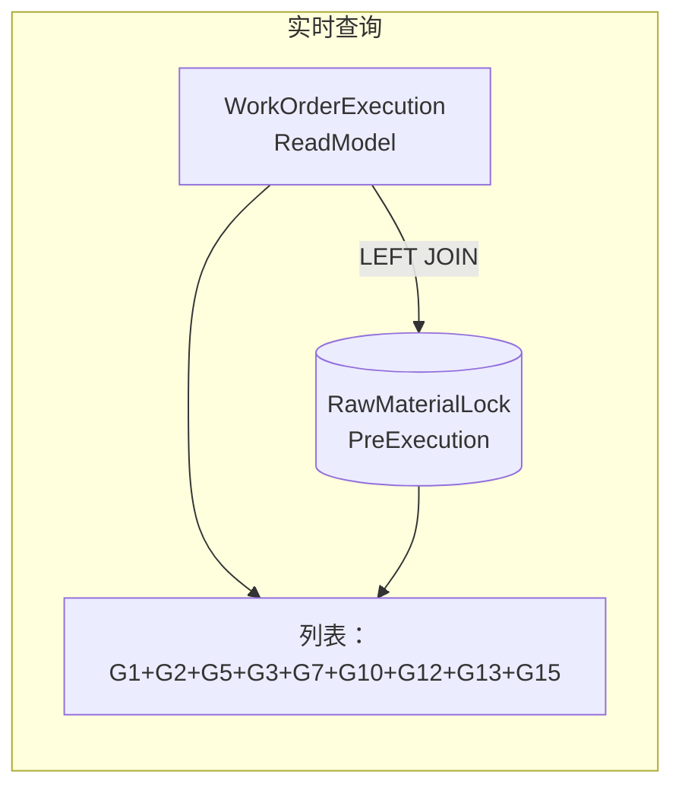
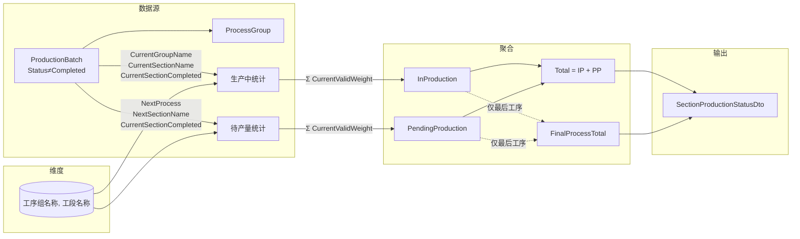
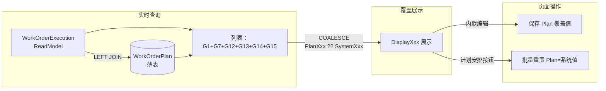
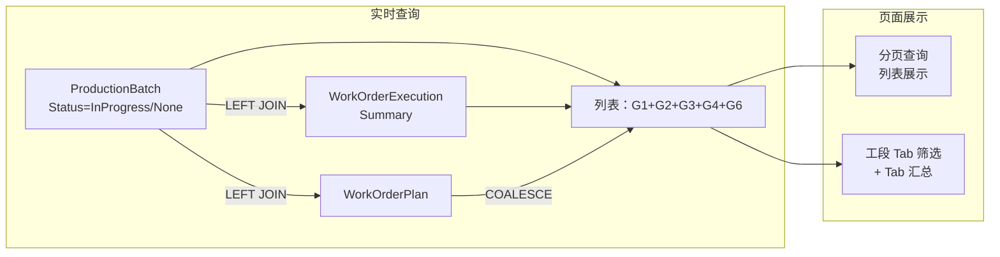

# 计划排程上下文详细设计

**版本：V5.7**
**最后更新：2026-06-28**

---

## 一、概述

计划排程上下文（Scheduling Context）是工单执行状况读模型的上层调度管理上下文，提供多层宏观到微观的调度视图：

1. **工单总览** — 最宏观的产能负荷视图，展示各工段待产量与时间分布
2. **原锁计划** — 原料锁定（ScheduleStage=1）阶段的调度计划快照与执行跟踪
3. **工单排程** — 生产执行（ScheduleStage=2）阶段的排程快照与执行跟踪
4. **冷轧计划** — 按规格维度聚合的冷轧时间桶分布计划，含冷轧排程（ColdRollSpecSchedule）编辑
5. **批次计划** — 在产明细计划实时视图，ProductionBatch LEFT JOIN WorkOrderExecutionSummary + WorkOrderPlan，G4 采用 COALESCE（Plan优先），G6 直接从实体读取（无需 JOIN OrderDemandAdjustment），展示批次级的生产执行状态与重点关注；内含产量目标（BatchPlanTarget）设定
6. **成检计划** — 成品检验状态跟踪，全量加载 Items 模式，四档 Tab（全部/待到料/待检验/检验中），客户端分页/排序/筛选

**核心定位：**
- 工单总览为纯查询聚合（无独立实体），汇总 WorkOrderExecutionSummary 和 ProductionBatch 数据
- 不直接计算读模型，而是基于已完成的 `WorkOrderExecutionSummary` 读模型进行调度决策
- 订单需求调整是手工维护的独立实体（非读模型），记录销售端对生产排程的催单要求
- 原锁计划是**实时查询视图**（非物化表），通过 LEFT JOIN WorkOrderExecutionSummary + RawMaterialLockPreExecution 实时查询（G13 直接从实体读取，无需 JOIN OrderDemandAdjustment），无需"计划安排"全量刷新
- 工单排程是**LEFT JOIN 实时查询 + WorkOrderPlan 手动覆盖薄表**：主数据从 `WorkOrderExecutionSummary` 实时查询（过滤 `ProductionFlowProperty != "略"`），`WorkOrderPlan` 薄表存储用户手工覆盖值（4 个字段：ScheduleStage/UrgencyLevel/ProductionAttentionProcess/ProductionFlowProperty），通过 COALESCE 模式 `DisplayXxx = PlanXxx ?? SystemXxx` 展示
- G15（预执行）为页面操作标记区域，存储于 `RawMaterialLockPreExecution` 独立表（仅含 WorkOrderId + 用户编辑字段），通过 LEFT JOIN 实时查询加载
- 订单需求调整 UI/API 已迁移至订单上下文（订单需求调整页面），OrderDemandAdjustment 数据库实体仍保留在本上下文
- **冷轧排程（ColdRollSpecSchedule）是独立实体（非读模型），存储排程员在冷轧计划上设置的排程决策（完成类型+待轧类型+待轧序+待轧设备号），按 (ProcessType, BilletSpec, RollingSpec, IsFinished) 唯一约束，全量同步模式**
- **批次计划和冷轧计划的 G4 采用 WorkOrderPlan COALESCE 模式**（与工单排程统一），IsKeyBatch 计算使用 COALESCE 后的最终值，新增 Tier 2（ScheduleStage==1 + 催单/分批交货 + 紧急 + pending条件）
- **ScheduleStage 默认值修正**：无 WorkOrderExecutionSummary 记录的批次，其 ScheduleStage 默认值从 `0`（工单完成，误导）改为 `-1`（"存错-无此工单"，红色 MudChip 警示），批次计划和成检计划两处同步修改
- **批次计划薄表（BatchPlanSchedule）是独立实体（非读模型），存储批次级的计划安排决策（IsFlow/FlowLevel/FlowTarget/FlowCRType/FlowExecSpec/ExecutionSequence/TargetSequence + 抢单/备注），通过"计划安排"按钮自动计算 7 个字段的快照，支持排程员手工调整排程计划**
- **批次计划产量目标（BatchPlanTarget）是独立实体（非读模型），存储每个工段在本次计划周期的日产目标(吨)，在批次计划页面 Tab 栏下方以内联编辑框展示，全量覆盖保存，默认值 0 表示未设目标**
- **冷轧排程流转汇总报表**：在冷轧计划页面按"排程汇总"按钮展示，基于批次计划组（PlanIsFlow + PlanFlowCRType + OriginalDiff）聚合的流转重量报表，完全独立于实时计算的批次流转组

**当前范围（V5.3）：**
- 工单总览（ProductionOverview）：各工段产能负荷的宏观聚合视图
- ~~订单需求调整（OrderDemandAdjustment）已迁移至订单上下文~~
- 原锁计划（RawMaterialLockPlanAndExecution）：原料锁定阶段工单的 LEFT JOIN 实时查询视图
- **工单排程（WorkOrderSchedule）：LEFT JOIN 实时查询（WorkOrderExecutionSummary + WorkOrderPlan 薄表），过滤 `ProductionFlowProperty != "略"`，支持 G15 内联编辑 + ConsistencyStatus + 计划安排批量重置（V4.5 重构）**
- **生产工段待产量现况（SectionProductionStatus）：按(工序组, 工段)维度汇总批次现有效原料重量（V2.4 新增）**
- **生产段流转量分析（SectionFlowAnalysis）：按段落类别维度分析待产总量与可持续天数（V2.5 新增）**
- **冷轧计划（ColdRollPlan）：按规格维度聚合的冷轧时间桶分布计划，ProductionBatch LEFT JOIN WorkOrderExecutionSummary + WorkOrderPlan，G4 采用 COALESCE（Plan优先），不再引用 WorkOrderSchedule，支持明细/简化视图切换和打印功能（V4.6 新增 WorkOrderPlan COALESCE + IsKeyBatch Tier 2）**
- **冷轧排程（ColdRollSpecSchedule）：排程员在冷轧计划上作出的按规格的滚动排程决策，存储为独立实体（ColdRollSpecSchedule 表），全量同步模式（增/改 + 删除不在列表中的旧记录）**
- **批次计划（BatchPlan）：在产明细计划实时视图，ProductionBatch LEFT JOIN WorkOrderExecutionSummary + WorkOrderPlan + BatchPlanSchedule，G4 采用 COALESCE（Plan优先），G6 直接从实体读取（无需 JOIN OrderDemandAdjustment），含 Tab 汇总 + 计划安排 + 内联编辑 + 产量目标设定**
- **批次计划产量目标（BatchPlanTarget）：独立实体，每个工段一条日产目标(吨)，在批次计划页面 Tab 栏下方以内联编辑框展示，全量覆盖保存（V5.0 新增）**
- **成检计划（FinalInspectionPlan）：成品检验状态跟踪页面，全量加载 Items 模式，基于 ProductionBatch + MaterialReceiveCheck + FinalInspection 实时查询，四档 Tab 筛选（全部/待到料/待检验/检验中）**

---

## 二、核心流程

### 2.1 ~~订单需求调整流程~~（已迁移至订单上下文）

> 订单需求调整 UI/API 已迁移至 **订单上下文（订单需求调整页面）**，详情请参见《订单上下文接口设计》第 4.7 节。
> 本上下文保留 `OrderDemandAdjustment` 数据库实体，原锁计划和工单排程的 G13 字段通过 RefreshAllAsync 同步写入 WorkOrderExecutionSummary，无需 LEFT JOIN 引用。

### 2.2 原锁计划流程



**无需"计划安排"（PlanArrangement）**。原锁计划页面**不再使用物化表**，改为实时查询模式：

1. 查询 `WorkOrderExecutionSummary`（ScheduleStage=1）作为主表
2. LEFT JOIN `RawMaterialLockPreExecution` 获取 G15 预执行标记
3. G13 字段（IsUrging/IsBatchDelivery/IsPaused/AdjustmentRemark）直接从 WorkOrderExecutionSummary 实体读取，无需 JOIN OrderDemandAdjustment

**G15 字段来源：**
- `IsPreInput`、`BudgetInputDate`、`IsMainNoMaterialComplete` 存储在 `RawMaterialLockPreExecution` 表，通过 LEFT JOIN 加载
- `ExecutionError` 为 DTO 计算字段：`IsPreInput && (!BudgetInputDate.HasValue || BudgetInputDate.Value.Date < DateTime.Today)`
- `IsMainNoMaterialComplete` 为用户在页面切换 `IsPreInput` 时系统自动计算，勾选或取消均触发重算（参见 §3.3 RL-009）

### 2.3 工单总览数据流

```mermaid
flowchart LR
    subgraph 原料行 R0-R2
        A1[WorkOrderExecutionSummary<br/>ScheduleStage >= 1] -->|PendingOutsourceFinishWeight| R0[成品在购]
        A1 -->|ScheduleStage=1<br/>(Total - Outsource)×1.1 - Input| R1[待投料]
        A1 -->|PendingRoughTubeWeight| R2[在购荒管]
    end

    subgraph 生产行 R3-R7
        B1[ProductionBatch<br/>Status=InProgress/None] -->|CurrentValidWeight| B2[ProcessGroup]
        B2 -->|ProcessName=荒管处理<br/>+OuterPolish.HasValue<br/>+工段级到达判断| R3[荒管抛光]
        B2 -->|50冷轧/60冷轧| R4[50,60轧机]
        B2 -->|20冷轧/30冷轧| R5[20,30轧机]
        B2 -->|三辊冷轧| R6[三辊轧机]
        B2 -->|冷拔 + ColdRollDraw| R7[拉机]
    end

    subgraph 输出
        R0,R1,R2,R3,R4,R5,R6,R7 --> C[ProductionOverviewDto]
        D[7个动态时间桶] --> C
    end
```

工单总览是纯查询聚合服务（`ProductionOverviewService`），不涉及数据写入。查询步骤：

1. 从 `WorkOrderExecutionSummary` 查询 `ScheduleStage >= 1` 的工单
2. 从 `ProductionBatch` 查询 `Status=InProgress/None` 的批次
3. 从 `ProcessGroup` 查询关联批次的工序组
4. 按 7 个时间桶（今天、+15d、+30d、+45d、+60d、+90d、远日）分布各行的重量
5. 生产行（R3-R7）按工序分类：`ClassifySection(pg, sectionName)` 互斥分配
6. 荒管抛光使用 `IsNotReachedBySection` 进行工段级到达判断（比较工段序号），其他工段使用 `IsNotReached`

### 2.4 生产工段待产量现况



**聚合步骤：**
1. 从 `ProductionBatch` 查询 `Status ≠ Completed` 的所有批次（含 `ProcessGroups`）
2. 提取唯⼀的 `(ProcessGroup.ProcessName, SectionName)` 组合作为维度行
3. 对每个批次计算最后工序名称（`ProcessGroups.MaxBy(SequenceNumber).ProcessName`）
4. 按维度逐行聚合四项指标（生产中/待产量/汇总量/属成品工序量）

**属成品工序量（FinalProcessTotal）计算规则（V5.1 修正）：**
- 原实现使用 `finalProcessDimensionSet`（HashSet）标记维度"有批次处于最后工序"后，从全量预聚合字典 `inProdLookup`/`pendingLookup` 取值，导致同维度下非最后工序批次的重量也被计入
- 修正后：构建两个独立的预聚合字典 `finalInProdLookup`/`finalPendingLookup`，仅在聚合时过滤 `CurrentGroupName == 最后工序`（生产中）或 `NextProcess == 最后工序`（待产量）的批次，确保 `FinalProcessTotal` 仅统计确实处于最后工序的批次重量

### 2.5 生产段流转量分析

```mermaid
flowchart LR
    subgraph 数据源
        B[SectionFlowCategorySetting] -->|14 个类别 A-N| CAT[Category 维度]
        C[SectionFlowCategoryItem] -->|工序组/工段/系数| ITEM[CategoryItem 明细]
        D[SectionProductionStatus<br/>实时计算] -->|各(工序组,工段)维度<br/>待产量汇总| SPS[SectionProductionStatusDto]
    end

    subgraph 映射与聚合
        CAT -->|COALESCE 映射<br/>按 ProcessGroupName<br/>匹配 CategoryItem| M[CategoryItem → 待产量]
        M -->|SUM 按 Category<br/>聚合 * 系数| AGGR[Category 级汇总]
    end

    subgraph 输出
        AGGR -->|PendingTotal| R1[SectionFlowAnalysisDto]
        AGGR -->|÷ DailyProductionTarget| R2[可持续天数]
        R2 -->|＜ LowerLimitDays→偏少<br/>＞ UpperLimitDays→过多<br/>其他→正常| R3[状态判定]
    end
```

**计算步骤：**
1. 从 `SectionFlowCategorySetting` 加载 14 个段落类别（A-N）
2. 从 `SectionFlowCategoryItem` 加载每个类别下的明细项（工序组/工段/系数），支持通配符匹配：
   - 工段="全部"时自动聚合该工序组下所有工段
   - 工序组="全部"时自动聚合所有工序组中指定工段名
   - 双"全部"时聚合所有维度
   - 系数可为负数，用于排除指定工序组的贡献（如 L 用 ("荒管处理", "检验", -1) 排除荒管处理的检验工段）
3. 调用 `SectionProductionStatusService.GetStatusAsync()` 实时获取各(工序组,工段)的待产量
4. 按 `ProcessGroupName` 将明细项与实时待产量映射，乘以系数后按类别 SUM
5. 计算可持续天数 = `PendingTotal / DailyProductionTarget`
6. 状态判定：可持续天数 < LowerLimitDays → "偏少"；> UpperLimitDays → "过多"；其他 → "正常"

**14 个段落类别（A-N）：**

| 编码 | 名称 | 说明 |
|------|------|------|
| A | 外抛光 | (全部, 外抛光) 通配符 |
| B | 内修磨 | (全部, 内修磨) 通配符 |
| C | 外点磨 | (全部, 外点磨) 通配符 |
| D | 荒管检 | 仅汇总 (荒管处理, 检验) 的**汇总量（Total）** |
| E | 在制检 | 汇总所有工序组工段=检验的**汇总量（Total）**，后处理减去 D.PendingTotal + N.PendingTotal |
| F | 固溶 | (全部, 固溶) 通配符 |
| G | 矫直 | (全部, 矫直) 通配符 |
| H | 切割 | (全部, 切割) 通配符 |
| I | 去油 | (全部, 去油) 通配符 |
| J | 酸洗 | (全部, 酸洗) 通配符 |
| K | 大轧 | (全部, 大轧) 通配符 |
| L | 小轧 | (全部, 小轧) 通配符 |
| M | 冷拔 | (全部, 冷拔) 通配符 |
| N | 成品待检 | 汇总所有工序组中工段=检验的**属成品工序量（FinalProcessTotal）**，通过 ("全部", "检验") 通配符模式聚合 |

**变异量计算：**
- 变异量 = Σ(系数 × baseAmount)，baseAmount = 按(工序组,工段)的 PendingTotal
- 系数在 SectionFlowCategoryItem 中配置（在"参数表 → 日流转量配置"页面管理）

**重点批次统计（V5.3 新增）：**
- `GetAnalysisAsync()` 在计算完流转量分析后，额外从 ProductionBatch + WorkOrderExecutionSummary 查询非完成批次
- 按段落类别聚合批次关注组中的"重点生产批次"（IsKeyBatch）批次数和总重量（吨）
- 重点批次逻辑与批次计划页面一致（ScheduleStage==2 + 紧急 + pending条件，或 ScheduleStage==1 + 催单 + 紧急 + pending条件）
- 结果通过 `KeyBatchCount`（int）和 `KeyBatchWeight`（decimal?）字段返回

**依赖关系：**
- 页面**数据源**来自 SectionFlowCategorySetting + SectionFlowCategoryItem 预设表（在"参数表"菜单下管理）
- **实时待产量**来自 SectionProductionStatus（生产工段待产量现况）的实时计算
- **重点批次数据**来自 ProductionBatch + WorkOrderExecutionSummary 实时查询
- 两个维度表均通过"配置上下文"的 AdminOnly 页面维护

### 2.6 工单排程流程



**筛选规则：** 工单排程通过 LEFT JOIN 实时查询 WorkOrderExecutionSummary + WorkOrderPlan，筛选 `ProductionFlowProperty != "略"`（即仅显示有关注价值的工单，排除已标记"略"的工单）。

**数据来源：**
- **G1、G7、G12、G13、G14**：全部从 `WorkOrderExecutionSummary` 实时读取
- **G13**（IsUrging/IsBatchDelivery/IsPaused/AdjustmentRemark）：直接存储在 WorkOrderExecutionSummary 实体中（由 `RefreshAllAsync` 从 `OrderDemandAdjustment` 同步），无需 LEFT JOIN
- **G15**（工单计划）：从 `WorkOrderPlan` 薄表 LEFT JOIN 读取覆盖值

**覆盖展示（COALESCE 模式）：**
- `DisplayScheduleStage = PlanScheduleStage ?? ScheduleStage`（覆盖值优先，null=使用系统值）
- `DisplayUrgencyLevel = PlanUrgencyLevel ?? UrgencyLevel`
- `DisplayProductionAttentionProcess = PlanProductionAttentionProcess ?? ProductionAttentionProcess`
- `DisplayProductionFlowProperty = PlanProductionFlowProperty ?? ProductionFlowProperty`
- `ConsistencyStatus = 所有4对字段完全一致时=true`，用于快速识别手工覆盖过的行

**"计划安排"按钮：**
- 将当前查询条件（keyword + filters）发送到后端
- 后端重新执行匹配查询，对匹配的工单 Upsert WorkOrderPlan 记录（Plan = 系统值）
- 删除不匹配查询条件的 WorkOrderPlan 行（清理僵尸数据）

**依赖关系：**
- **无物化表**，数据始终最新
- WorkOrderPlan 为薄表（仅含 WorkOrderId + 4 个可 null 覆盖字段），不会过时
- WorkOrderSchedule 物化表（WorkOrderSchedules）**已于 V4.5 删除**

### 2.8 冷轧计划流程



**数据来源：**
- **G1+G2+G3（批次信息+工单信息+状态跟踪）**：从 `ProductionBatch` SELECT 实时读取
- **G4（批次关注）**：4 个字段在 Service 投影时以 COALESCE 模式计算（`WorkOrderPlan.字段 ?? WorkOrderExecutionSummary.字段`），无物化表
- **G6（工单需求调整）**：直接从 `WorkOrderExecutionSummary` 实体读取（`RefreshAllAsync` 已同步），无需 JOIN `OrderDemandAdjustment`

**工段筛选（Section Tab）：**
- 顶部 17 个 MudButton 切换工段视图
- **冷轧类（60冷轧/50冷轧/30冷轧/20冷轧/三辊冷轧/冷拔）**：工序=Tab名 AND 工段=冷轧拔
- **过程检验**：工段=检验 AND 工序SequenceNumber < 批次最大SequenceNumber
- **成品检验**：工段=检验 AND 工序SequenceNumber = 批次最大SequenceNumber
- **其他工段**：当前/下一工段名称包含 Tab 名

**重点批次（IsKeyBatch）逻辑（G4 值已由 Service COALESCE）：**
- **Tier 1（生产执行）：** ScheduleStage==2 && UrgencyLevel in ["A+急","A急"] && (pending条件)
- **Tier 2（原料锁定+催单）：** ScheduleStage==1 && (IsUrging||IsBatchDelivery) && UrgencyLevel in ["A+急","A急"] && (pending条件)
- pending条件满足任一：待在产执行工序="荒管处理" || =生产关注工序 || 生产关注工序 is null or "收尾-成检"

**Tab 汇总：**
- 批次数、总重量(kg)、重点批次数、重点批次重量
- 在分页查询中通过 PagedResult.Extras 字典返回后端聚合结果

### 2.9 冷轧排程流程

```mermaid
flowchart LR
    subgraph 实时查询
        A[ColdRollPlan<br/>规格维度聚合] -->|行唯一键| B[ColdRollSpec<br/>Schedule]
        B -->|GetAllAsync| C[_scheduleEdits<br/>字典]
    end

    subgraph 排程编辑
        C -->|工具栏"编辑排程"| D[进入排程模式]
        D -->|RowTemplate<br/>MudSelect/MudNumericField| E[用户编辑<br/>CompletionType/RollType<br/>RollOrder/MachineNo]
        E -->|保存| F[验证: RollType≠None<br/>时 RollOrder>0]
        F -->|SaveAllAsync| G[ColdRollSpecSchedule<br/>表写入]
    end

    subgraph 前端展示
        G --> H[ApplyScheduleToItems<br/>回填 DTO]
        H --> I[排序/筛选/文本显示]
    end
```

**数据来源：**
- 排程数据存储在 `ColdRollSpecSchedule` 表，通过 `ColdRollSpecScheduleService.GetAllAsync()` 加载全部记录
- 行唯一键：明细模式为 `(ProcessType, BilletSpec, RollingSpec, IsFinished)`，简化模式为 `(ProcessType, ShortDisplay, IsFinished)`
- 简化视图编辑后保存时自动展开到明细级别

**排程编辑操作：**
1. 点击工具栏"编辑排程"按钮进入排程模式
2. 排程设置列（在轧要求/待轧要求/待轧序/待轧设备号）变为 MudSelect/MudNumericField/MudTextField 内联编辑
3. 编辑完成后点击"保存排程"提交到后端
4. 简化视图模式下保存会自动展开到明细级别（`_rawAllItems` 匹配）
5. 验证规则：待轧要求非"无计划"时，待轧序必须 > 0

### 2.10 批次计划薄表流程

```mermaid
flowchart LR
    subgraph 自动计算
        A[批次计划<br/>"计划安排"按钮] --> B[BatchPlanScheduleService<br/>PlanAllAsync]
        B --> C[计算 7 个字段快照<br/>IsFlow/FlowLevel/FlowTarget<br/>FlowCRType/FlowExecSpec<br/>ExecutionSequence/TargetSequence]
        C --> D[(BatchPlanSchedule 表<br/>Upsert)]
    end

    subgraph 手工调整
        E[批次计划<br/>内联编辑] -->|抢单/备注/流转标记| D
        F[批次计划组字段<br/>PlanIsFlow/PlanFlowLevel/...] -->|前端展示| G[BatchPlanDto]
        D --> F
    end

    subgraph 产量目标
        H[页面上方<br/>日产目标输入框] -->|值变更自动保存| I[BatchPlanTargetService<br/>SaveAllAsync]
        I --> J[(BatchPlanTarget 表<br/>全量覆盖)]
    end

    subgraph 报表使用
        G --> K[冷轧计划<br/>排程汇总报表]
        K -->|PlanIsFlow=true<br/>+ OriginalDiff 筛选| L[按冷轧类型+外径跨度<br/>聚合流转重量]
    end
```

**数据来源：**
- 批次计划数据存储在 `BatchPlanSchedule` 表，通过 `BatchPlanScheduleService.GetAllAsync()` 加载全部记录
- 在 `GetAllAsync()`（批次计划）中通过 LEFT JOIN 映射到 BatchPlanDto 的 `Plan*` 属性
- 7 个字段由 `PlanAllAsync()` 自动计算（基于 `_trigger` 逻辑），支持手工覆盖

**计划安排流程：**
1. 排程员在批次计划点击"计划安排"按钮
2. 后端遍历所有活跃批次（Status=None/InProgress），按 Flow 判定逻辑计算 7 个字段
3. 已有记录则更新（保留抢单/备注），无记录则创建
4. 用户可在页面内联编辑各 Plan 字段，即时保存

**排程汇总报表数据流：**
1. 冷轧计划"排程汇总"按钮调用 `BatchPlanService.GetFlowSummaryAsync()`
2. 加载全量批次数据（含 Plan* 字段）
3. 筛选 `PlanIsFlow == true` 的批次
4. 按 `OriginalDiff`（PlanTargetSequence - PlanExecutionSequence）<= 3/5/7 过滤
5. 按 `(PlanFlowCRType, 外径跨度)` 聚合，区分完工冷轧/冷轧流转目标

---

## 三、业务规则

### 3.1 通用规则

| 规则ID | 规则说明 |
|--------|----------|
| SC-001 | 两个手工实体均为独立实体，不是读模型——因为包含用户手工输入数据 |
| SC-002 | OrderDemandAdjustment 每个工单最多一条记录（WorkOrderId 唯一），由订单需求调整页面维护 |
| SC-003 | 原锁计划使用 LEFT JOIN 实时查询模式（WorkOrderExecutionSummary + RawMaterialLockPreExecution），G13 直接从实体读取，查询时过滤 ScheduleStage=1 的工单，无独立物化表 |
| SC-004 | 工单排程为 LEFT JOIN 实时查询（WorkOrderExecutionSummary + WorkOrderPlan），过滤 `ProductionFlowProperty != "略"`；WorkOrderPlan 为薄表（仅含 WorkOrderId + 4 个手工覆盖字段），通过 COALESCE 模式 `DisplayXxx = PlanXxx ?? SystemXxx` 展示；支持保存单行 Plan 覆盖值和"计划安排"批量重置；无物化表。批次计划和冷轧计划的 G4（批次关注）4 个字段在 Service 投影时同样采用 COALESCE 模式（WorkOrderPlan.字段 ?? WorkOrderExecutionSummary.字段），与工单排程统一 |
| SC-005 | 生产工段待产量现况为纯查询聚合，无需 DB 表或视图，无独立实体 |
| SC-006 | 冷轧排程（ColdRollSpecSchedule）为独立实体，存储排程决策，按 (ProcessType, BilletSpec, RollingSpec, IsFinished) 唯一约束，全量同步模式 |

### 3.2 ~~订单需求调整~~（已迁移至订单上下文）

> 订单需求调整业务规则（SU-001 ~ SU-003）已迁移至订单上下文的订单需求调整模块。
> 本上下文仅保留 `OrderDemandAdjustment` 数据库实体，G13 字段通过 RefreshAllAsync 同步写入 WorkOrderExecutionSummary 实体供查询使用。

### 3.3 原锁计划

| 规则ID | 规则说明 |
|--------|----------|
| RL-001 | 采用 LEFT JOIN 实时查询模式，**无物化表**。G1~G12 实时从 `WorkOrderExecutionSummary` 读取 |
| RL-002 | G13 字段直接从 `WorkOrderExecutionSummary` 实体读取（由 RefreshAllAsync 从 OrderDemandAdjustment 同步），无需 LEFT JOIN |
| RL-003 | `ScheduleStage` 筛选：查询时 WHERE `ScheduleStage=1`，无需存储冗余快照 |
| RL-004 | G15（预执行）存储在 `RawMaterialLockPreExecution` 独立表（仅含 WorkOrderId + 4 个业务字段），通过 LEFT JOIN 实时加载 |
| RL-005 | `IsPreInput`（执行）：用户手工标注"近几日会投料"的工单，MudSwitch 内联编辑即时保存 |
| RL-006 | `BudgetInputDate`（预算投料日）：用户在 IsPreInput=true 时手工输入日期，MudTextField 内联编辑 |
| RL-007 | `ExecutionError`（执行异常）：DTO 计算字段，`IsPreInput && (!BudgetInputDate.HasValue || BudgetInputDate.Value.Date < DateTime.Today)`（已执行但日期为空或预算投料日已过）。页面以红色 MudChip 显示"是" |
| RL-008 | `IsMainNoMaterialComplete`（主号齐全）：**系统自动计算**，用户在页面切换 `IsPreInput=true` 时触发计算（参见 RL-009） |
| RL-009 | `IsMainNoMaterialComplete` **系统自动计算**，勾选或取消 `IsPreInput` 均触发重算，支持设 true 和回退 false。计算规则取决于 `RawMaterialLockRemark`：<br/>- **A质量影响**：`IsMainNoMaterialComplete = IsPreInput`（直接跟随）<br/>- **B已购未回/C计划未执行/D未完善计划**：按 `(SalesOrderNo, ProductionMainNo, RawMaterialLockRemark)` 分组，组内**全部**工单"就绪"→ 全部 `IsMainNoMaterialComplete=true`；**任一**未就绪 → 全部 false。<br/>某工单"就绪"条件（三选一）：<br/>① 用户显式标记 `IsPreInput=true`，**或**<br/>② **B类型**：`G5.PendingRoughTubeQty == 0 && G5.PendingOutsourceFinishQty == 0`（待回物料已回），**或**<br/>③ **C/D类型**：`G7.FlowStatus >= 1`（已开始流转）<br/>组内无 PreExecution 记录的成员自动创建一条 |
| RL-011 | `IsBudgetComplete`（预算主号齐全）：新增 G15 字段，用户通过 MudSwitch 手工切换。切换为 true 时级联设置同 `(SalesOrderNo, ProductionMainNo)` 组内全部工单 `IsMainNoMaterialComplete=true`；切换为 false 时强制同组全部 `IsMainNoMaterialComplete=false`。切换后需全量重载数据以反映后端级联更新 |
| RL-012 | `IsPreInput` / `IsBudgetComplete` 的 MudSwitch 内联编辑和后端级联更新：`IsPreInput` 切换触发 RL-009 重算且在 `TogglePreInput()` 后本地更新视图；`IsBudgetComplete` 切换触发 RL-011 级联且在 `ToggleBudgetComplete()` 后调用 `LoadDataAsync()` 全量重载 |
| RL-010 | `HasAbnormality` 后端自动计算：`DaysDiffFromDelivery < 0 OR TotalRemainingWorkDays < 0` |

### 3.4 工单总览

| 规则ID | 规则说明 |
|--------|----------|
| PO-001 | 工单总览为纯查询聚合，无独立实体，不涉及任何数据写入 |
| PO-002 | 原料行（R0-R2）数据源为 `WorkOrderExecutionSummary`，限制 `ScheduleStage >= 1` |
| PO-003 | 生产行（R3-R7）数据源为 `ProductionBatch`（Status=InProgress/None）+ `ProcessGroup` |
| PO-004 | R0 成品在购 = SUM(PendingOutsourceFinishWeight)，按工单交期分布到各时间桶 |
| PO-005 | R1 待投料[含在购荒管] = ScheduleStage=1 的 SUM(TotalWeight × 1.1 - PendingOutsourceFinishWeight × 1.1 - InputWeight)，成品重量按 1.1 倍换算到原料重量 |
| PO-006 | R2 在购荒管 = SUM(PendingRoughTubeWeight)，按工单交期分布到各时间桶 |
| PO-007 | R3-R7 待产量 = 匹配该工段类型且尚未到达该位置的批次 CurrentValidWeight 之和。其中荒管抛光使用工段级到达判断（IsNotReachedBySection），其他工段使用通用工序组级判断（IsNotReached） |
| PO-008 | 日期桶分布：第一桶为 MinValue~today，后续每 15 天一个桶，最后为 91天~MaxValue |
| PO-009 | 生产行日期桶仅统计已计入待产量的批次，各桶之和 = 该行待产量 |
| PO-010 | 三辊冷轧：ProcessName = "三辊冷轧"，直接匹配 |
| PO-011 | 50,60轧机：ProcessName 为 "50冷轧" 或 "60冷轧"，直接匹配 |
| PO-012 | 20,30轧机：ProcessName 为 "20冷轧" 或 "30冷轧"，直接匹配 |
| PO-013 | 荒管抛光：ProcessName = "荒管处理" 且 OuterPolish 有值（带有抛光工段），使用 IsNotReachedBySection 检查是否尚未到达外抛光 |
| PO-014 | 拉机：ProcessName="冷拔"且 ColdRollDraw.HasValue |
| PO-015 | 预计天数 = CEILING(待产量(吨) / 日产能(吨))，预计截止 = today + 预计天数 |
| PO-016 | 荒管抛光 IsNotReachedBySection 逻辑：批次尚未开始（CurrentGroupName 为空）或当前工序组序号 < 荒管处理序号 时计入；同工序组时比较当前工段序号 < 外抛光序号才计入；当前工段不在荒管处理工段字段中（序号无法确定）不计入 |

### 3.5 数据分组

| 分组 | 组名 | 包含字段 |
|------|------|----------|
| G1 | 基础数据 | WorkOrderNo, Salesman, CustomerName, SignDate, DeliveryDate, DelayPenalty, SettlementMethod, SalesOrderNo, ProductionMainNo, ProductionSubNo, MaterialName, DeliveryState, PlantGrade, Specification, LengthStatus, TotalQuantity, TotalWeight |
| G2 | 用料计划 | LatestPlanDate, MaterialPlanRate, MaterialPlanStatus, MainNoMaterialPlanRate, MainNoMaterialPlanStatus, ProcessCycle, MaterialPlanCoveredCount, MaterialPlanProportion, LatestRequiredDate |
| G5 | 物料执行 | PendingRoughTubeQty, PendingRoughTubeWeight, PendingOutsourceFinishQty, PendingOutsourceFinishWeight, TheoreticalFinishQty, TheoreticalFinishWeight |
| G3 | 投料数据 | InputStartDate, InputEndDate, TotalBatchCount, InputOutputRatio, InputStatus |
| G7 | 有效流转 | FlowOutputRatio, FlowStatus, MainNoFlowOutputRatio, MainNoFlowStatus, FlowTotalBatchCount, FlowIncompleteBatchCount, FlowMaxRemainingWorkDays |
| G10 | 汇总不合格 | GeneralDefectWeight, GeneralDefectRatio, ScrapWeight, ScrapRatio |
| G12 | 实时关注 | ScheduleStage, TotalRemainingWorkDays, CapacityWorkDays, UrgencyLevel, EstimatedProcessCompletionDate, DaysDiffFromDelivery, RawMaterialLockRemark |
| G13 | 工单需求调整 | IsUrging(催单), IsBatchDelivery(分批交货), IsPaused(工单暂停), AdjustmentRemark(调整备注) |
| G15 | 预执行（原锁） | IsPreInput, BudgetInputDate, ExecutionError, IsMainNoMaterialComplete, IsBudgetComplete |
| G15 | 工单计划（排程） | PlanScheduleStage(覆盖状态), PlanUrgencyLevel(覆盖紧急性), PlanProductionAttentionProcess(覆盖生产关注), PlanProductionFlowProperty(覆盖流转性), ConsistencyStatus(实时一致性/计算字段) |
| G13 | 批次计划（批次计划） | PlanIsFlow(流转), PlanFlowLevel(等级), PlanFlowTarget(流转目标), PlanFlowCRType(冷轧类型), PlanFlowExecSpec(执行规格), PlanExecutionSequence(执行序), PlanTargetSequence(目标序), IsGrabOrder(抢单), PlanRemark(计划备注) — 对应 BatchPlanSchedule 表 |
| G12 | 执行反馈（批次计划） | OriginalDiff(原工量差, 计算: PlanTargetSeq-PlanExecutionSeq), CurrentDiff(现工量差), IsExecuted(是否执行), IsCompliant(达标) |
| - | 筛选标记 | HasAbnormality（异常标记，后端自动计算），ExecutionError（执行异常，DTO 计算字段） |

---

## 四、页面设计

### 4.1 ~~订单需求调整页面~~（已迁移至订单上下文）

> 订单需求调整页面已迁移至 **订单上下文**，详情请参见《订单上下文接口设计》。
> - 新路由：`/order-demand-adjustment`
> - 新路径：`MES.Blazor/Pages/Orders/OrderDemandAdjustment.razor`
> - 新导航位置：订单管理 → 订单需求调整
> - 权限：使用订单上下文角色权限（OrderStaff / OrderDirector / Admin）

### 4.2 原锁计划页面

- 路由：`/raw-material-lock-plan`
- 路径：`MES.Blazor/Pages/Scheduling/RawMaterialLockPlanAndExecution.razor`
- 导航位置：计划排程 → 原锁计划
- 权限：WorkOrderStaff / WorkOrderDirector / Admin

**页面布局：**
- 顶部工具栏：标题（无"计划安排"按钮，数据始终最新）
- **汇总数据栏**（MudPaper 卡片风格，pa-4 mb-1，FAFBFC 背景）：
  - **第1行**：工单总数(X批) | 成品在购(Xt) | 待投料(Xt)
  - **第2行**：成品在购 — 紧急性 5 档（A+急/A急/B顺/C缓/D缓，MudChip Outlined 无背景）→ 预执行(外购) X单/Xt
  - **第3行**：待投料 — 紧急性 5 档（同上）→ 预执行(投料) X单/Xt
  - 成品在购/待投料 标签使用 MudChip Color.Primary 蓝色背景
  - 行距 mt-1，卡片底部 mb-1 紧邻搜索框
- **汇总计算公式：**
  - 成品在购 = `Sum(PendingOutsourceFinishWeight)`（待回外购成重之和）
  - 待投料 = `Sum(Max(0, (TotalWeight - PendingOutsourceFinishWeight) × 1.1 - InputWeight))`（扣除外购部分，加10%耗损，减已投料，与订单总览 R1 对齐）
  - 预执行(外购)：`IsPreInput=true` 且 `PendingOutsourceFinishWeight > 0` 的工单数/重量
  - 预执行(投料)：`IsPreInput=true` 且 `PendingOutsourceFinishWeight == 0` 的工单数/重量
- 搜索框：模糊搜索（工单号/订单号/业务员/客户/牌号/规格/主号）
- 数据表格：MudTable Items 模式（内存全量加载，compact-table 宽表模式），默认 rowsPerPage=10
- 列显隐切换（ColumnDisplaySelect）
- 列默认显隐：G2（用料计划）、G5（物料执行）、G3（投料数据）、G7（有效流转）、G10（汇总不合格）默认隐藏

**数据加载模式（B32 规范）：**
- `LoadDataAsync()` 调用 `GetPagedAsync(PageSize=50000)` 一次性加载全部数据到 `_allItems`
- `_filteredItems` 作为 MudTable 的 Items 绑定源
- 无服务端分页，排序/筛选/搜索均在内存中执行

**按钮行为：**
- "打印全部"：WYSIWYG 打印当前筛选后全部数据。调用 `PrintAll()` 构建 `RawMaterialLockPlanPrintRequest`（含当前可见列定义），通过 `openPdfFromApi` JS 函数 POST 到 `api/raw-material-lock-plan/print-file`，获取 PDF 二进制流后以 Blob URL + iframe 全屏覆盖展示
- "打印选中"：仅打印用户勾选的行。调用 `PrintSelected()`，构建与"打印全部"一致的请求体但仅含 `_selectedItems`，复用同一个打印端点。按钮右侧显示选中数量 `(@_selectedItems.Count)`，选中为 0 时 Disabled
- 行选择：左侧 40px 选择列（MudCheckBox），表头全选 CheckBox 控制当前页全选/取消。勾选数据存入 `_selectedItems`（HashSet 引用去重）

**行高亮规则（优先级从高到低）：**
- `overdue-row`（红色 #f8d7da）：DaysDiffFromDelivery <= -7（逾期严重）
- `sales-urging-row`（黄色 #fff3cd）：IsUrging = true（催单）

**排序：**
- 内存客户端排序，`ApplyFiltersAndSort()` 中 switch 按 SortBy 字段排序
- 默认排序：ScheduleStage DESC

**筛选：**
- 模糊搜索（Keyword 覆盖工单号/订单号/业务员/客户/牌号/规格/主号共 7 个字段）
- ExcelFilter 列筛选：通过 `GetFilterValue()` 静态方法从 `_allItems` 内存构建筛选上下文（`BuildFilterContextOptions()`），不再调用服务端 `GetFilterContextsAsync`

**内联编辑（G15 预执行）与全量加载优化（B32 规范）：**
- `IsPreInput`（执行）：MudSwitch 即时切换，调用 `SetPreExecuteFlagsAsync(workOrderIds, isPreInput: newValue, ...)`。切换为 true 时系统自动计算 `IsMainNoMaterialComplete`
- `BudgetInputDate`（预算投料日）：仅在 IsPreInput=true 时显示 MudTextField（T="string" + Placeholder="yyyy-MM-dd"），`OnBudgetInputDateChanged` 即时保存
- `ExecutionError`（执行异常）：红色 MudChip 显示"是"（DTO 计算字段，不可编辑）
- `IsMainNoMaterialComplete`（主号齐全）：**系统自动计算**，MudText 显示"是/否"（不可编辑）。蓝色显示"是"、灰色显示"否"
- `IsBudgetComplete`（预算主号齐全）：MudSwitch 即时切换，调用 `ToggleBudgetComplete(item, newValue)`。`IsBudgetComplete=true` 时级联设置同组全部工单 `IsMainNoMaterialComplete=true`；`IsBudgetComplete=false` 时强制同组全部 `IsMainNoMaterialComplete=false`。切换后自动重载数据以反映后端级联更新
- **优化要点**：内联编辑后不触发 `LoadDataAsync()` 全量重载，改为本地更新 `_allItems` 中对应行 + 重新计算预执行计数/重量 + 调用 `ApplyFiltersAndSort()` 刷新视图（IsBudgetComplete 切换除外，该操作触发后端级联更新后需全量重载）
- 样式参考订单需求调整页面：MudSwitch Color.Primary + Dense，右侧显示"是/否"文本

**分页汇总行（B33 规范）：**
- FooterContent 中显示当前页支数/米数/重量/批次数小计（基于 `_filteredItems` 计算，即筛选后的全部数据，非仅当前页）
- 可汇总列由 `_summableColumnKeys` 静态 HashSet 定义
- 样式：col-footer-cell（顶部 2px 分隔线 + #FAFAFA 背景）+ col-footer-sum（#1565C0 蓝色字体）
- 整数显示规则：decimal 取整 ((int)sum).ToString()

**页面状态持久化：**
- 通过 PageStateService 保存/恢复：排序、搜索关键词、列显隐配置、列筛选值
- 分页索引不持久化（Items 模式加载后自动复位到第 1 页）
- 恢复后调用 `table.ReloadServerData()`

### 4.3 工单总览页面

- 路由：`/order-overview`
- 路径：`MES.Blazor/Pages/Scheduling/OrderOverview.razor` + `.razor.cs`
- 导航位置：计划排程 → 工单总览（第一项）
- 权限：所有登录用户

**页面布局：**
- 顶部工具栏：仅标题
- 数据表格：MudTable 客户端模式（只读无分页），Dense/Hover/Bordered
- 无搜索、无排序、无分页、无筛选（纯展示）

**表格列结构：**

| 列 | 说明 | 数据来源 |
|----|------|---------|
| 序号 | 行号 0-7 | Seq |
| 类别 | 成品在购/原料/生产 | Category |
| 工段 | 各工段名称 | Section |
| 在购量(吨) | R0/R2 的采购在途量 | InProcurementTons |
| 待产量(吨) | R1/R3-R7 的待生产量 | TotalRemainingTons |
| 预计天数 | R3-R7 的预估生产天数 | EstDays |
| 预计完成 | R3-R7 的预估截止日期 | EstDeadline |
| 7个时间桶 | 各时间段的重量分布 | DateBucketTons[i] |

**日期桶说明：**
- 第一桶（今天标签）：`MinValue ~ 今天`，交期在今天及以前的工单/批次
- 后续桶：每 15 天一个窗口
- 远日桶：91 天以后
- 原料行（R0-R2）：按工单交期分布
- 生产行（R3-R7）：按匹配批次的交期分布，各桶之和 = 该行待产量

**交互：**
- 切换页面即加载最新数据，无需手动刷新
- 纯展示，无内联编辑、无行点击

### 4.4 生产工段待产量现况页面

- 路由：`/section-production-status`
- 路径：`MES.Blazor/Pages/Scheduling/SectionProductionStatus.razor` + `.razor.cs`
- 导航位置：计划排程 → 生产工段待产量现况
- 权限：WorkOrderRead

**页面布局：**
- 顶部工具栏：标题 + 记录数
- 搜索框：模糊搜索（工序组、工段）
- 数据表格：MudTable 客户端模式（全量加载，`Items` 绑定），Dense/Hover，Class="auto-table"
- ExcelFilter 列筛选：字符串列从全量数据提取 DISTINCT 值，数值列提供"非空/空"筛选
- 列显隐切换（ColumnDisplaySelect）+ 全字段排序
- 分页 25 条/页，FooterContent 汇总行（InProduction/PendingProduction/Total/FinalProcessTotal）

**表格列（6列）：**

| 列 | 数据字段 | 说明 |
|---|---------|------|
| 工序组 | ProcessGroupName | 字符串 |
| 工段 | SectionName | 字符串 |
| 生产中 | InProduction | 整数显示，decimal? |
| 待产量 | PendingProduction | 整数显示，decimal? |
| 汇总量 | Total | 整数显示，decimal? |
| 属成品工序量 | FinalProcessTotal | 整数显示，decimal? |

**交互：**
- 全量加载 → `_allItems` → ApplyFiltersAndSort() 筛选/排序 → `_filteredItems`
- 列筛选：`BuildFilterContextOptions()` 为每个 string 列提取 DISTINCT 值，number 列提供"非空/空"
- 类型筛选（OnColumnFilterChanged）支持多选备选框

**页面状态持久化：**
- 通过 PageStateService 保存/恢复：排序、搜索关键词、分页索引、列筛选值
- 筛选值以 JSON 序列化的 `Dictionary<string, List<string>>` 存储在 PageState.Extras

### 4.5 生产段流转量分析页面

- 路由：`/section-flow-analysis`
- 路径：`MES.Blazor/Pages/Scheduling/SectionFlowAnalysis.razor` + `.razor.cs`
- 导航位置：计划排程 → 生产段流转量分析
- 权限：WorkOrderRead

**页面布局：**
- 顶部工具栏：标题 + 记录数
- 搜索框：模糊搜索（段落类别编码、名称）
- 数据表格：MudTable 客户端模式（全量加载，`Items` 绑定），Dense/Hover，Class="auto-table"
- 列显隐切换（ColumnDisplaySelect）+ 全字段排序
- 分页 25 条/页，FooterContent 汇总行

**表格列（5列）：**

| 列 | 数据字段 | 说明 |
|---|---------|------|
| 段落类别 | Category | 显示 CategoryCode + CategoryName |
| 段落待产总量 | PendingTotal | 整数显示，decimal? |
| 重点批/吨 | KeyBatch | 显示 KeyBatchCount/KeyBatchWeight，V5.3 新增 |
| 状态判定 | StatusJudgment | 字符串，对应 MudChip 颜色：偏少=Error，过多=Warning，正常=Success |

**状态判定逻辑：**
- 可持续天数 < LowerLimitDays → "偏少"（红色 Error）
- 可持续天数 > UpperLimitDays → "过多"（橙色 Warning）
- 其他 → "正常"（绿色 Success）
- 无待产数据或无日产能 → 显示"--"（灰色 Default）

**页面状态持久化：**
- 通过 PageStateService 保存/恢复：排序、搜索关键词、分页索引
- 列显隐偏好通过 ColumnPrefsService 独立持久化

### 4.6 工单排程页面

- 路由：`/workorder-schedules`
- 路径：`MES.Blazor/Pages/Scheduling/WorkOrderSchedules.razor` + `.razor.cs`
- 前端 Service：`MES.Blazor/Services/WorkOrderScheduleService.cs`
- 导航位置：计划排程 → 工单排程
- 权限：WorkOrderStaff / WorkOrderDirector / Admin

**页面布局：**
- 顶部工具栏：标题 + "计划安排"按钮（右上角）+ 总记录数
- 搜索框：模糊搜索（工单号/订单号/业务员/客户/牌号/规格/主号）
- 数据表格：MudTable Items 模式（内存全量加载，Dense/Hover），默认 rowsPerPage=10
- 列显隐切换（ColumnDisplaySelect）+ 全字段排序 + ExcelFilter 列筛选
- 列分组标题栏（col-group-header-bar）：G1→G7→G12→G13→G14→G15

**数据加载模式（B32 规范）：**
- `LoadDataAsync()` 调用 `GetPagedAsync(PageSize=50000)` 一次性加载全部数据到 `_allItems`
- `_filteredItems` 作为 MudTable 的 Items 绑定源
- 无服务端分页，排序/筛选/搜索均在内存中执行

**查询模式：**
- LEFT JOIN 实时查询（WorkOrderExecutionSummary + WorkOrderPlan），无物化表
- 筛选条件：`ProductionFlowProperty != null && ProductionFlowProperty != "略"`（排除已标记"略"的工单，即仅显示有关注价值的工单）
- WorkOrderSchedule 物化表（WorkOrderSchedules）已删除，不再使用

**数据分组：**

| 分组 | 组名 | 包含字段 |
|------|------|----------|
| G1 | 基础数据 | WorkOrderNo, Salesman, CustomerName, SignDate, DeliveryDate, DelayPenalty, SettlementMethod, SalesOrderNo, ProductionMainNo, ProductionSubNo, MaterialName, DeliveryState, PlantGrade, Specification, LengthStatus, TotalQuantity, TotalWeight, TotalMeters, TotalItemCount, MinLength, MaxLength |
| G7 | 有效流转 | FlowOutputRatio, FlowStatus, MainNoFlowOutputRatio, MainNoFlowStatus, FlowTotalBatchCount, FlowIncompleteBatchCount, FlowMaxRemainingWorkDays |
| G12 | 实时关注 | ScheduleStage, TotalRemainingWorkDays, CapacityWorkDays, UrgencyLevel, EstimatedProcessCompletionDate, DaysDiffFromDelivery, RawMaterialLockRemark |
| G13 | 工单需求调整 | IsUrging(催单), IsBatchDelivery(分批交货), IsPaused(工单暂停), AdjustmentRemark(调整备注)（直接存储在 WorkOrderExecutionSummary 实体，由 RefreshAllAsync 同步） |
| G14 | 在产节点待量 | PendingSectionRoughTube, PendingSectionWarehouseFix, PendingSection60Roll, PendingSection50Roll, PendingSection30Roll, PendingSection20Roll, PendingSectionThreeRoll, PendingSectionDrawBench, DeformedProcessCompleted, ProductionAttentionProcess, ProductionFlowProperty |
| G15 | 工单计划 | PlanScheduleStage(覆盖工单状态), PlanUrgencyLevel(覆盖紧急性), PlanProductionAttentionProcess(覆盖生产关注), PlanProductionFlowProperty(覆盖流转性), ConsistencyStatus(实时一致性/计算字段) |

**G15 内联编辑：**
- 4 个覆盖字段均支持内联编辑：
  - **PlanScheduleStage**（工单状态覆盖）：MudSelect 选项（0=工单完成/1=原料锁定/2=生产执行/3=成品检验），空选项=使用系统值
  - **PlanUrgencyLevel**（紧急性覆盖）：MudSelect 选项（A+急/A急/B顺/C缓/D缓），空选项=使用系统值
  - **PlanProductionAttentionProcess**（生产关注覆盖）：MudTextField 字符串编辑，空=使用系统值
  - **PlanProductionFlowProperty**（流转性覆盖）：MudSelect 选项（正常/暂停/待料/疑问/略），空选项=使用系统值
- 编辑后即时调用 `SavePlanAsync(SaveWorkOrderPlanRequest)` 保存
- 当 4 个覆盖值全部为 null 时，自动删除 WorkOrderPlan 记录（恢复系统值）

**实时一致性（ConsistencyStatus）：**
- DTO 计算字段，位于 G15 组首列
- 比较 4 对字段（Display* vs 系统值*），全部一致时显示绿色 MudChip "一致"，任一不一致时显示红色 MudChip"不一致"
- 用于快速识别手工覆盖过的行

**"计划安排"按钮（PlanScheduleAllAsync）：**
- 点击后弹出 ConfirmDialog 确认
- 后端执行流程：
  1. 重新执行当前筛选条件（keyword + filters）匹配 `WorkOrderExecutionSummary`
  2. 对匹配的工单 Upsert WorkOrderPlan 记录（Plan 值 = 系统值，即管理员确认当前系统值正确）
  3. 删除不匹配查询条件的 WorkOrderPlan 记录（清理僵尸数据）
  4. 单次 SaveChangesAsync
- 操作不可撤销，建议用户在筛选确认后再点击

**排序：**
- 全字段 SortBy/SortKey 排序
- 默认排序：WorkOrderNo DESC

**筛选：**
- 模糊搜索（Keyword 覆盖 16 个 string 字段）
- ExcelFilter 列筛选：12 个可筛选字段
- 枚举列（ScheduleStage/UrgencyLevel 等）通过 EnumOptions 映射中文显示

**分页汇总行（B33 规范）：**
- FooterContent 中显示当前页可汇总列的小计
- 14 个 B33 可汇总列（TotalQuantity/TotalWeight/TotalMeters 等）
- 样式：col-footer-cell + col-footer-sum（#1565C0 蓝色字体）

**页面状态持久化：**
- 通过 PageStateService 保存/恢复：排序、搜索关键词、分页索引、列显隐配置、列筛选值
- 恢复后调用 `table.ReloadServerData()`

### 4.7 批次计划页面

- 路由：`/batch-plans`
- 路径：`MES.Blazor/Pages/Scheduling/BatchPlans.razor` + `.razor.cs`
- 前端 Service：`MES.Blazor/Services/BatchPlanService.cs`
- 导航位置：计划排程 → 批次计划
- 权限：WorkOrderRead

**页面布局：**
- 顶部：标题"批次计划" + "计划安排"按钮 + 工段筛选 MudButton 选项卡 + 产量目标输入行 + Tab 汇总数据（批次数/总重量/流转批次/流转重量/重点批次数/重点批次重量）
- 搜索框：模糊搜索（批号/工单号/牌号/规格/工序）
- 数据表格：MudTable 服务端分页 + 列分组标题栏 + 列显隐切换 + ExcelFilter 列筛选
- 列分组标题栏（col-group-header-bar）：冷轧排程→工单需求调整→批次关注→批次流转→关联工单→批次信息→状态跟踪→批次计划→执行反馈 顺序排列

**工段筛选 Tab（18 个）：**
- 全部（默认）、60冷轧、50冷轧、30冷轧、20冷轧、三辊冷轧、冷拔、油管断、去油、固溶、矫直、断切、酸洗、外抛光、外点磨、荒管检、在制检、成品检验
- 该顺序与菜单导航排序一致（冷轧类在前）
- 单击切换，高亮选中状态（Filled+Primary vs Outlined+Default）
- 切换后刷新 Tab 汇总数据

**产量目标输入行：**
- 位于工段 Tab 按钮行正下方，每个 Tab 按钮垂直对齐一个 MudNumericField 输入框
- "全部"按钮下方显示蓝色标识文字"本次计划/日产目标"，其他 Tab 下方显示可编辑数值输入框
- 数据单位：吨/天，值=0 时字体白色淡化（表示未设目标），值>0 时蓝底蓝字高亮
- 数据存储于 `BatchPlanTarget` 表（SectionName + DailyTarget），全量覆盖保存
- 当用户编辑任一目标值时，自动触发 `SaveAllAsync` 全量保存

**Tab 汇总指标（6 个）：**
- 批次数（_tabBatchCount）：当前 Tab 筛选后的总批次数
- 总重量（_tabTotalWeight）：当前 Tab 筛选后的总重量(t，÷1000 转换)
- 流转批次数（_tabFlowBatchCount）：当前 Tab 筛选后 PlanIsFlow=true 的批次数量
- 流转批次重量（_tabFlowBatchWeight）：当前 Tab 筛选后 PlanIsFlow=true 的批次重量(t)
- 重点批次数（_tabKeyBatchCount）：当前 Tab 筛选后的重点批次数量
- 重点批次重量（_tabKeyBatchWeight）：当前 Tab 筛选后的重点批次重量(t)

**数据分组（V4.7 调整）：**

| 分组 | 组名 | 包含字段 |
|------|------|----------|
| G1 | 批次信息 | BatchNo, TagNo, PlantGrade, CurrentValidWeight |
| G2 | 关联工单 | WorkOrderNo, Salesman, DeliveryDate, DeliveryState, Specification, LengthStatus, MinLength, MaxLength |
| G3 | 状态跟踪 | CurrentExecDate, CurrentSectionCompleted, PendingProcess(计算字段), PendingSectionName(计算字段), PendingSpec(计算字段), PendingEquipment(计算字段), CorrespondingSpec |
| G4 | 批次关注（COALESCE） | UrgencyLevel, ScheduleStage, ProductionAttentionProcess, ProductionFlowProperty（Service 投影时 COALESCE：WorkOrderPlan.字段 ?? WorkOrderExecutionSummary.字段）, IsKeyBatch(计算字段) |
| G6 | 工单需求调整 | IsUrging, IsBatchDelivery, IsPaused, AdjustmentRemark（直接从 WorkOrderExecutionSummary 实体读取） |
| G5 | 冷轧排程 | CurrentCR_ProcessType/NextCR_ProcessType/NextNextCR_ProcessType(3层冷轧维度), CR_CompletionType/CR_RollType/CR_SchedMachineNo(匹配结果) |
| G10 | 工单需求调整（独立） | IsUrging, IsBatchDelivery, IsPaused, AdjustmentRemark |
| G11 | 批次流转（实时计算） | IsFlow, FlowLevel, FlowTarget, FlowCRType, FlowExecSpec, TargetSequence |
| G12 | 执行反馈 | OriginalDiff(原工量差), CurrentDiff(现工量差), IsExecuted(是否执行), IsCompliant(达标) |
| G13 | 批次计划（持久化） | PlanIsFlow(流转), PlanFlowLevel(等级), PlanFlowTarget(流转目标), PlanFlowCRType(冷轧类型), PlanFlowExecSpec(执行规格), PlanExecutionSequence(执行序), PlanTargetSequence(目标序), IsGrabOrder(抢单), PlanRemark(计划备注) |

**计算字段（仅前端展示，[JsonIgnore] 不参与网络传输）：**
- `PendingProcess`：工段未完工→CurrentGroupName，已完工→NextProcess
- `PendingSectionName`：工段未完工→CurrentSectionName，已完工→NextSectionName
- `PendingSpec`：工段未完工→CurrentSpec，已完工→CorrespondingSpec
- `PendingEquipment`：工段未完工→CurrentEquipmentName/CurrentOutsource，已完工→null
- `IsKeyBatch`（Tier 1 + Tier 2）：
  - Tier 1（生产执行）：ScheduleStage==2 && UrgencyLevel in ["A+急","A急"] && (pending条件)
  - Tier 2（原料锁定+催单）：ScheduleStage==1 && (IsUrging||IsBatchDelivery) && UrgencyLevel in ["A+急","A急"] && (pending条件)
  - pending条件：PendingProcess=="荒管处理" || PendingProcess==ProductionAttentionProcess || ProductionAttentionProcess is null or "收尾-成检"
- 所有 G4 字段在 Service 层已完成 COALESCE，前端直接用最终有效值

**排序模式：**
- DB 字段：后端排序（通过 ApplyColumnSort 映射到 IQueryable）
- 计算字段（IsKeyBatch, PendingProcess, PendingSectionName, PendingSpec, PendingEquipment）：**客户端排序**（ApplyClientSideSort() 在 LoadDataFromServer 中追加排序）
- 客户端排序键集合：`_clientSortableKeys` HashSet 定义

**分页汇总行：**
- FooterContent 中显示当前页重量小计
- `_summableColumnKeys` 包含 "CurrentValidWeight"
- 样式：col-footer-cell（顶部 2px 分隔线 + #FAFAFA）+ col-footer-sum（#1565C0 蓝色字体）

**枚举筛选中文显示：**
- 后端 GetFilterContextsAsync 返回原始值
- 前端 BuildFilterContextOptions 中针对枚举列通过 EnumOptions 映射中文显示文本

**计划安排按钮（HandlePlanAllAsync）：**
- 点击后调用 `BatchPlanScheduleSvc.PlanAllAsync(_selectedSection)`
- 后端 `PlanAllAsync()` 遍历当前工段 Tab 筛选的活跃批次，按 Flow 判定逻辑自动计算 7 个字段（IsFlow/FlowLevel/FlowTarget/FlowCRType/FlowExecSpec/TargetSequence/ExecutionSequence）
- Upsert 到 BatchPlanSchedule 表，保留已有记录的抢单和备注
- 完成后自动刷新数据

**页面状态持久化：**
- 通过 PageStateService 保存/恢复：排序、搜索关键词、分页索引、列显隐配置、列筛选值、选中工段 Tab
- 恢复后调用 `table.ReloadServerData()`

### 4.8 冷轧计划页面

- 路由：`/cold-roll-plans`
- 路径：`MES.Blazor/Pages/Scheduling/ColdRollPlans.razor` + `.razor.cs`
- 前端 Service：`MES.Blazor/Services/ColdRollPlanService.cs`
- 导航位置：计划排程 → 冷轧计划
- 权限：WorkOrderRead

**页面布局：**
- 顶部工具栏：标题 + 工段筛选 MudButton 选项卡（全部/60冷轧/50冷轧/30冷轧/20冷轧/三辊冷轧/冷拔）+ 明细/简化视图 MudSwitch + 搜索栏（搜索 ProcessType/BilletSpec/RollingSpec/MergeDisplay/ShortDisplay + Immediate 实时搜索）
- Tab 汇总数据：规格数、总重量(kg)、重点批次数、重点批次重量
- 操作按钮：打印 + 编辑排程（进入后显示保存/取消）+ ColumnDisplaySelect 列显隐
- 数据表格：MudTable 全量加载后客户端分页 + 列分组标题栏（规格信息/近日在轧/近日待轧/待轧分布/合计/排程设置）+ ExcelFilter 列筛选 + MudTablePager(10/25/50/100)

**数据来源与重点工作（IsKeyBatch）：**
- 规格维度数据从 `ProductionBatch` + `ProcessGroup` 实时聚合
- **IsKeyBatch 使用 WorkOrderPlan COALESCE 值**（与批次计划统一）：UrgencyLevel/ScheduleStage/ProductionAttentionProcess 均优先读取 WorkOrderPlan 覆盖值，回退到 WorkOrderExecutionSummary 系统值
- **IsKeyBatch 逻辑**（与批次计划完全一致）：
  - Tier 1（生产执行）：ScheduleStage==2 && UrgencyLevel in ["A+急","A急"] && (pending条件)
  - Tier 2（原料锁定+催单）：ScheduleStage==1 && (IsUrging||IsBatchDelivery) && UrgencyLevel in ["A+急","A急"] && (pending条件)
- 排程数据来自 `ColdRollSpecSchedule` 小表

**数据分组：**

| 分组 | 组名 | 包含字段 |
|------|------|----------|
| G1 | 规格信息 | ShortDisplay, ProcessType, BilletSpec, RollingSpec, IsFinished, MergeDisplay |
| G2 | 近日在轧 | MachineNo, WeightProd, WeightProdUrgent |
| G3 | 近日待轧 | WeightWaitNear, WeightWaitNearUrgent |
| G4 | 待轧分布 | WeightToday, WeightTomorrow, WeightDayAfter, WeightExt3, WeightExt4, WeightExt5, WeightDistant |
| G5 | 合计 | WeightTotal |
| G6 | 排程设置 | CompletionType, RollType, RollOrder, SchedMachineNo |

**排程编辑模式：**
- 4 个排程设置列（在轧要求/待轧要求/待轧序/待轧设备号）始终显示
- 工具栏"编辑排程"按钮进入编辑模式，排程设置列变为内联编辑控件
- 在轧要求（CompletionType）：MudSelect 选项（无计划/全量/急单/部分）
- 待轧要求（RollType）：MudSelect 选项（无计划/全量/急单/部分/后续）
- 待轧序（RollOrder）：MudNumericField（Min=0，HideSpinButtons）
- 待轧设备号（SchedMachineNo）：MudTextField
- 保存到 `ColdRollSpecSchedule` 表，`ScheduleSvc.GetAllAsync()` 加载已有数据
- 简化视图保存时展开到明细级别（`_rawAllItems` 匹配明细行）
- 保存验证：RollType≠"None" 时 RollOrder 必须 > 0

**视图切换：**
- 明细视图：按 (ProcessType, BilletSpec, RollingSpec, IsFinished) 维度展示
- 简化视图：MudSwitch 切换，按 (ProcessType, ShortDisplay, IsFinished) 聚合所有重量字段，标题栏宽度自动匹配列宽

**筛选：**
- 关键词搜索：仅匹配 ProcessType/BilletSpec/RollingSpec/MergeDisplay/ShortDisplay 五列
- ExcelFilter 列筛选：CompletionType/RollType 使用 EnumOptions 预设选项，SchedMachineNo 从数据提取唯一值

**排序：**
- 全字段 SortBy/SortKey 排序
- 默认排序：ShortDisplay ASC

**冷轧排程流转汇总报表（V4.7 新增）：**
- 点击"排程汇总"按钮展开报表区域，再次点击关闭
- **数据来源**：调用 `BatchPlanService.GetFlowSummaryAsync(sectionTab, maxDiff)`，完全基于批次计划组
- **筛选机制**：
  - 流转筛选：`PlanIsFlow == true`（批次计划组持久化值，排程员可手工调整）
  - 原工量差筛选：用户可选 3/5/7/全部，对应 `OriginalDiff <= n` 或无限制
- **聚合维度**：`(PlanFlowCRType, 外径跨度)` — PlanFlowCRType 来自批次计划组，外径跨度来自 ProcessGroups 实时推导
- **展示方式**：按冷轧类型（20冷轧/30冷轧/50冷轧等）分组，每组为一个 MudCard 列表
- **分组统计**：每组显示批次数、总重量、流转重量，区分完工冷轧和冷轧流转目标
- **与原批次流转组无关**：报表独立于实时计算的 `IsFlow`，完全基于批次计划组持久化数据

**急管列高亮：** `urgent-cell` CSS 类（浅红底色 #fff0f0 + 深红粗体 #c62828），作用于 WeightProdUrgent/WeightWaitNearUrgent 列

**分页汇总行（B33 规范）：**
- FooterContent 中显示当前页所有重量列（12 列）小计
- `_summableColumnKeys` 静态 HashSet 定义
- 样式：col-footer-cell + col-footer-sum（#1565C0 蓝色字体）

**页面状态持久化：**
- 通过 PageStateService 保存/恢复：排序、搜索关键词、分页索引、列显隐配置、列筛选值、选中工段 Tab、简化视图状态
- 恢复后调用 `table.ReloadServerData()`

### 4.9 成检计划页面

- 路由：`/final-inspection-plan`
- 路径：`MES.Blazor/Pages/Scheduling/FinalInspectionPlan.razor` + `.razor.cs`
- 前端 Service：`MES.Blazor/Services/FinalInspectionPlanService.cs`
- 后端 Service：`MES.Services/Scheduling/FinalInspectionPlanService : IFinalInspectionPlanService`
- Controller：`FinalInspectionPlanController`，`api/final-inspection-plan`
- 导航位置：计划排程 → 成检计划
- 权限：WorkOrderRead
- 数据模式：**全量加载 Items 模式（B32）**，`_allItems` 缓存后客户端分页/排序/筛选

**页面布局：**
- 标题"成检计划" + 四档 Tab（全部/待到料/待检验/检验中）+ Tab 汇总（批次数、总重量、A+急/A急 批次统计）
- 搜索框：模糊搜索（批号/挂牌号/牌号/工单号/规格）
- 数据表格：MudTable 全量加载后客户端分页 + 列分组标题栏 G1-G6 + ExcelFilter 列筛选 + MudTablePager(10/25/50/100)
- B33 分页汇总：CurrentValidWeight, InspectionCount, TotalQuantity, QualifiedQuantity, DefectReworkQuantity, DefectWarehouseQuantity, DefectScrapQuantity

**四档 Tab 及分组逻辑：**
- **待到料**（默认选中）：`KanbanStage == "待到料"` — ReceiveDate 为空
- **待检验**：`KanbanStage == "待检验"` — ReceiveDate 有值但 MaxInspectionDate 为空
- **检验中**：`KanbanStage == "检验中"` — MaxInspectionDate 有值

**数据分组：**

| 分组 | 组名 | 包含字段 |
|------|------|----------|
| G1 | 批次信息 | BatchNo, TagNo, PlantGrade, CurrentValidWeight |
| G2 | 关联工单 | WorkOrderNo, Salesman, Specification, LengthStatus, MinLength, MaxLength |
| G3 | 排程信息 | ScheduleStage, UrgencyLevel |
| G4 | 成检状态 | KanbanStage, ReceiveDate, MaxInspectionDate |
| G5 | 各项检验的日期 | InspectionCount, PmiDate, VisualDate, DimensionDate, EndoscopyDate, HydroDate, UnderwaterPneumaticDate, EddyCurrentDate, UltrasonicDate, PortColoringDate |
| G6 | 检验的数量信息 | TotalQuantity, QualifiedQuantity, DefectReworkQuantity, DefectWarehouseQuantity, DefectScrapQuantity |

**紧急程度 MudChip 颜色渲染：**
- `"A+急"` / `"A急"` → Color.Error（红色）
- `"B顺"` → Color.Warning（黄色）

**排序：**
- 全字段 SortBy/SortKey 排序
- 默认排序：BatchNo ASC
- 客户端排序（全量加载模式）

**筛选：**
- 关键词搜索覆盖所有 string 字段
- ExcelFilter 列筛选：ScheduleStage/UrgencyLevel/KanbanStage 等枚举列按 EnumOptions 映射

**页面状态持久化：**
- 通过 PageStateService 保存/恢复：排序、搜索关键词、分页索引、列显隐配置、列筛选值、选中 Tab
- 恢复后调用 `table.ReloadServerData()`

---

## 五、版本历史

| 版本 | 日期 | 变更说明 |
|------|------|----------|
| **V5.7** | **2026-06-28** | **ScheduleStage 默认值修正（批次计划+成检计划）**：无 WorkOrderExecutionSummary 记录的批次，ScheduleStage 默认值从 `0`（工单完成，误导）改为 `-1`（"存错-无此工单"，红色 MudChip 警示），更新批次计划和成检计划两处的枚举选项/颜色渲染/筛选/排序 |
| **V5.6** | **2026-06-27** | **批次非工单增强同步说明**：批次上下文"非工单"双路径增强（后端 SaveAllAsync/UpdateAsync 分路径赋值，允许清空工单字段；前端移除"来源长度状态不能为空"验证），不影响计划排程上下文数据流，排程数据仍基于 WorkOrderExecutionSummary 读模型 |
| **V5.5** | **2026-06-26** | **原锁计划新增行选择+打印选中功能 + G15 新增 IsBudgetComplete 字段**：新增左侧 40px 选择列（MudCheckBox），工具栏新增"打印全部"/"打印选中"按钮（右侧对齐），通过 `openPdfFromApi` JS 函数 POST 到 `api/raw-material-lock-plan/print-file` 端点，获取 PDF 后以 Blob URL + iframe 展示；G15 新增 `IsBudgetComplete`（预算主号齐全）字段，MudSwitch 内联编辑，切换为 true 时级联设置同组 `IsMainNoMaterialComplete=true`，false 时强制同组 false；新增 RL-011/RL-012 业务规则 |
| V1.0 | 2026-05-29 | 初始版本，创建计划排程上下文 |
| V2.0 | 2026-06-01 | 新增 G15 锁定操作组（内联编辑）、行高亮规则、分页汇总行、ExcelFilter 列筛选、页面状态持久化、列默认显隐、HasAbnormality 后端计算 |
| V2.1 | 2026-06-01 | 新增工单总览模块（ProductionOverview），纯查询聚合视图；概述/范围/流程/规则/页面设计全量补充 |
| V2.2 | 2026-06-02 | 修正荒管抛光规则：从"ProcessName 含荒管"改为精确匹配"荒管处理+OuterPolish.HasValue"，增加 1.1 倍原料换算（rawRatio），增加 PO-015 待投料换算规则 |
| V2.3 | 2026-06-02 | 修复荒管抛光到达判断逻辑：使用 IsNotReachedBySection 工段级比较替代通用的 IsNotReached，新增 PO-016 规则；修复数据流图和查询步骤描述 |
| **V2.4** | **2026-06-02** | **新增生产工段待产量现况**：SectionProductionStatus 纯查询聚合，按(工序组, 工段)维度汇总批次现有效原料重量；新增 §1 概述范围、§2.4 流程图、§3.1 SC-004 规则 |
| **V2.5** | **2026-06-03** | **新增生产段流转量分析**：SectionFlowAnalysis 按段落类别维度分析待产总量与可持续天数，依赖 SectionFlowCategorySetting + SectionFlowCategoryItem 预设表；SectionProductionStatus 新增 ExcelFilter 列筛选支持（string 列 DISTINCT + number 列非空/空） |
| **V2.8** | **2026-06-04** | **新增工单排程模块**：WorkOrderSchedule 物化表（G1+G7+G12+G13），计划安排（ScheduleStage=2 + 主号齐全关联）+ 执行数据更新（仅 G7+G12）；删除 G14 执行快照描述（CurrentScheduleStage/CurrentRawMaterialLockRemark/IsExecuted 已移除）；HasAbnormality 修正为 2 条件；G2/G7 分组补充遗漏字段；移除 RawMaterialLockPlan "执行数据更新"流程 |
| **V2.7** | **2026-06-04** | **G12 新增产能工量字段**：CapacityWorkDays 加入 G12 分组，同时在销售催单、工单排程页面显示 |
| **V2.6** | **2026-06-03** | **重构 G15 为预执行**：G15 从"锁定操作"（存入 SalesUrging 表）改为"预执行"（存入实体字段 IsPreInput + IsMainNoMaterialComplete）；页面从 3 个按钮改为 MudSwitch 内联编辑；"计划安排"重置 G15 标记，"执行数据更新"不覆盖 G15；EstimatedArrivalDate / IsLockConfirmed 改为从 SalesUrging LEFT JOIN 读取的非分组字段 |
| **V2.9** | **2026-06-04** | **原锁计划重构为 LEFT JOIN 实时查询模式**：删除 RawMaterialLockPlanAndExecution 物化表，改为三表 LEFT JOIN 实时查询（WorkOrderExecutionSummary + SalesUrging + RawMaterialLockPreExecution）；G15 移至 RawMaterialLockPreExecution 独立表；新增 BudgetInputDate（预算投料日）+ ExecutionError（执行异常）；IsMainNoMaterialComplete 由手工改为系统自动计算；删除"计划安排"按钮；RL-001~RL-010 规则重写；§2.2 流程重写为实时查询流程图 |
| **V3.0** | **2026-06-04** | **清理页面刷新按钮 + 销售催单无用字段 + 修复主号齐全计算**：统一删除计划排程上下文 5 个页面的"即时更新"/"刷新"按钮（切换页面即最新）；销售催单删除 EstimatedArrivalDate/IsMainNoMaterialComplete/IsLockConfirmed 三个无用字段及 SaveLockConfirmationAsync/UnlockAsync 接口；修复 BudgetInputDate 输入问题（去掉 Immediate 改用失焦保存）；修复 ExecutionError 计算逻辑（IsPreInput && (!BudgetInputDate.HasValue || < Today)）；修复主号齐全重算支持 true 和 false 双向；RowClass 去掉已删除的 IsLockConfirmed 高亮规则 |
| **V3.1** | **2026-06-05** | **销售催单 UI/API 迁移至订单上下文**：页面和 API 从计划排程上下文迁移至订单上下文（订单需求调整页面，路由 `/order-demand-adjustment`），API 基路径改为 `api/order-demand-adjustment`；后端实体 `OrderDemandAdjustment` 保留在本上下文供 LEFT JOIN 引用；§2.1/§3.2/§4.1 标记为已迁移 |
| **V4.0** | **2026-06-06** | **工单排程重构为物化表模式**：WorkOrderSchedule 改为 WorkOrderSchedules 物化表（WorkOrderId 唯一），通过"计划安排"从 WorkOrderExecutionSummary + OrderDemandAdjustment 全量刷新；筛选条件：ScheduleStage=2 或 (ScheduleStage=1 && IsUrging && IsBatchDelivery)；新增 G14 在产节点待量分组；G14 的 ProductionAttentionProcess 为 "-" 时显示"收尾-成检" |
| **V4.1** | **2026-06-06** | **新增批次计划模块**：BatchPlan 在产明细计划实时视图，ProductionBatch LEFT JOIN WorkOrderExecutionSummary + WorkOrderSchedule；17 个工段筛选 Tab（含冷轧类工序+工段逻辑、过程/成品检验区分）；IsKeyBatch 重点批次逻辑（荒管处理/生产关注工序/收尾-成检）；Tab 汇总数据（PagedResult.Extras 模式）；客户端排序（计算字段）；枚举筛选中文显示；列分组标题栏 G2→G4→G1→G3 排列 |
| **V4.2** | **2026-06-06** | **新增冷轧计划模块**：ColdRollPlan 按规格维度聚合冷轧时间桶分布计划，支持明细/简化视图切换和打印功能；新增 §2.8 冷轧计划流程 + §4.8 冷轧计划页面设计 |
| **V4.4** | **2026-06-08** | **冷轧排程重构为全量同步模式 + 删除 ScheduleDate**：冷轧排程删除无业务意义的 ScheduleDate 字段，唯一索引降为四维 (ProcessType/BilletSpec/RollingSpec/IsFinished)；API 改为全量同步模式（SaveAllAsync：增/改 + 删除不在列表中的旧记录）；冷轧计划前端同步更新 |
| **V4.5** | **2026-06-09** | **工单排程重构为实时查询 + WorkOrderPlan 薄表模式**：删除 WorkOrderSchedules 物化表（DropWorkOrderScheduleTable 迁移）；改为 WorkOrderExecutionSummary LEFT JOIN WorkOrderPlan 薄表实时查询；新增 G15 工单计划分组（4 个覆盖字段：PlanScheduleStage/PlanUrgencyLevel/PlanProductionAttentionProcess/PlanProductionFlowProperty）+ ConsistencyStatus（实时一致性计算字段）+ 内联编辑 + "计划安排"批量重置按钮；筛选条件改为 `ProductionFlowProperty != "略"`；G13 字段（IsUrging/IsBatchDelivery/IsPaused/AdjustmentRemark）直接存储在 WorkOrderExecutionSummary 实体中，由 RefreshAllAsync 从 OrderDemandAdjustment 同步，不再需要 LEFT JOIN；批次计划和冷轧计划不再引用 WorkOrderSchedule |
| **V4.6** | **2026-06-09** | **批次计划和冷轧计划全面统一为 WorkOrderPlan COALESCE 模式**：批次计划 G4 改为 4 字段（UrgencyLevel/ScheduleStage/ProductionAttentionProcess/ProductionFlowProperty），在 Service 投影时 COALESCE（WorkOrderPlan.字段 ?? WorkOrderExecutionSummary.字段）；G6 从 ORDER BY OrderDemandAdjustment 改为直接从 WorkOrderExecutionSummary 实体读取；IsKeyBatch 新增 Tier 2（ScheduleStage==1 && (IsUrging||IsBatchDelivery) + 紧急 + pending条件）；冷轧计划同步接入 WorkOrderPlan COALESCE（UrgencyLevel/ScheduleStage/ProductionAttentionProcess），IsKeyBatch 逻辑与批次计划完全统一 |
| **V4.7** | **2026-06-10** | **新增批次计划薄表（BatchPlanSchedule）实体 + 冷轧排程流转汇总报表**：新增 BatchPlanSchedule 独立实体，存储批次计划组 7 个字段（计划安排按钮自动计算 + 手工调整）；批次计划列序重排：冷轧排程→工单需求调整→批次关注→批次流转→关联工单→批次信息→状态跟踪→批次计划→执行反馈；冷轧计划新增"排程汇总"报表，基于批次计划组（PlanIsFlow + PlanFlowCRType + OriginalDiff）按冷轧类型+外径跨度聚合；报表完全独立于实时计算的批次流转组；ColumnDisplaySelect 组排序改为按表格列出现顺序 |
| **V4.8** | **2026-06-11** | **工段流转类别重构**：K 过程检→K荒管检（仅汇总 (荒管处理, 检验) 的汇总量）、L 成品待检→L在制检（汇总 (在制修检, 全部工段) 的非成品部分）、新增 M 成品待检（汇总 (在制修检, 全部工段) 的属成品工序量）；明细项工段="全部"时自动聚合该工序组下所有工段 |
| **V4.9** | **2026-06-11** | **新增成检计划模块**：FinalInspectionPlan 成品检验状态跟踪页面，全量加载 Items 模式，四档 Tab（全部/待到料/待检验/检验中），客户端分页/排序/筛选，列分组 G1-G4 |
| **V5.4** | **2026-06-25** | **重命名**：全文"订单总况"→"工单总览"，包括标题/导航位置/数据流/业务规则/页面设计/版本历史中所有引用 |
| **V5.3** | **2026-06-18** | **流转分析扩展为 14 个类别 A-N + 首页看板集成 + 重点批次统计**：段落类别从 12 个(A-M)扩展为 14 个(A-N)，移除 K/L/M 检验组定义，替换为全新 A-N 工段类别表；§2.5 新增 K 大轧/L 小轧/M 冷拔/N 成品待检 4 个生产段类别、变异量计算说明、重点批次统计(V5.3 新增)小节；§4.5 流转分析页面表格新增"重点批/吨"列(KeyBatchCount/KeyBatchWeight)；首页看板卡片 2(批次生产)集成流转分析数据展示(含类别/待产总量/状态判定/重点批次)；§2.5 修正删除重复"依赖关系"段 |
| **V5.1** | **2026-06-13** | **SectionProductionStatus FinalProcessTotal 修复**：修正属成品工序量计算偏大问题，从 HashSet 维度标记+全量预聚合取值改为按批次过滤的独立预聚合字典，仅统计处于最后工序的批次重量；§2.4 新增 FinalProcessTotal 计算规则说明 |
| **V5.0** | **2026-06-12** | **新增批次计划产量目标实体（BatchPlanTarget）**：每个工段一条日产目标(吨)，全量覆盖保存（SaveAllAsync），默认值 0 表示未设目标；批次计划页面 Tab 栏下方新增产量目标输入行（MudNumericField 内联编辑，=0 白色/>0 蓝色高亮+底色）；Tab 筛选重构（过程检验拆分为荒管检/在制检，冷轧类工序前移，共 18 个 Tabs）；Tab 汇总新增流转批次数+流转批次重量两项指标；汇总重量单位由 kg 改为 吨(t) 保留 1 位小数；菜单顺序调整（冷轧计划前移于批次计划之前） |
| **V5.1** | **2026-06-12** | **成检计划增强**：新增 G5 各项检验的日期（9 项检验日期 + InspectionCount）和 G6 检验的数量信息（5 个数量字段），数据来自 FinalInspection 表批量聚合查询；列分组顺序调整为 G1-G2-G3-G4(成检状态)-G5(检验日期)-G6(数量信息)；Tab 汇总新增 A+急/A急 批次数和重量统计；B33 分页汇总新增 6 个数值列 |
