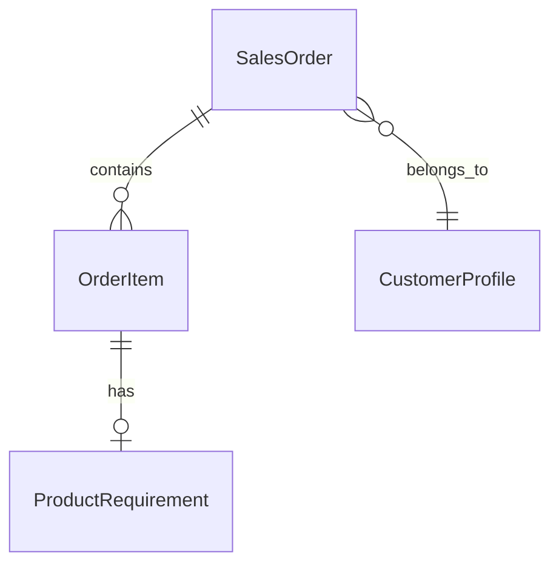
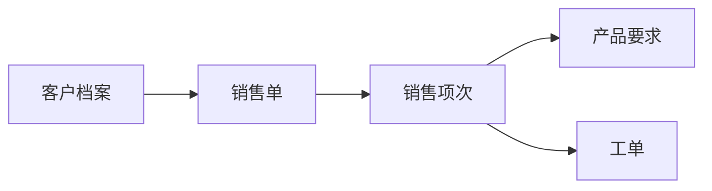
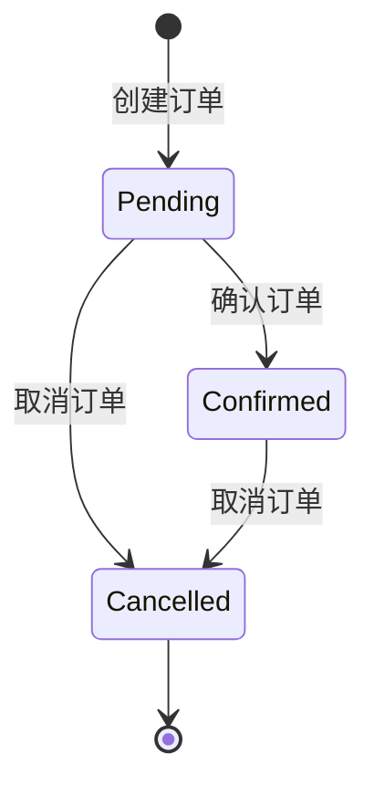

# 订单模块详细设计

> 版本：V1.36（2026-09-15）
> 最新变更（V1.36，2026-09-15）：**订单进度树：叶下新增「生产批次名单」（在产 / 在途分段）+ 生产执行分支口径由快照改实时重算**（**无 EF 迁移 / 无数据变更 / 无权限变更 / 零新端点**）：① **生产执行分支改实时**——原取 `WorkOrderExecutionSummary.PendingSection*` 快照，现改由新建共享计算器 `MES.Services/Helpers/ProductionPendingNodeHelper` 对 `ProductionBatches.Include(ProcessGroups)` 实时计算（按该订单各 `WorkOrderNo` 收窄、按 `ProductionMainNo` 分组，主号级 = 主号全部工单批次并集一次算完）；**节点 Key / 中文 Label / 叶子顺序与数值口径逐字不变**，仍「>0 才建叶」。② **叶下批次名单**——`MainProgressLeafDto` 新增 `BatchSegments`（`List<LeafBatchSegmentDto>`）+ 两个新 DTO（`LeafBatchSegmentDto` / `LeafBatchItemDto`）；生产执行叶 = **在产 / 在途两段**（`batchCurrentSeq == targetSeq` → 在产；`< targetSeq` → 在途；`> targetSeq` / 无此工序组 / 工序组无目标工段 / 成检与完成态 → 不计），**不变式 `Σ在产 + Σ在途 == 叶 WeightKg`**；成品检验叶 = **单段**（每批恰落一档，无在途概念）。段序固定「在产 → 在途」、段内按 `BatchNo` Ordinal 升序。③ **前端 `Shared/OrderProgressTree`**（首页「订单进度查询」卡与 `/orders/progress` 页共用）——名单**默认折叠**（折叠态 `【在产 14 批 · 在途 41 批】`）、展开后批号可点 → 弹「批次执行进度」（`MaxWidth.Large`，不跳详情页）；节点标签**【待产】不变**（用户拍板）。④ **口径分叉声明**——本分支实时值与本页其余快照字段（`DeformedProcessCompleted` / `ProductionAttentionProcess`）及「工单执行状况」页快照**会长期分叉**，属设计取舍非 bug。⑤ 验证：`dotnet build MES.Api` / `MES.Blazor` **各 0 错 0 警**；定向单测 `ProductionPendingNodeHelperTests`（新建 16 例）+ `OrderProgressQueryServiceTests` **21 过** + 工单执行相关合计 **102 过**；**真库 SQL 核验**（`D26Z2159001` / `X03`）荒管处理 **19281.000**（14 批，名单逐字吻合）/ 50冷轧 **37433.000** / 30冷轧 **98973.000**，与 2026-09-15 快照值一致。详见 §5.17.6。**⚠️ 本批尚未打包上线**。
> 历史变更（V1.35，2026-09-14）：**「投料产出总况」完成日期范围搜索口径修正——区间边界由「完成月月首」改为「订单真实完成日」直比**（**后端 + 前端文案；无 EF 迁移 / 无数据变更 / 无权限变更**）：① **问题**——V1.34 的区间判定以完成月**月首**锚定（`new DateTime(doneAt.Year, doneAt.Month, 1)` 参与 [起, 止] 比较），导致「**起日非月初 → 整个起始月被整月剔除**」「**止日非月末 → 整个截止月被整月纳入**」，用户按「完成日期」设定范围时数据对不上。真库实证（全部口径，全库完成订单共 17 单）：区间 `2026-01-15 ~ 2026-02-20` 旧逻辑命中 **5 单**（1 月因月首 `01-01 < 01-15` 整月丢失），按真实完成日应为 **9 单**。② **修正（用户 2026-09-14 拍板：方案 A 最小改动）**——`OrderThroughputQueryService.GetMonthlySummaryAsync` 区间判定改为 `doneAt.Value.Date` 直比闭区间（**起止当日均含**），整区间仍聚合为 1 行、默认 12 个月窗口行为零变化。③ **口径提示补齐**——两处入口卡片脚注改由 `ThroughputFootnote()` 按模式切换输出：区间模式显式声明「按订单真实完成日落入区间过滤、整区间聚合为 1 行」+ **各列为命中订单的全生命周期合计（与完成日不相关）**——生产投料 = 各批次工艺卡领料重之和、入库列 = 各批次入库量之和，**区间之外发生的投料/入库量也会计入本行**（`ProductionBatch` 无投料日期字段，逐列按事件日期切分不可行，故不改口径、只补说明）；报表卡头说明同步改为「按完成日落入所选区间，整区间聚合为 1 行」。④ 验证 `dotnet build MES.Api` + `dotnet build MES.Blazor` 0 错 0 警 + 定向单测 `OrderThroughputQueryServiceTests` **19 过**（新增 1 例「边界按真实完成日直比含起止当日」；改写 1 例原「月首不入区间的订单被排除」为「按真实完成日纳入」）。详见 §5.14.3。
> 历史变更（V1.34，2026-09-14）：**「投料产出总况」的「完成月模糊搜索」改为「完成日期范围」查询（两处入口同步）**（**后端 + 前端；无 EF 迁移 / 无数据变更 / 无权限变更**）：① **动机**——原「完成月搜索」是前端本地按 `yyyy-MM` 模糊匹配，且后端恒返回近 12 个月，**查不到 12 个月之外的历史区间**。② **后端**——`IOrderThroughputQueryService.GetMonthlySummaryAsync` 新增可选参数 `DateTime? dateFrom = null, DateTime? dateTo = null`；端点 `GET api/order/throughput-summary` 新增 `[FromQuery] DateTime? dateFrom/dateTo`（`yyyy-MM-dd`）。任一端有值即进入**日期区间模式**：按「**完成月月首落入 [起, 止] 闭区间**」取数（用户拍板口径），**不再套用 12 个月窗口**，可查任意历史区间，且**整个所选区间跨订单聚合为唯一 1 行**（⚠️ 用户纠偏：区间查询 = 汇总视角，非逐月清单；服务端临时键 `RangeRowKey` 单桶聚合后 `BuildRangeText` 写 `row.Month`）；两端皆空 → 沿用默认「最近 12 个月（含当月）」**按完成月分行**，原行为零变化。单端为空 = 该端开放；起晚于止 = 返回空行。③ **前端两处入口同步**——订单列表页 `/orders` 卡片与报表总览 `/reports/overview`「业务总况」Tab 卡均删「完成月搜索」，改 **「完成日期起 / 完成日期止」两个 `MudTextField T="string"`（`Placeholder="yyyy-MM-dd"`，禁 `MudDatePicker`）+ 应用 + 清除**（`TryParseExact` 严格解析，空/非法端不参与过滤；`_throughputRows` 简化为直取服务端 `Months`、首列直渲 `@row.Month`，**不再本地过滤、前端无 `ThroughputRangeText()`**）；空态文案与报表卡头说明文案随模式切换（`ThroughputRangeCaption()` = 「整区间聚合为 1 行」）。④ 验证 `dotnet build MES.Api` + `dotnet build MES.Blazor` 0 错 0 警 + 定向单测 `OrderThroughputQueryServiceTests` **18 过**（新增 5 例：整区间聚合为单行且月首不入区间的订单被排除、默认窗口仍按完成月分行、可查默认窗口外历史完成月、单端开放边界、起晚于止返空）。详见 §5.14.3 与 [frontend_pages.md](../frontend_pages.md) V126。
> 历史变更（V1.33，2026-09-14）：**客户往来「日期区间」拆分为「接单区间 + 发货区间」两个独立可叠加区间 + 未激活列置「—」+ 工具栏按组重排**（**后端 + 前端；无 EF 迁移 / 无数据变更 / 无权限变更**；仅报表总览客户卡加 UI，供应商·委外两卡不动）：① **拆分动机**——V1.32 的单区间同时驱动「接单 + 已发货」两维度，语义混淆（改接单日期会连带改动已发货数字）且无法单独查发货。改为**两个互相独立、可叠加**的区间：**接单区间**（`SignDateFrom/To` → 驱动 `YearOrder*`，取 `SalesOrder.SignDate`）、**发货区间**（`ShipDateFrom/To` → 驱动 `ShippedCompleted*`/`ShippedOther*`，取 `OutboundRecord.OutboundDate`）；各自只影响自己的列，另一维度回落**自然年**口径。② **列激活（防视觉污染）**——`CustomerTradeActiveColumns()` 返回当前「有数据」的列集合（**未启用任何区间时返回 null = 8 列全部正常展示**）：仅接单区间 → `{YearOrder}`；仅发货区间 → `{ShippedDone, ShippedOther}`；两者叠加 → 三列并集。**未激活列（含「累计接单」）一律渲染灰色「—」**（`#9e9e9e`）——其口径为自然年/全时段/当前存量，与所选区间维度不同源，显旧值会误导；表头仅在对应区间生效时改名（「本年接单」→「区间接单」、「本年已发货」→「区间已发货(整单/非整单)」）。③ **行过滤**——任一区间生效时 `CustomerTradeVisible()` **只保留激活列有值的客户行**（`Count>0 || Weight>0`），避免区间口径下满屏空行；未启用区间时维持「全客户」显示。④ **工具栏顺序**（用户指定）——业务员/最终用户搜索 → 接单日期起/止 + 应用接单区间 + 清除 → `MudDivider` 竖分隔 → 发货日期起/止 + 应用发货区间 + 清除 → 显示行数 → 计数文案 →（有区间时）「清空全部区间」；区间生效时卡片追加一行口径说明（`CustomerTradeRangeHint()` 三分支：仅接单 / 仅发货 / 双区间叠加）。⑤ **实现**——`QueryParams` 新增 `ShipDateFrom`/`ShipDateTo`；`CustomerService.BuildStatsAsync(ctx, year, signFrom, signTo, shipFrom, shipTo)` 拆出 `signRangeMode`/`shipRangeMode` 两套独立窗口（**出库查询用 ship 窗口、接单桶判定用 sign 窗口**，结束日均 `< To.AddDays(1)` 闭区间含当天）；`CustomerController.list` 加 `shipDateFrom/shipDateTo` 两个 `[FromQuery] DateTime?`；Blazor `CustomerService` 拼 `shipDateFrom/shipDateTo`。⑥ **区间模式行过滤下沉到服务层**——`GetPagedAsync` 检测到任一区间后走 `GetPagedInRangeModeAsync`：先按「激活列有数据」过滤客户行（`ActiveStatsColumns` + `HasDataInActiveColumns`，只认 `YearOrder`/`ShippedDone`/`ShippedOther` 三键）再分页，`TotalCount` = 过滤后条数（「共 N 条」与显示行同口径）；客户档案量级小，内存过滤可接受；统计字段由 `ApplyStats` 从同一份桶回填（`AttachStatsAsync` 改为复用它）。⑦ **两处入口**——报表总览客户卡与源列表页「客户管理」`/customers` 共用同一端点与同一套列激活/行过滤规则；⚠️ 源列表页统计列键名为 **`YearOrdering`（带 -ing）**，报表卡为 `YearOrder`，两套勿混。⑧ 验证 `dotnet build MES.Api` + `dotnet build MES.Blazor` 0 错 0 警 + 定向单测 `CustomerServiceTests` **42 过**（新增发货区间 5 例 + 行过滤 3 例；⚠️ 受行过滤影响改写 5 处旧用例——未命中区间者由「桶为零」改为「行被过滤剔除」、存量口径两例改为区间命中签约/出库日、原「接单区间驱动已发货」改写为「**接单区间不驱动已发货窗口**」）。详见 [frontend_pages.md](../frontend_pages.md) V125。
> 历史变更（V1.32，2026-09-14）：**客户往来数据新增「接单日期区间」查询（区间模式）**（**后端 + 前端；无 EF 迁移 / 无数据变更 / 无权限变更**；仅报表总览客户卡加 UI，供应商·委外两卡不动）：① **设计前提**——该卡 8 列混两种时间语义：**流量**（累计/本年接单、本年已发货）可按日期参数化，**存量**（待发货、待在产）是当前时点快照、**无日期语义**。故区间只作用于流量列，卡头在区间生效时补一行说明避免「一个选择器只影响一半列」的误导。② **行为矩阵**（两端皆空 = 完全现状）——选定区间后 `YearOrder*` 改按 `SalesOrder.SignDate ∈ 区间`（标题「本年接单」→「区间接单」）、`ShippedCompleted*`/`ShippedOther*` 改按 `OutboundRecord.OutboundDate ∈ 区间`（标题「本年已发货」→「区间已发货」）、`TotalOrder*`（累计接单）服务端仍回填全时段值但**前端渲染「—」**（灰色，口径与区间不同源，显旧值误导）；`StockCompleted*`/`StockOther*`/`WipNone*`/`WipPartial*`（存量 4 列）**不受影响**。③ **实现**——`QueryParams` 新增 `SignDateFrom`/`SignDateTo`（⚠️ 与 `WorkOrderQueryParams` 原同名属性**同语义**，子类重复声明删除上提至基类以消除 CS0108 遮蔽；工单过滤 `WorkOrder.SignDate`、客户过滤 `SalesOrder.SignDate`）；`CustomerService.BuildStatsAsync(ctx, year, signFrom, signTo)` 新增区间模式（结束日按惯例 `< To.AddDays(1)` 闭区间含当天；区间模式下出库窗口由「自然年」切为「所选区间」）；`CustomerController.list` 加两个 `[FromQuery] DateTime?`；Blazor `CustomerService` 拼 `signDateFrom/signDateTo=yyyy-MM-dd`；报表页加两个 `MudTextField T="string"`（`Placeholder="yyyy-MM-dd"`，**禁 `MudDatePicker`**）+ 应用/清除按钮 + `CustomerTradeHeader(col)` 动态表头。④ 验证 `dotnet build MES.Blazor --no-incremental` 0 错 0 警 + 定向单测（`CustomerServiceTests` 34 过含新增 6 例：命中/未命中区间、仅起始端开区间、已发货按出库日期落区间而非签约日期、存量不受影响、未传区间回归保护；`WorkOrder` 254 过）。详见 [frontend_pages.md](../frontend_pages.md) V124。
> 历史变更（V1.31，2026-09-14）：**客户往来数据补「累计接单」列 + 待发货/待在产表头分组强调色（报表总览卡与「客户管理」源列表页两处同步）**（**纯 WASM，后端 / DB / 接口零改动**，`CustomerProfileDto.TotalOrder*` 三字段既有）：① **补列**——「累计接单」原仅存于源列表页「客户管理」② 往来信息分组，报表总览 `/reports/overview`「业务总况」Tab 顶部「客户往来数据」卡缺失 → 在「本年接单」**前**补齐（`ReportOverview.razor.cs` `CustomerTradeValues` 加 `"TotalOrder"` 分支；`ReportOverview.razor` thead / tbody / tfoot 三处同步插入），单行 **7 → 8 统计列**（均 `z单/x吨/y万`，格式同源 `OrderOverviewFormatter.RenderTradeMarkup`）。② **表头分组强调色**（同一「② 往来信息」分组内再区分两组语义，便于扫读）：**待发货（整单 / 非整单）= 暖橙**（底 `#FFF3E0` / 字 `#E65100` / 底边 2px `#FFB74D`）；**待在产（整单未入库 / 扣除部分入库）= 冷紫**（底 `#F3E5F5` / 字 `#6A1B9A` / 底边 2px `#CE93D8`）；两组均 `font-weight:700`。③ **两处同步实现差异**——报表卡为纯 HTML `<table>`，强调色走**内联样式**（打印 `getTableHtml` 天然带上）；源列表页「客户管理」`/customers` 为 `MudTable`，走 `Customers.razor.cs` 新增 `GetTradeAccentCss(col.Key)` 在 `_headerClass` 上拼 `th-accent-stock` / `th-accent-wip` 类名，样式归口 `app.css`（`th.th-accent-*` **带 `!important`** 且**必须置于 `.col-g2` 规则之后**以覆盖其分组底色 `#F5F9FF`）。验证 `dotnet build MES.Blazor --no-incremental`（含 MES.Api）0 错 0 警。详见 [frontend_pages.md](../frontend_pages.md) V123。
> 历史变更（V1.30，2026-09-14）：**「投料产出总况」新增报表总览第二入口（双入口并存）**（**纯 WASM，后端 / DB / 接口零改动**）：`/reports/overview`「业务总况」Tab 新增第 3 张折叠卡「投料产出总况」（折叠键 `report:throughput`，表格容器 `#report-throughput-table`，标题分色 `report-tt-3`），复用既有端点 `GET api/order/throughput-summary?scope=` 与 DTO（同列口径、同口径下拉 6 档、同完成月模糊搜索、同打印标题）；数据随 Tab1 并入 `Task.WhenAll` 加载（失败不阻断主表）；打印走报表页通用 `PrintTableAsync`（内建「折叠态先自动展开再取 DOM」）。同日**报表业务总况全卡可折叠化**——「订单接单·出库及现负荷汇总」由 `MudPaper` 升 `MudCard` + 折叠按钮（`report:inout-summary`，默认展开），至此该 Tab 5 张表全部具备折叠能力（默认值分级：核心实时卡展开 / 月度历史卡折叠，与物料执行·生产执行·质量管理三 Tab 一致）。**订单列表页原卡片保留不动**（双入口定位：订单页=做单视角，报表页=经营看板视角）。详见 §5.14.3 双入口注记、[frontend_pages.md](../frontend_pages.md) V122。
> 历史变更（V1.29，2026-09-14）：**订单列表页新增「投料产出总况」折叠卡片（按订单完成月跨订单聚合）**（新增后端查询服务 + 端点 + DTO，**无 EF 迁移 / 无数据变更**）：卡头「投料产出总况」按钮切换（置于「完成预估及延期风险」之后、「新建订单」之前），**默认折叠、首次展开懒加载**，卡片渲染于交期预估卡片之后。① **行维度 = 订单完成月**（订单级档位归并序 == 1「主号完成」，完成日取该订单各主号 `WarehousingEndDate` 最大值 → 与订单列表「执行关注=主号完成」绿 Chip 同源）；**固定近 12 个月（含当月）**，无完成订单的月不产生行。② **10 列**：`完成月 / 订单数 / 生产投料 / 订单成品入库 / 余库料入库 / 次品入库 / 备料成品 / 投料产出率 / 产出成品比 / 退货`；重量 kg **四舍五入取整**、比率 0~1 一位小数（分母 ≤0 → null → 前端显示 —）。③ **口径下拉 6 档**（`ProductionScopeKeys`：全部 / 纯生产 / 单一生产类型 4 档，空值未知值归一 All），返整 / 委外生产 / 对外加工三类一律排除。④ **订单成品双路径**——「全部」口径走 `InventoryBatch.SalesOrderNo` 直取 + `OrderFinished`（交付态，与订单进度树同源）；「纯生产 / 单一类型」口径走 `ProductionBatchNo` 反查 + `MaterialType ∈ (OrderFinished, SpecialDeliveryStatus)`（**含非交付态**：U 型管常规生产只到非交付态，交付态由外购委外批次产出，否则该口径整列为空；交付态部分被生产类型过滤自然排除故不重复计入）。⑤ **退货**（次品库 `ReturnOut`，经生产批号反查归属）**分别从「生产投料」与「次品入库」扣减，同时单列供核对**。⑥ 新增 `MES.Core/Constants/ProductionScopeKeys.cs`、`MES.Core/DTOs/Order/OrderThroughputSummaryDto.cs`、`MES.Core/Interfaces/Order/IOrderThroughputQueryService.cs`、`MES.Services/Order/OrderThroughputQueryService.cs`、`MES.Api/Controllers/Order/OrderThroughputController.cs`（`GET api/order/throughput-summary?scope=`，OrderViewer/OrderEditor/OrderFull/Admin）+ 定向单测 13 例。⑦ **订单数 = 该口径下真实相关订单数**（该完成月中在本生产类型范围内有生产批次的订单数，非该月完成订单总数；该口径下无相关订单的月整行隐藏）。详见 §5.14.3、§6.1。
> 历史变更（V1.28，2026-09-14）：**订单进度树新增「打印」（所见即所得，保留折叠状态）**（纯前端，**无接口 / 数据库变更**）：卡头新增「打印」按钮（`OnPrintAsync` → `await JS.InvokeVoidAsync("window.print")`，`Class="op-print-hide ml-2"`，置于「返回订单列表」左侧；返回按钮同加 `op-print-hide` 使二者打印时隐藏）；页面末尾新增**非 scoped** `<style>@@media print`：`@@page { size: landscape; margin: 8mm }`、`body { -webkit-print-color-adjust: exact }`（保留主号灰底 / 比率红字）、隐藏 `.mud-appbar` / `.mud-drawer` / `.op-print-hide`、`.mud-layout` 与 `.mud-main-content` 解除 flex + 滚动并置 `margin-left / padding-top: 0`（否则多页内容只印首屏、左侧留出抽屉宽度）、`.op-main-node { break-inside: avoid }`；**打印页脚** `.op-print-footer`（屏幕隐藏、仅 `@@media print` 下 `display:block` + 上边框 + `font-size: 14px`）输出 `打印日期：yyyy-MM-dd`，`_printDate` 在 `OnPrintAsync` 中刷新为 `DateTime.Today` 并 `StateHasChanged()` + `await Task.Yield()` 后再调 `window.print`（保证日期先落到 DOM）。**折叠状态天然保留**——折叠主号的展开区由 `@if (!IsCollapsed(...))` 条件渲染，本就不在 DOM 中（全程不改动 DOM、不重新渲染）。⚠️ 样式必须写在页面内 `<style>` 而非 `.razor.css`：`.mud-appbar` / `.mud-drawer` / `.mud-main-content` / `.mud-layout` 属**其它组件**的元素，Blazor scoped CSS 追加 `[b-xxx]` 属性后匹配不到。**不新增 JS 桥接函数**（`print.js` / `index.html` 版本号不动）。详见 `11_打印设计.md` V2.19 §2.2「就地打印约定」。
> 历史变更（V1.27，2026-09-14）：**订单进度树「投料产出」两项比率高亮 + 订单级「总投料产出」聚合行**（纯前端派生，**无接口 / 迁移 / 数据变更**）：① 主号灰色条汇总行与订单级汇总行的「投料产出率」「产出成品比」改用 `.op-sum-hl`（红 `#c62828` + 粗体）**高亮**——为此把 `OrderProgress.razor.cs` 的 `CompletionSummaryText`（原返回单串）重构为 **`BuildCompletionSummary` 返回分段列表 `List<OpSummarySegment>`**（`private sealed record OpSummarySegment(string Text, bool Highlight = false)`，两项比率 `Highlight=true`），razor 端逐段渲染（段间 `；`、末尾 `。`），汇总行容器改 `display:flex; flex-wrap:wrap`（**避免 Razor 换行空白落进文本**，并按段边界折行）。② **订单级「总投料产出」行**——当该订单 `MainNos` **非空且全部 `IsCompleted`** 时，在**订单号块**（`op-root-meta`，「含项次数」下方）渲染 `.op-root-line3`：`总投料产出：生产投料500kg；订单成品入库400kg；余次备产出入库50kg；投料产出率90.0%；产出成品比88.9%。` = **各主号三项净量直接求和**（复用 `Nets(main)`；跨主号聚合故投料项**恒「生产投料」不带生产类型后缀**）；口径、零值整行省略与比率不渲染规则同主号级。③ 主号级入口方法更名 `MainCompletion(main)`，净量提取抽 `Nets(main)`。详见 §5.17.5。
> 历史变更（V1.26，2026-09-14）：**订单进度树完结主号分支改为「投料 + 产出」两维度口径（6 分支 → 4 专属分支 + 订单成品入库）**（用户 2026-09-14 拍板）：① 序1 **生产投料[生产类型]** 重量改取**生产批次工艺卡** `ProductionBatch.InputWeight` Σ（原取 `WorkOrderExecutionSummary.InputWeight` 快照口径**废弃**），批次过滤**仅排除**「返整(Rework) / 委外生产(Subcontract) / 对外加工(ExternalProcessing)」三类，**不再限定制造物品**（原 `ManufacturingItem ∈ {OrderFinished, SpecialDeliveryStatus}` 限制取消）；批次自带订单号+主号，零 join。② 序3 新增 **次品入库** 分支 = 次品库 `DEFECT` 6 类物料类型入库重经 `ProductionBatchNo` 反查主号聚合，**每叶可附同叶退货出库量**（同仓库 `OutboundRecord.OutboundType == ReturnOut`，DTO 新增 `MainProgressLeafDto.ReturnWeightKg`，前端「次品荒管 500 kg　退货 400 kg」左入库右退货对照）。③ 序2/序4 由「余料入库 / 备料入库」更名为「**在制品入库 / 备料成品**」（口径不变）。④ 序5「成品入库」更名「**订单成品入库**」。⑤ **删除**原「过程检 / 成品检」两支（`ProcessInspectionDefect` / `FinalInspectionDefect` DTO 字段与服务方法一并删除）——两维口径下检验不合格产出已由次品库实收体现，快照口径重复。【非完结主号 4 支（原料锁定 / 生产执行[待产] / 成品检验 / 订单成品入库）保持原样，仅末支标题同步更名；退货**不新增任何字段**，复用既有 `OutboundType.ReturnOut` 两表对照；零值叶省略 / 空分支不渲染规则不变；**无 EF 迁移、无数据变更**（纯读聚合改造）。】⑥ **已完结主号灰色条新增「投料产出」汇总行**（「执行关注：已完结」下方、折叠亦见；纯前端派生，投料与「余次备产出入库」均**扣减退货**；含「投料产出率 / 产出成品比」两比率），详见 §5.17.5。
> 前次变更（V1.25，2026-09-11）：**订单进度树完结主号「成品检」分支 3 叶 → 4 叶**（随质量管理上下文成品检不合格品去向 4 档→5 档）：成品检 = 入在制库(`FinalInspectionInProcessWarehouseWeight`) / 可入备库(`FinalInspectionWarehouseWeight`) / 入次品库(`FinalInspectionScrapWeight`) / 退货(`FinalInspectionReturnWeight`)；过程检分支不变（3 叶）。`WorkOrderExecutionSummary` 快照新增 `FinalInspectionInProcessWarehouseWeight`（迁移 `20260911071723`）。
> 更早变更（V1.24，2026-09-11）：**订单进度树完结主号「过程检 / 成品检」分支 2 叶 → 3 叶**（随质量管理上下文不合格处理 3 档→4 档）：过程检 = 入在制库(`ProcessInspectionWarehouseWeight`) / 入次品库(`ProcessInspectionScrapWeight`) / 退货(`ProcessInspectionReturnWeight`)；成品检 = 可入备库 / 入次品库 / 退货。`WorkOrderExecutionSummary` 快照新增 `ProcessInspectionReturnWeight` / `FinalInspectionReturnWeight`（迁移 `20260911055600`）。
> 状态：**已实施完成**。订单上下文自管实体 = SalesOrder / OrderItem / ProductRequirement / CustomerProfile（StandardGradeMapping 实归生产标准上下文、OrderDemandAdjustment 实归工单上下文，二者仅在本章实体清单作归属标注）。核心读模型 = OrderListSummary（④ 订单执行聚合 + 成品库存聚合 + 「完成预估及延期风险」折叠卡；原「订单接单·出库及现负荷汇总」折叠卡已自订单列表页移除，该汇总表改由报表总览页展示并仍直查本读模型；**2026-09-09 两小表与业务总况加金额三色展示**——金额=订单项次 `TotalPrice`（元）经共享 `SettlementMoneyCalculator` 结算分治折算（过磅实称不封顶/理算+过磅-负封顶合同），与客户往来统计同源不漂移）；订单成品实时库存 = 「订单成品(实时库存)」（PendingDeliveryQueryService，5 表 JOIN + Hybrid 查询 + 3 层缓存，供质保书创建页取数）；订单进度树 = 「订单进度树」（OrderProgressQueryService，只读四级树 订单号→主号→阶段分支→重量叶，分支分两套：非完结=原锁/生产/成检/订单成品入库，完结=「投料 + 产出」两维度——生产投料[生产类型]/在制品入库/次品入库(含退货)/备料成品/订单成品入库，投料取生产批次工艺卡 `InputWeight`（排除返整/委外生产/对外加工）、产出全部按仓库实收；复用 WES 快照 + ProductionBatch 实时 + 成检看板 + 各仓库库存/出库实时口径）。订单/客户 CRUD 与项次 save-all 单事务、打印走 `SalesOrderPrintHelper`；投料产出总况 = 「投料产出总况」（OrderThroughputQueryService，按订单完成月跨订单聚合投料/产出/退货，口径与进度树「投料产出」同源、可切生产类型范围，订单列表页折叠卡 + 报表总览「业务总况」Tab 折叠卡双入口）；操作日志统一 `IOperationLogService` Module="Order"。

---

## 一、概述

本文档定义订单模块的详细设计，包括实体、核心流程、状态流转、业务规则等。

---

## 二、实体清单

| 实体 | 说明 |
|------|------|
| SalesOrder | 销售单 |
| OrderItem | 销售项次 |
| ProductRequirement | 产品要求 |
| CustomerProfile | 客户档案 |
| StandardGradeMapping | 牌号对照 ⚠️ **实归属于生产标准上下文管理** |
| OrderDemandAdjustment | 工单需求调整（催单/分批交货/主号暂停/强制完成标记，API/UI 与数据库实体均属工单上下文，`MES.Data.Entities.WorkOrder`） |

### 2.1 实体关系图



---

## 三、核心流程



### 3.1 流程说明

| 步骤 | 操作 | 角色 | 说明 |
|------|------|------|------|
| 1 | 创建客户档案 | 订单主任/管理员 | 客户信息维护 |
| 2 | 创建销售单 | 订单主任 | 录入订单基本信息 |
| 3 | 添加销售项次 | 订单主任 | 录入产品规格、数量、重量 |
| 4 | 配置产品要求 | 订单主任 | 技术要求配置 |
| 5 | 手工生成工单 | 工单主任 | 在工单模块手动操作（已实现）；订单确认后自动生成工单功能规划中 |

---

## 四、状态流转

### 4.1 订单状态



| 状态 | 英文 | 说明 |
|------|------|------|
| 待处理 | Pending | 初始状态，意向合同 |
| 已确认 | Confirmed | 合同生效 |
| 已取消 | Cancelled | 合同取消（终态） |

### 4.2 状态流转规则

| 当前状态 | 允许变更到的状态 | 权限 |
|----------|------------------|------|
| Pending | Confirmed, Cancelled | OrderEditor/OrderFull/Admin, Admin |
| Confirmed | Cancelled | OrderEditor/OrderFull/Admin, Admin |
| Cancelled | 无（终态） | - |

---

## 五、业务规则

### 5.1 订单号规则

| 项目 | 规则 |
|------|------|
| 格式 | 11位字符 |
| 唯一性 | 全局唯一 |
| 生成方式 | 用户手动输入 |

### 5.2 项次号规则

| 项目 | 规则 |
|------|------|
| 生成方式 | 系统自动生成 |
| 起始值 | 从 1 开始 |
| 递增规则 | 同一订单内依次递增 |
| 删除后处理 | 不重新排序，保留原项次号 |

### 5.3 规格生成规则

| 项目 | 规则 |
|------|------|
| 格式 | `{外径}*{壁厚}` |
| 小数处理 | 保留原有小数位 |

**示例：**

| 外径 | 壁厚 | 生成的规格 |
|------|------|-----------|
| 76 | 5 | 76*5 |
| 76 | 5.5 | 76*5.5 |
| 76.5 | 5.25 | 76.5*5.25 |

### 5.4 理算重量计算规则

**公式：**

```
理算重量 = 密度 × 3.1416 × 壁厚有效值 × (外径有效值 - 壁厚有效值) × 米数 / 1000
```

**参数计算：**

| 参数 | 公式 |
|------|------|
| 壁厚有效值 | 壁厚 - 0.5 × 壁厚负差 + 0.5 × 壁厚正差 |
| 外径有效值 | 外径 - 0.5 × 外径负差 + 0.5 × 外径正差 |

**米数计算规则：**

| 长度状态 | 米数来源 | 公式 |
|----------|----------|------|
| Fixed（定尺） | 系统自动计算 | MaxLength × 支数 / 1000 |
| Range（范围尺） | 手工录入 | 用户输入的 Meters |
| NonFixed（非定尺） | 手工录入 | 用户输入的 Meters |

**边界处理：**

| 场景 | 处理规则 |
|------|----------|
| 计算结果为负数 | 设为 0 |
| 米数或支数为空 | 理算重量计算结果为 0 |
| 保留小数位数 | 2位 |

### 5.5 牌号对照规则

| 项目 | 规则 |
|------|------|
| 触发时机 | 用户选择 StandardGrade 时 |
| 自动填充字段 | PlantGrade（工厂牌号）、Density（密度） |
| 数据来源 | StandardGradeMapping 表 |
| 牌号不存在 | 拒绝创建订单，提示用户 |

### 5.6 长度验证规则

| 长度状态 | MinLength | MaxLength |
|----------|-----------|-----------|
| Fixed（定尺） | 必填 > 0 | 等于 MinLength |
| Range（范围尺） | 必填 > 0 | 必填 > 0 且 > MinLength |
| NonFixed（非定尺） | 不需要 | 不需要 |

### 5.7 更新与删除规则

| 状态 | 允许修改 | 允许删除 |
|------|----------|----------|
| Pending | ✅ | ✅ |
| Confirmed | ✅ | ✅ |
| Cancelled | ❌ | ❌ |

### 5.8 级联删除规则

| 操作 | 级联范围 |
|------|----------|
| 删除订单 | 同步物理删除所有 OrderItem 和 ProductRequirement |
| 删除项次 | 同步物理删除关联的 ProductRequirement |

> 注：ProductRequirement 不允许单独删除。

### 5.9 订单删除时自动清理工单与通知

- 当订单被物理删除时，系统自动执行以下操作：
  1. 物理删除该订单下的所有订单项次和产品要求
  2. 物理删除该订单下的所有工单
  3. 若有工单被清理，生成一条“订单删除通知”（记录订单号、清理工单数量）
- 该通知由工单模块负责展示和处理，订单模块仅负责生成。

### 5.10 添加同类项次/添加异类项次规则

**前端"添加异类项次"操作：**
- 创建一个全新的空项次，所有字段均为默认值/空值
- 项次号 = 当前最大项次号 + 1

**前端"添加同类项次"操作：**
- 复制列表中最后一项的以下字段：
  - 交货日期、延期罚款、结算方式、物料名称、标准号、交货状态
  - 标准牌号、外径、壁厚、外径公差、壁厚公差、长度状态
  - 计价单位、单价（新增金额字段随之复制）
- 以下 6 个字段默认置 0（因为同类项次的长度/重量/数量需要全新计算）：
  - 最小长度、最大长度、支数、米数、合同重量、理算重量
- 总价默认置空，由前端按「单价 ×（计价单位决定取量）」自动重新计算（非手动覆盖态）
- 项次号 = 当前最大项次号 + 1

> 注：`MES.Blazor/Pages/Orders/OrderDetail.razor` 编辑模式下，"添加同类项次" 会同时复制 Remark、StandardNo、PlantGrade、Density 字段。

### 5.11 合同重量与理算重量对比规则

在定尺（Fixed）模式下，提交前必须验证合同重量与理算重量的比值。验证在服务端执行（`ValidateContractWeightAgainstTheoreticalWeight`），不满足条件时抛出 `BusinessException` 强制阻止提交，而非前端确认弹窗：

| 条件 | 处理方式 |
|------|----------|
| 理算重量 ≤ 0 | 跳过对比校验（不阻止提交） |
| 合同重量 / 理算重量 < 94% | 服务端抛出 BusinessException：合同重量低于理算重量的94%，可能亏损，阻止提交 |
| 合同重量 / 理算重量 > 106% | 服务端抛出 BusinessException：合同重量高于理算重量的106%，阻止提交 |
| 94% ≤ 比值 ≤ 106% | 通过，无需提示 |

### 5.12 前端并行数据加载

创建页（Orders/OrderCreate.razor）和详情页（Orders/OrderDetail.razor）使用 `Task.WhenAll` 并行加载多个无依赖数据源：

| 页面 | 并行加载的数据 | 说明 |
|------|---------------|------|
| Orders/OrderCreate.razor | CustomerService.GetAllAsync() + StandardRegisterService.GetAllAsync + GradeMappingService.GetAllAsync | 客户、标准号、牌号对照三者无依赖 |
| Orders/OrderDetail.razor | StandardRegisterService.GetAllAsync + GradeMappingService.GetAllAsync + OrderService.GetByIdAsync + CustomerService.GetAllAsync() | 标准号、牌号对照、订单详情、客户四者无依赖 |

### 5.13 打印功能

**打印实现类：** `MES.Services/Printing/SalesOrderPrintHelper.cs`

- ProductRequirement 的 10 项成品检验项（PmiInspection/SurfaceInspection/Dimension/Endoscopy/HydrostaticTest/UnderwaterPressure/EddyCurrent/UltrasonicTest/PortColoring/RadiographicTest）为 `InspectionRequirementStage` 4 值枚举（None=「-」/FinalOnly=「终」/PreOnly=「预」/PreAndFinal=「预+终」）；理化 20 项 + ChemicalComposition 保持 bool。产品要求打印（SalesOrderPrintHelper）10 项走 StageText（EnumHelper.GetDisplayName），产品要求编辑（ProductRequirement.razor）用 MudSelect 4 选项。详见质量管理/计划排程上下文文档。

**后端端点：**

| 类型 | 端点 | 说明 |
|------|------|------|
| 单个/选中打印 | POST /api/order/print-file | 单个订单详情或选中订单批量 PDF（Id 集合，请求体 `OrderPrintBatchRequest.IncludeAmounts` 切换打印模式，默认含金额） |
| 列表打印 | POST /api/order/print-list-file | 按可见列打印选中订单列表 PDF（Mode A 前端逐行转 dict） |
| 产品要求打印 | POST /api/order/{orderId}/requirements/print-file | 单个订单的产品要求 PDF |

**实现方式：** 使用 QuestPDF 生成 PDF，后端直接返回 PDF 二进制流，前端 `openPdfFromApi()` 通过 fetch 获取后以 Blob URL + iframe 覆盖层展示（与仓库模块打印方案一致）。

**确认单双模式（2026-09-07）：** 详情页「打印」与列表页「打印选中订单」均改为 MudMenu 下拉，提供「含金额确认单 / 不含金额确认单」两模式：
- **含金额模式（IncludeAmounts=true，默认）**：显示 结算方式 → 计价单位 → 单价 → 总价 列，汇总行追加 **订单总价**。
- **不含金额模式（IncludeAmounts=false）**：隐藏 计价单位/单价/总价 三列与订单总价合计，**保留结算方式**（面向不涉价的用户）。
- 两种模式列序一致：结算方式自原第 4 位移至**理算重量之后**；备注为唯一相对列。重量/米数（米数/合同重量/理算重量）打印统一收敛 1 位小数（`FormatWeightRound1`），金额 2 位小数（`FormatMoney2`）。⚠️ 新增列务必复查常量列总宽（含金额 708pt < A4 横向内容宽 ≈782pt），否则抛 `DocumentLayoutException`。

### 5.14 订单列表页聚合字段

> **列分组（2026-09-07 合并）**：原「① 基本信息 + ② 合同交付」合并为单组「① 基本信息」；订单确认→②、订单执行→③。默认仅显示：订单号/签订日期/业务员/客户名称/交期截止/订单总重量/含项次数，其余（最终客户/交期起始/延期罚款等）默认隐藏，列偏好键升 v2（`col_prefs_orders_v2`）。下列聚合字段归入「① 基本信息」组展示。

订单列表页（`/orders`）的列表中，从 OrderItem 明细聚合计算以下字段展示：

| 字段 | 计算方式 | 说明 |
|------|----------|------|
| 交期起始 | `MIN(OrderItem.DeliveryDate)` | 该订单所有项次中最早的交货日期 |
| 交期截止 | `MAX(OrderItem.DeliveryDate)` | 该订单所有项次中最晚的交货日期 |
| 延期罚款 | `ANY(OrderItem.DelayPenalty == true)` | 任一订单项次有延期罚款则显示"是" |
| 订单总重量 | `SUM(OrderItem.ContractWeight)` | 所有项次合同重量之和，取整显示 |
| 含项次数 | `COUNT(OrderItem.Id)` | 该订单的项次数量 |

**搜索支持：** 延期罚款字段支持搜索关键字"是"/"否"进行匹配。其余字段通过关键字模糊搜索（匹配订单号/客户名称等主表字段及聚合结果）。

**排序支持：** 以上5个聚合字段均支持点击表头升降序排列，后端使用 `GroupBy` + `Min/Max/Any/Sum/Count` 实现。

### 5.14.1 订单执行聚合（③ 订单执行 组）

订单列表页（`/orders`）的「③ 订单执行」组（GroupKey=3）从 `WorkOrderExecutionSummary` 聚合写入 `OrderListSummary` 读模型（`OrderService.RefreshByOrderIdAsync`）：

| 字段 | 前端列名 | 计算方式 | 说明 |
|------|---------|----------|------|
| ScheduleStage | 执行关注 | 按同订单摘要优先级聚合：0主号暂停&gt;2原料锁定&gt;3生产执行&gt;4成品检验&gt;1主号完成 | null=未排产；与工单执行状况「主号关注」五档联动 |
| UrgencyLevel | 紧急性 | 取同订单最紧急，按 `UrgencyLevelKeys.All` 顺序 `Array.IndexOf` 取最小（勿用字典序 `.Min()`） | 存储英文 Key；纯主号完成（档1）订单为 null（主号完成不评估紧急性） |
| EstimatedCompletionDate | 预计完成 | 执行关注=1主号完成时取同订单 `WarehousingEndDate` 最大值；其余取 `EstimatedProcessCompletionDate` 最大值 | 档1反映实际入库完成时点（档1工单 EstimatedProcessCompletionDate 恒 null） |

**成品库存聚合（同组）：** 从订单下工单关联的 `InventoryBatch` 聚合（仅 `MaterialType=OrderFinished` 订单成品，`SpecialDeliveryStatus` 订成-非交付态不计入可交付成品）：

| 字段 | 前端列名 | 计算方式 | 说明 |
|------|---------|----------|------|
| FinishedInboundWeight | 成品入库重量 | 成品批次 `InitialWeight` 之和 | 与「成品入库」组入库口径一致 |
| FinishedOutboundWeight | 成品出库重量 | 仅 `OutboundType=SalesOut`（销售出库）的 `OutboundWeight` 之和 | 出库记录按成品批次 Id 过滤 |
| FinishedStockWeight | 成品库存重量 | 成品批次 `RemainingWeight` 之和 | 现库余量 |
| BusinessCompleted | 业务完结 | 主号完成(1) 且 有成品入库 且 库存清零 | 订单整体业务完结标记 |

**刷新触发：** 工单执行状况增量刷新（`RefreshByWorkOrderNosAsync` 内逐订单调用 `RefreshByOrderIdAsync`）与全量刷新（`RefreshAllAsync` 末尾连带）均更新此读模型；主号完成工单 UrgencyLevel 两条路径均置 null。

### 5.14.2 完成预估及延期风险（折叠卡片）

订单列表页（`/orders`）工具栏「**完成预估及延期风险**」按钮切换的折叠卡片，样式仿「计划排程」→「原锁计划」→「待投料量汇总」卡片。卡片**仅展示两张订单级交期预估小表**（数据懒加载，首次展开时请求）：

| 表 | 标题 | 口径（订单级：延期 = 预计完成日 > 交期截止 DeliveryEnd） |
|----|------|--------------------------------------------------------|
| 表1 | 订单(整单)完成预估 | 延期订单按**预计完成日**归桶 + 非延期订单按**交期截止**归桶 |
| 表2 | 风险-已延期订单(整单) | 延期订单按**交期截止**归桶 |

- **结构**：每表 = 表头「交货日期范围」+ 7 个绝对日期桶列 + 单数据行「单数/重量/金额」；每格显示 `z单/x吨/y万`（2026-09-09 加金额：重量 t = kg/1000、金额万元 = 桶内整单项次总价合计/10000，均取整；单蓝 `#1565C0`/吨绿 `#2E7D32`/万橙 `#E65100` 三色区分；空桶「-」）。
- **金额源与口径**：订单项次 `TotalPrice`（元）按整单归入其所属桶（未计价订单计 0）；**不再单列延期罚款**（`UrgentCount/UrgentWeight` 删除，表2 原红色 `[*a/b]` 标注取消）。
- **参与范围与数据源**：**已排产**订单（`ScheduleStage≥2` 且 `EstimatedCompletionDate`/`DeliveryEnd` 非空）；单数按订单号、重量按订单合同总重量、金额按项次总价，取 `OrderListSummary` 读模型 + `OrderItem` 结算池（一行一订单）。
- **桶边界**：走配置表 `DateBucket`（默认 ≤今日 / +1~+7 / +8~+15 / +16~+30 / +31~+45 / +46~+60 / >+60），桶标签为绝对日期区间（`yy/M/d`）。
- **数据端点**：`GET api/order/delivery-estimate`。
- **逐格联动筛选**：点击有数据（`单数>0` 或 `重量>0`）的格 → 前端把该桶日期边界（`estimateFilter`）随列表查询参数回传，联动筛选订单列表并显示可清除提示条；联动覆盖现有搜索/日期/列筛选（口径与 `ApplyEstimateFilter` 一致）。
- **打印**：每表标题右侧「打印」按钮，前端 `printRawHtml` 打印该表（数据未加载时按钮禁用）。

> 注：原「订单接单·出库及现负荷汇总」**5×12 小表**（接单量/出库量/成品库存(完工)/成品库存(未完工)/订单负荷量(实时) 5 指标 × 12 月）已从本页删除，但其后端数据端点 `GET api/order/in-out-summary?year=` 与 `OrderInOutSummaryDto` 读模型**保留**，该表改由**报表总览**页（报表上下文「业务总况」Tab）展示（口径见接口设计文档 §3.16/§4.8）。

### 5.14.3 投料产出总况（折叠卡片）

订单列表页（`/orders`）工具栏「**投料产出总况**」按钮切换的折叠卡片（位于「完成预估及延期风险」卡片之后，默认折叠、首次展开懒加载）。口径与订单进度树（`OrderProgressQueryService`）完结主号「投料产出」分支**同源**，差别只在聚合维度：本卡片按「**订单完成月**」跨订单聚合。服务位于 `MES.Services/Order/OrderThroughputQueryService.cs`（接口 `MES.Core.Interfaces.Order.IOrderThroughputQueryService`），DTO 位于 `MES.Core/DTOs/Order/OrderThroughputSummaryDto.cs`，口径常量 `MES.Core/Constants/ProductionScopeKeys.cs`。

> **双入口（2026-09-14）**：同一报表另有**报表总览**入口——`/reports/overview`「业务总况」Tab 第 3 张卡「投料产出总况」（折叠键 `report:throughput`，默认折叠），**同端点、同 DTO、同列口径、同口径下拉与完成日期范围**，仅宿主页与打印实现不同（报表侧走页面通用 `PrintTableAsync`，内建「折叠时先自动展开再取 DOM」）。两入口定位不同：订单列表页 = 做单视角顺手查，报表总览 = 经营看板视角。前端实现见[frontend_pages.md](../frontend_pages.md) V126。

> **完成日期范围（2026-09-14，替代原「完成月模糊搜索」）**：工具栏原「完成月搜索」`MudTextField`（按 `yyyy-MM` 本地模糊匹配）**已删除**，改为**「完成日期起 / 完成日期止」两个日期输入框 + 应用 + 清除**（`T="string"` + `Placeholder="yyyy-MM-dd"`，**禁 `MudDatePicker`**；`TryParseExact` 严格解析，空/非法端不参与过滤）。
> - **服务端取数（区间模式聚合为单行）**：端点新增可选查询参数 **`dateFrom` / `dateTo`**（`yyyy-MM-dd`）。任一端有值即进入**日期区间模式**，取该区间内命中订单（**不受默认 12 个月窗口限制**，可查任意历史区间）并**跨订单聚合为唯一 1 行**（用户拍板：按日期区间查询 = 汇总视角，非逐月清单；该行首列为所选范围文本 `row.Month`，由服务端 `BuildRangeText` 生成，临时分桶键 `RangeRowKey` 聚合完再替换，避免破坏排序）；两端皆空则沿用默认「最近 12 个月（含当月）」**按完成月分行**，**原行为零变化**。
> - **区间判定口径（2026-09-14 修正：按真实完成日直比；用户拍板方案 A）**：以订单**真实完成日**（该订单各主号 `WarehousingEndDate` 的最大值）直比 [起, 止] **闭区间**，**起止当日均含**。例：起 `2025-03-15`、止 `2025-06-20` → 命中完成日落在 `2025-03-15 ~ 2025-06-20`（含两端当天）的订单。单端为空 = 该端开放（仅起日 = 该日至今，仅止日 = 至该日为止）；起晚于止 = 返回空行。⚠️ **修正前**按「完成月月首」锚定（`new DateTime(doneAt.Year, doneAt.Month, 1)` 参与比较），起日非月初会**整月剔除**、止日非月末会**整月纳入**；真库实证（全部口径）区间 `2026-01-15 ~ 2026-02-20` 旧逻辑 **5 单** → 修正后 **9 单**（全库完成订单 17 单）。
> - **空态文案**：区间模式下无行显示「该日期区间内暂无完成订单」，默认模式仍为「近 12 个月暂无完成订单」；报表总览卡头说明文案随模式切换（`ThroughputRangeCaption()`）。
> - **版式（同日三调整，两处入口同步）**：① 表格**全部数据单元格居中**（原数值/比率列右对齐改居中）；② 工具栏「完成日期起 / 完成日期止 / 应用 / 清除」四项**靠右紧凑成组**（`MudSpacer` 占位 + `d-flex` 容器 `gap:8px`，输入框 140px，四项视为一个整体）；③ 区间模式下**首列语义临时切换**——表头「完成月」→「**选定范围**」、该聚合行首列显示**所选日期区间**（如 `2026-02-01 - 2026-09-14`；单端空/非法显示「不限」；文本由服务端 `BuildRangeText` 生成，前端直渲 `@row.Month`），打印「所见即所得」同步。

**表格**（行 = 完成月，列固定 10 列；默认最近 12 个月含当月；**区间模式整个所选区间聚合为 1 行**（首列 = 范围文本）；无完成订单的月不产生行；重量 kg 四舍五入取整，比率 0~1 一位小数）：

| 列 | 口径 |
|----|------|
| 完成月 | 订单**全部主号**完成（订单级 `WorkOrderExecutionSummary.ScheduleStage` 按 `0暂停>2原料锁>3生产>4成检>1完成` 归并后 == 1）时，该订单各主号 `WarehousingEndDate` 的最大值所在月 = 订单列表「执行关注=主号完成」档「预计完成」绿 Chip 同一取值 |
| 订单数 | 该完成月中**在本生产类型范围内有生产批次**的订单数（订单级计数，非主号数；与本行各列同口径，**非**该月完成订单总数）；某月在该口径下无任何相关订单则该月**整行不显示** |
| 生产投料 | Σ 生产批次 `InputWeight`（`ProductionBatch.SalesOrderNo` 直取，按生产类型范围过滤），**已扣退货** |
| 订单成品入库 | 「全部」口径：`InventoryBatch.SalesOrderNo` 直取 + `MaterialType=OrderFinished`（交付态，与订单进度树同源）；「纯生产 / 单一生产类型」口径：经 `ProductionBatchNo` 反查生产批次 + 生产类型过滤，物料类型取 `OrderFinished + SpecialDeliveryStatus`（**不分交付态**） |
| 余库料入库 | 在制品库(WIP) + `MaterialType=Surplus`，经生产批号反查归属订单后按生产类型过滤 |
| 次品入库 | 次品库(DEFECT) 6 类物料（DefectRoundBar/DefectRoughTube/DefectSemi/DefectFinished/DefectWIP/Scrap），经生产批号反查，**已扣退货** |
| 备料成品 | 成品库(FG) + `MaterialType=Finished`，经生产批号反查 |
| 投料产出率 | 总产出 ÷ 生产投料净量；总产出 = 订单成品 + 余库料 + 次品净 + 备料成品；分母 ≤0 返回 null（前端显示 —） |
| 产出成品比 | 订单成品 ÷ 总产出；分母 ≤0 返回 null（前端显示 —） |
| 退货 | 次品库(DEFECT) `OutboundRecord.OutboundType=ReturnOut`，经生产批号反查归属订单后按生产类型过滤；**已分别从「生产投料」与「次品入库」扣减，本列保留原值供核对** |

- **口径切换**（下拉，禁用可清除叉）：`All` 全部（荒管+在制+库存+外购，默认）/ `Pure` 纯生产（荒管+在制）/ 单一生产类型 4 档（`RoughTube`/`InProcess`/`Inventory`/`OutsourcedPurchased`）。三类生产类型（`Rework` 返整 / `Subcontract` 委外生产 / `ExternalProcessing` 对外加工）一律排除（与订单进度树「生产投料」叶同一拍板）；空值/未知值归一为 `All`，响应 `Scope` 回带归一后 Key。
- **U 型管特例（物料类型口径差异的根因）**：`OrderFinished`（订成-交付态）与 `SpecialDeliveryStatus`（订成-非交付态）是「订单成品」两个互斥物料类型。U 型管订单常规生产（荒管+在制）只能做到非交付态，交付态由外购/委外批次产出。故「纯生产 / 单一类型」口径必须含非交付态，否则该类订单整列为空；「全部」口径只计交付态成品。交付态那部分由外购/委外批次产出，会被生产类型过滤自然排除，不会与「全部」口径重复计入。
- **订单数口径（2026-09-14 用户拍板）**：非「该月完成订单总数」，而是「**该口径下真实相关的订单数**」——即该完成月中**在本生产类型范围内有生产批次**的订单数（判定依据 = 订单出现在投料查询结果集 `inputByOrder` 的键集内；产出/退货经同一批次反查必为其子集）。故单独选「荒管」时，订单数 = 本月与荒管投料相关的订单数「有几个算几个」。某月在该口径下无相关订单（如该月完成订单全部只有外购批次）则该月整行隐藏。真库核验：全部口径下当前三档完成月均为「完成订单数 == 有本口径投料批次的订单数」（6/5/6），故该口径不改动现有「全部」档显示值。
- **完成日期范围**：见上文「完成日期范围」段——服务端按 `dateFrom`/`dateTo` 取数（**按真实完成日落入闭区间**）并**聚合为单行**，前端仅负责输入与触发（应用/清除），**不再本地过滤、不再本地拼范围文本**。两处入口卡片脚注由 `ThroughputFootnote()` 按模式切换：**区间模式显式声明「各列为命中订单的全生命周期合计（与完成日不相关），区间之外的投料/入库量也会计入本行」**，避免被误读为「区间内发生量」。
- **打印**：标题行右侧「打印」按钮（数据未加载时不渲染），走 `getTableHtml("#order-throughput-table")` + `printRawHtml(html, title)`（**Mode A 前端渲染**，与同页「完成预估及延期风险」小表同一模式）；**所见即所得**——输出当前口径 + 当前完成月搜索结果的表格（表格外层 `overflow-x:auto` 容器 id = `order-throughput-table`）；打印标题 = `投料产出总况（{口径中文}）`，页脚「打印日期：yyyy-MM-dd」由 `print.js` 的 `openPrintWindow` 统一输出（默认 **landscape** 横向，适配 10 列）。**无新增 JS 桥接函数**（`print.js` / `index.html` 版本号不动）。
- **数据端点**：`GET api/order/throughput-summary?scope=&dateFrom=&dateTo=`（`OrderViewer`/`OrderEditor`/`OrderFull`/`Admin`）。
- **实现要点**：全部明细一次查询拉取后在内存按订单号分桶（`StringComparer.OrdinalIgnoreCase`），再滚入完成月，避免逐月往返；无完成订单时提前返回空表。

### 5.15 save-all 批量保存端点

| 项目 | 说明 |
|------|------|
| 端点 | `POST /api/order/{id}/save-all` |
| 角色 | OrderEditor/OrderFull/Admin |
| 功能 | 单事务完成订单头更新 + 全部项次增删改 |
| 请求体 | `SaveAllOrderRequest`（包含订单头更新信息和项次列表） |
| 事务保证 | 整个操作在单个数据库事务中执行，任一环节失败全部回滚 |
| 读模型刷新 | 事务提交后异步刷新工单列表读模型（WorkOrderListSummary），刷新操作在 `using (transaction) { }` 块之外执行，避免 `SqlTransaction completed` 异常 |
| 文件 | `MES.Core/DTOs/Order/SaveAllOrderRequest.cs`、`MES.Core/DTOs/Order/SaveAllOrderResponse.cs` |
| 控制器 | `MES.Api/Controllers/Order/OrderController.cs` — `SaveAll` 方法 |

### 5.16 订单成品(实时库存)查询（PendingDeliveryQueryService）

「订单成品(实时库存)」（原仓库上下文「待发货项」迁入更名，路由 `/orders/pending-delivery`）查询服务位于 `MES.Services/Order/PendingDeliveryQueryService.cs`（命名空间 `MES.Services.Order`，接口 `MES.Core.Interfaces.Order.IPendingDeliveryQueryService`），DTO 位于 `MES.Core/DTOs/Order/`，API 路径 `api/pending-delivery`。

#### 5.16.1 功能定位

**成品库待发货库存**的实时查询视图，不存储独立数据，通过 JOIN **InventoryBatch + SalesOrder + OrderItem + WorkOrder + WorkOrderExecutionSummary 5 张表**实时组装 `PendingDeliveryItemDto`。

**用途**：
- 订单管理 → 订单成品(实时库存)列表页（服务端分页 + ExcelFilter 筛选 + 入库日期范围 + 排序 + 打印）
- 质保书创建页 → 证书头选择（Step 1）+ 批次选择（Step 2）

#### 5.16.2 数据流（Hybrid 查询模式）

```
┌────────────────────────────────────────────────────────────────────┐
│ 1. SQL 层筛选（InventoryBatch）                                    │
│    MaterialType == OrderFinished（订单成品）                         │
│    AND (RemainingQuantity > 0 OR RemainingWeight > 0)              │
│    [可选] SalesOrderNo 精确过滤 / Keyword 匹配批次号/炉号/牌号/规格   │
│                              ↓                                     │
│ 2. 查 WorkOrder → 反推权威 SalesOrderNo + ProductionMainNo          │
│ 3. 查 SalesOrder → CustomerName / Salesman / EndCustomer            │
│ 4. 查 OrderItem → StandardNo / StandardGrade / DeliveryState        │
│    （按 OrderNumber|Sequence 复合键匹配）                            │
│ 5. 查 ProductionBatch → 补充炉号（当仓库 HeatNo 为空时）             │
│ 6. 查 WorkOrderExecutionSummary → 补充「工单关注」（主号-关注档位）   │
│ 7. 内存组装 DTO + Keyword 全字段内存匹配 + 入库日期范围 + ExcelFilter│
│ 8. 内存排序 + 分页                                                  │
└────────────────────────────────────────────────────────────────────┘
```

**为什么 Hybrid**：`CustomerName`/`ProductStandard`/`DeliveryStatus` 等字段来自 SalesOrder/OrderItem，非 InventoryBatch 实体字段，无法在 EF Core IQueryable 上直接跨表排序/筛选；待发货成品批次数量有限（几百～几千），全部加载内存可控。

**关键字段口径**：
- `SalesOrderNo` / `ProductionMainNo`：优先取批次字段，为空时通过 WorkOrder 反查（以 WorkOrder 为准）
- `HeatNo`：仓库字段为空时从 `ProductionBatch.SourceHeatNo` 反查
- `WorkOrderAttention`：按 WorkOrderNo 关联 WorkOrderExecutionSummary 读模型「主号-关注」档位（0 主号暂停/1 主号完成/2 原料锁定/3 生产执行/4 成品检验），无记录为 null
- `OrderItemIds` 不暴露，仅作内部解析「产品标准/标准等级/交货状态」的关联键（订单号|序列 复合键）

#### 5.16.3 缓存策略（3 层 MemoryCache）

| 层级 | CacheKey | 有效期 | 内容 |
|------|----------|--------|------|
| 第1层 | `PendingDeliveryQueryService:LoadDtos` | Sliding 5 分钟 | 已组装 DTO 全量 |
| 第2层 | 内部 key | Sliding 10 分钟 | InventoryBatch 原始成品批次 |
| 第3层 | 各批次标识符 MD5 复合 key | Sliding 30 分钟 | 跨表引用字段 |

- 第1层失效：**InventoryService 出库/入库操作时主动 `Remove(CacheKey)`**（`MES.Services/Warehouse/InventoryService.cs` 引用 `PendingDeliveryQueryService.CacheKey`）
- 待发货成品批次通常几百～几千，全量加载内存可控

#### 5.16.4 与质保书模块的集成

质保书创建页（`MES.Blazor/Pages/Quality/CertificateCreate.razor`）：
- Step 1 证书头选择：`GetHeaderOptionsAsync()` → DISTINCT（订单号+客户+标准+交货状态）
- Step 2 批次选择：`GetPendingItemsAsync(orderNo, std, status)` → 过滤后的可发货批次列表
- Step 3 编辑保存：`CertificateService.CreateAsync`（快照落地）

---

### 5.17 订单进度树（OrderProgressQueryService）

#### 5.17.1 功能定位

订单列表「执行关注」是**订单级**粗粒度汇总（OrderService 优先级链：暂停>原料锁>生产>成检>完成），一个主号被原料锁定的订单会掩盖同单其余主号真实进度。**订单进度树**把颗粒度细化到「**订单号+主号**」，为每个订单建立一棵只读四级进度树：

- 一级=订单号；二级=订单号+主号（**含完结主号**）；三级=阶段分支（**分两套**：非完结=原料锁定/生产执行/成品检验/订单成品入库；完结=「**投料 + 产出**」两维度——生产投料[生产类型]/在制品入库/次品入库(含退货)/备料成品/订单成品入库）；四级=重量叶（kg）。
- **投料**以工艺卡开卡数据（生产批次 `InputWeight`）为准；**产出**完全以各仓库库房实收数据为准，两维度对账揭示物料平衡（投料 → 订单成品 + 备料成品 + 在制 + 次品 + 报废 + 退货 + 损耗）。
- **不做任何新口径计算**，全部复用既有读模型与实时查询的既定口径（本质即「工单执行状况读模型」的友好化展示改造）。
- 后端即省略重量 ≤ 0 的叶；某分支无叶 → 分支为 null（前端不显示该分支，满足「0 值隐藏」）。原料锁定单叶**恒携带**（叶即 A/B/C/D 状态信息，重量>0 显示数值）。

#### 5.17.2 数据源与聚合口径（复用既有，不新建）

| 树节点 | 取数源 | 口径要点 |
|---|---|---|
| 主号枚举 / 完结判定 / 档位 | `WorkOrderExecutionSummary` 快照 | 按 `SalesOrderNo` 过滤，每工单一行（**含完结主号**）；`GroupBy(ProductionMainNo)`，代表行取组首（主号级字段组内一致），重量/支数/交期等数值字段组内 SUM/MAX |
| 主号头（规格类） | 快照代表行 | `Specification`/`LengthStatus`/`DeliveryState`/`SignDate` 直接取；`DeliveryDate`=组内最大、`DelayPenalty`=组内任一 true、`QuantitySum`=Σ TotalQuantity、`EstimatedCompletionDate`=组内最大、`TotalWeightKg`=Σ TotalWeight |
| 主号头（牌号/标准） | **OrderItem 实时** join | 快照不含标准牌号/产品标准；按 `WorkOrder.OrderItemIds`（逗号分隔的项次 Sequence）逐主号解析首个被引用项次取 `StandardGrade`/`StandardNo`，整单去重 Sequence 数 = `ItemCount`；分块 `Chunk(1000)` 防参数上限 |
| 紧急程度 | 快照（组内取最紧急） | 按 `UrgencyLevelKeys.All` 顺序 A+ > A > … > E，`MostUrgent(items)` 取组内最前 |
| 完结判定 | 快照代表行 `ScheduleStage==1` | 完结主号**原料锁定/生产执行/成品检验看板三分支全置空**（即使快照/看板有残值也不显示），改出下列「投料 + 产出」4 专属分支 + 订单成品入库 |
| 完结·生产投料分支 | `ProductionBatch` **实时**（`SalesOrderNo` 同单，**仅排除** `ProductionType ∈ {Rework, Subcontract, ExternalProcessing}`，**不限** `ManufacturingItem`） | 工艺卡领料重 Σ `InputWeight`（可空，按 0 计）；单叶「投料」，>0 才建；批次自带订单号+主号，零 join |
| 完结·生产投料分支标题 | 同批次集 | 按 `ProductionMainNo` 取投料批次 `ProductionType` 去重，按 `ProductionTypeKeys.All` 顺序拼接中文（`+` 分隔）作后缀：`生产投料[荒管生产+在制生产+外购]`；无生产类型（含 `ProductionType` 为空）时退回纯「生产投料」 |
| 完结·在制品入库分支 | `InventoryBatch`（在制品库 WIP）+ `ProductionBatch` **实时** | 余库料（`MaterialType==Surplus`）入库行**自身不带订单号**，只能经 `ProductionBatchNo` 反查 `ProductionBatch` 取 `SalesOrderNo`/`ProductionMainNo` 后按主号聚合 `InitialWeight`；单叶「入库」 |
| 完结·次品入库分支 | `InventoryBatch`（次品库 DEFECT 6 类物料）+ `OutboundRecords`（`OutboundType==ReturnOut`）**实时** | 6 类物料（次品圆棒/次品荒管/次品半成品/次品成品/次品在制/报废品，叶序同 `InventoryMaterialTypes.WarehouseAllowedTypes["DEFECT"]`）同样经 `ProductionBatchNo` 反查订单+主号聚合 `InitialWeight`；**每叶另附同批次退货出库量** Σ `OutboundWeight` → `ReturnWeightKg`；叶的入库与退货**均为 0** 才省略 |
| 完结·备料成品分支 | 同「在制品入库」款，改成品库 FG + `MaterialType==Finished`（备料成品） | 同款生产批号反查与聚合；单叶「入库」 |
| 原料锁定分支 | 快照代表行 `RawMaterialLockRemark` | 仅档2（`ScheduleStage==2`）且备注为四类之一时携带**单叶**（见 5.17.3） |
| 生产执行分支 | **`ProductionBatch` 实时**（2026-09-15 起；**原为快照 `PendingSection*`**） | 经 `MES.Services/Helpers/ProductionPendingNodeHelper` 计算：`ProductionBatches.Include(ProcessGroups)` 按该订单各 `WorkOrderNo` 收窄取数（与读模型刷新 `RefreshAllAsync` / `RefreshByWorkOrderNosAsync` 取数范围严格对齐）、`ActiveBatches` 排除成检/完成两态、按 `ProductionMainNo` 分组后逐组 `Compute`。**主号级 = 该主号全部工单批次并集一次算完**（逐批函数天然可加），8 在产节点：荒管处理/在制修检/60冷轧/50冷轧/30冷轧/20冷轧/三辊冷轧/冷拔；>0 才建叶；**每叶另带在产/在途两段批次名单**（见 5.17.6） |
| 成品检验分支 | `IFinalInspectionPlanService.GetKanbanAsync()` **实时** | 看板前 3 档（待到料/待检验/检验中）；**按 `ProductionBatchId` 去重**（预/正式成检两行取首行，口径同工单执行看板 Stage3），重量=`ProductionWeight`；第 4 档「完成检验待入库」**不放入树**（过渡带，入库后自动进入库档）；**每叶带单段批次名单**（见 5.17.6），**重量与名单取自同一行 `First()`**（不许一条走 `first`、一条走整组） |
| 订单成品入库分支 | `InventoryBatch`（`MaterialType==OrderFinished` 可交付态）+ `OutboundRecords`（`OutboundType==SalesOut`）**实时** | 入库=Σ InitialWeight、库存=Σ RemainingWeight、出库=Σ SalesOut 出库重量；口径同 OrderService 成品数据聚合；**非完结主号与完结主号共用**，标题「订单成品入库」 |

#### 5.17.3 分支叶子与重量口径

- **生产执行** 8 节点（**2026-09-15 起实时重算**；节点 Key / 中文 Label / 叶子顺序与数值口径逐字不变）。⚠️ 与原快照的**唯一差别是取值时机**：原读 `WorkOrderExecutionSummary` 的 `PendingSectionRoughTube`/`PendingSectionWarehouseFix`/`PendingSection60Roll`/`PendingSection50Roll`/`PendingSection30Roll`/`PendingSection20Roll`/`PendingSectionThreeRoll`/`PendingSectionDrawBench`（工单级 SUM），现改由共享计算器对批次粒度实时计算后按主号聚合。两处**共用同一份算法**（`ProductionPendingNodeHelper`，见 `工单模块详细设计.md`），但**与工单执行页快照会长期分叉**（该页未点「即时更新」时显示的是旧快照）；同树内的 `DeformedProcessCompleted` / `ProductionAttentionProcess` 仍为快照。**>0 才建叶**。
- **原料锁定** 单叶重量按备注 switch（组内逐行算再 SUM）：
  - `Missing(r)` = 复刻 `WorkOrderExecutionSummaryDto.TotalMissingWeight` 现可口口径 = `Max(0, (G4~G10 计划投料) − (G4~G10 现可))`，缺口 `> 计划×3%` 容差才取值（`MaterialPlanToleranceProvider.InputConsistencyTolerance` 降噪，否则 0）；
  - `Rework(r)` = `PendingReworkOutputWeight ?? 0`（待返整成重）；
  - **质量补料（QualityReplenish）** = `Max(0, ΣMissing − ΣRework)`（返整也补不足、真需外补的量）；
  - **生产返整补足（ExecuteRework）** = `ΣRework`；
  - **执行用料计划（ExecutePlan）** / **完善用料计划（ImprovePlan）** = `ΣMissing`（前者在途未到货、后者计划尚缺，量纲同为缺料缺口）；
  - 叶子 `Text` = `RawMaterialLockRemarkKeys.ToChinese(remark)`（2026-09-07 更名后中文：质量补料/生产返整补足/执行用料计划/完善用料计划）。
- **成品检验** 3 叶 = 待到料/待检验/检验中（按看板序固定，去重后分桶 SUM `ProductionWeight`）。
- **订单成品入库** 3 叶 = 入库/出库/库存（固定序）。
- **完结主号 = 「投料 + 产出」两维度 4 专属分支 + 订单成品入库**（渲染序 = 下表序，用户 2026-09-14 拍板）：
  1. **生产投料[生产类型]**（叶「投料」）—— 重量取**生产批次工艺卡** Σ `InputWeight`，批次仅排除「返整/委外生产/对外加工」，**不限制造物品**；标题后缀 = 该主号投料批次 `ProductionType` 去重、按 `ProductionTypeKeys.All` 固定序（与字典定义序一致，非字母序）拼中文，如「生产投料[荒管生产+在制生产+外购]」，无类型时纯「生产投料」。
  2. **在制品入库**（叶「入库」）—— 在制品库 WIP + 余库料 `Surplus` 实收。
  3. **次品入库**（叶＝6 类次品中文名）—— 次品库 DEFECT 实收；**每叶右侧并列同叶退货出库量**（`ReturnWeightKg`），前端渲染「次品荒管 500 kg　退货 400 kg」，仅退货为 0 时右侧不渲染。叶 Key = 物料类型英文 Key（`DefectRoundBar`/`DefectRoughTube`/`DefectSemi`/`DefectFinished`/`DefectWIP`/`Scrap`）。
  4. **备料成品**（叶「入库」）—— 成品库 FG + 备料成品 `Finished` 实收。
  5. **订单成品入库**（3 叶）—— 同非完结主号末支。
  - **产出 3 分支（序2/3/4）**：`InventoryBatch`（`Warehouse.Code` = WIP / DEFECT / FG，`MaterialType` = Surplus / 6 类次品 / Finished）经 `ProductionBatchNo` ⨝ `ProductionBatch.BatchNo` 反查 `SalesOrderNo`/`ProductionMainNo`，按主号 SUM `InitialWeight`；**生产批号为空或对不上生产批次的行不计入**。
  - **退货不新增任何字段**：复用既有 `OutboundType.ReturnOut`（「次品库入库 → 退货出库」两表直接对照）；退货出库行按 `InventoryBatchId` 归属到次品叶，**仅次品库批次的退货出库计入**（其它仓库的 ReturnOut 不挂叶）。
  - **不纳入「临界成品」**（`CriticalFinished`）：其来源为外购成品（采购单 CG），本质属**投料**而非产出。
  - ⚠️ **序2/3/4 按规则实现但不显式占位**（用户拍板）：真库当前近空（2026-09-14 核验：WIP 库 5 行、DEFECT 库 3 行、FG 备料成品仅 3 行有生产批号），零值自然省略；数据链路补全后**自动生效，无需改码**。
  - 跨表分桶字典比较用 `StringComparer.OrdinalIgnoreCase`（SQL Server 大小写不敏感）。

**主号排序**：一律按主号号升序（真库主号 = X+两位定宽，`StringComparer.Ordinal` 字符串升序即数值序），完结主号混排其中、表头灰显「主号完成/已完结」。

**DTO**：`MES.Core/DTOs/Order/OrderProgressTreeDto.cs`（`OrderProgressTreeDto → OrderMainProgressDto → MainProgressBranchDto → MainProgressLeafDto`，只读四级，零值叶省略、空分支 null）。Service：`MES.Services/Order/OrderProgressQueryService.cs`（`GetTreeAsync(salesOrderNo)`，注入 `AppDbContext` + `IFinalInspectionPlanService`；该订单无工单或空订单号 → 返回 null）。

#### 5.17.4 页面与入口

- 页面：`MES.Blazor/Pages/Orders/OrderProgress.razor`，路由 `/orders/progress?salesOrderNo=`，权限 `[Authorize(Roles = Roles.Policies.OrderView)]`，前端客户端 `MES.Blazor/Services/Order/OrderProgressService.cs`（GET `api/order/progress`）。
- 入口：订单列表 `MES.Blazor/Pages/Orders/Orders.razor` 行内下拉「**订单进度树**」→ `Navigation.NavigateTo($"/orders/progress?salesOrderNo={no}")`。
- **打印**（2026-09-14 新增）：卡头「打印」按钮 → `OnPrintAsync` → `await JS.InvokeVoidAsync("window.print")` **就地打印**，按**当前折叠/展开状态**原样输出（折叠主号的展开区不在 DOM 中）；页面内非 scoped `<style>@@media print` 负责隐藏全局布局与操作按钮、解绑 MudLayout 滚动容器，横向 A4、保留底色字色；纸面末尾带 `.op-print-footer`「打印日期：yyyy-MM-dd」页脚（屏幕隐藏）。约定详见 `11_打印设计.md` V2.19 §2.2。
- 渲染：纯 div 结构（不引入 MudTreeView）：树根 `op-root` = 订单号 + 签订日期/业务员/客户名称/交期截止/延期罚款/订单总重量/含项次数；每主号一个**可折叠节点**（点击表头 `ToggleMain`），表头行1 = 主号图标 + 主号号 + 规格要素 token（标准牌号/规格/长度状态/支数/重量 kg/交货状态/产品标准，按值存在显示）、行2 = 执行关注档位中文 + 紧急性 + 预计完成（**完结主号**行2=「已完结」并整体灰显、不再显示紧急/预计）；展开后按分支顺序渲染分支行（色点 + 中文标题；**非完结**=原锁→生产→成检→订单成品入库，**完结**=生产投料→在制品入库→次品入库→备料成品→订单成品入库，顺序由 `OrderProgress.razor.cs` 的 `BranchesOf` 按语义分两套输出），其下竖排叶子行（Text + `X kg`；有退货时追加 `op-leaf-return`「退货 X kg」红色并列右侧）。重量显示 `ToString("G29")` 去零并整数化；**汇总行**（订单号块 `.op-root-line3` 订单级 / 主号灰条 `.op-main-line3` 主号级）见 §5.17.5；页面顶部无快照刷新说明条。

#### 5.17.5 「投料产出」汇总行（2026-09-14 新增，纯前端派生）

**两处渲染**：① **主号级** —— 已完结主号灰色条在「执行关注：已完结」下方渲染一行 `.op-main-line3`（主号折叠时亦可见）；② **订单级** —— 该订单 `MainNos` **非空且全部 `IsCompleted`** 时，在**订单号块**（`.op-root-meta`，「含项次数」下方）渲染一行 `.op-root-line3`。两处数据全部取自同一 DTO，**无接口 / 迁移变更**；实现于 `OrderProgress.razor.cs`（入口 `MainCompletion(main)` / `OrderCompletion()`，共用 `BuildCompletionSummary` 与净量提取 `Nets(main)`）。

```
主号级：投料产出：生产投料[在制生产]500kg；订单成品入库400kg；余次备产出入库50kg；投料产出率90.0%；产出成品比88.9%。
订单级：总投料产出：生产投料500kg；订单成品入库400kg；余次备产出入库50kg；投料产出率90.0%；产出成品比88.9%。
```

| 项 | 口径 |
|---|---|
| 生产投料[生产类型] | 投料叶 − **退货**（退货恒取次品入库叶 `ReturnWeightKg` 合计）；主号级前缀直接复用 `ProductionInput.Title`，**订单级恒为纯「生产投料」**（跨主号聚合，无单一生产类型） |
| 订单成品入库 | 订单成品入库分支「入库」叶（`Warehousing/Inbound`） |
| 余次备产出入库 | 在制品入库 + 次品入库 + 备料成品 三支入库叶合计**再减退货** |
| 投料产出率 | `(订单成品入库 + 余次备产出入库) ÷ 投料`，一位小数，分母 ≤ 0 不渲染该项 |
| 产出成品比 | `订单成品入库 ÷ 总产出`，一位小数，总产出 ≤ 0 不渲染该项 |

- ⚠️ 汇总行的**投料**及「余次备产出入库」均**扣减退货**，与下方分支叶的原始入库量（不扣退货）**数值不同**——退货出库已使该部分物料离厂，汇总按净量计算（用户拍板）。
- 三项重量全为 0 时整行不渲染（沿用零值隐藏约定）；比率一位小数、`MidpointRounding.AwayFromZero`。实测口径自洽校验：投料 500 / 订单成品 400 / 其它 50 → 投料产出率 (400+50)÷500 = 90.0%、产出成品比 400÷450 = 88.9%。
- **订单级 = 各主号三项净量直接求和后套同一公式**（非「各主号比率平均」）；若某主号投料叶为空而退货 > 0，其投料净量为负会参与求和，属预期（非完结主号不产出该行，故订单级行只在全完结时出现）。
- **两项比率高亮**：「投料产出率」「产出成品比」以 `.op-sum-hl`（红 `#c62828` + 粗体）显示；`BuildCompletionSummary` 返回 `List<OpSummarySegment>`（`Text` + `Highlight`），razor 逐段 `<span>` 渲染，汇总行容器 flex 布局（段间不产生空白字符）。

#### 5.17.6 叶下「生产批次名单」分段（2026-09-15 新增）

**来由**：用户用进度树做**查询**，原树为四级纯重量结构、**叶上无任何批次身份**——看到「荒管处理 19281 kg」不知是哪些批次；且首页查询是两段式（① 订单 → ② 生产编号 `BatchProgressQueryCard`），第 ① 步的树不显示生产编号使**查询中断**。用户核对中还发现口径偏差：**【待产】标签下的批次实际多是「在产」**——经真库实测（订单 `D26Z2159001` / 主号 `X03` 逐批手算荒管处理 = **19281** 精确命中，14 批全部当前就在该工序组内）确证：G17【待产】= 「**还没完成该节点**」的剩余工作量，含**在产**（已在本节点）+ **在途**（还没做到本节点）两部分。故名单必须**分段呈现**，否则数字与名单对不上。用户拍板 5 条：a. 按「在产 / 在途」两段拆；b. **默认折叠**（否则页面过于啰嗦）；c. 节点标签**【待产】不改**；d. **首页查询卡也要**，批号**可点击 → 弹「批次执行进度」**；e. 生产执行分支重量**改实时重算**，与名单同源自洽。

**段定义**（对任一节点 `(ProcessName=pn, SectionName=sn)`，沿用既定三分支，把**被计入**的批次按 `batchCurrentSeq` vs `targetSeq` 切两段）：

| 段 | 判定 | 语义 |
|---|---|---|
| **在产** `InProgress` | 被计入 且 `batchCurrentSeq == targetSeq` | 已在本节点工序组内、目标工段未完成 |
| **在途** `InTransit` | 被计入 且 `batchCurrentSeq < targetSeq` | 还没做到本节点工序组 |

不计入（与今一致）：`batchCurrentSeq > targetSeq`（已越过）、该批无此工序组、该工序组无目标工段、`Status ∈ {Completed, InFinalInspection}`。
**安全绳不变式**：`Σ在产 + Σ在途 == 原叶 WeightKg`（分段只是对同一命中集合分区，不增不减）——已由单测断言锁死。
**段序固定「在产 → 在途」**（该段有批次才出现）；**段内按生产编号 `StringComparer.Ordinal` 升序**（显式排序，不依赖集合 / `GroupBy` 组序）。

**成品检验分支名单恒 1 段**：每批恰好落一个档、无「在途」概念——`Key="Batches"`、`Label=` 该档中文阶段名（待到料/待检验/检验中）、`WeightKg=` 叶重、`BatchCount = Batches.Count`。⚠️ `KanbanStageKeys` 是「中文字面量即存储值」的固定四值状态机，**未新建枚举、未往 `EnumDisplayDefinitions` 加条目**。

**DTO / 前端契约**：`MainProgressLeafDto` 新增 `BatchSegments`（`List<LeafBatchSegmentDto>`，空 = 不渲染名单、无折叠控件），新增 `LeafBatchSegmentDto`（`Key` 英文段键 / `Label` 中文段名（**服务端拼好**）/ `WeightKg` 段合计 / `BatchCount` / `Batches`）与 `LeafBatchItemDto`（`BatchId` = `ProductionBatch.Id` / `BatchNo` / `WeightKg` 仅供 tooltip）。**英文 Key + 服务端拼中文 Label**，前端只做拼接、不做中文判断。详见 `接口设计/订单上下文接口设计.md` V2.20。

**前端呈现（`Shared/OrderProgressTree.razor(.cs/.css)`，首页卡与 `/orders/progress` 页共用同组件）**：
- **折叠态**（默认）一行短文本 `【在产 14 批 · 在途 41 批】`（检验叶为 `【待到料 3 批】`，计数本身即有用且不撑行）；**展开态**每段一行「标签 `@seg.Label @seg.BatchCount 批：` + 批号胶囊列」（`flex-wrap` 自动换行）。
- **一个叶子一个开关**（不按段分开关）。用 `<span @onclick>` 而非 `MudButton`（密集列表用按钮会带 padding / ripple 撑高）。批号点击 `OpenBatchProgressAsync(b.BatchId, b.BatchNo)` 弹 `BatchProgressDialog`（`MaxWidth.Large` + `CloseOnEscapeKey`，**不开 `FullWidth`**；6.19 `ExtraLarge=1920px` + `FullWidth` 会满屏留白），并加 `@onclick:stopPropagation="true"`（`.op-main-head`/`ToggleMain` 本非该块祖先，双击保险）。**无需权限降级**——`api/batch/{id}/tracking` 已于 2026-09-14 放宽为 `[Authorize]` 仅需登录（首页放开），点批号不会 403。⚠️ **前提锁定（已写入组件头注释）**：该组件现渲染于 `MudPaper`/`MudCard` 内、**不在任何 `MudDialog` 内** → 弹根级对话框安全；将来若塞进弹窗需重新评估。
- **展开态存于「已展开集合」`_expandedLeaves`（默认空集 = 全折叠）**，key = `"{主号}|{分支Key}|{叶Key}"`；清空时机复用既有 `_collapsedInitializedFor` 的 `ReferenceEquals` 引用守卫（新 `Tree` 实例才清 → 父组件重渲染不重置用户展开，换单 / 重查回到全折叠）；**不持久化**（与 `_collapsedMains` 一致）。

**⚠️ 已知取舍（零权重批次）**：`CurrentValidWeight == null` 的批次计入名单但计 0kg；若某节点全是此类批次 → 叶因「重量 > 0」不建 → 名单不可见。属既有显示口径延续，**未改**（若要改会改变树形状，需另拍板）。

**⚠️ 性能**：`api/order/progress` 新增一次全量批次 + 工序组加载（实测该订单 84 批 × ~9 工序组），且同一批次会**重复出现在多个节点的在途段**（口径本就如此）→ 响应体量约 O(节点数 × 批次数)。已按 `workOrderNos` 收窄取数；**未接入首页常驻预加载**（首页零常驻取数的既有决策不变）。

### 5.18 项次计价金额（PricingUnit/UnitPrice/TotalPrice，2026-09-07 新增）

**枚举 `PricingUnit`**：PerKg=元/Kg、PerMeter=元/米、PerPiece=元/支（C# enum + EnumHelper 中英 + DisplayHelper.GetPriceUnitText 前端 + EF string 存储 nvarchar(20) + 打印 EnumHelper.GetDisplayName）。

**总价自动计算**：取量由计价单位决定 —— 元/Kg→合同重量、元/米→米数、元/支→支数；`总价 = ROUND(单价 × ROUND1(取量), 2)`，即取量先收敛 1 位再计价，保证与入库值相乘价格一致。前端默认自动计算并实时刷新；**总价可手动覆盖**：一旦编辑总价即置 `IsTotalManual`，随后改单价/计价单位/取量不再自动刷新，仅点「恢复自动」图标才回到自动重算。后端仅存传入值，不做二次计算。

**小数精度（应用层前后端一致；DB 列精度与存量不动）**：
- 米数/合同重量/理算重量：一律**直接四舍五入保留 1 位小数**（`Math.Round(…,1,MidpointRounding.AwayFromZero)`）——前端输入即收敛、展示 `DisplayHelper.FormatWeight1`、**服务层写库统一入口 SetOrderItemFields 兜底 round1**（杜绝绕过前端 API 直写多精度）；DB 列精度不变（米数仍 decimal(18,2)、合同/理算仍 decimal(18,3)），存量老数据由回填迁移统一 round1 收敛（见 5.18 存量回填）
- 单价/总价：**2 位小数**（`FormatMoney2`/`Format("0.##")`，后端 SetOrderItemFields 对 UnitPrice/TotalPrice 不做收敛）

**列布局（新建/编辑/查看统一）**：结算方式自第 4 列移至理算重量之后；尾列顺序固定为 `结算方式 → 计价单位 → 单价 → 总价 → 备注 → 操作`；新建（OrderCreate.razor）本次**新增备注输入框**；查看/编辑详情页（OrderDetail.razor）备注列默认隐藏（Visible=false），详情页列偏好键升 v2（`ItemColumnPrefsVersion = "v2"`）强制老用户落新默认布局。

**存量回填（仅仿真数据）**：计价单位=PerKg；单价按工厂牌号（含「316」→30、以「2」开头→35、其它→25）；总价=ROUND(单价×合同重量,2)。迁移 `20260907113212_AddOrderItemPricingUnitPriceColumns`（已 apply 真库，677 行）。**新建/手工项次金额由操作人员填写，不套用自动规则**。

**存量收敛迁移 `20260907122038_BackfillOrderItemAmountsRound1`（2026-09-07，已 apply 真库）**：将存量 米数/合同重量/理算重量 统一 `ROUND(…,1)` 收敛为 1 位小数，并按计价单位取量重算 `总价 = ROUND(单价 × 取量, 2)`（PerKg→合同重量、PerMeter→米数、PerPiece→支数；`UnitPrice IS NULL` 行不重算）。与前端/服务层 round1 口径闭合，保证打印、导出、列表与录入一致。

---

## 六、API 控制器

### 6.1 订单 API

| Controller | 路由前缀 | 文件 |
|-----------|---------|------|
| OrderController | `api/order` | `MES.Api/Controllers/Order/OrderController.cs` |

| 方法 | 路由 | 说明 |
|------|------|------|
| GET | `api/order/list` | 分页查询订单列表 |
| GET | `api/order/list-all` | 获取所有订单列表 |
| POST | `api/order/refresh` | 刷新读模型（前端无手动按钮，通过订单 CRUD / 项次 CRUD / 产品要求 CRUD / 客户信息变更自动增量触发） |
| GET | `api/order/{id}` | 获取订单详情 |
| GET | `api/order/by-number/{orderNo}` | 按订单号查询ID |
| POST | `api/order` | 创建订单 |
| PUT | `api/order/{id}` | 更新订单 |
| DELETE | `api/order/{id}` | 删除订单 |
| POST | `api/order/{id}/items` | 添加项次 |
| PUT | `api/order/{id}/items/{itemId}` | 更新项次 |
| DELETE | `api/order/{id}/items/{itemId}` | 删除项次 |
| POST | `api/order/{id}/save-all` | 批量保存订单头+项次 |
| POST | `api/order/print-file` | 单个/选中订单打印（PDF文件，直接返回） |
| POST | `api/order/print-list-file` | 按可见列打印选中订单列表（PDF文件，直接返回） |
| POST | `api/order/{orderId}/requirements/print-file` | 打印订单技术要求（PDF文件，直接返回） |
| GET | `api/order/filter-contexts` | 筛选上下文 |
| GET | `api/order/in-out-summary?year=` | 订单接单·出库及现负荷汇总（本年按月 + 当前存量，报表总览页使用） |
| GET | `api/order/delivery-estimate` | 订单交期预估两张小表（订单(整单)完成预估 / 风险-已延期订单(整单)，订单列表「完成预估及延期风险」折叠卡数据源） |
| GET | `api/order/throughput-summary?scope=&dateFrom=&dateTo=` | 投料产出总况（按订单完成月聚合的投料/产出/退货；scope=All/Pure/单一生产类型；**`dateFrom`/`dateTo`（yyyy-MM-dd）任一端有值即按「订单真实完成日落入闭区间」取数、不受 12 个月窗口限制，两端皆空 = 默认近 12 个月**；订单列表「投料产出总况」折叠卡 + 报表总览业务总况 Tab 双入口数据源） |

### 6.2 客户 API

| Controller | 路由前缀 | 文件 |
|-----------|---------|------|
| CustomerController | `api/customer` | `MES.Api/Controllers/Order/CustomerController.cs` |

| 方法 | 路由 | 说明 |
|------|------|------|
| GET | `api/customer/list` | 分页查询客户列表 |
| GET | `api/customer/{id}` | 获取客户详情 |
| POST | `api/customer` | 创建客户 |
| PUT | `api/customer/{id}` | 更新客户 |
| DELETE | `api/customer/{id}` | 删除客户 |
| GET | `api/customer/select-list` | 客户下拉列表 |
| GET | `api/customer/filter-contexts` | 筛选上下文 |
| POST | `api/customer/print-batch-file` | 打印选中客户（PDF文件，直接返回） |

### 6.3 牌号对照 API

牌号对照（GradeMapping）API 归属**生产标准上下文**（`MES.Api/Controllers/StandardRegister/GradeMappingController.cs`，路由 `api/grade-mapping`），本模块不再提供端点，详见《生产标准上下文详细设计》。

### 6.4 产品要求 API

| Controller | 路由前缀 | 文件 |
|-----------|---------|------|
| ProductRequirementController | `api/order/{orderId}/items/{itemId}/requirement` | `MES.Api/Controllers/Order/ProductRequirementController.cs` |

| 方法 | 路由 | 说明 |
|------|------|------|
| GET | `api/order/{orderId}/items/{itemId}/requirement` | 获取指定项次的产品要求 |
| POST | `api/order/{orderId}/items/{itemId}/requirement` | 创建/更新项次的产品要求 |
| GET | `api/order/{orderId}/requirements` | 获取订单下所有项次的产品要求列表 |

### 6.5 工单需求调整 API（归属工单上下文）

工单需求调整（原销售催单）API 与页面归属**工单上下文**（`MES.Api/Controllers/WorkOrder/OrderDemandAdjustmentController.cs`，路由 `api/workorder-demand-adjustment`，页面 `/workorders-demand-adjustment`），端点/权限/五个手工字段（IsUrging/IsBatchDelivery/IsPaused/IsForceCompleted/AdjustmentRemark）详见工单上下文设计文档。数据库实体 `OrderDemandAdjustment` 亦在工单上下文（`MES.Data.Entities.WorkOrder`）；其 IsPaused/IsForceCompleted 在工单执行状况刷新（RefreshAllAsync/RefreshByWorkOrderNosAsync）时同步写入 `WorkOrderExecutionSummary.IsPaused`/`IsForceCompleted`，作为「主号关注」档0（主号暂停）/档1（主号完成，强制完成）判定依据。

### 6.6 订单成品(实时库存) API（PendingDeliveryController）

「订单成品(实时库存)」API 随视图整体自仓库上下文迁入订单上下文，API 路径保持 `api/pending-delivery`。

| Controller | 路由前缀 | 文件 |
|-----------|---------|------|
| PendingDeliveryController | `api/pending-delivery` | `MES.Api/Controllers/Order/PendingDeliveryController.cs` |

| 方法 | 路由 | 说明 | 权限 |
|------|------|------|------|
| GET | `api/pending-delivery/all` | 分页查询（含 Keyword/排序/ExcelFilter/入库日期范围） | `OrderView` |
| GET | `api/pending-delivery/header-options` | 证书头选择项（DISTINCT 订单号+客户+标准+交货状态） | `PendingDeliveryView` |
| GET | `api/pending-delivery/filter-contexts` | 筛选上下文（各列 DISTINCT 值） | `OrderView` |
| POST | `api/pending-delivery/print-file` | 打印选中行（PDF，标题「订单成品(实时库存)」） | `OrderView` |

**权限说明**：`all`/`filter-contexts`/`print-file` 跟随订单角色（`Roles.Policies.OrderView` = 订单+报表三档+Admin）；`header-options` 保留 `Roles.Policies.PendingDeliveryView`（订单 + 质量 数据源并集，供质保书创建页 Quality 角色调用）。

**页面**：`MES.Blazor/Pages/Orders/PendingDelivery.razor`，路由 `/orders/pending-delivery`，权限 `[Authorize(Roles = Roles.Policies.OrderView)]`，打印标题「订单成品(实时库存)」，持久化键 `orders_pending_delivery`。

### 6.7 订单进度树 API（OrderProgressController）

| Controller | 路由前缀 | 文件 |
|-----------|---------|------|
| OrderProgressController | `api/order/progress` | `MES.Api/Controllers/Order/OrderProgressController.cs` |

| 方法 | 路由 | 说明 | 权限 |
|------|------|------|------|
| GET | `api/order/progress?salesOrderNo=` | 获取指定订单号的四级进度树；无该订单工单/订单号为空 → 返回 `null`（`ApiResponse.Ok(null, ...)`） | `OrderView` |

**实现**：纯只读查询（`IOrderProgressQueryService.GetTreeAsync`），不写库、无操作日志、无缓存（每请求实时聚合 4 路源）。聚合口径见 §5.17。

---

## 七、操作日志规则

订单模块的操作日志由基础设施 `IOperationLogService` 统一管理，Module="Order"。

### 7.1 日志记录点

| 操作 | 触发方法 | 操作类型 | Detail 格式 |
|------|---------|---------|-------------|
| 创建订单 | `CreateAsync` | "创建" | `订单号=xxx, 客户=xxx` |
| 更新订单 | `UpdateAsync` | "变更" | 变化字段（`字段名=A→B, ...`） |
| 删除订单 | `DeleteAsync` | "删除" | `订单号=xxx` |
| 添加项次 | `AddItemAsync` | "变更" | `新增项次{序号}: 交货日期=xxx, 标准牌号=xxx, ...`（记录初始字段值） |
| 更新项次 | `UpdateItemAsync` | "变更" | `项次{序号}: 交货日期=A→B, 外径=C→D, ...`（仅记录变化字段） |
| 删除项次 | `DeleteItemAsync` | "变更" | `删除项次{序号}` |
| 批量保存 | `SaveAllAsync` | "变更" | 合并所有项次的变化字段 |

### 7.2 项次变更字段检测（14字段）

更新项次时，以下字段变更被检测并记录：

| # | 字段 | 中文名 |
|---|------|--------|
| 1 | DeliveryDate | 交货日期 |
| 2 | DeliveryState | 交货状态 |
| 3 | StandardGrade | 标准牌号 |
| 4 | OuterDiameter | 外径 |
| 5 | WallThickness | 壁厚 |
| 6 | OuterDiameterNegative | 外径下差 |
| 7 | OuterDiameterPositive | 外径上差 |
| 8 | WallThicknessNegative | 壁厚下差 |
| 9 | WallThicknessPositive | 壁厚上差 |
| 10 | LengthStatus | 长度状态 |
| 11 | MinLength | 最小长度 |
| 12 | MaxLength | 最大长度 |
| 13 | Quantity | 支数 |
| 14 | ContractWeight | 合同重量 |

**检测方式**：更新前从数据库读取旧值快照，调用 `SetOrderItemFields()` 更新实体后，逐一比较14个字段的旧值与新值，仅记录发生变化的字段，格式 `项次{序号}: 交货日期=2026-01-01→2026-02-01, 外径=76→89`。

### 7.3 详情页展示

订单详情页（`OrderDetail.razor`）底部包含可折叠的操作日志区块：
- 默认收起，点击"展开"加载
- 通过 `OrderService.GetOperationLogsAsync(Id)` 调用 `IOperationLogService.GetLogsAsync("Order", entityId)`
- 表格显示：操作类型（MudChip 着色）、详情、操作人、操作时间

---

## 八、涉及角色与权限

| 角色 | 读权限 | 写权限 |
|------|--------|--------|
| OrderViewer/OrderEditor/OrderFull/ReportViewer/ReportEditor/ReportFull/Admin | ✅ | ❌ |
| OrderEditor/OrderFull/Admin | ✅ | ✅ |
| Admin | ✅ | ✅ |

> **跨域组合策略**：`PendingDeliveryView` = **订单 + 质量**数据源并集。该策略仅用于订单成品(实时库存)的 `header-options` 端点，供质保书创建页 Quality 角色调用；其余端点跟随 `OrderView`。

---

## 十、总结

```yaml
已定义内容:
  - 5个实体 ✅
  - 实体关系图 ✅
  - 核心流程图 ✅
  - 订单状态流转 ✅
  - 10条业务规则（含同类/异类项次、合同重量验证、打印功能） ✅
  - 角色权限 ✅

一句话:
  - 订单模块已完成开发，
  - 本文档记录该模块的详细设计。
```