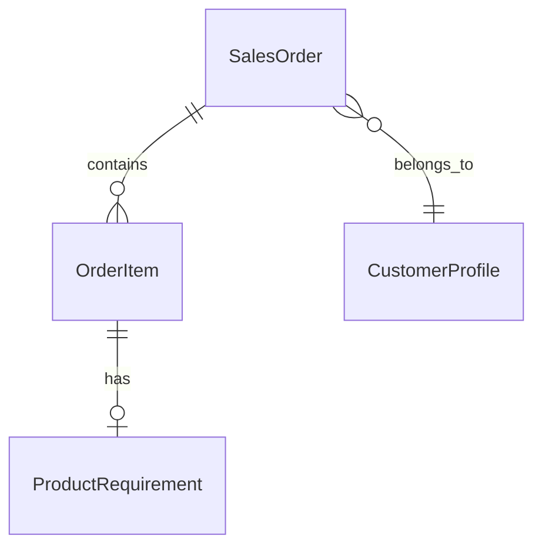
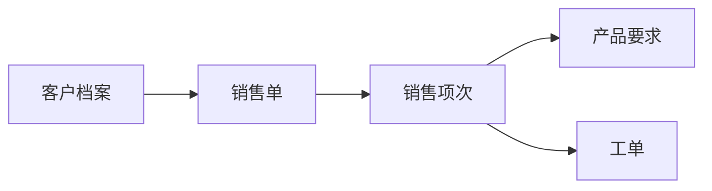
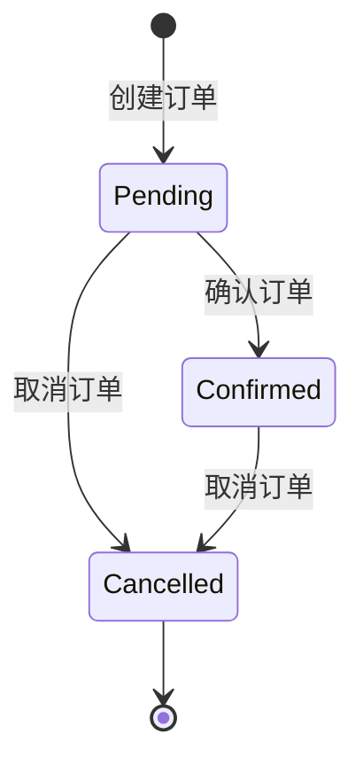

# 订单模块详细设计

> 版本：V1.19（2026-09-04）
> 状态：**已实施完成**。订单上下文自管实体 = SalesOrder / OrderItem / ProductRequirement / CustomerProfile（StandardGradeMapping 实归生产标准上下文、OrderDemandAdjustment 实归工单上下文，二者仅在本章实体清单作归属标注）。核心读模型 = OrderListSummary（④ 订单执行聚合 + 成品库存聚合 + 「订单接单·出库及现负荷汇总」折叠卡片）；订单成品实时库存 = 「订单成品(实时库存)」（PendingDeliveryQueryService，5 表 JOIN + Hybrid 查询 + 3 层缓存，供质保书创建页取数）。订单/客户 CRUD 与项次 save-all 单事务、打印走 `SalesOrderPrintHelper`；操作日志统一 `IOperationLogService` Module="Order"。

---

## 一、概述

本文档定义订单模块的详细设计，包括实体、核心流程、状态流转、业务规则等。

---

## 二、实体清单

| 实体 | 说明 |
|------|------|
| SalesOrder | 销售单 |
| OrderItem | 销售项次 |
| ProductRequirement | 产品要求 |
| CustomerProfile | 客户档案 |
| StandardGradeMapping | 牌号对照 ⚠️ **实归属于生产标准上下文管理** |
| OrderDemandAdjustment | 工单需求调整（催单/分批交货/主号暂停/强制完成标记，API/UI 与数据库实体均属工单上下文，`MES.Data.Entities.WorkOrder`） |

### 2.1 实体关系图



---

## 三、核心流程



### 3.1 流程说明

| 步骤 | 操作 | 角色 | 说明 |
|------|------|------|------|
| 1 | 创建客户档案 | 订单主任/管理员 | 客户信息维护 |
| 2 | 创建销售单 | 订单主任 | 录入订单基本信息 |
| 3 | 添加销售项次 | 订单主任 | 录入产品规格、数量、重量 |
| 4 | 配置产品要求 | 订单主任 | 技术要求配置 |
| 5 | 手工生成工单 | 工单主任 | 在工单模块手动操作（已实现）；订单确认后自动生成工单功能规划中 |

---

## 四、状态流转

### 4.1 订单状态



| 状态 | 英文 | 说明 |
|------|------|------|
| 待处理 | Pending | 初始状态，意向合同 |
| 已确认 | Confirmed | 合同生效 |
| 已取消 | Cancelled | 合同取消（终态） |

### 4.2 状态流转规则

| 当前状态 | 允许变更到的状态 | 权限 |
|----------|------------------|------|
| Pending | Confirmed, Cancelled | OrderEditor/OrderFull/Admin, Admin |
| Confirmed | Cancelled | OrderEditor/OrderFull/Admin, Admin |
| Cancelled | 无（终态） | - |

---

## 五、业务规则

### 5.1 订单号规则

| 项目 | 规则 |
|------|------|
| 格式 | 11位字符 |
| 唯一性 | 全局唯一 |
| 生成方式 | 用户手动输入 |

### 5.2 项次号规则

| 项目 | 规则 |
|------|------|
| 生成方式 | 系统自动生成 |
| 起始值 | 从 1 开始 |
| 递增规则 | 同一订单内依次递增 |
| 删除后处理 | 不重新排序，保留原项次号 |

### 5.3 规格生成规则

| 项目 | 规则 |
|------|------|
| 格式 | `{外径}*{壁厚}` |
| 小数处理 | 保留原有小数位 |

**示例：**

| 外径 | 壁厚 | 生成的规格 |
|------|------|-----------|
| 76 | 5 | 76*5 |
| 76 | 5.5 | 76*5.5 |
| 76.5 | 5.25 | 76.5*5.25 |

### 5.4 理算重量计算规则

**公式：**

```
理算重量 = 密度 × 3.1416 × 壁厚有效值 × (外径有效值 - 壁厚有效值) × 米数 / 1000
```

**参数计算：**

| 参数 | 公式 |
|------|------|
| 壁厚有效值 | 壁厚 - 0.5 × 壁厚负差 + 0.5 × 壁厚正差 |
| 外径有效值 | 外径 - 0.5 × 外径负差 + 0.5 × 外径正差 |

**米数计算规则：**

| 长度状态 | 米数来源 | 公式 |
|----------|----------|------|
| Fixed（定尺） | 系统自动计算 | MaxLength × 支数 / 1000 |
| Range（范围尺） | 手工录入 | 用户输入的 Meters |
| NonFixed（非定尺） | 手工录入 | 用户输入的 Meters |

**边界处理：**

| 场景 | 处理规则 |
|------|----------|
| 计算结果为负数 | 设为 0 |
| 米数或支数为空 | 理算重量计算结果为 0 |
| 保留小数位数 | 2位 |

### 5.5 牌号对照规则

| 项目 | 规则 |
|------|------|
| 触发时机 | 用户选择 StandardGrade 时 |
| 自动填充字段 | PlantGrade（工厂牌号）、Density（密度） |
| 数据来源 | StandardGradeMapping 表 |
| 牌号不存在 | 拒绝创建订单，提示用户 |

### 5.6 长度验证规则

| 长度状态 | MinLength | MaxLength |
|----------|-----------|-----------|
| Fixed（定尺） | 必填 > 0 | 等于 MinLength |
| Range（范围尺） | 必填 > 0 | 必填 > 0 且 > MinLength |
| NonFixed（非定尺） | 不需要 | 不需要 |

### 5.7 更新与删除规则

| 状态 | 允许修改 | 允许删除 |
|------|----------|----------|
| Pending | ✅ | ✅ |
| Confirmed | ✅ | ✅ |
| Cancelled | ❌ | ❌ |

### 5.8 级联删除规则

| 操作 | 级联范围 |
|------|----------|
| 删除订单 | 同步物理删除所有 OrderItem 和 ProductRequirement |
| 删除项次 | 同步物理删除关联的 ProductRequirement |

> 注：ProductRequirement 不允许单独删除。

### 5.9 订单删除时自动清理工单与通知

- 当订单被物理删除时，系统自动执行以下操作：
  1. 物理删除该订单下的所有订单项次和产品要求
  2. 物理删除该订单下的所有工单
  3. 若有工单被清理，生成一条“订单删除通知”（记录订单号、清理工单数量）
- 该通知由工单模块负责展示和处理，订单模块仅负责生成。

### 5.10 添加同类项次/添加异类项次规则

**前端"添加异类项次"操作：**
- 创建一个全新的空项次，所有字段均为默认值/空值
- 项次号 = 当前最大项次号 + 1

**前端"添加同类项次"操作：**
- 复制列表中最后一项的以下字段：
  - 交货日期、延期罚款、结算方式、物料名称、标准号、交货状态
  - 标准牌号、外径、壁厚、外径公差、壁厚公差、长度状态
- 以下 6 个字段默认置 0（因为同类项次的长度/重量/数量需要全新计算）：
  - 最小长度、最大长度、支数、米数、合同重量、理算重量
- 项次号 = 当前最大项次号 + 1

> 注：`MES.Blazor/Pages/Orders/OrderDetail.razor` 编辑模式下，"添加同类项次" 会同时复制 Remark、StandardNo、PlantGrade、Density 字段。

### 5.11 合同重量与理算重量对比规则

在定尺（Fixed）模式下，提交前必须验证合同重量与理算重量的比值。验证在服务端执行（`ValidateContractWeightAgainstTheoreticalWeight`），不满足条件时抛出 `BusinessException` 强制阻止提交，而非前端确认弹窗：

| 条件 | 处理方式 |
|------|----------|
| 理算重量 ≤ 0 | 跳过对比校验（不阻止提交） |
| 合同重量 / 理算重量 < 94% | 服务端抛出 BusinessException：合同重量低于理算重量的94%，可能亏损，阻止提交 |
| 合同重量 / 理算重量 > 106% | 服务端抛出 BusinessException：合同重量高于理算重量的106%，阻止提交 |
| 94% ≤ 比值 ≤ 106% | 通过，无需提示 |

### 5.12 前端并行数据加载

创建页（Orders/OrderCreate.razor）和详情页（Orders/OrderDetail.razor）使用 `Task.WhenAll` 并行加载多个无依赖数据源：

| 页面 | 并行加载的数据 | 说明 |
|------|---------------|------|
| Orders/OrderCreate.razor | CustomerService.GetAllAsync() + StandardRegisterService.GetAllAsync + GradeMappingService.GetAllAsync | 客户、标准号、牌号对照三者无依赖 |
| Orders/OrderDetail.razor | StandardRegisterService.GetAllAsync + GradeMappingService.GetAllAsync + OrderService.GetByIdAsync + CustomerService.GetAllAsync() | 标准号、牌号对照、订单详情、客户四者无依赖 |

### 5.13 打印功能

**打印实现类：** `MES.Services/Printing/SalesOrderPrintHelper.cs`

- ProductRequirement 的 10 项成品检验项（PmiInspection/SurfaceInspection/Dimension/Endoscopy/HydrostaticTest/UnderwaterPressure/EddyCurrent/UltrasonicTest/PortColoring/RadiographicTest）为 `InspectionRequirementStage` 4 值枚举（None=「-」/FinalOnly=「终」/PreOnly=「预」/PreAndFinal=「预+终」）；理化 20 项 + ChemicalComposition 保持 bool。产品要求打印（SalesOrderPrintHelper）10 项走 StageText（EnumHelper.GetDisplayName），产品要求编辑（ProductRequirement.razor）用 MudSelect 4 选项。详见质量管理/计划排程上下文文档。

**后端端点：**

| 类型 | 端点 | 说明 |
|------|------|------|
| 单个/选中打印 | POST /api/order/print-file | 单个订单详情或选中订单批量 PDF（Id 集合） |
| 全部打印 | POST /api/order/print-all-file | 按筛选条件（关键词+技术要求+状态+排序）打印所有匹配订单 |
| 产品要求打印 | POST /api/order/{orderId}/requirements/print-file | 单个订单的产品要求 PDF |

**实现方式：** 使用 QuestPDF 生成 PDF，后端直接返回 PDF 二进制流，前端 `openPdfFromApi()` 通过 fetch 获取后以 Blob URL + iframe 覆盖层展示（与仓库模块打印方案一致）。

### 5.14 订单列表页聚合字段

订单首页（`/orders`）的列表中，从 OrderItem 明细聚合计算以下字段展示：

| 字段 | 计算方式 | 说明 |
|------|----------|------|
| 交期起始 | `MIN(OrderItem.DeliveryDate)` | 该订单所有项次中最早的交货日期 |
| 交期截止 | `MAX(OrderItem.DeliveryDate)` | 该订单所有项次中最晚的交货日期 |
| 延期罚款 | `ANY(OrderItem.DelayPenalty == true)` | 任一订单项次有延期罚款则显示"是" |
| 订单总重量 | `SUM(OrderItem.ContractWeight)` | 所有项次合同重量之和，取整显示 |
| 含项次数 | `COUNT(OrderItem.Id)` | 该订单的项次数量 |

**搜索支持：** 延期罚款字段支持搜索关键字"是"/"否"进行匹配。其余字段通过关键字模糊搜索（匹配订单号/客户名称等主表字段及聚合结果）。

**排序支持：** 以上5个聚合字段均支持点击表头升降序排列，后端使用 `GroupBy` + `Min/Max/Any/Sum/Count` 实现。

### 5.14.1 订单执行聚合（④ 订单执行 组）

订单首页（`/orders`）的「④ 订单执行」组（GroupKey=4）从 `WorkOrderExecutionSummary` 聚合写入 `OrderListSummary` 读模型（`OrderService.RefreshByOrderIdAsync`）：

| 字段 | 前端列名 | 计算方式 | 说明 |
|------|---------|----------|------|
| ScheduleStage | 执行关注 | 按同订单摘要优先级聚合：0主号暂停&gt;2原料锁定&gt;3生产执行&gt;4成品检验&gt;1主号完成 | null=未排产；与工单执行状况「主号关注」五档联动 |
| UrgencyLevel | 紧急性 | 取同订单最紧急，按 `UrgencyLevelKeys.All` 顺序 `Array.IndexOf` 取最小（勿用字典序 `.Min()`） | 存储英文 Key；纯主号完成（档1）订单为 null（主号完成不评估紧急性） |
| EstimatedCompletionDate | 预计完成 | 执行关注=1主号完成时取同订单 `WarehousingEndDate` 最大值；其余取 `EstimatedProcessCompletionDate` 最大值 | 档1反映实际入库完成时点（档1工单 EstimatedProcessCompletionDate 恒 null） |

**成品库存聚合（同组）：** 从订单下工单关联的 `InventoryBatch` 聚合（仅 `MaterialType=OrderFinished` 订单成品，`SpecialDeliveryStatus` 订成-非交付态不计入可交付成品）：

| 字段 | 前端列名 | 计算方式 | 说明 |
|------|---------|----------|------|
| FinishedInboundWeight | 成品入库重量 | 成品批次 `InitialWeight` 之和 | 与「成品入库」组入库口径一致 |
| FinishedOutboundWeight | 成品出库重量 | 仅 `OutboundType=SalesOut`（销售出库）的 `OutboundWeight` 之和 | 出库记录按成品批次 Id 过滤 |
| FinishedStockWeight | 成品库存重量 | 成品批次 `RemainingWeight` 之和 | 现库余量 |
| BusinessCompleted | 业务完结 | 主号完成(1) 且 有成品入库 且 库存清零 | 订单整体业务完结标记 |

**刷新触发：** 工单执行状况增量刷新（`RefreshByWorkOrderNosAsync` 内逐订单调用 `RefreshByOrderIdAsync`）与全量刷新（`RefreshAllAsync` 末尾连带）均更新此读模型；主号完成工单 UrgencyLevel 两条路径均置 null。

### 5.14.2 订单接单·出库及现负荷汇总（折叠卡片）

订单首页（`/orders`）工具栏「订单接单·出库及现负荷汇总」按钮切换的折叠卡片，样式仿「计划排程」→「原锁计划」→「待投料量汇总」卡片。表格结构 = 5 指标行 × 12 月列（本年 2026年1月~12月）：

| 行 | 数据源/口径 | 显示 |
|----|-----------|------|
| 接单量 | 本年签订、排除已取消订单的合同重量，按签订月份分布 | 全列显示 |
| 出库量 | 本年成品销售出库（`OutboundType=SalesOut` 且批次 `MaterialType=OrderFinished`）重量，按出库月份分布 | 全列显示 |
| 成品库存(完工) | 所有年份、排除已取消订单，执行关注 `ScheduleStage==1`（主号完成）的 `FinishedStockWeight` | 仅当前月列显示 |
| 成品库存(未完工) | 执行关注 `ScheduleStage<>1`（含 null）的 `FinishedStockWeight` | 仅当前月列显示 |
| 订单负荷量(实时) | 执行关注&lt;&gt;主号完成 的订单合同重量 − 成品库存(未完工) | 仅当前月列显示 |

- **单位**：吨(t)（源数据 kg，÷1000 保留 1 位小数）；**0 值显示「-」**；存量/负荷行非当前月列显示「-」。
- **数据端点**：`GET api/order/in-out-summary?year=`（懒加载，首次展开时请求当年）。
- **打印**：卡片标题右侧「打印」按钮，前端 `printRawHtml` 打印汇总表（数据未加载时按钮禁用）。

### 5.15 save-all 批量保存端点

| 项目 | 说明 |
|------|------|
| 端点 | `POST /api/order/{id}/save-all` |
| 角色 | OrderEditor/OrderFull/Admin |
| 功能 | 单事务完成订单头更新 + 全部项次增删改 |
| 请求体 | `SaveAllOrderRequest`（包含订单头更新信息和项次列表） |
| 事务保证 | 整个操作在单个数据库事务中执行，任一环节失败全部回滚 |
| 读模型刷新 | 事务提交后异步刷新工单列表读模型（WorkOrderListSummary），刷新操作在 `using (transaction) { }` 块之外执行，避免 `SqlTransaction completed` 异常 |
| 文件 | `MES.Core/DTOs/Order/SaveAllOrderRequest.cs`、`MES.Core/DTOs/Order/SaveAllOrderResponse.cs` |
| 控制器 | `MES.Api/Controllers/Order/OrderController.cs` — `SaveAll` 方法 |

### 5.16 订单成品(实时库存)查询（PendingDeliveryQueryService）

「订单成品(实时库存)」（原仓库上下文「待发货项」迁入更名，路由 `/orders/pending-delivery`）查询服务位于 `MES.Services/Order/PendingDeliveryQueryService.cs`（命名空间 `MES.Services.Order`，接口 `MES.Core.Interfaces.Order.IPendingDeliveryQueryService`），DTO 位于 `MES.Core/DTOs/Order/`，API 路径 `api/pending-delivery`。

#### 5.16.1 功能定位

**成品库待发货库存**的实时查询视图，不存储独立数据，通过 JOIN **InventoryBatch + SalesOrder + OrderItem + WorkOrder + WorkOrderExecutionSummary 5 张表**实时组装 `PendingDeliveryItemDto`。

**用途**：
- 订单管理 → 订单成品(实时库存)列表页（服务端分页 + ExcelFilter 筛选 + 入库日期范围 + 排序 + 打印）
- 质保书创建页 → 证书头选择（Step 1）+ 批次选择（Step 2）

#### 5.16.2 数据流（Hybrid 查询模式）

```
┌────────────────────────────────────────────────────────────────────┐
│ 1. SQL 层筛选（InventoryBatch）                                    │
│    MaterialType == OrderFinished（订单成品）                         │
│    AND (RemainingQuantity > 0 OR RemainingWeight > 0)              │
│    [可选] SalesOrderNo 精确过滤 / Keyword 匹配批次号/炉号/牌号/规格   │
│                              ↓                                     │
│ 2. 查 WorkOrder → 反推权威 SalesOrderNo + ProductionMainNo          │
│ 3. 查 SalesOrder → CustomerName / Salesman / EndCustomer            │
│ 4. 查 OrderItem → StandardNo / StandardGrade / DeliveryState        │
│    （按 OrderNumber|Sequence 复合键匹配）                            │
│ 5. 查 ProductionBatch → 补充炉号（当仓库 HeatNo 为空时）             │
│ 6. 查 WorkOrderExecutionSummary → 补充「工单关注」（主号-关注档位）   │
│ 7. 内存组装 DTO + Keyword 全字段内存匹配 + 入库日期范围 + ExcelFilter│
│ 8. 内存排序 + 分页                                                  │
└────────────────────────────────────────────────────────────────────┘
```

**为什么 Hybrid**：`CustomerName`/`ProductStandard`/`DeliveryStatus` 等字段来自 SalesOrder/OrderItem，非 InventoryBatch 实体字段，无法在 EF Core IQueryable 上直接跨表排序/筛选；待发货成品批次数量有限（几百～几千），全部加载内存可控。

**关键字段口径**：
- `SalesOrderNo` / `ProductionMainNo`：优先取批次字段，为空时通过 WorkOrder 反查（以 WorkOrder 为准）
- `HeatNo`：仓库字段为空时从 `ProductionBatch.SourceHeatNo` 反查
- `WorkOrderAttention`：按 WorkOrderNo 关联 WorkOrderExecutionSummary 读模型「主号-关注」档位（0 主号暂停/1 主号完成/2 原料锁定/3 生产执行/4 成品检验），无记录为 null
- `OrderItemIds` 不暴露，仅作内部解析「产品标准/标准等级/交货状态」的关联键（订单号|序列 复合键）

#### 5.16.3 缓存策略（3 层 MemoryCache）

| 层级 | CacheKey | 有效期 | 内容 |
|------|----------|--------|------|
| 第1层 | `PendingDeliveryQueryService:LoadDtos` | Sliding 5 分钟 | 已组装 DTO 全量 |
| 第2层 | 内部 key | Sliding 10 分钟 | InventoryBatch 原始成品批次 |
| 第3层 | 各批次标识符 MD5 复合 key | Sliding 30 分钟 | 跨表引用字段 |

- 第1层失效：**InventoryService 出库/入库操作时主动 `Remove(CacheKey)`**（`MES.Services/Warehouse/InventoryService.cs` 引用 `PendingDeliveryQueryService.CacheKey`）
- 待发货成品批次通常几百～几千，全量加载内存可控

#### 5.16.4 与质保书模块的集成

质保书创建页（`MES.Blazor/Pages/Quality/CertificateCreate.razor`）：
- Step 1 证书头选择：`GetHeaderOptionsAsync()` → DISTINCT（订单号+客户+标准+交货状态）
- Step 2 批次选择：`GetPendingItemsAsync(orderNo, std, status)` → 过滤后的可发货批次列表
- Step 3 编辑保存：`CertificateService.CreateAsync`（快照落地）

---

## 六、API 控制器

### 6.1 订单 API

| Controller | 路由前缀 | 文件 |
|-----------|---------|------|
| OrderController | `api/order` | `MES.Api/Controllers/Order/OrderController.cs` |

| 方法 | 路由 | 说明 |
|------|------|------|
| GET | `api/order/list` | 分页查询订单列表 |
| GET | `api/order/list-all` | 获取所有订单列表 |
| POST | `api/order/refresh` | 刷新读模型（前端无手动按钮，通过订单 CRUD / 项次 CRUD / 产品要求 CRUD / 客户信息变更自动增量触发） |
| GET | `api/order/{id}` | 获取订单详情 |
| GET | `api/order/by-number/{orderNo}` | 按订单号查询ID |
| POST | `api/order` | 创建订单 |
| PUT | `api/order/{id}` | 更新订单 |
| DELETE | `api/order/{id}` | 删除订单 |
| POST | `api/order/{id}/items` | 添加项次 |
| PUT | `api/order/{id}/items/{itemId}` | 更新项次 |
| DELETE | `api/order/{id}/items/{itemId}` | 删除项次 |
| POST | `api/order/{id}/save-all` | 批量保存订单头+项次 |
| POST | `api/order/print-file` | 单个/选中订单打印（PDF文件，直接返回） |
| POST | `api/order/print-all-file` | 按筛选条件打印全部订单（PDF文件，直接返回） |
| POST | `api/order/print-list-file` | 按可见列打印选中订单列表（PDF文件，直接返回） |
| POST | `api/order/{orderId}/requirements/print-file` | 打印订单技术要求（PDF文件，直接返回） |
| GET | `api/order/filter-contexts` | 筛选上下文 |
| GET | `api/order/in-out-summary?year=` | 订单接单·出库及现负荷汇总（本年按月 + 当前存量） |

### 6.2 客户 API

| Controller | 路由前缀 | 文件 |
|-----------|---------|------|
| CustomerController | `api/customer` | `MES.Api/Controllers/Order/CustomerController.cs` |

| 方法 | 路由 | 说明 |
|------|------|------|
| GET | `api/customer/list` | 分页查询客户列表 |
| GET | `api/customer/{id}` | 获取客户详情 |
| POST | `api/customer` | 创建客户 |
| PUT | `api/customer/{id}` | 更新客户 |
| DELETE | `api/customer/{id}` | 删除客户 |
| GET | `api/customer/select-list` | 客户下拉列表 |
| GET | `api/customer/filter-contexts` | 筛选上下文 |
| POST | `api/customer/print-batch-file` | 批量打印客户（PDF文件，直接返回） |
| POST | `api/customer/print-all-file` | 按筛选条件打印全部客户（PDF文件，直接返回） |

### 6.3 牌号对照 API

牌号对照（GradeMapping）API 归属**生产标准上下文**（`MES.Api/Controllers/StandardRegister/GradeMappingController.cs`，路由 `api/grade-mapping`），本模块不再提供端点，详见《生产标准上下文详细设计》。

### 6.4 产品要求 API

| Controller | 路由前缀 | 文件 |
|-----------|---------|------|
| ProductRequirementController | `api/order/{orderId}/items/{itemId}/requirement` | `MES.Api/Controllers/Order/ProductRequirementController.cs` |

| 方法 | 路由 | 说明 |
|------|------|------|
| GET | `api/order/{orderId}/items/{itemId}/requirement` | 获取指定项次的产品要求 |
| POST | `api/order/{orderId}/items/{itemId}/requirement` | 创建/更新项次的产品要求 |
| GET | `api/order/{orderId}/requirements` | 获取订单下所有项次的产品要求列表 |

### 6.5 工单需求调整 API（归属工单上下文）

工单需求调整（原销售催单）API 与页面归属**工单上下文**（`MES.Api/Controllers/WorkOrder/OrderDemandAdjustmentController.cs`，路由 `api/workorder-demand-adjustment`，页面 `/workorders-demand-adjustment`），端点/权限/五个手工字段（IsUrging/IsBatchDelivery/IsPaused/IsForceCompleted/AdjustmentRemark）详见工单上下文设计文档。数据库实体 `OrderDemandAdjustment` 亦在工单上下文（`MES.Data.Entities.WorkOrder`）；其 IsPaused/IsForceCompleted 在工单执行状况刷新（RefreshAllAsync/RefreshByWorkOrderNosAsync）时同步写入 `WorkOrderExecutionSummary.IsPaused`/`IsForceCompleted`，作为「主号关注」档0（主号暂停）/档1（主号完成，强制完成）判定依据。

### 6.6 订单成品(实时库存) API（PendingDeliveryController）

「订单成品(实时库存)」API 随视图整体自仓库上下文迁入订单上下文，API 路径保持 `api/pending-delivery`。

| Controller | 路由前缀 | 文件 |
|-----------|---------|------|
| PendingDeliveryController | `api/pending-delivery` | `MES.Api/Controllers/Order/PendingDeliveryController.cs` |

| 方法 | 路由 | 说明 | 权限 |
|------|------|------|------|
| GET | `api/pending-delivery/all` | 分页查询（含 Keyword/排序/ExcelFilter/入库日期范围） | `OrderView` |
| GET | `api/pending-delivery/header-options` | 证书头选择项（DISTINCT 订单号+客户+标准+交货状态） | `PendingDeliveryView` |
| GET | `api/pending-delivery/filter-contexts` | 筛选上下文（各列 DISTINCT 值） | `OrderView` |
| POST | `api/pending-delivery/print-file` | 打印选中行（PDF，标题「订单成品(实时库存)」） | `OrderView` |

**权限说明**：`all`/`filter-contexts`/`print-file` 跟随订单角色（`Roles.Policies.OrderView` = 订单+报表三档+Admin）；`header-options` 保留 `Roles.Policies.PendingDeliveryView`（订单 + 质量 数据源并集，供质保书创建页 Quality 角色调用）。

**页面**：`MES.Blazor/Pages/Orders/PendingDelivery.razor`，路由 `/orders/pending-delivery`，权限 `[Authorize(Roles = Roles.Policies.OrderView)]`，打印标题「订单成品(实时库存)」，持久化键 `orders_pending_delivery`。

---

## 七、操作日志规则

订单模块的操作日志由基础设施 `IOperationLogService` 统一管理，Module="Order"。

### 7.1 日志记录点

| 操作 | 触发方法 | 操作类型 | Detail 格式 |
|------|---------|---------|-------------|
| 创建订单 | `CreateAsync` | "创建" | `订单号=xxx, 客户=xxx` |
| 更新订单 | `UpdateAsync` | "变更" | 变化字段（`字段名=A→B, ...`） |
| 删除订单 | `DeleteAsync` | "删除" | `订单号=xxx` |
| 添加项次 | `AddItemAsync` | "变更" | `新增项次{序号}: 交货日期=xxx, 标准牌号=xxx, ...`（记录初始字段值） |
| 更新项次 | `UpdateItemAsync` | "变更" | `项次{序号}: 交货日期=A→B, 外径=C→D, ...`（仅记录变化字段） |
| 删除项次 | `DeleteItemAsync` | "变更" | `删除项次{序号}` |
| 批量保存 | `SaveAllAsync` | "变更" | 合并所有项次的变化字段 |

### 7.2 项次变更字段检测（14字段）

更新项次时，以下字段变更被检测并记录：

| # | 字段 | 中文名 |
|---|------|--------|
| 1 | DeliveryDate | 交货日期 |
| 2 | DeliveryState | 交货状态 |
| 3 | StandardGrade | 标准牌号 |
| 4 | OuterDiameter | 外径 |
| 5 | WallThickness | 壁厚 |
| 6 | OuterDiameterNegative | 外径下差 |
| 7 | OuterDiameterPositive | 外径上差 |
| 8 | WallThicknessNegative | 壁厚下差 |
| 9 | WallThicknessPositive | 壁厚上差 |
| 10 | LengthStatus | 长度状态 |
| 11 | MinLength | 最小长度 |
| 12 | MaxLength | 最大长度 |
| 13 | Quantity | 支数 |
| 14 | ContractWeight | 合同重量 |

**检测方式**：更新前从数据库读取旧值快照，调用 `SetOrderItemFields()` 更新实体后，逐一比较14个字段的旧值与新值，仅记录发生变化的字段，格式 `项次{序号}: 交货日期=2026-01-01→2026-02-01, 外径=76→89`。

### 7.3 详情页展示

订单详情页（`OrderDetail.razor`）底部包含可折叠的操作日志区块：
- 默认收起，点击"展开"加载
- 通过 `OrderService.GetOperationLogsAsync(Id)` 调用 `IOperationLogService.GetLogsAsync("Order", entityId)`
- 表格显示：操作类型（MudChip 着色）、详情、操作人、操作时间

---

## 八、涉及角色与权限

| 角色 | 读权限 | 写权限 |
|------|--------|--------|
| OrderViewer/OrderEditor/OrderFull/ReportViewer/ReportEditor/ReportFull/Admin | ✅ | ❌ |
| OrderEditor/OrderFull/Admin | ✅ | ✅ |
| Admin | ✅ | ✅ |

> **跨域组合策略**：`PendingDeliveryView` = **订单 + 质量**数据源并集。该策略仅用于订单成品(实时库存)的 `header-options` 端点，供质保书创建页 Quality 角色调用；其余端点跟随 `OrderView`。

---

## 十、总结

```yaml
已定义内容:
  - 5个实体 ✅
  - 实体关系图 ✅
  - 核心流程图 ✅
  - 订单状态流转 ✅
  - 10条业务规则（含同类/异类项次、合同重量验证、打印功能） ✅
  - 角色权限 ✅

一句话:
  - 订单模块已完成开发，
  - 本文档记录该模块的详细设计。
```