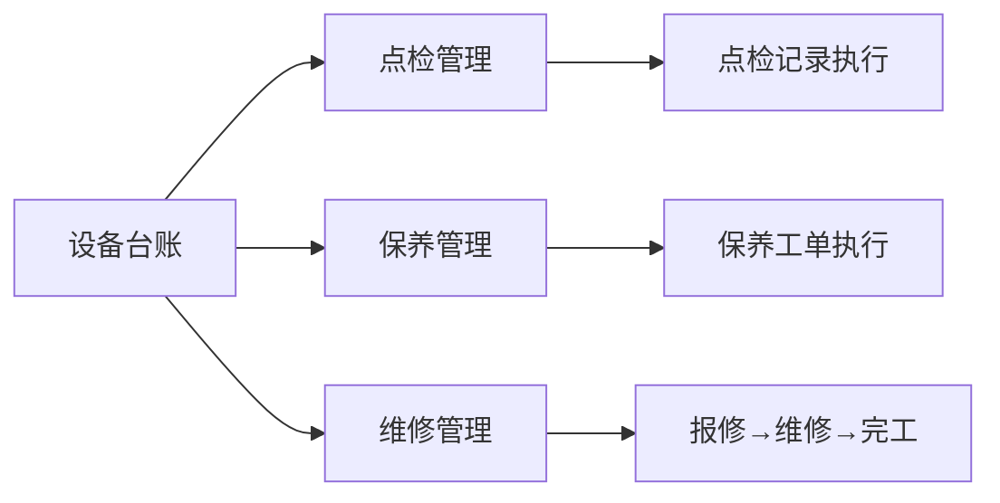
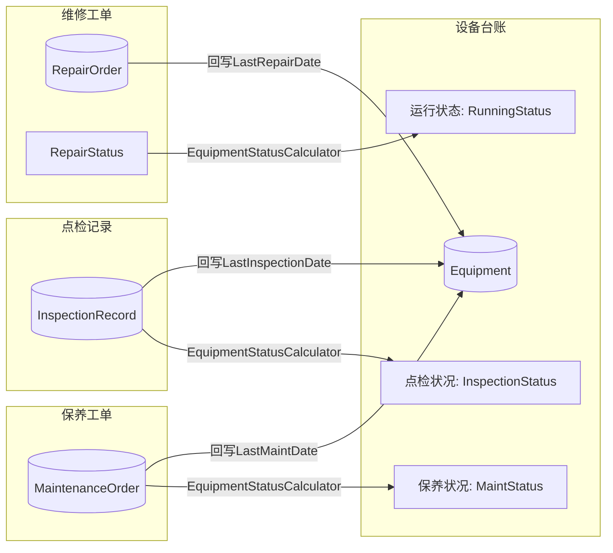

# 设备上下文详细设计

> 版本：V2.7（2026-09-16）
> 本次变更（V2.7）：**「设备维修」域整体放开为仅需登录**（纯文档同步，代码改动见同日批四十三）。§四 新增「页面授权口径」总表，明确设备管理域（台账/点检/保养）**仍受角色档控制**、维修域 5 页（含扫码页）**仅需登录**；后端 `api/repair-order` 11 个端点同步放开；另新增 `GET api/equipment/options`（仅登录、精简 DTO）供维修建单页设备下拉，`GET api/equipment/all` 保持 `EquipmentView` 不放宽。护栏测试 `EquipmentRepairAuthorizationTests`。
> 历史变更（V2.6）：**菜单正名跟随 —— 一级菜单「扫码管理」更名「扫码操作」并下沉至「系统参数」之后**（纯文档，无代码 / 接口 / 数据库变更）。修订 §4.11「导航入口」与 §7.3 文件清单注记；⭐ 顺带把正文中**已过时的 `AppMenu.cs` 行号**（原 `:150`）更正为现行 `:193`（设备扫码叶子）。⚠️ 路由 `/equipment-scan`、页面文件、`Scan*` 角色代码、「整组仅需登录」口径**一律不变**。
> 历史变更（V2.5）：**文档与代码对账（§4.9~§4.11 前端页须知 + §7.3 文件清单）**。① §4.9/§4.10 补 `**路由：**` 与页面文件路径，并把原「导航入口：MainLayout / MobileLayout 菜单」更正为实际形态 —— `/equipment-repair`、`/repair-execute` **不在任何菜单中**，仅由「设备扫码」页 `/equipment-scan`（扫码管理菜单）跳转携带 `?code=` 进入；② §4.11 补页面文件路径与 `**导航入口：** 扫码管理 → 设备扫码（AppMenu.cs:148）`；③ §7.3 文件清单补 `RepairExecute.razor(.cs)`、`EquipmentScan.razor(.cs)` 三行（原清单遗漏）。④ §3.1 EQ-005/EQ-006 点检·保养状态补 2 条遗漏分支（`EquipmentStatusCalculator.ComputeTaskStatus` 共 6 分支）：**无当前周期起始日 → Pending**、**周期内无记录且未逾期 → Pending**（原文只列 4 分支）。
> 历史版本（V2.4，2026-09-04）：设备维修管理模块落地。

> 状态：**已实施完成**。设备上下文 = 设备台账（Equipment）+ 点检记录（InspectionRecord）+ 保养工单（MaintenanceOrder）+ 维修工单（RepairOrder）+ 扫码报修/扫码维修/扫码设备三个移动端页（`/equipment-repair`、`/repair-execute`、`/equipment-scan`）。RunningStatus/InspectionStatus/MaintStatus 为 Equipment 物化字段，由 `EquipmentStatusCalculator` 在点检/保养/维修写操作后重算持久化；LastRepairDate/LastInspectionDate/LastMaintDate 由各工单/记录写操作回写。维修状态自动推导、`OtherRepairPersons` 独立字段多人协作；扫码页走 `ScanService.ResolveEquipmentAsync`。枚举一律英文存储、中文显示，经 `EnumHelper` + `EnumDisplayDefinition` 参数化；DataExchange 注册 4 实体。

---

## 一、概述

设备上下文涵盖设备全生命周期管理，包括设备主数据登记、日常点检执行、定期保养计划和维修工单管理。通过设备台账统一管理设备的基础信息，点检/保养/维修三个子模块围绕设备台账展开执行记录与状态跟踪。

**当前范围：**
- 设备台账（Equipment）：设备主数据的新建/编辑/查询/删除
- 点检记录（InspectionRecord）：日常点检执行记录
- 保养工单（MaintenanceOrder）：定期保养执行记录
- 维修工单（RepairOrder）：设备报修与维修全过程
- **扫码报修（EquipmentRepair）**：移动端扫码识别设备 → 选故障类型 → 提交生成维修工单
- **物化状态同步**：RunningStatus/InspectionStatus/MaintStatus 由 EquipmentStatusCalculator 在点检/保养/维修写操作后同步更新

---

## 二、核心流程

### 2.1 设备管理流程

### 2.2 维修工单流程

### 2.3 状态联动

> RunningStatus/InspectionStatus/MaintStatus 为 Equipment 实体物化存储字段，由 `EquipmentStatusCalculator` 统一管理；点检/保养/维修的写操作（创建/更新/删除）后自动重算并持久化。

---

## 三、业务规则

### 3.1 设备台账

| 规则ID | 规则说明 |
|--------|----------|
| EQ-001 | 设备编号（EquipmentCode）为用户手动输入，不自动生成 |
| EQ-002 | 设备生命周期状态（LifecycleStatus）为手工设置，可选：Active(在用)/Standby(备用)/Scrapped(报废) |
| EQ-003 | 设备作用类型（UsageType）为手工设置，可选：Primary(主生产设备)/Secondary(辅生产设备)/Other(其它) |
| EQ-004 | 运行状态（RunningStatus）为 Equipment 实体物化存储字段，由 EquipmentStatusCalculator 根据最近维修工单状态自动计算：无维修记录或最新工单已完工→Normal；最新工单进行中→InProgress；最新工单待维修→Pending |
| EQ-005 | 点检状况（InspectionStatus）为 Equipment 实体物化存储字段，由 EquipmentStatusCalculator 根据点检周期和实际执行日期自动计算（`ComputeTaskStatus`，共 6 分支）：NeedInspection=false→NotApplicable；**无当前周期起始日→Pending**；当前周期未开始（today<起始日）→Normal；当前周期内有记录→Normal；已逾期（today>周期末日）→Overdue；**周期内无记录且未逾期→Pending** |
| EQ-006 | 保养状况（MaintStatus）为 Equipment 实体物化存储字段，由 EquipmentStatusCalculator 根据保养周期和实际执行日期自动计算：规则同 InspectionStatus（复用同一 `ComputeTaskStatus`） |
| EQ-007 | 最近维修日期（LastRepairDate）由维修工单的回写触发自动更新 |
| EQ-008 | 最近点检日期（LastInspectionDate）由点检记录的回写触发自动更新 |
| EQ-009 | 最近保养日期（LastMaintDate）由保养工单的回写触发自动更新 |

### 3.2 点检记录

| 规则ID | 规则说明 |
|--------|----------|
| IR-001 | 点检记录编号格式：DJ-YYYYMMDD-XXX（按日自增） |
| IR-002 | 创建/更新点检记录时，自动回写 Equipment 的 LastInspectionDate |
| IR-003 | 点检记录支持单条创建和批量创建 |
| IR-004 | 删除点检记录后，Equipment 的 LastInspectionDate 不会恢复 |

### 3.3 保养工单

| 规则ID | 规则说明 |
|--------|----------|
| MO-001 | 保养工单编号格式：BY-YYYYMMDD-XXX（按日自增） |
| MO-002 | 创建/更新保养工单时，自动回写 Equipment 的 LastMaintDate |
| MO-003 | 保养工单支持单条创建和批量创建 |
| MO-004 | 删除保养工单后，Equipment 的 LastMaintDate 不会恢复 |

### 3.4 维修工单

| 规则ID | 规则说明 |
|--------|----------|
| RO-001 | 维修工单编号格式：WX-YYYYMMDD-XXX（按日自增） |
| RO-002 | 维修状态（RepairStatus）自动推导：RepairEndTime 不为空→Completed, RepairStartTime 不为空且 RepairEndTime 为空→InProgress, 均为空→Pending |
| RO-003 | 创建/更新维修工单时，自动回写 Equipment 的 LastRepairDate |
| RO-004 | 维修工单支持单条创建和批量创建 |
| RO-005 | 删除维修工单后，Equipment 的 LastRepairDate 不会恢复 |
| RO-006 | 维修工单使用部分更新模式（UpdateRepairOrderRequest 所有字段为可空） |
| RO-007 | 维修类别（RepairCategory）：厂内维修/外协维修/换模，完成维修时设置 |
| RO-008 | 维修执行：开始维修→设置维修人和开始时间（状态→InProgress）；完成维修→填写维修类别/内容/备件/其它维修人（状态→Completed） |
| RO-009 | 多人协作：其它维修人存入独立 OtherRepairPersons 字段（逗号分隔） |

---

## 四、页面设计

> **⚠️ 页面授权口径（2026-09-16 起「设备维修」域整体仅需登录）**
>
> 设备上下文按**业务域**分两套授权，勿混：
>
> | 域 | 页面 | 页面级授权 |
> |---|---|---|
> | 设备管理 | `/equipment`、`/equipment/create`、`/inspection-records`、`/inspection-records/create`、`/maintenance-orders`、`/maintenance-orders/create` | 读 `EquipmentView`／写 `EquipmentEdit`／删 `EquipmentDelete`（**仍受控**） |
> | **设备维修** | `/equipment-scan`、`/equipment-repair`、`/repair-execute`、`/repair-orders`、`/repair-orders/create` | **仅需登录 `[Authorize]`** |
>
> 理由：维修域是「设备扫码」链路的落地形态（扫码 → 报修 / 扫码 → 维修 / 扫码 → 工单列表），
> 现场一线岗位账号只配 Scan 档，挂设备档会出现「进得了扫码页却干不了活」。后端 `api/repair-order` 11 个端点同步放开。
> 操作人身份由页面内实名选择约束，不由角色约束（同 8 类扫码报工链口径）。
> 建单页设备下拉走 `GET api/equipment/options`（仅登录、精简 DTO），`GET api/equipment/all` 保持 `EquipmentView` 不放宽。
> 护栏测试：`MES.Tests/Controllers/EquipmentRepairAuthorizationTests.cs`。

### 4.1 设备台账列表页

**路由：** `/equipment`

**功能：** 设备台账列表，支持搜索、筛选、内联编辑、打印。

**筛选条件：**

| 筛选条件 | 说明 |
|----------|------|
| 搜索框 | 模糊搜索设备编号/名称/型号/制造商 |
| 列头筛选 | 各列支持 ExcelFilter 多选筛选（生命周期/作用类型/运行状态/点检状况/保养状况/所在区域/关联工段等） |

**表格列：** 设备编号、设备名称、型号规格、所在区域、生命周期、作用类型、运行状态、点检状况、保养状况、操作

**操作列：** 打印、取消（删除）

**页面功能：**
- ✅ 全宽布局（MudContainer MaxWidth="MaxWidth.False"）
- ✅ 列选择器（动态列渲染）
- ✅ 服务端分页+排序
- ✅ 内联编辑（敲 Enter 切换编辑模式/保存）
- ✅ 多选+批量打印
- ✅ 方向键导航（#equipment-list-table）

### 4.2 设备台账详情/编辑页

**路由：** `/equipment/create`

**功能：** 设备台账详情查看与编辑，支持表格模式创建。

**区块：**
- Block A：设备信息（设备编号、设备名称、型号规格、技术参数、制造商、安装日期、所在区域、关联工段、备注）
- Block B：点检参数（是否需点检、点检负责人、点检周期、本次点检日起始）
- Block C：保养参数（是否需保养、保养负责人、保养周期、本次保养日起始）
- Block D：状态字段（生命周期、作用类型）

### 4.3 点检记录列表页

**路由：** `/inspection-records`

**功能：** 点检记录列表，支持搜索、筛选、内联编辑、批量打印。

**筛选条件：**

| 筛选条件 | 说明 |
|----------|------|
| 搜索框 | 模糊搜索记录编号/设备名称 |
| 列头筛选 | 各列支持 ExcelFilter 多选筛选（设备名称/所在区域等） |

**表格列：** 记录编号、设备名称、设备编号、所在区域、实际日期、点检人、执行简述、备注、操作

**操作列：** 打印、取消（删除）

### 4.4 点检记录创建页

**路由：** `/inspection-records/create`

**功能：** 以表格模式批量创建点检记录。

### 4.5 保养工单列表页

**路由：** `/maintenance-orders`

**功能：** 保养工单列表，支持搜索、筛选、内联编辑、批量打印。

**筛选条件：**

| 筛选条件 | 说明 |
|----------|------|
| 搜索框 | 模糊搜索工单编号/设备名称 |
| 列头筛选 | 各列支持 ExcelFilter 多选筛选（设备名称/所在区域等） |

**表格列：** 工单编号、设备名称、设备编号、所在区域、实际日期、执行人、执行简述、备注、操作

### 4.6 保养工单创建页

**路由：** `/maintenance-orders/create`

**功能：** 以表格模式批量创建保养工单。

### 4.7 维修工单列表页

**路由：** `/repair-orders`

**功能：** 维修工单列表，支持搜索、筛选、内联编辑、批量打印。

**筛选条件：**

| 筛选条件 | 说明 |
|----------|------|
| 搜索框 | 模糊搜索工单编号/设备名称/故障描述 |
| 列头筛选 | 各列支持 ExcelFilter 多选筛选（设备名称/维修状态/优先级等） |

**表格列：** 工单编号、设备名称、所在区域、设备编号、故障描述、故障类型、优先级、维修状态、报修人、报修时间、维修人、维修类别、开始时间、完成时间、维修内容、更换备件、操作

### 4.8 维修工单创建页

**路由：** `/repair-orders/create`

**功能：** 以表格模式批量创建维修工单。

### 4.9 扫码报修页

**路由：** `/equipment-repair`（`Pages/Equipment/EquipmentRepair.razor(.cs)`）

**入口：** **不在任何菜单中** —— 由「设备扫码」页 `/equipment-scan` 解析出设备后点「报修」按钮跳转，携带 `?code={设备编号}` 自动解析（`EquipmentScan.razor.cs:112`）。直接打开本页则从扫码步骤开始。

**页面状态：** 3 步流程

| 步骤 | 状态 | 说明 |
|------|------|------|
| 扫码 | Scan | 摄像头扫码或手动输入设备编码 → 调用 `ScanService.ResolveEquipmentAsync(code)` 解析设备 |
| 填写 | Form | 显示设备摘要信息 → 自动填充报修人（从 localStorage 的 userFullName/userName 读取，非 JWT）→ 选择故障类型 → 可选填写故障描述 → 提交 |
| 成功 | Success | 显示报修成功 + 工单编号 → 继续报修/返回 |

**故障类型：** 机械故障/电气故障/液压故障/气动故障/仪表故障/其它

**提交逻辑：** `POST /api/repair-order` → 创建 `RepairOrder` 实体，状态自动设为 Pending

**设计要点：**
- 全移动端适配（PWA），摄像头扫码使用 `scanner.js`（BarcodeDetector + jsQR 双引擎）
- 报修人从 localStorage 的 userFullName/userName 自动读取，无需手动填写
- 故障类型使用 MudGrid 按钮组快速选择，替代下拉列表
- 提交后自动生成维修工单编号（格式：WX-YYYYMMDD-XXX）

### 4.10 扫码维修页

**路由：** `/repair-execute`（`Pages/Equipment/RepairExecute.razor(.cs)`）

**入口：** **不在任何菜单中** —— 由「设备扫码」页 `/equipment-scan` 解析出设备后点「维修」按钮跳转，携带 `?code={设备编号}` 自动解析。直接打开本页则从扫码步骤开始。

**页面状态：** 3 步流程

| 步骤 | 状态 | 说明 |
|------|------|------|
| 扫码 | Scan | 摄像头扫码或手动输入设备编码 → 调用 `ScanService.ResolveEquipmentAsync(code)` 解析设备 |
| 查看 | Review | 显示设备摘要 + 待处理维修工单列表 |
| 成功 | Success | 显示操作结果 → 继续维修/返回 |

**核心流程：**

1. 扫描设备 → 调用 `GET /api/repair-order/by-equipment/{equipmentId}` 查询该设备所有未完成工单
2. 待维修工单 → 点击"开始维修" → `PUT /api/repair-order/{id}/start` → 设置维修人、开始时间，状态→InProgress
3. 维修中工单 → 自动选中 → 填写维修类别（厂内维修/外协维修/换模三选一）、维修内容、备件、其它维修人 → `PUT /api/repair-order/{id}/complete` → 状态→Completed

**维修类别选择：** 按钮组三选一，可取消选中（再次点击），位于"维修内容"上方。

**多人协作：** 在"其它维修人"输入框输入姓名，以 MudChip 展示，支持删除。完成维修时存入独立 OtherRepairPersons 字段（逗号分隔）。

**导航入口：** **不在任何菜单中** —— 由「设备扫码」页 `/equipment-scan` 解析出设备后点「维修」按钮跳转，携带 `?code={设备编号}` 自动解析（`EquipmentScan.razor.cs:118`）。

### 4.11 扫码设备页

**路由：** `/equipment-scan`

**页面文件：** `MES.Blazor/Pages/Equipment/EquipmentScan.razor(.cs)`

**导航入口：** 扫码操作 → **设备扫码**（`MES.Blazor/Shared/AppMenu.cs:193`，整组仅需登录；2026-09-16 原「扫码管理」更名并下沉至「系统参数」之后）。本页是三个设备扫码页的**唯一菜单入口**，解析出设备后提供「报修」（→ `/equipment-repair?code=`）、「维修」（→ `/repair-execute?code=`）、「维修工单列表」（→ `/repair-orders`）三个跳转。

**功能说明：** 扫描设备编码快速查看设备台账信息。支持摄像头扫码或手动输入设备编码，解析后显示设备详细信息、点检/保养/维修状态等。

---

## 五、前端组件映射

| 字段类型 | 组件 | 参数 |
|----------|------|------|
| 字符串（必填） | MudTextField\<string\> | Dense, Variant.Outlined, Size.Small |
| 字符串（可空） | MudTextField\<string\> | 同上 |
| 布尔值 | MudCheckBox | - |
| 整数 | MudNumericField\<int\> | HideSpinButtons="true" |
| 日期 | MudTextField\<string\> | 配合 DateTime.TryParse |
| 数值 | MudNumericField\<decimal?\> | Format="G29", HideSpinButtons="true" |

---

## 六、数据工具（DataExchange）支持

| 实体 | 实体Key | 主键 | 导入顺序 | 特殊处理 |
|------|---------|------|----------|----------|
| Equipment | Equipment | EquipmentCode | 1 | LifecycleStatus/UsageType 为枚举字段，导出导入自动中文转换 |
| RepairOrder | RepairOrder | RepairOrderNo | 2 | 通过 EquipmentCode 查找 FK；Priority/RepairStatus 为枚举字段 |
| MaintenanceOrder | MaintenanceOrder | MaintOrderNo | 2 | 通过 EquipmentCode 查找 FK |
| InspectionRecord | InspectionRecord | RecordNo | 2 | 通过 EquipmentCode 查找 FK |

> **枚举中英/显示参数化：** 设备上下文枚举（LifecycleStatus/UsageType/RunningStatus/EquipmentTaskStatus/RepairPriority/RepairOrderStatus）后端存储一律英文枚举名，前端显示、打印、DataExchange 导入导出一律中文，经 `EnumHelper.GetDisplayName/Parse` 中英互转并由 `EnumDisplayDefinition` 配置表参数化（覆盖优先，未配置回退静态字典）。

---

## 七、文件清单

### 7.1 后端（MES.Data / MES.Core / MES.Services）

| 文件 | 说明 |
|------|------|
| MES.Data/Entities/Equipment/Equipment.cs | 设备台账实体 |
| MES.Data/Entities/Equipment/InspectionRecord.cs | 点检记录实体 |
| MES.Data/Entities/Equipment/MaintenanceOrder.cs | 保养工单实体 |
| MES.Data/Entities/Equipment/RepairOrder.cs | 维修工单实体 |
| MES.Core/DTOs/Equipment/EquipmentDto.cs | 设备DTO（List/Detail/Create/Update/Print） |
| MES.Core/DTOs/Infrastructure/ScanEquipmentResolveResultDto.cs | 设备扫码解析结果DTO |
| MES.Core/DTOs/Equipment/InspectionRecordDto.cs | 点检记录DTO |
| MES.Core/DTOs/Equipment/MaintenanceOrderDto.cs | 保养工单DTO |
| MES.Core/DTOs/Equipment/RepairOrderDto.cs | 维修工单DTO |
| MES.Core/DTOs/Equipment/EquipmentQueryParams.cs | 设备查询参数 |
| MES.Core/DTOs/Equipment/InspectionRecordQueryParams.cs | 点检记录查询参数 |
| MES.Core/DTOs/Equipment/MaintenanceOrderQueryParams.cs | 保养工单查询参数 |
| MES.Core/DTOs/Equipment/RepairOrderQueryParams.cs | 维修工单查询参数 |
| MES.Core/Interfaces/Equipment/IEquipmentService.cs | 设备服务接口 |
| MES.Core/Interfaces/Equipment/IInspectionRecordService.cs | 点检记录服务接口 |
| MES.Core/Interfaces/Equipment/IMaintenanceOrderService.cs | 保养工单服务接口 |
| MES.Core/Interfaces/Equipment/IRepairOrderService.cs | 维修工单服务接口 |
| MES.Core/Enums/LifecycleStatus.cs | 生命周期枚举 |
| MES.Core/Enums/UsageType.cs | 作用类型枚举 |
| MES.Core/Enums/RunningStatus.cs | 运行状态枚举 |
| MES.Core/Enums/EquipmentTaskStatus.cs | 设备任务状态枚举（点检/保养状态） |
| MES.Core/Enums/RepairPriority.cs | 维修优先级枚举 |
| MES.Core/Enums/RepairOrderStatus.cs | 维修状态枚举 |
| MES.Services/Equipment/EquipmentService.cs | 设备服务实现（含状态计算） |
| MES.Services/Equipment/InspectionRecordService.cs | 点检记录服务实现 |
| MES.Services/Equipment/MaintenanceOrderService.cs | 保养工单服务实现 |
| MES.Services/Equipment/RepairOrderService.cs | 维修工单服务实现（含状态推导） |
| MES.Services/Helpers/EquipmentStatusCalculator.cs | 设备物化状态计算器（点检/保养/维修写操作后自动同步） |
| MES.Services/Printing/EquipmentPrintHelper.cs | 设备台账打印辅助 |
| MES.Services/Printing/InspectionRecordPrintHelper.cs | 点检记录打印辅助 |
| MES.Services/Printing/MaintenanceOrderPrintHelper.cs | 保养工单打印辅助 |
| MES.Services/Printing/RepairOrderPrintHelper.cs | 维修工单打印辅助 |

### 7.2 API控制器（MES.Api）

| 文件 | 说明 |
|------|------|
| MES.Api/Controllers/Equipment/EquipmentController.cs | 设备台账API |
| MES.Api/Controllers/Equipment/InspectionRecordController.cs | 点检记录API |
| MES.Api/Controllers/Equipment/MaintenanceOrderController.cs | 保养工单API |
| MES.Api/Controllers/Equipment/RepairOrderController.cs | 维修工单API |
| MES.Api/Controllers/Infrastructure/ScanController.cs | 扫码解析API（含设备扫码解析端点） |

### 7.3 前端（MES.Blazor）

| 文件 | 说明 |
|------|------|
| MES.Blazor/Pages/Equipment/Equipments.razor | 设备台账列表页 |
| MES.Blazor/Pages/Equipment/EquipmentCreate.razor | 设备台账创建/编辑页 |
| **MES.Blazor/Pages/Equipment/EquipmentRepair.razor** | **扫码报修页面（移动端，3 步流程，路由 `/equipment-repair`）** |
| **MES.Blazor/Pages/Equipment/EquipmentRepair.razor.cs** | **扫码报修页面代码后置** |
| MES.Blazor/Pages/Equipment/RepairExecute.razor | 维修执行页（路由 `/repair-execute`） |
| MES.Blazor/Pages/Equipment/RepairExecute.razor.cs | 维修执行页代码后置 |
| MES.Blazor/Pages/Equipment/EquipmentScan.razor | 设备扫码入口页（路由 `/equipment-scan`，扫码操作菜单） |
| MES.Blazor/Pages/Equipment/EquipmentScan.razor.cs | 设备扫码入口页代码后置 |
| MES.Blazor/Pages/Equipment/InspectionRecords.razor | 点检记录列表页 |
| MES.Blazor/Pages/Equipment/InspectionRecordCreate.razor | 点检记录创建页 |
| MES.Blazor/Pages/Equipment/MaintenanceOrders.razor | 保养工单列表页 |
| MES.Blazor/Pages/Equipment/MaintenanceOrderCreate.razor | 保养工单创建页 |
| MES.Blazor/Pages/Equipment/RepairOrders.razor | 维修工单列表页 |
| MES.Blazor/Pages/Equipment/RepairOrderCreate.razor | 维修工单创建页 |
| MES.Blazor/Services/Equipment/EquipmentService.cs | 设备前端服务 |
| MES.Blazor/Services/Equipment/InspectionRecordService.cs | 点检前端服务 |
| MES.Blazor/Services/Equipment/MaintenanceOrderService.cs | 保养前端服务 |
| MES.Blazor/Services/Equipment/RepairOrderService.cs | 维修前端服务 |
| MES.Blazor/Services/Common/ScanService.cs | 扫码解析服务（含 `ResolveEquipmentAsync` 设备扫码解析） |

